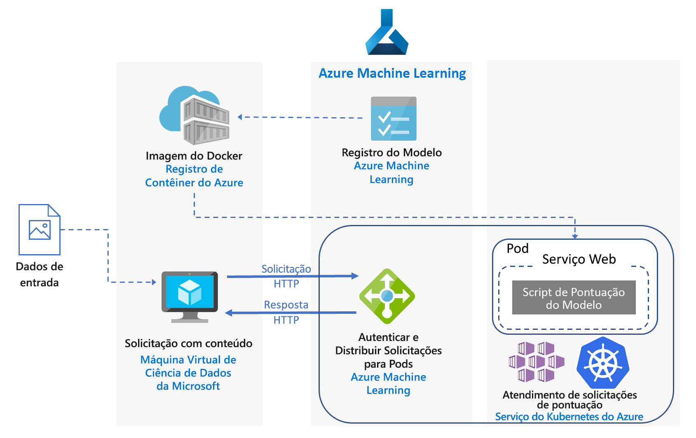
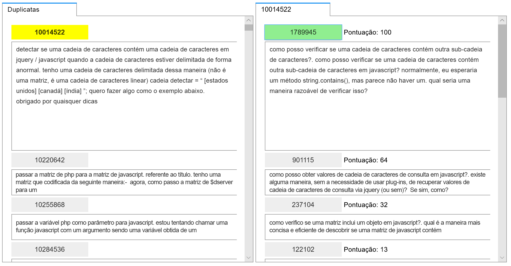
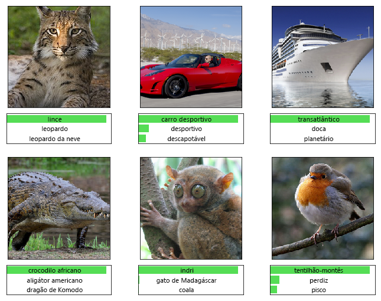

# Pontuação em tempo real de Python Scikit-Learn e modelos de aprendizado profundo (deep learning) no AzureReal-time scoring of Python Scikit-Learn and Deep Learning Models on Azure

Essa arquitetura de referência mostra como implantar modelos de Python como serviços Web para fazer previsões em tempo real.This reference architecture shows how to deploy Python models as web services to make real-time predictions. Dois cenários são abordados: implantar modelos de Python normais e os requisitos específicos de implantação de modelos de aprendizado profundo.Two scenarios are covered: deploying regular Python models, and the specific requirements of deploying deep learning models. Ambos os cenários usam a arquitetura mostrada.Both scenarios use the architecture shown.

Duas implementações de referência para essa arquitetura estão disponíveis no GitHub, uma para [modelos normais de Python][github-python] e outro para [modelos de aprendizado profundo][github-dl].Two reference implementations for this architecture are available on GitHub, one for [regular Python models][github-python] and one for [deep learning models][github-dl].

## CenáriosScenarios

As implementações de referência demonstram dois cenários usando essa arquitetura.The reference implementations demonstrate two scenarios using this architecture.

**Cenário 1: Correspondência de perguntas frequentes**.**Scenario 1: FAQ matching**. Este cenário mostra como implantar um modelo de correspondência de perguntas frequentes (FAQ) como um serviço Web para fornecer previsões para as perguntas do usuário.This scenario shows how to deploy a frequently asked questions (FAQ) matching model as a web service to provide predictions for user questions. Para este cenário, os “Dados de entrada” no diagrama da arquitetura referem-se a cadeias de caracteres de texto contendo perguntas do usuário que devem ser associadas a uma lista de perguntas frequentes.For this scenario, "Input Data" in the architecture diagram refers to text strings containing user questions to match with a list of FAQs. Esse cenário foi desenvolvido para a biblioteca de Machine Learning [scikit-learn][scikit] para Python, mas pode ser generalizada para qualquer cenário que use modelos de Python para fazer previsões em tempo real.This scenario is designed for the [scikit-learn][scikit] machine learning library for Python, but can be generalized to any scenario that uses Python models to make real-time predictions.

Esse cenário usa um subconjunto dos dados de pergunta do Stack Overflow que inclui perguntas originais marcadas como JavaScript, suas perguntas duplicadas e suas respostas.This scenario uses a subset of Stack Overflow question data that includes original questions tagged as JavaScript, their duplicate questions, and their answers. Ele treina um pipeline de scikit-learn para prever a probabilidade de correspondência de uma pergunta duplicada com cada uma das perguntas originais.It trains a scikit-learn pipeline to predict the match probability of a duplicate question with each of the original questions. Essas previsões são feitas em tempo real usando um ponto de extremidade de API REST.These predictions are made in real time using a REST API  endpoint.

O fluxo de aplicativo para essa arquitetura é o seguinte:The application flow for this architecture is as follows:

1.  O cliente envia uma solicitação HTTP POST com os dados codificados da pergunta.The client sends an HTTP POST request with the encoded question data.

2.  O aplicativo Flask extrai a pergunta da solicitação.The Flask app extracts the question from the request.

3.  A questão é enviada para o modelo de pipeline de scikit-learn para personalização e pontuação.The question is sent to the scikit-learn pipeline model for featurization and scoring.

4.  As perguntas mais frequentes correspondentes às suas pontuações são redirecionadas para um objeto JSON e retornadas ao cliente.The matching FAQ questions with their scores are piped into a JSON object and returned to the client.

Aqui está uma captura de tela do aplicativo de exemplo que consome os resultados:Here is a screenshot of the example app that consumes the results:

**Cenário 2: Classificação de imagens.****Scenario 2: Image classification.** Este cenário mostra como implantar um modelo de Rede Neural Convolucional (CNN) como um serviço Web para fornecer previsões em imagens.This scenario shows how to deploy a Convolutional Neural Network (CNN) model as a web service to provide predictions on images. Para este cenário, os “Dados de entrada” no diagrama da arquitetura referem-se aos arquivos de imagem.For this scenario, "Input Data" in the architecture diagram refers to image files. CNNs são muito eficazes em pesquisa visual computacional para tarefas como classificação de imagem e detecção de objetos.CNNs are very effective in computer vision for tasks such as image classification and object detection. Este cenário foi desenvolvido para as estruturas TensorFlow, Keras (com back-end do TensorFlow) e PyTorch.This scenario is designed for the frameworks TensorFlow, Keras (with the TensorFlow back end), and PyTorch. No entanto, ele pode ser generalizado para qualquer cenário que use modelos de aprendizado profundo para fazer previsões em tempo real.However, it can be generalized to any scenario that uses deep learning models to make real-time predictions.

Esse cenário usa um modelo ResNet-152 pré-treinado no conjunto de dados ImageNet-1K (1.000 classes) para prever a qual categoria (veja a figura abaixo) uma imagem pertence.This scenario uses a pre-trained ResNet-152 model trained on ImageNet-1K (1,000 classes) dataset to predict which category (see figure below) an image belongs to. Essas previsões são feitas em tempo real usando um ponto de extremidade da API REST.These predictions are made in real time using a REST API endpoint.

O fluxo do aplicativo para o modelo de aprendizado profundo é o seguinte:The application flow for the deep learning model is as follows:

1.  O cliente envia uma solicitação HTTP POST com os dados de imagem codificados.The client sends an HTTP POST request with the encoded image data.

2.  O aplicativo Flask extrai a imagem da solicitação.The Flask app extracts the image from the request.

3.  A imagem é pré-processada e enviada para o modelo de pontuação.The image is preprocessed and sent to the model for scoring.

4.  O resultado da pontuação é redirecionado para um objeto JSON e retornado ao cliente.The scoring result is piped into a JSON object and returned to the client.

## ArquiteturaArchitecture

Essa arquitetura é formada pelos componentes a seguir.This architecture consists of the following components.

**[Máquina virtual][vm]** (VM).**[Virtual machine][vm]** (VM). A VM é mostrada como um exemplo de um dispositivo &mdash; local ou na nuvem &mdash; que pode enviar uma solicitação HTTP.The VM is shown as an example of a device &mdash; local or in the cloud &mdash; that can send an HTTP request.

O **[Serviço de Kubernetes do Azure][aks]** (AKS) é usado para implantar o aplicativo em um cluster Kubernetes.**[Azure Kubernetes Service][aks]** (AKS) is used to deploy the application on a Kubernetes cluster. O AKS simplifica a implantação e as operações do Kubernetes.AKS simplifies the deployment and operations of Kubernetes. O cluster pode ser configurado usando VMs somente de CPU para modelos de Python normais ou VMs habilitadas para GPU para modelos de aprendizado profundo.The cluster can be configured using CPU-only VMs for regular Python models or GPU-enabled VMs for deep learning models.

**[Balanceador de carga][lb]**.**[Load balancer][lb]**. Um balanceador de carga provisionado pelo AKS é usado para expor o serviço externamente.A load balancer, provisioned by AKS, is used to expose the service externally. O tráfego do balanceador de carga é direcionado para os pods de back-end.Traffic from the load balancer is directed to the back-end pods.

O **[Docker Hub][docker]** é usado para armazenar a imagem do Docker que é implantada no cluster Kubernetes.**[Docker Hub][docker]** is used to store the Docker image that is deployed on Kubernetes cluster. O Docker Hub foi escolhido para essa arquitetura por ser fácil de usar e ser o repositório de imagens padrão para usuários do Docker.Docker Hub was chosen for this architecture because it's easy to use and is the default image repository for Docker users. O [Registro de Contêiner do Azure][acr] também pode ser usado para essa arquitetura.[Azure Container Registry][acr] can also be used for this architecture.

## Considerações sobre o desempenhoPerformance considerations

Para arquiteturas de pontuação em tempo real, o desempenho de taxa de transferência se torna uma consideração dominante.For real-time scoring architectures, throughput performance becomes a dominant consideration. Para modelos de Python normais, é geralmente aceito que CPUs são suficientes para lidar com a carga de trabalho.For regular Python models, it's generally accepted that CPUs are sufficient to handle the workload. 

No entanto, para cargas de trabalho de aprendizado profundo, quando a velocidade é um gargalo, GPUs geralmente fornecem melhor [desempenho][gpus-vs-cpus] em comparação com CPUs.However for deep learning workloads, when speed is a bottleneck, GPUs generally provide better [performance][gpus-vs-cpus] compared to CPUs. Para corresponder ao desempenho de GPU usando CPUs, geralmente é necessário um cluster com um grande número de CPUs.To match GPU performance using CPUs, a cluster with large number of CPUs is usually needed.

Você pode usar as CPUs para essa arquitetura em qualquer cenário, mas para modelos de aprendizado profundo, as GPUs fornecem valores de taxa de transferência significativamente superiores em comparação com um cluster de CPU de custo semelhante.You can use CPUs for this architecture in either scenario, but for deep learning models, GPUs provide significantly higher throughput values compared to a CPU cluster of similar cost. O AKS oferece suporte ao uso de GPUs, que é uma das vantagens de usar AKS para essa arquitetura.AKS supports the use of GPUs, which is one advantage of using AKS for this architecture. Além disso, as implantações de aprendizado profundo geralmente usam modelos com um grande número de parâmetros.Also, deep learning deployments typically use models with a high number of parameters. Usar GPUs impede a contenção de recursos entre o modelo e o serviço Web, que é um problema em implantações somente de CPU.Using GPUs prevents contention for resources between the model and the web service, which is an issue in CPU-only deployments.

## Considerações sobre escalabilidadeScalability considerations

Para modelos de Python normais, em que o cluster do AKS é provisionado com VMs de CPU, tome cuidado quando [aumentar o número de pods][manually-scale-pods].For regular Python models, where AKS cluster is provisioned with CPU-only VMs, take care when [scaling out the number of pods][manually-scale-pods]. O objetivo é utilizar totalmente o cluster.The goal is to fully utilize the cluster. O dimensionamento depende das solicitações de CPU e dos limites definidos para os pods.Scaling depends on the CPU requests and limits defined for the pods. O Kubernetes dá suporte ao [dimensionamento automático][autoscale-pods] de pods para ajustar o número de pods em uma implantação, dependendo da utilização da CPU ou de outras métricas selecionadas.Kubernetes also supports [autoscaling][autoscale-pods] of the pods to adjust the number of pods in a deployment depending on CPU utilization or other select metrics. O [dimensionador automático de cluster][autoscaler] (em versão prévia) faz isso colocando em escala seus nós de agente com base em pods pendentes.The [cluster autoscaler][autoscaler] (in preview) can scale agent nodes based on pending pods.

Para cenários de aprendizado profundo, usando as máquinas virtuais habilitadas para GPU, os limites de recursos nos pods fazem com que uma GPU seja atribuída a um pod.For deep learning scenarios, using GPU-enabled VMs, resource limits on pods are such that one GPU is assigned to one pod. Dependendo do tipo de VM usado, você deve [dimensionar os nós do cluster][scale-cluster] para atender à demanda para o serviço.Depending on the type of VM used, you must [scale the nodes of the cluster][scale-cluster] to meet the demand for the service. Você pode fazer isso facilmente usando a CLI do Azure e o kubectl.You can do this easily using the Azure CLI and kubectl.

## Considerações de monitoramento e registro em logMonitoring and logging considerations

### Monitoramento do AKSAKS monitoring

Para visibilidade sobre o desempenho do AKS, use o recurso de [Azure Monitor para contêineres][monitor-containers].For visibility into AKS performance, use the [Azure Monitor for containers][monitor-containers] feature. Ele coleta métricas de processador e memória de controladores, nós e contêineres disponíveis no Kubernetes por meio da API Métricas.It collects memory and processor metrics from controllers, nodes, and containers that are available in Kubernetes through the Metrics API.

Ao implantar seu aplicativo, monitore o cluster do AKS para verificar se ele está funcionando conforme o esperado, se todos os nós estão operacionais e se todos os pods estão em execução.While deploying your application, monitor the AKS cluster to make sure it's working as expected, all the nodes are operational, and all pods are running. Embora você possa usar a ferramenta de linha de comando [kubectl][kubectl] para recuperar o status de pod, o Kubernetes também inclui um painel Web para o monitoramento básico do status do cluster e gerenciamento.Although you can use the [kubectl][kubectl] command-line tool to retrieve pod status, Kubernetes also includes a web dashboard for basic monitoring of the cluster status and management.

Para ver o estado geral do cluster e dos nós, vá até a seção **Nós** no painel do Kubernetes.To see the overall state of the cluster and nodes, go to the **Nodes** section of the Kubernetes dashboard. Se um nó está inativo ou falhou, você pode exibir os logs de erros nessa página.If a node is inactive or has failed, you can display the error logs from that page. Da mesma forma, vá até as seções **Pods** e **Implantações** para obter informações sobre o número de pods e o status da implantação.Similarly, go to the **Pods** and **Deployments** sections for information about the number of pods and status of your deployment.

### Logs do AKSAKS logs 

O AKS registra automaticamente todos os stdout/stderr para os logs dos pods no cluster.AKS automatically logs all stdout/stderr to the logs of the pods in the cluster. Use kubectl para vê-los e ver também os eventos de nível de nó e logs.Use kubectl to see these and also node-level events and logs. Para obter detalhes, confira as etapas de implantação.For details, see the deployment steps.

Use o [Azure Monitor para contêineres][monitor-containers] para coletar métricas e logs por meio de uma versão em contêineres do agente do Log Analytics para o Linux, que é armazenado em seu workspace do Log Analytics.Use [Azure Monitor for containers][monitor-containers] to collect metrics and logs through a containerized version of the Log Analytics agent for Linux, which is stored in your Log Analytics workspace.

## Considerações de segurançaSecurity considerations

Use a [Central de Segurança do Azure][security-center] para obter uma exibição central do estado da segurança de seus recursos do Azure.Use [Azure Security Center][security-center] to get a central view of the security state of your Azure resources. A Central de Segurança monitora problemas de segurança potenciais e fornece uma visão abrangente da integridade de segurança de sua implantação, mas ela não monitora os nós do agente do AKS.Security Center monitors potential security issues and provides a comprehensive picture of the security health of your deployment, although it doesn't monitor AKS agent nodes. A Central de Segurança é configurada por assinatura do Azure.Security Center is configured per Azure subscription. Habilite a coleta de dados de segurança conforme descrito em [Integrar a assinatura do Azure à Central de Segurança Standard][get-started].Enable security data collection as described in [Onboard your Azure subscription to Security Center Standard][get-started]. Depois que a coleta de dados for habilitada, a Central de Segurança examinará automaticamente todas as VMs criadas nessa assinatura.When data collection is enabled, Security Center automatically scans any VMs created under that subscription.

**Operações**.**Operations**. Para se conectar a um cluster AKS usando o token de autenticação do Azure Active Directory (Azure AD), configure o AKS para usar o Azure AD para [autenticação do usuário][aad-auth].To sign in to an AKS cluster using your Azure Active Directory (Azure AD) authentication token, configure AKS to use Azure AD for [user authentication][aad-auth]. Os administradores de cluster também podem configurar o controle de acesso baseado em função (RBAC) do Kubernetes com base na identidade de um usuário ou associação no grupo de diretórios.Cluster administrators can also configure Kubernetes role-based access control (RBAC) based on a user's identity or directory group membership.

Use o [RBAC][rbac] para controlar o acesso aos recursos do Azure que você implanta.Use [RBAC][rbac] to control access to the Azure resources that you deploy. O RBAC permite atribuir funções de autorização aos membros de sua equipe de DevOps.RBAC lets you assign authorization roles to members of your DevOps team. Um usuário pode ser atribuído a várias funções, e você pode criar funções personalizadas para [permissões] ainda mais refinadas.A user can be assigned to multiple roles, and you can create custom roles for even more fine-grained [permissions].

**HTTPS**.**HTTPS**. Como prática recomendada de segurança, o aplicativo deve impor HTTPS e redirecionar as solicitações HTTP.As a security best practice, the application should enforce HTTPS and redirect HTTP requests. Use um [controlador de entrada][ingress-controller] para implantar um proxy reverso que termina o SSL e redireciona as solicitações HTTP.Use an [ingress controller][ingress-controller] to deploy a reverse proxy that terminates SSL and redirects HTTP requests. Para obter mais informações, confira [Criar um controlador de ingresso HTTPS no Serviço de Kubernetes do Azure (AKS)][https-ingress].For more information, see [Create an HTTPS ingress controller on Azure Kubernetes Service (AKS)][https-ingress].

**Autenticação**.**Authentication**. Essa solução não restringe o acesso aos pontos de extremidade.This solution doesn't restrict access to the endpoints. Para implantar a arquitetura em uma configuração empresarial, proteja os pontos de extremidade por meio de chaves de API e adicione alguma forma de autenticação do usuário para o aplicativo cliente.To deploy the architecture in an enterprise setting, secure the endpoints through API keys and add some form of user authentication to the client application.

**Registro de contêiner**.**Container registry**. Essa solução usa um registro público para armazenar a imagem do Docker.This solution uses a public registry to store the Docker image. O código do qual o aplicativo depende, bem como o modelo, estão contidos dentro dessa imagem.The code that the application depends on, and the model, are contained within this image. Aplicativos empresariais devem usar um registro privado para ajudar na proteção contra a execução de código mal-intencionado e para ajudar a impedir que as informações dentro do contêiner sejam comprometidas.Enterprise applications should use a private registry to help guard against running malicious code and to help keep the information inside the container from being compromised.

**Proteção contra DDoS**.**DDoS protection**. Considere habilitar a [Proteção contra DDoS Standard][ddos].Consider enabling [DDoS Protection Standard][ddos]. Embora a proteção contra DDoS básica seja habilitada como parte da plataforma Azure, a Proteção contra DDoS Standard fornece funcionalidades de mitigação ajustadas especificamente para os recursos da rede virtual do Azure.Although basic DDoS protection is enabled as part of the Azure platform, DDoS Protection Standard provides mitigation capabilities that are tuned specifically to Azure virtual network resources.

**Registro em log**.**Logging**. Use as práticas recomendadas antes de armazenar dados de log, como remover as senhas de usuário e outras informações que podem ser usadas para cometer fraudes de segurança.Use best practices before storing log data, such as scrubbing user passwords and other information that could be used to commit security fraud.

## ImplantaçãoDeployment

Para implantar essa arquitetura de referência, execute as etapas descritas no repositório do GitHub:To deploy this reference architecture, follow the steps described in the GitHub repos: 

  - [Modelos de Python normais][github-python][Regular Python models][github-python]
  - [Modelos de aprendizado profundo][github-dl][Deep learning models][github-dl]

[aad-auth]: /azure/aks/aad-integration
[acr]: /azure/container-registry/
[something]: https://kubernetes.io/docs/reference/access-authn-authz/authentication/
[aks]: /azure/aks/intro-kubernetes
[autoscaler]: /azure/aks/autoscaler
[autoscale-pods]: /azure/aks/tutorial-kubernetes-scale#autoscale-pods
[azcopy]: /azure/storage/common/storage-use-azcopy-linux
[ddos]: /azure/virtual-network/ddos-protection-overview
[docker]: https://hub.docker.com/
[get-started]: /azure/security-center/security-center-get-started
[github-python]: https://github.com/Azure/MLAKSDeployment
[github-dl]: https://github.com/Microsoft/AKSDeploymentTutorial
[gpus-vs-cpus]: https://azure.microsoft.com/en-us/blog/gpus-vs-cpus-for-deployment-of-deep-learning-models/
[https-ingress]: /azure/aks/ingress-tls
[ingress-controller]: https://kubernetes.io/docs/concepts/services-networking/ingress/
[kubectl]: https://kubernetes.io/docs/tasks/tools/install-kubectl/
[lb]: /azure/load-balancer/load-balancer-overview
[manually-scale-pods]: /azure/aks/tutorial-kubernetes-scale#manually-scale-pods
[monitor-containers]: /azure/monitoring/monitoring-container-insights-overview
[permissões]: /azure/aks/concepts-identity
[permissions]: /azure/aks/concepts-identity
[rbac]: /azure/active-directory/role-based-access-control-what-is
[scale-cluster]: /azure/aks/scale-cluster
[scikit]: https://pypi.org/project/scikit-learn/
[security-center]: /azure/security-center/security-center-intro
[vm]: /azure/virtual-machines/

