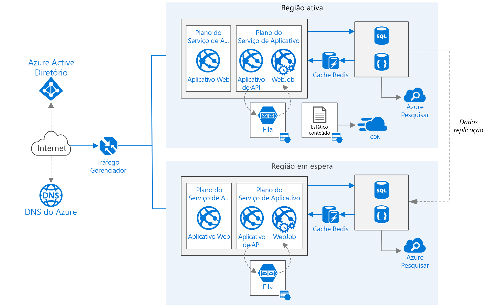

# <a name="run-a-web-application-in-multiple-azure-regions"></a><span data-ttu-id="ed6a0-103">Executar um aplicativo Web em várias regiões do Azure</span><span class="sxs-lookup"><span data-stu-id="ed6a0-103">Run a web application in multiple Azure regions</span></span>

<span data-ttu-id="ed6a0-104">Essa arquitetura de referência mostra como executar um aplicativo do Serviço de Aplicativo do Azure em várias regiões para obter alta disponibilidade.</span><span class="sxs-lookup"><span data-stu-id="ed6a0-104">This reference architecture shows how to run an Azure App Service application in multiple regions to achieve high availability.</span></span> 

 

<span data-ttu-id="ed6a0-106">*Baixe um [Arquivo Visio][visio-download] dessa arquitetura.*</span><span class="sxs-lookup"><span data-stu-id="ed6a0-106">*Download a [Visio file][visio-download] of this architecture.*</span></span>

## <a name="architecture"></a><span data-ttu-id="ed6a0-107">Arquitetura</span><span class="sxs-lookup"><span data-stu-id="ed6a0-107">Architecture</span></span> 

<span data-ttu-id="ed6a0-108">Essa arquitetura baseia-se naquela mostrada em [Melhorar a escalabilidade em um aplicativo Web][guidance-web-apps-scalability].</span><span class="sxs-lookup"><span data-stu-id="ed6a0-108">This architecture builds on the one shown in [Improve scalability in a web application][guidance-web-apps-scalability].</span></span> <span data-ttu-id="ed6a0-109">As principais diferenças são:</span><span class="sxs-lookup"><span data-stu-id="ed6a0-109">The main differences are:</span></span>

* <span data-ttu-id="ed6a0-110">**Regiões primárias e secundárias**.</span><span class="sxs-lookup"><span data-stu-id="ed6a0-110">**Primary and secondary regions**.</span></span> <span data-ttu-id="ed6a0-111">Essa arquitetura usa duas regiões para obter alta disponibilidade.</span><span class="sxs-lookup"><span data-stu-id="ed6a0-111">This architecture uses two regions to achieve higher availability.</span></span> <span data-ttu-id="ed6a0-112">O aplicativo está implantado em cada região.</span><span class="sxs-lookup"><span data-stu-id="ed6a0-112">The application is deployed to each region.</span></span> <span data-ttu-id="ed6a0-113">Durante as operações normais, o tráfego de rede é roteado para a região primária.</span><span class="sxs-lookup"><span data-stu-id="ed6a0-113">During normal operations, network traffic is routed to the primary region.</span></span> <span data-ttu-id="ed6a0-114">Se a região primária ficar indisponível, o tráfego será roteado para a região secundária.</span><span class="sxs-lookup"><span data-stu-id="ed6a0-114">If the primary region becomes unavailable, traffic is routed to the secondary region.</span></span> 
* <span data-ttu-id="ed6a0-115">**DNS do Azure**.</span><span class="sxs-lookup"><span data-stu-id="ed6a0-115">**Azure DNS**.</span></span> <span data-ttu-id="ed6a0-116">[DNS do Azure][azure-dns] é um serviço de hospedagem para domínios DNS, que fornece resolução de nomes usando a infraestrutura do Microsoft Azure.</span><span class="sxs-lookup"><span data-stu-id="ed6a0-116">[Azure DNS][azure-dns] is a hosting service for DNS domains, providing name resolution using Microsoft Azure infrastructure.</span></span> <span data-ttu-id="ed6a0-117">Ao hospedar seus domínios no Azure, você pode gerenciar seus registros DNS usando as mesmas credenciais, APIs, ferramentas e cobrança que seus outros serviços do Azure.</span><span class="sxs-lookup"><span data-stu-id="ed6a0-117">By hosting your domains in Azure, you can manage your DNS records using the same credentials, APIs, tools, and billing as your other Azure services.</span></span>
* <span data-ttu-id="ed6a0-118">**Gerenciador de Tráfego do Microsoft Azure**.</span><span class="sxs-lookup"><span data-stu-id="ed6a0-118">**Azure Traffic Manager**.</span></span> <span data-ttu-id="ed6a0-119">O [Gerenciador de Tráfego][traffic-manager] roteia as solicitações de entrada para a região primária.</span><span class="sxs-lookup"><span data-stu-id="ed6a0-119">[Traffic Manager][traffic-manager] routes incoming requests to the primary region.</span></span> <span data-ttu-id="ed6a0-120">Se o aplicativo em execução nessa região ficar indisponível, o Gerenciador de Tráfego fará failover para a região secundária.</span><span class="sxs-lookup"><span data-stu-id="ed6a0-120">If the application running that region becomes unavailable, Traffic Manager fails over to the secondary region.</span></span>
* <span data-ttu-id="ed6a0-121">**Replicação geográfica** do Banco de Dados SQL e Cosmos DB.</span><span class="sxs-lookup"><span data-stu-id="ed6a0-121">**Geo-replication** of SQL Database and Cosmos DB.</span></span> 

<span data-ttu-id="ed6a0-122">Uma arquitetura de várias regiões pode fornecer uma disponibilidade maior que a implantação em uma única região.</span><span class="sxs-lookup"><span data-stu-id="ed6a0-122">A multi-region architecture can provide higher availability than deploying to a single region.</span></span> <span data-ttu-id="ed6a0-123">Se uma interrupção regional afetar a região primária, você poderá usar o [Gerenciador de Tráfego][traffic-manager] para fazer failover para a região secundária.</span><span class="sxs-lookup"><span data-stu-id="ed6a0-123">If a regional outage affects the primary region, you can use [Traffic Manager][traffic-manager] to fail over to the secondary region.</span></span> <span data-ttu-id="ed6a0-124">Essa arquitetura também poderá ajudar a se um subsistema individual do aplicativo falhar.</span><span class="sxs-lookup"><span data-stu-id="ed6a0-124">This architecture can also help if an individual subsystem of the application fails.</span></span>

<span data-ttu-id="ed6a0-125">Há várias abordagens gerais para alcançar alta disponibilidade em várias regiões:</span><span class="sxs-lookup"><span data-stu-id="ed6a0-125">There are several general approaches to achieving high availability across regions:</span></span> 

* <span data-ttu-id="ed6a0-126">Ativo/passivo com espera ativa.</span><span class="sxs-lookup"><span data-stu-id="ed6a0-126">Active/passive with hot standby.</span></span> <span data-ttu-id="ed6a0-127">O tráfego vai para uma região, enquanto a outra aguarda em espera ativa.</span><span class="sxs-lookup"><span data-stu-id="ed6a0-127">Traffic goes to one region, while the other waits on hot standby.</span></span> <span data-ttu-id="ed6a0-128">A espera ativa significa que as VMs na região secundária são alocadas e ficam em execução a todo momentos.</span><span class="sxs-lookup"><span data-stu-id="ed6a0-128">Hot standby means the VMs in the secondary region are allocated and running at all times.</span></span>
* <span data-ttu-id="ed6a0-129">Ativo/passivo com espera passiva.</span><span class="sxs-lookup"><span data-stu-id="ed6a0-129">Active/passive with cold standby.</span></span> <span data-ttu-id="ed6a0-130">O tráfego vai para uma região, enquanto a outra aguarda em espera passiva.</span><span class="sxs-lookup"><span data-stu-id="ed6a0-130">Traffic goes to one region, while the other waits on cold standby.</span></span> <span data-ttu-id="ed6a0-131">A espera passiva significa que as VMs na região secundária não são alocadas até serem necessárias para failover.</span><span class="sxs-lookup"><span data-stu-id="ed6a0-131">Cold standby means the VMs in the secondary region are not allocated until needed for failover.</span></span> <span data-ttu-id="ed6a0-132">Essa abordagem custa menos para ser executada, mas geralmente leva mais tempo para ficar online durante uma falha.</span><span class="sxs-lookup"><span data-stu-id="ed6a0-132">This approach costs less to run, but will generally take longer to come online during a failure.</span></span>
* <span data-ttu-id="ed6a0-133">Ativa/ativa.</span><span class="sxs-lookup"><span data-stu-id="ed6a0-133">Active/active.</span></span> <span data-ttu-id="ed6a0-134">Ambas as regiões ficam ativas e a carga das solicitações é balanceada entre elas.</span><span class="sxs-lookup"><span data-stu-id="ed6a0-134">Both regions are active, and requests are load balanced between them.</span></span> <span data-ttu-id="ed6a0-135">Se uma região ficar indisponível, ela será retirada da rotação.</span><span class="sxs-lookup"><span data-stu-id="ed6a0-135">If one region becomes unavailable, it is taken out of rotation.</span></span> 

<span data-ttu-id="ed6a0-136">Essa arquitetura de referência se concentra em ativo/passivo com espera ativa, usando o Gerenciador de Tráfego para o failover.</span><span class="sxs-lookup"><span data-stu-id="ed6a0-136">This reference architecture focuses on active/passive with hot standby, using Traffic Manager for failover.</span></span> 


## <a name="recommendations"></a><span data-ttu-id="ed6a0-137">Recomendações</span><span class="sxs-lookup"><span data-stu-id="ed6a0-137">Recommendations</span></span>

<span data-ttu-id="ed6a0-138">Seus requisitos podem ser diferentes dos requisitos da arquitetura descrita aqui.</span><span class="sxs-lookup"><span data-stu-id="ed6a0-138">Your requirements might differ from the architecture described here.</span></span> <span data-ttu-id="ed6a0-139">Use as recomendações nesta seção como um ponto inicial.</span><span class="sxs-lookup"><span data-stu-id="ed6a0-139">Use the recommendations in this section as a starting point.</span></span>

### <a name="regional-pairing"></a><span data-ttu-id="ed6a0-140">Emparelhamento regional</span><span class="sxs-lookup"><span data-stu-id="ed6a0-140">Regional pairing</span></span>
<span data-ttu-id="ed6a0-141">Cada região do Azure é emparelhada com outra na mesma área geográfica.</span><span class="sxs-lookup"><span data-stu-id="ed6a0-141">Each Azure region is paired with another region within the same geography.</span></span> <span data-ttu-id="ed6a0-142">Em geral, escolha regiões do mesmo par regional (por exemplo, Leste dos EUA 2 e EUA Central).</span><span class="sxs-lookup"><span data-stu-id="ed6a0-142">In general, choose regions from the same regional pair (for example, East US 2 and Central US).</span></span> <span data-ttu-id="ed6a0-143">Os benefícios de se fazer isso são:</span><span class="sxs-lookup"><span data-stu-id="ed6a0-143">Benefits of doing so include:</span></span>

* <span data-ttu-id="ed6a0-144">No caso de uma interrupção ampla, a recuperação de pelo menos uma região de cada par é priorizada.</span><span class="sxs-lookup"><span data-stu-id="ed6a0-144">If there is a broad outage, recovery of at least one region out of every pair is prioritized.</span></span>
* <span data-ttu-id="ed6a0-145">As atualizações planejadas do sistema do Azure são distribuídas em regiões emparelhadas sequencialmente para minimizar o possível tempo de inatividade.</span><span class="sxs-lookup"><span data-stu-id="ed6a0-145">Planned Azure system updates are rolled out to paired regions sequentially to minimize possible downtime.</span></span>
* <span data-ttu-id="ed6a0-146">Na maioria dos casos, pares regionais residem na mesma geografia para atender aos requisitos de residência de dados.</span><span class="sxs-lookup"><span data-stu-id="ed6a0-146">In most cases, regional pairs reside within the same geography to meet data residency requirements.</span></span>

<span data-ttu-id="ed6a0-147">No entanto, verifique se ambas as regiões dão suporte a todos os serviços do Azure necessários para seu aplicativo.</span><span class="sxs-lookup"><span data-stu-id="ed6a0-147">However, make sure that both regions support all of the Azure services needed for your application.</span></span> <span data-ttu-id="ed6a0-148">Consulte [Serviços por região][services-by-region].</span><span class="sxs-lookup"><span data-stu-id="ed6a0-148">See [Services by region][services-by-region].</span></span> <span data-ttu-id="ed6a0-149">Para saber mais sobre pares regionais, consulte [Continuidade dos negócios e recuperação de desastres (BCDR): Regiões Emparelhadas do Azure][regional-pairs].</span><span class="sxs-lookup"><span data-stu-id="ed6a0-149">For more information about regional pairs, see [Business continuity and disaster recovery (BCDR): Azure Paired Regions][regional-pairs].</span></span>

### <a name="resource-groups"></a><span data-ttu-id="ed6a0-150">Grupos de recursos</span><span class="sxs-lookup"><span data-stu-id="ed6a0-150">Resource groups</span></span>
<span data-ttu-id="ed6a0-151">Considere a possibilidade de colocar a região primária, a região secundária e o Gerenciador de Tráfego em [grupos de recursos][resource groups] separados.</span><span class="sxs-lookup"><span data-stu-id="ed6a0-151">Consider placing the primary region, secondary region, and Traffic Manager into separate [resource groups][resource groups].</span></span> <span data-ttu-id="ed6a0-152">Isso permite que você gerencie os recursos implantados para cada região como uma única coleção.</span><span class="sxs-lookup"><span data-stu-id="ed6a0-152">This lets you manage the resources deployed to each region as a single collection.</span></span>

### <a name="traffic-manager-configuration"></a><span data-ttu-id="ed6a0-153">Configuração do Gerenciador de Tráfego</span><span class="sxs-lookup"><span data-stu-id="ed6a0-153">Traffic Manager configuration</span></span> 

<span data-ttu-id="ed6a0-154">**Roteamento**.</span><span class="sxs-lookup"><span data-stu-id="ed6a0-154">**Routing**.</span></span> <span data-ttu-id="ed6a0-155">O Gerenciador de Tráfego dá suporte a vários [algoritmos de roteamento][tm-routing].</span><span class="sxs-lookup"><span data-stu-id="ed6a0-155">Traffic Manager supports several [routing algorithms][tm-routing].</span></span> <span data-ttu-id="ed6a0-156">Para o cenário descrito neste artigo, use roteamento *prioritário* (anteriormente chamado de roteamento de *failover*).</span><span class="sxs-lookup"><span data-stu-id="ed6a0-156">For the scenario described in this article, use *priority* routing (formerly called *failover* routing).</span></span> <span data-ttu-id="ed6a0-157">Com essa configuração, o Gerenciador de Tráfego envia todas as solicitações para a região primária, a menos que o ponto de extremidade para essa região fique inacessível.</span><span class="sxs-lookup"><span data-stu-id="ed6a0-157">With this setting, Traffic Manager sends all requests to the primary region unless the endpoint for that region becomes unreachable.</span></span> <span data-ttu-id="ed6a0-158">Nesse ponto, ele automaticamente faz failover para a região secundária.</span><span class="sxs-lookup"><span data-stu-id="ed6a0-158">At that point, it automatically fails over to the secondary region.</span></span> <span data-ttu-id="ed6a0-159">Consulte [Configurar o método de roteamento de failover][tm-configure-failover].</span><span class="sxs-lookup"><span data-stu-id="ed6a0-159">See [Configure Failover routing method][tm-configure-failover].</span></span>

<span data-ttu-id="ed6a0-160">**Investigação de integridade**.</span><span class="sxs-lookup"><span data-stu-id="ed6a0-160">**Health probe**.</span></span> <span data-ttu-id="ed6a0-161">O Gerenciador de Tráfego usa uma investigação HTTP (ou HTTPS) para monitorar a disponibilidade de cada ponto de extremidade.</span><span class="sxs-lookup"><span data-stu-id="ed6a0-161">Traffic Manager uses an HTTP (or HTTPS) probe to monitor the availability of each endpoint.</span></span> <span data-ttu-id="ed6a0-162">A investigação fornece ao Gerenciador de Tráfego um teste aprovado/reprovado para realizar o failover para a região secundária.</span><span class="sxs-lookup"><span data-stu-id="ed6a0-162">The probe gives Traffic Manager a pass/fail test for failing over to the secondary region.</span></span> <span data-ttu-id="ed6a0-163">Ele funciona com o envio de uma solicitação para um caminho de URL especificado.</span><span class="sxs-lookup"><span data-stu-id="ed6a0-163">It works by sending a request to a specified URL path.</span></span> <span data-ttu-id="ed6a0-164">Se ele obtiver uma resposta não 200 dentro de um período de tempo limite, o teste falhará.</span><span class="sxs-lookup"><span data-stu-id="ed6a0-164">If it gets a non-200 response within a timeout period, the probe fails.</span></span> <span data-ttu-id="ed6a0-165">Após quatro solicitações com falha, o Gerenciador de Tráfego marca o ponto de extremidade como degradado e faz failover para outro ponto de extremidade.</span><span class="sxs-lookup"><span data-stu-id="ed6a0-165">After four failed requests, Traffic Manager marks the endpoint as degraded and fails over to the other endpoint.</span></span> <span data-ttu-id="ed6a0-166">Para ver mais detalhes, consulte [Monitoramento e failover do ponto de extremidade do Gerenciador de Tráfego][tm-monitoring].</span><span class="sxs-lookup"><span data-stu-id="ed6a0-166">For details, see [Traffic Manager endpoint monitoring and failover][tm-monitoring].</span></span>

<span data-ttu-id="ed6a0-167">Como uma prática recomendada, crie um ponto de extremidade de investigação de integridade que relata a integridade geral do aplicativo e use esse ponto de extremidade para a investigação de integridade.</span><span class="sxs-lookup"><span data-stu-id="ed6a0-167">As a best practice, create a health probe endpoint that reports the overall health of the application and use this endpoint for the health probe.</span></span> <span data-ttu-id="ed6a0-168">O ponto de extremidade deve verificar dependências críticas, como aplicativos do Serviço de Aplicativo, a fila de armazenamento e o Banco de Dados SQL.</span><span class="sxs-lookup"><span data-stu-id="ed6a0-168">The endpoint should check critical dependencies such as the App Service apps, storage queue, and SQL Database.</span></span> <span data-ttu-id="ed6a0-169">Caso contrário, a investigação pode relatar um ponto de extremidade íntegro quando partes essenciais do aplicativo estão falhando na verdade.</span><span class="sxs-lookup"><span data-stu-id="ed6a0-169">Otherwise, the probe might report a healthy endpoint when critical parts of the application are actually failing.</span></span>

<span data-ttu-id="ed6a0-170">Por outro lado, não use a investigação de integridade para verificar os serviços de baixa prioridade.</span><span class="sxs-lookup"><span data-stu-id="ed6a0-170">On the other hand, don't use the health probe to check lower priority services.</span></span> <span data-ttu-id="ed6a0-171">Por exemplo, se um serviço de email ficar inativo, o aplicativo poderá mudar para um segundo provedor ou apenas enviar emails mais tarde.</span><span class="sxs-lookup"><span data-stu-id="ed6a0-171">For example, if an email service goes down the application can switch to a second provider or just send emails later.</span></span> <span data-ttu-id="ed6a0-172">Essa não é uma prioridade alta o suficiente para fazer failover no aplicativo.</span><span class="sxs-lookup"><span data-stu-id="ed6a0-172">This is not a high enough priority to cause the application to fail over.</span></span> <span data-ttu-id="ed6a0-173">Para obter mais informações, consulte o [Padrão de monitoramento de ponto de extremidade de integridade][health-endpoint-monitoring-pattern].</span><span class="sxs-lookup"><span data-stu-id="ed6a0-173">For more information, see [Health Endpoint Monitoring Pattern][health-endpoint-monitoring-pattern].</span></span>
 
### <a name="sql-database"></a><span data-ttu-id="ed6a0-174">Banco de dados SQL</span><span class="sxs-lookup"><span data-stu-id="ed6a0-174">SQL Database</span></span>
<span data-ttu-id="ed6a0-175">Use a [Replicação Geográfica Ativa][sql-replication] para criar uma réplica secundária legível em uma região diferente.</span><span class="sxs-lookup"><span data-stu-id="ed6a0-175">Use [Active Geo-Replication][sql-replication] to create a readable secondary replica in a different region.</span></span> <span data-ttu-id="ed6a0-176">Você pode ter até quatro réplicas secundárias legíveis.</span><span class="sxs-lookup"><span data-stu-id="ed6a0-176">You can have up to four readable secondary replicas.</span></span> <span data-ttu-id="ed6a0-177">Faça failover para um banco de dados secundário se o banco de dados primário falhar ou precisar ser deixado offline.</span><span class="sxs-lookup"><span data-stu-id="ed6a0-177">Fail over to a secondary database if your primary database fails or needs to be taken offline.</span></span> <span data-ttu-id="ed6a0-178">A replicação geográfica ativa pode ser configurada para qualquer banco de dados em qualquer pool de banco de dados elástico.</span><span class="sxs-lookup"><span data-stu-id="ed6a0-178">Active Geo-Replication can be configured for any database in any elastic database pool.</span></span>

### <a name="cosmos-db"></a><span data-ttu-id="ed6a0-179">Cosmos DB</span><span class="sxs-lookup"><span data-stu-id="ed6a0-179">Cosmos DB</span></span>
<span data-ttu-id="ed6a0-180">O Cosmos DB dá suporte à replicação geográfica entre regiões com vários mestres (várias regiões de gravação).</span><span class="sxs-lookup"><span data-stu-id="ed6a0-180">Cosmos DB supports geo-replication across regions with multi-master (multiple write regions).</span></span> <span data-ttu-id="ed6a0-181">Como alternativa, você pode designar uma região como a região gravável e outras como réplicas somente leitura.</span><span class="sxs-lookup"><span data-stu-id="ed6a0-181">Alternatively, you can designate one region as the writable region and the others as read-only replicas.</span></span> <span data-ttu-id="ed6a0-182">Se houver uma interrupção regional, será possível fazer failover selecionando outra região para ser a região de gravação.</span><span class="sxs-lookup"><span data-stu-id="ed6a0-182">If there is a regional outage, you can fail over by selecting another region to be the write region.</span></span> <span data-ttu-id="ed6a0-183">O SDK do cliente envia automaticamente solicitações de gravação para a região de gravação atual, portanto você não precisa atualizar a configuração do cliente após um failover.</span><span class="sxs-lookup"><span data-stu-id="ed6a0-183">The client SDK automatically sends write requests to the current write region, so you don't need to update the client configuration after a failover.</span></span> <span data-ttu-id="ed6a0-184">Para obter mais informações, confira [Distribuição de dados global com o Azure Cosmos DB][cosmosdb-geo].</span><span class="sxs-lookup"><span data-stu-id="ed6a0-184">For more information, see [Global data distribution with Azure Cosmos DB][cosmosdb-geo].</span></span>

> [!NOTE]
> <span data-ttu-id="ed6a0-185">Todas as réplicas de pertencem ao mesmo grupo de recursos.</span><span class="sxs-lookup"><span data-stu-id="ed6a0-185">All of the replicas belong to the same resource group.</span></span>
>
>

### <a name="storage"></a><span data-ttu-id="ed6a0-186">Armazenamento</span><span class="sxs-lookup"><span data-stu-id="ed6a0-186">Storage</span></span>
<span data-ttu-id="ed6a0-187">Para o Armazenamento do Azure, use RA-GRS [armazenamento com redundância geográfica com acesso de leitura][ra-grs].</span><span class="sxs-lookup"><span data-stu-id="ed6a0-187">For Azure Storage, use [read-access geo-redundant storage][ra-grs] (RA-GRS).</span></span> <span data-ttu-id="ed6a0-188">Com o armazenamento de RA-GRS, os dados são replicados para uma região secundária.</span><span class="sxs-lookup"><span data-stu-id="ed6a0-188">With RA-GRS storage, the data is replicated to a secondary region.</span></span> <span data-ttu-id="ed6a0-189">Você tem acesso somente leitura aos dados na região secundária por meio de um ponto de extremidade separado.</span><span class="sxs-lookup"><span data-stu-id="ed6a0-189">You have read-only access to the data in the secondary region through a separate endpoint.</span></span> <span data-ttu-id="ed6a0-190">Se houver uma interrupção ou desastre regional, a equipe do Armazenamento do Azure pode decidir executar um failover geográfico para a região secundária.</span><span class="sxs-lookup"><span data-stu-id="ed6a0-190">If there is a regional outage or disaster, the Azure Storage team might decide to perform a geo-failover to the secondary region.</span></span> <span data-ttu-id="ed6a0-191">Nenhuma ação do cliente é necessária para este failover.</span><span class="sxs-lookup"><span data-stu-id="ed6a0-191">There is no customer action required for this failover.</span></span>

<span data-ttu-id="ed6a0-192">Para o Armazenamento de Filas, crie uma fila de backup na região secundária.</span><span class="sxs-lookup"><span data-stu-id="ed6a0-192">For Queue storage, create a backup queue in the secondary region.</span></span> <span data-ttu-id="ed6a0-193">Durante o failover, o aplicativo pode usar a fila de backup até que a região principal fique disponível novamente.</span><span class="sxs-lookup"><span data-stu-id="ed6a0-193">During failover, the app can use the backup queue until the primary region becomes available again.</span></span> <span data-ttu-id="ed6a0-194">Dessa forma, o aplicativo ainda poderá processar novas solicitações.</span><span class="sxs-lookup"><span data-stu-id="ed6a0-194">That way, the application can still process new requests.</span></span>

## <a name="availability-considerations"></a><span data-ttu-id="ed6a0-195">Considerações sobre disponibilidade</span><span class="sxs-lookup"><span data-stu-id="ed6a0-195">Availability considerations</span></span>


### <a name="traffic-manager"></a><span data-ttu-id="ed6a0-196">Gerenciador de Tráfego</span><span class="sxs-lookup"><span data-stu-id="ed6a0-196">Traffic Manager</span></span>

<span data-ttu-id="ed6a0-197">O Gerenciador de Tráfego fará failover automaticamente se a região principal ficar indisponível.</span><span class="sxs-lookup"><span data-stu-id="ed6a0-197">Traffic Manager automatically fails over if the primary region becomes unavailable.</span></span> <span data-ttu-id="ed6a0-198">Quando o Gerenciador de Tráfego faz failover, há um período em que os clientes não podem acessar o aplicativo.</span><span class="sxs-lookup"><span data-stu-id="ed6a0-198">When Traffic Manager fails over, there is a period of time when clients cannot reach the application.</span></span> <span data-ttu-id="ed6a0-199">A duração é afetada pelos seguintes fatores:</span><span class="sxs-lookup"><span data-stu-id="ed6a0-199">The duration is affected by the following factors:</span></span>

* <span data-ttu-id="ed6a0-200">A investigação de integridade precisa detectar que o data center primário ficou inacessível.</span><span class="sxs-lookup"><span data-stu-id="ed6a0-200">The health probe must detect that the primary data center has become unreachable.</span></span>
* <span data-ttu-id="ed6a0-201">Os servidores DNS (Serviço de Nomes de Domínio) precisam atualizar os registros DNS armazenados em cache para o endereço IP, dependendo da TTL (vida útil) DNS.</span><span class="sxs-lookup"><span data-stu-id="ed6a0-201">Domain name service (DNS) servers must update the cached DNS records for the IP address, which depends on the DNS time-to-live (TTL).</span></span> <span data-ttu-id="ed6a0-202">A TTL padrão é 300 segundos (5 minutos), mas você pode configurar esse valor ao criar o perfil do Gerenciador de Tráfego.</span><span class="sxs-lookup"><span data-stu-id="ed6a0-202">The default TTL is 300 seconds (5 minutes), but you can configure this value when you create the Traffic Manager profile.</span></span>

<span data-ttu-id="ed6a0-203">Para saber mais, consulte [Sobre o monitoramento do Gerenciador de Tráfego][tm-monitoring].</span><span class="sxs-lookup"><span data-stu-id="ed6a0-203">For details, see [About Traffic Manager Monitoring][tm-monitoring].</span></span>

<span data-ttu-id="ed6a0-204">O Gerenciador de Tráfego é um possível ponto de falha no sistema.</span><span class="sxs-lookup"><span data-stu-id="ed6a0-204">Traffic Manager is a possible failure point in the system.</span></span> <span data-ttu-id="ed6a0-205">Se o serviço falhar, os clientes não poderão acessar seu aplicativo durante o tempo de inatividade.</span><span class="sxs-lookup"><span data-stu-id="ed6a0-205">If the service fails, clients cannot access your application during the downtime.</span></span> <span data-ttu-id="ed6a0-206">Examine o [SLA (Contrato de Nível de Serviço) do Gerenciador de Tráfego][tm-sla] e determine se usar apenas o Gerenciador de Tráfego atende aos seus requisitos de negócios para alta disponibilidade.</span><span class="sxs-lookup"><span data-stu-id="ed6a0-206">Review the [Traffic Manager service level agreement (SLA)][tm-sla] and determine whether using Traffic Manager alone meets your business requirements for high availability.</span></span> <span data-ttu-id="ed6a0-207">Caso contrário, considere adicionar outra solução de gerenciamento de tráfego como um fallback.</span><span class="sxs-lookup"><span data-stu-id="ed6a0-207">If not, consider adding another traffic management solution as a fallback.</span></span> <span data-ttu-id="ed6a0-208">Se o serviço do Gerenciador de Tráfego do Azure falhar, altere os registros CNAME (nome canônico) no DNS para apontar para outro serviço de gerenciamento de tráfego.</span><span class="sxs-lookup"><span data-stu-id="ed6a0-208">If the Azure Traffic Manager service fails, change your canonical name (CNAME) records in DNS to point to the other traffic management service.</span></span> <span data-ttu-id="ed6a0-209">Esta etapa deve ser executada manualmente e seu aplicativo estará indisponível até que as alterações de DNS sejam propagadas.</span><span class="sxs-lookup"><span data-stu-id="ed6a0-209">This step must be performed manually, and your application will be unavailable until the DNS changes are propagated.</span></span>

### <a name="sql-database"></a><span data-ttu-id="ed6a0-210">Banco de dados SQL</span><span class="sxs-lookup"><span data-stu-id="ed6a0-210">SQL Database</span></span>
<span data-ttu-id="ed6a0-211">O RPO (objetivo de ponto de recuperação) e o ERT (tempo de recuperação estimado) para o Banco de Dados SQL estão documentados na [Visão geral de continuidade de negócios com o Banco de Dados SQL do Microsoft Azure][sql-rpo].</span><span class="sxs-lookup"><span data-stu-id="ed6a0-211">The recovery point objective (RPO) and estimated recovery time (ERT) for SQL Database are documented in [Overview of business continuity with Azure SQL Database][sql-rpo].</span></span> 

### <a name="storage"></a><span data-ttu-id="ed6a0-212">Armazenamento</span><span class="sxs-lookup"><span data-stu-id="ed6a0-212">Storage</span></span>
<span data-ttu-id="ed6a0-213">O armazenamento de RA-GRS fornece armazenamento durável, mas é importante entender o que pode ocorrer durante uma interrupção:</span><span class="sxs-lookup"><span data-stu-id="ed6a0-213">RA-GRS storage provides durable storage, but it's important to understand what can happen during an outage:</span></span>

* <span data-ttu-id="ed6a0-214">Se ocorrer uma interrupção de armazenamento, haverá um período em que você não terá acesso de gravação aos dados.</span><span class="sxs-lookup"><span data-stu-id="ed6a0-214">If a storage outage occurs, there will be a period of time when you don't have write-access to the data.</span></span> <span data-ttu-id="ed6a0-215">Você ainda poderá ler do ponto de extremidade secundário durante a interrupção.</span><span class="sxs-lookup"><span data-stu-id="ed6a0-215">You can still read from the secondary endpoint during the outage.</span></span>
* <span data-ttu-id="ed6a0-216">Se uma interrupção ou desastre regional afetar o local primário e os dados não puderem ser recuperados, a equipe do Armazenamento do Azure poderá optar por executar um failover geográfico para a região secundária.</span><span class="sxs-lookup"><span data-stu-id="ed6a0-216">If a regional outage or disaster affects the primary location and the data there cannot be recovered, the Azure Storage team may decide to perform a geo-failover to the secondary region.</span></span>
* <span data-ttu-id="ed6a0-217">A replicação de dados para a região secundária é executada de forma assíncrona.</span><span class="sxs-lookup"><span data-stu-id="ed6a0-217">Data replication to the secondary region is performed asynchronously.</span></span> <span data-ttu-id="ed6a0-218">Portanto, se um failover geográfico for executado, é possível que haja certa perda de dados se eles não podem ser recuperados da região primária.</span><span class="sxs-lookup"><span data-stu-id="ed6a0-218">Therefore, if a geo-failover is performed, some data loss is possible if the data can't be recovered from the primary region.</span></span>
* <span data-ttu-id="ed6a0-219">Falhas transitórias, como uma interrupção da rede, não disparam um failover de armazenamento.</span><span class="sxs-lookup"><span data-stu-id="ed6a0-219">Transient failures, such as a network outage, will not trigger a storage failover.</span></span> <span data-ttu-id="ed6a0-220">Projete seu aplicativo para ser resiliente a falhas transitórias.</span><span class="sxs-lookup"><span data-stu-id="ed6a0-220">Design your application to be resilient to transient failures.</span></span> <span data-ttu-id="ed6a0-221">Possíveis mitigações:</span><span class="sxs-lookup"><span data-stu-id="ed6a0-221">Possible mitigations:</span></span>
  
  * <span data-ttu-id="ed6a0-222">Ler de uma região secundária.</span><span class="sxs-lookup"><span data-stu-id="ed6a0-222">Read from the secondary region.</span></span>
  * <span data-ttu-id="ed6a0-223">Alternar temporariamente para outra conta de armazenamento para novas operações de gravação (por exemplo, para colocar mensagens na fila).</span><span class="sxs-lookup"><span data-stu-id="ed6a0-223">Temporarily switch to another storage account for new write operations (for example, to queue messages).</span></span>
  * <span data-ttu-id="ed6a0-224">Copiar dados da região secundária para outra conta de armazenamento.</span><span class="sxs-lookup"><span data-stu-id="ed6a0-224">Copy data from the secondary region to another storage account.</span></span>
  * <span data-ttu-id="ed6a0-225">Fornecer funcionalidade reduzida até a conclusão do failback do sistema.</span><span class="sxs-lookup"><span data-stu-id="ed6a0-225">Provide reduced functionality until the system fails back.</span></span>

<span data-ttu-id="ed6a0-226">Para obter mais informações, consulte [O que fazer se ocorrer uma interrupção do Armazenamento do Azure][storage-outage].</span><span class="sxs-lookup"><span data-stu-id="ed6a0-226">For more information, see [What to do if an Azure Storage outage occurs][storage-outage].</span></span>

## <a name="manageability-considerations"></a><span data-ttu-id="ed6a0-227">Considerações sobre capacidade de gerenciamento</span><span class="sxs-lookup"><span data-stu-id="ed6a0-227">Manageability Considerations</span></span>

### <a name="traffic-manager"></a><span data-ttu-id="ed6a0-228">Gerenciador de Tráfego</span><span class="sxs-lookup"><span data-stu-id="ed6a0-228">Traffic Manager</span></span>

<span data-ttu-id="ed6a0-229">Em caso de falha do Gerenciador de Tráfego, é recomendável executar um failback manual em vez de implementar um failback automático.</span><span class="sxs-lookup"><span data-stu-id="ed6a0-229">If Traffic Manager fails over, we recommend performing a manual failback rather than implementing an automatic failback.</span></span> <span data-ttu-id="ed6a0-230">Caso contrário, você pode criar uma situação em que o aplicativo fica alternando entre as regiões.</span><span class="sxs-lookup"><span data-stu-id="ed6a0-230">Otherwise, you can create a situation where the application flips back and forth between regions.</span></span> <span data-ttu-id="ed6a0-231">Verifique se todos os subsistemas de aplicativo estão íntegros antes de realizar o failback.</span><span class="sxs-lookup"><span data-stu-id="ed6a0-231">Verify that all application subsystems are healthy before failing back.</span></span>

<span data-ttu-id="ed6a0-232">Observe que o Gerenciador de Tráfego realiza failback automaticamente por padrão.</span><span class="sxs-lookup"><span data-stu-id="ed6a0-232">Note that Traffic Manager automatically fails back by default.</span></span> <span data-ttu-id="ed6a0-233">Para evitar isso, diminua manualmente a prioridade da região primária após um evento de failover.</span><span class="sxs-lookup"><span data-stu-id="ed6a0-233">To prevent this, manually lower the priority of the primary region after a failover event.</span></span> <span data-ttu-id="ed6a0-234">Por exemplo, suponha que a região primária tem prioridade 1 e a secundária tem prioridade 2.</span><span class="sxs-lookup"><span data-stu-id="ed6a0-234">For example, suppose the primary region is priority 1 and the secondary is priority 2.</span></span> <span data-ttu-id="ed6a0-235">Após um failover, defina a região primária para a prioridade 3, para impedir o failback automático.</span><span class="sxs-lookup"><span data-stu-id="ed6a0-235">After a failover, set the primary region to priority 3, to prevent automatic failback.</span></span> <span data-ttu-id="ed6a0-236">Quando você estiver pronto retornar para ela, atualize a prioridade para 1.</span><span class="sxs-lookup"><span data-stu-id="ed6a0-236">When you are ready to switch back, update the priority to 1.</span></span>

<span data-ttu-id="ed6a0-237">Os comandos a seguir atualizam a prioridade.</span><span class="sxs-lookup"><span data-stu-id="ed6a0-237">The following commands update the priority.</span></span>

<span data-ttu-id="ed6a0-238">**PowerShell**</span><span class="sxs-lookup"><span data-stu-id="ed6a0-238">**PowerShell**</span></span>

```bat
$endpoint = Get-AzureRmTrafficManagerEndpoint -Name <endpoint> -ProfileName <profile> -ResourceGroupName <resource-group> -Type AzureEndpoints
$endpoint.Priority = 3
Set-AzureRmTrafficManagerEndpoint -TrafficManagerEndpoint $endpoint
```

<span data-ttu-id="ed6a0-239">Para obter mais informações, consulte [Cmdlets do Gerenciador de Tráfego do Microsoft Azure][tm-ps].</span><span class="sxs-lookup"><span data-stu-id="ed6a0-239">For more information, see [Azure Traffic Manager Cmdlets][tm-ps].</span></span>

<span data-ttu-id="ed6a0-240">**CLI do Azure**</span><span class="sxs-lookup"><span data-stu-id="ed6a0-240">**Azure CLI**</span></span>

```bat
az network traffic-manager endpoint update --resource-group <resource-group> --profile-name <profile> \
    --name <endpoint-name> --type azureEndpoints --priority 3
```    

### <a name="sql-database"></a><span data-ttu-id="ed6a0-241">Banco de dados SQL</span><span class="sxs-lookup"><span data-stu-id="ed6a0-241">SQL Database</span></span>
<span data-ttu-id="ed6a0-242">Se o banco de dados primário falhar, realize um failover manual para o banco de dados secundário.</span><span class="sxs-lookup"><span data-stu-id="ed6a0-242">If the primary database fails, perform a manual failover to the secondary database.</span></span> <span data-ttu-id="ed6a0-243">Consulte [Restaurar um Banco de Dados SQL do Azure ou fazer failover para um secundário][sql-failover].</span><span class="sxs-lookup"><span data-stu-id="ed6a0-243">See [Restore an Azure SQL Database or failover to a secondary][sql-failover].</span></span> <span data-ttu-id="ed6a0-244">O banco de dados secundário permanece somente leitura até você fazer o failover.</span><span class="sxs-lookup"><span data-stu-id="ed6a0-244">The secondary database remains read-only until you fail over.</span></span>


<!-- links -->

[azure-sql-db]: https://azure.microsoft.com/documentation/services/sql-database/
[azure-dns]: /azure/dns/dns-overview
[cosmosdb-geo]: /azure/cosmos-db/distribute-data-globally
[guidance-web-apps-scalability]: ./scalable-web-app.md
[health-endpoint-monitoring-pattern]: https://msdn.microsoft.com/library/dn589789.aspx
[ra-grs]: /azure/storage/storage-redundancy#read-access-geo-redundant-storage
[regional-pairs]: /azure/best-practices-availability-paired-regions
[resource groups]: /azure/azure-resource-manager/resource-group-overview#resource-groups
[services-by-region]: https://azure.microsoft.com/regions/#services
[sql-failover]: /azure/sql-database/sql-database-disaster-recovery
[sql-replication]: /azure/sql-database/sql-database-geo-replication-overview
[sql-rpo]: /azure/sql-database/sql-database-business-continuity#sql-database-features-that-you-can-use-to-provide-business-continuity
[storage-outage]: /azure/storage/storage-disaster-recovery-guidance
[tm-configure-failover]: /azure/traffic-manager/traffic-manager-configure-failover-routing-method
[tm-monitoring]: /azure/traffic-manager/traffic-manager-monitoring
[tm-ps]: /powershell/module/azurerm.trafficmanager
[tm-routing]: /azure/traffic-manager/traffic-manager-routing-methods
[tm-sla]: https://azure.microsoft.com/support/legal/sla/traffic-manager
[traffic-manager]: https://azure.microsoft.com/services/traffic-manager
[visio-download]: https://archcenter.blob.core.windows.net/cdn/app-service-reference-architectures.vsdx
