# <a name="automated-enterprise-bi-with-sql-data-warehouse-and-azure-data-factory"></a><span data-ttu-id="d78f9-103">Enterprise BI automatizada com o SQL Data Warehouse e Azure Data Factory</span><span class="sxs-lookup"><span data-stu-id="d78f9-103">Automated enterprise BI with SQL Data Warehouse and Azure Data Factory</span></span>

<span data-ttu-id="d78f9-104">Essa arquitetura de referência mostra como executar um carregamento incremental em um pipeline [ELT](../../data-guide/relational-data/etl.md#extract-load-and-transform-elt) (extrair-carregar-transformar).</span><span class="sxs-lookup"><span data-stu-id="d78f9-104">This reference architecture shows how to perform incremental loading in an [ELT](../../data-guide/relational-data/etl.md#extract-load-and-transform-elt) (extract-load-transform) pipeline.</span></span> <span data-ttu-id="d78f9-105">Ela usa o Azure Data Factory para automatizar o pipeline ELT.</span><span class="sxs-lookup"><span data-stu-id="d78f9-105">It uses Azure Data Factory to automate the ELT pipeline.</span></span> <span data-ttu-id="d78f9-106">O pipeline move incrementalmente os dados de OLTP mais recentes de um banco de dados do SQL Server local no SQL Data Warehouse.</span><span class="sxs-lookup"><span data-stu-id="d78f9-106">The pipeline incrementally moves the latest OLTP data from an on-premises SQL Server database into SQL Data Warehouse.</span></span> <span data-ttu-id="d78f9-107">Os dados transacionais são transformados em um modelo de tabela para análise.</span><span class="sxs-lookup"><span data-stu-id="d78f9-107">Transactional data is transformed into a tabular model for analysis.</span></span> [<span data-ttu-id="d78f9-108">**Implante essa solução**.</span><span class="sxs-lookup"><span data-stu-id="d78f9-108">**Deploy this solution**.</span></span>](#deploy-the-solution)

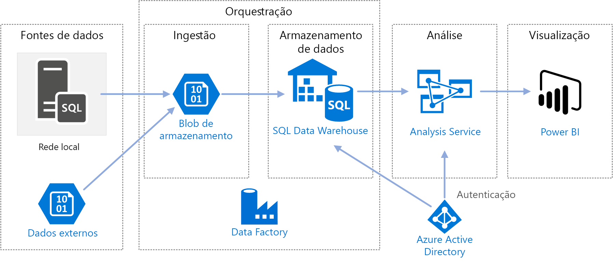

<span data-ttu-id="d78f9-109">Essa arquitetura é compilada naquela mostrada em [Enterprise BI com o SQL Data Warehouse](./enterprise-bi-sqldw.md), mas também adiciona alguns recursos que são importantes para cenários de data warehouse de dados da empresa.</span><span class="sxs-lookup"><span data-stu-id="d78f9-109">This architecture builds on the one shown in [Enterprise BI with SQL Data Warehouse](./enterprise-bi-sqldw.md), but adds some features that are important for enterprise data warehousing scenarios.</span></span>

-   <span data-ttu-id="d78f9-110">Automação do pipeline usando o Data Factory.</span><span class="sxs-lookup"><span data-stu-id="d78f9-110">Automation of the pipeline using Data Factory.</span></span>
-   <span data-ttu-id="d78f9-111">Carregamento incremental.</span><span class="sxs-lookup"><span data-stu-id="d78f9-111">Incremental loading.</span></span>
-   <span data-ttu-id="d78f9-112">Integrando várias fontes de dados.</span><span class="sxs-lookup"><span data-stu-id="d78f9-112">Integrating multiple data sources.</span></span>
-   <span data-ttu-id="d78f9-113">Carregando dados binários como imagens e dados geoespaciais.</span><span class="sxs-lookup"><span data-stu-id="d78f9-113">Loading binary data such as geospatial data and images.</span></span>

## <a name="architecture"></a><span data-ttu-id="d78f9-114">Arquitetura</span><span class="sxs-lookup"><span data-stu-id="d78f9-114">Architecture</span></span>

<span data-ttu-id="d78f9-115">A arquitetura consiste nos componentes a seguir.</span><span class="sxs-lookup"><span data-stu-id="d78f9-115">The architecture consists of the following components.</span></span>

### <a name="data-sources"></a><span data-ttu-id="d78f9-116">Fontes de dados</span><span class="sxs-lookup"><span data-stu-id="d78f9-116">Data sources</span></span>

<span data-ttu-id="d78f9-117">**SQL Server local**.</span><span class="sxs-lookup"><span data-stu-id="d78f9-117">**On-premises SQL Server**.</span></span> <span data-ttu-id="d78f9-118">A fonte de dados está localizada em um banco de dados SQL Server local.</span><span class="sxs-lookup"><span data-stu-id="d78f9-118">The source data is located in a SQL Server database on premises.</span></span> <span data-ttu-id="d78f9-119">Para simular o ambiente local, os scripts de implantação dessa arquitetura provisionam uma máquina virtual no Azure com o SQL Server instalado.</span><span class="sxs-lookup"><span data-stu-id="d78f9-119">To simulate the on-premises environment, the deployment scripts for this architecture provision a virtual machine in Azure with SQL Server installed.</span></span> <span data-ttu-id="d78f9-120">O [banco de dados de exemplo de OLTP de World Wide Importers][wwi] é usado como o banco de dados de origem.</span><span class="sxs-lookup"><span data-stu-id="d78f9-120">The [Wide World Importers OLTP sample database][wwi] is used as the source database.</span></span>

<span data-ttu-id="d78f9-121">**Dados externos**.</span><span class="sxs-lookup"><span data-stu-id="d78f9-121">**External data**.</span></span> <span data-ttu-id="d78f9-122">Um cenário comum para data warehouses é integrar várias fontes de dados.</span><span class="sxs-lookup"><span data-stu-id="d78f9-122">A common scenario for data warehouses is to integrate multiple data sources.</span></span> <span data-ttu-id="d78f9-123">Essa arquitetura de referência carrega um conjunto de dados externos que contém as populações de cidade por ano e integra-se aos dados do banco de dados OLTP.</span><span class="sxs-lookup"><span data-stu-id="d78f9-123">This reference architecture loads an external data set that contains city populations by year, and integrates it with the data from the OLTP database.</span></span> <span data-ttu-id="d78f9-124">Você pode usar esses dados para insights, como: “O crescimento das vendas em cada região corresponde ou excede o crescimento demográfico?”</span><span class="sxs-lookup"><span data-stu-id="d78f9-124">You can use this data for insights such as: "Does sales growth in each region match or exceed population growth?"</span></span>

### <a name="ingestion-and-data-storage"></a><span data-ttu-id="d78f9-125">Ingestão e armazenamento de dados</span><span class="sxs-lookup"><span data-stu-id="d78f9-125">Ingestion and data storage</span></span>

<span data-ttu-id="d78f9-126">**Armazenamento de Blobs**.</span><span class="sxs-lookup"><span data-stu-id="d78f9-126">**Blob Storage**.</span></span> <span data-ttu-id="d78f9-127">O armazenamento de blobs é usado como uma área de preparo dos dados de origem antes de carregá-los no SQL Data Warehouse.</span><span class="sxs-lookup"><span data-stu-id="d78f9-127">Blob storage is used as a staging area for the source data before loading it into SQL Data Warehouse.</span></span>

<span data-ttu-id="d78f9-128">**SQL Data Warehouse do Azure**.</span><span class="sxs-lookup"><span data-stu-id="d78f9-128">**Azure SQL Data Warehouse**.</span></span> <span data-ttu-id="d78f9-129">O [SQL Data Warehouse](/azure/sql-data-warehouse/) é um sistema distribuído projetado para executar uma análise em grandes quantidades de dados.</span><span class="sxs-lookup"><span data-stu-id="d78f9-129">[SQL Data Warehouse](/azure/sql-data-warehouse/) is a distributed system designed to perform analytics on large data.</span></span> <span data-ttu-id="d78f9-130">O uso que ele faz do MPP (processamento altamente paralelo) o torna adequado para a execução de análises de alto desempenho.</span><span class="sxs-lookup"><span data-stu-id="d78f9-130">It supports massive parallel processing (MPP), which makes it suitable for running high-performance analytics.</span></span> 

<span data-ttu-id="d78f9-131">**Azure Data Factory**.</span><span class="sxs-lookup"><span data-stu-id="d78f9-131">**Azure Data Factory**.</span></span> <span data-ttu-id="d78f9-132">O [Data Factory][adf] é um serviço gerenciado que orquestra e automatiza a movimentação e a transformação de dados.</span><span class="sxs-lookup"><span data-stu-id="d78f9-132">[Data Factory][adf] is a managed service that orchestrates and automates data movement and data transformation.</span></span> <span data-ttu-id="d78f9-133">Nessa arquitetura, ele coordena os diversos estágios do processo de ELT.</span><span class="sxs-lookup"><span data-stu-id="d78f9-133">In this architecture, it coordinates the various stages of the ELT process.</span></span>

### <a name="analysis-and-reporting"></a><span data-ttu-id="d78f9-134">Análise e relatórios</span><span class="sxs-lookup"><span data-stu-id="d78f9-134">Analysis and reporting</span></span>

<span data-ttu-id="d78f9-135">**Azure Analysis Services**.</span><span class="sxs-lookup"><span data-stu-id="d78f9-135">**Azure Analysis Services**.</span></span> <span data-ttu-id="d78f9-136">O [Analysis Services](/azure/analysis-services/) é um serviço totalmente gerenciado que fornece recursos de modelagem de dados.</span><span class="sxs-lookup"><span data-stu-id="d78f9-136">[Analysis Services](/azure/analysis-services/) is a fully managed service that provides data modeling capabilities.</span></span> <span data-ttu-id="d78f9-137">O modelo semântico é carregado no Analysis Services.</span><span class="sxs-lookup"><span data-stu-id="d78f9-137">The semantic model is loaded into Analysis Services.</span></span>

<span data-ttu-id="d78f9-138">**Power BI**.</span><span class="sxs-lookup"><span data-stu-id="d78f9-138">**Power BI**.</span></span> <span data-ttu-id="d78f9-139">O Power BI é um conjunto de ferramentas de análise de negócios para analisar dados a fim de obter informações comerciais.</span><span class="sxs-lookup"><span data-stu-id="d78f9-139">Power BI is a suite of business analytics tools to analyze data for business insights.</span></span> <span data-ttu-id="d78f9-140">Nessa arquitetura, ele consulta o modelo semântico armazenado no Analysis Services.</span><span class="sxs-lookup"><span data-stu-id="d78f9-140">In this architecture, it queries the semantic model stored in Analysis Services.</span></span>

### <a name="authentication"></a><span data-ttu-id="d78f9-141">Autenticação</span><span class="sxs-lookup"><span data-stu-id="d78f9-141">Authentication</span></span>

<span data-ttu-id="d78f9-142">O **Azure AD** (Azure Active Directory) autentica os usuários que se conectam ao servidor do Analysis Services por meio do Power BI.</span><span class="sxs-lookup"><span data-stu-id="d78f9-142">**Azure Active Directory** (Azure AD) authenticates users who connect to the Analysis Services server through Power BI.</span></span>

<span data-ttu-id="d78f9-143">O Data Factory também pode usar o Azure AD para autenticar no SQL Data Warehouse por meio de uma entidade de serviço ou uma Identidade de Serviço Gerenciada (MSI).</span><span class="sxs-lookup"><span data-stu-id="d78f9-143">Data Factory can use also use Azure AD to authenticate to SQL Data Warehouse, by using a service principal or Managed Service Identity (MSI).</span></span> <span data-ttu-id="d78f9-144">Para manter a simplicidade, a implantação de exemplo usa a autenticação do SQL Server.</span><span class="sxs-lookup"><span data-stu-id="d78f9-144">For simplicity, the example deployment uses SQL Server authentication.</span></span>

## <a name="data-pipeline"></a><span data-ttu-id="d78f9-145">Pipeline de dados</span><span class="sxs-lookup"><span data-stu-id="d78f9-145">Data pipeline</span></span>

<span data-ttu-id="d78f9-146">No [Azure Data Factory][adf], um pipeline é um agrupamento lógico de atividades usadas para coordenar uma tarefa &mdash; nesse caso, carregando e transformando dados no SQL Data Warehouse.</span><span class="sxs-lookup"><span data-stu-id="d78f9-146">In [Azure Data Factory][adf], a pipeline is a logical grouping of activities used to coordinate a task &mdash; in this case, loading and transforming data into SQL Data Warehouse.</span></span> 

<span data-ttu-id="d78f9-147">Essa arquitetura de referência define um pipeline mestre que executa uma sequência de pipelines filho.</span><span class="sxs-lookup"><span data-stu-id="d78f9-147">This reference architecture defines a master pipeline that runs a sequence of child pipelines.</span></span> <span data-ttu-id="d78f9-148">Cada pipeline filho carrega dados em uma ou mais tabelas do data warehouse.</span><span class="sxs-lookup"><span data-stu-id="d78f9-148">Each child pipeline loads data into one or more data warehouse tables.</span></span>

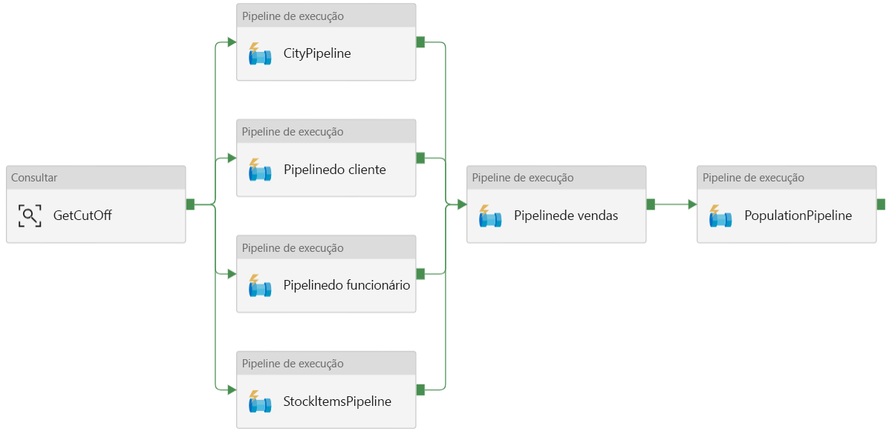

## <a name="incremental-loading"></a><span data-ttu-id="d78f9-149">Carregamento incremental</span><span class="sxs-lookup"><span data-stu-id="d78f9-149">Incremental loading</span></span>

<span data-ttu-id="d78f9-150">Quando você executa um processo automatizado de ETL ou ELT, é mais eficiente carregar apenas os dados alterados desde a execução anterior.</span><span class="sxs-lookup"><span data-stu-id="d78f9-150">When you run an automated ETL or ELT process, it's most efficient to load only the data that changed since the previous run.</span></span> <span data-ttu-id="d78f9-151">Isso é chamado de um *carregamento incremental* em vez de um carregamento completo que carrega todos os dados.</span><span class="sxs-lookup"><span data-stu-id="d78f9-151">This is called an *incremental load*, as opposed to a full load that loads all of the data.</span></span> <span data-ttu-id="d78f9-152">Para executar um carregamento incremental, você precisa de uma maneira de identificar quais dados foram alterados.</span><span class="sxs-lookup"><span data-stu-id="d78f9-152">To perform an incremental load, you need a way to identify which data has changed.</span></span> <span data-ttu-id="d78f9-153">A abordagem mais comum é usar um valor *alto de marca d'água*, o que significa acompanhar o valor mais recente de alguma coluna na tabela de origem, uma coluna de data e hora ou uma coluna de inteiro exclusivo.</span><span class="sxs-lookup"><span data-stu-id="d78f9-153">The most common approach is to use a *high water mark* value, which means tracking the latest value of some column in the source table, either a datetime column or a unique integer column.</span></span> 

<span data-ttu-id="d78f9-154">Começando com o SQL Server 2016, você pode usar [tabelas temporais](/sql/relational-databases/tables/temporal-tables).</span><span class="sxs-lookup"><span data-stu-id="d78f9-154">Starting with SQL Server 2016, you can use [temporal tables](/sql/relational-databases/tables/temporal-tables).</span></span> <span data-ttu-id="d78f9-155">Tratam-se de tabelas com versão do sistema que mantêm um histórico completo das alterações de dados.</span><span class="sxs-lookup"><span data-stu-id="d78f9-155">These are system-versioned tables that keep a full history of data changes.</span></span> <span data-ttu-id="d78f9-156">O mecanismo de banco de dados registra automaticamente o histórico de todas as alterações em uma tabela de histórico separada.</span><span class="sxs-lookup"><span data-stu-id="d78f9-156">The database engine automatically records the history of every change in a separate history table.</span></span> <span data-ttu-id="d78f9-157">Você pode consultar os dados históricos com a adição de uma cláusula FOR SYSTEM_TIME para uma consulta.</span><span class="sxs-lookup"><span data-stu-id="d78f9-157">You can query the historical data by adding a FOR SYSTEM_TIME clause to a query.</span></span> <span data-ttu-id="d78f9-158">Internamente, o mecanismo de banco de dados consulta a tabela do histórico, mas isso é transparente ao aplicativo.</span><span class="sxs-lookup"><span data-stu-id="d78f9-158">Internally, the database engine queries the history table, but this is transparent to the application.</span></span> 

> [!NOTE]
> <span data-ttu-id="d78f9-159">Para versões anteriores do SQL Server, você pode usar a CDC ([Captura de Dados de Alterações](/sql/relational-databases/track-changes/about-change-data-capture-sql-server)).</span><span class="sxs-lookup"><span data-stu-id="d78f9-159">For earlier versions of SQL Server, you can use [Change Data Capture](/sql/relational-databases/track-changes/about-change-data-capture-sql-server) (CDC).</span></span> <span data-ttu-id="d78f9-160">Essa abordagem é menos conveniente do que as tabelas temporais porque você tem de consultar uma tabela separada, e as alterações são controladas por um número de sequência de log em vez de um carimbo de data/hora.</span><span class="sxs-lookup"><span data-stu-id="d78f9-160">This approach is less convenient than temporal tables, because you have to query a separate change table, and changes are tracked by a log sequence number, rather than a timestamp.</span></span> 

<span data-ttu-id="d78f9-161">Tabelas temporais são úteis para dados de dimensão, os quais podem ser alterados ao longo do tempo.</span><span class="sxs-lookup"><span data-stu-id="d78f9-161">Temporal tables are useful for dimension data, which can change over time.</span></span> <span data-ttu-id="d78f9-162">Tabelas de fatos geralmente representam uma transação imutável, como uma venda, caso em que não faz sentido manter o histórico de versão do sistema.</span><span class="sxs-lookup"><span data-stu-id="d78f9-162">Fact tables usually represent an immutable transaction such as a sale, in which case keeping the system version history doesn't make sense.</span></span> <span data-ttu-id="d78f9-163">Em vez disso, as transações normalmente contam com uma coluna que representa a data da transação, que pode ser usada como o valor de marca d'água.</span><span class="sxs-lookup"><span data-stu-id="d78f9-163">Instead, transactions usually have a column that represents the transaction date, which can be used as the watermark value.</span></span> <span data-ttu-id="d78f9-164">Por exemplo, no banco de dados OLTP da Wide World Importers, as tabelas Sales.Invoices e Sales.InvoiceLines têm um campo `LastEditedWhen` que é padrão para `sysdatetime()`.</span><span class="sxs-lookup"><span data-stu-id="d78f9-164">For example, in the Wide World Importers OLTP database, the Sales.Invoices and Sales.InvoiceLines tables have a `LastEditedWhen` field that defaults to `sysdatetime()`.</span></span> 

<span data-ttu-id="d78f9-165">Aqui está o fluxo geral para o pipeline ELT:</span><span class="sxs-lookup"><span data-stu-id="d78f9-165">Here is the general flow for the ELT pipeline:</span></span>

1. <span data-ttu-id="d78f9-166">Para cada tabela no banco de dados de origem, acompanhe o tempo de corte quando o último trabalho ELT foi executado.</span><span class="sxs-lookup"><span data-stu-id="d78f9-166">For each table in the source database, track the cutoff time when the last ELT job ran.</span></span> <span data-ttu-id="d78f9-167">Armazene essas informações no data warehouse.</span><span class="sxs-lookup"><span data-stu-id="d78f9-167">Store this information in the data warehouse.</span></span> <span data-ttu-id="d78f9-168">(Durante a instalação inicial, todas as horas são definidas como '1-1-1900'.)</span><span class="sxs-lookup"><span data-stu-id="d78f9-168">(On initial setup, all times are set to '1-1-1900'.)</span></span>

2. <span data-ttu-id="d78f9-169">Durante a etapa de exportação de dados, a hora de corte é passada como um parâmetro para um conjunto de procedimentos armazenados no banco de dados de origem.</span><span class="sxs-lookup"><span data-stu-id="d78f9-169">During the data export step, the cutoff time is passed as a parameter to a set of stored procedures in the source database.</span></span> <span data-ttu-id="d78f9-170">Esses procedimentos armazenados consultam todos os registros que foram alterados ou criados após a hora de corte.</span><span class="sxs-lookup"><span data-stu-id="d78f9-170">These stored procedures query for any records that were changed or created after the cutoff time.</span></span> <span data-ttu-id="d78f9-171">Para a tabela de fatos de Vendas, é usada a coluna `LastEditedWhen`.</span><span class="sxs-lookup"><span data-stu-id="d78f9-171">For the Sales fact table, the `LastEditedWhen` column is used.</span></span> <span data-ttu-id="d78f9-172">Para os dados de dimensão, são usadas tabelas temporais com versão do sistema.</span><span class="sxs-lookup"><span data-stu-id="d78f9-172">For the dimension data, system-versioned temporal tables are used.</span></span>

3. <span data-ttu-id="d78f9-173">Quando a migração de dados for concluída, atualize a tabela que armazena os tempos de corte.</span><span class="sxs-lookup"><span data-stu-id="d78f9-173">When the data migration is complete, update the table that stores the cutoff times.</span></span>

<span data-ttu-id="d78f9-174">Também é útil registrar uma *linhagem* para cada execução de ELT.</span><span class="sxs-lookup"><span data-stu-id="d78f9-174">It's also useful to record a *lineage* for each ELT run.</span></span> <span data-ttu-id="d78f9-175">Para um determinado registro, a linhagem associa esse registro com a execução de ELT que produziu os dados.</span><span class="sxs-lookup"><span data-stu-id="d78f9-175">For a given record, the lineage associates that record with the ELT run that produced the data.</span></span> <span data-ttu-id="d78f9-176">Para cada execução de ETL, um novo registro de linhagem é criado para cada tabela, mostrando os tempos de carregamento iniciais e finais.</span><span class="sxs-lookup"><span data-stu-id="d78f9-176">For each ETL run, a new lineage record is created for every table, showing the starting and ending load times.</span></span> <span data-ttu-id="d78f9-177">As chaves de linhagem para cada registro são armazenadas nas tabelas de dimensões e de fatos.</span><span class="sxs-lookup"><span data-stu-id="d78f9-177">The lineage keys for each record are stored in the dimension and fact tables.</span></span>

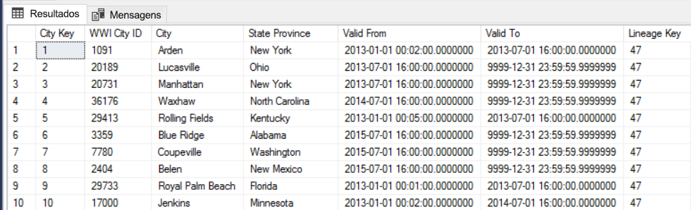

<span data-ttu-id="d78f9-178">Depois que um novo lote de dados for carregado no warehouse, atualize o modelo de tabela do Analysis Services.</span><span class="sxs-lookup"><span data-stu-id="d78f9-178">After a new batch of data is loaded into the warehouse, refresh the Analysis Services tabular model.</span></span> <span data-ttu-id="d78f9-179">Consulte [Atualização assíncrona com a API REST](/azure/analysis-services/analysis-services-async-refresh).</span><span class="sxs-lookup"><span data-stu-id="d78f9-179">See [Asynchronous refresh with the REST API](/azure/analysis-services/analysis-services-async-refresh).</span></span>

## <a name="data-cleansing"></a><span data-ttu-id="d78f9-180">Limpeza de dados</span><span class="sxs-lookup"><span data-stu-id="d78f9-180">Data cleansing</span></span>

<span data-ttu-id="d78f9-181">A limpeza de dados deve ser parte do processo de ELT.</span><span class="sxs-lookup"><span data-stu-id="d78f9-181">Data cleansing should be part of the ELT process.</span></span> <span data-ttu-id="d78f9-182">Nessa arquitetura de referência, uma fonte de dados incorretos é a tabela de população da cidade, em que algumas cidades apresentam zero população, talvez porque nenhum dado estivesse disponível.</span><span class="sxs-lookup"><span data-stu-id="d78f9-182">In this reference architecture, one source of bad data is the city population table, where some cities have zero population, perhaps because no data was available.</span></span> <span data-ttu-id="d78f9-183">Durante o processamento, o pipeline ELT remove essas cidades da tabela de população da cidade.</span><span class="sxs-lookup"><span data-stu-id="d78f9-183">During processing, the ELT pipeline removes those cities from the city population table.</span></span> <span data-ttu-id="d78f9-184">Execute a limpeza de dados em tabelas de preparo em vez de tabelas externas.</span><span class="sxs-lookup"><span data-stu-id="d78f9-184">Perform data cleansing on staging tables, rather than external tables.</span></span>

<span data-ttu-id="d78f9-185">Aqui está o procedimento armazenado que remove as cidades com zero população da tabela de população da cidade.</span><span class="sxs-lookup"><span data-stu-id="d78f9-185">Here is the stored procedure that removes the cities with zero population from the City Population table.</span></span> <span data-ttu-id="d78f9-186">(Você pode encontrar o arquivo de origem [aqui](https://github.com/mspnp/reference-architectures/blob/master/data/enterprise_bi_sqldw_advanced/azure/sqldw_scripts/citypopulation/%5BIntegration%5D.%5BMigrateExternalCityPopulationData%5D.sql).)</span><span class="sxs-lookup"><span data-stu-id="d78f9-186">(You can find the source file [here](https://github.com/mspnp/reference-architectures/blob/master/data/enterprise_bi_sqldw_advanced/azure/sqldw_scripts/citypopulation/%5BIntegration%5D.%5BMigrateExternalCityPopulationData%5D.sql).)</span></span> 

```sql
DELETE FROM [Integration].[CityPopulation_Staging]
WHERE RowNumber in (SELECT DISTINCT RowNumber
FROM [Integration].[CityPopulation_Staging]
WHERE POPULATION = 0
GROUP BY RowNumber
HAVING COUNT(RowNumber) = 4)
```

## <a name="external-data-sources"></a><span data-ttu-id="d78f9-187">Fontes de dados externas</span><span class="sxs-lookup"><span data-stu-id="d78f9-187">External data sources</span></span>

<span data-ttu-id="d78f9-188">Os data warehouses geralmente consolidam dados de várias fontes.</span><span class="sxs-lookup"><span data-stu-id="d78f9-188">Data warehouses often consolidate data from multiple sources.</span></span> <span data-ttu-id="d78f9-189">Essa arquitetura de referência carrega uma fonte de dados externa que contém dados demográficos dos dados.</span><span class="sxs-lookup"><span data-stu-id="d78f9-189">This reference architecture loads an external data source that contains demographics data.</span></span> <span data-ttu-id="d78f9-190">Esse conjunto de dados está disponível no armazenamento de blobs do Azure como parte do exemplo [WorldWideImportersDW](https://github.com/Microsoft/sql-server-samples/tree/master/samples/databases/wide-world-importers/sample-scripts/polybase).</span><span class="sxs-lookup"><span data-stu-id="d78f9-190">This dataset is available in Azure blob storage as part of the [WorldWideImportersDW](https://github.com/Microsoft/sql-server-samples/tree/master/samples/databases/wide-world-importers/sample-scripts/polybase) sample.</span></span>

<span data-ttu-id="d78f9-191">O Azure Data Factory pode copiar diretamente do armazenamento de blob usando o [conector do armazenamento de blobs](/azure/data-factory/connector-azure-blob-storage).</span><span class="sxs-lookup"><span data-stu-id="d78f9-191">Azure Data Factory can copy directly from blob storage, using the [blob storage connector](/azure/data-factory/connector-azure-blob-storage).</span></span> <span data-ttu-id="d78f9-192">No entanto, o conector requer uma cadeia de conexão ou uma assinatura de acesso compartilhado para que não possa ser usado para copiar um blob com acesso de leitura público.</span><span class="sxs-lookup"><span data-stu-id="d78f9-192">However, the connector requires a connection string or a shared access signature, so it can't be used to copy a blob with public read access.</span></span> <span data-ttu-id="d78f9-193">Como alternativa, você pode usar o PolyBase para criar uma tabela externa no armazenamento de blobs e, em seguida, copiar as tabelas externas no SQL Data Warehouse.</span><span class="sxs-lookup"><span data-stu-id="d78f9-193">As a workaround, you can use PolyBase to create an external table over Blob storage and then copy the external tables into SQL Data Warehouse.</span></span> 

## <a name="handling-large-binary-data"></a><span data-ttu-id="d78f9-194">Manipulação de dados binários grandes</span><span class="sxs-lookup"><span data-stu-id="d78f9-194">Handling large binary data</span></span> 

<span data-ttu-id="d78f9-195">No banco de dados de origem, a tabela de Cidades tem uma coluna de local que contém um tipo de dados espaciais de [geografia](/sql/t-sql/spatial-geography/spatial-types-geography).</span><span class="sxs-lookup"><span data-stu-id="d78f9-195">In the source database, the Cities table has a Location column that holds a [geography](/sql/t-sql/spatial-geography/spatial-types-geography) spatial data type.</span></span> <span data-ttu-id="d78f9-196">O SQL Data Warehouse não oferece suporte ao tipo **geografia** nativamente, portanto, esse campo é convertido em um tipo **varbinary** durante o carregamento.</span><span class="sxs-lookup"><span data-stu-id="d78f9-196">SQL Data Warehouse doesn't support the **geography** type natively, so this field is converted to a **varbinary** type during loading.</span></span> <span data-ttu-id="d78f9-197">(Consulte [Soluções alternativas para tipos de dados sem suporte](/azure/sql-data-warehouse/sql-data-warehouse-tables-data-types#unsupported-data-types).)</span><span class="sxs-lookup"><span data-stu-id="d78f9-197">(See [Workarounds for unsupported data types](/azure/sql-data-warehouse/sql-data-warehouse-tables-data-types#unsupported-data-types).)</span></span>

<span data-ttu-id="d78f9-198">No entanto, o PolyBase dá suporte a um tamanho máximo de coluna de `varbinary(8000)`, que significa que alguns dados podem ser truncados.</span><span class="sxs-lookup"><span data-stu-id="d78f9-198">However, PolyBase supports a maximum column size of `varbinary(8000)`, which means some data could be truncated.</span></span> <span data-ttu-id="d78f9-199">Uma solução alternativa para esse problema é dividir os dados em partes durante a exportação e remontar as partes, da seguinte maneira:</span><span class="sxs-lookup"><span data-stu-id="d78f9-199">A workaround for this problem is to break the data up into chunks during export, and then reassemble the chunks, as follows:</span></span>

1. <span data-ttu-id="d78f9-200">Crie uma tabela de preparo temporária para a coluna Local.</span><span class="sxs-lookup"><span data-stu-id="d78f9-200">Create a temporary staging table for the Location column.</span></span>

2. <span data-ttu-id="d78f9-201">Para cada cidade, divida os dados de localização em partes de 8.000 bytes, resultando em 1 &ndash; N linhas para cada cidade.</span><span class="sxs-lookup"><span data-stu-id="d78f9-201">For each city, split the location data into 8000-byte chunks, resulting in 1 &ndash; N rows for each city.</span></span>

3. <span data-ttu-id="d78f9-202">Para remontar as partes, use o operador T-SQL [PIVOT](/sql/t-sql/queries/from-using-pivot-and-unpivot) para converter linhas em colunas e depois concatenar os valores de coluna para cada cidade.</span><span class="sxs-lookup"><span data-stu-id="d78f9-202">To reassemble the chunks, use the T-SQL [PIVOT](/sql/t-sql/queries/from-using-pivot-and-unpivot) operator to convert rows into columns and then concatenate the column values for each city.</span></span>

<span data-ttu-id="d78f9-203">O desafio é que cada cidade será dividida em um número diferente de linhas, dependendo do tamanho dos dados de geografia.</span><span class="sxs-lookup"><span data-stu-id="d78f9-203">The challenge is that each city will be split into a different number of rows, depending on the size of geography data.</span></span> <span data-ttu-id="d78f9-204">Para que o operador PIVOT funcione, cada cidade deve ter o mesmo número de linhas.</span><span class="sxs-lookup"><span data-stu-id="d78f9-204">For the PIVOT operator to work, every city must have the same number of rows.</span></span> <span data-ttu-id="d78f9-205">Para isso funcionar, a consulta T-SQL (que você pode exibir [here][MergeLocation]) realiza alguns truques para preencher as linhas com valores em branco, de modo que cada cidade tenha o mesmo número de colunas após a dinamização.</span><span class="sxs-lookup"><span data-stu-id="d78f9-205">To make this work, the T-SQL query (which you can view [here][MergeLocation]) does some tricks to pad out the rows with blank values, so that every city has the same number of columns after the pivot.</span></span> <span data-ttu-id="d78f9-206">A consulta resultante acaba sendo muito mais rápida do que executar o loop pelas linhas uma por vez.</span><span class="sxs-lookup"><span data-stu-id="d78f9-206">The resulting query turns out to be much faster than looping through the rows one at a time.</span></span>

<span data-ttu-id="d78f9-207">A mesma abordagem é usada para dados de imagem.</span><span class="sxs-lookup"><span data-stu-id="d78f9-207">The same approach is used for image data.</span></span>

## <a name="slowly-changing-dimensions"></a><span data-ttu-id="d78f9-208">Dimensões de alteração lenta</span><span class="sxs-lookup"><span data-stu-id="d78f9-208">Slowly changing dimensions</span></span>

<span data-ttu-id="d78f9-209">Dados de dimensão são relativamente estáticos, mas isso pode mudar.</span><span class="sxs-lookup"><span data-stu-id="d78f9-209">Dimension data is relatively static, but it can change.</span></span> <span data-ttu-id="d78f9-210">Por exemplo, um produto pode ser reatribuído a uma categoria de produto diferente.</span><span class="sxs-lookup"><span data-stu-id="d78f9-210">For example, a product might get reassigned to a different product category.</span></span> <span data-ttu-id="d78f9-211">Há várias abordagens para o tratamento de dimensões de alteração lenta.</span><span class="sxs-lookup"><span data-stu-id="d78f9-211">There are several approaches to handling slowly changing dimensions.</span></span> <span data-ttu-id="d78f9-212">Uma técnica comum, chamada [Tipo 2](https://wikipedia.org/wiki/Slowly_changing_dimension#Type_2:_add_new_row), é adicionar um novo registro sempre que uma dimensão for alterada.</span><span class="sxs-lookup"><span data-stu-id="d78f9-212">A common technique, called [Type 2](https://wikipedia.org/wiki/Slowly_changing_dimension#Type_2:_add_new_row), is to add a new record whenever a dimension changes.</span></span> 

<span data-ttu-id="d78f9-213">Para implementar a abordagem Tipo 2, as tabelas de dimensões precisam de colunas adicionais que especifiquem o intervalo de datas efetivas para um determinado registro.</span><span class="sxs-lookup"><span data-stu-id="d78f9-213">In order to implement the Type 2 approach, dimension tables need additional columns that specify the effective date range for a given record.</span></span> <span data-ttu-id="d78f9-214">Além disso, as chaves primárias do banco de dados de origem serão duplicadas, portanto, a tabela de dimensão deve ter uma chave primária artificial.</span><span class="sxs-lookup"><span data-stu-id="d78f9-214">Also, primary keys from the source database will be duplicated, so the dimension table must have an artificial primary key.</span></span>

<span data-ttu-id="d78f9-215">A imagem a seguir mostra a tabela Dimension.City.</span><span class="sxs-lookup"><span data-stu-id="d78f9-215">The following image shows the Dimension.City table.</span></span> <span data-ttu-id="d78f9-216">A coluna `WWI City ID` é a chave primária do banco de dados de origem.</span><span class="sxs-lookup"><span data-stu-id="d78f9-216">The `WWI City ID` column is the primary key from the source database.</span></span> <span data-ttu-id="d78f9-217">A coluna `City Key` é uma chave artificial gerada durante o pipeline ETL.</span><span class="sxs-lookup"><span data-stu-id="d78f9-217">The `City Key` column is an artificial key generated during the ETL pipeline.</span></span> <span data-ttu-id="d78f9-218">Além disso, observe que a tabela tem as colunas `Valid From` e `Valid To`, que definem o intervalo de quando cada linha era válida.</span><span class="sxs-lookup"><span data-stu-id="d78f9-218">Also notice that the table has `Valid From` and `Valid To` columns, which define the range when each row was valid.</span></span> <span data-ttu-id="d78f9-219">Os valores atuais têm um `Valid To` igual a “9999-12-31”.</span><span class="sxs-lookup"><span data-stu-id="d78f9-219">Current values have a `Valid To` equal to '9999-12-31'.</span></span>


<span data-ttu-id="d78f9-220">A vantagem dessa abordagem é que ela preserva os dados históricos, que podem ser valiosos para análise.</span><span class="sxs-lookup"><span data-stu-id="d78f9-220">The advantage of this approach is that it preserves historical data, which can be valuable for analysis.</span></span> <span data-ttu-id="d78f9-221">No entanto, também significa que haverá várias linhas para a mesma entidade.</span><span class="sxs-lookup"><span data-stu-id="d78f9-221">However, it also means there will be multiple rows for the same entity.</span></span> <span data-ttu-id="d78f9-222">Por exemplo, aqui estão os registros que correspondem a `WWI City ID` = 28561:</span><span class="sxs-lookup"><span data-stu-id="d78f9-222">For example, here are the records that match `WWI City ID` = 28561:</span></span>

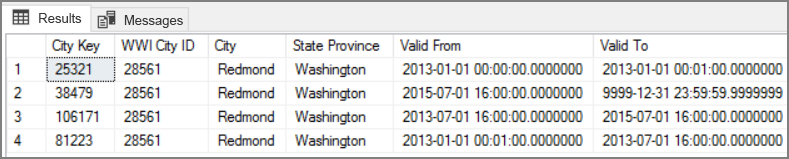

<span data-ttu-id="d78f9-223">Para cada fato de Vendas, você associa o fato a uma única linha na tabela de dimensões Cidade, correspondente à data da nota fiscal.</span><span class="sxs-lookup"><span data-stu-id="d78f9-223">For each Sales fact, you want to associate that fact with a single row in City dimension table, corresponding to the invoice date.</span></span> <span data-ttu-id="d78f9-224">Como parte do processo de ETL, crie uma coluna adicional que</span><span class="sxs-lookup"><span data-stu-id="d78f9-224">As part of the ETL process, create an additional column that</span></span> 

<span data-ttu-id="d78f9-225">A consulta de T-SQL a seguir cria uma tabela temporária que associa cada fatura com a chave Cidade correta da tabela de dimensões Cidade.</span><span class="sxs-lookup"><span data-stu-id="d78f9-225">The following T-SQL query creates a temporary table that associates each invoice with the correct City Key from the City dimension table.</span></span>

```sql
CREATE TABLE CityHolder
WITH (HEAP , DISTRIBUTION = HASH([WWI Invoice ID]))
AS
SELECT DISTINCT s1.[WWI Invoice ID] AS [WWI Invoice ID],
                c.[City Key] AS [City Key]
    FROM [Integration].[Sale_Staging] s1
    CROSS APPLY (
                SELECT TOP 1 [City Key]
                    FROM [Dimension].[City]
                WHERE [WWI City ID] = s1.[WWI City ID]
                    AND s1.[Last Modified When] > [Valid From]
                    AND s1.[Last Modified When] <= [Valid To]
                ORDER BY [Valid From], [City Key] DESC
                ) c

```

<span data-ttu-id="d78f9-226">Essa tabela é usada para preencher uma coluna na tabela de fatos Vendas:</span><span class="sxs-lookup"><span data-stu-id="d78f9-226">This table is used to populate a column in the Sales fact table:</span></span>

```sql
UPDATE [Integration].[Sale_Staging]
SET [Integration].[Sale_Staging].[WWI Customer ID] =  CustomerHolder.[WWI Customer ID]
```

<span data-ttu-id="d78f9-227">Essa coluna permite que uma consulta do Power BI encontre o registro correto de Cidade para uma nota fiscal de vendas específica.</span><span class="sxs-lookup"><span data-stu-id="d78f9-227">This column enables a Power BI query to find the correct City record for a given sales invoice.</span></span>

## <a name="security-considerations"></a><span data-ttu-id="d78f9-228">Considerações de segurança</span><span class="sxs-lookup"><span data-stu-id="d78f9-228">Security considerations</span></span>

<span data-ttu-id="d78f9-229">Para obter mais segurança, você pode usar [pontos de extremidade de serviço de rede Virtual](/azure/virtual-network/virtual-network-service-endpoints-overview) para proteger os recursos de serviço do Azure apenas na sua rede virtual.</span><span class="sxs-lookup"><span data-stu-id="d78f9-229">For additional security, you can use [Virtual Network service endpoints](/azure/virtual-network/virtual-network-service-endpoints-overview) to secure Azure service resources to only your virtual network.</span></span> <span data-ttu-id="d78f9-230">Isso remove totalmente o acesso público via Internet a esses recursos, permitindo o tráfego somente da sua rede virtual.</span><span class="sxs-lookup"><span data-stu-id="d78f9-230">This fully removes public Internet access to those resources, allowing traffic only from your virtual network.</span></span>

<span data-ttu-id="d78f9-231">Com essa abordagem, você cria uma VNet no Azure e, em seguida, cria pontos de extremidade de serviço privados para serviços do Azure.</span><span class="sxs-lookup"><span data-stu-id="d78f9-231">With this approach, you create a VNet in Azure and then create private service endpoints for Azure services.</span></span> <span data-ttu-id="d78f9-232">Esses serviços são então restringidos ao tráfego de rede virtual.</span><span class="sxs-lookup"><span data-stu-id="d78f9-232">Those services are then restricted to traffic from that virtual network.</span></span> <span data-ttu-id="d78f9-233">Você também pode alcançá-los a partir da sua rede local por meio de um gateway.</span><span class="sxs-lookup"><span data-stu-id="d78f9-233">You can also reach them from your on-premises network through a gateway.</span></span>

<span data-ttu-id="d78f9-234">Esteja ciente das seguintes limitações:</span><span class="sxs-lookup"><span data-stu-id="d78f9-234">Be aware of the following limitations:</span></span>

- <span data-ttu-id="d78f9-235">No momento que essa arquitetura de referência foi criada, os pontos de extremidade de serviço da VNet contam com suporte para Armazenamento do Azure e SQL Data Warehouse do Azure, mas não para o Azure Analysis Service.</span><span class="sxs-lookup"><span data-stu-id="d78f9-235">At the time this reference architecture was created, VNet service endpoints are supported for Azure Storage and Azure SQL Data Warehouse, but not for Azure Analysis Service.</span></span> <span data-ttu-id="d78f9-236">Verificar o status mais recente [aqui](https://azure.microsoft.com/updates/?product=virtual-network).</span><span class="sxs-lookup"><span data-stu-id="d78f9-236">Check the latest status [here](https://azure.microsoft.com/updates/?product=virtual-network).</span></span> 

- <span data-ttu-id="d78f9-237">Se os pontos de extremidade de serviço estão habilitados para o Armazenamento do Azure, o PolyBase não pode copiar dados do armazenamento no SQL Data Warehouse.</span><span class="sxs-lookup"><span data-stu-id="d78f9-237">If service endpoints are enabled for Azure Storage, PolyBase cannot copy data from Storage into SQL Data Warehouse.</span></span> <span data-ttu-id="d78f9-238">Há uma mitigação para esse problema.</span><span class="sxs-lookup"><span data-stu-id="d78f9-238">There is a mitigation for this issue.</span></span> <span data-ttu-id="d78f9-239">Para obter mais informações, consulte [Impacto de usar pontos de extremidade de serviço de VNet com Armazenamento do Azure](/azure/sql-database/sql-database-vnet-service-endpoint-rule-overview?toc=%2fazure%2fvirtual-network%2ftoc.json#impact-of-using-vnet-service-endpoints-with-azure-storage).</span><span class="sxs-lookup"><span data-stu-id="d78f9-239">For more information, see [Impact of using VNet Service Endpoints with Azure storage](/azure/sql-database/sql-database-vnet-service-endpoint-rule-overview?toc=%2fazure%2fvirtual-network%2ftoc.json#impact-of-using-vnet-service-endpoints-with-azure-storage).</span></span> 

- <span data-ttu-id="d78f9-240">Para mover dados do local para o Armazenamento do Azure, você precisará listar permissões dos endereços IP públicos do seu local ou ExpressRoute.</span><span class="sxs-lookup"><span data-stu-id="d78f9-240">To move data from on-premises into Azure Storage, you will need to whitelist public IP addresses from your on-premises or ExpressRoute.</span></span> <span data-ttu-id="d78f9-241">Para obter detalhes, consulte [Protegendo serviços do Azure em redes virtuais](/azure/virtual-network/virtual-network-service-endpoints-overview#securing-azure-services-to-virtual-networks).</span><span class="sxs-lookup"><span data-stu-id="d78f9-241">For details, see [Securing Azure services to virtual networks](/azure/virtual-network/virtual-network-service-endpoints-overview#securing-azure-services-to-virtual-networks).</span></span>

- <span data-ttu-id="d78f9-242">Para habilitar o Analysis Services para ler dados do SQL Data Warehouse, implante uma VM do Windows para a rede virtual que contém o ponto de extremidade de serviço do SQL Data Warehouse.</span><span class="sxs-lookup"><span data-stu-id="d78f9-242">To enable Analysis Services to read data from SQL Data Warehouse, deploy a Windows VM to the virtual network that contains the SQL Data Warehouse service endpoint.</span></span> <span data-ttu-id="d78f9-243">Instale [Gateway de Dados Local do Azure](/azure/analysis-services/analysis-services-gateway) nessa VM.</span><span class="sxs-lookup"><span data-stu-id="d78f9-243">Install [Azure On-premises Data Gateway](/azure/analysis-services/analysis-services-gateway) on this VM.</span></span> <span data-ttu-id="d78f9-244">Depois conecte seu serviço do Azure Analysis para o gateway de dados.</span><span class="sxs-lookup"><span data-stu-id="d78f9-244">Then connect your Azure Analysis service to the data gateway.</span></span>

## <a name="deploy-the-solution"></a><span data-ttu-id="d78f9-245">Implantar a solução</span><span class="sxs-lookup"><span data-stu-id="d78f9-245">Deploy the solution</span></span>

<span data-ttu-id="d78f9-246">Uma implantação para essa arquitetura de referência está disponível em [GitHub][ref-arch-repo-folder].</span><span class="sxs-lookup"><span data-stu-id="d78f9-246">A deployment for this reference architecture is available on [GitHub][ref-arch-repo-folder].</span></span> <span data-ttu-id="d78f9-247">Ela implanta o seguinte:</span><span class="sxs-lookup"><span data-stu-id="d78f9-247">It deploys the following:</span></span>

  * <span data-ttu-id="d78f9-248">Uma VM Windows para simular um servidor de banco de dados local.</span><span class="sxs-lookup"><span data-stu-id="d78f9-248">A Windows VM to simulate an on-premises database server.</span></span> <span data-ttu-id="d78f9-249">Ela inclui o SQL Server 2017 e ferramentas relacionadas, juntamente com o Power BI Desktop.</span><span class="sxs-lookup"><span data-stu-id="d78f9-249">It includes SQL Server 2017 and related tools, along with Power BI Desktop.</span></span>
  * <span data-ttu-id="d78f9-250">Uma conta de armazenamento do Azure que fornece armazenamento de blobs para armazenar os dados exportados do banco de dados SQL Server.</span><span class="sxs-lookup"><span data-stu-id="d78f9-250">An Azure storage account that provides Blob storage to hold data exported from the SQL Server database.</span></span>
  * <span data-ttu-id="d78f9-251">Uma instância do SQL Data Warehouse do Azure.</span><span class="sxs-lookup"><span data-stu-id="d78f9-251">An Azure SQL Data Warehouse instance.</span></span>
  * <span data-ttu-id="d78f9-252">Uma instância do Azure Analysis Services.</span><span class="sxs-lookup"><span data-stu-id="d78f9-252">An Azure Analysis Services instance.</span></span>
  * <span data-ttu-id="d78f9-253">O Azure Data Factory e o pipeline do Data Factory para o trabalho ELT.</span><span class="sxs-lookup"><span data-stu-id="d78f9-253">Azure Data Factory and the Data Factory pipeline for the ELT job.</span></span>

### <a name="prerequisites"></a><span data-ttu-id="d78f9-254">Pré-requisitos</span><span class="sxs-lookup"><span data-stu-id="d78f9-254">Prerequisites</span></span>

[!INCLUDE [ref-arch-prerequisites.md](../../../includes/ref-arch-prerequisites.md)]

### <a name="variables"></a><span data-ttu-id="d78f9-255">variáveis</span><span class="sxs-lookup"><span data-stu-id="d78f9-255">Variables</span></span>

<span data-ttu-id="d78f9-256">As etapas a seguir incluem algumas variáveis definidas pelo usuário.</span><span class="sxs-lookup"><span data-stu-id="d78f9-256">The steps that follow include some user-defined variables.</span></span> <span data-ttu-id="d78f9-257">Você precisará substituí-las por valores que você definir.</span><span class="sxs-lookup"><span data-stu-id="d78f9-257">You will need to replace these with values that you define.</span></span>

- <span data-ttu-id="d78f9-258">`<data_factory_name>`.</span><span class="sxs-lookup"><span data-stu-id="d78f9-258">`<data_factory_name>`.</span></span> <span data-ttu-id="d78f9-259">Nome do Data Factory.</span><span class="sxs-lookup"><span data-stu-id="d78f9-259">Data Factory name.</span></span>
- <span data-ttu-id="d78f9-260">`<analysis_server_name>`.</span><span class="sxs-lookup"><span data-stu-id="d78f9-260">`<analysis_server_name>`.</span></span> <span data-ttu-id="d78f9-261">Nome do servidor do Analysis Services.</span><span class="sxs-lookup"><span data-stu-id="d78f9-261">Analysis Services server name.</span></span>
- <span data-ttu-id="d78f9-262">`<active_directory_upn>`.</span><span class="sxs-lookup"><span data-stu-id="d78f9-262">`<active_directory_upn>`.</span></span> <span data-ttu-id="d78f9-263">Seu nome UPN do Azure Active Directory.</span><span class="sxs-lookup"><span data-stu-id="d78f9-263">Your Azure Active Directory user principal name (UPN).</span></span> <span data-ttu-id="d78f9-264">Por exemplo, `user@contoso.com`.</span><span class="sxs-lookup"><span data-stu-id="d78f9-264">For example, `user@contoso.com`.</span></span>
- <span data-ttu-id="d78f9-265">`<data_warehouse_server_name>`.</span><span class="sxs-lookup"><span data-stu-id="d78f9-265">`<data_warehouse_server_name>`.</span></span> <span data-ttu-id="d78f9-266">Nome do servidor do SQL Data Warehouse.</span><span class="sxs-lookup"><span data-stu-id="d78f9-266">SQL Data Warehouse server name.</span></span>
- <span data-ttu-id="d78f9-267">`<data_warehouse_password>`.</span><span class="sxs-lookup"><span data-stu-id="d78f9-267">`<data_warehouse_password>`.</span></span> <span data-ttu-id="d78f9-268">Senha de administrador do SQL Data Warehouse.</span><span class="sxs-lookup"><span data-stu-id="d78f9-268">SQL Data Warehouse administrator password.</span></span>
- <span data-ttu-id="d78f9-269">`<resource_group_name>`.</span><span class="sxs-lookup"><span data-stu-id="d78f9-269">`<resource_group_name>`.</span></span> <span data-ttu-id="d78f9-270">O nome do grupo de recursos.</span><span class="sxs-lookup"><span data-stu-id="d78f9-270">The name of the resource group.</span></span>
- <span data-ttu-id="d78f9-271">`<region>`.</span><span class="sxs-lookup"><span data-stu-id="d78f9-271">`<region>`.</span></span> <span data-ttu-id="d78f9-272">A região do Azure onde os recursos serão implantados.</span><span class="sxs-lookup"><span data-stu-id="d78f9-272">The Azure region where the resources will be deployed.</span></span>
- <span data-ttu-id="d78f9-273">`<storage_account_name>`.</span><span class="sxs-lookup"><span data-stu-id="d78f9-273">`<storage_account_name>`.</span></span> <span data-ttu-id="d78f9-274">Nome da conta de armazenamento.</span><span class="sxs-lookup"><span data-stu-id="d78f9-274">Storage account name.</span></span> <span data-ttu-id="d78f9-275">Deve seguir as [regras de nomenclatura](../../best-practices/naming-conventions.md#naming-rules-and-restrictions) contas de armazenamento.</span><span class="sxs-lookup"><span data-stu-id="d78f9-275">Must follow the [naming rules](../../best-practices/naming-conventions.md#naming-rules-and-restrictions) for Storage accounts.</span></span>
- <span data-ttu-id="d78f9-276">`<sql-db-password>`.</span><span class="sxs-lookup"><span data-stu-id="d78f9-276">`<sql-db-password>`.</span></span> <span data-ttu-id="d78f9-277">Senha de logon do SQL Server.</span><span class="sxs-lookup"><span data-stu-id="d78f9-277">SQL Server login password.</span></span>

### <a name="deploy-azure-data-factory"></a><span data-ttu-id="d78f9-278">Implantar o Azure Data Factory</span><span class="sxs-lookup"><span data-stu-id="d78f9-278">Deploy Azure Data Factory</span></span>

1. <span data-ttu-id="d78f9-279">Navegue até a pasta `data\enterprise_bi_sqldw_advanced\azure\templates` do [GitHub repository][ref-arch-repo].</span><span class="sxs-lookup"><span data-stu-id="d78f9-279">Navigate to the `data\enterprise_bi_sqldw_advanced\azure\templates` folder of the [GitHub repository][ref-arch-repo].</span></span>

2. <span data-ttu-id="d78f9-280">Execute o seguinte comando da CLI do Azure para criar um grupo de recursos.</span><span class="sxs-lookup"><span data-stu-id="d78f9-280">Run the following Azure CLI command to create a resource group.</span></span>  

    ```bash
    az group create --name <resource_group_name> --location <region>  
    ```

    <span data-ttu-id="d78f9-281">Especifique uma região que dê suporte ao SQL Data Warehouse, Azure Analysis Services e Data Factory v2.</span><span class="sxs-lookup"><span data-stu-id="d78f9-281">Specify a region that supports SQL Data Warehouse, Azure Analysis Services, and Data Factory v2.</span></span> <span data-ttu-id="d78f9-282">Consulte [Produtos do Azure por região](https://azure.microsoft.com/global-infrastructure/services/)</span><span class="sxs-lookup"><span data-stu-id="d78f9-282">See [Azure Products by Region](https://azure.microsoft.com/global-infrastructure/services/)</span></span>

3. <span data-ttu-id="d78f9-283">Execute o comando a seguir</span><span class="sxs-lookup"><span data-stu-id="d78f9-283">Run the following command</span></span>

    ```
    az group deployment create --resource-group <resource_group_name> \
        --template-file adf-create-deploy.json \
        --parameters factoryName=<data_factory_name> location=<location>
    ```

<span data-ttu-id="d78f9-284">Depois, use o portal do Azure para obter a chave de autenticação para o [tempo de execução de integração](/azure/data-factory/concepts-integration-runtime) do Azure Data Factory, da seguinte maneira:</span><span class="sxs-lookup"><span data-stu-id="d78f9-284">Next, use the Azure Portal to get the authentication key for the Azure Data Factory [integration runtime](/azure/data-factory/concepts-integration-runtime), as follows:</span></span>

1. <span data-ttu-id="d78f9-285">No [portal do Azure](https://portal.azure.com/), navegue até a instância do Data Factory.</span><span class="sxs-lookup"><span data-stu-id="d78f9-285">In the [Azure Portal](https://portal.azure.com/), navigate to the Data Factory instance.</span></span>

2. <span data-ttu-id="d78f9-286">Na folha Data Factory, clique em **Criar e Monitorar**.</span><span class="sxs-lookup"><span data-stu-id="d78f9-286">In the Data Factory blade, click **Author & Monitor**.</span></span> <span data-ttu-id="d78f9-287">Isso abre o portal do Azure Data Factory em outra janela do navegador.</span><span class="sxs-lookup"><span data-stu-id="d78f9-287">This opens the Azure Data Factory portal in another browser window.</span></span>

    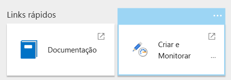

3. <span data-ttu-id="d78f9-288">No portal do Azure Data Factory, selecione o ícone de lápis (“Autor”).</span><span class="sxs-lookup"><span data-stu-id="d78f9-288">In the Azure Data Factory portal, select the pencil icon ("Author").</span></span> 

4. <span data-ttu-id="d78f9-289">Clique em **Conexões**, depois selecione **Integration Runtimes**.</span><span class="sxs-lookup"><span data-stu-id="d78f9-289">Click **Connections**, and then select **Integration Runtimes**.</span></span>

5. <span data-ttu-id="d78f9-290">Sob **sourceIntegrationRuntime**, clique no ícone de lápis (“Editar”).</span><span class="sxs-lookup"><span data-stu-id="d78f9-290">Under **sourceIntegrationRuntime**, click the pencil icon ("Edit").</span></span>

    > [!NOTE]
    > <span data-ttu-id="d78f9-291">O portal mostrará o status como “não disponível”.</span><span class="sxs-lookup"><span data-stu-id="d78f9-291">The portal will show the status as "unavailable".</span></span> <span data-ttu-id="d78f9-292">Isso é esperado até que você implante o servidor local.</span><span class="sxs-lookup"><span data-stu-id="d78f9-292">This is expected until you deploy the on-premises server.</span></span>

6. <span data-ttu-id="d78f9-293">Encontre **Key1** e copie o valor da chave de autenticação.</span><span class="sxs-lookup"><span data-stu-id="d78f9-293">Find **Key1** and copy the value of the authentication key.</span></span>

<span data-ttu-id="d78f9-294">Você precisará da chave de autenticação para a próxima etapa.</span><span class="sxs-lookup"><span data-stu-id="d78f9-294">You will need the authentication key for the next step.</span></span>

### <a name="deploy-the-simulated-on-premises-server"></a><span data-ttu-id="d78f9-295">Implantar o servidor local simulado</span><span class="sxs-lookup"><span data-stu-id="d78f9-295">Deploy the simulated on-premises server</span></span>

<span data-ttu-id="d78f9-296">Essa etapa implanta uma VM como um servidor local simulado, que inclui o SQL Server 2017 e as ferramentas relacionadas.</span><span class="sxs-lookup"><span data-stu-id="d78f9-296">This step deploys a VM as a simulated on-premises server, which includes SQL Server 2017 and related tools.</span></span> <span data-ttu-id="d78f9-297">Também carrega o exemplo de [Wide World Importers OLTP database][wwi] no SQL Server.</span><span class="sxs-lookup"><span data-stu-id="d78f9-297">It also loads the [Wide World Importers OLTP database][wwi] into SQL Server.</span></span>

1. <span data-ttu-id="d78f9-298">Navegue até a pasta `data\enterprise_bi_sqldw_advanced\onprem\templates` do repositório.</span><span class="sxs-lookup"><span data-stu-id="d78f9-298">Navigate to the `data\enterprise_bi_sqldw_advanced\onprem\templates` folder of the repository.</span></span>

2. <span data-ttu-id="d78f9-299">No arquivo `onprem.parameters.json`, procure `adminPassword`.</span><span class="sxs-lookup"><span data-stu-id="d78f9-299">In the `onprem.parameters.json` file, search for `adminPassword`.</span></span> <span data-ttu-id="d78f9-300">Essa é a senha para fazer logon na VM do SQL Server.</span><span class="sxs-lookup"><span data-stu-id="d78f9-300">This is the password to log into the SQL Server VM.</span></span> <span data-ttu-id="d78f9-301">Substitua o valor com outra senha.</span><span class="sxs-lookup"><span data-stu-id="d78f9-301">Replace the value with another password.</span></span>

3. <span data-ttu-id="d78f9-302">No mesmo arquivo, procure `SqlUserCredentials`.</span><span class="sxs-lookup"><span data-stu-id="d78f9-302">In the same file, search for `SqlUserCredentials`.</span></span> <span data-ttu-id="d78f9-303">Essa propriedade especifica as credenciais da conta do SQL Server.</span><span class="sxs-lookup"><span data-stu-id="d78f9-303">This property specifies the SQL Server account credentials.</span></span> <span data-ttu-id="d78f9-304">Substitua a senha por um valor diferente.</span><span class="sxs-lookup"><span data-stu-id="d78f9-304">Replace the password with a different value.</span></span>

4. <span data-ttu-id="d78f9-305">No mesmo arquivo, cole a chave de autenticação do Integration Runtime no parâmetro `IntegrationRuntimeGatewayKey`, conforme mostrado abaixo:</span><span class="sxs-lookup"><span data-stu-id="d78f9-305">In the same file, paste the Integration Runtime authentication key into the `IntegrationRuntimeGatewayKey` parameter, as shown below:</span></span>

    ```json
    "protectedSettings": {
        "configurationArguments": {
            "SqlUserCredentials": {
                "userName": ".\\adminUser",
                "password": "<sql-db-password>"
            },
            "IntegrationRuntimeGatewayKey": "<authentication key>"
        }
    ```

5. <span data-ttu-id="d78f9-306">Execute o comando a seguir.</span><span class="sxs-lookup"><span data-stu-id="d78f9-306">Run the following command.</span></span>

    ```bash
    azbb -s <subscription_id> -g <resource_group_name> -l <region> -p onprem.parameters.json --deploy
    ```

<span data-ttu-id="d78f9-307">Essa etapa pode levar de 20 a 30 minutos para ser concluída.</span><span class="sxs-lookup"><span data-stu-id="d78f9-307">This step may take 20 to 30 minutes to complete.</span></span> <span data-ttu-id="d78f9-308">Ela inclui a execução de um script [DSC](/powershell/dsc/overview) para instalar as ferramentas e restaurar o banco de dados.</span><span class="sxs-lookup"><span data-stu-id="d78f9-308">It includes running a [DSC](/powershell/dsc/overview) script to install the tools and restore the database.</span></span> 

### <a name="deploy-azure-resources"></a><span data-ttu-id="d78f9-309">Implantar recursos do Azure</span><span class="sxs-lookup"><span data-stu-id="d78f9-309">Deploy Azure resources</span></span>

<span data-ttu-id="d78f9-310">Essa etapa provisiona o SQL Data Warehouse, o Azure Analysis Services e o Data Factory.</span><span class="sxs-lookup"><span data-stu-id="d78f9-310">This step provisions SQL Data Warehouse, Azure Analysis Services, and Data Factory.</span></span>

1. <span data-ttu-id="d78f9-311">Navegue até a pasta `data\enterprise_bi_sqldw_advanced\azure\templates` do [GitHub repository][ref-arch-repo].</span><span class="sxs-lookup"><span data-stu-id="d78f9-311">Navigate to the `data\enterprise_bi_sqldw_advanced\azure\templates` folder of the [GitHub repository][ref-arch-repo].</span></span>

2. <span data-ttu-id="d78f9-312">Execute o comando da CLI do Azure a seguir.</span><span class="sxs-lookup"><span data-stu-id="d78f9-312">Run the following Azure CLI command.</span></span> <span data-ttu-id="d78f9-313">Substitua os valores de parâmetro mostrados entre colchetes angulares.</span><span class="sxs-lookup"><span data-stu-id="d78f9-313">Replace the parameter values shown in angle brackets.</span></span>

    ```bash
    az group deployment create --resource-group <resource_group_name> \
     --template-file azure-resources-deploy.json \
     --parameters "dwServerName"="<data_warehouse_server_name>" \
     "dwAdminLogin"="adminuser" "dwAdminPassword"="<data_warehouse_password>" \ 
     "storageAccountName"="<storage_account_name>" \
     "analysisServerName"="<analysis_server_name>" \
     "analysisServerAdmin"="<user@contoso.com>"
    ```

    - <span data-ttu-id="d78f9-314">O parâmetro `storageAccountName` deve seguir as [regras de nomenclatura](../../best-practices/naming-conventions.md#naming-rules-and-restrictions) de contas de armazenamento.</span><span class="sxs-lookup"><span data-stu-id="d78f9-314">The `storageAccountName` parameter must follow the [naming rules](../../best-practices/naming-conventions.md#naming-rules-and-restrictions) for Storage accounts.</span></span> 
    - <span data-ttu-id="d78f9-315">Para o parâmetro `analysisServerAdmin`, use seu nome UPN do Azure Active Directory.</span><span class="sxs-lookup"><span data-stu-id="d78f9-315">For the `analysisServerAdmin` parameter, use your Azure Active Directory user principal name (UPN).</span></span>

3. <span data-ttu-id="d78f9-316">Execute o seguinte comando da CLI do Azure para obter a chave de acesso da conta de armazenamento.</span><span class="sxs-lookup"><span data-stu-id="d78f9-316">Run the following Azure CLI command to get the access key for the storage account.</span></span> <span data-ttu-id="d78f9-317">Você usará essa chave na próxima etapa.</span><span class="sxs-lookup"><span data-stu-id="d78f9-317">You will use this key in the next step.</span></span>

    ```bash
    az storage account keys list -n <storage_account_name> -g <resource_group_name> --query [0].value
    ```

4. <span data-ttu-id="d78f9-318">Execute o comando da CLI do Azure a seguir.</span><span class="sxs-lookup"><span data-stu-id="d78f9-318">Run the following Azure CLI command.</span></span> <span data-ttu-id="d78f9-319">Substitua os valores de parâmetro mostrados entre colchetes angulares.</span><span class="sxs-lookup"><span data-stu-id="d78f9-319">Replace the parameter values shown in angle brackets.</span></span> 

    ```bash
    az group deployment create --resource-group <resource_group_name> \
    --template-file adf-pipeline-deploy.json \
    --parameters "factoryName"="<data_factory_name>" \
    "sinkDWConnectionString"="Server=tcp:<data_warehouse_server_name>.database.windows.net,1433;Initial Catalog=wwi;Persist Security Info=False;User ID=adminuser;Password=<data_warehouse_password>;MultipleActiveResultSets=False;Encrypt=True;TrustServerCertificate=False;Connection Timeout=30;" \
    "blobConnectionString"="DefaultEndpointsProtocol=https;AccountName=<storage_account_name>;AccountKey=<storage_account_key>;EndpointSuffix=core.windows.net" \
    "sourceDBConnectionString"="Server=sql1;Database=WideWorldImporters;User Id=adminuser;Password=<sql-db-password>;Trusted_Connection=True;"
    ```

    <span data-ttu-id="d78f9-320">As cadeias de conexão têm subcadeias de caracteres mostradas entre colchetes angulares que devem ser substituídos.</span><span class="sxs-lookup"><span data-stu-id="d78f9-320">The connection strings have substrings shown in angle brackets that must be replaced.</span></span> <span data-ttu-id="d78f9-321">Para `<storage_account_key>`, use a chave que você obteve na etapa anterior.</span><span class="sxs-lookup"><span data-stu-id="d78f9-321">For `<storage_account_key>`, use the key that you got in the previous step.</span></span> <span data-ttu-id="d78f9-322">Para `<sql-db-password>`, use a senha da conta do SQL Server que você especificou no arquivo `onprem.parameters.json` anteriormente.</span><span class="sxs-lookup"><span data-stu-id="d78f9-322">For `<sql-db-password>`, use the SQL Server account password that you specified in the `onprem.parameters.json` file previously.</span></span>

### <a name="run-the-data-warehouse-scripts"></a><span data-ttu-id="d78f9-323">Executar os scripts de data warehouse</span><span class="sxs-lookup"><span data-stu-id="d78f9-323">Run the data warehouse scripts</span></span>

1. <span data-ttu-id="d78f9-324">No [Portal do Azure](https://portal.azure.com/), localize a VM local, que é chamada de `sql-vm1`.</span><span class="sxs-lookup"><span data-stu-id="d78f9-324">In the [Azure Portal](https://portal.azure.com/), find the on-premises VM, which is named `sql-vm1`.</span></span> <span data-ttu-id="d78f9-325">O nome de usuário e a senha para a VM são especificadas no arquivo `onprem.parameters.json`.</span><span class="sxs-lookup"><span data-stu-id="d78f9-325">The user name and password for the VM are specified in the `onprem.parameters.json` file.</span></span>

2. <span data-ttu-id="d78f9-326">Clique em **Conectar** e use a Área de Trabalho Remota para se conectar à VM.</span><span class="sxs-lookup"><span data-stu-id="d78f9-326">Click **Connect** and use Remote Desktop to connect to the VM.</span></span>

3. <span data-ttu-id="d78f9-327">Na sua sessão de Área de Trabalho Remota, abra um prompt de comando e navegue até a pasta a seguir na VM:</span><span class="sxs-lookup"><span data-stu-id="d78f9-327">From your Remote Desktop session, open a command prompt and navigate to the following folder on the VM:</span></span>

    ```
    cd C:\SampleDataFiles\reference-architectures\data\enterprise_bi_sqldw_advanced\azure\sqldw_scripts
    ```

4. <span data-ttu-id="d78f9-328">Execute o comando a seguir:</span><span class="sxs-lookup"><span data-stu-id="d78f9-328">Run the following command:</span></span>

    ```
    deploy_database.cmd -S <data_warehouse_server_name>.database.windows.net -d wwi -U adminuser -P <data_warehouse_password> -N -I
    ```

    <span data-ttu-id="d78f9-329">Para `<data_warehouse_server_name>` e `<data_warehouse_password>`, use o nome do servidor do data warehouse e a senha de antes.</span><span class="sxs-lookup"><span data-stu-id="d78f9-329">For `<data_warehouse_server_name>` and `<data_warehouse_password>`, use the data warehouse server name and password from earlier.</span></span>

<span data-ttu-id="d78f9-330">Para verificar essa etapa, é possível usar o SSMS (SQL Server Management Studio) para se conectar ao banco de dados do SQL Data Warehouse.</span><span class="sxs-lookup"><span data-stu-id="d78f9-330">To verify this step, you can use SQL Server Management Studio (SSMS) to connect to the SQL Data Warehouse database.</span></span> <span data-ttu-id="d78f9-331">Você deve ver os esquemas de tabela do banco de dados.</span><span class="sxs-lookup"><span data-stu-id="d78f9-331">You should see the database table schemas.</span></span>

### <a name="run-the-data-factory-pipeline"></a><span data-ttu-id="d78f9-332">Executar o pipeline da Data Factory</span><span class="sxs-lookup"><span data-stu-id="d78f9-332">Run the Data Factory pipeline</span></span>

1. <span data-ttu-id="d78f9-333">Na mesma sessão de Área de Trabalho Remota, abra uma janela do PowerShell.</span><span class="sxs-lookup"><span data-stu-id="d78f9-333">From the same Remote Desktop session, open a PowerShell window.</span></span>

2. <span data-ttu-id="d78f9-334">Execute o comando do PowerShell a seguir.</span><span class="sxs-lookup"><span data-stu-id="d78f9-334">Run the following PowerShell command.</span></span> <span data-ttu-id="d78f9-335">Clique em **Sim** quando for solicitado.</span><span class="sxs-lookup"><span data-stu-id="d78f9-335">Choose **Yes** when prompted.</span></span>

    ```powershell
    Install-Module -Name AzureRM -AllowClobber
    ```

3. <span data-ttu-id="d78f9-336">Execute o comando do PowerShell a seguir.</span><span class="sxs-lookup"><span data-stu-id="d78f9-336">Run the following PowerShell command.</span></span> <span data-ttu-id="d78f9-337">Inserir as credenciais do Azure quando solicitado.</span><span class="sxs-lookup"><span data-stu-id="d78f9-337">Enter your Azure credentials when prompted.</span></span>

    ```powershell
    Connect-AzureRmAccount 
    ```

4. <span data-ttu-id="d78f9-338">Execute os comandos do PowerShell a seguir.</span><span class="sxs-lookup"><span data-stu-id="d78f9-338">Run the following PowerShell commands.</span></span> <span data-ttu-id="d78f9-339">Substitua os valores entre colchetes angulares.</span><span class="sxs-lookup"><span data-stu-id="d78f9-339">Replace the values in angle brackets.</span></span>

    ```powershell
    Set-AzureRmContext -SubscriptionId <subscription id>

    Invoke-AzureRmDataFactoryV2Pipeline -DataFactory <data-factory-name> -PipelineName "MasterPipeline" -ResourceGroupName <resource_group_name>

5. In the Azure Portal, navigate to the Data Factory instance that was created earlier.

6. In the Data Factory blade, click **Author & Monitor**. This opens the Azure Data Factory portal in another browser window.

    

7. In the Azure Data Factory portal, click the **Monitor** icon. 

8. Verify that the pipeline completes successfully. It can take a few minutes.

    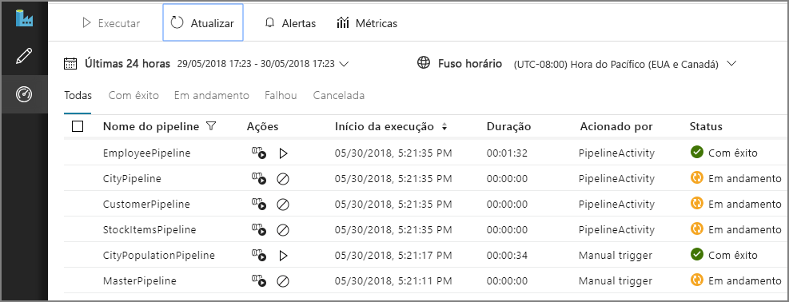


## Build the Analysis Services model

In this step, you will create a tabular model that imports data from the data warehouse. Then you will deploy the model to Azure Analysis Services.

**Create a new tabular project**

1. From your Remote Desktop session, launch SQL Server Data Tools 2015.

2. Select **File** > **New** > **Project**.

3. In the **New Project** dialog, under **Templates**, select  **Business Intelligence** > **Analysis Services** > **Analysis Services Tabular Project**. 

4. Name the project and click **OK**.

5. In the **Tabular model designer** dialog, select **Integrated workspace**  and set **Compatibility level** to `SQL Server 2017 / Azure Analysis Services (1400)`. 

6. Click **OK**.


**Import data**

1. In the **Tabular Model Explorer** window, right-click the project and select **Import from Data Source**.

2. Select **Azure SQL Data Warehouse** and click **Connect**.

3. For **Server**, enter the fully qualified name of your Azure SQL Data Warehouse server. You can get this value from the Azure Portal. For **Database**, enter `wwi`. Click **OK**.

4. In the next dialog, choose **Database** authentication and enter your Azure SQL Data Warehouse user name and password, and click **OK**.

5. In the **Navigator** dialog, select the checkboxes for the **Fact.\*** and **Dimension.\*** tables.

    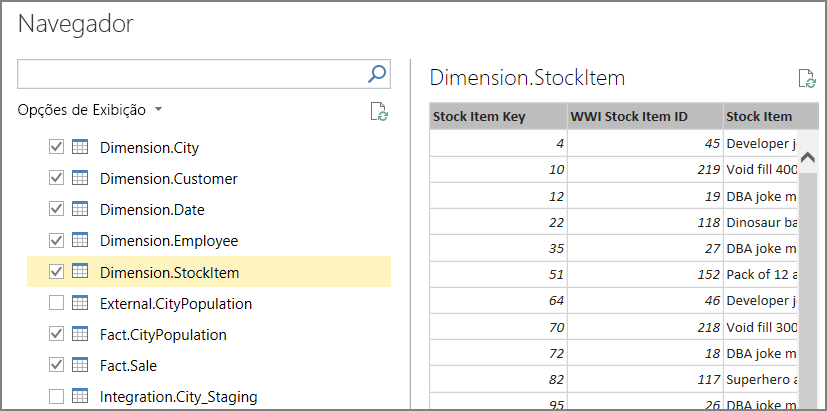

6. Click **Load**. When processing is complete, click **Close**. You should now see a tabular view of the data.

**Create measures**

1. In the model designer, select the **Fact Sale** table.

2. Click a cell in the the measure grid. By default, the measure grid is displayed below the table. 

    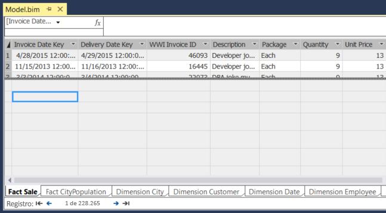

3. In the formula bar, enter the following and press ENTER:

    ```
    <span data-ttu-id="d78f9-340">Total Sales:=SUM('Fact Sale'[Total Including Tax])</span><span class="sxs-lookup"><span data-stu-id="d78f9-340">Total Sales:=SUM('Fact Sale'[Total Including Tax])</span></span>
    ```

4. Repeat these steps to create the following measures:

    ```
    <span data-ttu-id="d78f9-341">Number of Years:=(MAX('Fact CityPopulation'[YearNumber])-MIN('Fact CityPopulation'[YearNumber]))+1</span><span class="sxs-lookup"><span data-stu-id="d78f9-341">Number of Years:=(MAX('Fact CityPopulation'[YearNumber])-MIN('Fact CityPopulation'[YearNumber]))+1</span></span>
    
    <span data-ttu-id="d78f9-342">Beginning Population:=CALCULATE(SUM('Fact CityPopulation'[Population]),FILTER('Fact CityPopulation','Fact CityPopulation'[YearNumber]=MIN('Fact CityPopulation'[YearNumber])))</span><span class="sxs-lookup"><span data-stu-id="d78f9-342">Beginning Population:=CALCULATE(SUM('Fact CityPopulation'[Population]),FILTER('Fact CityPopulation','Fact CityPopulation'[YearNumber]=MIN('Fact CityPopulation'[YearNumber])))</span></span>
    
    <span data-ttu-id="d78f9-343">Ending Population:=CALCULATE(SUM('Fact CityPopulation'[Population]),FILTER('Fact CityPopulation','Fact CityPopulation'[YearNumber]=MAX('Fact CityPopulation'[YearNumber])))</span><span class="sxs-lookup"><span data-stu-id="d78f9-343">Ending Population:=CALCULATE(SUM('Fact CityPopulation'[Population]),FILTER('Fact CityPopulation','Fact CityPopulation'[YearNumber]=MAX('Fact CityPopulation'[YearNumber])))</span></span>
    
    <span data-ttu-id="d78f9-344">CAGR:=IFERROR((([Ending Population]/[Beginning Population])^(1/[Number of Years]))-1,0)</span><span class="sxs-lookup"><span data-stu-id="d78f9-344">CAGR:=IFERROR((([Ending Population]/[Beginning Population])^(1/[Number of Years]))-1,0)</span></span>
    ```

    

For more information about creating measures in SQL Server Data Tools, see [Measures](/sql/analysis-services/tabular-models/measures-ssas-tabular).

**Create relationships**

1. In the **Tabular Model Explorer** window, right-click the project and select **Model View** > **Diagram View**.

2. Drag the **[Fact Sale].[City Key]** field to the **[Dimension City].[City Key]** field to create a relationship.  

3. Drag the **[Face CityPopulation].[City Key]** field to the **[Dimension City].[City Key]** field.  

    

**Deploy the model**

1. From the **File** menu, choose **Save All**.

2. In **Solution Explorer**, right-click the project and select **Properties**. 

3. Under **Server**, enter the URL of your Azure Analysis Services instance. You can get this value from the Azure Portal. In the portal, select the Analysis Services resource, click the Overview pane, and look for the **Server Name** property. It will be similar to `asazure://westus.asazure.windows.net/contoso`. Click **OK**.

    

4. In **Solution Explorer**, right-click the project and select **Deploy**. Sign into Azure if prompted. When processing is complete, click **Close**.

5. In the Azure portal, view the details for your Azure Analysis Services instance. Verify that your model appears in the list of models.

    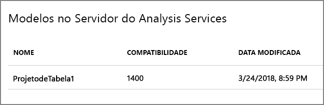

## Analyze the data in Power BI Desktop

In this step, you will use Power BI to create a report from the data in Analysis Services.

1. From your Remote Desktop session, launch Power BI Desktop.

2. In the Welcome Scren, click **Get Data**.

3. Select **Azure** > **Azure Analysis Services database**. Click **Connect**

    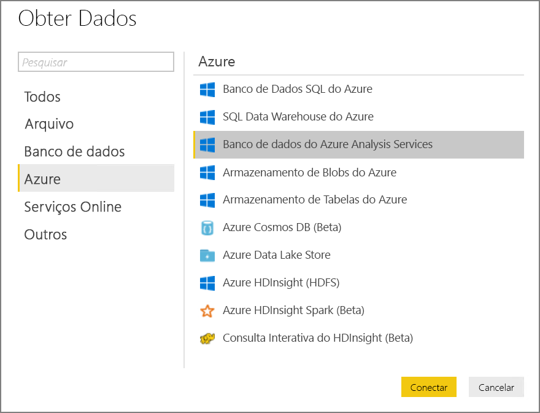

4. Enter the URL of your Analysis Services instance, then click **OK**. Sign into Azure if prompted.

5. In the **Navigator** dialog, expand the tabular project, select the model, and click **OK**.

2. In the **Visualizations** pane, select the **Table** icon. In the Report view, resize the visualization to make it larger.

6. In the **Fields** pane, expand **Dimension City**.

7. From **Dimension City**, drag **City** and **State Province** to the **Values** well.

9. In the **Fields** pane, expand **Fact Sale**.

10. From **Fact Sale**, drag **CAGR**, **Ending Population**,  and **Total Sales** to the **Value** well.

11. Under **Visual Level Filters**, select **Ending Population**. Set the filter to "is greater than 100000" and click **Apply filter**.

12. Under **Visual Level Filters**, select **Total Sales**. Set the filter to "is 0" and click **Apply filter**.

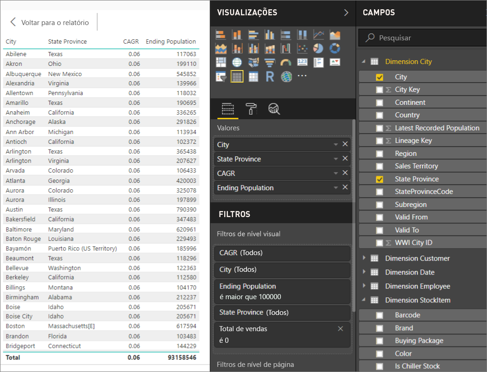

The table now shows cities with population greater than 100,000 and zero sales. CAGR  stands for Compounded Annual Growth Rate and measures the rate of population growth per city. You could use this value to find cities with high growth rates, for example. However, note that the values for CAGR in the model aren't accurate, because they are derived from sample data.

To learn more about Power BI Desktop, see [Getting started with Power BI Desktop](/power-bi/desktop-getting-started).


[adf]: //azure/data-factory
[azure-cli-2]: //azure/install-azure-cli
[azbb-repo]: https://github.com/mspnp/template-building-blocks
[azbb-wiki]: https://github.com/mspnp/template-building-blocks/wiki/Install-Azure-Building-Blocks
[MergeLocation]: https://github.com/mspnp/reference-architectures/blob/master/data/enterprise_bi_sqldw_advanced/azure/sqldw_scripts/city/%5BIntegration%5D.%5BMergeLocation%5D.sql
[ref-arch-repo]: https://github.com/mspnp/reference-architectures
[ref-arch-repo-folder]: https://github.com/mspnp/reference-architectures/tree/master/data/enterprise_bi_sqldw_advanced
[wwi]: //sql/sample/world-wide-importers/wide-world-importers-oltp-database
