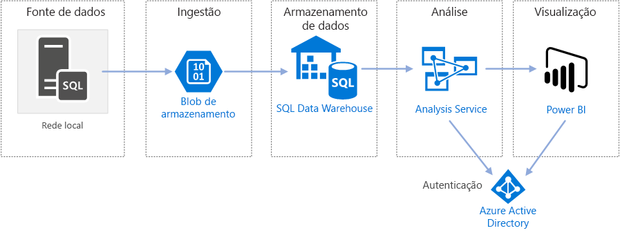
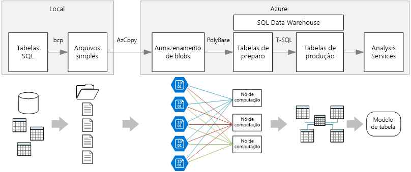

# Enterprise BI no Azure com o SQL Data Warehouse

Essa arquitetura de referência implementa um pipeline [ELT (extrair, carregar e transformar)](../../data-guide/relational-data/etl.md#extract-load-and-transform-elt) que move os dados de um banco de dados SQL Server local para o SQL Data Warehouse e os transforma para análise.

Há uma implantação de referência para essa arquitetura de referência disponível no [GitHub][github-folder].

**Cenário**: Uma organização tem um grande conjunto de dados OLTP armazenado em um banco de dados SQL Server local. A organização deseja usar o SQL Data Warehouse para fazer análise usando o Power BI.

Essa arquitetura de referência serve para trabalhos avulsos ou sob demanda. Se você precisa mover os dados de forma contínua (por hora ou diariamente), recomendamos usar o Azure Data Factory para definir um fluxo de trabalho automatizado. Para uma arquitetura de referência que usa o Data Factory, confira [Enterprise BI automatizada com o SQL Data Warehouse e o Azure Data Factory][adf-ra].

## Arquitetura

A arquitetura consiste nos componentes a seguir.

### Fonte de dados

**SQL Server**. A fonte de dados está localizada em um banco de dados SQL Server local. Para simular o ambiente local, os scripts de implantação dessa arquitetura provisionam uma VM no Azure com o SQL Server instalado. O [banco de dados de exemplo de OLTP de World Wide Importers][wwi] é usado como os dados de origem.

### Ingestão e armazenamento de dados

**Armazenamento de Blobs**. O armazenamento de blobs é usado como uma área de transferência para copiar os dados antes de carregá-los no SQL Data Warehouse.

**SQL Data Warehouse do Azure**. O [SQL Data Warehouse](/azure/sql-data-warehouse/) é um sistema distribuído projetado para executar uma análise em grandes quantidades de dados. Ele dá suporte a MPP (processamento altamente paralelo), que o torna adequado para executar análise de alto desempenho.

### Análise e relatórios

**Azure Analysis Services**. O [Analysis Services](/azure/analysis-services/) é um serviço totalmente gerenciado que fornece recursos de modelagem de dados. Use o Analysis Services para criar um modelo semântico que os usuários podem consultar. O Analysis Services é especialmente útil em um cenário de painel de BI. Nessa arquitetura, o Analysis Services lê dados do data warehouse para processar o modelo semântico e atende a consultas ao painel de maneira eficiente. Ele também dá suporte à simultaneidade elástica, expandindo réplicas para acelerar o processamento das consultas.

Atualmente, o Azure Analysis Services dá suporte a modelos tabulares, mas não a modelos multidimensionais. Os modelos tabulares usam constructos de modelagem relacional (tabelas e colunas), ao passo que os modelos multidimensionais utilizam constructos de modelagem OLAP (cubos, dimensões e medidas). Se você precisar de modelos multidimensionais, use o SSAS (SQL Server Analysis Services). Para saber mais, confira [Comparando soluções tabulares e multidimensionais](/sql/analysis-services/comparing-tabular-and-multidimensional-solutions-ssas).

**Power BI**. O Power BI é um conjunto de ferramentas de análise de negócios para analisar dados a fim de obter informações comerciais. Nessa arquitetura, ele consulta o modelo semântico armazenado no Analysis Services.

### Authentication

O **Azure AD (Azure Active Directory)** autentica os usuários que se conectam ao servidor do Analysis Services por meio do Power BI.

## Pipeline de dados

Essa arquitetura de referência usa o banco de dados [WorldWideImporters](/sql/sample/world-wide-importers/wide-world-importers-oltp-database) de exemplo como fonte de dados. O pipeline de dados tem os seguintes estágios:

1. Exporte os dados do SQL Server para arquivos simples (utilitário bcp).
2. Copie os arquivos simples para o Armazenamento de Blobs do Azure (AzCopy).
3. Carregue os dados no SQL Data Warehouse (PolyBase).
4. Transforme os dados em um esquema em estrela (T-SQL).
5. Carregue um modelo semântico no Analysis Services (SQL Server Data Tools).

> [!NOTE]
> Para obter as etapas 1 &ndash; 3, considere o uso do Data Platform Studio da Redgate. O Data Platform Studio aplica-se as correções de compatibilidade e otimizações mais apropriada, portanto, é a maneira mais rápida de começar a usar o SQL Data Warehouse. Para saber mais, confira [Carregar dados com o Data Platform Studio da Redgate](/azure/sql-data-warehouse/sql-data-warehouse-load-with-redgate).
>

As seções a seguir descrevem esses estágios mais detalhadamente.

### Exportar dados do SQL Server

O utilitário [bcp](/sql/tools/bcp-utility) (programa de cópia em massa) é uma maneira rápida de criar arquivos de texto simples de tabelas SQL. Nesta etapa, você seleciona as colunas que deseja exportar, mas não transforma os dados. As transformações de dados devem ocorrer no SQL Data Warehouse.

**Recomendações:**

Se possível, agende a extração de dados fora do horário de pico para minimizar a contenção de recursos no ambiente de produção.

Evite executar bcp no servidor de banco de dados. Em vez disso, execute-o em outro computador. Grave os arquivos em uma unidade local. Verifique se você tem recursos de E/S suficientes para lidar com as gravações simultâneas. Para um melhor desempenho, exporte os arquivos para unidades de armazenamento rápido dedicadas.

Você pode acelerar a transferência de rede salvando os dados exportados no formato compactado Gzip. No entanto, o carregamento de arquivos compactados no warehouse é mais lento do que o de arquivos descompactados, o que é compensado pela maior rapidez das transferências na rede. Se você decidir usar compactação Gzip, não crie um arquivo Gzip único. Em vez disso, divida os dados em vários arquivos compactados.

### Copiar arquivos simples no armazenamento de blobs

O utilitário [AzCopy](/azure/storage/common/storage-use-azcopy) foi projetado para a cópia de dados de alto desempenho no armazenamento de blobs do Azure.

**Recomendações:**

Crie a conta de armazenamento em uma região perto do local da fonte de dados. Implante a conta de armazenamento e a instância do SQL Data Warehouse na mesma região.

Não execute o AzCopy no mesmo computador que executa suas cargas de trabalho de produção, pois o consumo de CPU e E/S pode interferir na carga de trabalho de produção.

Teste o carregamento primeiro para ver como está a velocidade de upload. Você pode usar a opção /NC no AzCopy para especificar o número de operações de cópia simultâneas. Comece com o valor padrão e faça experiências com essa configuração para ajustar o desempenho. Em um ambiente com pouca largura de banda, o grande número de operações simultâneas pode sobrecarregar a conexão de rede, evitando que as operações sejam concluídas.

O AzCopy move os dados para o armazenamento pela Internet pública. Se isso não for rápido o suficiente, considere configurar um circuito [ExpressRoute](/azure/expressroute/). O ExpressRoute é um serviço que encaminha os dados por uma conexão privada dedicada para o Azure. Outra opção, se sua conexão de rede estiver lenta, é enviar os dados em disco fisicamente para um datacenter do Azure. Para saber mais, confira [Transferindo dados bidirecionalmente no Azure](/azure/architecture/data-guide/scenarios/data-transfer).

Durante uma operação de cópia, o AzCopy cria um arquivo de diário temporário, que permite reiniciar a operação, caso ela seja interrompida (por exemplo, devido a um erro de rede). Verifique se há espaço em disco suficiente para armazenar os arquivos de diário. Você pode usar a opção /Z para especificar onde os arquivos de diário serão gravados.

### Carregar dados no SQL Data Warehouse

Use [PolyBase](/sql/relational-databases/polybase/polybase-guide) para carregar os arquivos do armazenamento de blobs no data warehouse. O PolyBase foi projetado para aproveitar a arquitetura MPP (processamento altamente paralelo) do SQL Data Warehouse, o que o torna a maneira mais rápida de carregar dados no SQL Data Warehouse.

O carregamento de dados é um processo de duas etapas:

1. Crie um conjunto de tabelas externas para os dados. Uma tabela externa é uma definição de tabela que aponta para dados armazenados fora do warehouse &mdash;, neste caso, os arquivos simples no armazenamento de blobs. Essa etapa não move os dados para o warehouse.
2. Crie tabelas de preparo e carregue os dados nas tabelas de preparo. Essa etapa copia os dados para o warehouse.

**Recomendações:**

Quando você tiver grandes quantidades de dados (mais de 1 TB) e estiver executando uma carga de trabalho de análise que será beneficiada pelo paralelismo, considere o SQL Data Warehouse. O SQL Data Warehouse não é uma boa opção para cargas de trabalho OLTP ou conjuntos de dados menores (< 250GB). Para conjuntos de dados menores que 250GB, considere o Banco de Dados SQL ou o SQL Server. Para saber mais, confira [Armazenagem de Dados](../../data-guide/relational-data/data-warehousing.md).

Crie as tabelas de preparo como tabelas de heap, que não são indexadas. As consultas que criam as tabelas de produção resultarão em uma verificação completa e, portanto, não há motivo para indexar as tabelas de preparo.

O PolyBase aproveita automaticamente as vantagens do paralelismo no warehouse.  O desempenho de carga é dimensionado conforme você aumenta as DWUs. Para um melhor desempenho, use uma única operação de carregamento. Não há nenhum benefício de desempenho em dividir os dados de entrada em partes e executar vários carregamentos simultâneos.

O PolyBase pode ler arquivos compactados em Gzip. No entanto, somente um único leitor é usado por arquivo compactado, já que a descompactação do arquivo é uma operação de thread único. Portanto, evite o carregamento de um único arquivo compactado grande. Em vez disso, divida os dados em vários arquivos compactados, para se beneficiar do paralelismo.

Esteja ciente das seguintes limitações:

- O tamanho máximo de colunas com suporte no PolyBase é `varchar(8000)`, `nvarchar(4000)` ou `varbinary(8000)`. Se seus dados excederem esses limites, uma opção é dividir os dados em partes quando exportá-los e remontá-los após a importação.

- O PolyBase usa um terminador de linha fixo de \n ou newline. Isso poderá causar problemas se houver caracteres de newline na fonte de dados.

- O esquema da fonte de dados pode conter tipos de dados que não têm suporte no SQL Data Warehouse.

Para contornar essas limitações, você pode criar um procedimento armazenado que realiza as conversões necessárias. Faça referência a esse procedimento armazenado ao executar o bcp. Como alternativa, o [Data Platform Studio da Redgate](/azure/sql-data-warehouse/sql-data-warehouse-load-with-redgate) converte automaticamente os tipos de dados que não têm suporte no SQL Data Warehouse.

Para obter mais informações, consulte os seguintes artigos:

- [Melhores práticas para carregar dados no SQL Data Warehouse do Azure](/azure/sql-data-warehouse/guidance-for-loading-data).
- [Migrar seus esquemas para o SQL Data Warehouse](/azure/sql-data-warehouse/sql-data-warehouse-migrate-schema)
- [Diretrizes para definir tipos de dados para tabelas no SQL Data Warehouse](/azure/sql-data-warehouse/sql-data-warehouse-tables-data-types)

### Transformar os dados

Transforme os dados e mova-os para tabelas de produção. Nesta etapa, os dados são transformados em um esquema em estrela com tabelas de dimensões e tabelas de fatos, adequadas para modelagem semântica.

Crie as tabelas de produção com índices columnstore clusterizados, que oferecem o melhor desempenho geral de consulta. Os índices ColumnStore são otimizados para consultas que examinam muitos registros. Os índices ColumnStore não tem o mesmo desempenho em pesquisas singleton (isto é, pesquisa de uma única linha). Se você precisar realizar pesquisas singleton frequentes, adicione um índice não clusterizado a uma tabela. As pesquisas singleton podem ficar significativamente mais rápidas usando um índice não clusterizado. No entanto, as pesquisas singleton são geralmente menos comuns em cenários de data warehouse do que as cargas de trabalho OLTP. Para saber mais, confira [Indexando tabelas no SQL Data Warehouse](/azure/sql-data-warehouse/sql-data-warehouse-tables-index).

> [!NOTE]
> As tabelas columnstore clusterizadas não dão suporte aos tipos de dados `varchar(max)`, `nvarchar(max)` ou `varbinary(max)`. Nesse caso, considere a possibilidade de usar um heap ou índice clusterizado. Você pode colocar essas colunas em uma tabela separada.

Como o banco de dados de exemplo não é muito grande, criamos tabelas replicadas sem partições. Para cargas de trabalho de produção, o uso de tabelas distribuídas provavelmente melhorará o desempenho da consulta. Confira [Diretrizes para criar tabelas distribuídas no SQL Data Warehouse do Azure](/azure/sql-data-warehouse/sql-data-warehouse-tables-distribute). Os scripts de exemplo executam as consultas usando uma [classe de recurso](/azure/sql-data-warehouse/resource-classes-for-workload-management) estática.

### Carregar o modelo semântico

Carregue os dados em um modelo tabular no Azure Analysis Services. Nesta etapa, você pode criar um modelo de dados semântico usando o SSDT (SQL Server Data Tools). Você também pode criar um modelo importando-o de um arquivo do Power BI Desktop. Como o SQL Data Warehouse não dá suporte a chaves estrangeiras, você deve adicionar as relações ao modelo semântico para poder unir entre tabelas.

### Usar o Power BI para visualizar os dados

O Power BI dá suporte a duas opções de conexão com o Azure Analysis Services:

- Importação. Os dados são importados para o modelo do Power BI.
- Conexão dinâmica. Os dados são recuperados diretamente do Analysis Services.

Recomendamos a Conexão dinâmica porque ela não requer a cópia de dados no modelo do Power BI. Além disso, o uso do DirectQuery garante que os resultados sejam sempre consistentes com os dados de origem mais recentes. Para saber mais, confira [Conectar com o Power BI](/azure/analysis-services/analysis-services-connect-pbi).

**Recomendações:**

Evite executar consultas ao painel de BI diretamente no data warehouse. Os painéis de BI exigem tempos de resposta muito baixos, que as consultas diretas ao warehouse poderão não conseguir atender. Além disso, a atualização do painel afetará o número de consultas simultâneas, o que pode afetar o desempenho.

O Azure Analysis Services foi projetado para lidar com os requisitos de consulta de um painel de BI e, portanto, a prática recomendada é consultar o Analysis Services do Power BI.

## Considerações sobre escalabilidade

### SQL Data Warehouse

Com o SQL Data warehouse, você pode expandir seus recursos de computação sob demanda. O mecanismo de consulta otimiza as consultas para processamento paralelo com base no número de nós de computação e move dados entre os nós conforme a necessidade. Para saber mais, confira [Gerenciar computação no SQL Data Warehouse do Azure](/azure/sql-data-warehouse/sql-data-warehouse-manage-compute-overview).

### Serviços de análise

Para cargas de trabalho de produção, recomendamos a camada Standard do Azure Analysis Services, pois ele dá suporte a particionamento e DirectQuery. Dentro de uma camada, o tamanho da instância determina a memória e a potência de processamento. A capacidade de processamento é medida em QPUs (unidades de processamento de consulta). Monitore o uso de QPUs para selecionar o tamanho apropriado. Para saber mais, confira [Monitorar métricas do servidor](/azure/analysis-services/analysis-services-monitor).

Com uma alta carga, o desempenho de consulta pode se degradar devido à simultaneidade de consultas. Você pode expandir o Analysis Services criando um conjunto de réplicas para processar consultas, para que mais consultas possam ser executadas simultaneamente. O trabalho de processamento do modelo de dados sempre ocorre no servidor primário. Por padrão, o servidor primário também lida com consultas. Opcionalmente, você pode designar o servidor primário para executar o processamento de modo exclusivo, para que o pool de consultas lide com todas as consultas. Se você tiver altos requisitos de processamento, separe o processamento do pool de consultas. Se você tiver cargas de consulta pesadas e processamento relativamente leve, poderá incluir o servidor primário no pool de consultas. Para saber mais, confira [Expansão do Azure Analysis Services](/azure/analysis-services/analysis-services-scale-out).

Para reduzir a quantidade de processamento desnecessária, considere usar partições para dividir o modelo tabular em partes lógicas. Cada partição pode ser processada separadamente. Para saber mais, confira [Partições](/sql/analysis-services/tabular-models/partitions-ssas-tabular).

## Considerações de segurança

### Lista de permissões de IPs de clientes do Analysis Services

Considere usar o recurso de firewall do Analysis Services para colocar endereços IP do cliente na lista de permissões. Se habilitado, o firewall bloqueará todas as conexões de cliente que não sejam as especificadas nas regras de firewall. As regras padrão colocam o serviço Power BI na lista de permissões, mas você poderá desabilitar essa regra se desejar. Para saber mais, confira [Aumentar a proteção do Azure Analysis Services com o novo recurso de firewall](https://azure.microsoft.com/blog/hardening-azure-analysis-services-with-the-new-firewall-capability/).

### Autorização

O Azure Analysis Services usa o Azure AD (Azure Active Directory) para autenticar usuários que se conectam a um servidor do Analysis Services. Você pode restringir quais dados um usuário específico é capaz de exibir criando funções e atribuindo os usuários ou grupos do Azure AD a essas funções. Para cada função, você pode:

- Proteger tabelas ou colunas individualmente.
- Proteger linhas individualmente com base em expressões de filtro.

Para saber mais, confira [Gerenciar usuários e funções de banco de dados](/azure/analysis-services/analysis-services-database-users).

## Implantar a solução

Para a implantação e execução da implementação de referência, siga as etapas em [Leia-me do GitHub][github-folder]. Ela implanta o seguinte:

- Uma VM Windows para simular um servidor de banco de dados local. Ela inclui o SQL Server 2017 e ferramentas relacionadas, juntamente com o Power BI Desktop.
- Uma conta de armazenamento do Azure que fornece armazenamento de blobs para armazenar os dados exportados do banco de dados SQL Server.
- Uma instância do SQL Data Warehouse do Azure.
- Uma instância do Azure Analysis Services.

## Próximas etapas

- Use o Azure Data Factory para automatizar o pipeline ELT. Confira [Enterprise BI automatizada com o SQL Data Warehouse e Azure Data Factory][adf-ra].

## Recursos relacionados

O ideal é examinar os seguintes [cenários de exemplo do Azure](/azure/architecture/example-scenario), que demonstram soluções específicas usando algumas das mesmas tecnologias:

- [Data warehouse e análise para vendas e marketing](/azure/architecture/example-scenario/data/data-warehouse)
- [ETL Híbrido com Azure Data Factory e SSIS local existentes](/azure/architecture/example-scenario/data/hybrid-etl-with-adf)

<!-- links -->

[adf-ra]: ./enterprise-bi-adf.md
[github-folder]: https://github.com/mspnp/reference-architectures/tree/master/data/enterprise_bi_sqldw
[wwi]: /sql/sample/world-wide-importers/wide-world-importers-oltp-database
