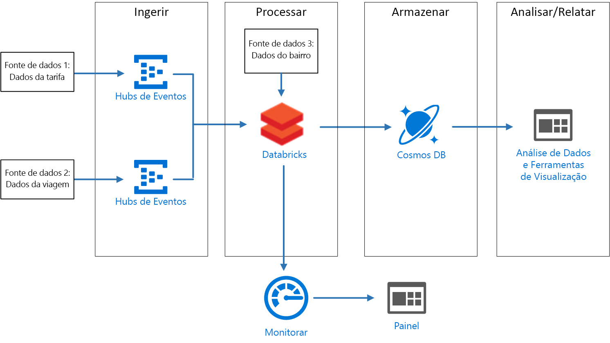
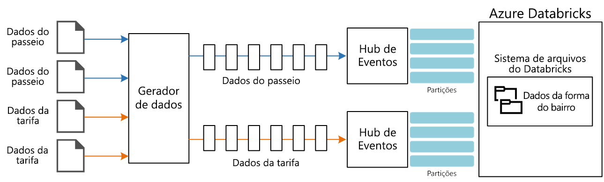

# <a name="stream-processing-with-azure-databricks"></a><span data-ttu-id="a5573-103">Processamento de fluxo com o Azure Databricks</span><span class="sxs-lookup"><span data-stu-id="a5573-103">Stream processing with Azure Databricks</span></span>

<span data-ttu-id="a5573-104">Essa arquitetura de referência mostra um pipeline de [processamento de fluxo](/azure/architecture/data-guide/big-data/real-time-processing) de ponta a ponta.</span><span class="sxs-lookup"><span data-stu-id="a5573-104">This reference architecture shows an end-to-end [stream processing](/azure/architecture/data-guide/big-data/real-time-processing) pipeline.</span></span> <span data-ttu-id="a5573-105">Esse tipo de pipeline tem quatro estágios: ingerir, processar, armazenar e analisar e gerar relatórios.</span><span class="sxs-lookup"><span data-stu-id="a5573-105">This type of pipeline has four stages: ingest, process, store, and analysis and reporting.</span></span> <span data-ttu-id="a5573-106">Para essa arquitetura de referência, o pipeline ingere dados de duas origens, realiza uma junção em registros relacionados de cada fluxo, enriquece o resultado e calcula uma média em tempo real.</span><span class="sxs-lookup"><span data-stu-id="a5573-106">For this reference architecture, the pipeline ingests data from two sources, performs a join on related records from each stream, enriches the result, and calculates an average in real time.</span></span> <span data-ttu-id="a5573-107">Os resultados são armazenados para análise posterior.</span><span class="sxs-lookup"><span data-stu-id="a5573-107">The results are stored for further analysis.</span></span> [<span data-ttu-id="a5573-108">**Implante essa solução**.</span><span class="sxs-lookup"><span data-stu-id="a5573-108">**Deploy this solution**.</span></span>](#deploy-the-solution)



<span data-ttu-id="a5573-109">**Cenário**: uma empresa de táxi coleta dados sobre cada viagem.</span><span class="sxs-lookup"><span data-stu-id="a5573-109">**Scenario**: A taxi company collects data about each taxi trip.</span></span> <span data-ttu-id="a5573-110">Para esse cenário, assumimos que há dois dispositivos separados enviando dados.</span><span class="sxs-lookup"><span data-stu-id="a5573-110">For this scenario, we assume there are two separate devices sending data.</span></span> <span data-ttu-id="a5573-111">O táxi tem um medidor que envia informações sobre cada corrida &mdash; duração, distância e locais de embarque e desembarque de passageiros.</span><span class="sxs-lookup"><span data-stu-id="a5573-111">The taxi has a meter that sends information about each ride &mdash; the duration, distance, and pickup and dropoff locations.</span></span> <span data-ttu-id="a5573-112">Um dispositivo separado aceita pagamentos de clientes e envia dados sobre tarifas.</span><span class="sxs-lookup"><span data-stu-id="a5573-112">A separate device accepts payments from customers and sends data about fares.</span></span> <span data-ttu-id="a5573-113">Para identificar as tendências dos passageiros, a empresa de táxi deseja calcular a média de gorjeta por quilômetro percorrido em tempo real, para cada área.</span><span class="sxs-lookup"><span data-stu-id="a5573-113">To spot ridership trends, the taxi company wants to calculate the average tip per mile driven, in real time, for each neighborhood.</span></span>

## <a name="architecture"></a><span data-ttu-id="a5573-114">Arquitetura</span><span class="sxs-lookup"><span data-stu-id="a5573-114">Architecture</span></span>

<span data-ttu-id="a5573-115">A arquitetura consiste nos componentes a seguir.</span><span class="sxs-lookup"><span data-stu-id="a5573-115">The architecture consists of the following components.</span></span>

<span data-ttu-id="a5573-116">**Fontes de dados**.</span><span class="sxs-lookup"><span data-stu-id="a5573-116">**Data sources**.</span></span> <span data-ttu-id="a5573-117">Nessa arquitetura há duas fontes de dados que geram fluxos de dados em tempo real.</span><span class="sxs-lookup"><span data-stu-id="a5573-117">In this architecture, there are two data sources that generate data streams in real time.</span></span> <span data-ttu-id="a5573-118">O primeiro fluxo contém informações da corrida, e o segundo contém informações da tarifa.</span><span class="sxs-lookup"><span data-stu-id="a5573-118">The first stream contains ride information, and the second contains fare information.</span></span> <span data-ttu-id="a5573-119">A arquitetura de referência inclui um gerador de dados simulados que faz a leitura de um conjunto de arquivos estáticos e envia os dados para os Hubs de Eventos.</span><span class="sxs-lookup"><span data-stu-id="a5573-119">The reference architecture includes a simulated data generator that reads from a set of static files and pushes the data to Event Hubs.</span></span> <span data-ttu-id="a5573-120">Em um aplicativo real, as fontes de dados seriam dispositivos instalados nos táxis.</span><span class="sxs-lookup"><span data-stu-id="a5573-120">The data sources in a real application would be devices installed in the taxi cabs.</span></span>

<span data-ttu-id="a5573-121">**Hubs de Eventos do Azure**.</span><span class="sxs-lookup"><span data-stu-id="a5573-121">**Azure Event Hubs**.</span></span> <span data-ttu-id="a5573-122">[Hubs de Eventos](/azure/event-hubs/) são um serviço de ingestão de eventos.</span><span class="sxs-lookup"><span data-stu-id="a5573-122">[Event Hubs](/azure/event-hubs/) is an event ingestion service.</span></span> <span data-ttu-id="a5573-123">Essa arquitetura usa duas instâncias de hub de eventos, uma para cada fonte de dados.</span><span class="sxs-lookup"><span data-stu-id="a5573-123">This architecture uses two event hub instances, one for each data source.</span></span> <span data-ttu-id="a5573-124">Cada fonte de dados envia um fluxo de dados para o hub de eventos associado.</span><span class="sxs-lookup"><span data-stu-id="a5573-124">Each data source sends a stream of data to the associated event hub.</span></span>

<span data-ttu-id="a5573-125">**Azure Databricks**.</span><span class="sxs-lookup"><span data-stu-id="a5573-125">**Azure Databricks**.</span></span> <span data-ttu-id="a5573-126">O [Databricks](/azure/azure-databricks/) é uma plataforma de análise baseada no Apache Spark otimizada para a plataforma de Serviços de Nuvem do Microsoft Azure.</span><span class="sxs-lookup"><span data-stu-id="a5573-126">[Databricks](/azure/azure-databricks/) is an Apache Spark-based analytics platform optimized for the Microsoft Azure cloud services platform.</span></span> <span data-ttu-id="a5573-127">O Databricks é usado para correlacionar os dados de corrida e de tarifa do táxi e também para enriquecer os dados correlacionados com dados armazenados sobre áreas no sistema de arquivos do Databricks.</span><span class="sxs-lookup"><span data-stu-id="a5573-127">Databricks is used to correlate of the taxi ride and fare data, and also to enrich the correlated data with neighborhood data stored in the Databricks file system.</span></span>

<span data-ttu-id="a5573-128">**Cosmos DB**.</span><span class="sxs-lookup"><span data-stu-id="a5573-128">**Cosmos DB**.</span></span> <span data-ttu-id="a5573-129">A saída do trabalho do Azure Databricks é uma série de registros que são gravados no [Cosmos DB](/azure/cosmos-db/) usando a API do Cassandra.</span><span class="sxs-lookup"><span data-stu-id="a5573-129">The output from Azure Databricks job is a series of records, which are written to [Cosmos DB](/azure/cosmos-db/) using the Cassandra API.</span></span> <span data-ttu-id="a5573-130">A API do Cassandra é usada porque oferece suporte à modelagem de dados de série temporal.</span><span class="sxs-lookup"><span data-stu-id="a5573-130">The Cassandra API is used because it supports time series data modeling.</span></span>

<span data-ttu-id="a5573-131">**Azure Log Analytics**.</span><span class="sxs-lookup"><span data-stu-id="a5573-131">**Azure Log Analytics**.</span></span> <span data-ttu-id="a5573-132">Os dados de log do aplicativo coletados pelo [Monitor do Azure](/azure/monitoring-and-diagnostics/) são armazenados em um [espaço de trabalho do Log Analytics](/azure/log-analytics).</span><span class="sxs-lookup"><span data-stu-id="a5573-132">Application log data collected by [Azure Monitor](/azure/monitoring-and-diagnostics/) is stored in a [Log Analytics workspace](/azure/log-analytics).</span></span> <span data-ttu-id="a5573-133">As consultas do Log Analytics podem ser usadas para analisar e visualizar métricas e inspecionar mensagens de log para identificar problemas no aplicativo.</span><span class="sxs-lookup"><span data-stu-id="a5573-133">Log Analytics queries can be used to analyze and visualize metrics and inspect log messages to identify issues within the application.</span></span>

## <a name="data-ingestion"></a><span data-ttu-id="a5573-134">Ingestão de dados</span><span class="sxs-lookup"><span data-stu-id="a5573-134">Data ingestion</span></span>

<span data-ttu-id="a5573-135">Para simular uma fonte de dados, essa arquitetura de referência usa o conjunto de dados dos [Dados de táxi de Nova York](https://uofi.app.box.com/v/NYCtaxidata/folder/2332218797)<sup>[[1]](#note1)</sup>.</span><span class="sxs-lookup"><span data-stu-id="a5573-135">To simulate a data source, this reference architecture uses the [New York City Taxi Data](https://uofi.app.box.com/v/NYCtaxidata/folder/2332218797) dataset<sup>[[1]](#note1)</sup>.</span></span> <span data-ttu-id="a5573-136">Esse conjunto de dados contém dados sobre viagens de táxi em Nova York durante um período de 4 anos (2010 &ndash; 2013).</span><span class="sxs-lookup"><span data-stu-id="a5573-136">This dataset contains data about taxi trips in New York City over a four-year period (2010 &ndash; 2013).</span></span> <span data-ttu-id="a5573-137">Ele contém dois tipos de registro: dados de corrida e dados de tarifa.</span><span class="sxs-lookup"><span data-stu-id="a5573-137">It contains two types of record: Ride data and fare data.</span></span> <span data-ttu-id="a5573-138">Os dados de corrida incluem a duração da viagem, a distância da viagem e os locais de embarque e desembarque de passageiros.</span><span class="sxs-lookup"><span data-stu-id="a5573-138">Ride data includes trip duration, trip distance, and pickup and dropoff location.</span></span> <span data-ttu-id="a5573-139">Os dados de tarifa incluem a tarifa, impostos e quantias das gorjetas.</span><span class="sxs-lookup"><span data-stu-id="a5573-139">Fare data includes fare, tax, and tip amounts.</span></span> <span data-ttu-id="a5573-140">Campos comuns em ambos os tipos de registro incluem o número da licença, carteira de habilitação e ID do fornecedor.</span><span class="sxs-lookup"><span data-stu-id="a5573-140">Common fields in both record types include medallion number, hack license, and vendor ID.</span></span> <span data-ttu-id="a5573-141">Juntos, esses três campos fazem a identificação exclusiva de um táxi e um motorista.</span><span class="sxs-lookup"><span data-stu-id="a5573-141">Together these three fields uniquely identify a taxi plus a driver.</span></span> <span data-ttu-id="a5573-142">Os dados são armazenados no formato CSV.</span><span class="sxs-lookup"><span data-stu-id="a5573-142">The data is stored in CSV format.</span></span> 

<span data-ttu-id="a5573-143">O gerador de dados é um aplicativo .NET Core que lê os registros e os envia para os Hubs de Eventos do Azure.</span><span class="sxs-lookup"><span data-stu-id="a5573-143">The data generator is a .NET Core application that reads the records and sends them to Azure Event Hubs.</span></span> <span data-ttu-id="a5573-144">O gerador envia os dados de corrida em formato JSON e os dados de tarifa em formato CSV.</span><span class="sxs-lookup"><span data-stu-id="a5573-144">The generator sends ride data in JSON format and fare data in CSV format.</span></span> 

<span data-ttu-id="a5573-145">Os Hubs de Eventos usam [partições](/azure/event-hubs/event-hubs-features#partitions) para segmentar os dados.</span><span class="sxs-lookup"><span data-stu-id="a5573-145">Event Hubs uses [partitions](/azure/event-hubs/event-hubs-features#partitions) to segment the data.</span></span> <span data-ttu-id="a5573-146">As partições permitem que um consumidor leia cada partição em paralelo.</span><span class="sxs-lookup"><span data-stu-id="a5573-146">Partitions allow a consumer to read each partition in parallel.</span></span> <span data-ttu-id="a5573-147">Ao enviar dados para os Hubs de Eventos, é possível especificar a chave de partição explicitamente.</span><span class="sxs-lookup"><span data-stu-id="a5573-147">When you send data to Event Hubs, you can specify the partition key explicitly.</span></span> <span data-ttu-id="a5573-148">Caso contrário, os registros são atribuídos a partições no estilo round robin.</span><span class="sxs-lookup"><span data-stu-id="a5573-148">Otherwise, records are assigned to partitions in round-robin fashion.</span></span> 

<span data-ttu-id="a5573-149">Nesse cenário, os dados de corrida e de tarifa devem ter a mesma ID de partição para um determinado táxi.</span><span class="sxs-lookup"><span data-stu-id="a5573-149">In this scenario, ride data and fare data should end up with the same partition ID for a given taxi cab.</span></span> <span data-ttu-id="a5573-150">Isso permite que o Databricks aplique um grau de paralelismo ao correlacionar os dois fluxos.</span><span class="sxs-lookup"><span data-stu-id="a5573-150">This enables Databricks to apply a degree of parallelism when it correlates the two streams.</span></span> <span data-ttu-id="a5573-151">Um registro na partição *n* dos dados de corrida corresponderá a um registro na partição *n* dos dados de tarifa.</span><span class="sxs-lookup"><span data-stu-id="a5573-151">A record in partition *n* of the ride data will match a record in partition *n* of the fare data.</span></span>



<span data-ttu-id="a5573-152">No gerador de dados, o modelo de dados comum para ambos os tipos de registro têm uma propriedade `PartitionKey` que é a concatenação de `Medallion`, `HackLicense` e `VendorId`.</span><span class="sxs-lookup"><span data-stu-id="a5573-152">In the data generator, the common data model for both record types has a `PartitionKey` property that is the concatenation of `Medallion`, `HackLicense`, and `VendorId`.</span></span>

```csharp
public abstract class TaxiData
{
    public TaxiData()
    {
    }

    [JsonProperty]
    public long Medallion { get; set; }

    [JsonProperty]
    public long HackLicense { get; set; }

    [JsonProperty]
    public string VendorId { get; set; }

    [JsonProperty]
    public DateTimeOffset PickupTime { get; set; }

    [JsonIgnore]
    public string PartitionKey
    {
        get => $"{Medallion}_{HackLicense}_{VendorId}";
    }
```

<span data-ttu-id="a5573-153">Essa propriedade é usada para fornecer uma chave de partição explícita ao enviar para Hubs de Eventos:</span><span class="sxs-lookup"><span data-stu-id="a5573-153">This property is used to provide an explicit partition key when sending to Event Hubs:</span></span>

```csharp
using (var client = pool.GetObject())
{
    return client.Value.SendAsync(new EventData(Encoding.UTF8.GetBytes(
        t.GetData(dataFormat))), t.PartitionKey);
}
```

### <a name="event-hubs"></a><span data-ttu-id="a5573-154">Hubs de Eventos</span><span class="sxs-lookup"><span data-stu-id="a5573-154">Event Hubs</span></span>

<span data-ttu-id="a5573-155">A capacidade da taxa de transferência dos Hubs de Eventos é medida em [unidades de produtividade](/azure/event-hubs/event-hubs-features#throughput-units).</span><span class="sxs-lookup"><span data-stu-id="a5573-155">The throughput capacity of Event Hubs is measured in [throughput units](/azure/event-hubs/event-hubs-features#throughput-units).</span></span> <span data-ttu-id="a5573-156">É possível fazer o dimensionamento automático de um hub de eventos ao permitir a [inflação automática](/azure/event-hubs/event-hubs-auto-inflate), o que dimensiona automaticamente as unidades de produtividade com base no tráfego até um número máximo configurado.</span><span class="sxs-lookup"><span data-stu-id="a5573-156">You can autoscale an event hub by enabling [auto-inflate](/azure/event-hubs/event-hubs-auto-inflate), which automatically scales the throughput units based on traffic, up to a configured maximum.</span></span> 

## <a name="stream-processing"></a><span data-ttu-id="a5573-157">Processamento de fluxo</span><span class="sxs-lookup"><span data-stu-id="a5573-157">Stream processing</span></span>

<span data-ttu-id="a5573-158">No Azure Databricks, o processamento de dados é executado por um trabalho.</span><span class="sxs-lookup"><span data-stu-id="a5573-158">In Azure Databricks, data processing is performed by a job.</span></span> <span data-ttu-id="a5573-159">O trabalho é atribuído a um cluster e é executado nele.</span><span class="sxs-lookup"><span data-stu-id="a5573-159">The job is assigned to and runs on a cluster.</span></span> <span data-ttu-id="a5573-160">O trabalho pode ser o código personalizado escrito em Java ou um [bloco de notas](https://docs.databricks.com/user-guide/notebooks/index.html) do Spark.</span><span class="sxs-lookup"><span data-stu-id="a5573-160">The job can either be custom code written in Java, or a Spark [notebook](https://docs.databricks.com/user-guide/notebooks/index.html).</span></span>

<span data-ttu-id="a5573-161">Nessa arquitetura de referência, o trabalho é um arquivo morto de Java com classes escritas em Java e Scala.</span><span class="sxs-lookup"><span data-stu-id="a5573-161">In this reference architecture, the job is a Java archive with classes written in both Java and Scala.</span></span> <span data-ttu-id="a5573-162">Ao especificar o arquivo morto de Java para um trabalho do Databricks, a classe será especificada para ser executada pelo cluster do Databricks.</span><span class="sxs-lookup"><span data-stu-id="a5573-162">When specifying the Java archive for a Databricks job, the class is specified for execution by the Databricks cluster.</span></span> <span data-ttu-id="a5573-163">Aqui, o método **main** da classe **com.microsoft.pnp.TaxiCabReader** contém a lógica de processamento de dados.</span><span class="sxs-lookup"><span data-stu-id="a5573-163">Here, the **main** method of the **com.microsoft.pnp.TaxiCabReader** class contains the data processing logic.</span></span> 

### <a name="reading-the-stream-from-the-two-event-hub-instances"></a><span data-ttu-id="a5573-164">Ler o fluxo das duas instâncias do hub de eventos</span><span class="sxs-lookup"><span data-stu-id="a5573-164">Reading the stream from the two event hub instances</span></span>

<span data-ttu-id="a5573-165">A lógica de processamento de dados usa [o fluxo estruturado do Spark](https://spark.apache.org/docs/2.1.2/structured-streaming-programming-guide.html) para ler as duas instâncias do hub de eventos do Azure:</span><span class="sxs-lookup"><span data-stu-id="a5573-165">The data processing logic uses [Spark structured streaming](https://spark.apache.org/docs/2.1.2/structured-streaming-programming-guide.html) to read from the two Azure event hub instances:</span></span>

```scala
val rideEventHubOptions = EventHubsConf(rideEventHubConnectionString)
      .setConsumerGroup(conf.taxiRideConsumerGroup())
      .setStartingPosition(EventPosition.fromStartOfStream)
    val rideEvents = spark.readStream
      .format("eventhubs")
      .options(rideEventHubOptions.toMap)
      .load

    val fareEventHubOptions = EventHubsConf(fareEventHubConnectionString)
      .setConsumerGroup(conf.taxiFareConsumerGroup())
      .setStartingPosition(EventPosition.fromStartOfStream)
    val fareEvents = spark.readStream
      .format("eventhubs")
      .options(fareEventHubOptions.toMap)
      .load
```

### <a name="enriching-the-data-with-the-neighborhood-information"></a><span data-ttu-id="a5573-166">Como enriquecer os dados com informações sobre a área</span><span class="sxs-lookup"><span data-stu-id="a5573-166">Enriching the data with the neighborhood information</span></span>

<span data-ttu-id="a5573-167">Os dados da corrida incluem as coordenadas de latitude e longitude dos locais de coleta e entrega.</span><span class="sxs-lookup"><span data-stu-id="a5573-167">The ride data includes the latitude and longitude coordinates of the pick up and drop off locations.</span></span> <span data-ttu-id="a5573-168">Embora essas coordenadas sejam úteis, elas não são facilmente consumidas na análise.</span><span class="sxs-lookup"><span data-stu-id="a5573-168">While these coordinates are useful, they are not easily consumed for analysis.</span></span> <span data-ttu-id="a5573-169">Portanto, esses dados são enriquecidos com dados de área que são lidos de um [shapefile](https://en.wikipedia.org/wiki/Shapefile).</span><span class="sxs-lookup"><span data-stu-id="a5573-169">Therefore, this data is enriched with neighborhood data that is read from a [shapefile](https://en.wikipedia.org/wiki/Shapefile).</span></span> 

<span data-ttu-id="a5573-170">O formato shapefile é binário e não é fácil analisá-lo, mas a biblioteca [GeoTools](http://geotools.org/) fornece ferramentas para dados geoespaciais que usam o formato shapefile.</span><span class="sxs-lookup"><span data-stu-id="a5573-170">The shapefile format is binary and not easily parsed, but the [GeoTools](http://geotools.org/) library provides tools for geospatial data that use the shapefile format.</span></span> <span data-ttu-id="a5573-171">Essa biblioteca é usada na classe **com.microsoft.pnp.GeoFinder** para determinar o nome da área com base nas coordenadas de coleta e entrega.</span><span class="sxs-lookup"><span data-stu-id="a5573-171">This library is used in the **com.microsoft.pnp.GeoFinder** class to determine the neighborhood name based on the pick up and drop off coordinates.</span></span> 

```scala
val neighborhoodFinder = (lon: Double, lat: Double) => {
      NeighborhoodFinder.getNeighborhood(lon, lat).get()
    }
```

### <a name="joining-the-ride-and-fare-data"></a><span data-ttu-id="a5573-172">Adicionar os dados de corrida e de tarifa</span><span class="sxs-lookup"><span data-stu-id="a5573-172">Joining the ride and fare data</span></span>

<span data-ttu-id="a5573-173">Primeiro, os dados da corrida e da tarifa são transformados:</span><span class="sxs-lookup"><span data-stu-id="a5573-173">First the ride and fare data is transformed:</span></span>

```scala
    val rides = transformedRides
      .filter(r => {
        if (r.isNullAt(r.fieldIndex("errorMessage"))) {
          true
        }
        else {
          malformedRides.add(1)
          false
        }
      })
      .select(
        $"ride.*",
        to_neighborhood($"ride.pickupLon", $"ride.pickupLat")
          .as("pickupNeighborhood"),
        to_neighborhood($"ride.dropoffLon", $"ride.dropoffLat")
          .as("dropoffNeighborhood")
      )
      .withWatermark("pickupTime", conf.taxiRideWatermarkInterval())

    val fares = transformedFares
      .filter(r => {
        if (r.isNullAt(r.fieldIndex("errorMessage"))) {
          true
        }
        else {
          malformedFares.add(1)
          false
        }
      })
      .select(
        $"fare.*",
        $"pickupTime"
      )
      .withWatermark("pickupTime", conf.taxiFareWatermarkInterval())
```

<span data-ttu-id="a5573-174">E, em seguida, os dados da corrida são associados aos dados da tarifa:</span><span class="sxs-lookup"><span data-stu-id="a5573-174">And then the ride data is joined with the fare data:</span></span>

```scala
val mergedTaxiTrip = rides.join(fares, Seq("medallion", "hackLicense", "vendorId", "pickupTime"))
```

### <a name="processing-the-data-and-inserting-into-cosmos-db"></a><span data-ttu-id="a5573-175">Como processar dados e inseri-los no Cosmos DB</span><span class="sxs-lookup"><span data-stu-id="a5573-175">Processing the data and inserting into Cosmos DB</span></span>

<span data-ttu-id="a5573-176">O valor da tarifa média para cada ambiente é calculado para um determinado intervalo de tempo:</span><span class="sxs-lookup"><span data-stu-id="a5573-176">The average fare amount for each neighborhood is calculated for a given time interval:</span></span>

```scala
val maxAvgFarePerNeighborhood = mergedTaxiTrip.selectExpr("medallion", "hackLicense", "vendorId", "pickupTime", "rateCode", "storeAndForwardFlag", "dropoffTime", "passengerCount", "tripTimeInSeconds", "tripDistanceInMiles", "pickupLon", "pickupLat", "dropoffLon", "dropoffLat", "paymentType", "fareAmount", "surcharge", "mtaTax", "tipAmount", "tollsAmount", "totalAmount", "pickupNeighborhood", "dropoffNeighborhood")
      .groupBy(window($"pickupTime", conf.windowInterval()), $"pickupNeighborhood")
      .agg(
        count("*").as("rideCount"),
        sum($"fareAmount").as("totalFareAmount"),
        sum($"tipAmount").as("totalTipAmount")
      )
      .select($"window.start", $"window.end", $"pickupNeighborhood", $"rideCount", $"totalFareAmount", $"totalTipAmount")
```

<span data-ttu-id="a5573-177">Portanto, qual é inserido no Cosmos DB:</span><span class="sxs-lookup"><span data-stu-id="a5573-177">Which is then inserted into Cosmos DB:</span></span>

```scala
maxAvgFarePerNeighborhood
      .writeStream
      .queryName("maxAvgFarePerNeighborhood_cassandra_insert")
      .outputMode(OutputMode.Append())
      .foreach(new CassandraSinkForeach(connector))
      .start()
      .awaitTermination()
```

## <a name="security-considerations"></a><span data-ttu-id="a5573-178">Considerações de segurança</span><span class="sxs-lookup"><span data-stu-id="a5573-178">Security considerations</span></span>

<span data-ttu-id="a5573-179">O acesso ao espaço de trabalho do Azure Database é controlado com o [console do administrador](https://docs.databricks.com/administration-guide/admin-settings/index.html).</span><span class="sxs-lookup"><span data-stu-id="a5573-179">Access to the Azure Database workspace is controlled using the [administrator console](https://docs.databricks.com/administration-guide/admin-settings/index.html).</span></span> <span data-ttu-id="a5573-180">O console do administrador inclui recursos para adicionar usuários, gerenciar permissões de usuários e configurar o logon único.</span><span class="sxs-lookup"><span data-stu-id="a5573-180">The administrator console includes functionality to add users, manage user permissions, and set up single sign-on.</span></span> <span data-ttu-id="a5573-181">O controle de acesso para espaços de trabalho, clusters, trabalhos e tabelas também pode ser definido pelo console do administrador.</span><span class="sxs-lookup"><span data-stu-id="a5573-181">Access control for workspaces, clusters, jobs, and tables can also be set through the administrator console.</span></span>

### <a name="managing-secrets"></a><span data-ttu-id="a5573-182">Gerenciamento de segredos</span><span class="sxs-lookup"><span data-stu-id="a5573-182">Managing secrets</span></span>

<span data-ttu-id="a5573-183">As Azure Databricks inclui um [armazenamento secreto](https://docs.azuredatabricks.net/user-guide/secrets/index.html) que é usado para armazenar segredos, incluindo cadeias de conexão, chaves de acesso, nomes de usuário e senhas.</span><span class="sxs-lookup"><span data-stu-id="a5573-183">Azure Databricks includes a [secret store](https://docs.azuredatabricks.net/user-guide/secrets/index.html) that is used to store secrets, including connection strings, access keys, user names, and passwords.</span></span> <span data-ttu-id="a5573-184">Os segredos dentro do armazenamento secreto do Azure Databricks são particionados por **escopos**:</span><span class="sxs-lookup"><span data-stu-id="a5573-184">Secrets within the Azure Databricks secret store are partitioned by **scopes**:</span></span>

```bash
databricks secrets create-scope --scope "azure-databricks-job"
```

<span data-ttu-id="a5573-185">Os segredos são adicionados ao nível do escopo:</span><span class="sxs-lookup"><span data-stu-id="a5573-185">Secrets are added at the scope level:</span></span>

```bash
databricks secrets put --scope "azure-databricks-job" --key "taxi-ride"
```

> [!NOTE]
> <span data-ttu-id="a5573-186">Um escopo suportado pelo Azure Key Vault pode ser usado no lugar do escopo nativo do Azure Databricks.</span><span class="sxs-lookup"><span data-stu-id="a5573-186">An Azure Key Vault-backed scope can be used instead of the native Azure Databricks scope.</span></span> <span data-ttu-id="a5573-187">Para obter mais informações, confira [Escopos com suporte do Azure Key Vault](https://docs.azuredatabricks.net/user-guide/secrets/secret-scopes.html#azure-key-vault-backed-scopes).</span><span class="sxs-lookup"><span data-stu-id="a5573-187">To learn more, see [Azure Key Vault-backed scopes](https://docs.azuredatabricks.net/user-guide/secrets/secret-scopes.html#azure-key-vault-backed-scopes).</span></span>

<span data-ttu-id="a5573-188">No código, os segredos são acessados pelos [utilitários segredos](https://docs.databricks.com/user-guide/dev-tools/dbutils.html#secrets-utilities) do Azure Databricks.</span><span class="sxs-lookup"><span data-stu-id="a5573-188">In code, secrets are accessed via the Azure Databricks [secrets utilities](https://docs.databricks.com/user-guide/dev-tools/dbutils.html#secrets-utilities).</span></span>


## <a name="monitoring-considerations"></a><span data-ttu-id="a5573-189">Considerações de monitoramento</span><span class="sxs-lookup"><span data-stu-id="a5573-189">Monitoring considerations</span></span>

<span data-ttu-id="a5573-190">O Azure Databricks é baseado no Apache Spark e ambos usam [log4j](https://logging.apache.org/log4j/2.x/) como a biblioteca padrão para registros em log.</span><span class="sxs-lookup"><span data-stu-id="a5573-190">Azure Databricks is based on Apache Spark, and both use [log4j](https://logging.apache.org/log4j/2.x/) as the standard library for logging.</span></span> <span data-ttu-id="a5573-191">Além do registro em log padrão fornecido pelo Apache Spark, essa arquitetura de referência envia logs e métricas para o [Azure Log Analytics](/azure/log-analytics/).</span><span class="sxs-lookup"><span data-stu-id="a5573-191">In addition to the default logging provided by Apache Spark, this reference architecture sends logs and metrics to [Azure Log Analytics](/azure/log-analytics/).</span></span>

<span data-ttu-id="a5573-192">A classe **com.microsoft.pnp.TaxiCabReader** configura o sistema de registro em log do Apache Spark para enviar seus logs para o Azure Log Analytics usando os valores no arquivo **log4j.properties**.</span><span class="sxs-lookup"><span data-stu-id="a5573-192">The **com.microsoft.pnp.TaxiCabReader** class configures the Apache Spark logging system to send its logs to Azure Log Analytics using the values in the **log4j.properties** file.</span></span> <span data-ttu-id="a5573-193">As mensagens do agente do Apache Spark são cadeia de caracteres mas, o Azure Log Analytics requer que as mensagens de log sejam formatadas como JSON.</span><span class="sxs-lookup"><span data-stu-id="a5573-193">While the Apache Spark logger messages are strings, Azure Log Analytics requires log messages to be formatted as JSON.</span></span> <span data-ttu-id="a5573-194">A classe **com.microsoft.pnp.log4j.LogAnalyticsAppender** transforma essas mensagens em JSON:</span><span class="sxs-lookup"><span data-stu-id="a5573-194">The **com.microsoft.pnp.log4j.LogAnalyticsAppender** class transforms these messages to JSON:</span></span>

```scala

    @Override
    protected void append(LoggingEvent loggingEvent) {
        if (this.layout == null) {
            this.setLayout(new JSONLayout());
        }

        String json = this.getLayout().format(loggingEvent);
        try {
            this.client.send(json, this.logType);
        } catch(IOException ioe) {
            LogLog.warn("Error sending LoggingEvent to Log Analytics", ioe);
        }
    }

```

<span data-ttu-id="a5573-195">Como a classe **com.microsoft.pnp.TaxiCabReader** processa as mensagens de corrida e tarifa, é provável que uma delas esteja malformada e, portanto, inválida.</span><span class="sxs-lookup"><span data-stu-id="a5573-195">As the **com.microsoft.pnp.TaxiCabReader** class processes ride and fare messages, it's possible that either one may be malformed and therefore not valid.</span></span> <span data-ttu-id="a5573-196">Em um ambiente de produção, é importante analisar essas mensagens malformadas para identificar problemas com as fontes de dados para que eles possam ser corrigidos rapidamente para evitar a perda de dados.</span><span class="sxs-lookup"><span data-stu-id="a5573-196">In a production environment, it's important to analyze these malformed messages to identify a problem with the data sources so it can be fixed quickly to prevent data loss.</span></span> <span data-ttu-id="a5573-197">A classe **com.microsoft.pnp.TaxiCabReader** registra um Apache Spark Accumulator que controla o número de registros de tarifas e corridas malformadas:</span><span class="sxs-lookup"><span data-stu-id="a5573-197">The **com.microsoft.pnp.TaxiCabReader** class registers an Apache Spark Accumulator that keeps track of the number of malformed fare and ride records:</span></span>

```scala
    @transient val appMetrics = new AppMetrics(spark.sparkContext)
    appMetrics.registerGauge("metrics.malformedrides", AppAccumulators.getRideInstance(spark.sparkContext))
    appMetrics.registerGauge("metrics.malformedfares", AppAccumulators.getFareInstance(spark.sparkContext))
    SparkEnv.get.metricsSystem.registerSource(appMetrics)
```

<span data-ttu-id="a5573-198">O Apache Spark usa a biblioteca Dropwizard para enviar métricas. Alguns campos nativos de métricas do Dropwizard são incompatíveis com o Azure Log Analytics.</span><span class="sxs-lookup"><span data-stu-id="a5573-198">Apache Spark uses the Dropwizard library to send metrics, and some of the native Dropwizard metrics fields are incompatible with Azure Log Analytics.</span></span> <span data-ttu-id="a5573-199">Portanto, essa arquitetura de referência inclui um coletor e um repórter personalizado do Dropwizard.</span><span class="sxs-lookup"><span data-stu-id="a5573-199">Therefore, this reference architecture includes a custom Dropwizard sink and reporter.</span></span> <span data-ttu-id="a5573-200">Ele formata as métricas no formato esperado pelo Azure Log Analytics.</span><span class="sxs-lookup"><span data-stu-id="a5573-200">It formats the metrics in the format expected by Azure Log Analytics.</span></span> <span data-ttu-id="a5573-201">Quando o Apache Spark relata as métricas, as métricas personalizadas dos dados malformados de tarifa e corrida também são enviadas.</span><span class="sxs-lookup"><span data-stu-id="a5573-201">When Apache Spark reports metrics, the custom metrics for the malformed ride and fare data are also sent.</span></span>

<span data-ttu-id="a5573-202">A última métrica a ser registrada no espaço de trabalho do Azure Log Analytics é o progresso cumulativo do progresso do trabalho do Fluxo Estruturado do Spark.</span><span class="sxs-lookup"><span data-stu-id="a5573-202">The last metric to be logged to the Azure Log Analytics workspace is the cumulative progress of the Spark Structured Streaming job progress.</span></span> <span data-ttu-id="a5573-203">Isso é feito usando um ouvinte personalizado do StreamingQuery implementado na classe **com.microsoft.pnp.StreamingMetricsListener**.</span><span class="sxs-lookup"><span data-stu-id="a5573-203">This is done using a custom StreamingQuery listener implemented in the **com.microsoft.pnp.StreamingMetricsListener** class.</span></span> <span data-ttu-id="a5573-204">Esta classe é registrada na sessão do Apache Spark quando o trabalho é executado:</span><span class="sxs-lookup"><span data-stu-id="a5573-204">This class is registered to the Apache Spark Session when the job runs:</span></span>

```scala
spark.streams.addListener(new StreamingMetricsListener())
```

<span data-ttu-id="a5573-205">Os métodos no StreamingMetricsListener são chamados pelo tempo de execução do Apache Spark sempre que um evento de fluxo estruturado ocorre, enviando mensagens de log e métricas para o espaço de trabalho do Azure Log Analytics.</span><span class="sxs-lookup"><span data-stu-id="a5573-205">The methods in the StreamingMetricsListener are called by the Apache Spark runtime whenever a structured steaming event occurs, sending log messages and metrics to the Azure Log Analytics workspace.</span></span> <span data-ttu-id="a5573-206">Você pode usar as seguintes consultas em seu espaço de trabalho para monitorar o aplicativo:</span><span class="sxs-lookup"><span data-stu-id="a5573-206">You can use the following queries in your workspace to monitor the application:</span></span>

### <a name="latency-and-throughput-for-streaming-queries"></a><span data-ttu-id="a5573-207">Latência e taxa de transferência de consultas de streaming</span><span class="sxs-lookup"><span data-stu-id="a5573-207">Latency and throughput for streaming queries</span></span> 

```shell
taxijob_CL
| where TimeGenerated > startofday(datetime(<date>)) and TimeGenerated < endofday(datetime(<date>))
| project  mdc_inputRowsPerSecond_d, mdc_durationms_triggerExecution_d  
| render timechart
``` 
### <a name="exceptions-logged-during-stream-query-execution"></a><span data-ttu-id="a5573-208">Exceções registradas durante a execução de consulta de streaming</span><span class="sxs-lookup"><span data-stu-id="a5573-208">Exceptions logged during stream query execution</span></span>

```shell
taxijob_CL
| where TimeGenerated > startofday(datetime(<date>)) and TimeGenerated < endofday(datetime(<date>))
| where Level contains "Error" 
```

### <a name="accumulation-of-malformed-fare-and-ride-data"></a><span data-ttu-id="a5573-209">Acumulação de tarifas malformadas e dados da corrida</span><span class="sxs-lookup"><span data-stu-id="a5573-209">Accumulation of malformed fare and ride data</span></span>

```shell
SparkMetric_CL 
| where TimeGenerated > startofday(datetime(<date>)) and TimeGenerated < endofday(datetime(<date>))
| render timechart 
| where name_s contains "metrics.malformedrides"

SparkMetric_CL 
| where TimeGenerated > startofday(datetime(<date>)) and TimeGenerated < endofday(datetime(<date>))
| render timechart 
| where name_s contains "metrics.malformedfares" 
```

### <a name="job-execution-to-trace-resiliency"></a><span data-ttu-id="a5573-210">Execução do trabalho para controlar a resiliência</span><span class="sxs-lookup"><span data-stu-id="a5573-210">Job execution to trace resiliency</span></span>

```shell
SparkMetric_CL 
| where TimeGenerated > startofday(datetime(<date>)) and TimeGenerated < endofday(datetime(<date>))
| render timechart 
| where name_s contains "driver.DAGScheduler.job.allJobs" 
```

## <a name="deploy-the-solution"></a><span data-ttu-id="a5573-211">Implantar a solução</span><span class="sxs-lookup"><span data-stu-id="a5573-211">Deploy the solution</span></span>

<span data-ttu-id="a5573-212">Uma implantação para essa arquitetura de referência está disponível no [GitHub](https://github.com/mspnp/azure-databricks-streaming-analytics).</span><span class="sxs-lookup"><span data-stu-id="a5573-212">A deployment for this reference architecture is available on [GitHub](https://github.com/mspnp/azure-databricks-streaming-analytics).</span></span> 

### <a name="prerequisites"></a><span data-ttu-id="a5573-213">Pré-requisitos</span><span class="sxs-lookup"><span data-stu-id="a5573-213">Prerequisites</span></span>

1. <span data-ttu-id="a5573-214">Clone, crie um fork ou baixe o repositório do GitHub [Processamento por fluxo com o Azure Databricks](https://github.com/mspnp/azure-databricks-streaming-analytics).</span><span class="sxs-lookup"><span data-stu-id="a5573-214">Clone, fork, or download the [stream processing with Azure Databricks](https://github.com/mspnp/azure-databricks-streaming-analytics) GitHub repository.</span></span>

2. <span data-ttu-id="a5573-215">Instale o [Docker](https://www.docker.com/) para executar o gerador de dados.</span><span class="sxs-lookup"><span data-stu-id="a5573-215">Install [Docker](https://www.docker.com/) to run the data generator.</span></span>

3. <span data-ttu-id="a5573-216">Instale a [CLI 2.0 do Azure](/cli/azure/install-azure-cli?view=azure-cli-latest).</span><span class="sxs-lookup"><span data-stu-id="a5573-216">Install [Azure CLI 2.0](/cli/azure/install-azure-cli?view=azure-cli-latest).</span></span>

4. <span data-ttu-id="a5573-217">Instale a [CLI do Databricks](https://docs.databricks.com/user-guide/dev-tools/databricks-cli.html).</span><span class="sxs-lookup"><span data-stu-id="a5573-217">Install [Databricks CLI](https://docs.databricks.com/user-guide/dev-tools/databricks-cli.html).</span></span>

5. <span data-ttu-id="a5573-218">Em um prompt de comando, prompt do bash ou prompt do PowerShell, entre na sua conta do Azure da seguinte maneira:</span><span class="sxs-lookup"><span data-stu-id="a5573-218">From a command prompt, bash prompt, or PowerShell prompt, sign into your Azure account as follows:</span></span>
    ```shell
    az login
    ```
6. <span data-ttu-id="a5573-219">Instale um Java IDE, com os seguintes recursos:</span><span class="sxs-lookup"><span data-stu-id="a5573-219">Install a Java IDE, with the following resources:</span></span>
    - <span data-ttu-id="a5573-220">JDK 1.8</span><span class="sxs-lookup"><span data-stu-id="a5573-220">JDK 1.8</span></span>
    - <span data-ttu-id="a5573-221">Scala SDK 2.11</span><span class="sxs-lookup"><span data-stu-id="a5573-221">Scala SDK 2.11</span></span>
    - <span data-ttu-id="a5573-222">Maven 3.5.4</span><span class="sxs-lookup"><span data-stu-id="a5573-222">Maven 3.5.4</span></span>

### <a name="download-the-new-york-city-taxi-and-neighborhood-data-files"></a><span data-ttu-id="a5573-223">Fazer o download dos arquivos de dados da área e do táxi de Nova York</span><span class="sxs-lookup"><span data-stu-id="a5573-223">Download the New York City taxi and neighborhood data files</span></span>

1. <span data-ttu-id="a5573-224">Crie um diretório chamado `DataFile` na raiz do repositório Github clonado em seu sistema de arquivos local.</span><span class="sxs-lookup"><span data-stu-id="a5573-224">Create a directory named `DataFile` in the root of the cloned Github repository in your local file system.</span></span>

2. <span data-ttu-id="a5573-225">Abra um navegador da Web e acesse https://uofi.app.box.com/v/NYCtaxidata/folder/2332219935.</span><span class="sxs-lookup"><span data-stu-id="a5573-225">Open a web browser and navigate to https://uofi.app.box.com/v/NYCtaxidata/folder/2332219935.</span></span>

3. <span data-ttu-id="a5573-226">Clique no botão **Baixar** nesta página para baixar um arquivo zip com todos os dados de táxi desse ano.</span><span class="sxs-lookup"><span data-stu-id="a5573-226">Click the **Download** button on this page to download a zip file of all the taxi data for that year.</span></span>

4. <span data-ttu-id="a5573-227">Extraia o arquivo zip para o diretório `DataFile`.</span><span class="sxs-lookup"><span data-stu-id="a5573-227">Extract the zip file to the `DataFile` directory.</span></span>

    > [!NOTE]
    > <span data-ttu-id="a5573-228">Esse arquivo zip contém outros arquivos zip.</span><span class="sxs-lookup"><span data-stu-id="a5573-228">This zip file contains other zip files.</span></span> <span data-ttu-id="a5573-229">Não extraia os arquivos zip filhos.</span><span class="sxs-lookup"><span data-stu-id="a5573-229">Don't extract the child zip files.</span></span>

    <span data-ttu-id="a5573-230">A estrutura do diretório deve ser semelhante à seguinte:</span><span class="sxs-lookup"><span data-stu-id="a5573-230">The directory structure must look like the following:</span></span>

    ```shell
    /DataFile
        /FOIL2013
            trip_data_1.zip
            trip_data_2.zip
            trip_data_3.zip
            ...
    ```

5. <span data-ttu-id="a5573-231">Abra um navegador da Web e acesse https://www.zillow.com/howto/api/neighborhood-boundaries.htm.</span><span class="sxs-lookup"><span data-stu-id="a5573-231">Open a web browser and navigate to https://www.zillow.com/howto/api/neighborhood-boundaries.htm.</span></span> 

6. <span data-ttu-id="a5573-232">Clique em **Limites de área de Nova York** para fazer o download do arquivo.</span><span class="sxs-lookup"><span data-stu-id="a5573-232">Click on **New York Neighborhood Boundaries** to download the file.</span></span>

7. <span data-ttu-id="a5573-233">Copie o arquivo **ZillowNeighborhoods NY.zip** do diretório **downloads** de seu navegador para o diretório `DataFile`.</span><span class="sxs-lookup"><span data-stu-id="a5573-233">Copy the **ZillowNeighborhoods-NY.zip** file from your browser's **downloads** directory to the `DataFile` directory.</span></span>

### <a name="deploy-the-azure-resources"></a><span data-ttu-id="a5573-234">Implantar os recursos do Azure</span><span class="sxs-lookup"><span data-stu-id="a5573-234">Deploy the Azure resources</span></span>

1. <span data-ttu-id="a5573-235">Em um shell ou prompt de comando do Windows, execute o comando a seguir e siga o prompt de entrada:</span><span class="sxs-lookup"><span data-stu-id="a5573-235">From a shell or Windows Command Prompt, run the following command and follow the sign-in prompt:</span></span>

    ```bash
    az login
    ```

2. <span data-ttu-id="a5573-236">Navegue até a pasta chamada `azure` no repositório do GitHub:</span><span class="sxs-lookup"><span data-stu-id="a5573-236">Navigate to the folder named `azure` in the GitHub repository:</span></span>

    ```bash
    cd azure
    ```

3. <span data-ttu-id="a5573-237">Execute os seguintes comandos para implantar os recursos do Azure:</span><span class="sxs-lookup"><span data-stu-id="a5573-237">Run the following commands to deploy the Azure resources:</span></span>

    ```bash
    export resourceGroup='[Resource group name]'
    export resourceLocation='[Region]'
    export eventHubNamespace='[Event Hubs namespace name]'
    export databricksWorkspaceName='[Azure Databricks workspace name]'
    export cosmosDatabaseAccount='[Cosmos DB database name]'
    export logAnalyticsWorkspaceName='[Log Analytics workspace name]'
    export logAnalyticsWorkspaceRegion='[Log Analytics region]'

    # Create a resource group
    az group create --name $resourceGroup --location $resourceLocation

    # Deploy resources
    az group deployment create --resource-group $resourceGroup \
        --template-file deployresources.json --parameters \
        eventHubNamespace=$eventHubNamespace \
        databricksWorkspaceName=$databricksWorkspaceName \
        cosmosDatabaseAccount=$cosmosDatabaseAccount \
        logAnalyticsWorkspaceName=$logAnalyticsWorkspaceName \
        logAnalyticsWorkspaceRegion=$logAnalyticsWorkspaceRegion
    ```

4. <span data-ttu-id="a5573-238">A saída da implantação é gravada no console após a conclusão.</span><span class="sxs-lookup"><span data-stu-id="a5573-238">The output of the deployment is written to the console once complete.</span></span> <span data-ttu-id="a5573-239">Pesquise a saída JSON a seguir:</span><span class="sxs-lookup"><span data-stu-id="a5573-239">Search the output for the following JSON:</span></span>

```JSON
"outputs": {
        "cosmosDb": {
          "type": "Object",
          "value": {
            "hostName": <value>,
            "secret": <value>,
            "username": <value>
          }
        },
        "eventHubs": {
          "type": "Object",
          "value": {
            "taxi-fare-eh": <value>,
            "taxi-ride-eh": <value>
          }
        },
        "logAnalytics": {
          "type": "Object",
          "value": {
            "secret": <value>,
            "workspaceId": <value>
          }
        }
},
```
<span data-ttu-id="a5573-240">Esses valores são os segredos que serão adicionados aos segredos do Databricks nas próximas seções.</span><span class="sxs-lookup"><span data-stu-id="a5573-240">These values are the secrets that will be added to Databricks secrets in upcoming sections.</span></span> <span data-ttu-id="a5573-241">Mantenha-os seguros até você adicioná-los às seções.</span><span class="sxs-lookup"><span data-stu-id="a5573-241">Keep them secure until you add them in those sections.</span></span>

### <a name="add-a-cassandra-table-to-the-cosmos-db-account"></a><span data-ttu-id="a5573-242">Adicionar uma tabela do Cassandra à conta do Cosmos DB</span><span class="sxs-lookup"><span data-stu-id="a5573-242">Add a Cassandra table to the Cosmos DB Account</span></span>

1. <span data-ttu-id="a5573-243">No Portal do Azure, navegue até o grupo de recursos criado na seção **implantar recursos do Azure**.</span><span class="sxs-lookup"><span data-stu-id="a5573-243">In the Azure portal, navigate to the resource group created in the **deploy the Azure resources** section above.</span></span> <span data-ttu-id="a5573-244">Clique na **conta do Azure Cosmos DB**.</span><span class="sxs-lookup"><span data-stu-id="a5573-244">Click on **Azure Cosmos DB Account**.</span></span> <span data-ttu-id="a5573-245">Crie uma tabela com a API do Cassandra.</span><span class="sxs-lookup"><span data-stu-id="a5573-245">Create a table with the Cassandra API.</span></span>

2. <span data-ttu-id="a5573-246">Na folha **visão geral**, clique em **adicionar tabela**.</span><span class="sxs-lookup"><span data-stu-id="a5573-246">In the **overview** blade, click **add table**.</span></span>

3. <span data-ttu-id="a5573-247">Quando a folha **adicionar tabela** abrir, insira `newyorktaxi` na caixa de texto **nome do Keyspace**.</span><span class="sxs-lookup"><span data-stu-id="a5573-247">When the **add table** blade opens, enter `newyorktaxi` in the **Keyspace name** text box.</span></span> 

4. <span data-ttu-id="a5573-248">Na seção **insira o comando CQL para criar a tabela**, digite `neighborhoodstats` na caixa de texto ao lado de `newyorktaxi`.</span><span class="sxs-lookup"><span data-stu-id="a5573-248">In the **enter CQL command to create the table** section, enter `neighborhoodstats` in the text box beside `newyorktaxi`.</span></span>

5. <span data-ttu-id="a5573-249">Na caixa de texto que aparece, insira:</span><span class="sxs-lookup"><span data-stu-id="a5573-249">In the text box below, enter the following::</span></span>
```shell
(neighborhood text, window_end timestamp, number_of_rides bigint,total_fare_amount double, primary key(neighborhood, window_end))
```
6. <span data-ttu-id="a5573-250">Na caixa de texto **Taxa de transferência (1,000 - 1,000,000 RU/s)**, insira o valor `4000`.</span><span class="sxs-lookup"><span data-stu-id="a5573-250">In the **Throughput (1,000 - 1,000,000 RU/s)** text box enter the value `4000`.</span></span>

7. <span data-ttu-id="a5573-251">Clique em **OK**.</span><span class="sxs-lookup"><span data-stu-id="a5573-251">Click **OK**.</span></span>

### <a name="add-the-databricks-secrets-using-the-databricks-cli"></a><span data-ttu-id="a5573-252">Adicionar os segredos do Databricks usando a CLI do Databricks</span><span class="sxs-lookup"><span data-stu-id="a5573-252">Add the Databricks secrets using the Databricks CLI</span></span>

<span data-ttu-id="a5573-253">Primeiro, insira os segredos de EventHub:</span><span class="sxs-lookup"><span data-stu-id="a5573-253">First, enter the secrets for EventHub:</span></span>

1. <span data-ttu-id="a5573-254">Com a **CLI do Azure Databricks** instalada na etapa 2 dos pré-requisitos, crie o escopo de segredo do Azure Databricks:</span><span class="sxs-lookup"><span data-stu-id="a5573-254">Using the **Azure Databricks CLI** installed in step 2 of the prerequisites, create the Azure Databricks secret scope:</span></span>
    ```shell
    databricks secrets create-scope --scope "azure-databricks-job"
    ```
2. <span data-ttu-id="a5573-255">Adicione o segredo do EventHub de corrida de táxi:</span><span class="sxs-lookup"><span data-stu-id="a5573-255">Add the secret for the taxi ride EventHub:</span></span>
    ```shell
    databricks secrets put --scope "azure-databricks-job" --key "taxi-ride"
    ```
    <span data-ttu-id="a5573-256">Após a execução, esse comando abre o editor vi.</span><span class="sxs-lookup"><span data-stu-id="a5573-256">Once executed, this command opens the vi editor.</span></span> <span data-ttu-id="a5573-257">Insira o valor **taxi-ride-eh** da seção de saída **eventHubs** na etapa 4 a seção *implantar recursos do Azure*.</span><span class="sxs-lookup"><span data-stu-id="a5573-257">Enter the **taxi-ride-eh** value from the **eventHubs** output section in step 4 of the *deploy the Azure resources* section.</span></span> <span data-ttu-id="a5573-258">Salve e saia do vi.</span><span class="sxs-lookup"><span data-stu-id="a5573-258">Save and exit vi.</span></span>

3. <span data-ttu-id="a5573-259">Adicione o segredo do EventHub da tarifa de táxi:</span><span class="sxs-lookup"><span data-stu-id="a5573-259">Add the secret for the taxi fare EventHub:</span></span>
    ```shell
    databricks secrets put --scope "azure-databricks-job" --key "taxi-fare"
    ```
    <span data-ttu-id="a5573-260">Após a execução, esse comando abre o editor vi.</span><span class="sxs-lookup"><span data-stu-id="a5573-260">Once executed, this command opens the vi editor.</span></span> <span data-ttu-id="a5573-261">Insira o valor **taxi-fare-eh** da seção de saída **eventHubs** na etapa 4 a seção *implantar recursos do Azure*.</span><span class="sxs-lookup"><span data-stu-id="a5573-261">Enter the **taxi-fare-eh** value from the **eventHubs** output section in step 4 of the *deploy the Azure resources* section.</span></span> <span data-ttu-id="a5573-262">Salve e saia do vi.</span><span class="sxs-lookup"><span data-stu-id="a5573-262">Save and exit vi.</span></span>

<span data-ttu-id="a5573-263">Em seguida, insira os segredos do Cosmos DB:</span><span class="sxs-lookup"><span data-stu-id="a5573-263">Next, enter the secrets for Cosmos DB:</span></span>

1. <span data-ttu-id="a5573-264">Abra o Portal do Azure e navegue até o grupo de recursos especificado na etapa 3 da seção **implantar recursos do Azure**.</span><span class="sxs-lookup"><span data-stu-id="a5573-264">Open the Azure portal, and navigate to the resource group specified in step 3 of the **deploy the Azure resources** section.</span></span> <span data-ttu-id="a5573-265">Clique na conta do Azure Cosmos DB.</span><span class="sxs-lookup"><span data-stu-id="a5573-265">Click on the Azure Cosmos DB Account.</span></span>

2. <span data-ttu-id="a5573-266">Usando a **CLI do Azure Databricks**, adicione o segredo do nome de usuário do Cosmos DB:</span><span class="sxs-lookup"><span data-stu-id="a5573-266">Using the **Azure Databricks CLI**, add the secret for the Cosmos DB user name:</span></span>
    ```shell
    databricks secrets put --scope azure-databricks-job --key "cassandra-username"
    ```
<span data-ttu-id="a5573-267">Após a execução, esse comando abre o editor vi.</span><span class="sxs-lookup"><span data-stu-id="a5573-267">Once executed, this command opens the vi editor.</span></span> <span data-ttu-id="a5573-268">Insira o valor **username** da seção de saída **CosmosDb** na etapa 4 a seção *implantar recursos do Azure*.</span><span class="sxs-lookup"><span data-stu-id="a5573-268">Enter the **username** value from the **CosmosDb** output section in step 4 of the *deploy the Azure resources* section.</span></span> <span data-ttu-id="a5573-269">Salve e saia do vi.</span><span class="sxs-lookup"><span data-stu-id="a5573-269">Save and exit vi.</span></span>

3. <span data-ttu-id="a5573-270">Em seguida, adicione o segredo da senha do Cosmos DB:</span><span class="sxs-lookup"><span data-stu-id="a5573-270">Next, add the secret for the Cosmos DB password:</span></span>
    ```shell
    databricks secrets put --scope azure-databricks-job --key "cassandra-password"
    ```

<span data-ttu-id="a5573-271">Após a execução, esse comando abre o editor vi.</span><span class="sxs-lookup"><span data-stu-id="a5573-271">Once executed, this command opens the vi editor.</span></span> <span data-ttu-id="a5573-272">Insira o valor **secret** da seção de saída **CosmosDb** na etapa 4 a seção *implantar recursos do Azure*.</span><span class="sxs-lookup"><span data-stu-id="a5573-272">Enter the **secret** value from the **CosmosDb** output section in step 4 of the *deploy the Azure resources* section.</span></span> <span data-ttu-id="a5573-273">Salve e saia do vi.</span><span class="sxs-lookup"><span data-stu-id="a5573-273">Save and exit vi.</span></span>

> [!NOTE]
> <span data-ttu-id="a5573-274">Se estiver usando um [escopo secreto com suporte do Azure Key Vault](https://docs.azuredatabricks.net/user-guide/secrets/secret-scopes.html#azure-key-vault-backed-scopes), o escopo deverá ser nomeado como **azure-databricks-job** e os segredos deverão ter exatamente os mesmos nomes que dos segredos acima.</span><span class="sxs-lookup"><span data-stu-id="a5573-274">If using an [Azure Key Vault-backed secret scope](https://docs.azuredatabricks.net/user-guide/secrets/secret-scopes.html#azure-key-vault-backed-scopes), the scope must be named **azure-databricks-job** and the secrets must have the exact same names as those above.</span></span>

### <a name="add-the-zillow-neighborhoods-data-file-to-the-databricks-file-system"></a><span data-ttu-id="a5573-275">Adicionar o arquivo de dados das Áreas de Zillow ao sistema de arquivos do Databricks</span><span class="sxs-lookup"><span data-stu-id="a5573-275">Add the Zillow Neighborhoods data file to the Databricks file system</span></span>

1. <span data-ttu-id="a5573-276">Crie um diretório no sistema de arquivos do Databricks:</span><span class="sxs-lookup"><span data-stu-id="a5573-276">Create a directory in the Databricks file system:</span></span>
    ```bash
    dbfs mkdirs dbfs:/azure-databricks-jobs
    ```

2. <span data-ttu-id="a5573-277">Navegue até o diretório `DataFile` e insira o seguinte:</span><span class="sxs-lookup"><span data-stu-id="a5573-277">Navigate to the `DataFile` directory and enter the following:</span></span>
    ```bash
    dbfs cp ZillowNeighborhoods-NY.zip dbfs:/azure-databricks-jobs
    ```

### <a name="add-the-azure-log-analytics-workspace-id-and-primary-key-to-configuration-files"></a><span data-ttu-id="a5573-278">Adicionar a ID do espaço de trabalho do Azure Log Analytics e a chave primária para arquivos de configuração</span><span class="sxs-lookup"><span data-stu-id="a5573-278">Add the Azure Log Analytics workspace ID and primary key to configuration files</span></span>

<span data-ttu-id="a5573-279">Para essa seção, você pode exigir a ID do espaço de trabalho do Log Analytics e a chave primária.</span><span class="sxs-lookup"><span data-stu-id="a5573-279">For this section, you require the Log Analytics workspace ID and primary key.</span></span> <span data-ttu-id="a5573-280">A ID do espaço de trabalho é o valor **workspaceId** da seção de saída **logAnalytics** na etapa 4 da seção *implantar os recursos do Azure*.</span><span class="sxs-lookup"><span data-stu-id="a5573-280">The workspace ID is the **workspaceId** value from the **logAnalytics** output section in step 4 of the *deploy the Azure resources* section.</span></span> <span data-ttu-id="a5573-281">A chave primária é o **segredo** da seção de saída.</span><span class="sxs-lookup"><span data-stu-id="a5573-281">The primary key is the **secret** from the output section.</span></span> 

1. <span data-ttu-id="a5573-282">Para configurar o registro em log de log4j, abra `\azure\AzureDataBricksJob\src\main\resources\com\microsoft\pnp\azuredatabricksjob\log4j.properties`.</span><span class="sxs-lookup"><span data-stu-id="a5573-282">To configure log4j logging, open `\azure\AzureDataBricksJob\src\main\resources\com\microsoft\pnp\azuredatabricksjob\log4j.properties`.</span></span> <span data-ttu-id="a5573-283">Edite os dois valores a seguir:</span><span class="sxs-lookup"><span data-stu-id="a5573-283">Edit the following two values:</span></span>
    ```shell
    log4j.appender.A1.workspaceId=<Log Analytics workspace ID>
    log4j.appender.A1.secret=<Log Analytics primary key>
    ```

2. <span data-ttu-id="a5573-284">Para configurar o registro em log personalizado, abra `\azure\azure-databricks-monitoring\scripts\metrics.properties`.</span><span class="sxs-lookup"><span data-stu-id="a5573-284">To configure custom logging, open `\azure\azure-databricks-monitoring\scripts\metrics.properties`.</span></span> <span data-ttu-id="a5573-285">Edite os dois valores a seguir:</span><span class="sxs-lookup"><span data-stu-id="a5573-285">Edit the following two values:</span></span>
    ```shell
    *.sink.loganalytics.workspaceId=<Log Analytics workspace ID>
    *.sink.loganalytics.secret=<Log Analytics primary key>
    ```

### <a name="build-the-jar-files-for-the-databricks-job-and-databricks-monitoring"></a><span data-ttu-id="a5573-286">Compilar os arquivos .jar para o trabalho do Databricks e para o monitoramento do Databricks</span><span class="sxs-lookup"><span data-stu-id="a5573-286">Build the .jar files for the Databricks job and Databricks monitoring</span></span>

1. <span data-ttu-id="a5573-287">Use o Java IDE para importar o arquivo de projeto do Maven chamado **pom.xml** localizado no diretório raiz.</span><span class="sxs-lookup"><span data-stu-id="a5573-287">Use your Java IDE to import the Maven project file named **pom.xml** located in the root directory.</span></span> 

2. <span data-ttu-id="a5573-288">Execute uma compilação limpa.</span><span class="sxs-lookup"><span data-stu-id="a5573-288">Perform a clean build.</span></span> <span data-ttu-id="a5573-289">A saída dessa compilação são arquivos denominados **azure-databricks-trabalho-1.0-snapshot. jar** e **azure-databricks-monitoramento-0.9.jar**.</span><span class="sxs-lookup"><span data-stu-id="a5573-289">The output of this build is files named **azure-databricks-job-1.0-SNAPSHOT.jar** and **azure-databricks-monitoring-0.9.jar**.</span></span> 

### <a name="configure-custom-logging-for-the-databricks-job"></a><span data-ttu-id="a5573-290">Configurar o registro em log personalizado para o trabalho do Databricks</span><span class="sxs-lookup"><span data-stu-id="a5573-290">Configure custom logging for the Databricks job</span></span>

1. <span data-ttu-id="a5573-291">Copie o arquivo **azure-databricks-monitoring-0.9.jar** para o sistema de arquivos do Databricks inserindo o seguinte comando na **CLI do Databricks**:</span><span class="sxs-lookup"><span data-stu-id="a5573-291">Copy the **azure-databricks-monitoring-0.9.jar** file to the Databricks file system by entering the following command in the **Databricks CLI**:</span></span>
    ```shell
    databricks fs cp --overwrite azure-databricks-monitoring-0.9.jar dbfs:/azure-databricks-job/azure-databricks-monitoring-0.9.jar
    ```

2. <span data-ttu-id="a5573-292">Copie as propriedades de registro em log personalizado do `\azure\azure-databricks-monitoring\scripts\metrics.properties` para o sistema de arquivos do Databricks inserindo o seguinte comando:</span><span class="sxs-lookup"><span data-stu-id="a5573-292">Copy the custom logging properties from `\azure\azure-databricks-monitoring\scripts\metrics.properties` to the Databricks file system by entering the following command:</span></span>
    ```shell
    databricks fs cp --overwrite metrics.properties dbfs:/azure-databricks-job/metrics.properties
    ```

3. <span data-ttu-id="a5573-293">Embora você ainda não tenha escolhido um nome para o cluster do Databricks, escolha um agora.</span><span class="sxs-lookup"><span data-stu-id="a5573-293">While you haven't yet decided on a name for your Databricks cluster, select one now.</span></span> <span data-ttu-id="a5573-294">Você digitará o nome abaixo no caminho do sistema de arquivos do Databricks para seu cluster.</span><span class="sxs-lookup"><span data-stu-id="a5573-294">You'll enter the name below in the Databricks file system path for your cluster.</span></span> <span data-ttu-id="a5573-295">Copie o script de inicialização do `\azure\azure-databricks-monitoring\scripts\spark.metrics` para o sistema de arquivos do Databricks inserindo o seguinte comando:</span><span class="sxs-lookup"><span data-stu-id="a5573-295">Copy the initialization script from `\azure\azure-databricks-monitoring\scripts\spark.metrics` to the Databricks file system by entering the following command:</span></span>
    ```
    databricks fs cp --overwrite spark-metrics.sh dbfs:/databricks/init/<cluster-name>/spark-metrics.sh
    ```

### <a name="create-a-databricks-cluster"></a><span data-ttu-id="a5573-296">Criar um cluster Databricks</span><span class="sxs-lookup"><span data-stu-id="a5573-296">Create a Databricks cluster</span></span>

1. <span data-ttu-id="a5573-297">No espaço de trabalho do Databricks, clique em "Clusters" e em "criar cluster".</span><span class="sxs-lookup"><span data-stu-id="a5573-297">In the Databricks workspace, click "Clusters", then click "create cluster".</span></span> <span data-ttu-id="a5573-298">Insira o nome do cluster que você criou na etapa 3 da seção **configurar o registro em log personalizado para o trabalho do Databricks**.</span><span class="sxs-lookup"><span data-stu-id="a5573-298">Enter the cluster name you created in step 3 of the **configure custom logging for the Databricks job** section above.</span></span> 

2. <span data-ttu-id="a5573-299">Escolha um modo de cluster **padrão**.</span><span class="sxs-lookup"><span data-stu-id="a5573-299">Select a **standard** cluster mode.</span></span>

3. <span data-ttu-id="a5573-300">Defina a **versão de tempo de execução do Databricks** como **4.3 (inclui o Apache Spark 2.3.1, Scala 2.11)**</span><span class="sxs-lookup"><span data-stu-id="a5573-300">Set **Databricks runtime version** to **4.3 (includes Apache Spark 2.3.1, Scala 2.11)**</span></span>

4. <span data-ttu-id="a5573-301">Defina a **versão do Python** como **2**.</span><span class="sxs-lookup"><span data-stu-id="a5573-301">Set **Python version** to **2**.</span></span>

5. <span data-ttu-id="a5573-302">Defina o **Tipo de driver** como **Igual ao de trabalho**</span><span class="sxs-lookup"><span data-stu-id="a5573-302">Set **Driver Type** to **Same as worker**</span></span>

6. <span data-ttu-id="a5573-303">Defina **Tipo de trabalho** como **Standard_DS3_v2**.</span><span class="sxs-lookup"><span data-stu-id="a5573-303">Set **Worker Type** to **Standard_DS3_v2**.</span></span>

7. <span data-ttu-id="a5573-304">Defina **Trabalhos mín** como **2**.</span><span class="sxs-lookup"><span data-stu-id="a5573-304">Set **Min Workers** to **2**.</span></span>

8. <span data-ttu-id="a5573-305">Desmarque a opção **Habilitar o dimensionamento automático**.</span><span class="sxs-lookup"><span data-stu-id="a5573-305">Deselect **Enable autoscaling**.</span></span> 

9. <span data-ttu-id="a5573-306">Abaixo da caixa de diálogo **Término Automático**, clique em **Scripts Init**.</span><span class="sxs-lookup"><span data-stu-id="a5573-306">Below the **Auto Termination** dialog box, click on **Init Scripts**.</span></span> 

10. <span data-ttu-id="a5573-307">Insira **dbfs:/databricks/init/<nome-do-cluster>/spark-metrics.sh** para substituir o nome do cluster criado na etapa 1 para <nome-do-cluster>.</span><span class="sxs-lookup"><span data-stu-id="a5573-307">Enter **dbfs:/databricks/init/<cluster-name>/spark-metrics.sh**, substituting the cluster name created in step 1 for <cluster-name>.</span></span>

11. <span data-ttu-id="a5573-308">Clique no botão **Adicionar** .</span><span class="sxs-lookup"><span data-stu-id="a5573-308">Click the **Add** button.</span></span>

12. <span data-ttu-id="a5573-309">Clique no botão **Criar Cluster**.</span><span class="sxs-lookup"><span data-stu-id="a5573-309">Click the **Create Cluster** button.</span></span>

### <a name="create-a-databricks-job"></a><span data-ttu-id="a5573-310">Criar um trabalho do Databricks</span><span class="sxs-lookup"><span data-stu-id="a5573-310">Create a Databricks job</span></span>

1. <span data-ttu-id="a5573-311">No espaço de trabalho do Databricks, clique em "Trabalhos", "criar trabalho".</span><span class="sxs-lookup"><span data-stu-id="a5573-311">In the Databricks workspace, click "Jobs", "create job".</span></span>

2. <span data-ttu-id="a5573-312">Insira um nome de trabalho.</span><span class="sxs-lookup"><span data-stu-id="a5573-312">Enter a job name.</span></span>

3. <span data-ttu-id="a5573-313">Clique em "configurar jar", isso abrirá a caixa de diálogo "Carregar JAR para executar".</span><span class="sxs-lookup"><span data-stu-id="a5573-313">Click "set jar", this opens the "Upload JAR to Run" dialog box.</span></span>

4. <span data-ttu-id="a5573-314">Arraste o arquivo **azure-databricks-job-1.0-SNAPSHOT.jar** que você criou na seção **compilar o .jar para o trabalho do Databricks** para a caixa **Soltar o JAR aqui para carregar**.</span><span class="sxs-lookup"><span data-stu-id="a5573-314">Drag the **azure-databricks-job-1.0-SNAPSHOT.jar** file you created in the **build the .jar for the Databricks job** section to the **Drop JAR here to upload** box.</span></span>

5. <span data-ttu-id="a5573-315">Insira **com.microsoft.pnp.TaxiCabReader** no campo **Classe Principal**.</span><span class="sxs-lookup"><span data-stu-id="a5573-315">Enter **com.microsoft.pnp.TaxiCabReader** in the **Main Class** field.</span></span>

6. <span data-ttu-id="a5573-316">No campo de argumentos, insira o seguinte:</span><span class="sxs-lookup"><span data-stu-id="a5573-316">In the arguments field, enter the following:</span></span>
    ```shell
    -n jar:file:/dbfs/azure-databricks-jobs/ZillowNeighborhoods-NY.zip!/ZillowNeighborhoods-NY.shp --taxi-ride-consumer-group taxi-ride-eh-cg --taxi-fare-consumer-group taxi-fare-eh-cg --window-interval "1 minute" --cassandra-host <Cosmos DB Cassandra host name from above> 
    ``` 

7. <span data-ttu-id="a5573-317">Instale as bibliotecas dependentes seguindo estas etapas:</span><span class="sxs-lookup"><span data-stu-id="a5573-317">Install the dependent libraries by following these steps:</span></span>
    
    1. <span data-ttu-id="a5573-318">Na interface do usuário do Databricks, clique no botão **doméstica**.</span><span class="sxs-lookup"><span data-stu-id="a5573-318">In the Databricks user interface, click on the **home** button.</span></span>
    
    2. <span data-ttu-id="a5573-319">Na lista suspensa **Usuários**, clique no nome de conta do usuário para abrir as configurações do espaço de trabalho da conta.</span><span class="sxs-lookup"><span data-stu-id="a5573-319">In the **Users** drop-down, click on your user account name to open your account workspace settings.</span></span>
    
    3. <span data-ttu-id="a5573-320">Clique na seta suspensa ao lado do nome de sua conta, clique em **criar** e clique em **Biblioteca** para abrir a caixa de diálogo **Nova Biblioteca**.</span><span class="sxs-lookup"><span data-stu-id="a5573-320">Click on the drop-down arrow beside your account name, click on **create**, and click on **Library** to open the **New Library** dialog.</span></span>
    
    4. <span data-ttu-id="a5573-321">No controle suspenso **Origem**, escolha **Coordenada do Maven**.</span><span class="sxs-lookup"><span data-stu-id="a5573-321">In the **Source** drop-down control, select **Maven Coordinate**.</span></span>
    
    5. <span data-ttu-id="a5573-322">No cabeçalho **Instalar Artefatos do Maven**, insira `com.microsoft.azure:azure-eventhubs-spark_2.11:2.3.5` na caixa de texto **Coordenadas**.</span><span class="sxs-lookup"><span data-stu-id="a5573-322">Under the **Install Maven Artifacts** heading, enter `com.microsoft.azure:azure-eventhubs-spark_2.11:2.3.5` in the **Coordinate** text box.</span></span> 
    
    6. <span data-ttu-id="a5573-323">Clique em **Criar biblioteca** para abrir a janela **Artefatos**.</span><span class="sxs-lookup"><span data-stu-id="a5573-323">Click on **Create Library** to open the **Artifacts** window.</span></span>
    
    7. <span data-ttu-id="a5573-324">Em **Status dos clusters de execução**, marque a caixa de seleção **Anexar automaticamente a todos os clusters**.</span><span class="sxs-lookup"><span data-stu-id="a5573-324">Under **Status on running clusters** check the **Attach automatically to all clusters** checkbox.</span></span>
    
    8. <span data-ttu-id="a5573-325">Repita as etapas de 1 a 7 para a coordenada `com.microsoft.azure.cosmosdb:azure-cosmos-cassandra-spark-helper:1.0.0` do Maven.</span><span class="sxs-lookup"><span data-stu-id="a5573-325">Repeat steps 1 - 7 for the `com.microsoft.azure.cosmosdb:azure-cosmos-cassandra-spark-helper:1.0.0` Maven coordinate.</span></span>
    
    9. <span data-ttu-id="a5573-326">Repita as etapas de 1 a 6 para a coordenada `org.geotools:gt-shapefile:19.2` do Maven.</span><span class="sxs-lookup"><span data-stu-id="a5573-326">Repeat steps 1 - 6 for the `org.geotools:gt-shapefile:19.2` Maven coordinate.</span></span>
    
    10. <span data-ttu-id="a5573-327">Clique em **Opções avançadas**.</span><span class="sxs-lookup"><span data-stu-id="a5573-327">Click on **Advanced Options**.</span></span>
    
    11. <span data-ttu-id="a5573-328">Insira `http://download.osgeo.org/webdav/geotools/` na caixa de texto **Repositório**.</span><span class="sxs-lookup"><span data-stu-id="a5573-328">Enter `http://download.osgeo.org/webdav/geotools/` in the **Repository** text box.</span></span> 
    
    12. <span data-ttu-id="a5573-329">Clique em **Criar biblioteca** para abrir a janela **Artefatos**.</span><span class="sxs-lookup"><span data-stu-id="a5573-329">Click **Create Library** to open the **Artifacts** window.</span></span> 
    
    13. <span data-ttu-id="a5573-330">Em **Status dos clusters de execução**, marque a caixa de seleção **Anexar automaticamente a todos os clusters**.</span><span class="sxs-lookup"><span data-stu-id="a5573-330">Under **Status on running clusters** check the **Attach automatically to all clusters** checkbox.</span></span>

8. <span data-ttu-id="a5573-331">Adicione as bibliotecas dependentes adicionadas na etapa 7 ao trabalho criado no final da etapa 6:</span><span class="sxs-lookup"><span data-stu-id="a5573-331">Add the dependent libraries added in step 7 to the job created at the end of step 6:</span></span>
    1. <span data-ttu-id="a5573-332">No espaço de trabalho do Azure Databricks, clique em **Trabalhos**.</span><span class="sxs-lookup"><span data-stu-id="a5573-332">In the Azure Databricks workspace, click on **Jobs**.</span></span>

    2. <span data-ttu-id="a5573-333">Clique no nome do trabalho criado na etapa 2 da seção **criar um trabalho do Databricks**.</span><span class="sxs-lookup"><span data-stu-id="a5573-333">Click on the job name created in step 2 of the **create a Databricks job** section.</span></span> 
    
    3. <span data-ttu-id="a5573-334">Ao lado da seção **Bibliotecas Dependentes**, clique em **Adicionar** para abrir a caixa de diálogo **Adicionar Biblioteca Dependente**.</span><span class="sxs-lookup"><span data-stu-id="a5573-334">Beside the **Dependent Libraries** section, click on **Add** to open the **Add Dependent Library** dialog.</span></span> 
    
    4. <span data-ttu-id="a5573-335">Em **Biblioteca de**, escolha **Espaço de trabalho**.</span><span class="sxs-lookup"><span data-stu-id="a5573-335">Under **Library From** select **Workspace**.</span></span>
    
    5. <span data-ttu-id="a5573-336">Clique em **usuários**, nome de usuário e, em seguida, clique em `azure-eventhubs-spark_2.11:2.3.5`.</span><span class="sxs-lookup"><span data-stu-id="a5573-336">Click on **users**, then your username, then click on `azure-eventhubs-spark_2.11:2.3.5`.</span></span> 
    
    6. <span data-ttu-id="a5573-337">Clique em **OK**.</span><span class="sxs-lookup"><span data-stu-id="a5573-337">Click **OK**.</span></span>
    
    7. <span data-ttu-id="a5573-338">Repita as etapas de 1 a 6 para `spark-cassandra-connector_2.11:2.3.1` e `gt-shapefile:19.2`.</span><span class="sxs-lookup"><span data-stu-id="a5573-338">Repeat steps 1 - 6 for `spark-cassandra-connector_2.11:2.3.1` and `gt-shapefile:19.2`.</span></span>

9. <span data-ttu-id="a5573-339">Ao lado **Cluster:**, clique em **Editar**.</span><span class="sxs-lookup"><span data-stu-id="a5573-339">Beside **Cluster:**, click on **Edit**.</span></span> <span data-ttu-id="a5573-340">Isso abrirá o diálogo **Configurar cluster**.</span><span class="sxs-lookup"><span data-stu-id="a5573-340">This opens the **Configure Cluster** dialog.</span></span> <span data-ttu-id="a5573-341">Na lista suspensa **Tipo de Cluster**, escolha **Cluster Existente**.</span><span class="sxs-lookup"><span data-stu-id="a5573-341">In the **Cluster Type** drop-down, select **Existing Cluster**.</span></span> <span data-ttu-id="a5573-342">Na lista suspensa **Escolher Cluster**, escolha o cluster criado na seção **criar um cluster do Databricks**.</span><span class="sxs-lookup"><span data-stu-id="a5573-342">In the **Select Cluster** drop-down, select the cluster created the **create a Databricks cluster** section.</span></span> <span data-ttu-id="a5573-343">Clique em **confirmar**.</span><span class="sxs-lookup"><span data-stu-id="a5573-343">Click **confirm**.</span></span>

10. <span data-ttu-id="a5573-344">Clique em **executar agora**.</span><span class="sxs-lookup"><span data-stu-id="a5573-344">Click **run now**.</span></span>

### <a name="run-the-data-generator"></a><span data-ttu-id="a5573-345">Execute o gerador de dados</span><span class="sxs-lookup"><span data-stu-id="a5573-345">Run the data generator</span></span>

1. <span data-ttu-id="a5573-346">Navegue até o diretório chamado `onprem` no repositório do GitHub.</span><span class="sxs-lookup"><span data-stu-id="a5573-346">Navigate to the directory named `onprem` in the GitHub repository.</span></span>

2. <span data-ttu-id="a5573-347">Atualize os valores no arquivo **main.env** conforme descrito a seguir:</span><span class="sxs-lookup"><span data-stu-id="a5573-347">Update the values in the file **main.env** as follows:</span></span>

    ```shell
    RIDE_EVENT_HUB=[Connection string for the taxi-ride event hub]
    FARE_EVENT_HUB=[Connection string for the taxi-fare event hub]
    RIDE_DATA_FILE_PATH=/DataFile/FOIL2013
    MINUTES_TO_LEAD=0
    PUSH_RIDE_DATA_FIRST=false
    ```
    <span data-ttu-id="a5573-348">A cadeia de conexão do hub de eventos da corrida de táxi é o valor **taxi-ride-eh** da seção de saída **eventHubs** na etapa 4 a seção *implantar recursos do Azure*.</span><span class="sxs-lookup"><span data-stu-id="a5573-348">The connection string for the taxi-ride event hub is the **taxi-ride-eh** value from the **eventHubs** output section in step 4 of the *deploy the Azure resources* section.</span></span> <span data-ttu-id="a5573-349">A cadeia de conexão do hub de eventos da tarifa de táxi é o valor **taxi-fare-eh** da seção de saída **eventHubs** na etapa 4 a seção *implantar recursos do Azure*.</span><span class="sxs-lookup"><span data-stu-id="a5573-349">The connection string for the taxi-fare event hub the **taxi-fare-eh** value from the **eventHubs** output section in step 4 of the *deploy the Azure resources* section.</span></span>

3. <span data-ttu-id="a5573-350">Execute o comando a seguir para criar a imagem do Docker.</span><span class="sxs-lookup"><span data-stu-id="a5573-350">Run the following command to build the Docker image.</span></span>

    ```bash
    docker build --no-cache -t dataloader .
    ```

4. <span data-ttu-id="a5573-351">Navegue de volta até o diretório pai.</span><span class="sxs-lookup"><span data-stu-id="a5573-351">Navigate back to the parent directory.</span></span>

    ```bash
    cd ..
    ```

5. <span data-ttu-id="a5573-352">Execute o comando a seguir para executar a imagem do Docker.</span><span class="sxs-lookup"><span data-stu-id="a5573-352">Run the following command to run the Docker image.</span></span>

    ```bash
    docker run -v `pwd`/DataFile:/DataFile --env-file=onprem/main.env dataloader:latest
    ```

<span data-ttu-id="a5573-353">A saída deve ser semelhante ao seguinte:</span><span class="sxs-lookup"><span data-stu-id="a5573-353">The output should look like the following:</span></span>

```
Created 10000 records for TaxiFare
Created 10000 records for TaxiRide
Created 20000 records for TaxiFare
Created 20000 records for TaxiRide
Created 30000 records for TaxiFare
...
```

<span data-ttu-id="a5573-354">Para verificar se o trabalho do Databricks está sendo executado corretamente, abra o portal do Azure e navegue até o banco de dados do Cosmos DB.</span><span class="sxs-lookup"><span data-stu-id="a5573-354">To verify the Databricks job is running correctly, open the Azure portal and navigate to the Cosmos DB database.</span></span> <span data-ttu-id="a5573-355">Abra a folha **Data Explorer** e examine os dados da tabela **registros do táxi**.</span><span class="sxs-lookup"><span data-stu-id="a5573-355">Open the **Data Explorer** blade and examine the data in the **taxi records** table.</span></span> 

<span data-ttu-id="a5573-356">[1] <span id="note1">Donovan, Brian; Work, Dan (2016): New York City Taxi Trip Data (2010-2013).</span><span class="sxs-lookup"><span data-stu-id="a5573-356">[1] <span id="note1">Donovan, Brian; Work, Dan (2016): New York City Taxi Trip Data (2010-2013).</span></span> <span data-ttu-id="a5573-357">Universidade de Illinois em Urbana-Champaign.</span><span class="sxs-lookup"><span data-stu-id="a5573-357">University of Illinois at Urbana-Champaign.</span></span> <span data-ttu-id="a5573-358">https://doi.org/10.13012/J8PN93H8</span><span class="sxs-lookup"><span data-stu-id="a5573-358">https://doi.org/10.13012/J8PN93H8</span></span>
