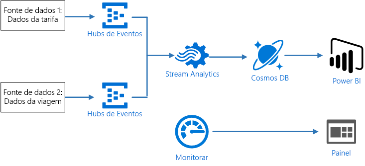
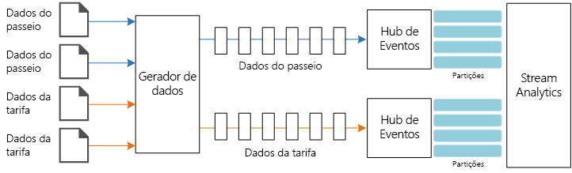
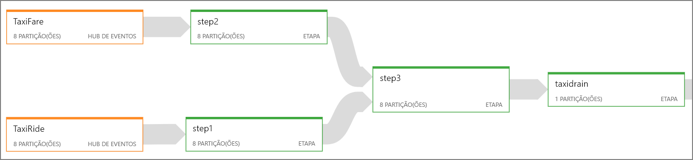
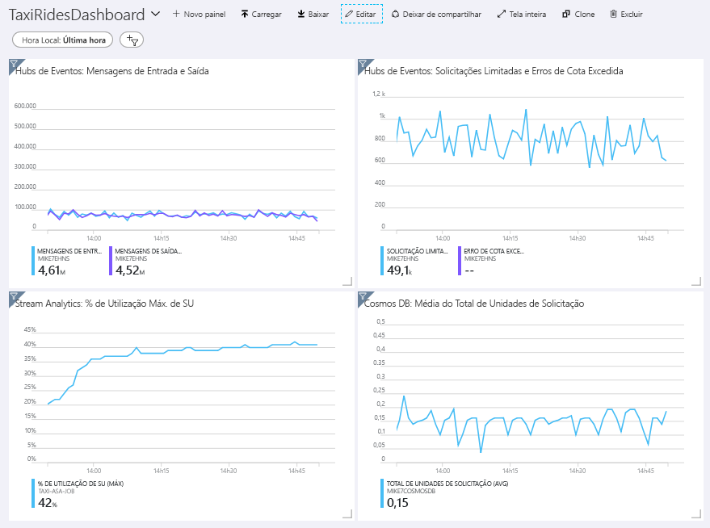
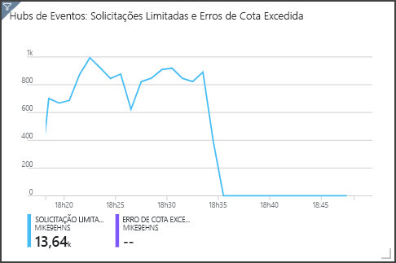

# <a name="create-a-stream-processing-pipeline-with-azure-stream-analytics"></a>Criar um pipeline de processamento de fluxo com o Azure Stream Analytics

Essa arquitetura de referência mostra um pipeline de [processamento de fluxo](/azure/architecture/data-guide/big-data/real-time-processing) de ponta a ponta. O pipeline ingere dados de duas fontes, correlaciona os registros em dois fluxos e calcula uma média móvel em uma janela de tempo. Os resultados são armazenados para análise posterior.

Há uma implantação de referência para essa arquitetura de referência disponível no [GitHub][github].



**Cenário**: uma empresa de táxi coleta dados sobre cada viagem. Para esse cenário, assumimos que há dois dispositivos separados enviando dados. O táxi tem um medidor que envia informações sobre cada corrida &mdash; duração, distância e locais de embarque e desembarque de passageiros. Um dispositivo separado aceita pagamentos de clientes e envia dados sobre tarifas. A empresa de táxi deseja calcular a média de gorjeta por quilômetro dirigido em tempo real para identificar tendências.

## <a name="architecture"></a>Arquitetura

A arquitetura consiste nos componentes a seguir.

**Fontes de dados**. Nessa arquitetura há duas fontes de dados que geram fluxos de dados em tempo real. O primeiro fluxo contém informações da corrida, e o segundo contém informações da tarifa. A arquitetura de referência inclui um gerador de dados simulados que faz a leitura de um conjunto de arquivos estáticos e envia os dados para os Hubs de Eventos. Em um aplicativo real, as fontes de dados seriam dispositivos instalados nos táxis.

**Hubs de Eventos do Azure**. [Hubs de Eventos](/azure/event-hubs/) são um serviço de ingestão de eventos. Essa arquitetura usa duas instâncias de hub de eventos, uma para cada fonte de dados. Cada fonte de dados envia um fluxo de dados para o hub de eventos associado.

**Azure Stream Analytics**. [Stream Analytics](/azure/stream-analytics/) é um mecanismo de processamento de eventos. Um trabalho do Stream Analytics lê os fluxos de dados dos dois hubs de eventos e executa o processamento de fluxo.

**Cosmos DB**. A saída do trabalho do Stream Analytics é uma série de registros gravados como documentos JSON para um banco de dados de documento do Cosmos DB.

**Microsoft Power BI**. O Power BI é um conjunto de ferramentas de análise de negócios para analisar dados a fim de obter informações comerciais. Nessa arquitetura, ele carrega os dados do Cosmos DB. Isso permite que os usuários analisem o conjunto completo de dados históricos que foram coletados. Também é possível transmitir os resultados diretamente do Stream Analytics para o Power BI para obter uma exibição em tempo real dos dados. Para obter mais informações, confira [Streaming em tempo real no Power BI](/power-bi/service-real-time-streaming).

**Azure Monitor**. O [Azure Monitor](/azure/monitoring-and-diagnostics/) coleta métricas de desempenho sobre os serviços do Azure implantados na solução. Ao visualizá-los em um painel, é possível obter informações sobre a integridade da solução.

## <a name="data-ingestion"></a>Ingestão de dados

<!-- markdownlint-disable MD033 -->

Para simular uma fonte de dados, essa arquitetura de referência usa o conjunto de dados dos [Dados de táxi de Nova York](https://uofi.app.box.com/v/NYCtaxidata/folder/2332218797)<sup>[[1]](#note1)</sup>. Esse conjunto de dados contém dados sobre viagens de táxi em Nova York durante um período de 4 anos (2010 &ndash; 2013). Ele contém dois tipos de registro: Dados da corrida e da tarifa. Os dados de corrida incluem a duração da viagem, a distância da viagem e os locais de embarque e desembarque de passageiros. Os dados de tarifa incluem a tarifa, impostos e quantias das gorjetas. Campos comuns em ambos os tipos de registro incluem o número da licença, carteira de habilitação e ID do fornecedor. Juntos, esses três campos fazem a identificação exclusiva de um táxi e um motorista. Os dados são armazenados no formato CSV.

<span id="note1">[1]</span> Donovan, Brian; Work, Dan (2016): Dados de corridas de táxi na Cidade de Nova York (2010-2013). Universidade de Illinois em Urbana-Champaign. https://doi.org/10.13012/J8PN93H8

<!-- markdownlint-enable MD033 -->

O gerador de dados é um aplicativo .NET Core que lê os registros e os envia para os Hubs de Eventos do Azure. O gerador envia os dados de corrida em formato JSON e os dados de tarifa em formato CSV.

Os Hubs de Eventos usam [partições](/azure/event-hubs/event-hubs-features#partitions) para segmentar os dados. As partições permitem que um consumidor leia cada partição em paralelo. Ao enviar dados para os Hubs de Eventos, é possível especificar a chave de partição explicitamente. Caso contrário, os registros são atribuídos a partições no estilo round robin.

Nesse cenário específico, os dados de corrida e de tarifa devem ter a mesma ID de partição para um determinado táxi. Isso permite que o Stream Analytics aplique um grau de paralelismo ao correlacionar os dois fluxos. Um registro na partição *n* dos dados de corrida corresponderá a um registro na partição *n* dos dados de tarifa.



No gerador de dados, o modelo de dados comum para ambos os tipos de registro têm uma propriedade `PartitionKey` que é a concatenação de `Medallion`, `HackLicense` e `VendorId`.

```csharp
public abstract class TaxiData
{
    public TaxiData()
    {
    }

    [JsonProperty]
    public long Medallion { get; set; }

    [JsonProperty]
    public long HackLicense { get; set; }

    [JsonProperty]
    public string VendorId { get; set; }

    [JsonProperty]
    public DateTimeOffset PickupTime { get; set; }

    [JsonIgnore]
    public string PartitionKey
    {
        get => $"{Medallion}_{HackLicense}_{VendorId}";
    }
```

Essa propriedade é usada para fornecer uma chave de partição explícita ao enviar para Hubs de Eventos:

```csharp
using (var client = pool.GetObject())
{
    return client.Value.SendAsync(new EventData(Encoding.UTF8.GetBytes(
        t.GetData(dataFormat))), t.PartitionKey);
}
```

## <a name="stream-processing"></a>Processamento de fluxo

O trabalho de processamento de fluxo é definido usando uma consulta SQL com várias etapas distintas. As duas primeiras etapas simplesmente selecionam registros dos dois fluxos de entrada.

```sql
WITH
Step1 AS (
    SELECT PartitionId,
           TRY_CAST(Medallion AS nvarchar(max)) AS Medallion,
           TRY_CAST(HackLicense AS nvarchar(max)) AS HackLicense,
           VendorId,
           TRY_CAST(PickupTime AS datetime) AS PickupTime,
           TripDistanceInMiles
    FROM [TaxiRide] PARTITION BY PartitionId
),
Step2 AS (
    SELECT PartitionId,
           medallion AS Medallion,
           hack_license AS HackLicense,
           vendor_id AS VendorId,
           TRY_CAST(pickup_datetime AS datetime) AS PickupTime,
           tip_amount AS TipAmount
    FROM [TaxiFare] PARTITION BY PartitionId
),
```

A próxima etapa une os dois fluxos de entrada para selecionar registros correspondentes de cada fluxo.

```sql
Step3 AS (
  SELECT
         tr.Medallion,
         tr.HackLicense,
         tr.VendorId,
         tr.PickupTime,
         tr.TripDistanceInMiles,
         tf.TipAmount
    FROM [Step1] tr
    PARTITION BY PartitionId
    JOIN [Step2] tf PARTITION BY PartitionId
      ON tr.Medallion = tf.Medallion
     AND tr.HackLicense = tf.HackLicense
     AND tr.VendorId = tf.VendorId
     AND tr.PickupTime = tf.PickupTime
     AND tr.PartitionId = tf.PartitionId
     AND DATEDIFF(minute, tr, tf) BETWEEN 0 AND 15
)
```

Essa consulta une registros em um conjunto de campos que identificam exclusivamente os registros correspondentes (Medallion, HackLicense, VendorId e PickupTime). A instrução `JOIN` também inclui a ID da partição. Conforme mencionado, ela tira vantagem do fato de que registros de correspondência sempre têm a mesma ID de partição nesse cenário.

No Stream Analytics, as junções são *temporais*, o que significa que os registros são unidos em uma janela específica de tempo. Caso contrário, o trabalho pode precisar aguardar indefinidamente por uma correspondência. A função [DATEDIFF](https://msdn.microsoft.com/azure/stream-analytics/reference/join-azure-stream-analytics) especifica o quanto dois registros correspondentes podem estar separados no tempo para haver uma correspondência.

A última etapa no trabalho calcula a média de gorjeta por quilômetro, agrupada por uma janela de salto de 5 minutos.

```sql
SELECT System.Timestamp AS WindowTime,
       SUM(tr.TipAmount) / SUM(tr.TripDistanceInMiles) AS AverageTipPerMile
  INTO [TaxiDrain]
  FROM [Step3] tr
  GROUP BY HoppingWindow(Duration(minute, 5), Hop(minute, 1))
```

O Stream Analytics fornece várias [funções de janelas](/azure/stream-analytics/stream-analytics-window-functions). Uma janela de salto se move para a frente no tempo conforme um período fixo, nesse caso, 1 minuto por salto. O resultado é o cálculo de uma média móvel nos últimos 5 minutos.

Na arquitetura mostrada aqui, apenas os resultados do trabalho do Stream Analytics são salvos no Cosmos DB. Para um cenário de Big Data, considere usar também uma [Captura de Hubs de Eventos](/azure/event-hubs/event-hubs-capture-overview) para salvar os dados brutos de evento no armazenamento de Blobs do Azure. Ao manter os dados brutos, é possível executar consultas em lote de seus dados históricos em um momento posterior para derivar novos insights de dados.

## <a name="scalability-considerations"></a>Considerações sobre escalabilidade

### <a name="event-hubs"></a>Hubs de Eventos

A capacidade da taxa de transferência dos Hubs de Eventos é medida em [unidades de produtividade](/azure/event-hubs/event-hubs-features#throughput-units). É possível fazer o dimensionamento automático de um hub de eventos ao permitir a [inflação automática](/azure/event-hubs/event-hubs-auto-inflate), o que dimensiona automaticamente as unidades de produtividade com base no tráfego até um número máximo configurado.

### <a name="stream-analytics"></a>Stream Analytics

Para o Stream Analytics, os recursos de computação alocados em um trabalho são medidos em unidades de streaming. Os trabalhos do Stream Analytics executam um dimensionamento melhor caso o trabalho possa ser paralelizado. Dessa forma, o Stream Analytics pode distribuir o trabalho entre vários nós de computação.

Para a entrada de Hubs de Eventos, use a palavra-chave `PARTITION BY` para particionar o trabalho do Stream Analytics. Os dados serão divididos em subconjuntos com base nas partições dos Hubs de Eventos.

Funções de janelas e uniões temporais exigem UAs adicionais. Quando possível, use `PARTITION BY` para que cada partição seja processada separadamente. Para saber mais, confira [Compreender e ajustar unidades de streaming](/azure/stream-analytics/stream-analytics-streaming-unit-consumption#windowed-aggregates).

Se não for possível paralelizar todo o trabalho do Stream Analytics, tente dividir o trabalho em várias etapas, começando com uma ou mais etapas paralelas. Dessa forma, as primeiras etapas conseguem ser executadas em paralelo. Por exemplo, nesta arquitetura de referência:

- As etapas 1 e 2 são instruções `SELECT` simples que selecionam registros dentro de uma única partição.
- A etapa 3 realiza uma junção particionada em dois fluxos de entrada. Essa etapa tira proveito do fato de que os registros correspondentes compartilham a mesma chave de partição e, assim, é garantido que terão a mesma ID de partição em cada fluxo de entrada.
- A etapa 4 agrega em todas as partições. Essa etapa não pode ser paralelizada.

Use o [diagrama de trabalho](/azure/stream-analytics/stream-analytics-job-diagram-with-metrics) do Stream Analytics para ver quantas partições são atribuídas a cada etapa no trabalho. O diagrama a seguir mostra o diagrama de trabalho dessa arquitetura de referência:



### <a name="cosmos-db"></a>Cosmos DB

A capacidade da taxa de transferência para o Cosmos DB é medida em [Unidades de Solicitação](/azure/cosmos-db/request-units) (RU). Para dimensionar um contêiner do Cosmos DB após 10.000 RU, é preciso especificar uma [chave de partição](/azure/cosmos-db/partition-data) ao criar o contêiner, além de incluir a chave de partição em todos os documentos.

Nessa arquitetura de referência, os novos documentos são criados apenas uma vez por minuto (o intervalo da janela de salto), portanto, os requisitos de taxa de transferência são um valor muito baixo. Por esse motivo, não é preciso atribuir uma chave de partição nesse cenário.

## <a name="monitoring-considerations"></a>Considerações de monitoramento

Com qualquer solução de processamento de fluxo, é importante monitorar o desempenho e a integridade do sistema. O [Azure Monitor](/azure/monitoring-and-diagnostics/) coleta métricas e logs de diagnóstico dos serviços do Azure usados na arquitetura. O Azure Monitor é criado na plataforma do Azure e não exige nenhum código adicional em seu aplicativo.

Qualquer um dos sinais de aviso a seguir indica que você deve escalar horizontalmente o recurso relevante do Azure:

- Os Hubs de Eventos limitam as solicitações ou a cota diária de mensagens está próxima.
- O trabalho do Stream Analytics usa, consistentemente, mais de 80% das unidades de streaming alocadas (SU).
- O Cosmos DB começa a limitar solicitações.

A arquitetura de referência inclui um painel personalizado, que é implantado no portal do Azure. Depois de implantar a arquitetura, é possível exibir o painel. Para isso, abra o [Portal do Azure](https://portal.azure.com) e selecione `TaxiRidesDashboard` na lista de painéis. Para saber mais sobre a criação e implantação de painéis personalizados no portal do Azure, confira [Criar painéis do Azure programaticamente](/azure/azure-portal/azure-portal-dashboards-create-programmatically).

A imagem a seguir mostra o painel depois que o trabalho do Stream Analytics foi executado por aproximadamente uma hora.



O painel na parte inferior esquerda mostra que o consumo de SU do trabalho do Stream Analytics aumenta durante os primeiros 15 minutos e diminui em seguida. Isso é um padrão típico conforme o trabalho atinge um estado estável.

Observe que os Hubs de Eventos está limitando as solicitações, o que é mostrado no painel superior à direita. Uma solicitação ser limitada ocasionalmente não é um problema, porque o SDK do cliente dos Hubs de Eventos faz novas tentativas automaticamente ao receber um erro de limitação. No entanto, se houver erros de limitação consistentes, isso significa que o hub de eventos precisa de mais unidades de produtividade. O gráfico a seguir mostra uma execução de teste usando o recurso de inflação automática dos Hubs de Eventos, o que dimensiona automaticamente as unidades de produtividade conforme o necessário.



A inflação automática foi habilitada por volta da marca de 06:35. É possível ver a queda de p em solicitações limitadas, uma vez que os Hubs de Eventos dimensionam automaticamente até 3 unidades de produtividade.

Curiosamente, isso criava o efeito colateral de aumento da utilização de SU no trabalho do Stream Analytics. Ao fazer a limitação, os Hubs de Eventos foram reduzindo artificialmente a taxa de ingestão para o trabalho do Stream Analytics. É muito comum que a resolução de um gargalo no desempenho revele outra. Nesse caso, a alocação de SU adicional ao trabalho do Stream Analytics resolveu o problema.

## <a name="deploy-the-solution"></a>Implantar a solução

Para a implantação e execução da implementação de referência, siga as etapas em [Leia-me do GitHub][github].

## <a name="related-resources"></a>Recursos relacionados

Talvez seja melhor examinar os seguintes [cenários de exemplo do Azure](/azure/architecture/example-scenario), que demonstram soluções específicas usando algumas das mesmas tecnologias:

- [Análise de dados e de IoT no setor de construção civil](/azure/architecture/example-scenario/data/big-data-with-iot)
- [Detecção de fraude em tempo real](/azure/architecture/example-scenario/data/fraud-detection)

<!-- links -->

[github]: https://github.com/mspnp/azure-stream-analytics-data-pipeline
