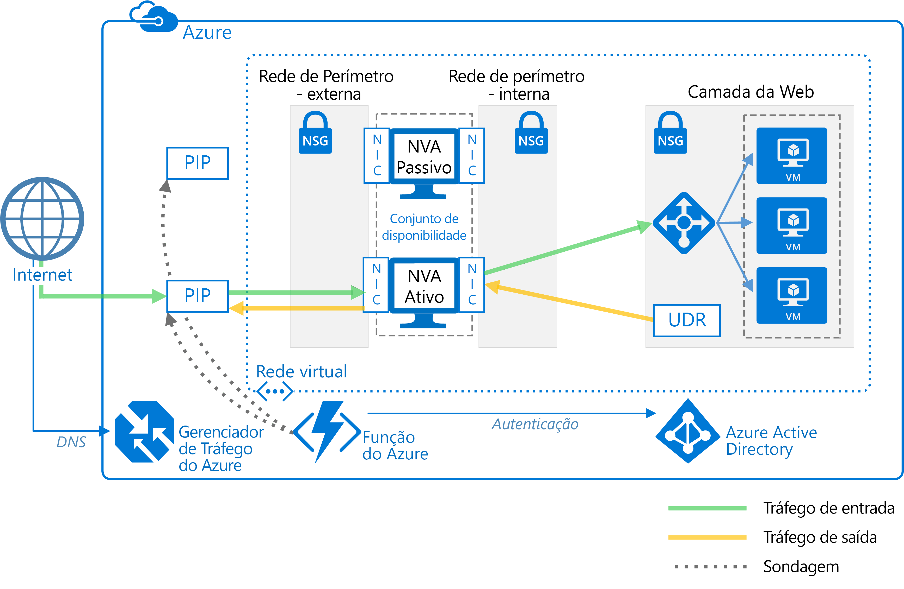

# Implantar soluções de virtualização de rede altamente disponíveis

Este artigo mostra como implantar um conjunto de NVAs (soluções de virtualização de rede) para alta disponibilidade no Azure. Uma NVA normalmente é usada para controlar o fluxo de tráfego de rede de uma rede de perímetro, também conhecida como DMZ, para outras redes ou sub-redes. Para saber mais sobre a implementação de uma DMZ no Azure, consulte [Serviços em nuvem da Microsoft e segurança de rede][cloud-security]. O artigo inclui as arquiteturas de exemplo apenas de entrada, apenas de saída e de entrada e saída.

**Pré-requisitos:** Este artigo pressupõe um entendimento básico de redes do Azure, [balanceadores de carga do Azure][lb-overview] e UDRs [(rotas definidas pelo usuário)][udr-overview].

## Diagramas de arquitetura

Uma NVA pode ser implantada em uma DMZ em muitas arquiteturas diferentes. Por exemplo, a figura a seguir ilustra o uso de uma [única NVA][nva-scenario] para entrada.

![[0]][0]

Nessa arquitetura, a NVA fornece um limite de rede segura marcando todo tráfego de rede de entrada e saída e passando apenas o tráfego que atende às regras de segurança de rede. No entanto, o fato de que todo o tráfego de rede deve passar pela NVA significa que ela é um ponto único de falha na rede. Se a NVA falhar, não haverá nenhum outro caminho para o tráfego de rede e todas as sub-redes de back-end ficarão indisponíveis.

Para tornar uma NVA altamente disponível, implante mais de uma NVA em um conjunto de disponibilidade.

As arquiteturas a seguir descrevem os recursos e a configuração necessários para NVAs altamente disponíveis:

<!-- markdownlint-disable MD033 -->

| Solução | Benefícios | Considerações |
| --- | --- | --- |
| [Entrada com NVAs na camada 7][ingress-with-layer-7] |Todos os nós de NVA estão ativos |Requer uma NVA que pode encerrar conexões e usar SNAT  Requer um conjunto separado de NVAs para o tráfego proveniente da Internet e do Azure   Só pode ser usado para tráfego proveniente de fora do Azure |
| [Saída com NVAs na camada 7][egress-with-layer-7] |Todos os nós de NVA estão ativos | Requer uma NVA que pode encerrar conexões e implementa SNAT (conversão de endereços de rede de origem)
| [Entrada-saída com NVAs na camada 7][ingress-egress-with-layer-7] |Todos os nós estão ativos Capaz de lidar com tráfego originado no Azure |Requer uma NVA que pode encerrar conexões e usar SNAT Requer um conjunto separado de NVAs para o tráfego proveniente da Internet e do Azure |
| [Opção PIP-UDR][pip-udr-switch] |Conjunto único de NVAs para todo o tráfego Pode lidar com todo o tráfego (sem limite nas regras de porta) |Ativo-passivo Requer um processo de failover |
| [PIP-UDR sem SNAT](#pip-udr-nvas-without-snat) | Conjunto único de NVAs para todo o tráfego Pode lidar com todo o tráfego (sem limite nas regras de porta) Não exige configuração de SNAT para solicitações de entrada |Ativo-passivo Requer um processo de failover A lógica de investigação e failover é executada fora da rede virtual |

<!-- markdown-enable MD033 -->

## Entrada com NVAs na camada 7

A figura a seguir mostra uma arquitetura de alta disponibilidade que implementa uma DMZ de entrada por atrás de um balanceador de carga voltado para a Internet. Essa arquitetura é projetada para fornecer conectividade a cargas de trabalho do Azure para o tráfego da camada 7, como HTTP ou HTTPS:

![[1]][1]

A vantagem dessa arquitetura é que todas as NVAs estão ativas e, se uma falhar, o balanceador de carga direciona o tráfego de rede para a outra NVA. Ambas NVAs encaminham o tráfego para o balanceador de carga interno, portanto, desde que uma NVA esteja ativa, o tráfego continuará a fluir. As NVAs são necessárias para terminar o tráfego SSL destinado a VMs da camada da Web. Essas NVAs não podem ser estendidas para lidar com o tráfego local porque este requer outro conjunto dedicado de NVAs com suas próprias rotas de rede.

> [!NOTE]
> Essa arquitetura é usada nas arquiteturas de referência de [DMZ entre o Azure e seu datacenter local][dmz-on-prem] e de [DMZ entre o Azure e a Internet][dmz-internet]. Todas essas arquiteturas de referência incluem uma solução de implantação que você pode usar. Siga os links abaixo para obter mais informações.

## Saída com NVAs na camada 7

A arquitetura anterior pode ser expandida para fornecer uma DMZ de saída para solicitações originadas na carga de trabalho do Azure. A arquitetura a seguir é projetada para fornecer alta disponibilidade de NVAs na DMZ para o tráfego de camada 7, como HTTP ou HTTPS:

![[2]][2]

Nessa arquitetura, todo o tráfego originado no Azure é encaminhado para um balanceador de carga interno. O balanceador de carga distribui solicitações de saída entre um conjunto de NVAs. Essas NVAs direcionam o tráfego para a Internet usando os endereços IP públicos individuais.

> [!NOTE]
> Essa arquitetura é usada nas arquiteturas de referência de [DMZ entre o Azure e seu datacenter local][dmz-on-prem] e de [DMZ entre o Azure e a Internet][dmz-internet]. Todas essas arquiteturas de referência incluem uma solução de implantação que você pode usar. Siga os links abaixo para obter mais informações.

## Entrada-saída com NVAs na camada 7

Nas duas arquiteturas anteriores, havia uma DMZ separada para entrada e saída. A arquitetura a seguir demonstra como criar uma DMZ que pode ser usada tanto para entrada quanto saída para o tráfego da camada 7, como HTTP ou HTTPS:

![[4]][4]

Nesta arquitetura, as NVAs processam solicitações de entrada do gateway de aplicativo. As NVAs também processam solicitações de saída de VMs de carga de trabalho no pool de back-end do balanceador de carga. Como o tráfego de entrada é roteado com um gateway de aplicativo e o tráfego de saída é roteado com um balanceador de carga, os NVAs são responsáveis por manter a afinidade de sessão. Ou seja, o gateway de aplicativo mantém um mapeamento de solicitações de entrada e saída para que ele possa encaminhar a resposta correta para o solicitante original. No entanto, o balanceador de carga interno não tem acesso aos mapeamentos de gateway de aplicativo e usa sua própria lógica para enviar respostas para as NVAs. É possível que o balanceador de carga possa enviar uma resposta para uma NVA que não recebeu a solicitação do gateway de aplicativo inicialmente. Nesse caso, as NVAs devem se comunicar e transferir a resposta entre elas para que a NVA correta possa encaminhar a resposta para o gateway de aplicativo.

> [!NOTE]
> Você também pode resolver o problema de roteamento assimétrico garantindo que as NVAs executem a SNAT (conversão de endereços de rede de origem) de entrada. Isso substituiria o IP de origem original do solicitante por um dos endereços IP da NVA usada no fluxo de entrada. Isso garante que você possa usar várias NVAs por vez, preservando ainda a simetria de rota.

## Opção PIP-UDR com NVAs da camada 4

A arquitetura a seguir demonstra uma arquitetura com uma NVA ativa e uma passiva. Essa arquitetura lida trata tanto a entrada quanto a saída para o tráfego da camada 4:

![[3]][3]

> [!TIP]
> Há uma solução completa para essa arquitetura disponível no [GitHub][pnp-ha-nva].

Essa arquitetura é semelhante à primeira arquitetura discutida neste artigo. Aquela arquitetura incluía uma única NVA que aceitava e filtrava solicitações de entrada da camada 4. Essa arquitetura adiciona uma segunda NVA passiva para fornecer alta disponibilidade. Se a NVA ativa falhar, a NVA passiva fica ativa e o PIP e o UDR são alterados para apontar para os NICs na NVA que está ativa no momento. Essas alterações do UDR e PIP podem ser feitas manualmente ou usando um processo automatizado. O processo automatizado normalmente é daemon ou outro serviço de monitoramento em execução no Azure. Ele consulta uma investigação de integridade na NVA ativa e executa a opção UDR e PIP quando detecta uma falha da NVA.

A figura anterior mostra um exemplo de cluster [ZooKeeper][zookeeper] que fornece um daemon de alta disponibilidade. Dentro do cluster do ZooKeeper, um quorum de nós elege um líder. Se o líder falhar, os nós restantes elegerão um novo líder. Para essa arquitetura, o nó líder executa o daemon que consulta o ponto de extremidade de integridade na NVA. Se a NVA não responder à investigação de integridade, o daemon ativará a NVA passiva. Em seguida, o daemon chama a API REST do Azure para remover o PIP da NVA com falha e a anexa ao NVA recém-ativado. O daemon modifica então o UDR para apontar para o endereço IP interno da NVA recém-ativada.

Não inclua os nós do ZooKeeper em uma sub-rede que só é acessível por meio de uma rota que inclui a NVA. Caso contrário, os nós do ZooKeeper ficarão inacessíveis se a NVA falhar. Caso o daemon falhe por algum motivo, não será possível acessar nenhum nó do ZooKeeper para diagnosticar o problema.

Para ver a solução completa, incluindo o código de exemplo, confira os arquivos no [repositório GitHub][pnp-ha-nva].

## NVAs PIP-UDR sem SNAT

Essa arquitetura usa duas máquinas virtuais do Azure para hospedar o firewall de NVA em uma configuração ativo-passivo que dá suporte ao failover automático, mas não exige SNAT (Conversão de endereço de rede de origem).

> [!TIP]
> Há uma solução completa para essa arquitetura disponível no [GitHub][ha-nva-fo].

Essa solução foi projetada para clientes do Azure que não conseguem configurar o SNAT para solicitações de entrada em seus firewalls de NVA. O SNAT oculta o endereço IP de origem do cliente original. Se você precisa registrar os IPs originais ou usá-los dentro de outros componentes de segurança em camadas por trás de seus NVAs, essa solução oferecerá uma abordagem básica.

O failover de entradas da tabela UDR é automatizado por um conjunto de endereços de próximo salto definido como o endereço IP de uma interface na máquina de virtual do firewall de NVA ativa. A lógica de failover automatizado é hospedada em um aplicativo de funções que você cria usando o [Azure Functions](/azure/azure-functions/). O código de failover é executado como uma função sem servidor dentro do Azure Functions. A implantação é conveniente, econômica e fácil de manter e personalizar. Além disso, o aplicativo de funções é hospedado dentro do Azure Functions, portanto, não tem dependências da rede virtual. Se as alterações na rede virtual afetarem os firewalls de NVA, o aplicativo de função continuará executando de forma independente. O teste também é mais preciso, pois ocorre fora da rede virtual usando a mesma rota que as solicitações de entrada do cliente.

Para verificar a disponibilidade do firewall de NVA, o código do aplicativo de função o investiga usando uma de duas maneiras:

- Monitorando o estado das máquinas virtuais do Azure que hospedam o firewall de NVA.

- Testando se há uma porta aberta no firewall para o servidor Web de back-end. Para essa opção, a NVA deve expor um soquete por meio de PIP para teste do código do aplicativo de função.

Escolha o tipo de investigação que você deseja usar quando ao configurar o aplicativo de funções. Para ver a solução completa, incluindo o código de exemplo, confira os arquivos no [repositório GitHub][ha-nva-fo].

## Próximas etapas

- Saiba como [implementar uma DMZ entre o Azure e o datacenter local][dmz-on-prem] usando NVAs da camada 7.
- Saiba como [implementar uma DMZ entre o Azure e a Internet][dmz-internet] usando NVAs da camada 7.
- [Solução de problemas de virtualização de rede no Azure](/azure/virtual-network/virtual-network-troubleshoot-nva)

<!-- links -->

[cloud-security]: /azure/best-practices-network-security
[dmz-on-prem]: ./secure-vnet-hybrid.md
[dmz-internet]: ./secure-vnet-dmz.md
[egress-with-layer-7]: #egress-with-layer-7-nvas
[ingress-with-layer-7]: #ingress-with-layer-7-nvas
[ingress-egress-with-layer-7]: #ingress-egress-with-layer-7-nvas
[lb-overview]: /azure/load-balancer/load-balancer-overview/
[nva-scenario]: /azure/virtual-network/virtual-network-scenario-udr-gw-nva/
[pip-udr-switch]: #pip-udr-switch-with-layer-4-nvas
[udr-overview]: /azure/virtual-network/virtual-networks-udr-overview/
[zookeeper]: https://zookeeper.apache.org/
[pnp-ha-nva]: https://github.com/mspnp/ha-nva
[ha-nva-fo]: https://aka.ms/ha-nva-fo

<!-- images -->

[0]: ./images/nva-ha/single-nva.png "Arquitetura NVA única"
[1]: ./images/nva-ha/l7-ingress.png "Entrada da camada 7"
[2]: ./images/nva-ha/l7-ingress-egress.png "Saída da camada 7"
[3]: ./images/nva-ha/active-passive.png "Cluster ativo-passivo"
[4]: ./images/nva-ha/l7-ingress-egress-ag.png
