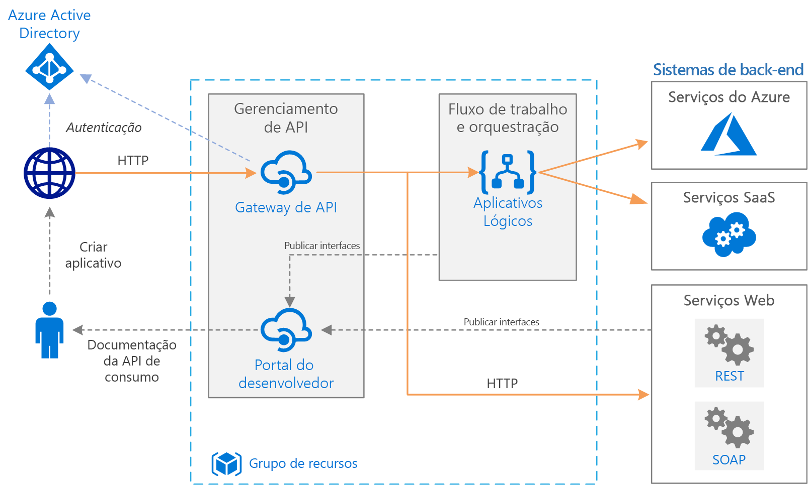

# Integração empresarial básica no AzureBasic enterprise integration on Azure

Essa arquitetura de referência usa os [Azure Integration Services][integration-services] para orquestrar chamadas para sistemas de back-end empresariais.This reference architecture uses [Azure Integration Services][integration-services] to orchestrate calls to enterprise backend systems. Os sistemas de back-end podem incluir sistemas SaaS (software como serviço), serviços do Azure e serviços da Web existentes em sua empresa.The backend systems may include software as a service (SaaS) systems, Azure services, and existing web services in your enterprise.

Os Azure Integration Services são uma coleção de serviços para a integração de aplicativos e dados.Azure Integration Services is a collection of services for integrating applications and data. Essa arquitetura usa dois desses serviços: [Aplicativos Lógicos][logic-apps] para orquestrar fluxos de trabalho, e [Gerenciamento de API][apim] para criar catálogos de APIs.This architecture uses two of those services: [Logic Apps][logic-apps] to orchestrate workflows, and [API Management][apim] to create catalogs of APIs. Essa arquitetura é suficiente para cenários de integração básica nos quais o fluxo de trabalho é disparado por chamadas síncronas para serviços de back-end.This architecture is sufficient for basic integration scenarios where the workflow is triggered by synchronous calls to backend services. Uma arquitetura mais sofisticada que usa [filas e eventos](./queues-events.md) aproveita essa arquitetura básica.A more sophisticated architecture using [queues and events](./queues-events.md) builds on this basic architecture.

## ArquiteturaArchitecture

A arquitetura tem os seguintes componentes:The architecture has the following components:

- **Sistemas de back-end**.**Backend systems**. No lado direito do diagrama estão os vários sistemas de back-end que a empresa implantou ou dos quais ela depende.The right-hand side of the diagram shows the various backend systems that the enterprise has deployed or relies on. Podem incluir sistemas de SaaS, outros serviços do Azure ou serviços da Web que expõem pontos de extremidade REST ou SOAP.These might include SaaS systems, other Azure services, or web services that expose REST or SOAP endpoints.

- **Aplicativos Lógicos do Azure**.**Azure Logic Apps**. Os [Aplicativos Lógicos][logic-apps] são uma plataforma sem servidor para compilar fluxos de trabalho corporativos que integram aplicativos, dados e serviços.[Logic Apps][logic-apps] is a serverless platform for building enterprise workflows that integrate applications, data, and services. Nessa arquitetura, os aplicativos lógicos são disparados por solicitações HTTP.In this architecture, the logic apps are triggered by HTTP requests. Você também pode aninhar fluxos de trabalho para uma orquestração mais complexa.You can also nest workflows for more complex orchestration. Os Aplicativos Lógicos usam [conectores][logic-apps-connectors] para integração com serviços usados normalmente.Logic Apps uses [connectors][logic-apps-connectors] to integrate with commonly used services. Os Aplicativos Lógicos oferecem centenas de conectores, e você também pode criar conectores personalizados.Logic Apps offers hundreds of connectors, and you can create custom connectors.

- **Gerenciamento de API do Azure**.**Azure API Management**. O [Gerenciamento de API][apim] é um serviço gerenciado para publicação de catálogos de APIs HTTP, para promover a reutilização e a capacidade de descoberta.[API Management][apim] is a managed service for publishing catalogs of HTTP APIs, to promote reuse and discoverability. O Gerenciamento de API é formado por dois componentes relacionados:API Management consists of two related components:

  - **Gateway de API**.**API gateway**. O gateway de API aceita chamadas HTTP e as encaminha para o back-end.The API gateway accepts HTTP calls and routes them to the backend.

  - **Portal do desenvolvedor**.**Developer portal**. Cada instância do Gerenciamento de API do Azure fornece acesso a um [portal do desenvolvedor][apim-dev-portal].Each instance of Azure API Management provides access to a [developer portal][apim-dev-portal]. Esse portal dá aos seus desenvolvedores acesso à documentação e a exemplos de códigos para chamar as APIs.This portal gives your developers access to documentation and code samples for calling the APIs. Também é possível testar as APIs no portal do desenvolvedor.You can also test APIs in the developer portal.

  Nessa arquitetura, as APIs de composição são compiladas pela [importação de aplicativos lógicos][apim-logic-app] como APIs.In this architecture, composite APIs are built by [importing logic apps][apim-logic-app] as APIs. Você também pode importar os serviços Web existentes [importando especificações da OpenAPI][apim-openapi] (Swagger) ou [importando APIs do SOAP][apim-soap] a partir das especificações de WSDL.You can also import existing web services by [importing OpenAPI][apim-openapi] (Swagger) specifications or [importing SOAP APIs][apim-soap] from WSDL specifications.

  O gateway de API ajuda a separar clientes front-end do back-end.The API gateway helps to decouple front-end clients from the back end. Por exemplo, ele pode reescrever URLs ou transformar as solicitações antes que elas atinjam o back-end.For example, it can rewrite URLs, or transform requests before they reach the backend. Ele também lida com muitas questões transversais, como autenticação, suporte a CORS (compartilhamento de recurso entre origens) e armazenamento em cache da resposta.It also handles many cross-cutting concerns such as authentication, cross-origin resource sharing (CORS) support, and response caching.

- **DNS do Azure**.**Azure DNS**. O [DNS do Azure][dns] é um serviço de hospedagem para domínios DNS.[Azure DNS][dns] is a hosting service for DNS domains. O DNS do Azure fornece resolução de nomes usando a infraestrutura do Microsoft Azure.Azure DNS provides name resolution by using the Microsoft Azure infrastructure. Ao hospedar seus domínios no Microsoft Azure, você pode gerenciar seus registros DNS usando as mesmas credenciais, APIs, ferramentas e cobrança que seus outros serviços do Azure.By hosting your domains in Azure, you can manage your DNS records by using the same credentials, APIs, tools, and billing that you use for your other Azure services. Para usar um nome de domínio personalizado, como contoso.com, crie registros DNS que mapeiem o nome de domínio personalizado para o endereço IP.To use a custom domain name, such as contoso.com, create DNS records that map the custom domain name to the IP address. Para saber mais, confira [Configurar um nome de domínio personalizado no Gerenciamento de API][apim-domain].For more information, see [Configure a custom domain name in API Management][apim-domain].

- **Azure Active Directory (Azure AD)**.**Azure Active Directory (Azure AD)**. Use o [Azure AD][aad] para autenticar clientes que chamam o gateway de API.Use [Azure AD][aad] to authenticate clients that call the API gateway. O Azure AD oferece suporte ao protocolo OIDC (OpenID Connect).Azure AD supports the OpenID Connect (OIDC) protocol. Os clientes obtêm um token de acesso do Azure AD e o Gateway de API [valida o token][apim-jwt] para autorizar a solicitação.Clients obtain an access token from Azure AD, and API Gateway [validates the token][apim-jwt] to authorize the request. Ao usar o tipo Standard ou Premium do Gerenciamento de API, o Azure AD também pode proteger o acesso ao portal do desenvolvedor.When using the Standard or Premium tier of API Management, Azure AD can also secure access to the developer portal.

## RecomendaçõesRecommendations

Seus requisitos específicos podem ser diferentes da arquitetura genérica exibida aqui.Your specific requirements might differ from the generic architecture shown here. Use as recomendações nesta seção como um ponto inicial.Use the recommendations in this section as a starting point.

### Gerenciamento de APIAPI Management

Use as camadas de gerenciamento de API básica, Standard ou Premium.Use the API Management Basic, Standard, or Premium tiers. Essas camadas oferecem um SLA (Contrato de Nível de Serviço) de produção e são compatíveis com escala horizontal dentro da região do Azure.These tiers offer a production service level agreement (SLA) and support scale out within the Azure region. A capacidade de taxa de transferência para o Gerenciamento de API é medida em *unidades*.Throughput capacity for API Management is measured in *units*. Cada tipo de preço tem uma expansão máxima. A camada Premium também dá suporte para escalar horizontalmente em várias regiões do Azure.Each pricing tier has a maximum scale-out. The Premium tier also supports scale out across multiple Azure regions. Escolha sua camada com base no conjunto de recursos e o nível de taxa de transferência necessário.Choose your tier based on your feature set and the level of required throughput. Para saber mais, confira [Preços do Gerenciamento de API][apim-pricing] e [Capacidade de uma instância de Gerenciamento de API do Azure][apim-capacity].For more information, see [API Management pricing][apim-pricing] and [Capacity of an Azure API Management instance][apim-capacity].

Cada instância de Gerenciamento de API do Azure tem um nome de domínio padrão, que é um subdomínio do `azure-api.net` &mdash, por exemplo, `contoso.azure-api.net`.Each Azure API Management instance has a default domain name, which is a subdomain of `azure-api.net` &mdash, for example, `contoso.azure-api.net`. Considere a configuração de um [domínio personalizado][apim-domain] para a sua organização.Consider configuring a [custom domain][apim-domain] for your organization.

### Aplicativos LógicosLogic Apps

Os Aplicativos Lógicos funcionam melhor em cenários que não exigem baixa latência para uma resposta, por exemplo, chamadas à API de execução semi-longa ou assíncronas.Logic Apps works best in scenarios that don't require low latency for a response, such as asynchronous or semi long-running API calls. Se for necessário ter baixa latência, por exemplo, em uma chamada que bloqueia uma interface do usuário, use uma tecnologia diferente.If low latency is required, for example in a call that blocks a user interface, use a different technology. Por exemplo, use o Azure Functions ou uma API Web implantada no Serviço de Aplicativo do Azure.For example, use Azure Functions or a web API deployed to Azure App Service. Use o Gerenciamento de API para administrar a API para seus consumidores de API.Use API Management to front the API to your API consumers.

### RegiãoRegion

Para minimizar a latência de rede, coloque o Gerenciamento de API e os Aplicativos Lógicos na mesma região.To minimize network latency, put API Management and Logic Apps in the same region. Em geral, escolha a região mais próxima dos usuários (ou mais próxima de seus serviços de back-end).In general, choose the region that's closest to your users (or closest to your backend services).

O grupo de recursos também tem uma região.The resource group also has a region. Essa região especifica onde os metadados de implantação são armazenados e onde o modelo de implantação é executado.This region specifies where to store deployment metadata and where to execute the deployment template. Para melhorar a disponibilidade durante a implantação, coloque o grupo de recursos e os respectivos recursos na mesma região.To improve availability during deployment, put the resource group and resources in the same region.

## Considerações sobre escalabilidadeScalability considerations

Para elevar a escalabilidade do Gerenciamento de API, adicione [políticas de cache][apim-caching] conforme apropriado.To increase the scalability of API Management, add [caching policies][apim-caching] where appropriate. Armazenamento em cache também ajuda a reduzir a carga nos serviços de back-end.Caching also helps reduce the load on back-end services.

Para oferecer maior capacidade, aumente as camadas Básica, Standard e Premium do Gerenciamento de API em uma região do Azure.To offer greater capacity, you can scale out Azure API Management Basic, Standard, and Premium tiers in an Azure region. Para analisar o uso para seu serviço, no menu **Métrica**, selecione a opção **Métricas de Capacidade** e aumente ou reduza, conforme apropriado.To analyze the usage for your service, on the **Metrics** menu, select the **Capacity Metric** option and then scale up or scale down as appropriate. O processo de atualização ou escala pode levar de 15 a 45 minutos para ser aplicado.The upgrade or scale process can take from 15 to 45 minutes to apply.

Recomendações para colocação em escala de um serviço de Gerenciamento de API:Recommendations for scaling an API Management service:

- Considere os padrões de tráfego ao dimensionar.Consider traffic patterns when scaling. Os clientes com padrões de tráfego mais voláteis precisam de mais capacidade.Customers with more volatile traffic patterns need more capacity.

- Capacidade consistente acima de 66% pode indicar a necessidade de expansão.Consistent capacity that's greater than 66% might indicate a need to scale up.

- Capacidade consistente abaixo de 20% pode indicar uma oportunidade para reduzir verticalmente.Consistent capacity that's under 20% might indicate an opportunity to scale down.

- Antes de habilitar a carga em produção, sempre realize teste de carga no seu serviço do Gerenciamento de API com uma carga representativa.Before you enable the load in production, always load-test your API Management service with a representative load.

Com o tipo Premium, você pode dimensionar uma instância do Gerenciamento de API em várias regiões do Azure.With the Premium tier, you can scale an API Management instance across multiple Azure regions. Isso qualifica o Gerenciamento de API para um SLA mais alto e permite que você provisione serviços próximos aos usuários em várias regiões.This makes API Management eligible for a higher SLA, and lets you provision services near users in multiple regions.

Em modelos sem servidor dos Aplicativos Lógicos, os administradores não precisam planejar a escalabilidade do serviço.The Logic Apps serverless model means administrators don't have to plan for service scalability. O serviço é dimensionado automaticamente para atender à demanda.The service automatically scales to meet demand.

## Considerações sobre disponibilidadeAvailability considerations

Examine o SLA para cada serviço:Review the SLA for each service:

- [SLA de Gerenciamento de API][apim-sla][API Management SLA][apim-sla]
- [SLA de Aplicativos Lógicos][logic-apps-sla][Logic Apps SLA][logic-apps-sla]

Se você implantar o Gerenciamento de API em duas ou mais regiões com o tipo Premium, ele se tornará qualificado para um SLA mais alto.If you deploy API Management across two or more regions with Premium tier, it is eligible for a higher SLA. Confira [Preços de Gerenciamento de API][apim-pricing]See [API Management pricing][apim-pricing].

### BackupsBackups

[Faça backups][apim-backup] regularmente da configuração do seu Gerenciamento de API.Regularly [back up][apim-backup] your API Management configuration. Armazene seus arquivos de backup em um local ou região do Azure diferente da região onde o serviço está implantado.Store your backup files in a location or Azure region that differs from the region where the service is deployed. Com base em seu [RTO][rto], escolha uma estratégia de recuperação de desastres:Based on your [RTO][rto], choose a disaster recovery strategy:

- No caso de um evento de recuperação de desastre, provisione uma nova instância de Gerenciamento de API, restaure o backup para a nova instância e reordene os registros de DNS.In a disaster recovery event, provision a new API Management instance, restore the backup to the new instance, and repoint the DNS records.

- Mantenha uma instância passiva do serviço de Gerenciamento de API em outra região do Azure.Keep a passive instance of the API Management service in another Azure region. Restaure regularmente backups nessa instância, para mantê-la em sincronia com o serviço ativo.Regularly restore backups to that instance, to keep it in sync with the active service. Para restaurar o serviço durante um evento de recuperação de desastre, será preciso apenas reordenar os registros DNS.To restore the service during a disaster recovery event, you need only repoint the DNS records. Essa abordagem incorre em custos adicionais, pois paga pela instância passiva, mas reduz o tempo de recuperação.This approach incurs additional cost because you pay for the passive instance, but reduces the time to recover.

Para aplicativos lógicos, recomendamos uma abordagem de configuração como código para fazer backup e restauração.For logic apps, we recommend a configuration-as-code approach to backing up and restoring. Como os aplicativos lógicos são sem servidor, você pode recriá-los rapidamente em modelos do Azure Resource Manager.Because logic apps are serverless, you can quickly recreate them from Azure Resource Manager templates. Salve os modelos no controle do código-fonte, integre os modelos ao seu processo de CI/CD (integração/implantação contínua).Save the templates in source control, integrate the templates with your continuous integration/continuous deployment (CI/CD) process. No caso de um evento de recuperação de desastres, implante o modelo em uma nova região.In a disaster recovery event, deploy the template to a new region.

Se você implantar um aplicativo lógico em uma região diferente, atualize a configuração no Gerenciamento de API.If you deploy a logic app to a different region, update the configuration in API Management. É possível atualizar a propriedade de **Back-end** da API usando um script básico do PowerShell.You can update the API's **Backend** property by using a basic PowerShell script.

## Considerações sobre capacidade de gerenciamentoManageability considerations

Crie grupos de recursos separados para ambientes de produção, desenvolvimento e teste.Create separate resource groups for production, development, and test environments. Ter grupos de recursos separados facilita o gerenciamento de implantações, a exclusão de implantações de teste a atribuição de direitos de acesso.Separate resource groups make it easier to manage deployments, delete test deployments, and assign access rights.

Ao atribuir recursos a grupos de recursos, considere os seguintes fatores:When you assign resources to resource groups, consider these factors:

- **Ciclo de vida**.**Lifecycle**. Em geral, coloque recursos com o mesmo ciclo de vida no mesmo grupo de recursos.In general, put resources that have the same lifecycle in the same resource group.

- **Acesso**.**Access**. Para aplicar políticas de acesso aos recursos em um grupo, use o [controle de acesso baseado em função][rbac] (RBAC).To apply access policies to the resources in a group, you can use [role-based access control][rbac] (RBAC).

- **Cobrança**.**Billing**. Você pode exibir os custos acumulados para o grupo de recursos.You can view rollup costs for the resource group.

- **Tipo de preço para o gerenciamento de API**.**Pricing tier for API Management**. Use o tipo Desenvolvedor para ambientes de desenvolvimento e teste.Use the Developer tier for development and test environments. Para minimizar os custos durante a pré-produção, implante uma réplica do seu ambiente de produção, execute os testes e desligue.To minimize costs during preproduction, deploy a replica of your production environment, run your tests, and then shut down.

### ImplantaçãoDeployment

Use [modelos do Azure Resource Manager][arm] para implantar recursos do Azure.Use [Azure Resource Manager templates][arm] to deploy the Azure resources. Os modelos facilitam a automatização das implantações usando o PowerShell ou a CLI do Azure.Templates make it easier to automate deployments using PowerShell or the Azure CLI.

Coloque o Gerenciamento de API e os aplicativos lógicos individuais em seus próprios modelos do Resource Manager separados.Put API Management and any individual logic apps in their own separate Resource Manager templates. Usando modelos separados, é possível armazenar os recursos em sistemas de controle do código-fonte.By using separate templates, you can store the resources in source control systems. Você pode implantar os modelos juntos ou individualmente como parte de um processo de CI/CD.You can deploy the templates together or individually as part of a CI/CD process.

### VersõesVersions

Sempre que você fizer uma alteração na configuração do aplicativo lógico ou implantar uma atualização por meio do modelo do Resource Manager, o Azure manterá uma cópia dessa versão, e todas as versões que tiverem uma execução de histórico serão mantidas.Each time you change a logic app's configuration or deploy an update through a Resource Manager template, Azure keeps a copy of that version and keeps all versions that have a run history. Você pode usar essas versões para controlar as alterações históricas ou promover uma versão como a configuração atual do aplicativo lógico.You can use these versions to track historical changes or promote a version as the logic app's current configuration. Por exemplo, você pode reverter um aplicativo lógico para uma versão anterior.For example, you can roll back a logic app to a previous version.

O Gerenciamento de API oferece suporte a dois conceitos de versão distintos, mas complementares:API Management supports two distinct but complementary versioning concepts:

- *Versões* permitem que os consumidores escolham uma versão de API com base nas necessidades, por exemplo, v1, v2, beta ou produção.*Versions* allow API consumers to choose an API version based on their needs, for example, v1, v2, beta, or production.

- *Revisões* permitem que os administradores de API façam alterações sem interrupções em uma API e implantem essas alterações, juntamente com um log de alterações para informar aos consumidores da API sobre as alterações.*Revisions* allow API administrators to make non-breaking changes in an API and deploy those changes, along with a change log to inform API consumers about the changes.

É possível fazer uma revisão em um ambiente de desenvolvimento e implantar essa alteração em outros ambientes usando os modelos do Resource Manager.You can make a revision in a development environment and deploy that change in other environments by using Resource Manager templates. Para saber mais, confira [Publicar várias versões de sua API][apim-versions]For more information, see [Publish multiple versions of your API][apim-versions]

Você também pode usar as revisões para testar uma API antes de tornar as alterações atuais e acessíveis aos usuários.You can also use revisions to test an API before making the changes current and accessible to users. No entanto, esse método não é recomendado para teste de carga ou teste de integração.However, this method isn't recommended for load testing or integration testing. Use ambientes de pré-produção ou teste separados.Use separate test or preproduction environments instead.

## Diagnóstico e monitoramentoDiagnostics and monitoring

Use o [Azure Monitor][monitor] para monitoramento operacional tanto no Gerenciamento de API quanto nos Aplicativos Lógicos.Use [Azure Monitor][monitor] for operational monitoring in both API Management and Logic Apps. O Azure Monitor fornece informações com base nas métricas que configuradas para cada serviço e é habilitado por padrão.Azure Monitor provides information based on the metrics configured for each service and is enabled by default. Para obter mais informações, consulte:For more information, see:

- [Monitorar APIs publicadas][apim-monitor][Monitor published APIs][apim-monitor]
- [Monitorar o status, configurar o log de diagnósticos e ativar alertas para os Aplicativos Lógicos do Azure][logic-apps-monitor][Monitor status, set up diagnostics logging, and turn on alerts for Azure Logic Apps][logic-apps-monitor]

Cada serviço também tem essas opções:Each service also has these options:

- Para análise e painéis mais aprofundados, envie os logs dos Aplicativos Lógicos para o [Azure Log Analytics][logic-apps-log-analytics].For deeper analysis and dashboarding, send Logic Apps logs to [Azure Log Analytics][logic-apps-log-analytics].

- Para monitoramento de DevOps, configure o Azure Application Insights para Gerenciamento de API.For DevOps monitoring, configure Azure Application Insights for API Management.

- O Gerenciamento de API é compatível com o [modelo de solução do Power BI para análise de APIs personalizadas][apim-pbi].API Management supports the [Power BI solution template for custom API analytics][apim-pbi]. Use esse modelo de solução para criar sua própria solução de análise.You can use this solution template for creating your own analytics solution. Para usuários empresariais, o Power BI disponibiliza relatórios.For business users, Power BI makes reports available.

## Considerações de segurançaSecurity considerations

Embora essa lista não descreva completamente todas as práticas recomendadas de segurança, vejas essas considerações de segurança que se aplicam especificamente a esta arquitetura:Although this list doesn't completely describe all security best practices, here are some security considerations that apply specifically to this architecture:

- O serviço de Gerenciamento de API do Azure tem um endereço IP público fixo.The Azure API Management service has a fixed public IP address. Restrinja o acesso para chamar pontos de extremidade de Aplicativos Lógicos apenas para o endereço IP do Gerenciamento de API.Restrict access for calling Logic Apps endpoints to only the IP address of API Management. Para saber mais, confira [Restringir endereços IP de entrada][logic-apps-restrict-ip].For more information, see [Restrict incoming IP addresses][logic-apps-restrict-ip].

- Para garantir que os usuários tenham níveis de acesso apropriados, use o RBAC (controle de acesso baseado em função).To make sure users have appropriate access levels, use role-based access control (RBAC).

- Proteja os pontos de extremidade de API públicos no Gerenciamento de API usando OAuth ou OpenID Connect.Secure public API endpoints in API Management by using OAuth or OpenID Connect. Para proteger os pontos de extremidade de API públicos, configure um provedor de identidade e adicione uma política de validação de JWT (JSON Web Token).To secure public API endpoints, configure an identity provider, and add a JSON Web Token (JWT) validation policy. Para saber mais, confira [Proteger uma API usando OAuth 2.0 com o Azure Active Directory e o Gerenciamento de API][apim-oauth].For more information, see [Protect an API by using OAuth 2.0 with Azure Active Directory and API Management][apim-oauth].

- Conectar os serviços back-end do Gerenciamento de API usando certificados mútuosConnect to back-end services from API Management by using mutual certificates.

- Impor HTTPS sobre as APIs de Gerenciamento de API.Enforce HTTPS on the API Management APIs.

### Armazenar segredosStoring secrets

Nunca verifique senhas, chaves de acesso ou cadeias de conexão no controle do código-fonte.Never check passwords, access keys, or connection strings into source control. Se tais valores forem necessários, proteja e implante-os usando as técnicas apropriadas.If these values are required, secure and deploy these values by using the appropriate techniques.

Se um aplicativo lógico exigir qualquer valor confidencial que não é possível ser criado dentro de um conector, armazene tais valores no Azure Key Vault e faça referência a eles em um modelo do Resource Manager.If a logic app requires any sensitive values that you can't create within a connector, store those values in Azure Key Vault and reference them from a Resource Manager template. Use os parâmetros de modelo de implantação e arquivos de parâmetros para cada ambiente.Use deployment template parameters and parameter files for each environment. Para saber mais, confira [Proteger parâmetros e entradas em um fluxo de trabalho][logic-apps-secure].For more information, see [Secure parameters and inputs within a workflow][logic-apps-secure].

O Gerenciamento de API administra os segredos usando objetos chamados *valores* ou *propriedades nomeadas*.API Management manages secrets by using objects called *named values* or *properties*. Esses objetos armazenam com segurança valores que podem ser acessados por meio das políticas de Gerenciamento de API.These objects securely store values that you can access through API Management policies. Para saber mais, confira [Como usar Valores Nomeados nas políticas de Gerenciamento de API do Azure][apim-properties].For more information, see [How to use Named Values in Azure API Management policies][apim-properties].

## Considerações de custoCost considerations

Você será cobrado por todas as instâncias de Gerenciamento de API quando estiverem em execução.You are charged for all API Management instances when they are running. Se você tiver escalado verticalmente e não precisar desse nível de desempenho o tempo todo, reduza verticalmente de forma manual ou configure o [dimensionamento automático][apim-autoscale].If you have scaled up and don't need that level of performance all the time, manually scale down or configure [autoscaling][apim-autoscale].

Os Aplicativos lógicos usam um modelo [sem servidor](/azure/logic-apps/logic-apps-serverless-overview).Logic Apps uses a [serverless](/azure/logic-apps/logic-apps-serverless-overview) model. A cobrança é calculada com base na ação e execução do conector.Billing is calculated based on action and connector execution. Para obter mais informações, consulte [Preços de Aplicativos Lógicos](https://azure.microsoft.com/pricing/details/logic-apps/).For more information, see [Logic Apps pricing](https://azure.microsoft.com/pricing/details/logic-apps/). Atualmente, não há considerações de camada para Aplicativos Lógicos.Currently, there are no tier considerations for Logic Apps.

## Próximas etapasNext steps

Para obter mais confiabilidade e escalabilidade, use filas de mensagens e eventos para separar os sistemas de back-end.For greater reliability and scalability, use message queues and events to decouple the backend systems. Esse padrão aparece na próxima arquitetura de referência nesta série: [Integração empresarial usando filas de mensagens e eventos](./queues-events.md).This pattern is shown in the next reference architecture in this series: [Enterprise integration using message queues and events](./queues-events.md).

<!-- links -->

[aad]: /azure/active-directory
[apim]: /azure/api-management
[apim-autoscale]: /azure/api-management/api-management-howto-autoscale
[apim-backup]: /azure/api-management/api-management-howto-disaster-recovery-backup-restore
[apim-caching]: /azure/api-management/api-management-howto-cache
[apim-capacity]: /azure/api-management/api-management-capacity
[apim-dev-portal]: /azure/api-management/api-management-key-concepts#a-namedeveloper-portal-a-developer-portal
[apim-domain]: /azure/api-management/configure-custom-domain
[apim-jwt]: /azure/api-management/policies/authorize-request-based-on-jwt-claims
[apim-logic-app]: /azure/api-management/import-logic-app-as-api
[apim-monitor]: /azure/api-management/api-management-howto-use-azure-monitor
[apim-oauth]: /azure/api-management/api-management-howto-protect-backend-with-aad
[apim-openapi]: /azure/api-management/import-api-from-oas
[apim-pbi]: https://aka.ms/apimpbi
[apim-pricing]: https://azure.microsoft.com/pricing/details/api-management/
[apim-properties]: /azure/api-management/api-management-howto-properties
[apim-sla]: https://azure.microsoft.com/support/legal/sla/api-management/
[apim-soap]: /azure/api-management/import-soap-api
[apim-versions]: /azure/api-management/api-management-get-started-publish-versions
[arm]: /azure/azure-resource-manager/resource-group-authoring-templates
[dns]: /azure/dns/
[integration-services]: https://azure.microsoft.com/product-categories/integration/
[logic-apps]: /azure/logic-apps/logic-apps-overview
[logic-apps-connectors]: /azure/connectors/apis-list
[logic-apps-log-analytics]: /azure/logic-apps/logic-apps-monitor-your-logic-apps-oms
[logic-apps-monitor]: /azure/logic-apps/logic-apps-monitor-your-logic-apps
[logic-apps-restrict-ip]: /azure/logic-apps/logic-apps-securing-a-logic-app#restrict-incoming-ip-addresses
[logic-apps-secure]: /azure/logic-apps/logic-apps-securing-a-logic-app#secure-parameters-and-inputs-within-a-workflow
[logic-apps-sla]: https://azure.microsoft.com/support/legal/sla/logic-apps
[monitor]: /azure/azure-monitor/overview
[rbac]: /azure/role-based-access-control/overview
[rto]: ../../resiliency/index.md#rto-and-rpo