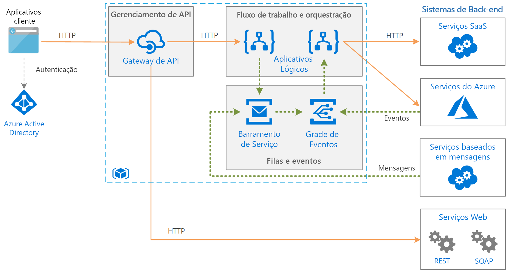

# Integração empresarial no Azure usando filas de mensagens e eventos

Essa arquitetura integra sistemas de back-end corporativos usando filas de mensagens e eventos para separar os serviços e fornecer mais escalabilidade e confiabilidade. Os sistemas de back-end podem incluir sistemas SaaS (software como serviço), serviços do Azure e serviços da Web existentes em sua empresa.

## Arquitetura

A arquitetura mostrada aqui se baseia em uma arquitetura mais simples, mostrada em [Integração empresarial básica][basic-enterprise-integration]. Essa arquitetura usa os [Aplicativos Lógicos][logic-apps] para orquestrar fluxos de trabalho, e [Gerenciamento de API][apim] para criar catálogos de APIs.

Esta versão da arquitetura adiciona dois componentes que ajudam a tornar o sistema mais confiável e escalonável:

- **[Barramento de Serviço do Azure][service-bus]**. O Barramento de Serviço é um agente de mensagens seguro e confiável.  

- **[Grade de Eventos do Azure][event-grid]**. A Grade de Eventos é um serviço de roteamento de eventos. Ele usa um modelo de eventos de publicação/assinatura (pub/sub).

A comunicação assíncrona usando um agente de mensagens oferece inúmeras vantagens em relação às chamadas síncronas, diretas aos serviços de back-end:

- Ela fornece o nivelamento de carga para lidar com intermitências nas cargas de trabalho, usando o [padrão de nivelamento de carga baseado em fila](../../patterns/queue-based-load-leveling.md).
- Acompanhe de forma confiável o progresso de fluxos de trabalho de longa execução que envolvem vários aplicativos ou várias etapas.
- Ajuda a separar os aplicativos.
- Integra-se com sistemas existentes baseados em mensagens.
- Permite o enfileiramento do trabalho quando um sistema de back-end não estiver disponível.

A Grade de Eventos permite que os vários componentes no sistema reaja a eventos conforme eles acontecem, em vez de depender de tarefas agendadas ou de sondagem. Assim como acontece com uma fila de mensagens, ela ajuda a separar aplicativos e serviços. Um aplicativo ou serviço pode publicar eventos, e os assinantes interessados receberão uma notificação. É possível adicionar novos assinantes sem atualizar o remetente.

Muitos serviços do Azure dão suporte ao envio de eventos à Grade de Eventos. Por exemplo, um aplicativo lógico pode escutar um evento quando novos arquivos são adicionados a um armazenamento de blobs. Esse padrão permite fluxos de trabalho reativos, nos quais o carregamento de um arquivo ou posicionamento de uma mensagem em uma fila dá início a uma série de processos. Os processos podem ser executados em paralelo ou em uma sequência específica. 

## Recomendações

As recomendações descritas em [Integração corporativa básica][basic-enterprise-integration] se aplicam a essa arquitetura. As seguintes recomendações também se aplicam ao:

### Barramento de Serviço 

O Barramento de Serviço tem dois modos de entrega, *pull* ou *push*. No modelo de pull, o receptor faz uma sondagem contínua em busca de novas mensagens. A sondagem pode ser ineficiente, especialmente se você tiver várias filas, com cada uma recebendo algumas mensagens, ou se houver muito tempo entre as mensagens. No modelo de push, o Barramento de Serviço envia um evento por meio da Grade de Eventos quando há novas mensagens. O receptor assina o evento. Quando o evento é disparado, o receptor efetua o pull do próximo lote de mensagens do Barramento de Serviço. 

Quando você cria um aplicativo lógico para consumir mensagens do Barramento de Serviço, recomendamos o uso do modelo de push com a integração da Grade de Eventos. Geralmente, isso é mais econômico, porque o aplicativo lógico não precisa sondar o Barramento de Serviço. Para saber mais, confira [Visão geral da integração do Barramento de Serviço do Azure com a Grade de Eventos](/azure/service-bus-messaging/service-bus-to-event-grid-integration-concept). Atualmente, a [camada Premium](https://azure.microsoft.com/pricing/details/service-bus/) do Barramento de Serviço é exigida para notificações da Grade de Eventos.

Use [PeekLock](/azure/service-bus-messaging/service-bus-messaging-overview#queues) para acessar um grupo de mensagens. Ao usar o PeekLock pode executar etapas para validar cada mensagem antes de concluir ou abandonar a mensagem. Essa abordagem protege contra a perda acidental de mensagens.

### Grade de Eventos 

Quando um gatilho da Grade de Eventos é acionado, significa que *pelo menos* um evento aconteceu. Por exemplo, quando um aplicativo lógico recebe um gatilho da Grade de Eventos para uma mensagem do Barramento de Serviço, ele deve supor que há várias mensagens disponíveis para processar.

A Grade de Eventos usam um modelo sem servidor. A cobrança é calculada com base no número de operações (execuções do evento). Consulte mais informações, consulte [Preço da Grade de Eventos](https://azure.microsoft.com/pricing/details/event-grid/). Atualmente, não há considerações de camada para a Grade de Eventos.

## Considerações sobre escalabilidade

Para obter maior escalabilidade, a camada Premium do Barramento de Serviço pode aumentar o número de unidades do sistema de mensagens. Configurações de camada Premium podem ter um, dois ou quatro unidades de mensagens. Para saber mais informações sobre escalonar Barramento de Serviço, consulte [Práticas recomendadas para melhorias de desempenho usando o Sistema de Mensagens do Barramento de Serviço](/azure/service-bus-messaging/service-bus-performance-improvements).

## Considerações sobre disponibilidade

Examine o SLA para cada serviço:

- [SLA de Gerenciamento de API][apim-sla]
- [SLA da Grade de Eventos][event-grid-sla]
- [SLA de Aplicativos Lógicos][logic-apps-sla]
- [SLA do Barramento de Serviço][sb-sla]

Para habilitar o failover em caso de uma interrupção grave, considere implementar a recuperação de desastre geográfico no Barramento de Serviço Premium. Para mais informações consulte [Recuperação de desastre em área geográfica do Barramento de Serviço do Azure](/azure/service-bus-messaging/service-bus-geo-dr).

## Considerações de segurança

Para proteger o Barramento de Serviço, use a SAS (Assinatura de Acesso Compartilhado). É possível conceder a um usuário acesso aos recursos do Barramento de Serviço com direitos específicos usando a [autenticação SAS](/azure/service-bus-messaging/service-bus-sas). Para saber mais, confira [Autenticação e autorização do barramento de Serviço](/azure/service-bus-messaging/service-bus-authentication-and-authorization).

Se for necessário expor uma fila do Barramento de Serviço como um ponto de extremidade HTTP, por exemplo, para postar novas mensagens, use o Gerenciamento de API para proteger a fila administrando o ponto de extremidade. Em seguida, proteja o ponto de extremidade com certificados ou autenticação OAuth, conforme apropriado. A maneira mais fácil de proteger um ponto de extremidade é usando um aplicativo lógico com um gatilho de solicitação/resposta HTTP como intermediário.

O serviço da Grade de Eventos protege a entrega de eventos por meio de um código de validação. Se você usar os Aplicativos Lógicos para consumir o evento, a validação será realizada automaticamente. Para saber mais, confira [Event Grid security and authentication](/azure/event-grid/security-authentication) (Segurança e autenticação da Grade de Eventos).

[apim]: /azure/api-management
[apim-sla]: https://azure.microsoft.com/support/legal/sla/api-management/
[event-grid]: /azure/event-grid/
[event-grid-sla]: https://azure.microsoft.com/support/legal/sla/event-grid
[logic-apps]: /azure/logic-apps/logic-apps-overview
[logic-apps-sla]: https://azure.microsoft.com/support/legal/sla/logic-apps
[sb-sla]: https://azure.microsoft.com/support/legal/sla/service-bus/
[service-bus]: /azure/service-bus-messaging/
[basic-enterprise-integration]: ./basic-enterprise-integration.md