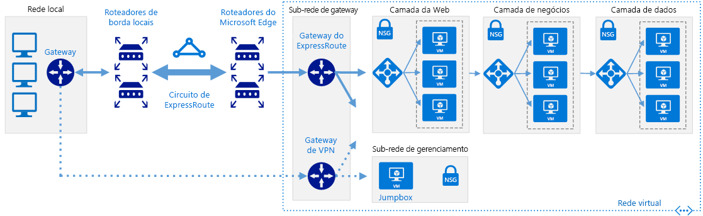

# <a name="connect-an-on-premises-network-to-azure-using-expressroute-with-vpn-failover"></a>Conectar uma rede local ao Azure usando o ExpressRoute com failover de VPN

Essa arquitetura de referência mostra como conectar uma rede local a uma VNet (rede virtual) do Azure usando o ExpressRoute, com uma VPN (rede virtual privada) site a site como uma conexão de failover. O tráfego flui entre a rede local e a rede virtual do Azure por meio de uma conexão do ExpressRoute. Se houver uma perda de conectividade no circuito do ExpressRoute, o tráfego será roteado por um túnel VPN IPsec. [**Implantar esta solução**](#deploy-the-solution).

Observe que, se o circuito do ExpressRoute não estiver disponível, a rota VPN administrará apenas conexões de emparelhamento privadas. Conexões de emparelhamento público e da Microsoft passarão pela Internet.



*Baixe um [Arquivo Visio][visio-download] dessa arquitetura.*

## <a name="architecture"></a>Arquitetura

A arquitetura consiste nos componentes a seguir.

- **Rede local**. Uma rede de área local privada em execução dentro de uma organização.

- **Dispositivo de VPN**. Um dispositivo ou serviço que fornece conectividade externa com a rede local. O dispositivo VPN pode ser um dispositivo de hardware ou pode ser uma solução de software, como RRAS (Serviço de Acesso Remoto e Roteamento) do Windows Server 2012. Para obter uma lista de dispositivos de VPN com suporte e informações sobre como configurar dispositivos de VPN selecionados para se conectar ao Azure, consulte [Sobre dispositivos VPN para conexões de Gateway de VPN Site a Site][vpn-appliance].

- **Circuito do ExpressRoute**. Um circuito de camada 2 ou de camada 3 fornecido pelo provedor de conectividade que une a rede local com o Azure por meio de roteadores de borda. O circuito usa a infraestrutura de hardware gerenciada pelo provedor de conectividade.

- **Gateway de rede virtual do ExpressRoute**. O gateway de rede virtual ExpressRoute permite que a VNet se conecte ao circuito ExpressRoute usado para conectividade com a rede local.

- **Gateway de rede virtual VPN**. O gateway de rede virtual VPN permite que a VNet conecte-se ao dispositivo VPN na rede local. O gateway de rede virtual VPN está configurado para aceitar solicitações da rede local apenas por meio do dispositivo VPN. Para obter mais informações, consulte [Conectar uma rede local à rede virtual do Microsoft Azure][connect-to-an-Azure-vnet].

- **Conexão VPN**. A conexão tem propriedades que especificam o tipo de conexão (IPsec) e a chave compartilhada com o dispositivo VPN local para criptografar o tráfego.

- **Rede virtual do Azure (VNet)**. Cada VNet reside em uma única região do Azure e pode hospedar várias camadas de aplicativos. As camadas de aplicativo podem ser segmentadas usando sub-redes em cada VNet.

- **Gateway de sub-rede**. Os gateways de rede virtual são mantidos na mesma sub-rede.

- **Aplicativo na nuvem**. O aplicativo hospedado no Azure. Ele pode incluir várias camadas, com várias sub-redes conectadas por meio de balanceadores de carga do Azure. Para obter mais informações sobre a infraestrutura do aplicativo, consulte [Execução de cargas de trabalho de VM do Windows][windows-vm-ra] e [Execução de cargas de trabalho de VM do Linux][linux-vm-ra].

## <a name="recommendations"></a>Recomendações

As seguintes recomendações aplicam-se à maioria dos cenários. Siga estas recomendações, a menos que você tenha um requisito específico que as substitua.

### <a name="vnet-and-gatewaysubnet"></a>VNet e GatewaySubnet

Crie o gateway de rede virtual ExpressRoute e o gateway de rede virtual VPN na mesma VNet. Isso significa que eles devem compartilhar a mesma sub-rede chamada *GatewaySubnet*.

Se a VNet já incluir uma sub-rede chamada *GatewaySubnet*, garanta que ela tenha um espaço de endereço /27 ou maior. Se a sub-rede existente for muito pequena, use o seguinte comando do PowerShell para removê-la:

```powershell
$vnet = Get-AzureRmVirtualNetworkGateway -Name <yourvnetname> -ResourceGroupName <yourresourcegroup>
Remove-AzureRmVirtualNetworkSubnetConfig -Name GatewaySubnet -VirtualNetwork $vnet
```

Se a VNet não contiver uma sub-rede denominada **GatewaySubnet**, crie uma nova usando o seguinte comando do Powershell:

```powershell
$vnet = Get-AzureRmVirtualNetworkGateway -Name <yourvnetname> -ResourceGroupName <yourresourcegroup>
Add-AzureRmVirtualNetworkSubnetConfig -Name "GatewaySubnet" -VirtualNetwork $vnet -AddressPrefix "10.200.255.224/27"
$vnet = Set-AzureRmVirtualNetwork -VirtualNetwork $vnet
```

### <a name="vpn-and-expressroute-gateways"></a>Gateways VPN e ExpressRoute

Verifique se a sua organização cumpre os [requisitos de pré-requisitos do ExpressRoute][expressroute-prereq] para se conectar ao Azure.

Se você já tiver um gateway de rede virtual VPN na sua VNet do Azure, use o seguinte comando do Powershell para removê-la:

```powershell
Remove-AzureRmVirtualNetworkGateway -Name <yourgatewayname> -ResourceGroupName <yourresourcegroup>
```

Siga as instruções em [Implementar uma arquitetura de rede híbrida com o Azure ExpressRoute][implementing-expressroute] para estabelecer a conexão do ExpressRoute.

Siga as instruções em [Implementar uma arquitetura de rede híbrida com o Azure e VPN local][implementing-vpn] para estabelecer sua conexão de gateway de rede virtual VPN.

Depois de estabelecer as conexões de gateway de rede virtual, teste o ambiente da seguinte maneira:

1. Verifique se que você pode conectar sua rede local à VNet do Azure.
2. Contate o provedor para interromper a conectividade do ExpressRoute para teste.
3. Verifique se que você ainda pode se conectar da sua rede local à VNet do Azure usando a conexão de gateway de rede virtual VPN.
4. Contate o provedor para restabelecer a conectividade do ExpressRoute.

## <a name="considerations"></a>Considerações

Para considerações sobre o ExpressRoute, consulte a orientação [Implementar uma arquitetura de rede híbrida com o Azure ExpressRoute][guidance-expressroute].

Para considerações sobre VPN site a site, consulte a orientação [Implementar uma arquitetura de rede híbrida com a VPN do Azure e local][guidance-vpn].

Para considerações gerais de segurança do Azure, consulte [Serviços em nuvem da Microsoft e segurança de rede][best-practices-security].

## <a name="deploy-the-solution"></a>Implantar a solução

**Pré-requisitos**. Você deve ter uma infraestrutura local existente já configurada com um dispositivo de rede adequado.

Para implantar a solução, execute as etapas a seguir.

<!-- markdownlint-disable MD033 -->

1. Clique no botão abaixo:<br><a href="https://portal.azure.com/#create/Microsoft.Template/uri/https%3A%2F%2Fraw.githubusercontent.com%2Fmspnp%2Freference-architectures%2Fmaster%2Fhybrid-networking%2Fexpressroute-vpn-failover%2Fazuredeploy.json" target="_blank"></a>

2. Aguarde até o link abrir no Portal do Azure e siga estas etapas:
   - O nome do **Grupo de recursos** já está definido no arquivo de parâmetros, portanto, selecione **Criar novo** e digite `ra-hybrid-vpn-er-rg` na caixa de texto.
   - Selecione a região na caixa suspensa **Local**.
   - Não edite as caixas de texto **URI da raiz do modelo** ou **URI da raiz do parâmetro**.
   - Analise os termos e condições e clique na caixa de seleção **Concordo com os termos e condições declarados acima**.
   - Clique no botão **Comprar**.

3. Aguarde até que a implantação seja concluída.

4. Clique no botão abaixo:<br><a href="https://portal.azure.com/#create/Microsoft.Template/uri/https%3A%2F%2Fraw.githubusercontent.com%2Fmspnp%2Freference-architectures%2Fmaster%2Fhybrid-networking%2Fexpressroute-vpn-failover%2Fazuredeploy-expressRouteCircuit.json" target="_blank"></a>

5. Aguarde até o link abrir no portal do Azure e siga estas etapas:
   - Selecione **Usar existente** na seção **Grupo de recursos** e digite `ra-hybrid-vpn-er-rg` na caixa de texto.
   - Selecione a região na caixa suspensa **Local**.
   - Não edite as caixas de texto **URI da raiz do modelo** ou **URI da raiz do parâmetro**.
   - Analise os termos e condições e clique na caixa de seleção **Concordo com os termos e condições declarados acima**.
   - Clique no botão **Comprar**.

<!-- markdownlint-enable MD033 -->

<!-- links -->

[windows-vm-ra]: ../virtual-machines-windows/index.md
[linux-vm-ra]: ../virtual-machines-linux/index.md
[resource-manager-overview]: /azure/azure-resource-manager/resource-group-overview
[vpn-appliance]: /azure/vpn-gateway/vpn-gateway-about-vpn-devices
[azure-vpn-gateway]: /azure/vpn-gateway/vpn-gateway-about-vpngateways
[connect-to-an-Azure-vnet]: https://technet.microsoft.com/library/dn786406.aspx
[expressroute-prereq]: /azure/expressroute/expressroute-prerequisites
[implementing-expressroute]: ./expressroute.md
[implementing-vpn]: ./vpn.md
[guidance-expressroute]: ./expressroute.md
[guidance-vpn]: ./vpn.md
[best-practices-security]: /azure/best-practices-network-security
[visio-download]: https://archcenter.blob.core.windows.net/cdn/hybrid-network-architectures.vsdx
