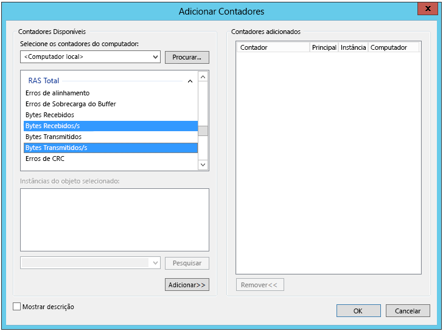

# <a name="troubleshoot-a-hybrid-vpn-connection"></a><span data-ttu-id="10d9f-103">Solucionar problemas de uma conexão VPN híbrida</span><span class="sxs-lookup"><span data-stu-id="10d9f-103">Troubleshoot a hybrid VPN connection</span></span>

<span data-ttu-id="10d9f-104">Este artigo fornece algumas dicas para solução de problemas de uma conexão de gateway VPN entre uma rede local e o Azure.</span><span class="sxs-lookup"><span data-stu-id="10d9f-104">This article gives some tips for troubleshooting a VPN gateway connection between an on-premises network and Azure.</span></span> <span data-ttu-id="10d9f-105">Para obter informações gerais de como solucionar erros comuns relacionados à VPN, consulte [Troubleshooting common VPN related error][troubleshooting-vpn-errors] (Solucionando erros comuns relacionados à VPN).</span><span class="sxs-lookup"><span data-stu-id="10d9f-105">For general information on troubleshooting common VPN-related errors, see [Troubleshooting common VPN related errors][troubleshooting-vpn-errors].</span></span>

## <a name="verify-the-vpn-appliance-is-functioning-correctly"></a><span data-ttu-id="10d9f-106">Verifique se o dispositivo de VPN está funcionando corretamente</span><span class="sxs-lookup"><span data-stu-id="10d9f-106">Verify the VPN appliance is functioning correctly</span></span>

<span data-ttu-id="10d9f-107">As recomendações a seguir são úteis para determinar se o dispositivo de VPN local está funcionando corretamente.</span><span class="sxs-lookup"><span data-stu-id="10d9f-107">The following recommendations are useful for determining if your on-premises VPN appliance is functioning correctly.</span></span>

<span data-ttu-id="10d9f-108">**Verifique se há erros ou falhas em todos os arquivos de log gerados pelo dispositivo de VPN.**</span><span class="sxs-lookup"><span data-stu-id="10d9f-108">**Check any log files generated by the VPN appliance for errors or failures.**</span></span> <span data-ttu-id="10d9f-109">Isso ajudará a determinar se o dispositivo de VPN está funcionando corretamente.</span><span class="sxs-lookup"><span data-stu-id="10d9f-109">This will help you determine if the VPN appliance is functioning correctly.</span></span> <span data-ttu-id="10d9f-110">O local dessas informações variam de acordo com o dispositivo.</span><span class="sxs-lookup"><span data-stu-id="10d9f-110">The location of this information will vary according to your appliance.</span></span> <span data-ttu-id="10d9f-111">Por exemplo, se você estiver usando o RRAS no Windows Server 2012, será possível usar o seguinte comando do PowerShell para exibir informações de evento de erro para o serviço RRAS:</span><span class="sxs-lookup"><span data-stu-id="10d9f-111">For example, if you are using RRAS on Windows Server 2012, you can use the following PowerShell command to display error event information for the RRAS service:</span></span>

```PowerShell
Get-EventLog -LogName System -EntryType Error -Source RemoteAccess | Format-List -Property *
```

<span data-ttu-id="10d9f-112">A propriedade *Mensagem* de cada entrada fornece uma descrição do erro.</span><span class="sxs-lookup"><span data-stu-id="10d9f-112">The *Message* property of each entry provides a description of the error.</span></span> <span data-ttu-id="10d9f-113">Alguns exemplos comuns são:</span><span class="sxs-lookup"><span data-stu-id="10d9f-113">Some common examples are:</span></span>

- <span data-ttu-id="10d9f-114">Incapacidade de se conectar, possivelmente devido a um endereço IP incorreto especificado para o gateway de VPN do Azure na configuração do adaptador de rede RRAS VPN.</span><span class="sxs-lookup"><span data-stu-id="10d9f-114">Inability to connect, possibly due to an incorrect IP address specified for the Azure VPN gateway in the RRAS VPN network interface configuration.</span></span>

  ```console
  EventID            : 20111
  MachineName        : on-prem-vm
  Data               : {41, 3, 0, 0}
  Index              : 14231
  Category           : (0)
  CategoryNumber     : 0
  EntryType          : Error
  Message            : RoutingDomainID- {00000000-0000-0000-0000-000000000000}: A demand dial connection to the remote
                          interface AzureGateway on port VPN2-4 was successfully initiated but failed to complete
                          successfully because of the  following error: The network connection between your computer and
                          the VPN server could not be established because the remote server is not responding. This could
                          be because one of the network devices (for example, firewalls, NAT, routers, and so on) between your computer
                          and the remote server is not configured to allow VPN connections. Please contact your
                          Administrator or your service provider to determine which device may be causing the problem.
  Source             : RemoteAccess
  ReplacementStrings : {{00000000-0000-0000-0000-000000000000}, AzureGateway, VPN2-4, The network connection between
                          your computer and the VPN server could not be established because the remote server is not
                          responding. This could be because one of the network devices (for example, firewalls, NAT, routers, and so on)
                          between your computer and the remote server is not configured to allow VPN connections. Please
                          contact your Administrator or your service provider to determine which device may be causing the
                          problem.}
  InstanceId         : 20111
  TimeGenerated      : 3/18/2016 1:26:02 PM
  TimeWritten        : 3/18/2016 1:26:02 PM
  UserName           :
  Site               :
  Container          :
  ```

- <span data-ttu-id="10d9f-115">A chave compartilhada incorreta especificada na configuração do adaptador de rede RRAS VPN.</span><span class="sxs-lookup"><span data-stu-id="10d9f-115">The wrong shared key being specified in the RRAS VPN network interface configuration.</span></span>

  ```console
  EventID            : 20111
  MachineName        : on-prem-vm
  Data               : {233, 53, 0, 0}
  Index              : 14245
  Category           : (0)
  CategoryNumber     : 0
  EntryType          : Error
  Message            : RoutingDomainID- {00000000-0000-0000-0000-000000000000}: A demand dial connection to the remote
                          interface AzureGateway on port VPN2-4 was successfully initiated but failed to complete
                          successfully because of the  following error: Internet key exchange (IKE) authentication credentials are unacceptable.

  Source             : RemoteAccess
  ReplacementStrings : {{00000000-0000-0000-0000-000000000000}, AzureGateway, VPN2-4, IKE authentication credentials are
                          unacceptable.
                          }
  InstanceId         : 20111
  TimeGenerated      : 3/18/2016 1:34:22 PM
  TimeWritten        : 3/18/2016 1:34:22 PM
  UserName           :
  Site               :
  Container          :
  ```

<span data-ttu-id="10d9f-116">Você também pode obter informações de log de eventos sobre tentativas de conexão por meio do serviço RRAS usando o seguinte comando do PowerShell:</span><span class="sxs-lookup"><span data-stu-id="10d9f-116">You can also obtain event log information about attempts to connect through the RRAS service using the following PowerShell command:</span></span>

```powershell
Get-EventLog -LogName Application -Source RasClient | Format-List -Property *
```

<span data-ttu-id="10d9f-117">Em caso de falha de conexão, esse log conterá erros semelhantes ao seguinte:</span><span class="sxs-lookup"><span data-stu-id="10d9f-117">In the event of a failure to connect, this log will contain errors that look similar to the following:</span></span>

```console
EventID            : 20227
MachineName        : on-prem-vm
Data               : {}
Index              : 4203
Category           : (0)
CategoryNumber     : 0
EntryType          : Error
Message            : CoId={B4000371-A67F-452F-AA4C-3125AA9CFC78}: The user SYSTEM dialed a connection named
                        AzureGateway that has failed. The error code returned on failure is 809.
Source             : RasClient
ReplacementStrings : {{B4000371-A67F-452F-AA4C-3125AA9CFC78}, SYSTEM, AzureGateway, 809}
InstanceId         : 20227
TimeGenerated      : 3/18/2016 1:29:21 PM
TimeWritten        : 3/18/2016 1:29:21 PM
UserName           :
Site               :
Container          :
```

## <a name="verify-connectivity"></a><span data-ttu-id="10d9f-118">Verificar conectividade</span><span class="sxs-lookup"><span data-stu-id="10d9f-118">Verify connectivity</span></span>

<span data-ttu-id="10d9f-119">**Verifique a conectividade e o roteamento no Gateway de VPN.**</span><span class="sxs-lookup"><span data-stu-id="10d9f-119">**Verify connectivity and routing across the VPN gateway.**</span></span> <span data-ttu-id="10d9f-120">O dispositivo de VPN pode não estar roteando o tráfego corretamento pelo Gateway de VPN do Azure.</span><span class="sxs-lookup"><span data-stu-id="10d9f-120">The VPN appliance may not be correctly routing traffic through the Azure VPN Gateway.</span></span> <span data-ttu-id="10d9f-121">Use uma ferramenta como o [PsPing][psping] para verificar a conectividade e o roteamento no Gateway de VPN.</span><span class="sxs-lookup"><span data-stu-id="10d9f-121">Use a tool such as [PsPing][psping] to verify connectivity and routing across the VPN gateway.</span></span> <span data-ttu-id="10d9f-122">Por exemplo, para testar a conectividade de um computador local com um servidor Web localizado na VNet, execute o seguinte comando (substituindo `<<web-server-address>>` pelo endereço do servidor Web):</span><span class="sxs-lookup"><span data-stu-id="10d9f-122">For example, to test connectivity from an on-premises machine to a web server located on the VNet, run the following command (replacing `<<web-server-address>>` with the address of the web server):</span></span>

```console
PsPing -t <<web-server-address>>:80
```

<span data-ttu-id="10d9f-123">Se o computador local puder rotear o tráfego para o servidor Web, será exibida uma saída semelhante à seguinte:</span><span class="sxs-lookup"><span data-stu-id="10d9f-123">If the on-premises machine can route traffic to the web server, you should see output similar to the following:</span></span>

```console
D:\PSTools>psping -t 10.20.0.5:80

PsPing v2.01 - PsPing - ping, latency, bandwidth measurement utility
Copyright (C) 2012-2014 Mark Russinovich
Sysinternals - www.sysinternals.com

TCP connect to 10.20.0.5:80:
Infinite iterations (warmup 1) connecting test:
Connecting to 10.20.0.5:80 (warmup): 6.21ms
Connecting to 10.20.0.5:80: 3.79ms
Connecting to 10.20.0.5:80: 3.44ms
Connecting to 10.20.0.5:80: 4.81ms

    Sent = 3, Received = 3, Lost = 0 (0% loss),
    Minimum = 3.44ms, Maximum = 4.81ms, Average = 4.01ms
```

<span data-ttu-id="10d9f-124">Se o computador local não puder se comunicar com o destino especificado, serão exibidas mensagens assim:</span><span class="sxs-lookup"><span data-stu-id="10d9f-124">If the on-premises machine cannot communicate with the specified destination, you will see messages like this:</span></span>

```console
D:\PSTools>psping -t 10.20.1.6:80

PsPing v2.01 - PsPing - ping, latency, bandwidth measurement utility
Copyright (C) 2012-2014 Mark Russinovich
Sysinternals - www.sysinternals.com

TCP connect to 10.20.1.6:80:
Infinite iterations (warmup 1) connecting test:
Connecting to 10.20.1.6:80 (warmup): This operation returned because the timeout period expired.
Connecting to 10.20.1.6:80: This operation returned because the timeout period expired.
Connecting to 10.20.1.6:80: This operation returned because the timeout period expired.
Connecting to 10.20.1.6:80: This operation returned because the timeout period expired.
Connecting to 10.20.1.6:80:
    Sent = 3, Received = 0, Lost = 3 (100% loss),
    Minimum = 0.00ms, Maximum = 0.00ms, Average = 0.00ms
```

<span data-ttu-id="10d9f-125">**Verifique se o firewall local permite a passagem do tráfego da VPN e se as portas corretas estão abertas.**</span><span class="sxs-lookup"><span data-stu-id="10d9f-125">**Verify that the on-premises firewall allows VPN traffic to pass and that the correct ports are opened.**</span></span>

<span data-ttu-id="10d9f-126">**Verifique se o dispositivo de VPN local usa um método de criptografia compatível com o Gateway de VPN do Azure.**</span><span class="sxs-lookup"><span data-stu-id="10d9f-126">**Verify that the on-premises VPN appliance uses an encryption method that is compatible with the Azure VPN gateway.**</span></span> <span data-ttu-id="10d9f-127">Para roteamento baseado em políticas, o Gateway de VPN do Azure dá suporte aos algoritmos de criptografia 3DES, AES256 e AES128.</span><span class="sxs-lookup"><span data-stu-id="10d9f-127">For policy-based routing, the Azure VPN gateway supports the AES256, AES128, and 3DES encryption algorithms.</span></span> <span data-ttu-id="10d9f-128">Os gateways baseados em rota dão suporte para AES256 e 3DES.</span><span class="sxs-lookup"><span data-stu-id="10d9f-128">Route-based gateways support AES256 and 3DES.</span></span> <span data-ttu-id="10d9f-129">Para saber mais, consulte [Sobre dispositivos VPN e os parâmetros IPsec/IKE para conexões do Gateway de VPN Site a Site][vpn-appliance].</span><span class="sxs-lookup"><span data-stu-id="10d9f-129">For more information, see [About VPN devices and IPsec/IKE parameters for Site-to-Site VPN Gateway connections][vpn-appliance].</span></span>

## <a name="check-for-problems-with-the-azure-vpn-gateway"></a><span data-ttu-id="10d9f-130">Verifique se há problemas com o gateway de VPN do Azure</span><span class="sxs-lookup"><span data-stu-id="10d9f-130">Check for problems with the Azure VPN gateway</span></span>

<span data-ttu-id="10d9f-131">As recomendações a seguir são úteis para determinar se há algum problema com o Gateway de VPN do Azure:</span><span class="sxs-lookup"><span data-stu-id="10d9f-131">The following recommendations are useful for determining if there is a problem with the Azure VPN gateway:</span></span>

<span data-ttu-id="10d9f-132">**Examine os logs de diagnóstico do gateway de VPN do Azure para encontrar possíveis problemas.**</span><span class="sxs-lookup"><span data-stu-id="10d9f-132">**Examine Azure VPN gateway diagnostic logs for potential issues.**</span></span> <span data-ttu-id="10d9f-133">Confira [Passo a passo: Capturar logs de diagnóstico do gateway de rede virtual do Azure Resource Manager][gateway-diagnostic-logs].</span><span class="sxs-lookup"><span data-stu-id="10d9f-133">See [Step-by-Step: Capturing Azure Resource Manager VNET Gateway Diagnostic Logs][gateway-diagnostic-logs].</span></span>

<span data-ttu-id="10d9f-134">**Verifique se o dispositivo de VPN local e o Gateway de VPN do Azure estão configurados com a mesma chave de autenticação compartilhada.**</span><span class="sxs-lookup"><span data-stu-id="10d9f-134">**Verify that the Azure VPN gateway and on-premises VPN appliance are configured with the same shared authentication key.**</span></span> <span data-ttu-id="10d9f-135">Você pode exibir a chave compartilhada armazenada pelo Gateway de VPN do Azure usando o seguinte comando da CLI do Azure:</span><span class="sxs-lookup"><span data-stu-id="10d9f-135">You can view the shared key stored by the Azure VPN gateway using the following Azure CLI command:</span></span>

```azurecli
azure network vpn-connection shared-key show <<resource-group>> <<vpn-connection-name>>
```

<span data-ttu-id="10d9f-136">Use o comando apropriado para seu dispositivo de VPN local para mostrar a chave compartilhada configurada para esse dispositivo.</span><span class="sxs-lookup"><span data-stu-id="10d9f-136">Use the command appropriate for your on-premises VPN appliance to show the shared key configured for that appliance.</span></span>

<span data-ttu-id="10d9f-137">Verifique se a sub-rede *GatewaySubnet* que mantém o Gateway de VPN do Azure não está associada a um NSG.</span><span class="sxs-lookup"><span data-stu-id="10d9f-137">Verify that the *GatewaySubnet* subnet holding the Azure VPN gateway is not associated with an NSG.</span></span>

<span data-ttu-id="10d9f-138">Você pode exibir os detalhes da sub-rede usando o seguinte comando da CLI do Azure:</span><span class="sxs-lookup"><span data-stu-id="10d9f-138">You can view the subnet details using the following Azure CLI command:</span></span>

```azurecli
azure network vnet subnet show -g <<resource-group>> -e <<vnet-name>> -n GatewaySubnet
```

<span data-ttu-id="10d9f-139">Verifique se não há nenhum campo de dados denominado *ID do Grupo de Segurança de Rede*.</span><span class="sxs-lookup"><span data-stu-id="10d9f-139">Ensure there is no data field named *Network Security Group ID*.</span></span> <span data-ttu-id="10d9f-140">O exemplo a seguir mostra os resultados de uma instância da *GatewaySubnet* que tem um NSG atribuído (*VPN-Gateway-Group*).</span><span class="sxs-lookup"><span data-stu-id="10d9f-140">The following example shows the results for an instance of the *GatewaySubnet* that has an assigned NSG (*VPN-Gateway-Group*).</span></span> <span data-ttu-id="10d9f-141">Isso poderá impedir que o gateway funcione corretamente se houver regras definidas para este NSG.</span><span class="sxs-lookup"><span data-stu-id="10d9f-141">This can prevent the gateway from working correctly if there are any rules defined for this NSG.</span></span>

```console
C:\>azure network vnet subnet show -g profx-prod-rg -e profx-vnet -n GatewaySubnet
    info:    Executing command network vnet subnet show
    + Looking up virtual network "profx-vnet"
    + Looking up the subnet "GatewaySubnet"
    data:    Id                              : /subscriptions/########-####-####-####-############/resourceGroups/profx-prod-rg/providers/Microsoft.Network/virtualNetworks/profx-vnet/subnets/GatewaySubnet
    data:    Name                            : GatewaySubnet
    data:    Provisioning state              : Succeeded
    data:    Address prefix                  : 10.20.3.0/27
    data:    Network Security Group id       : /subscriptions/########-####-####-####-############/resourceGroups/profx-prod-rg/providers/Microsoft.Network/networkSecurityGroups/VPN-Gateway-Group
    info:    network vnet subnet show command OK
```

<span data-ttu-id="10d9f-142">**Verifique se as máquinas virtuais na VNet do Azure estão configuradas para permitir o tráfego proveniente de fora da VNet.**</span><span class="sxs-lookup"><span data-stu-id="10d9f-142">**Verify that the virtual machines in the Azure VNet are configured to permit traffic coming in from outside the VNet.**</span></span> <span data-ttu-id="10d9f-143">Verifique as regras do NSG associadas às sub-redes que contêm essas máquinas virtuais.</span><span class="sxs-lookup"><span data-stu-id="10d9f-143">Check any NSG rules associated with subnets containing these virtual machines.</span></span> <span data-ttu-id="10d9f-144">Você pode exibir todas as regras do NSG usando o seguinte comando da CLI do Azure:</span><span class="sxs-lookup"><span data-stu-id="10d9f-144">You can view all NSG rules using the following Azure CLI command:</span></span>

```azurecli
azure network nsg show -g <<resource-group>> -n <<nsg-name>>
```

<span data-ttu-id="10d9f-145">**Verifique se o Gateway de VPN do Azure está conectado.**</span><span class="sxs-lookup"><span data-stu-id="10d9f-145">**Verify that the Azure VPN gateway is connected.**</span></span> <span data-ttu-id="10d9f-146">Você pode usar o seguinte comando do Azure PowerShell para verificar o status atual da conexão de VPN do Azure.</span><span class="sxs-lookup"><span data-stu-id="10d9f-146">You can use the following Azure PowerShell command to check the current status of the Azure VPN connection.</span></span> <span data-ttu-id="10d9f-147">O parâmetro `<<connection-name>>` é o nome da conexão de VPN do Azure que vincula o gateway de rede virtual e o gateway local.</span><span class="sxs-lookup"><span data-stu-id="10d9f-147">The `<<connection-name>>` parameter is the name of the Azure VPN connection that links the virtual network gateway and the local gateway.</span></span>

```powershell
Get-AzureRmVirtualNetworkGatewayConnection -Name <<connection-name>> - ResourceGroupName <<resource-group>>
```

<span data-ttu-id="10d9f-148">Os snippets de código a seguir realçam a saída gerada quando o gateway está conectado (o primeiro exemplo) e desconectado (o segundo exemplo):</span><span class="sxs-lookup"><span data-stu-id="10d9f-148">The following snippets highlight the output generated if the gateway is connected (the first example), and disconnected (the second example):</span></span>

```powershell
PS C:\> Get-AzureRmVirtualNetworkGatewayConnection -Name profx-gateway-connection -ResourceGroupName profx-prod-rg

AuthorizationKey           :
VirtualNetworkGateway1     : Microsoft.Azure.Commands.Network.Models.PSVirtualNetworkGateway
VirtualNetworkGateway2     :
LocalNetworkGateway2       : Microsoft.Azure.Commands.Network.Models.PSLocalNetworkGateway
Peer                       :
ConnectionType             : IPsec
RoutingWeight              : 0
SharedKey                  : ####################################
ConnectionStatus           : Connected
EgressBytesTransferred     : 55254803
IngressBytesTransferred    : 32227221
ProvisioningState          : Succeeded
...
```

```powershell
PS C:\> Get-AzureRmVirtualNetworkGatewayConnection -Name profx-gateway-connection2 -ResourceGroupName profx-prod-rg

AuthorizationKey           :
VirtualNetworkGateway1     : Microsoft.Azure.Commands.Network.Models.PSVirtualNetworkGateway
VirtualNetworkGateway2     :
LocalNetworkGateway2       : Microsoft.Azure.Commands.Network.Models.PSLocalNetworkGateway
Peer                       :
ConnectionType             : IPsec
RoutingWeight              : 0
SharedKey                  : ####################################
ConnectionStatus           : NotConnected
EgressBytesTransferred     : 0
IngressBytesTransferred    : 0
ProvisioningState          : Succeeded
...
```

## <a name="miscellaneous-issues"></a><span data-ttu-id="10d9f-149">Problemas diversos</span><span class="sxs-lookup"><span data-stu-id="10d9f-149">Miscellaneous issues</span></span>

<span data-ttu-id="10d9f-150">As recomendações a seguir são úteis para determinar se há algum problema com a configuração da VM host, a utilização da largura de banda da rede ou o desempenho do aplicativo:</span><span class="sxs-lookup"><span data-stu-id="10d9f-150">The following recommendations are useful for determining if there is an issue with Host VM configuration, network bandwidth utilization, or application performance:</span></span>

<span data-ttu-id="10d9f-151">**Verificar a configuração do firewall.**</span><span class="sxs-lookup"><span data-stu-id="10d9f-151">**Verify firewall configuration.**</span></span> <span data-ttu-id="10d9f-152">Verifique se o firewall no sistema operacional convidado em execução nas VMs do Azure na sub-rede está configurado corretamente para permitir o tráfego permitido dos intervalos de IP locais.</span><span class="sxs-lookup"><span data-stu-id="10d9f-152">Verify that the firewall in the guest operating system running on the Azure VMs in the subnet is configured correctly to allow permitted traffic from the on-premises IP ranges.</span></span>

<span data-ttu-id="10d9f-153">**Verifique se o volume de tráfego não está próximo ao limite da largura de banda disponível para o Gateway de VPN do Azure.**</span><span class="sxs-lookup"><span data-stu-id="10d9f-153">**Verify that the volume of traffic is not close to the limit of the bandwidth available to the Azure VPN gateway.**</span></span> <span data-ttu-id="10d9f-154">A maneira de verificar isso depende do dispositivo de VPN em execução local.</span><span class="sxs-lookup"><span data-stu-id="10d9f-154">How to verify this depends on the VPN appliance running on-premises.</span></span> <span data-ttu-id="10d9f-155">Por exemplo, se você estiver usando o RRAS no Windows Server 2012, será possível usar o Monitor de Desempenho para acompanhar o volume de dados recebido e transmitido pela conexão de VPN.</span><span class="sxs-lookup"><span data-stu-id="10d9f-155">For example, if you are using RRAS on Windows Server 2012, you can use Performance Monitor to track the volume of data being received and transmitted over the VPN connection.</span></span> <span data-ttu-id="10d9f-156">Usando o objeto *RAS Total*, selecione os contadores *Bytes recebidos/s* e *Bytes transmitidos/s*:</span><span class="sxs-lookup"><span data-stu-id="10d9f-156">Using the *RAS Total* object, select the *Bytes Received/Sec* and *Bytes Transmitted/Sec* counters:</span></span>



<span data-ttu-id="10d9f-158">Compare os resultados com a largura de banda disponível para o Gateway de VPN (de 100 Mbps para SKUs do plano Básico e Standard a 1,25 Gbps para SKUs do VpnGw3):</span><span class="sxs-lookup"><span data-stu-id="10d9f-158">You should compare the results with the bandwidth available to the VPN gateway (from 100 Mbps for the Basic SKU to 1.25 Gbps for VpnGw3 SKU):</span></span>


<span data-ttu-id="10d9f-160">**Verifique se você implantou o número de VMs e os tamanhos corretos para sua carga de aplicativo.**</span><span class="sxs-lookup"><span data-stu-id="10d9f-160">**Verify that you have deployed the right number and size of VMs for your application load.**</span></span> <span data-ttu-id="10d9f-161">Determine se alguma das máquinas virtuais na VNet do Azure está com a execução lenta.</span><span class="sxs-lookup"><span data-stu-id="10d9f-161">Determine if any of the virtual machines in the Azure VNet are running slowly.</span></span> <span data-ttu-id="10d9f-162">Se sim, elas podem estar sobrecarregadas, pode haver um número muito pequeno delas para lidar com a carga ou os balanceadores de carga podem não estar configurados corretamente.</span><span class="sxs-lookup"><span data-stu-id="10d9f-162">If so, they may be overloaded, there may be too few to handle the load, or the load-balancers may not be configured correctly.</span></span> <span data-ttu-id="10d9f-163">Para determinar isso, [capture e analise as informações de diagnóstico][azure-vm-diagnostics].</span><span class="sxs-lookup"><span data-stu-id="10d9f-163">To determine this, [capture and analyze diagnostic information][azure-vm-diagnostics].</span></span> <span data-ttu-id="10d9f-164">Você pode examinar os resultados usando o portal do Azure, mas muitas ferramentas de terceiros também estão disponíveis para fornecer informações detalhadas sobre os dados de desempenho.</span><span class="sxs-lookup"><span data-stu-id="10d9f-164">You can examine the results using the Azure portal, but many third-party tools are also available that can provide detailed insights into the performance data.</span></span>

<span data-ttu-id="10d9f-165">**Verifique se que o aplicativo está fazendo um uso eficiente dos recursos de nuvem.**</span><span class="sxs-lookup"><span data-stu-id="10d9f-165">**Verify that the application is making efficient use of cloud resources.**</span></span> <span data-ttu-id="10d9f-166">Instrumente o código do aplicativo em execução em cada VM para determinar se os aplicativos estão fazendo o melhor uso possível dos recursos.</span><span class="sxs-lookup"><span data-stu-id="10d9f-166">Instrument application code running on each VM to determine whether applications are making the best use of resources.</span></span> <span data-ttu-id="10d9f-167">Você pode usar ferramentas como [Application Insights][application-insights].</span><span class="sxs-lookup"><span data-stu-id="10d9f-167">You can use tools such as [Application Insights][application-insights].</span></span>

<!-- links -->

[application-insights]: /azure/application-insights/app-insights-overview-usage
[azure-vm-diagnostics]: https://azure.microsoft.com/blog/windows-azure-virtual-machine-monitoring-with-wad-extension/
[gateway-diagnostic-logs]: https://blogs.technet.microsoft.com/keithmayer/2016/10/12/step-by-step-capturing-azure-resource-manager-arm-vnet-gateway-diagnostic-logs/
[psping]: https://technet.microsoft.com/sysinternals/jj729731.aspx
[troubleshooting-vpn-errors]: https://blogs.technet.microsoft.com/rrasblog/2009/08/12/troubleshooting-common-vpn-related-errors/
[vpn-appliance]: /azure/vpn-gateway/vpn-gateway-about-vpn-devices
