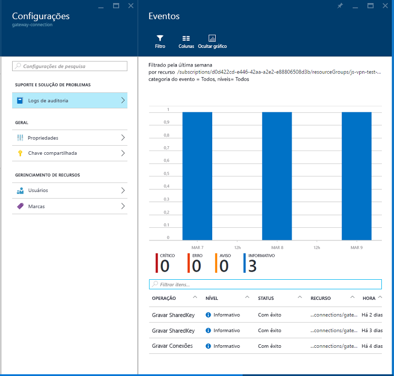

# Conectar uma rede local ao Azure usando um Gateway de VPNConnect an on-premises network to Azure using a VPN gateway

Essa arquitetura de referência mostra como estender uma rede local para o Azure, usando uma VPN (rede virtual privada) site a site.This reference architecture shows how to extend an on-premises network to Azure, using a site-to-site virtual private network (VPN). O tráfego flui entre a rede local e uma VNet (Rede Virtual) do Azure por meio de um túnel de VPN IPsec.Traffic flows between the on-premises network and an Azure Virtual Network (VNet) through an IPSec VPN tunnel. [**Implantar esta solução**](#deploy-the-solution).[**Deploy this solution**](#deploy-the-solution).

*Baixe um [Arquivo Visio][visio-download] dessa arquitetura.**Download a [Visio file][visio-download] of this architecture.*

## ArquiteturaArchitecture

A arquitetura consiste nos componentes a seguir.The architecture consists of the following components.

- **Rede local**.**On-premises network**. Uma rede de área local privada em execução dentro de uma organização.A private local-area network running within an organization.

- **Dispositivo de VPN**.**VPN appliance**. Um dispositivo ou serviço que fornece conectividade externa com a rede local.A device or service that provides external connectivity to the on-premises network. O dispositivo de VPN pode ser um dispositivo de hardware ou uma solução de software, como o RRAS (Serviço de Roteamento e Acesso Remoto) do Windows Server 2012.The VPN appliance may be a hardware device, or it can be a software solution such as the Routing and Remote Access Service (RRAS) in Windows Server 2012. Para obter uma lista de dispositivos de VPN com suporte e informações de como configurá-los para se conectar a um Gateway de VPN do Azure, consulte as instruções para o dispositivo selecionado no artigo [Sobre dispositivos VPN para conexões do Gateway de VPN site a site][vpn-appliance].For a list of supported VPN appliances and information on configuring them to connect to an Azure VPN gateway, see the instructions for the selected device in the article [About VPN devices for Site-to-Site VPN Gateway connections][vpn-appliance].

- **Rede virtual (VNet)**.**Virtual network (VNet)**. O aplicativo de nuvem e os componentes do Gateway de VPN do Azure residem na mesma [VNet][azure-virtual-network].The cloud application and the components for the Azure VPN gateway reside in the same [VNet][azure-virtual-network].

- **Gateway de VPN do Azure**.**Azure VPN gateway**. O serviço do [Gateway de VPN][azure-vpn-gateway] permite conectar a VNet à rede local por meio de um dispositivo de VPN.The [VPN gateway][azure-vpn-gateway] service enables you to connect the VNet to the on-premises network through a VPN appliance. Para obter mais informações, consulte [Conectar uma rede local a uma rede virtual do Microsoft Azure][connect-to-an-Azure-vnet].For more information, see [Connect an on-premises network to a Microsoft Azure virtual network][connect-to-an-Azure-vnet]. O Gateway de VPN inclui os seguintes elementos:The VPN gateway includes the following elements:

  - **Gateway de rede virtual**.**Virtual network gateway**. Um recurso que fornece um dispositivo de VPN virtual para a VNet.A resource that provides a virtual VPN appliance for the VNet. Ele é responsável por rotear o tráfego da rede local para a VNet.It is responsible for routing traffic from the on-premises network to the VNet.
  - **Gateway de rede local**.**Local network gateway**. Uma abstração do dispositivo de VPN local.An abstraction of the on-premises VPN appliance. O tráfego de rede do aplicativo de nuvem para a rede local é roteado por esse gateway.Network traffic from the cloud application to the on-premises network is routed through this gateway.
  - **Conexão**.**Connection**. A conexão tem propriedades que especificam o tipo de conexão (IPsec) e a chave compartilhada com o dispositivo de VPN local para criptografar o tráfego.The connection has properties that specify the connection type (IPSec) and the key shared with the on-premises VPN appliance to encrypt traffic.
  - **Gateway de sub-rede**.**Gateway subnet**. O gateway de rede virtual é mantido em sua própria sub-rede, que está sujeita a vários requisitos, descritos na seção Recomendações abaixo.The virtual network gateway is held in its own subnet, which is subject to various requirements, described in the Recommendations section below.

- **Aplicativo de nuvem**.**Cloud application**. O aplicativo hospedado no Azure.The application hosted in Azure. Ele pode incluir várias camadas, com várias sub-redes conectadas por meio de balanceadores de carga do Azure.It might include multiple tiers, with multiple subnets connected through Azure load balancers. Para obter mais informações sobre a infraestrutura do aplicativo, consulte [Execução de cargas de trabalho de VM do Windows][windows-vm-ra] e [Execução de cargas de trabalho de VM do Linux][linux-vm-ra].For more information about the application infrastructure, see [Running Windows VM workloads][windows-vm-ra] and [Running Linux VM workloads][linux-vm-ra].

- **Balanceador Interno de carga**.**Internal load balancer**. O tráfego de rede do Gateway de VPN é roteado para o aplicativo de nuvem por meio de um balanceador de carga interno.Network traffic from the VPN gateway is routed to the cloud application through an internal load balancer. O balanceador de carga está localizado na sub-rede de front-end do aplicativo.The load balancer is located in the front-end subnet of the application.

## RecomendaçõesRecommendations

As seguintes recomendações aplicam-se à maioria dos cenários.The following recommendations apply for most scenarios. Siga estas recomendações, a menos que você tenha um requisito específico que as substitua.Follow these recommendations unless you have a specific requirement that overrides them.

### VNet e sub-rede do gatewayVNet and gateway subnet

Crie uma VNet do Azure com um espaço de endereço grande o suficiente para todos os recursos necessários.Create an Azure VNet with an address space large enough for all of your required resources. Verifique se o espaço de endereço da VNet tem espaço suficiente para aumentar caso haja necessidade de adicionar mais VMs no futuro.Ensure that the VNet address space has sufficient room for growth if additional VMs are likely to be needed in the future. O espaço de endereço da VNet não deve se sobrepor à rede local.The address space of the VNet must not overlap with the on-premises network. Por exemplo, o diagrama acima usa o espaço de endereço 10.20.0.0/16 para a VNet.For example, the diagram above uses the address space 10.20.0.0/16 for the VNet.

Crie uma sub-rede denominada *GatewaySubnet*, com um intervalo de endereços de /27.Create a subnet named *GatewaySubnet*, with an address range of /27. Essa sub-rede é necessária para o gateway de rede virtual.This subnet is required by the virtual network gateway. Alocar 32 endereços para essa sub-rede ajudará a evitar que as limitações de tamanho do gateway sejam atingidas no futuro.Allocating 32 addresses to this subnet will help to prevent reaching gateway size limitations in the future. Além disso, evite colocar essa sub-rede no meio do espaço de endereço.Also, avoid placing this subnet in the middle of the address space. Uma prática recomendada é definir o espaço de endereço para a sub-rede de gateway na extremidade superior do espaço de endereço da VNet.A good practice is to set the address space for the gateway subnet at the upper end of the VNet address space. O exemplo mostrado no diagrama usa 10.20.255.224/27.The example shown in the diagram uses 10.20.255.224/27.  Aqui está um procedimento rápido para calcular o [CIDR]:Here is a quick procedure to calculate the [CIDR]:

1. Defina os bits variáveis no espaço de endereço da VNet como 1, até os bits que estão sendo usados pela sub-rede do gateway e, em seguida, configure os bits restantes como 0.Set the variable bits in the address space of the VNet to 1, up to the bits being used by the gateway subnet, then set the remaining bits to 0.
2. Converta os bits resultantes em decimais e expresse-os como um espaço de endereço com o comprimento do prefixo definido para o tamanho da sub-rede do gateway.Convert the resulting bits to decimal and express it as an address space with the prefix length set to the size of the gateway subnet.

Por exemplo, para uma VNet com um intervalo de endereços IP igual a 10.20.0.0/16, a aplicação da etapa nº 1 acima transforma-o em 10.20.0b11111111.0b11100000.For example, for a VNet with an IP address range of 10.20.0.0/16, applying step #1 above becomes 10.20.0b11111111.0b11100000.  Convertê-lo em decimal e expressá-lo como um espaço de endereço produz 10.20.255.224/27.Converting that to decimal and expressing it as an address space yields 10.20.255.224/27.

> [!WARNING]
> Não implante nenhuma VM na sub-rede do gateway.Do not deploy any VMs to the gateway subnet. Além disso, não atribua um NSG a essa sub-rede, pois faria com que o gateway parasse de funcionar.Also, do not assign an NSG to this subnet, as it will cause the gateway to stop functioning.
>

### Gateway de rede virtualVirtual network gateway

Aloque um endereço IP público para o gateway de rede virtual.Allocate a public IP address for the virtual network gateway.

Crie o gateway de rede virtual na sub-rede do gateway e atribua-o ao endereço IP público recém-alocado.Create the virtual network gateway in the gateway subnet and assign it the newly allocated public IP address. Use o tipo de gateway que melhor corresponde aos seus requisitos e que está habilitado pelo seu dispositivo de VPN:Use the gateway type that most closely matches your requirements and that is enabled by your VPN appliance:

- Crie um [gateway baseado em políticas][policy-based-routing] se você precisar controlar atentamente como as solicitações são roteadas com base em critérios de política, como prefixos de endereço.Create a [policy-based gateway][policy-based-routing] if you need to closely control how requests are routed based on policy criteria such as address prefixes. Os gateways baseados em políticas usam o roteamento estático e funcionam apenas com conexões site a site.Policy-based gateways use static routing, and only work with site-to-site connections.

- Crie um [gateway baseado em rota][route-based-routing] se você se conecta à rede local usando o RRAS, dá suporte a conexões multisites ou entre regiões ou implementa conexões de VNet para VNet (incluindo rotas que atravessam várias VNets).Create a [route-based gateway][route-based-routing] if you connect to the on-premises network using RRAS, support multi-site or cross-region connections, or implement VNet-to-VNet connections (including routes that traverse multiple VNets). Os gateways baseados em rota usam o roteamento dinâmico para o tráfego direto entre redes.Route-based gateways use dynamic routing to direct traffic between networks. Eles conseguem tolerar falhas no caminho da rede melhor do que as rotas estáticas, porque eles podem tentar rotas alternativas.They can tolerate failures in the network path better than static routes because they can try alternative routes. Os gateways baseados em rota também conseguem reduzir a sobrecarga de gerenciamento porque é possível que as rotas não precisem ser atualizadas manualmente quando os endereços de rede são alterados.Route-based gateways can also reduce the management overhead because routes might not need to be updated manually when network addresses change.

Para obter uma lista de dispositivos de VPN com suporte, consulte [Sobre dispositivos VPN para conexões do Gateway de VPN site a site][vpn-appliances].For a list of supported VPN appliances, see [About VPN devices for Site-to-Site VPN Gateway connections][vpn-appliances].

> [!NOTE]
> Depois que o gateway for criado, você não poderá mais alterar o tipo de gateway sem excluir e recriar o gateway.After the gateway has been created, you cannot change between gateway types without deleting and re-creating the gateway.
>

Selecione a SKU do Gateway de VPN do Azure que melhor corresponde aos seus requisitos de produtividade.Select the Azure VPN gateway SKU that most closely matches your throughput requirements. Para obter mais informações, confira [SKUs de gateway][azure-gateway-skus]For more information, see [Gateway SKUs][azure-gateway-skus]

> [!NOTE]
> A SKU básica não é compatível com o Azure ExpressRoute.The Basic SKU is not compatible with Azure ExpressRoute. Você poderá [alterar a SKU][changing-SKUs] depois que o gateway for criado.You can [change the SKU][changing-SKUs] after the gateway has been created.
>

Você é cobrado com base no período de tempo em que o gateway é provisionado e fica disponível.You are charged based on the amount of time that the gateway is provisioned and available. Consulte [Preços do Gateway de VPN][azure-gateway-charges].See [VPN Gateway Pricing][azure-gateway-charges].

Crie regras de roteamento para a sub-rede de gateway que direcionem o tráfego do aplicativo de entrada do gateway para o balanceador de carga interno, em vez de permitirem que as solicitações passem diretamente para as VMs de aplicativo.Create routing rules for the gateway subnet that direct incoming application traffic from the gateway to the internal load balancer, rather than allowing requests to pass directly to the application VMs.

### Conexão de rede localOn-premises network connection

Criar um gateway de rede local.Create a local network gateway. Especifique o endereço IP público do dispositivo de VPN local e o espaço de endereço da rede local.Specify the public IP address of the on-premises VPN appliance, and the address space of the on-premises network. Observe que o dispositivo de VPN local deve ter um endereço IP público que possa ser acessado pelo gateway de rede local no Gateway de VPN do Azure.Note that the on-premises VPN appliance must have a public IP address that can be accessed by the local network gateway in Azure VPN Gateway. O dispositivo VPN não pode estar localizado atrás de um dispositivo de NAT (conversão de endereços de rede).The VPN device cannot be located behind a network address translation (NAT) device.

Crie uma conexão site a site para o gateway de rede virtual e o gateway de rede local.Create a site-to-site connection for the virtual network gateway and the local network gateway. Selecione o tipo de conexão site a site (IPsec) e especifique a chave compartilhada.Select the site-to-site (IPSec) connection type, and specify the shared key. A criptografia site a site com o Gateway de VPN do Azure é baseada no protocolo IPsec, usando chaves pré-compartilhadas para autenticação.Site-to-site encryption with the Azure VPN gateway is based on the IPSec protocol, using preshared keys for authentication. Especifique a chave ao criar o Gateway de VPN do Azure.You specify the key when you create the Azure VPN gateway. Você deve configurar o dispositivo de VPN em execução local com a mesma chave.You must configure the VPN appliance running on-premises with the same key. Atualmente, não há suporte para outros mecanismos de autenticação.Other authentication mechanisms are not currently supported.

Verifique se a infraestrutura de roteamento local está configurada para encaminhar as solicitações destinadas a endereços na VNet do Azure para o dispositivo VPN.Ensure that the on-premises routing infrastructure is configured to forward requests intended for addresses in the Azure VNet to the VPN device.

Abra todas as portas exigidas pelo aplicativo de nuvem na rede local.Open any ports required by the cloud application in the on-premises network.

Teste a conexão para verificar se:Test the connection to verify that:

- O dispositivo de VPN local roteia corretamente o tráfego para o aplicativo de nuvem por meio do Gateway de VPN do Azure.The on-premises VPN appliance correctly routes traffic to the cloud application through the Azure VPN gateway.
- A VNet roteia corretamente o tráfego de volta para a rede local.The VNet correctly routes traffic back to the on-premises network.
- O tráfego proibido em ambas as direções é bloqueado corretamente.Prohibited traffic in both directions is blocked correctly.

## Considerações sobre escalabilidadeScalability considerations

Você pode obter uma escalabilidade vertical limitada passando as SKUs do Gateway de VPN do plano Básico ou Standard para a SKU de VPN de alto desempenho.You can achieve limited vertical scalability by moving from the Basic or Standard VPN Gateway SKUs to the High Performance VPN SKU.

Para VNets que esperam um grande volume de tráfego de VPN, considere distribuir as diferentes cargas de trabalho em VNets menores separadas e configurar um Gateway de VPN para cada uma delas.For VNets that expect a large volume of VPN traffic, consider distributing the different workloads into separate smaller VNets and configuring a VPN gateway for each of them.

Você pode particionar a VNet horizontal ou verticalmente.You can partition the VNet either horizontally or vertically. Para particionar horizontalmente, mova algumas instâncias de VM de cada camada para as sub-redes da nova VNet.To partition horizontally, move some VM instances from each tier into subnets of the new VNet. O resultado é que cada VNet terá as mesmas estrutura e funcionalidade.The result is that each VNet has the same structure and functionality. Para particionar verticalmente, recrie cada camada para dividir a funcionalidade em áreas lógicas diferentes (como para tratamento de pedidos, faturamento, gerenciamento de contas de cliente e assim por diante).To partition vertically, redesign each tier to divide the functionality into different logical areas (such as handling orders, invoicing, customer account management, and so on). Assim, cada área funcional poderá ser colocada em sua própria VNet.Each functional area can then be placed in its own VNet.

A replicação de um controlador de domínio do Active Directory local na VNet e a implementação de DNS na VNet podem ajudar a reduzir parte do tráfego relacionado à segurança e administrativo que flui do local para a nuvem.Replicating an on-premises Active Directory domain controller in the VNet, and implementing DNS in the VNet, can help to reduce some of the security-related and administrative traffic flowing from on-premises to the cloud. Para obter mais informações, consulte [Estendendo o AD DS (Active Directory Domain Services) para o Azure][adds-extend-domain].For more information, see [Extending Active Directory Domain Services (AD DS) to Azure][adds-extend-domain].

## Considerações sobre disponibilidadeAvailability considerations

Se você precisa garantir que a rede local permaneça disponível para o Gateway de VPN do Azure, implemente um cluster de failover para o Gateway de VPN local.If you need to ensure that the on-premises network remains available to the Azure VPN gateway, implement a failover cluster for the on-premises VPN gateway.

Se sua organização tiver vários sites locais, crie [conexões multisites][vpn-gateway-multi-site] para uma ou mais VNets do Azure.If your organization has multiple on-premises sites, create [multi-site connections][vpn-gateway-multi-site] to one or more Azure VNets. Essa abordagem requer o roteamento dinâmico (baseado em rota), portanto, verifique se o Gateway de VPN local dá suporte a esse recurso.This approach requires dynamic (route-based) routing, so make sure that the on-premises VPN gateway supports this feature.

Para obter detalhes sobre os contratos de nível de serviço, consulte [SLA para Gateway de VPN][sla-for-vpn-gateway].For details about service level agreements, see [SLA for VPN Gateway][sla-for-vpn-gateway].

## Considerações sobre capacidade de gerenciamentoManageability considerations

Monitore as informações de diagnóstico usando dispositivos de VPN locais.Monitor diagnostic information from on-premises VPN appliances. Esse processo depende dos recursos fornecidos pelo dispositivo de VPN.This process depends on the features provided by the VPN appliance. Por exemplo, se você estiver usando o roteamento e o serviço de acesso remoto no Windows Server 2012, o [log de RRAS][rras-logging].For example, if you are using the Routing and Remote Access Service on Windows Server 2012, [RRAS logging][rras-logging].

Use [diagnóstico do Gateway de VPN do Azure][gateway-diagnostic-logs] para capturar informações sobre problemas de conectividade.Use [Azure VPN gateway diagnostics][gateway-diagnostic-logs] to capture information about connectivity issues. Esses logs podem ser usados para rastrear informações como a origem e os destinos das solicitações de conexão, o protocolo usado e como a conexão foi estabelecida (ou por que a tentativa falhou).These logs can be used to track information such as the source and destinations of connection requests, which protocol was used, and how the connection was established (or why the attempt failed).

Monitore os logs operacionais do Gateway de VPN do Azure usando os logs de auditoria disponíveis no portal do Azure.Monitor the operational logs of the Azure VPN gateway using the audit logs available in the Azure portal. Logs separados estão disponíveis para o gateway de rede local, o gateway de rede do Azure e a conexão.Separate logs are available for the local network gateway, the Azure network gateway, and the connection. Essas informações podem ser usadas para acompanhar as alterações feitas no gateway e poderão ser úteis se um gateway que estava em funcionamento parar de funcionar por alguma razão.This information can be used to track any changes made to the gateway, and can be useful if a previously functioning gateway stops working for some reason.

Monitore a conectividade e acompanhe os eventos de falha de conectividade.Monitor connectivity, and track connectivity failure events. Você pode usar um pacote de monitoramento, como o [Nagios][nagios] para capturar e relatar essas informações.You can use a monitoring package such as [Nagios][nagios] to capture and report this information.

## Considerações de segurançaSecurity considerations

Gere uma chave compartilhada diferente para cada Gateway de VPN.Generate a different shared key for each VPN gateway. Use uma chave compartilhada forte para ajudar na resistência contra ataques de força bruta.Use a strong shared key to help resist brute-force attacks.

> [!NOTE]
> No momento, não é possível usar o Azure Key Vault para pré-compartilhar chaves do Gateway de VPN do Azure.Currently, you cannot use Azure Key Vault to preshare keys for the Azure VPN gateway.
>

Verifique se o dispositivo de VPN local usa um método de criptografia [compatível com o Gateway de VPN do Azure][vpn-appliance-ipsec].Ensure that the on-premises VPN appliance uses an encryption method that is [compatible with the Azure VPN gateway][vpn-appliance-ipsec]. Para roteamento baseado em políticas, o Gateway de VPN do Azure dá suporte aos algoritmos de criptografia 3DES, AES256 e AES128.For policy-based routing, the Azure VPN gateway supports the AES256, AES128, and 3DES encryption algorithms. Os gateways baseados em rota dão suporte para AES256 e 3DES.Route-based gateways support AES256 and 3DES.

Se seu dispositivo de VPN local estiver em uma DMZ (rede de perímetro) com um firewall entre a rede de perímetro e a Internet, poderá ser necessário configurar [regras de firewall adicionais][additional-firewall-rules] para permitir a conexão de VPN site a site.If your on-premises VPN appliance is on a perimeter network (DMZ) that has a firewall between the perimeter network and the Internet, you might have to configure [additional firewall rules][additional-firewall-rules] to allow the site-to-site VPN connection.

Se o aplicativo na VNet envia dados para a Internet, considere [implementar um túnel forçado][forced-tunneling] para rotear todo o tráfego associado à Internet por meio da rede local.If the application in the VNet sends data to the Internet, consider [implementing forced tunneling][forced-tunneling] to route all Internet-bound traffic through the on-premises network. Essa abordagem permite auditar as solicitações de saída feitas pelo aplicativo da infraestrutura local.This approach enables you to audit outgoing requests made by the application from the on-premises infrastructure.

> [!NOTE]
> O túnel forçado pode afetar a conectividade para serviços do Azure (o serviço de armazenamento, por exemplo) e o Gerenciador de licenças do Windows.Forced tunneling can impact connectivity to Azure services (the Storage Service, for example) and the Windows license manager.
>

## Implantar a soluçãoDeploy the solution

**Pré-requisitos**.**Prerequisites**. Você deve ter uma infraestrutura local existente já configurada com um dispositivo de rede adequado.You must have an existing on-premises infrastructure already configured with a suitable network appliance.

Para implantar a solução, execute as etapas a seguir.To deploy the solution, perform the following steps.

<!-- markdownlint-disable MD033 -->

1. Clique no botão abaixo:Click the button below: 
2. Aguarde até o link abrir no Portal do Azure e siga estas etapas:Wait for the link to open in the Azure portal, then follow these steps:
   - O nome do **Grupo de recursos** já está definido no arquivo de parâmetros, portanto, selecione **Criar novo** e digite `ra-hybrid-vpn-rg` na caixa de texto.The **Resource group** name is already defined in the parameter file, so select **Create New** and enter `ra-hybrid-vpn-rg` in the text box.
   - Selecione a região na caixa suspensa **Local**.Select the region from the **Location** drop down box.
   - Não edite as caixas de texto **URI da raiz do modelo** ou **URI da raiz do parâmetro**.Do not edit the **Template Root Uri** or the **Parameter Root Uri** text boxes.
   - Analise os termos e condições e clique na caixa de seleção **Concordo com os termos e condições declarados acima**.Review the terms and conditions, then click the **I agree to the terms and conditions stated above** checkbox.
   - Clique no botão **Comprar**.Click the **Purchase** button.
3. Aguarde até que a implantação seja concluída.Wait for the deployment to complete.

<!-- markdownlint-enable MD033 -->

Para solucionar problemas de conexão, confira [Solucionar problemas de uma conexão VPN híbrida](./troubleshoot-vpn.md).To troubleshoot the connection, see [Troubleshoot a hybrid VPN connection](./troubleshoot-vpn.md).

<!-- links -->

[adds-extend-domain]: ../identity/adds-extend-domain.md
[windows-vm-ra]: ../virtual-machines-windows/index.md
[linux-vm-ra]: ../virtual-machines-linux/index.md

[azure-cli]: /azure/virtual-machines-command-line-tools
[azure-virtual-network]: /azure/virtual-network/virtual-networks-overview
[vpn-appliance]: /azure/vpn-gateway/vpn-gateway-about-vpn-devices
[azure-vpn-gateway]: https://azure.microsoft.com/services/vpn-gateway/
[azure-gateway-charges]: https://azure.microsoft.com/pricing/details/vpn-gateway/
[azure-gateway-skus]: /azure/vpn-gateway/vpn-gateway-about-vpngateways#gwsku
[connect-to-an-Azure-vnet]: https://technet.microsoft.com/library/dn786406.aspx
[vpn-gateway-multi-site]: /azure/vpn-gateway/vpn-gateway-multi-site
[policy-based-routing]: https://en.wikipedia.org/wiki/Policy-based_routing
[route-based-routing]: https://en.wikipedia.org/wiki/Static_routing
[sla-for-vpn-gateway]: https://azure.microsoft.com/support/legal/sla/vpn-gateway/
[additional-firewall-rules]: https://technet.microsoft.com/library/dn786406.aspx#firewall
[nagios]: https://www.nagios.org/
[changing-SKUs]: https://azure.microsoft.com/blog/azure-virtual-network-gateway-improvements/
[gateway-diagnostic-logs]: https://blogs.technet.microsoft.com/keithmayer/2016/10/12/step-by-step-capturing-azure-resource-manager-arm-vnet-gateway-diagnostic-logs/
[rras-logging]: https://www.petri.com/enable-diagnostic-logging-in-windows-server-2012-r2-routing-and-remote-access
[forced-tunneling]: /azure/vpn-gateway/vpn-gateway-about-forced-tunneling
[vpn-appliances]: /azure/vpn-gateway/vpn-gateway-about-vpn-devices
[visio-download]: https://archcenter.blob.core.windows.net/cdn/hybrid-network-architectures.vsdx
[vpn-appliance-ipsec]: /azure/vpn-gateway/vpn-gateway-about-vpn-devices#ipsec-parameters
[azure-cli]: /cli/azure/install-azure-cli
[CIDR]: https://en.wikipedia.org/wiki/Classless_Inter-Domain_Routing
