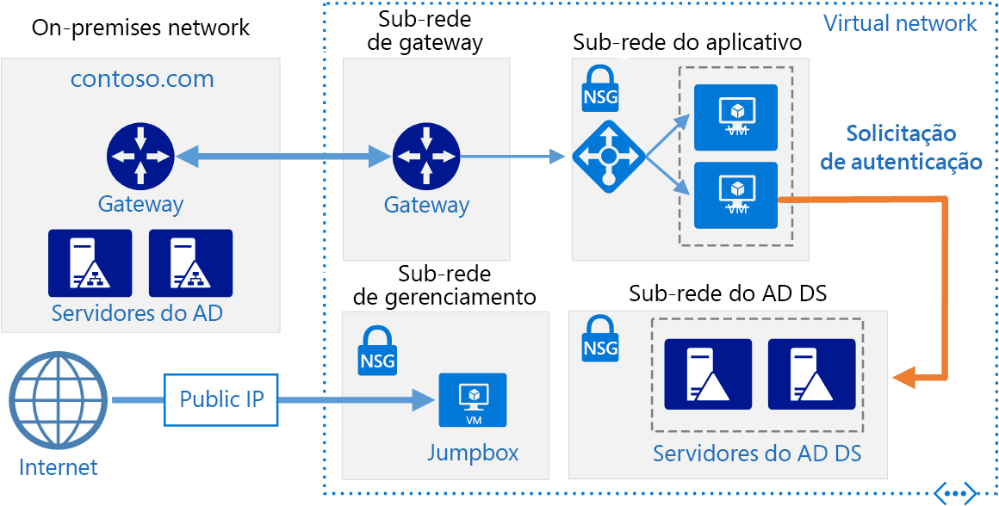

# <a name="extend-active-directory-domain-services-ad-ds-to-azure"></a>Estender o AD DS (Active Directory Domain Services) para o Azure

Essa arquitetura de referência mostra como estender seu ambiente do Active Directory para o Azure a fim de fornecer serviços de autenticação distribuídos usando o AD DS (Active Directory Domain Services). [**Implantar esta solução**](#deploy-the-solution).



*Baixe um [Arquivo Visio][visio-download] dessa arquitetura.*

O AD DS é usado para autenticar o usuário, computador, aplicativo ou outras identidades incluídas em um domínio de segurança. Ele poderá ser hospedado localmente, mas se o aplicativo estiver hospedado parcialmente localmente e parcialmente no Azure, será mais eficiente replicar essa funcionalidade no Azure. Isso pode reduzir a latência causada pelo envio de autenticação e solicitações de autorização local da nuvem de volta para o AD DS em execução local.

Essa arquitetura é geralmente usada quando a rede local e a rede virtual do Azure estão conectadas por uma conexão VPN ou de ExpressRoute. Essa arquitetura também dá suporte à replicação bidirecional, o que significa que alterações podem ser feitas localmente ou na nuvem, e ambas as fontes serão mantidas consistentes. Usos típicos dessa arquitetura incluem aplicativos híbridos em que a funcionalidade é distribuída entre o local e o Azure, e os aplicativos e serviços que realizam autenticação usando o Active Directory.

Para obter considerações adicionais, consulte [Escolher uma solução para a integração do Active Directory local ao Azure][considerations].

## <a name="architecture"></a>Arquitetura

Essa arquitetura estende aquela mostrada em [DMZ entre o Azure e a Internet][implementing-a-secure-hybrid-network-architecture-with-internet-access]. Ela tem os seguintes componentes.

- **Rede local**. A rede local inclui servidores locais do Active Directory que podem realizar a autenticação e autorização para componentes localizados localmente.
- **Servidores do Active Directory**. Esses são controladores de domínio que implementam serviços de diretório (AD DS) em execução como VMs na nuvem. Esses servidores podem fornecer autenticação dos componentes em execução na sua rede virtual do Azure.
- **Sub-rede do Active Directory**. Os servidores do AD DS são hospedados em uma sub-rede separada. As regras de NSG (grupo de segurança de rede) protegem os servidores do AD DS e fornecem um firewall em tráfego de fontes inesperadas.
- **Sincronização do Gateway do Azure e do Active Directory**. O gateway do Azure fornece uma conexão entre a rede local e a VNet do Azure. Essa pode ser uma [conexão VPN][azure-vpn-gateway] ou do [Azure ExpressRoute][azure-expressroute]. Todas as solicitações de sincronização entre os servidores do Active Directory na nuvem e local passam pelo gateway. UDRs (rotas definidas pelo usuário) lidar com o roteamento para o tráfego local passado para o Azure. Tráfego de e para os servidores do Active Directory não passa pelas NVAs (soluções de virtualização de rede) usadas nesse cenário.

Para obter mais informações sobre como configurar UDRs e as NVAs, consulte [Implementar uma arquitetura de rede híbrida segura no Azure][implementing-a-secure-hybrid-network-architecture].

## <a name="recommendations"></a>Recomendações

As seguintes recomendações aplicam-se à maioria dos cenários. Siga estas recomendações, a menos que você tenha um requisito específico que as substitua.

### <a name="vm-recommendations"></a>Recomendações de VM

Determine seus requisitos de [tamanho da VM][vm-windows-sizes] com base no volume esperado de solicitações de autenticação. Use as especificações de computadores que hospedam o AD DS local como um ponto de partida e corresponda-as aos tamanhos de VM do Azure. Uma vez implantada, monitore a utilização e a escala ou redução vertical com base na carga real das VMs. Para obter mais informações sobre o dimensionamento de controladores de domínio do AD DS, consulte [Planejamento de capacidade para Active Directory Domain Services][capacity-planning-for-adds].

Crie um disco de dados virtual separado para armazenar o banco de dados, logs e SYSVOL do Active Directory. Não armazene esses itens no mesmo disco do sistema operacional. Observe que, por padrão, os disco de dados que estão anexados a uma VM usam cache write-through. No entanto, essa forma de armazenamento em cache pode entrar em conflito com os requisitos do AD DS. Por esse motivo, defina a configuração de *Preferência de Cache do Host* no disco de dados para *Nenhum*. Para obter mais informações, confira [Diretrizes para implantar o Active Directory do Windows Server em máquinas virtuais do Azure][adds-data-disks].

Implante pelo menos duas VMs que executam o AD DS como controladores de domínio e adicione-as a um [conjunto de disponibilidade][availability-set].

### <a name="networking-recommendations"></a>Recomendações de rede

Configure o NIC (adaptador de rede) da VM para cada servidor do AD DS com um endereço IP privado estático para suporte a DNS (Serviço de Nomes de Domínio). Para obter mais informações, consulte [Como definir um endereço IP privado estático no Portal do Azure][set-a-static-ip-address].

> [!NOTE]
> Não configure a NIC de VM para qualquer AD DS com um endereço IP público. Consulte [Considerações de segurança][security-considerations] para ver mais detalhes.
>

O NSG da sub-rede do Active Directory requer regras para permitir tráfego de entrada do local. Para obter informações detalhadas sobre as portas usadas pelo AD DS, consulte [Requisitos de porta do Active Directory e do Active Directory Domain Services][ad-ds-ports]. Além disso, verifique se as tabelas UDR não roteiam o tráfego do AD DS por meio de NVAs usadas nesta arquitetura.

### <a name="active-directory-site"></a>Site do Active Directory

No AD DS, um site representa um local físico, uma rede ou uma coleção de dispositivos. Os sites do AD DS são usados para gerenciar a replicação de banco de dados do AD DS agrupando objetos do AD DS que se encontram próximos uns dos outros e são conectados por uma rede de alta velocidade. O AD DS inclui lógica para selecionar a melhor estratégia para replicar o banco de dados do AD DS entre sites.

É recomendável que você crie um site do AD DS que inclua as sub-redes definidas para seu aplicativo no Azure. Em seguida, configure um link de site entre seus sites AD DS locais e o AD DS executará automaticamente a replicação de banco de dados mais eficiente possível. Observe que essa replicação de banco de dados exige pouco além da configuração inicial.

### <a name="active-directory-operations-masters"></a>Mestres de operações do Active Directory

A função de mestres de operações pode ser atribuída aos controladores de domínio do AD DS para dar suporte à verificação de consistência entre instâncias de bancos de dados replicados do AD DS. Existem cinco funções de mestre de operações: mestre de esquema, mestre de nomeação de domínios, mestre identificador relativo, emulador mestre do controlador de domínio primário e mestre de infraestrutura. Para obter mais informações sobre essas funções, consulte [O que são Mestres de Operações?][ad-ds-operations-masters].

Recomendamos que você não atribua funções de mestres de operações para os controladores de domínio implantados no Azure.

### <a name="monitoring"></a>Monitoramento

Monitore os recursos de VMs do controlador de domínio, bem como os serviços do AD DS e crie um plano para corrigir rapidamente os problemas. Para obter mais informações, consulte [Monitoramento do Active Directory][monitoring_ad]. Você também pode instalar ferramentas como o [Microsoft Systems Center][microsoft_systems_center] no servidor de monitoramento (consulte o diagrama de arquitetura) para ajudar a executar essas tarefas.

## <a name="scalability-considerations"></a>Considerações sobre escalabilidade

O AD DS foi projetado visando a escalabilidade. Não é necessário configurar um balanceador de carga ou controlador de tráfego para direcionar solicitações para os controladores de domínio do AD DS. A única consideração de escalabilidade é configurar as VMs em execução no AD DS com o tamanho correto para os requisitos de carga da sua rede, monitorar a carga nas VMs e escalar ou reduzir verticalmente conforme necessário.

## <a name="availability-considerations"></a>Considerações sobre disponibilidade

Implante as VMs que executam o AD DS em um [conjunto de disponibilidade][availability-set]. Além disso, considere atribuir a função de [mestre de operações em espera][standby-operations-masters] a pelo menos um servidor e possivelmente mais de um, dependendo dos seus requisitos. Um mestre de operações em espera é uma cópia ativa do mestre de operações que pode ser usada no lugar do servidor mestre de operações principal durante o failover.

## <a name="manageability-considerations"></a>Considerações sobre capacidade de gerenciamento

Execute backups regulares do AD DS. Não basta copiar os arquivos VHD de controladores de domínio em vez de executar backups regulares, pois o aquivo de banco de dados do AD DS pode não estar em um estado consistente quando for copiado, impossibilitando a reinicialização do banco de dados.

Não desative uma VM do controlador de domínio usando o Portal do Azure. Em vez disso, desligue e reinicie o sistema operacional convidado. Desligar por meio do portal faz com que a VM seja desalocada, o que redefine ambos o `VM-GenerationID` e o `invocationID` repositório do Active Directory. Isso descarta o pool de RID (identificador relativo) do AD DS e marca o SYSVOL como não autoritativo e pode ser necessário reconfigurar o controlador de domínio.

## <a name="security-considerations"></a>Considerações de segurança

Os servidores do AD DS fornecem serviços de autenticação e são um alvo atraente para ataques. Para protegê-los, evite a conectividade direta com a Internet colocando os servidores de AD DS em uma sub-rede separada com um NSG agindo como um firewall. Feche todas as portas nos servidores do AD DS, exceto as necessárias para autenticação, autorização e sincronização do servidor. Para obter informações, consulte [Requisitos de porta do Active Directory e do Active Directory Domain Services][ad-ds-ports].

Considere implementar um perímetro de segurança adicional ao redor dos servidores com um par de sub-redes e NVAs, conforme descrito em [Implementar uma arquitetura de rede híbrida segura com acesso à Internet no Azure][implementing-a-secure-hybrid-network-architecture-with-internet-access].

Use a criptografia do BitLocker ou do disco do Azure para criptografar o disco que hospeda o banco de dados do AD DS.

## <a name="deploy-the-solution"></a>Implantar a solução

Uma implantação para essa arquitetura está disponível no [GitHub][github]. Observe que toda a implantação pode levar até duas horas, o que inclui a criação do gateway de VPN e a execução dos scripts que configuram o AD DS.

### <a name="prerequisites"></a>Pré-requisitos

1. Clone, crie um fork ou baixe o arquivo zip do [repositório GitHub](https://github.com/mspnp/identity-reference-architectures).

2. Instale a [CLI 2.0 do Azure](/cli/azure/install-azure-cli?view=azure-cli-latest).

3. Instale o pacote npm dos [Blocos de construção do Azure](https://github.com/mspnp/template-building-blocks/wiki/Install-Azure-Building-Blocks).

   ```bash
   npm install -g @mspnp/azure-building-blocks
   ```

4. Em um prompt de comando, prompt do bash ou prompt do PowerShell, entre na sua conta do Azure da seguinte maneira:

   ```bash
   az login
   ```

### <a name="deploy-the-simulated-on-premises-datacenter"></a>Implantar o datacenter local simulado

1. Navegue até a pasta `identity/adds-extend-domain` do repositório do GitHub.

2. Abra o arquivo `onprem.json` . Pesquise instâncias de `adminPassword` e `Password` adicione valores para as senhas.

3. Execute o seguinte comando e aguarde a conclusão da implantação:

    ```bash
    azbb -s <subscription_id> -g <resource group> -l <location> -p onprem.json --deploy
    ```

### <a name="deploy-the-azure-vnet"></a>Implantar a VNET do Azure

1. Abra o arquivo `azure.json` .  Pesquise instâncias de `adminPassword` e `Password` adicione valores para as senhas.

2. No mesmo arquivo, procure por instâncias de `sharedKey` e insira as chaves compartilhadas para a conexão VPN.

    ```json
    "sharedKey": "",
    ```

3. Execute o comando a seguir e aguarde a conclusão da implantação.

    ```bash
    azbb -s <subscription_id> -g <resource group> -l <location> -p azure.json --deploy
    ```

   Implante no mesmo grupo de recursos da VNET local.

### <a name="test-connectivity-with-the-azure-vnet"></a>Testar a conectividade com a VNET do Azure

Após a conclusão da implantação, você pode testar a conexão do ambiente simulado local para a VNET do Azure.

1. Use o portal do Azure, navegue até o grupo de recursos que você criou.

2. Encontre a VM denominada `ra-onpremise-mgmt-vm1`.

3. Clique em `Connect` para abrir uma sessão de área de trabalho remota para a VM. O nome de usuário é `contoso\testuser` e a senha é aquela especificada no arquivo de parâmetros `onprem.json`.

4. De dentro de sua sessão de área de trabalho remota, abra outra sessão de área de trabalho remota para 10.0.4.4, que é o endereço IP da VM denominada `adds-vm1`. O nome de usuário é `contoso\testuser` e a senha é aquela especificada no arquivo de parâmetros `azure.json`.

5. De dentro da sessão da área de trabalho remota para `adds-vm1`, vá para o **Gerenciador do Servidor** e clique em **Adicionar outros servidores para gerenciar.**

6. Na guia **Active Directory**, clique em **Localizar agora**. Você deve ver uma lista das VMs do AD, do AD DS e da Web.

   

## <a name="next-steps"></a>Próximas etapas

- Conheça as práticas recomendadas para [criar uma floresta de recursos do AD DS][adds-resource-forest] no Azure.
- Conheça as práticas recomendadas para [criar uma infraestrutura do Serviços de Federação do Active Directory (AD FS)][adfs] no Azure.

<!-- links -->

[adds-resource-forest]: adds-forest.md
[adfs]: adfs.md
[azure-cli-2]: /azure/install-azure-cli
[azbb]: https://github.com/mspnp/template-building-blocks/wiki/Install-Azure-Building-Blocks
[implementing-a-secure-hybrid-network-architecture]: ../dmz/secure-vnet-hybrid.md
[implementing-a-secure-hybrid-network-architecture-with-internet-access]: ../dmz/secure-vnet-dmz.md

[adds-data-disks]: https://msdn.microsoft.com/en-us/library/mt674703.aspx
[ad-ds-operations-masters]: https://technet.microsoft.com/library/cc779716(v=ws.10).aspx
[ad-ds-ports]: https://technet.microsoft.com/library/dd772723(v=ws.11).aspx
[availability-set]: /azure/virtual-machines/virtual-machines-windows-create-availability-set
[azure-expressroute]: /azure/expressroute/expressroute-introduction
[azure-vpn-gateway]: /azure/vpn-gateway/vpn-gateway-about-vpngateways
[capacity-planning-for-adds]: https://social.technet.microsoft.com/wiki/contents/articles/14355.capacity-planning-for-active-directory-domain-services.aspx
[considerations]: ./considerations.md
[GitHub]: https://github.com/mspnp/identity-reference-architectures/tree/master/adds-extend-domain
[microsoft_systems_center]: https://www.microsoft.com/download/details.aspx?id=50013
[monitoring_ad]: https://msdn.microsoft.com/library/bb727046.aspx
[security-considerations]: #security-considerations
[set-a-static-ip-address]: /azure/virtual-network/virtual-networks-static-private-ip-arm-pportal
[standby-operations-masters]: https://technet.microsoft.com/library/cc794737(v=ws.10).aspx
[visio-download]: https://archcenter.blob.core.windows.net/cdn/identity-architectures.vsdx
[vm-windows-sizes]: /azure/virtual-machines/virtual-machines-windows-sizes

[0]: ./images/adds-extend-domain.png "Arquitetura de rede híbrida segura com o Active Directory"
