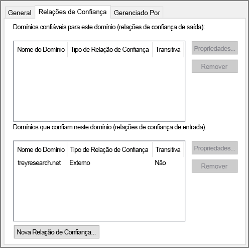

# <a name="create-an-active-directory-domain-services-ad-ds-resource-forest-in-azure"></a>Criar uma floresta de recursos do AD DS (Active Directory Domain Services) no Azure

Essa arquitetura de referência mostra como criar um domínio separado do Active Directory no Azure que é de confiança nos domínios na sua floresta local do AD. [**Implante essa solução**.](#deploy-the-solution)

[![0]][0] 

*Baixe um [Arquivo Visio][visio-download] dessa arquitetura.*

O AD DS (Active Directory Domain Services) armazena informações de identidade em uma estrutura hierárquica. O nó superior na estrutura hierárquica é conhecido como uma floresta. Uma floresta contém domínios e domínios contêm outros tipos de objetos. Essa arquitetura de referência cria uma floresta do AD DS no Azure com uma relação de confiança de saída unidirecional com um domínio local. A floresta no Azure contém um domínio que não existe localmente. Devido à relação de confiança, os logons realizados nos domínios locais pode ser confiáveis para acessar recursos em um domínio separado do Azure. 

Usos típicos para essa arquitetura incluem manter uma separação segurança para objetos e identidades mantidos na nuvem e migrar os domínios individuais do local para a nuvem. 

Para obter considerações adicionais, consulte [Escolher uma solução para a integração do Active Directory local ao Azure][considerations]. 

## <a name="architecture"></a>Arquitetura

A arquitetura tem os seguintes componentes.

* **Rede local**. A rede local contém sua própria floresta e domínios do Active Directory.
* **Servidores do Active Directory**. Esses são controladores de domínio que implementam serviços de domínio em execução como VMs na nuvem. Esses servidores hospedam uma floresta que contém um ou mais domínios, separados daqueles locais.
* **Relação de confiança unidirecional**. O exemplo no diagrama mostra uma relação de confiança unidirecional do domínio no Azure para o domínio local. Essa relação permite que os usuários locais acessem os recursos no domínio no Azure, mas não o oposto. É possível criar uma relação de confiança bidirecional se os usuários de nuvem também precisarem de acesso aos recursos locais.
* **Sub-rede do Active Directory**. Os servidores do AD DS são hospedados em uma sub-rede separada. As regras de NSG (grupo de segurança de rede) protegem os servidores do AD DS e fornecem um firewall em tráfego de fontes inesperadas.
* **Gateway do Azure**. O gateway do Azure fornece uma conexão entre a rede local e a VNet do Azure. Essa pode ser uma [conexão VPN][azure-vpn-gateway] ou do [Azure ExpressRoute][azure-expressroute]. Para obter mais informações, consulte [Implementar uma arquitetura de rede híbrida segura no Azure][implementing-a-secure-hybrid-network-architecture].

## <a name="recommendations"></a>Recomendações

Para obter recomendações específicas sobre a implementação do Active Directory no Azure, consulte os seguintes artigos:

- [Extensão do AD DS (Active Directory Domain Services) para o Azure][adds-extend-domain]. 
- [Diretrizes para implantar o Active Directory do Windows Server em máquinas virtuais do Azure][ad-azure-guidelines].

### <a name="trust"></a>Confiar

Os domínios locais estão contidos em uma floresta diferente dos domínios na nuvem. Para habilitar a autenticação de usuários locais na nuvem, os domínios no Azure precisam confiar no domínio de logon na floresta local. Da mesma forma, se a nuvem fornece um domínio de logon para usuários externos, pode ser necessário que a floresta local confie no domínio de nuvem.

Você pode estabelecer relações de confiança no nível de floresta [criando relações de confiança de floresta][creating-forest-trusts] ou no nível do domínio [criando relações de confiança externas][creating-external-trusts]. Uma confiança no nível de floresta cria uma relação entre todos os domínios nas duas florestas. Uma relação de confiança no nível de domínio externo só cria uma relação entre dois domínios especificados. Você só deve criar relações de confiança no nível de domínio externo entre domínios de florestas diferentes.

Relações de confiança podem ser unidirecionais ou bidirecionais:

* Uma relação de confiança unidirecional permite que os usuários em um domínio ou floresta (conhecido como o domínio ou a floresta de *entrada*) para acessar os recursos contidos em outro (o domínio ou a floresta de *saída*).
* Uma relação de confiança bidirecional permite que os usuários no domínio ou floresta acessem os recursos mantidos no outro.

A tabela a seguir resume as configurações de confiança para alguns cenários simples:

| Cenário | Relação de confiança local | Relação de confiança na nuvem |
| --- | --- | --- |
| Os usuários locais precisam de acesso aos recursos na nuvem, mas não vice-versa |Unidirecional de entrada |Unidirecional de saída |
| Os usuários na nuvem precisam de acesso aos recursos locais, mas não vice-versa |Unidirecional de saída |Unidirecional de entrada |
| Os usuários na nuvem e local precisam de acesso aos recursos mantidos tanto na nuvem quanto locais |Bidirecional de entrada e saída |Bidirecional de entrada e saída |

## <a name="scalability-considerations"></a>Considerações sobre escalabilidade

O Active Directory é automaticamente escalonável para controladores de domínio que fazem parte do mesmo domínio. As solicitações são distribuídas por todos os controladores em um domínio. Você pode adicionar outro controlador de domínio e ele é sincronizado automaticamente com o domínio. Não configure um balanceador de carga separado para direcionar o tráfego para os controladores no domínio. Verifique se todos os controladores de domínio têm recursos de memória e armazenamento suficientes para lidar com o banco de dados do domínio. Deixe todas as VMs do controlador de domínio com o mesmo tamanho.

## <a name="availability-considerations"></a>Considerações sobre disponibilidade

Provisione pelo menos dois controladores de domínio para cada domínio. Isso habilita a replicação automática entre os servidores. Crie um conjunto de disponibilidade para as VMs que atuam como servidores do Active Directory que tratam de cada domínio. Coloque pelo menos dois servidores neste conjunto de disponibilidade.

Além disso, considere a possibilidade de designar um ou mais servidores em cada domínio como [mestres de operações em espera][standby-operations-masters] em caso de falha de conectividade com um servidor que atua na função de FSMO (operações principais únicas flexíveis).

## <a name="manageability-considerations"></a>Considerações sobre capacidade de gerenciamento

Para obter informações sobre as considerações de gerenciamento e monitoramento, consulte [Estendendo o Active Directory para o Azure][adds-extend-domain]. 
 
Para obter informações adicionais, consulte [Monitoramento do Active Directory][monitoring_ad]. Você pode instalar ferramentas como o [Microsoft Systems Center][microsoft_systems_center] em um servidor de monitoramento na sub-rede de gerenciamento para ajudar a executar essas tarefas.

## <a name="security-considerations"></a>Considerações de segurança

As relações de confiança no nível de floresta são transitivas. Se você estabelecer uma relação de confiança no nível de floresta entre uma floresta local e uma floresta na nuvem, essa relação de confiança é estendida para outros novos domínios criados em uma dessas florestas. Se você usar domínios para fornecer separação para fins de segurança, considere criar relações de confiança somente no nível de domínio. As relações de confiança no nível de domínio são não transitivas.

Para considerações de segurança específicas do Active Directory, consulte a seção de considerações de segurança em [Estendendo o Active Directory para o Azure][adds-extend-domain].

## <a name="deploy-the-solution"></a>Implantar a solução

Uma implantação para essa arquitetura está disponível no [GitHub][github]. Observe que toda a implantação pode levar até duas horas, o que inclui a criação do gateway de VPN e a execução dos scripts que configuram o AD DS.

### <a name="prerequisites"></a>Pré-requisitos

[!INCLUDE [ref-arch-prerequisites.md](../../../includes/ref-arch-prerequisites.md)]

### <a name="deploy-the-simulated-on-premises-datacenter"></a>Implantar o datacenter local simulado

1. Navegue até a pasta `identity/adds-forest` do repositório do GitHub.

2. Abra o arquivo `onprem.json` . Pesquise instâncias de `adminPassword` e `Password` adicione valores para as senhas.

3. Execute o seguinte comando e aguarde a conclusão da implantação:

    ```bash
    azbb -s <subscription_id> -g <resource group> -l <location> -p onprem.json --deploy
    ```

### <a name="deploy-the-azure-vnet"></a>Implantar a VNET do Azure

1. Abra o arquivo `azure.json` . Pesquise instâncias de `adminPassword` e `Password` adicione valores para as senhas.

2. No mesmo arquivo, procure por instâncias de `sharedKey` e insira as chaves compartilhadas para a conexão VPN. 

    ```bash
    "sharedKey": "",
    ```

3. Execute o comando a seguir e aguarde a conclusão da implantação.

    ```bash
    azbb -s <subscription_id> -g <resource group> -l <location> -p onoprem.json --deploy
    ```

   Implante no mesmo grupo de recursos da VNET local.


### <a name="test-the-ad-trust-relation"></a>Testar a relação de confiança do AD

1. Use o portal do Azure, navegue até o grupo de recursos que você criou.

2. Você pode usar o portal do Azure para encontrar a VM denominada `ra-adt-mgmt-vm1`.

2. Clique em `Connect` para abrir uma sessão de área de trabalho remota para a VM. O nome de usuário é `contoso\testuser` e a senha é aquela especificada no arquivo de parâmetros `onprem.json`.

3. De dentro de sua sessão de área de trabalho remota, abra outra sessão de área de trabalho remota para 192.168.0.4, que é o endereço IP da VM denominada `ra-adtrust-onpremise-ad-vm1`. O nome de usuário é `contoso\testuser` e a senha é aquela especificada no arquivo de parâmetros `azure.json`.

4. De dentro da sessão da área de trabalho remota para `ra-adtrust-onpremise-ad-vm1`, vá para o **Gerenciador do Servidor** e clique em **Ferramentas** > **Domínios e Relações de Confiança do Active Directory**. 

5. No painel esquerdo, clique com botão direito do contoso.com e selecione **Propriedades**.

6. Clique na guia **Relações de Confiança**. Você deve ver treyresearch.net listado como uma relação de confiança recebida.




## <a name="next-steps"></a>Próximas etapas

* Conheça as práticas recomendadas para [estender seu domínio do AD DS local para o Azure][adds-extend-domain]
* Conheça as práticas recomendadas para [criar uma infraestrutura do AD FS][adfs] no Azure.

<!-- links -->
[adds-extend-domain]: adds-extend-domain.md
[adfs]: adfs.md
[azure-cli-2]: /azure/install-azure-cli
[azbb]: https://github.com/mspnp/template-building-blocks/wiki/Install-Azure-Building-Blocks

[implementing-a-secure-hybrid-network-architecture]: ../dmz/secure-vnet-hybrid.md
[implementing-a-secure-hybrid-network-architecture-with-internet-access]: ../dmz/secure-vnet-dmz.md

[running-VMs-for-an-N-tier-architecture-on-Azure]: ../virtual-machines-windows/n-tier.md

[ad-azure-guidelines]: https://msdn.microsoft.com/library/azure/jj156090.aspx
[azure-expressroute]: https://azure.microsoft.com/documentation/articles/expressroute-introduction/
[azure-vpn-gateway]: https://azure.microsoft.com/documentation/articles/vpn-gateway-about-vpngateways/
[considerations]: ./considerations.md
[creating-external-trusts]: https://technet.microsoft.com/library/cc816837(v=ws.10).aspx
[creating-forest-trusts]: https://technet.microsoft.com/library/cc816810(v=ws.10).aspx
[github]: https://github.com/mspnp/identity-reference-architectures/tree/master/adds-forest
[incoming-trust]: https://raw.githubusercontent.com/mspnp/identity-reference-architectures/master/adds-forest/extensions/incoming-trust.ps1
[microsoft_systems_center]: https://microsoft.com/cloud-platform/system-center
[monitoring_ad]: https://msdn.microsoft.com/library/bb727046.aspx
[resource-manager-overview]: /azure/azure-resource-manager/resource-group-overview
[solution-script]: https://raw.githubusercontent.com/mspnp/identity-reference-architectures/master/adds-forest/Deploy-ReferenceArchitecture.ps1
[standby-operations-masters]: https://technet.microsoft.com/library/cc794737(v=ws.10).aspx
[outgoing-trust]: https://raw.githubusercontent.com/mspnp/identity-reference-architectures/master/adds-forest/extensions/outgoing-trust.ps1
[verify-a-trust]: https://technet.microsoft.com/library/cc753821.aspx
[visio-download]: https://archcenter.blob.core.windows.net/cdn/identity-architectures.vsdx
[0]: ./images/adds-forest.png "Proteger a arquitetura de rede híbrida com domínios separados do Active Directory"
