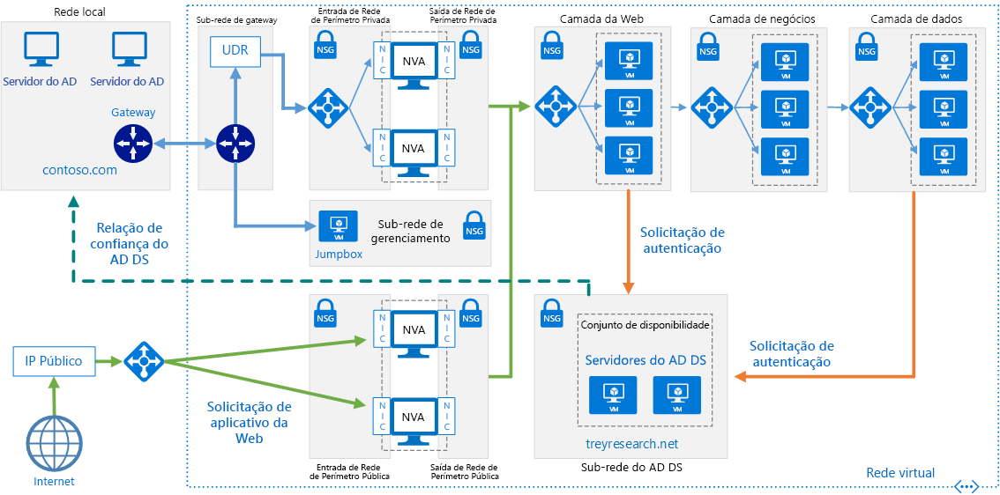

# <a name="create-an-active-directory-domain-services-ad-ds-resource-forest-in-azure"></a><span data-ttu-id="207ee-104">Criar uma floresta de recursos do AD DS (Active Directory Domain Services) no Azure</span><span class="sxs-lookup"><span data-stu-id="207ee-104">Create an Active Directory Domain Services (AD DS) resource forest in Azure</span></span>

<span data-ttu-id="207ee-105">Essa arquitetura de referência mostra como criar um domínio separado do Active Directory no Azure que é de confiança nos domínios na sua floresta local do AD.</span><span class="sxs-lookup"><span data-stu-id="207ee-105">This reference architecture shows how to create a separate Active Directory domain in Azure that is trusted by domains in your on-premises AD forest.</span></span> <span data-ttu-id="207ee-106">[**Implantar esta solução**](#deploy-the-solution).</span><span class="sxs-lookup"><span data-stu-id="207ee-106">[**Deploy this solution**](#deploy-the-solution).</span></span>



<span data-ttu-id="207ee-108">*Baixe um [Arquivo Visio][visio-download] dessa arquitetura.*</span><span class="sxs-lookup"><span data-stu-id="207ee-108">*Download a [Visio file][visio-download] of this architecture.*</span></span>

<span data-ttu-id="207ee-109">O AD DS (Active Directory Domain Services) armazena informações de identidade em uma estrutura hierárquica.</span><span class="sxs-lookup"><span data-stu-id="207ee-109">Active Directory Domain Services (AD DS) stores identity information in a hierarchical structure.</span></span> <span data-ttu-id="207ee-110">O nó superior na estrutura hierárquica é conhecido como uma floresta.</span><span class="sxs-lookup"><span data-stu-id="207ee-110">The top node in the hierarchical structure is known as a forest.</span></span> <span data-ttu-id="207ee-111">Uma floresta contém domínios e domínios contêm outros tipos de objetos.</span><span class="sxs-lookup"><span data-stu-id="207ee-111">A forest contains domains, and domains contain other types of objects.</span></span> <span data-ttu-id="207ee-112">Essa arquitetura de referência cria uma floresta do AD DS no Azure com uma relação de confiança de saída unidirecional com um domínio local.</span><span class="sxs-lookup"><span data-stu-id="207ee-112">This reference architecture creates an AD DS forest in Azure with a one-way outgoing trust relationship with an on-premises domain.</span></span> <span data-ttu-id="207ee-113">A floresta no Azure contém um domínio que não existe localmente.</span><span class="sxs-lookup"><span data-stu-id="207ee-113">The forest in Azure contains a domain that does not exist on-premises.</span></span> <span data-ttu-id="207ee-114">Devido à relação de confiança, os logons realizados nos domínios locais pode ser confiáveis para acessar recursos em um domínio separado do Azure.</span><span class="sxs-lookup"><span data-stu-id="207ee-114">Because of the trust relationship, logons made against on-premises domains can be trusted for access to resources in the separate Azure domain.</span></span>

<span data-ttu-id="207ee-115">Usos típicos para essa arquitetura incluem manter uma separação segurança para objetos e identidades mantidos na nuvem e migrar os domínios individuais do local para a nuvem.</span><span class="sxs-lookup"><span data-stu-id="207ee-115">Typical uses for this architecture include maintaining security separation for objects and identities held in the cloud, and migrating individual domains from on-premises to the cloud.</span></span>

<span data-ttu-id="207ee-116">Para obter considerações adicionais, consulte [Escolher uma solução para a integração do Active Directory local ao Azure][considerations].</span><span class="sxs-lookup"><span data-stu-id="207ee-116">For additional considerations, see [Choose a solution for integrating on-premises Active Directory with Azure][considerations].</span></span>

## <a name="architecture"></a><span data-ttu-id="207ee-117">Arquitetura</span><span class="sxs-lookup"><span data-stu-id="207ee-117">Architecture</span></span>

<span data-ttu-id="207ee-118">A arquitetura tem os seguintes componentes.</span><span class="sxs-lookup"><span data-stu-id="207ee-118">The architecture has the following components.</span></span>

- <span data-ttu-id="207ee-119">**Rede local**.</span><span class="sxs-lookup"><span data-stu-id="207ee-119">**On-premises network**.</span></span> <span data-ttu-id="207ee-120">A rede local contém sua própria floresta e domínios do Active Directory.</span><span class="sxs-lookup"><span data-stu-id="207ee-120">The on-premises network contains its own Active Directory forest and domains.</span></span>
- <span data-ttu-id="207ee-121">**Servidores do Active Directory**.</span><span class="sxs-lookup"><span data-stu-id="207ee-121">**Active Directory servers**.</span></span> <span data-ttu-id="207ee-122">Esses são controladores de domínio que implementam serviços de domínio em execução como VMs na nuvem.</span><span class="sxs-lookup"><span data-stu-id="207ee-122">These are domain controllers implementing domain services running as VMs in the cloud.</span></span> <span data-ttu-id="207ee-123">Esses servidores hospedam uma floresta que contém um ou mais domínios, separados daqueles locais.</span><span class="sxs-lookup"><span data-stu-id="207ee-123">These servers host a forest containing one or more domains, separate from those located on-premises.</span></span>
- <span data-ttu-id="207ee-124">**Relação de confiança unidirecional**.</span><span class="sxs-lookup"><span data-stu-id="207ee-124">**One-way trust relationship**.</span></span> <span data-ttu-id="207ee-125">O exemplo no diagrama mostra uma relação de confiança unidirecional do domínio no Azure para o domínio local.</span><span class="sxs-lookup"><span data-stu-id="207ee-125">The example in the diagram shows a one-way trust from the domain in Azure to the on-premises domain.</span></span> <span data-ttu-id="207ee-126">Essa relação permite que os usuários locais acessem os recursos no domínio no Azure, mas não o oposto.</span><span class="sxs-lookup"><span data-stu-id="207ee-126">This relationship enables on-premises users to access resources in the domain in Azure, but not the other way around.</span></span> <span data-ttu-id="207ee-127">É possível criar uma relação de confiança bidirecional se os usuários de nuvem também precisarem de acesso aos recursos locais.</span><span class="sxs-lookup"><span data-stu-id="207ee-127">It is possible to create a two-way trust if cloud users also require access to on-premises resources.</span></span>
- <span data-ttu-id="207ee-128">**Sub-rede do Active Directory**.</span><span class="sxs-lookup"><span data-stu-id="207ee-128">**Active Directory subnet**.</span></span> <span data-ttu-id="207ee-129">Os servidores do AD DS são hospedados em uma sub-rede separada.</span><span class="sxs-lookup"><span data-stu-id="207ee-129">The AD DS servers are hosted in a separate subnet.</span></span> <span data-ttu-id="207ee-130">As regras de NSG (grupo de segurança de rede) protegem os servidores do AD DS e fornecem um firewall em tráfego de fontes inesperadas.</span><span class="sxs-lookup"><span data-stu-id="207ee-130">Network security group (NSG) rules protect the AD DS servers and provide a firewall against traffic from unexpected sources.</span></span>
- <span data-ttu-id="207ee-131">**Gateway do Azure**.</span><span class="sxs-lookup"><span data-stu-id="207ee-131">**Azure gateway**.</span></span> <span data-ttu-id="207ee-132">O gateway do Azure fornece uma conexão entre a rede local e a VNet do Azure.</span><span class="sxs-lookup"><span data-stu-id="207ee-132">The Azure gateway provides a connection between the on-premises network and the Azure VNet.</span></span> <span data-ttu-id="207ee-133">Essa pode ser uma [conexão VPN][azure-vpn-gateway] ou do [Azure ExpressRoute][azure-expressroute].</span><span class="sxs-lookup"><span data-stu-id="207ee-133">This can be a [VPN connection][azure-vpn-gateway] or [Azure ExpressRoute][azure-expressroute].</span></span> <span data-ttu-id="207ee-134">Para obter mais informações, consulte [Implementar uma arquitetura de rede híbrida segura no Azure][implementing-a-secure-hybrid-network-architecture].</span><span class="sxs-lookup"><span data-stu-id="207ee-134">For more information, see [Implementing a secure hybrid network architecture in Azure][implementing-a-secure-hybrid-network-architecture].</span></span>

## <a name="recommendations"></a><span data-ttu-id="207ee-135">Recomendações</span><span class="sxs-lookup"><span data-stu-id="207ee-135">Recommendations</span></span>

<span data-ttu-id="207ee-136">Para obter recomendações específicas sobre a implementação do Active Directory no Azure, consulte os seguintes artigos:</span><span class="sxs-lookup"><span data-stu-id="207ee-136">For specific recommendations on implementing Active Directory in Azure, see the following articles:</span></span>

- <span data-ttu-id="207ee-137">[Extensão do AD DS (Active Directory Domain Services) para o Azure][adds-extend-domain].</span><span class="sxs-lookup"><span data-stu-id="207ee-137">[Extending Active Directory Domain Services (AD DS) to Azure][adds-extend-domain].</span></span>
- <span data-ttu-id="207ee-138">[Diretrizes para implantar o Active Directory do Windows Server em máquinas virtuais do Azure][ad-azure-guidelines].</span><span class="sxs-lookup"><span data-stu-id="207ee-138">[Guidelines for Deploying Windows Server Active Directory on Azure Virtual Machines][ad-azure-guidelines].</span></span>

### <a name="trust"></a><span data-ttu-id="207ee-139">Confiar</span><span class="sxs-lookup"><span data-stu-id="207ee-139">Trust</span></span>

<span data-ttu-id="207ee-140">Os domínios locais estão contidos em uma floresta diferente dos domínios na nuvem.</span><span class="sxs-lookup"><span data-stu-id="207ee-140">The on-premises domains are contained within a different forest from the domains in the cloud.</span></span> <span data-ttu-id="207ee-141">Para habilitar a autenticação de usuários locais na nuvem, os domínios no Azure precisam confiar no domínio de logon na floresta local.</span><span class="sxs-lookup"><span data-stu-id="207ee-141">To enable authentication of on-premises users in the cloud, the domains in Azure must trust the logon domain in the on-premises forest.</span></span> <span data-ttu-id="207ee-142">Da mesma forma, se a nuvem fornece um domínio de logon para usuários externos, pode ser necessário que a floresta local confie no domínio de nuvem.</span><span class="sxs-lookup"><span data-stu-id="207ee-142">Similarly, if the cloud provides a logon domain for external users, it may be necessary for the on-premises forest to trust the cloud domain.</span></span>

<span data-ttu-id="207ee-143">Você pode estabelecer relações de confiança no nível de floresta [criando relações de confiança de floresta][creating-forest-trusts] ou no nível do domínio [criando relações de confiança externas][creating-external-trusts].</span><span class="sxs-lookup"><span data-stu-id="207ee-143">You can establish trusts at the forest level by [creating forest trusts][creating-forest-trusts], or at the domain level by [creating external trusts][creating-external-trusts].</span></span> <span data-ttu-id="207ee-144">Uma confiança no nível de floresta cria uma relação entre todos os domínios nas duas florestas.</span><span class="sxs-lookup"><span data-stu-id="207ee-144">A forest level trust creates a relationship between all domains in two forests.</span></span> <span data-ttu-id="207ee-145">Uma relação de confiança no nível de domínio externo só cria uma relação entre dois domínios especificados.</span><span class="sxs-lookup"><span data-stu-id="207ee-145">An external domain level trust only creates a relationship between two specified domains.</span></span> <span data-ttu-id="207ee-146">Você só deve criar relações de confiança no nível de domínio externo entre domínios de florestas diferentes.</span><span class="sxs-lookup"><span data-stu-id="207ee-146">You should only create external domain level trusts between domains in different forests.</span></span>

<span data-ttu-id="207ee-147">Relações de confiança podem ser unidirecionais ou bidirecionais:</span><span class="sxs-lookup"><span data-stu-id="207ee-147">Trusts can be unidirectional (one-way) or bidirectional (two-way):</span></span>

- <span data-ttu-id="207ee-148">Uma relação de confiança unidirecional permite que os usuários em um domínio ou floresta (conhecido como o domínio ou a floresta de *entrada*) para acessar os recursos contidos em outro (o domínio ou a floresta de *saída*).</span><span class="sxs-lookup"><span data-stu-id="207ee-148">A one-way trust enables users in one domain or forest (known as the *incoming* domain or forest) to access the resources held in another (the *outgoing* domain or forest).</span></span>
- <span data-ttu-id="207ee-149">Uma relação de confiança bidirecional permite que os usuários no domínio ou floresta acessem os recursos mantidos no outro.</span><span class="sxs-lookup"><span data-stu-id="207ee-149">A two-way trust enables users in either domain or forest to access resources held in the other.</span></span>

<span data-ttu-id="207ee-150">A tabela a seguir resume as configurações de confiança para alguns cenários simples:</span><span class="sxs-lookup"><span data-stu-id="207ee-150">The following table summarizes trust configurations for some simple scenarios:</span></span>

| <span data-ttu-id="207ee-151">Cenário</span><span class="sxs-lookup"><span data-stu-id="207ee-151">Scenario</span></span> | <span data-ttu-id="207ee-152">Relação de confiança local</span><span class="sxs-lookup"><span data-stu-id="207ee-152">On-premises trust</span></span> | <span data-ttu-id="207ee-153">Relação de confiança na nuvem</span><span class="sxs-lookup"><span data-stu-id="207ee-153">Cloud trust</span></span> |
| --- | --- | --- |
| <span data-ttu-id="207ee-154">Os usuários locais precisam de acesso aos recursos na nuvem, mas não vice-versa</span><span class="sxs-lookup"><span data-stu-id="207ee-154">On-premises users require access to resources in the cloud, but not vice versa</span></span> |<span data-ttu-id="207ee-155">Unidirecional de entrada</span><span class="sxs-lookup"><span data-stu-id="207ee-155">One-way, incoming</span></span> |<span data-ttu-id="207ee-156">Unidirecional de saída</span><span class="sxs-lookup"><span data-stu-id="207ee-156">One-way, outgoing</span></span> |
| <span data-ttu-id="207ee-157">Os usuários na nuvem precisam de acesso aos recursos locais, mas não vice-versa</span><span class="sxs-lookup"><span data-stu-id="207ee-157">Users in the cloud require access to resources located on-premises, but not vice versa</span></span> |<span data-ttu-id="207ee-158">Unidirecional de saída</span><span class="sxs-lookup"><span data-stu-id="207ee-158">One-way, outgoing</span></span> |<span data-ttu-id="207ee-159">Unidirecional de entrada</span><span class="sxs-lookup"><span data-stu-id="207ee-159">One-way, incoming</span></span> |
| <span data-ttu-id="207ee-160">Os usuários na nuvem e local precisam de acesso aos recursos mantidos tanto na nuvem quanto locais</span><span class="sxs-lookup"><span data-stu-id="207ee-160">Users in the cloud and on-premises both requires access to resources held in the cloud and on-premises</span></span> |<span data-ttu-id="207ee-161">Bidirecional de entrada e saída</span><span class="sxs-lookup"><span data-stu-id="207ee-161">Two-way, incoming and outgoing</span></span> |<span data-ttu-id="207ee-162">Bidirecional de entrada e saída</span><span class="sxs-lookup"><span data-stu-id="207ee-162">Two-way, incoming and outgoing</span></span> |

## <a name="scalability-considerations"></a><span data-ttu-id="207ee-163">Considerações sobre escalabilidade</span><span class="sxs-lookup"><span data-stu-id="207ee-163">Scalability considerations</span></span>

<span data-ttu-id="207ee-164">O Active Directory é automaticamente escalonável para controladores de domínio que fazem parte do mesmo domínio.</span><span class="sxs-lookup"><span data-stu-id="207ee-164">Active Directory is automatically scalable for domain controllers that are part of the same domain.</span></span> <span data-ttu-id="207ee-165">As solicitações são distribuídas por todos os controladores em um domínio.</span><span class="sxs-lookup"><span data-stu-id="207ee-165">Requests are distributed across all controllers within a domain.</span></span> <span data-ttu-id="207ee-166">Você pode adicionar outro controlador de domínio e ele é sincronizado automaticamente com o domínio.</span><span class="sxs-lookup"><span data-stu-id="207ee-166">You can add another domain controller, and it synchronizes automatically with the domain.</span></span> <span data-ttu-id="207ee-167">Não configure um balanceador de carga separado para direcionar o tráfego para os controladores no domínio.</span><span class="sxs-lookup"><span data-stu-id="207ee-167">Do not configure a separate load balancer to direct traffic to controllers within the domain.</span></span> <span data-ttu-id="207ee-168">Verifique se todos os controladores de domínio têm recursos de memória e armazenamento suficientes para lidar com o banco de dados do domínio.</span><span class="sxs-lookup"><span data-stu-id="207ee-168">Ensure that all domain controllers have sufficient memory and storage resources to handle the domain database.</span></span> <span data-ttu-id="207ee-169">Deixe todas as VMs do controlador de domínio com o mesmo tamanho.</span><span class="sxs-lookup"><span data-stu-id="207ee-169">Make all domain controller VMs the same size.</span></span>

## <a name="availability-considerations"></a><span data-ttu-id="207ee-170">Considerações sobre disponibilidade</span><span class="sxs-lookup"><span data-stu-id="207ee-170">Availability considerations</span></span>

<span data-ttu-id="207ee-171">Provisione pelo menos dois controladores de domínio para cada domínio.</span><span class="sxs-lookup"><span data-stu-id="207ee-171">Provision at least two domain controllers for each domain.</span></span> <span data-ttu-id="207ee-172">Isso habilita a replicação automática entre os servidores.</span><span class="sxs-lookup"><span data-stu-id="207ee-172">This enables automatic replication between servers.</span></span> <span data-ttu-id="207ee-173">Crie um conjunto de disponibilidade para as VMs que atuam como servidores do Active Directory que tratam de cada domínio.</span><span class="sxs-lookup"><span data-stu-id="207ee-173">Create an availability set for the VMs acting as Active Directory servers handling each domain.</span></span> <span data-ttu-id="207ee-174">Coloque pelo menos dois servidores neste conjunto de disponibilidade.</span><span class="sxs-lookup"><span data-stu-id="207ee-174">Put at least two servers in this availability set.</span></span>

<span data-ttu-id="207ee-175">Além disso, considere a possibilidade de designar um ou mais servidores em cada domínio como [mestres de operações em espera][standby-operations-masters] em caso de falha de conectividade com um servidor que atua na função de FSMO (operações principais únicas flexíveis).</span><span class="sxs-lookup"><span data-stu-id="207ee-175">Also, consider designating one or more servers in each domain as [standby operations masters][standby-operations-masters] in case connectivity to a server acting as a flexible single master operation (FSMO) role fails.</span></span>

## <a name="manageability-considerations"></a><span data-ttu-id="207ee-176">Considerações sobre capacidade de gerenciamento</span><span class="sxs-lookup"><span data-stu-id="207ee-176">Manageability considerations</span></span>

<span data-ttu-id="207ee-177">Para obter informações sobre as considerações de gerenciamento e monitoramento, consulte [Estendendo o Active Directory para o Azure][adds-extend-domain].</span><span class="sxs-lookup"><span data-stu-id="207ee-177">For information about management and monitoring considerations, see [Extending Active Directory to Azure][adds-extend-domain].</span></span>

<span data-ttu-id="207ee-178">Para obter informações adicionais, consulte [Monitoramento do Active Directory][monitoring_ad].</span><span class="sxs-lookup"><span data-stu-id="207ee-178">For additional information, see [Monitoring Active Directory][monitoring_ad].</span></span> <span data-ttu-id="207ee-179">Você pode instalar ferramentas como o [Microsoft Systems Center][microsoft_systems_center] em um servidor de monitoramento na sub-rede de gerenciamento para ajudar a executar essas tarefas.</span><span class="sxs-lookup"><span data-stu-id="207ee-179">You can install tools such as [Microsoft Systems Center][microsoft_systems_center] on a monitoring server in the management subnet to help perform these tasks.</span></span>

## <a name="security-considerations"></a><span data-ttu-id="207ee-180">Considerações de segurança</span><span class="sxs-lookup"><span data-stu-id="207ee-180">Security considerations</span></span>

<span data-ttu-id="207ee-181">As relações de confiança no nível de floresta são transitivas.</span><span class="sxs-lookup"><span data-stu-id="207ee-181">Forest level trusts are transitive.</span></span> <span data-ttu-id="207ee-182">Se você estabelecer uma relação de confiança no nível de floresta entre uma floresta local e uma floresta na nuvem, essa relação de confiança é estendida para outros novos domínios criados em uma dessas florestas.</span><span class="sxs-lookup"><span data-stu-id="207ee-182">If you establish a forest level trust between an on-premises forest and a forest in the cloud, this trust is extended to other new domains created in either forest.</span></span> <span data-ttu-id="207ee-183">Se você usar domínios para fornecer separação para fins de segurança, considere criar relações de confiança somente no nível de domínio.</span><span class="sxs-lookup"><span data-stu-id="207ee-183">If you use domains to provide separation for security purposes, consider creating trusts at the domain level only.</span></span> <span data-ttu-id="207ee-184">As relações de confiança no nível de domínio são não transitivas.</span><span class="sxs-lookup"><span data-stu-id="207ee-184">Domain level trusts are non-transitive.</span></span>

<span data-ttu-id="207ee-185">Para considerações de segurança específicas do Active Directory, consulte a seção de considerações de segurança em [Estendendo o Active Directory para o Azure][adds-extend-domain].</span><span class="sxs-lookup"><span data-stu-id="207ee-185">For Active Directory-specific security considerations, see the security considerations section in [Extending Active Directory to Azure][adds-extend-domain].</span></span>

## <a name="deploy-the-solution"></a><span data-ttu-id="207ee-186">Implantar a solução</span><span class="sxs-lookup"><span data-stu-id="207ee-186">Deploy the solution</span></span>

<span data-ttu-id="207ee-187">Uma implantação para essa arquitetura está disponível no [GitHub][github].</span><span class="sxs-lookup"><span data-stu-id="207ee-187">A deployment for this architecture is available on [GitHub][github].</span></span> <span data-ttu-id="207ee-188">Observe que toda a implantação pode levar até duas horas, o que inclui a criação do gateway de VPN e a execução dos scripts que configuram o AD DS.</span><span class="sxs-lookup"><span data-stu-id="207ee-188">Note that the entire deployment can take up to two hours, which includes creating the VPN gateway and running the scripts that configure AD DS.</span></span>

### <a name="prerequisites"></a><span data-ttu-id="207ee-189">Pré-requisitos</span><span class="sxs-lookup"><span data-stu-id="207ee-189">Prerequisites</span></span>

1. <span data-ttu-id="207ee-190">Clone, crie um fork ou baixe o arquivo zip do [repositório GitHub](https://github.com/mspnp/identity-reference-architectures).</span><span class="sxs-lookup"><span data-stu-id="207ee-190">Clone, fork, or download the zip file for the [GitHub repository](https://github.com/mspnp/identity-reference-architectures).</span></span>

2. <span data-ttu-id="207ee-191">Instale a [CLI 2.0 do Azure](/cli/azure/install-azure-cli?view=azure-cli-latest).</span><span class="sxs-lookup"><span data-stu-id="207ee-191">Install [Azure CLI 2.0](/cli/azure/install-azure-cli?view=azure-cli-latest).</span></span>

3. <span data-ttu-id="207ee-192">Instale o pacote npm dos [Blocos de construção do Azure](https://github.com/mspnp/template-building-blocks/wiki/Install-Azure-Building-Blocks).</span><span class="sxs-lookup"><span data-stu-id="207ee-192">Install the [Azure building blocks](https://github.com/mspnp/template-building-blocks/wiki/Install-Azure-Building-Blocks) npm package.</span></span>

   ```bash
   npm install -g @mspnp/azure-building-blocks
   ```

4. <span data-ttu-id="207ee-193">Em um prompt de comando, prompt do bash ou prompt do PowerShell, entre na sua conta do Azure da seguinte maneira:</span><span class="sxs-lookup"><span data-stu-id="207ee-193">From a command prompt, bash prompt, or PowerShell prompt, sign into your Azure account as follows:</span></span>

   ```bash
   az login
   ```

### <a name="deploy-the-simulated-on-premises-datacenter"></a><span data-ttu-id="207ee-194">Implantar o datacenter local simulado</span><span class="sxs-lookup"><span data-stu-id="207ee-194">Deploy the simulated on-premises datacenter</span></span>

1. <span data-ttu-id="207ee-195">Navegue até a pasta `identity/adds-forest` do repositório do GitHub.</span><span class="sxs-lookup"><span data-stu-id="207ee-195">Navigate to the `identity/adds-forest` folder of the GitHub repository.</span></span>

2. <span data-ttu-id="207ee-196">Abra o arquivo `onprem.json` .</span><span class="sxs-lookup"><span data-stu-id="207ee-196">Open the `onprem.json` file.</span></span> <span data-ttu-id="207ee-197">Pesquise instâncias de `adminPassword` e `Password` adicione valores para as senhas.</span><span class="sxs-lookup"><span data-stu-id="207ee-197">Search for instances of `adminPassword` and `Password` and add values for the passwords.</span></span>

3. <span data-ttu-id="207ee-198">Execute o seguinte comando e aguarde a conclusão da implantação:</span><span class="sxs-lookup"><span data-stu-id="207ee-198">Run the following command and wait for the deployment to finish:</span></span>

    ```bash
    azbb -s <subscription_id> -g <resource group> -l <location> -p onprem.json --deploy
    ```

### <a name="deploy-the-azure-vnet"></a><span data-ttu-id="207ee-199">Implantar a VNET do Azure</span><span class="sxs-lookup"><span data-stu-id="207ee-199">Deploy the Azure VNet</span></span>

1. <span data-ttu-id="207ee-200">Abra o arquivo `azure.json` .</span><span class="sxs-lookup"><span data-stu-id="207ee-200">Open the `azure.json` file.</span></span> <span data-ttu-id="207ee-201">Pesquise instâncias de `adminPassword` e `Password` adicione valores para as senhas.</span><span class="sxs-lookup"><span data-stu-id="207ee-201">Search for instances of `adminPassword` and `Password` and add values for the passwords.</span></span>

2. <span data-ttu-id="207ee-202">No mesmo arquivo, procure por instâncias de `sharedKey` e insira as chaves compartilhadas para a conexão VPN.</span><span class="sxs-lookup"><span data-stu-id="207ee-202">In the same file, search for instances of `sharedKey` and enter shared keys for the VPN connection.</span></span>

    ```json
    "sharedKey": "",
    ```

3. <span data-ttu-id="207ee-203">Execute o comando a seguir e aguarde a conclusão da implantação.</span><span class="sxs-lookup"><span data-stu-id="207ee-203">Run the following command and wait for the deployment to finish.</span></span>

    ```bash
    azbb -s <subscription_id> -g <resource group> -l <location> -p azure.json --deploy
    ```

   <span data-ttu-id="207ee-204">Implante no mesmo grupo de recursos da VNET local.</span><span class="sxs-lookup"><span data-stu-id="207ee-204">Deploy to the same resource group as the on-premises VNet.</span></span>

### <a name="test-the-ad-trust-relation"></a><span data-ttu-id="207ee-205">Testar a relação de confiança do AD</span><span class="sxs-lookup"><span data-stu-id="207ee-205">Test the AD trust relation</span></span>

1. <span data-ttu-id="207ee-206">Use o portal do Azure, navegue até o grupo de recursos que você criou.</span><span class="sxs-lookup"><span data-stu-id="207ee-206">Use the Azure portal, navigate to the resource group that you created.</span></span>

2. <span data-ttu-id="207ee-207">Você pode usar o portal do Azure para encontrar a VM denominada `ra-adt-mgmt-vm1`.</span><span class="sxs-lookup"><span data-stu-id="207ee-207">Use the Azure portal to find the VM named `ra-adt-mgmt-vm1`.</span></span>

3. <span data-ttu-id="207ee-208">Clique em `Connect` para abrir uma sessão de área de trabalho remota para a VM.</span><span class="sxs-lookup"><span data-stu-id="207ee-208">Click `Connect` to open a remote desktop session to the VM.</span></span> <span data-ttu-id="207ee-209">O nome de usuário é `contoso\testuser` e a senha é aquela especificada no arquivo de parâmetros `onprem.json`.</span><span class="sxs-lookup"><span data-stu-id="207ee-209">The username is `contoso\testuser`, and the password is the one that you specified in the `onprem.json` parameter file.</span></span>

4. <span data-ttu-id="207ee-210">De dentro de sua sessão de área de trabalho remota, abra outra sessão de área de trabalho remota para 192.168.0.4, que é o endereço IP da VM denominada `ra-adtrust-onpremise-ad-vm1`.</span><span class="sxs-lookup"><span data-stu-id="207ee-210">From inside your remote desktop session, open another remote desktop session to 192.168.0.4, which is the IP address of the VM named `ra-adtrust-onpremise-ad-vm1`.</span></span> <span data-ttu-id="207ee-211">O nome de usuário é `contoso\testuser` e a senha é aquela especificada no arquivo de parâmetros `azure.json`.</span><span class="sxs-lookup"><span data-stu-id="207ee-211">The username is `contoso\testuser`, and the password is the one that you specified in the `azure.json` parameter file.</span></span>

5. <span data-ttu-id="207ee-212">De dentro da sessão da área de trabalho remota para `ra-adtrust-onpremise-ad-vm1`, vá para o **Gerenciador do Servidor** e clique em **Ferramentas** > **Domínios e Relações de Confiança do Active Directory**.</span><span class="sxs-lookup"><span data-stu-id="207ee-212">From inside the remote desktop session for `ra-adtrust-onpremise-ad-vm1`, go to **Server Manager** and click **Tools** > **Active Directory Domains and Trusts**.</span></span>

6. <span data-ttu-id="207ee-213">No painel esquerdo, clique com botão direito do contoso.com e selecione **Propriedades**.</span><span class="sxs-lookup"><span data-stu-id="207ee-213">In the left pane, right-click on the contoso.com and select **Properties**.</span></span>

7. <span data-ttu-id="207ee-214">Clique na guia **Relações de Confiança**. Você deve ver treyresearch.net listado como uma relação de confiança recebida.</span><span class="sxs-lookup"><span data-stu-id="207ee-214">Click the **Trusts** tab. You should see treyresearch.net listed as an incoming trust.</span></span>


## <a name="next-steps"></a><span data-ttu-id="207ee-216">Próximas etapas</span><span class="sxs-lookup"><span data-stu-id="207ee-216">Next steps</span></span>

- <span data-ttu-id="207ee-217">Conheça as práticas recomendadas para [estender seu domínio do AD DS local para o Azure][adds-extend-domain]</span><span class="sxs-lookup"><span data-stu-id="207ee-217">Learn the best practices for [extending your on-premises AD DS domain to Azure][adds-extend-domain]</span></span>
- <span data-ttu-id="207ee-218">Conheça as práticas recomendadas para [criar uma infraestrutura do AD FS][adfs] no Azure.</span><span class="sxs-lookup"><span data-stu-id="207ee-218">Learn the best practices for [creating an AD FS infrastructure][adfs] in Azure.</span></span>

<!-- links -->
[adds-extend-domain]: adds-extend-domain.md
[adfs]: adfs.md
[azure-cli-2]: /azure/install-azure-cli
[azbb]: https://github.com/mspnp/template-building-blocks/wiki/Install-Azure-Building-Blocks

[implementing-a-secure-hybrid-network-architecture]: ../dmz/secure-vnet-hybrid.md
[implementing-a-secure-hybrid-network-architecture-with-internet-access]: ../dmz/secure-vnet-dmz.md

[running-VMs-for-an-N-tier-architecture-on-Azure]: ../virtual-machines-windows/n-tier.md

[ad-azure-guidelines]: https://msdn.microsoft.com/library/azure/jj156090.aspx
[azure-expressroute]: /azure/expressroute/expressroute-introduction
[azure-vpn-gateway]: /azure/vpn-gateway/vpn-gateway-about-vpngateways
[considerations]: ./considerations.md
[creating-external-trusts]: https://technet.microsoft.com/library/cc816837(v=ws.10).aspx
[creating-forest-trusts]: https://technet.microsoft.com/library/cc816810(v=ws.10).aspx
[github]: https://github.com/mspnp/identity-reference-architectures/tree/master/adds-forest
[incoming-trust]: https://raw.githubusercontent.com/mspnp/identity-reference-architectures/master/adds-forest/extensions/incoming-trust.ps1
[microsoft_systems_center]: https://microsoft.com/cloud-platform/system-center
[monitoring_ad]: https://msdn.microsoft.com/library/bb727046.aspx
[resource-manager-overview]: /azure/azure-resource-manager/resource-group-overview
[solution-script]: https://raw.githubusercontent.com/mspnp/identity-reference-architectures/master/adds-forest/Deploy-ReferenceArchitecture.ps1
[standby-operations-masters]: https://technet.microsoft.com/library/cc794737(v=ws.10).aspx
[outgoing-trust]: https://raw.githubusercontent.com/mspnp/identity-reference-architectures/master/adds-forest/extensions/outgoing-trust.ps1
[verify-a-trust]: https://technet.microsoft.com/library/cc753821.aspx
[visio-download]: https://archcenter.blob.core.windows.net/cdn/identity-architectures.vsdx
