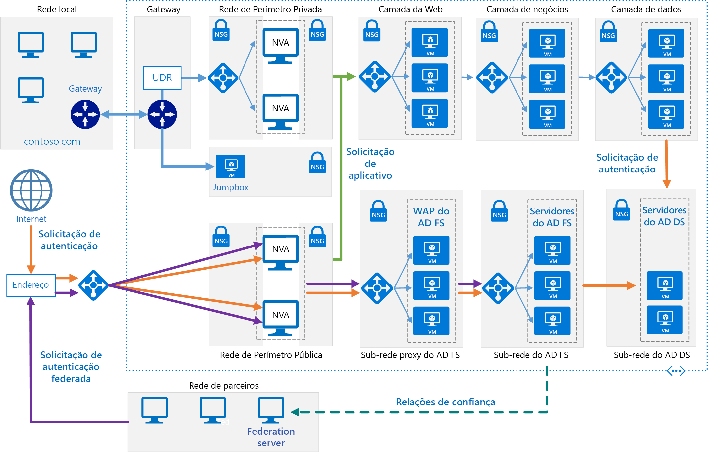

# <a name="extend-active-directory-federation-services-ad-fs-to-azure"></a><span data-ttu-id="2390d-103">Estender o Serviços de Federação do Active Directory (AD FS) para o Azure</span><span class="sxs-lookup"><span data-stu-id="2390d-103">Extend Active Directory Federation Services (AD FS) to Azure</span></span>

<span data-ttu-id="2390d-104">Essa arquitetura de referência implementa uma rede híbrida segura que estende a rede local para o Azure e usa o [Serviços de Federação do Active Directory (AD FS)][active-directory-federation-services] para executar autenticação e autorização federadas para componentes em execução no Azure.</span><span class="sxs-lookup"><span data-stu-id="2390d-104">This reference architecture implements a secure hybrid network that extends your on-premises network to Azure and uses [Active Directory Federation Services (AD FS)][active-directory-federation-services] to perform federated authentication and authorization for components running in Azure.</span></span> <span data-ttu-id="2390d-105">[**Implantar esta solução**](#deploy-the-solution).</span><span class="sxs-lookup"><span data-stu-id="2390d-105">[**Deploy this solution**](#deploy-the-solution).</span></span>



<span data-ttu-id="2390d-107">*Baixe um [Arquivo Visio][visio-download] dessa arquitetura.*</span><span class="sxs-lookup"><span data-stu-id="2390d-107">*Download a [Visio file][visio-download] of this architecture.*</span></span>

<span data-ttu-id="2390d-108">O AD FS poderá ser hospedado localmente, mas se o aplicativo for um híbrido com algumas partes implementadas no Azure, talvez seja mais eficiente replicar o AD FS na nuvem.</span><span class="sxs-lookup"><span data-stu-id="2390d-108">AD FS can be hosted on-premises, but if your application is a hybrid in which some parts are implemented in Azure, it may be more efficient to replicate AD FS in the cloud.</span></span>

<span data-ttu-id="2390d-109">O diagrama mostra os cenários a seguir:</span><span class="sxs-lookup"><span data-stu-id="2390d-109">The diagram shows the following scenarios:</span></span>

- <span data-ttu-id="2390d-110">O código do aplicativo de uma organização parceira acessa um aplicativo Web hospedado dentro de sua VNet do Azure.</span><span class="sxs-lookup"><span data-stu-id="2390d-110">Application code from a partner organization accesses a web application hosted inside your Azure VNet.</span></span>
- <span data-ttu-id="2390d-111">Um usuário externo, registrado com credenciais armazenadas no DS (Active Directory Domain Services) acessa um aplicativo Web hospedado dentro de sua VNet do Azure.</span><span class="sxs-lookup"><span data-stu-id="2390d-111">An external, registered user with credentials stored inside Active Directory Domain Services (DS) accesses a web application hosted inside your Azure VNet.</span></span>
- <span data-ttu-id="2390d-112">Um usuário conectado à sua VNet usando um dispositivo autorizado executa um aplicativo Web hospedado dentro de sua VNet do Azure.</span><span class="sxs-lookup"><span data-stu-id="2390d-112">A user connected to your VNet using an authorized device executes a web application hosted inside your Azure VNet.</span></span>

<span data-ttu-id="2390d-113">Alguns usos típicos dessa arquitetura:</span><span class="sxs-lookup"><span data-stu-id="2390d-113">Typical uses for this architecture include:</span></span>

- <span data-ttu-id="2390d-114">Aplicativos híbridos nos quais as cargas de trabalho são executadas parcialmente localmente e parcialmente no Azure.</span><span class="sxs-lookup"><span data-stu-id="2390d-114">Hybrid applications where workloads run partly on-premises and partly in Azure.</span></span>
- <span data-ttu-id="2390d-115">Soluções que usam a autorização federada para expor aplicativos Web a organizações parceiras.</span><span class="sxs-lookup"><span data-stu-id="2390d-115">Solutions that use federated authorization to expose web applications to partner organizations.</span></span>
- <span data-ttu-id="2390d-116">Sistemas que dão suporte a acesso de navegadores da Web em execução fora do firewall organizacional.</span><span class="sxs-lookup"><span data-stu-id="2390d-116">Systems that support access from web browsers running outside of the organizational firewall.</span></span>
- <span data-ttu-id="2390d-117">Sistemas que permitem que os usuários acessem aplicativos Web se conectando de dispositivos externos autorizados, como computadores remotos, notebooks e outros dispositivos móveis.</span><span class="sxs-lookup"><span data-stu-id="2390d-117">Systems that enable users to access to web applications by connecting from authorized external devices such as remote computers, notebooks, and other mobile devices.</span></span>

<span data-ttu-id="2390d-118">Essa arquitetura de referência concentra-se na *federação passiva*, na qual os servidores de federação decidem como e quando autenticar um usuário.</span><span class="sxs-lookup"><span data-stu-id="2390d-118">This reference architecture focuses on *passive federation*, in which the federation servers decide how and when to authenticate a user.</span></span> <span data-ttu-id="2390d-119">O usuário fornece informações de entrada quando o aplicativo é iniciado.</span><span class="sxs-lookup"><span data-stu-id="2390d-119">The user provides sign in information when the application is started.</span></span> <span data-ttu-id="2390d-120">Esse mecanismo geralmente é usado por navegadores da Web e envolve um protocolo que redireciona o navegador para um site em que o usuário é autenticado.</span><span class="sxs-lookup"><span data-stu-id="2390d-120">This mechanism is most commonly used by web browsers and involves a protocol that redirects the browser to a site where the user authenticates.</span></span> <span data-ttu-id="2390d-121">O AD FS também dá suporte para *federação ativa*, na qual um aplicativo assume a responsabilidade de fornecer credenciais sem interação adicional do usuário, mas esse cenário está fora do escopo dessa arquitetura.</span><span class="sxs-lookup"><span data-stu-id="2390d-121">AD FS also supports *active federation*, where an application takes on responsibility for supplying credentials without further user interaction, but that scenario is outside the scope of this architecture.</span></span>

<span data-ttu-id="2390d-122">Para obter considerações adicionais, consulte [Escolher uma solução para a integração do Active Directory local ao Azure][considerations].</span><span class="sxs-lookup"><span data-stu-id="2390d-122">For additional considerations, see [Choose a solution for integrating on-premises Active Directory with Azure][considerations].</span></span>

## <a name="architecture"></a><span data-ttu-id="2390d-123">Arquitetura</span><span class="sxs-lookup"><span data-stu-id="2390d-123">Architecture</span></span>

<span data-ttu-id="2390d-124">Essa arquitetura estende a implementação descrita em [Estendendo o AD DS (Active Directory Domain Services) para o Azure][extending-ad-to-azure].</span><span class="sxs-lookup"><span data-stu-id="2390d-124">This architecture extends the implementation described in [Extending AD DS to Azure][extending-ad-to-azure].</span></span> <span data-ttu-id="2390d-125">Ela contém os componentes a seguir.</span><span class="sxs-lookup"><span data-stu-id="2390d-125">It contains the followign components.</span></span>

- <span data-ttu-id="2390d-126">**Sub-rede do AD DS**.</span><span class="sxs-lookup"><span data-stu-id="2390d-126">**AD DS subnet**.</span></span> <span data-ttu-id="2390d-127">Os servidores do AD DS estão contidos em suas próprias sub-redes com as regras do NSG (Grupo de Segurança de Rede) atuando como um firewall.</span><span class="sxs-lookup"><span data-stu-id="2390d-127">The AD DS servers are contained in their own subnet with network security group (NSG) rules acting as a firewall.</span></span>

- <span data-ttu-id="2390d-128">**Servidores do AD DS**.</span><span class="sxs-lookup"><span data-stu-id="2390d-128">**AD DS servers**.</span></span> <span data-ttu-id="2390d-129">Controladores de domínio em execução como VMs no Azure.</span><span class="sxs-lookup"><span data-stu-id="2390d-129">Domain controllers running as VMs in Azure.</span></span> <span data-ttu-id="2390d-130">Esses servidores fornecem autenticação de identidades locais dentro do domínio.</span><span class="sxs-lookup"><span data-stu-id="2390d-130">These servers provide authentication of local identities within the domain.</span></span>

- <span data-ttu-id="2390d-131">**Sub-rede do AD FS**.</span><span class="sxs-lookup"><span data-stu-id="2390d-131">**AD FS subnet**.</span></span> <span data-ttu-id="2390d-132">Os servidores do AD FS estão localizados em suas próprias sub-redes com regras do NSG atuando como um firewall.</span><span class="sxs-lookup"><span data-stu-id="2390d-132">The AD FS servers are located within their own subnet with NSG rules acting as a firewall.</span></span>

- <span data-ttu-id="2390d-133">**Servidores do AD FS**.</span><span class="sxs-lookup"><span data-stu-id="2390d-133">**AD FS servers**.</span></span> <span data-ttu-id="2390d-134">Os servidores do AD FS fornecem autenticação e autorização federadas.</span><span class="sxs-lookup"><span data-stu-id="2390d-134">The AD FS servers provide federated authorization and authentication.</span></span> <span data-ttu-id="2390d-135">Nessa arquitetura, eles executam as seguintes tarefas:</span><span class="sxs-lookup"><span data-stu-id="2390d-135">In this architecture, they perform the following tasks:</span></span>

  - <span data-ttu-id="2390d-136">Recebimento de tokens de segurança contendo declarações feitas por um servidor de federação do parceiro em nome de um usuário do parceiro.</span><span class="sxs-lookup"><span data-stu-id="2390d-136">Receiving security tokens containing claims made by a partner federation server on behalf of a partner user.</span></span> <span data-ttu-id="2390d-137">O AD FS verifica se os tokens são válidos antes de passar as declarações para o aplicativo Web em execução no Azure para autorizar solicitações.</span><span class="sxs-lookup"><span data-stu-id="2390d-137">AD FS verifies that the tokens are valid before passing the claims to the web application running in Azure to authorize requests.</span></span>

    <span data-ttu-id="2390d-138">O aplicativo em execução no Azure é a *terceira parte confiável*.</span><span class="sxs-lookup"><span data-stu-id="2390d-138">The application running in Azure is the *relying party*.</span></span> <span data-ttu-id="2390d-139">O servidor de federação do parceiro deve emitir declarações que sejam entendidas pelo aplicativo Web.</span><span class="sxs-lookup"><span data-stu-id="2390d-139">The partner federation server must issue claims that are understood by the web application.</span></span> <span data-ttu-id="2390d-140">Os servidores de federação do parceiro são chamados de *parceiros de conta*, porque eles enviam solicitações de acesso em nome de contas autenticadas na organização do parceiro.</span><span class="sxs-lookup"><span data-stu-id="2390d-140">The partner federation servers are referred to as *account partners*, because they submit access requests on behalf of authenticated accounts in the partner organization.</span></span> <span data-ttu-id="2390d-141">Os servidores do AD FS são chamados de *parceiros de recurso* porque eles fornecem acesso aos recursos (o aplicativo Web).</span><span class="sxs-lookup"><span data-stu-id="2390d-141">The AD FS servers are called *resource partners* because they provide access to resources (the web application).</span></span>

  - <span data-ttu-id="2390d-142">Autenticação e autorização de solicitações recebidas de usuários externos executando um navegador da Web ou um dispositivo que precise de acesso a aplicativos Web, usando o AD DS e o [Serviço de registro de dispositivo do Active Directory][ADDRS].</span><span class="sxs-lookup"><span data-stu-id="2390d-142">Authenticating and authorizing incoming requests from external users running a web browser or device that needs access to web applications, by using AD DS and the [Active Directory Device Registration Service][ADDRS].</span></span>

  <span data-ttu-id="2390d-143">Os servidores do AD FS são configurados como um farm acessado por meio de um Azure Load Balancer.</span><span class="sxs-lookup"><span data-stu-id="2390d-143">The AD FS servers are configured as a farm accessed through an Azure load balancer.</span></span> <span data-ttu-id="2390d-144">Essa implementação melhora a disponibilidade e escalabilidade.</span><span class="sxs-lookup"><span data-stu-id="2390d-144">This implementation improves availability and scalability.</span></span> <span data-ttu-id="2390d-145">Os servidores do AD FS não são expostos diretamente à Internet.</span><span class="sxs-lookup"><span data-stu-id="2390d-145">The AD FS servers are not exposed directly to the Internet.</span></span> <span data-ttu-id="2390d-146">Todo o tráfego de Internet é filtrado por meio de servidores proxy de aplicativo Web do AD FS e de uma rede de perímetro (também conhecida como DMZ).</span><span class="sxs-lookup"><span data-stu-id="2390d-146">All Internet traffic is filtered through AD FS web application proxy servers and a DMZ (also referred to as a perimeter network).</span></span>

  <span data-ttu-id="2390d-147">Para obter mais informações de como funciona o AD FS, consulte [Visão geral dos Serviços de Federação do Active Directory (AD FS)][active-directory-federation-services-overview].</span><span class="sxs-lookup"><span data-stu-id="2390d-147">For more information about how AD FS works, see [Active Directory Federation Services Overview][active-directory-federation-services-overview].</span></span> <span data-ttu-id="2390d-148">Além disso, o artigo [Implantação do AD FS no Azure][adfs-intro] contém uma introdução passo a passo detalhada da implementação.</span><span class="sxs-lookup"><span data-stu-id="2390d-148">Also, the article [AD FS deployment in Azure][adfs-intro] contains a detailed step-by-step introduction to implementation.</span></span>

- <span data-ttu-id="2390d-149">**Sub-rede de proxy do AD FS**.</span><span class="sxs-lookup"><span data-stu-id="2390d-149">**AD FS proxy subnet**.</span></span> <span data-ttu-id="2390d-150">Os servidores proxy do AD FS podem estar contidos em suas próprias sub-redes com regras do NSG fornecendo proteção.</span><span class="sxs-lookup"><span data-stu-id="2390d-150">The AD FS proxy servers can be contained within their own subnet, with NSG rules providing protection.</span></span> <span data-ttu-id="2390d-151">Os servidores nesta sub-rede são expostos à Internet por meio de um conjunto de soluções de virtualização de rede que fornecem um firewall entre a sua rede virtual do Azure e a Internet.</span><span class="sxs-lookup"><span data-stu-id="2390d-151">The servers in this subnet are exposed to the Internet through a set of network virtual appliances that provide a firewall between your Azure virtual network and the Internet.</span></span>

- <span data-ttu-id="2390d-152">**Servidores WAP (Proxy de aplicativo Web) do AD FS**.</span><span class="sxs-lookup"><span data-stu-id="2390d-152">**AD FS web application proxy (WAP) servers**.</span></span> <span data-ttu-id="2390d-153">Essas VMs atuam como servidores do AD FS para solicitações recebidas de organizações parceiras e de dispositivos externos.</span><span class="sxs-lookup"><span data-stu-id="2390d-153">These VMs act as AD FS servers for incoming requests from partner organizations and external devices.</span></span> <span data-ttu-id="2390d-154">Os servidores WAP atuam como um filtro, blindando os servidores do AD FS contra acesso direto da Internet.</span><span class="sxs-lookup"><span data-stu-id="2390d-154">The WAP servers act as a filter, shielding the AD FS servers from direct access from the Internet.</span></span> <span data-ttu-id="2390d-155">Assim como acontece com os servidores do AD FS, a implantação de servidores WAP em um farm com balanceamento de carga fornece maior disponibilidade e escalabilidade do que a implantação de uma coleção de servidores autônomos.</span><span class="sxs-lookup"><span data-stu-id="2390d-155">As with the AD FS servers, deploying the WAP servers in a farm with load balancing gives you greater availability and scalability than deploying a collection of stand-alone servers.</span></span>

  > [!NOTE]
  > <span data-ttu-id="2390d-156">Para obter informações detalhadas de como instalar servidores WAP, consulte [Instalar e configurar o servidor proxy de aplicativo Web][install_and_configure_the_web_application_proxy_server]</span><span class="sxs-lookup"><span data-stu-id="2390d-156">For detailed information about installing WAP servers, see [Install and Configure the Web Application Proxy Server][install_and_configure_the_web_application_proxy_server]</span></span>
  >

- <span data-ttu-id="2390d-157">**Organização parceira**.</span><span class="sxs-lookup"><span data-stu-id="2390d-157">**Partner organization**.</span></span> <span data-ttu-id="2390d-158">Uma organização parceira que executa um aplicativo Web que solicita acesso a um aplicativo Web em execução no Azure.</span><span class="sxs-lookup"><span data-stu-id="2390d-158">A partner organization running a web application that requests access to a web application running in Azure.</span></span> <span data-ttu-id="2390d-159">O servidor de federação na organização parceira autentica as solicitações localmente e envia tokens de segurança contendo declarações para o AD FS em execução no Azure.</span><span class="sxs-lookup"><span data-stu-id="2390d-159">The federation server at the partner organization authenticates requests locally, and submits security tokens containing claims to AD FS running in Azure.</span></span> <span data-ttu-id="2390d-160">O AD FS no Azure valida os tokens de segurança e, quando eles são válidos, passa as declarações para o aplicativo Web em execução no Azure para autorizá-los.</span><span class="sxs-lookup"><span data-stu-id="2390d-160">AD FS in Azure validates the security tokens, and if valid can pass the claims to the web application running in Azure to authorize them.</span></span>

  > [!NOTE]
  > <span data-ttu-id="2390d-161">Você também pode configurar um túnel de VPN usando o gateway do Azure para fornecer acesso direto ao AD FS para parceiros confiáveis.</span><span class="sxs-lookup"><span data-stu-id="2390d-161">You can also configure a VPN tunnel using Azure gateway to provide direct access to AD FS for trusted partners.</span></span> <span data-ttu-id="2390d-162">As solicitações recebidas desses parceiros não passam por servidores WAP.</span><span class="sxs-lookup"><span data-stu-id="2390d-162">Requests received from these partners do not pass through the WAP servers.</span></span>
  >

## <a name="recommendations"></a><span data-ttu-id="2390d-163">Recomendações</span><span class="sxs-lookup"><span data-stu-id="2390d-163">Recommendations</span></span>

<span data-ttu-id="2390d-164">As seguintes recomendações aplicam-se à maioria dos cenários.</span><span class="sxs-lookup"><span data-stu-id="2390d-164">The following recommendations apply for most scenarios.</span></span> <span data-ttu-id="2390d-165">Siga estas recomendações, a menos que você tenha um requisito específico que as substitua.</span><span class="sxs-lookup"><span data-stu-id="2390d-165">Follow these recommendations unless you have a specific requirement that overrides them.</span></span>

### <a name="networking-recommendations"></a><span data-ttu-id="2390d-166">Recomendações de rede</span><span class="sxs-lookup"><span data-stu-id="2390d-166">Networking recommendations</span></span>

<span data-ttu-id="2390d-167">Configure o adaptador de rede para cada uma das VMs que hospedam o AD FS e os servidores WAP com endereços IP privados estáticos.</span><span class="sxs-lookup"><span data-stu-id="2390d-167">Configure the network interface for each of the VMs hosting AD FS and WAP servers with static private IP addresses.</span></span>

<span data-ttu-id="2390d-168">Não forneça endereços IP públicos às VMs do AD FS.</span><span class="sxs-lookup"><span data-stu-id="2390d-168">Do not give the AD FS VMs public IP addresses.</span></span> <span data-ttu-id="2390d-169">Para obter mais informações, confira a seção [Considerações de segurança](#security-considerations).</span><span class="sxs-lookup"><span data-stu-id="2390d-169">For more information, see the [Security considerations](#security-considerations) section.</span></span>

<span data-ttu-id="2390d-170">Defina o endereço IP dos servidores DNS (Serviço de Nomes de Domínio) preferencial e secundários para os adaptadores de rede de cada VM do AD FS e do WAP para referenciar as VMs do Active Directory DS.</span><span class="sxs-lookup"><span data-stu-id="2390d-170">Set the IP address of the preferred and secondary domain name service (DNS) servers for the network interfaces for each AD FS and WAP VM to reference the Active Directory DS VMs.</span></span> <span data-ttu-id="2390d-171">As VMs do Active Directory DS devem estar executando o DNS.</span><span class="sxs-lookup"><span data-stu-id="2390d-171">The Active Directory DS VMs should be running DNS.</span></span> <span data-ttu-id="2390d-172">Essa etapa é necessária para habilitar cada VM para ingressar no domínio.</span><span class="sxs-lookup"><span data-stu-id="2390d-172">This step is necessary to enable each VM to join the domain.</span></span>

### <a name="ad-fs-installation"></a><span data-ttu-id="2390d-173">Instalação do AD FS</span><span class="sxs-lookup"><span data-stu-id="2390d-173">AD FS installation</span></span>

<span data-ttu-id="2390d-174">O artigo [Implantando um Farm de Servidores de Federação][Deploying_a_federation_server_farm] fornece instruções detalhadas para instalar e configurar o AD FS.</span><span class="sxs-lookup"><span data-stu-id="2390d-174">The article [Deploying a Federation Server Farm][Deploying_a_federation_server_farm] provides detailed instructions for installing and configuring AD FS.</span></span> <span data-ttu-id="2390d-175">Execute as seguintes tarefas antes de configurar o primeiro servidor do AD FS no farm:</span><span class="sxs-lookup"><span data-stu-id="2390d-175">Perform the following tasks before configuring the first AD FS server in the farm:</span></span>

1. <span data-ttu-id="2390d-176">Obtenha um certificado confiável publicamente para executar a autenticação do servidor.</span><span class="sxs-lookup"><span data-stu-id="2390d-176">Obtain a publicly trusted certificate for performing server authentication.</span></span> <span data-ttu-id="2390d-177">O *nome da entidade* deve conter o nome que os clientes usam para acessar o serviço de federação.</span><span class="sxs-lookup"><span data-stu-id="2390d-177">The *subject name* must contain the name clients use to access the federation service.</span></span> <span data-ttu-id="2390d-178">Pode ser o nome DNS registrado para o balanceador de carga, por exemplo, *adfs.contoso.com* (evite usar nomes com caracteres curinga, como \**.contoso.com*, por motivos de segurança).</span><span class="sxs-lookup"><span data-stu-id="2390d-178">This can be the DNS name registered for the load balancer, for example, *adfs.contoso.com* (avoid using wildcard names such as \**.contoso.com*, for security reasons).</span></span> <span data-ttu-id="2390d-179">Use o mesmo certificado em todas as VMs de servidor do AD FS.</span><span class="sxs-lookup"><span data-stu-id="2390d-179">Use the same certificate on all AD FS server VMs.</span></span> <span data-ttu-id="2390d-180">É possível comprar um certificado de uma autoridade de certificação confiável, mas se a sua organização usa os Serviços de Certificados do Active Directory, você pode criar seus próprios certificados.</span><span class="sxs-lookup"><span data-stu-id="2390d-180">You can purchase a certificate from a trusted certification authority, but if your organization uses Active Directory Certificate Services you can create your own.</span></span>

    <span data-ttu-id="2390d-181">O *nome alternativo da entidade* é usado pelo DRS (serviço de registro de dispositivo) para habilitar o acesso de dispositivos externos.</span><span class="sxs-lookup"><span data-stu-id="2390d-181">The *subject alternative name* is used by the device registration service (DRS) to enable access from external devices.</span></span> <span data-ttu-id="2390d-182">O formato deve ser *enterpriseregistration.contoso.com*.</span><span class="sxs-lookup"><span data-stu-id="2390d-182">This should be of the form *enterpriseregistration.contoso.com*.</span></span>

    <span data-ttu-id="2390d-183">Para obter mais informações, consulte [Obter e configurar um certificado de protocolo SSL para o AD FS][adfs_certificates].</span><span class="sxs-lookup"><span data-stu-id="2390d-183">For more information, see [Obtain and Configure a Secure Sockets Layer (SSL) Certificate for AD FS][adfs_certificates].</span></span>

2. <span data-ttu-id="2390d-184">No controlador de domínio, gere uma nova chave de raiz para o Serviço de Distribuição de Chave.</span><span class="sxs-lookup"><span data-stu-id="2390d-184">On the domain controller, generate a new root key for the Key Distribution Service.</span></span> <span data-ttu-id="2390d-185">Defina o tempo efetivo para a hora atual menos 10 horas (essa configuração reduz o atraso que pode ocorrer na distribuição e na sincronização de chaves no domínio).</span><span class="sxs-lookup"><span data-stu-id="2390d-185">Set the effective time to the current time minus 10 hours (this configuration reduces the delay that can occur in distributing and synchronizing keys across the domain).</span></span> <span data-ttu-id="2390d-186">Essa etapa é necessária para dar suporte à criação da conta de serviço de grupo que é usada para executar o serviço do AD FS.</span><span class="sxs-lookup"><span data-stu-id="2390d-186">This step is necessary to support creating the group service account that is used to run the AD FS service.</span></span> <span data-ttu-id="2390d-187">O comando do PowerShell a seguir mostra um exemplo de como fazer isso:</span><span class="sxs-lookup"><span data-stu-id="2390d-187">The following PowerShell command shows an example of how to do this:</span></span>

    ```powershell
    Add-KdsRootKey -EffectiveTime (Get-Date).AddHours(-10)
    ```

3. <span data-ttu-id="2390d-188">Adicione cada VM de servidor do AD FS no domínio.</span><span class="sxs-lookup"><span data-stu-id="2390d-188">Add each AD FS server VM to the domain.</span></span>

> [!NOTE]
> <span data-ttu-id="2390d-189">Para instalar o AD FS, o controlador de domínio que executa a função FSMO (Flexible Single Master Operation) do emulador do PDC (controlador de domínio primário) do domínio deve estar em execução e acessível para as VMs do AD FS.</span><span class="sxs-lookup"><span data-stu-id="2390d-189">To install AD FS, the domain controller running the primary domain controller (PDC) emulator flexible single master operation (FSMO) role for the domain must be running and accessible from the AD FS VMs.</span></span> <span data-ttu-id="2390d-190"><<RBC: Existe alguma maneira de deixar isso menos repetitivo?>></span><span class="sxs-lookup"><span data-stu-id="2390d-190"><<RBC: Is there a way to make this less repetitive?>></span></span>
>

### <a name="ad-fs-trust"></a><span data-ttu-id="2390d-191">Relação de confiança do AD FS</span><span class="sxs-lookup"><span data-stu-id="2390d-191">AD FS trust</span></span>

<span data-ttu-id="2390d-192">Estabelece a relação de confiança de federação entre a instalação do AD FS e os servidores de federação de qualquer organização parceira.</span><span class="sxs-lookup"><span data-stu-id="2390d-192">Establish federation trust between your AD FS installation, and the federation servers of any partner organizations.</span></span> <span data-ttu-id="2390d-193">Configure as filtragens e os mapeamentos de declaração necessários.</span><span class="sxs-lookup"><span data-stu-id="2390d-193">Configure any claims filtering and mapping required.</span></span>

- <span data-ttu-id="2390d-194">A equipe de DevOps em cada organização parceira deve adicionar um objeto de confiança de terceira parte confiável para os aplicativos Web acessíveis por meio dos servidores do AD FS.</span><span class="sxs-lookup"><span data-stu-id="2390d-194">DevOps staff at each partner organization must add a relying party trust for the web applications accessible through your AD FS servers.</span></span>
- <span data-ttu-id="2390d-195">A equipe de DevOps em sua organização deve configurar a relação de confiança do provedor de declarações para permitir que os servidores do AD FS confiem nas declarações que as organizações parceiras fornecem.</span><span class="sxs-lookup"><span data-stu-id="2390d-195">DevOps staff in your organization must configure claims-provider trust to enable your AD FS servers to trust the claims that partner organizations provide.</span></span>
- <span data-ttu-id="2390d-196">A equipe de DevOps na organização também deve configurar o AD FS para transmitir declarações para os aplicativos Web da organização.</span><span class="sxs-lookup"><span data-stu-id="2390d-196">DevOps staff in your organization must also configure AD FS to pass claims on to your organization's web applications.</span></span>

<span data-ttu-id="2390d-197">Para obter mais informações, consulte [Establishing Federation Trust][establishing-federation-trust] (Estabelecendo uma relação de confiança de federação).</span><span class="sxs-lookup"><span data-stu-id="2390d-197">For more information, see [Establishing Federation Trust][establishing-federation-trust].</span></span>

<span data-ttu-id="2390d-198">Publique os aplicativos Web da organização e disponibilize-os a parceiros externos usando a pré-autenticação por meio dos servidores do WAP.</span><span class="sxs-lookup"><span data-stu-id="2390d-198">Publish your organization's web applications and make them available to external partners by using preauthentication through the WAP servers.</span></span> <span data-ttu-id="2390d-199">Para obter mais informações, consulte [Publicar aplicativos usando a pré-autenticação do AD FS][publish_applications_using_AD_FS_preauthentication]</span><span class="sxs-lookup"><span data-stu-id="2390d-199">For more information, see [Publish Applications using AD FS Preauthentication][publish_applications_using_AD_FS_preauthentication]</span></span>

<span data-ttu-id="2390d-200">O AD FS dá suporte para aumento e transformação de token.</span><span class="sxs-lookup"><span data-stu-id="2390d-200">AD FS supports token transformation and augmentation.</span></span> <span data-ttu-id="2390d-201">O Azure Active Directory não oferece esse recurso.</span><span class="sxs-lookup"><span data-stu-id="2390d-201">Azure Active Directory does not provide this feature.</span></span> <span data-ttu-id="2390d-202">Com o AD FS, ao configurar as relações de confiança, você pode:</span><span class="sxs-lookup"><span data-stu-id="2390d-202">With AD FS, when you set up the trust relationships, you can:</span></span>

- <span data-ttu-id="2390d-203">Configurar transformações de declaração para regras de autorização.</span><span class="sxs-lookup"><span data-stu-id="2390d-203">Configure claim transformations for authorization rules.</span></span> <span data-ttu-id="2390d-204">Por exemplo, você pode mapear a segurança do grupo de uma representação usada por uma organização que não seja parceira da Microsoft para algo que o Active Directory DS possa autorizar em sua organização.</span><span class="sxs-lookup"><span data-stu-id="2390d-204">For example, you can map group security from a representation used by a non-Microsoft partner organization to something that that Active Directory DS can authorize in your organization.</span></span>
- <span data-ttu-id="2390d-205">Transforme declarações de um formato para outro.</span><span class="sxs-lookup"><span data-stu-id="2390d-205">Transform claims from one format to another.</span></span> <span data-ttu-id="2390d-206">Por exemplo, você poderá mapear de SAML 2.0 para SAML 1.1 se seu aplicativo somente der suporte para declarações SAML 1.1.</span><span class="sxs-lookup"><span data-stu-id="2390d-206">For example, you can map from SAML 2.0 to SAML 1.1 if your application only supports SAML 1.1 claims.</span></span>

### <a name="ad-fs-monitoring"></a><span data-ttu-id="2390d-207">Monitoramento do AD FS</span><span class="sxs-lookup"><span data-stu-id="2390d-207">AD FS monitoring</span></span>

<span data-ttu-id="2390d-208">O [Pacote de Gerenciamento do Microsoft System Center para Serviços de Federação do Active Directory (AD FS) 2012 R2][oms-adfs-pack] fornece monitoramento proativo e reativo de sua implantação do AD FS para o servidor de federação.</span><span class="sxs-lookup"><span data-stu-id="2390d-208">The [Microsoft System Center Management Pack for Active Directory Federation Services 2012 R2][oms-adfs-pack] provides both proactive and reactive monitoring of your AD FS deployment for the federation server.</span></span> <span data-ttu-id="2390d-209">Este pacote de gerenciamento monitora:</span><span class="sxs-lookup"><span data-stu-id="2390d-209">This management pack monitors:</span></span>

- <span data-ttu-id="2390d-210">Eventos que o serviço do AD FS registra em seus logs de eventos.</span><span class="sxs-lookup"><span data-stu-id="2390d-210">Events that the AD FS service records in its event logs.</span></span>
- <span data-ttu-id="2390d-211">Os dados de desempenho que os contadores de desempenho do AD FS coletam.</span><span class="sxs-lookup"><span data-stu-id="2390d-211">The performance data that the AD FS performance counters collect.</span></span>
- <span data-ttu-id="2390d-212">A integridade geral do sistema AD FS e dos aplicativos Web (terceiras partes confiáveis) e fornece alertas sobre problemas críticos e avisos.</span><span class="sxs-lookup"><span data-stu-id="2390d-212">The overall health of the AD FS system and web applications (relying parties), and provides alerts for critical issues and warnings.</span></span>

## <a name="scalability-considerations"></a><span data-ttu-id="2390d-213">Considerações sobre escalabilidade</span><span class="sxs-lookup"><span data-stu-id="2390d-213">Scalability considerations</span></span>

<span data-ttu-id="2390d-214">As considerações a seguir, resumidas do artigo [Planejar sua implantação do AD FS][plan-your-adfs-deployment], oferecem um ponto inicial para o dimensionamento de farms do AD FS:</span><span class="sxs-lookup"><span data-stu-id="2390d-214">The following considerations, summarized from the article [Plan your AD FS deployment][plan-your-adfs-deployment], give a starting point for sizing AD FS farms:</span></span>

- <span data-ttu-id="2390d-215">Se você tiver menos de mil usuários, não crie servidores dedicados. Nesse caso, instale o AD FS em cada um dos servidores do Active Directory DS na nuvem.</span><span class="sxs-lookup"><span data-stu-id="2390d-215">If you have fewer than 1000 users, do not create dedicated servers, but instead install AD FS on each of the Active Directory DS servers in the cloud.</span></span> <span data-ttu-id="2390d-216">Verifique se há pelo menos dois servidores do Active Directory DS para manter a disponibilidade.</span><span class="sxs-lookup"><span data-stu-id="2390d-216">Make sure that you have at least two Active Directory DS servers to maintain availability.</span></span> <span data-ttu-id="2390d-217">Crie um único servidor do WAP.</span><span class="sxs-lookup"><span data-stu-id="2390d-217">Create a single WAP server.</span></span>
- <span data-ttu-id="2390d-218">Se você tiver entre mil e 15 mil usuários, crie dois servidores do AD FS dedicados e dois servidores do WAP dedicados.</span><span class="sxs-lookup"><span data-stu-id="2390d-218">If you have between 1000 and 15000 users, create two dedicated AD FS servers and two dedicated WAP servers.</span></span>
- <span data-ttu-id="2390d-219">Se você tiver entre 15 mil e 60 mil usuários, crie entre três e cinco servidores do AD FS dedicados e pelo menos dois servidores do WAP dedicados.</span><span class="sxs-lookup"><span data-stu-id="2390d-219">If you have between 15000 and 60000 users, create between three and five dedicated AD FS servers and at least two dedicated WAP servers.</span></span>

<span data-ttu-id="2390d-220">Essas considerações presumem que você esteja usando um tamanho de VM quad-core dual (D4_v2 padrão ou melhor) no Azure.</span><span class="sxs-lookup"><span data-stu-id="2390d-220">These considerations assume that you are using dual quad-core VM (Standard D4_v2, or better) sizes in Azure.</span></span>

<span data-ttu-id="2390d-221">Se você estiver usando o Banco de Dados Interno do Windows para armazenar dados de configuração do AD FS, haverá o limite de oito servidores do AD FS no farm.</span><span class="sxs-lookup"><span data-stu-id="2390d-221">If you are using the Windows Internal Database to store AD FS configuration data, you are limited to eight AD FS servers in the farm.</span></span> <span data-ttu-id="2390d-222">Se você conseguir prever que precisará de mais no futuro, use o SQL Server.</span><span class="sxs-lookup"><span data-stu-id="2390d-222">If you anticipate that you will need more in the future, use SQL Server.</span></span> <span data-ttu-id="2390d-223">Para obter mais informações, consulte [A função do banco de dados de configuração do AD FS][adfs-configuration-database].</span><span class="sxs-lookup"><span data-stu-id="2390d-223">For more information, see [The Role of the AD FS Configuration Database][adfs-configuration-database].</span></span>

## <a name="availability-considerations"></a><span data-ttu-id="2390d-224">Considerações sobre disponibilidade</span><span class="sxs-lookup"><span data-stu-id="2390d-224">Availability considerations</span></span>

<span data-ttu-id="2390d-225">Crie um farm do AD FS com pelo menos dois servidores para aumentar a disponibilidade do serviço.</span><span class="sxs-lookup"><span data-stu-id="2390d-225">Create an AD FS farm with at least two servers to increase availability of the service.</span></span> <span data-ttu-id="2390d-226">Use contas de armazenamento diferentes para cada VM do AD FS no farm.</span><span class="sxs-lookup"><span data-stu-id="2390d-226">Use different storage accounts for each AD FS VM in the farm.</span></span> <span data-ttu-id="2390d-227">Essa abordagem ajuda a garantir que uma falha em uma única conta de armazenamento não deixe todo o farm inacessível.</span><span class="sxs-lookup"><span data-stu-id="2390d-227">This approach helps to ensure that a failure in a single storage account does not make the entire farm inaccessible.</span></span>

<span data-ttu-id="2390d-228">Crie conjuntos de disponibilidade do Azure separados para as VMs do AD FS e do WAP.</span><span class="sxs-lookup"><span data-stu-id="2390d-228">Create separate Azure availability sets for the AD FS and WAP VMs.</span></span> <span data-ttu-id="2390d-229">Verifique se há pelo menos duas VMs em cada conjunto.</span><span class="sxs-lookup"><span data-stu-id="2390d-229">Ensure that there are at least two VMs in each set.</span></span> <span data-ttu-id="2390d-230">Cada conjunto de disponibilidade deve ter pelo menos dois domínios de atualização e dois domínios de falha.</span><span class="sxs-lookup"><span data-stu-id="2390d-230">Each availability set must have at least two update domains and two fault domains.</span></span>

<span data-ttu-id="2390d-231">Configure os balanceadores de carga das VMs do AD FS e das VMs do WAP da seguinte maneira:</span><span class="sxs-lookup"><span data-stu-id="2390d-231">Configure the load balancers for the AD FS VMs and WAP VMs as follows:</span></span>

- <span data-ttu-id="2390d-232">Use um Azure Load Balancer para fornecer acesso externo para as VMs do WAP e um balanceador de carga interno para distribuir a carga entre os servidores do AD FS no farm.</span><span class="sxs-lookup"><span data-stu-id="2390d-232">Use an Azure load balancer to provide external access to the WAP VMs, and an internal load balancer to distribute the load across the AD FS servers in the farm.</span></span>
- <span data-ttu-id="2390d-233">Passe apenas o tráfego que aparece na porta 443 (HTTPS) para os servidores do AD FS/WAP.</span><span class="sxs-lookup"><span data-stu-id="2390d-233">Only pass traffic appearing on port 443 (HTTPS) to the AD FS/WAP servers.</span></span>
- <span data-ttu-id="2390d-234">Forneça um endereço IP estático ao balanceador de carga.</span><span class="sxs-lookup"><span data-stu-id="2390d-234">Give the load balancer a static IP address.</span></span>
- <span data-ttu-id="2390d-235">Crie uma investigação de integridade usando HTTP em `/adfs/probe`.</span><span class="sxs-lookup"><span data-stu-id="2390d-235">Create a health probe using HTTP against `/adfs/probe`.</span></span> <span data-ttu-id="2390d-236">Para saber mais, veja [Verificações de integridade do balanceador de carga de hardware e o proxy de aplicativo Web/AD FS 2012 R2](https://blogs.technet.microsoft.com/applicationproxyblog/2014/10/17/hardware-load-balancer-health-checks-and-web-application-proxy-ad-fs-2012-r2/).</span><span class="sxs-lookup"><span data-stu-id="2390d-236">For more information, see [Hardware Load Balancer Health Checks and Web Application Proxy / AD FS 2012 R2](https://blogs.technet.microsoft.com/applicationproxyblog/2014/10/17/hardware-load-balancer-health-checks-and-web-application-proxy-ad-fs-2012-r2/).</span></span>

  > [!NOTE]
  > <span data-ttu-id="2390d-237">Os servidores do AD FS usam o protocolo SNI (Indicação de Nome de Servidor), portanto, haverá falha na tentativa de investigar usando um ponto de extremidade HTTPS do balanceador de carga.</span><span class="sxs-lookup"><span data-stu-id="2390d-237">AD FS servers use the Server Name Indication (SNI) protocol, so attempting to probe using an HTTPS endpoint from the load balancer fails.</span></span>
  >

- <span data-ttu-id="2390d-238">Adicione um registro DNS *A* para o domínio do balanceador de carga do AD FS.</span><span class="sxs-lookup"><span data-stu-id="2390d-238">Add a DNS *A* record to the domain for the AD FS load balancer.</span></span> <span data-ttu-id="2390d-239">Especifique o endereço IP do balanceador de carga e nomeie-o no domínio (como adfs.contoso.com).</span><span class="sxs-lookup"><span data-stu-id="2390d-239">Specify the IP address of the load balancer, and give it a name in the domain (such as adfs.contoso.com).</span></span> <span data-ttu-id="2390d-240">Esse é o nome que os clientes e os servidores do WAP usam para acessar o farm de servidores do AD FS.</span><span class="sxs-lookup"><span data-stu-id="2390d-240">This is the name clients and the WAP servers use to access the AD FS server farm.</span></span>

<span data-ttu-id="2390d-241">Você pode usar o SQL Server ou o Banco de Dados Interno do Windows para manter as informações de configuração do AD FS.</span><span class="sxs-lookup"><span data-stu-id="2390d-241">You can use either SQL Server or the Windows Internal Database to hold AD FS configuration information.</span></span> <span data-ttu-id="2390d-242">O Banco de Dados Interno do Windows fornece redundância básica.</span><span class="sxs-lookup"><span data-stu-id="2390d-242">The Windows Internal Database provides basic redundancy.</span></span> <span data-ttu-id="2390d-243">As alterações são gravadas diretamente em apenas um dos bancos de dados do AD FS no cluster do AD FS, enquanto os outros servidores usam a replicação pull para manter seus bancos de dados atualizados.</span><span class="sxs-lookup"><span data-stu-id="2390d-243">Changes are written directly to only one of the AD FS databases in the AD FS cluster, while the other servers use pull replication to keep their databases up to date.</span></span> <span data-ttu-id="2390d-244">O uso do SQL Server pode fornecer redundância total de banco de dados e alta disponibilidade usando clustering de failover ou espelhamento.</span><span class="sxs-lookup"><span data-stu-id="2390d-244">Using SQL Server can provide full database redundancy and high availability using failover clustering or mirroring.</span></span>

## <a name="manageability-considerations"></a><span data-ttu-id="2390d-245">Considerações sobre capacidade de gerenciamento</span><span class="sxs-lookup"><span data-stu-id="2390d-245">Manageability considerations</span></span>

<span data-ttu-id="2390d-246">A equipe de DevOps deve estar preparada para executar as seguintes tarefas:</span><span class="sxs-lookup"><span data-stu-id="2390d-246">DevOps staff should be prepared to perform the following tasks:</span></span>

- <span data-ttu-id="2390d-247">Gerenciamento dos servidores de federação, incluindo o gerenciamento de farm do AD FS, gerenciamento de política de confiança em servidores de federação e gerenciamento dos certificados usados pelos serviços de federação.</span><span class="sxs-lookup"><span data-stu-id="2390d-247">Managing the federation servers, including managing the AD FS farm, managing trust policy on the federation servers, and managing the certificates used by the federation services.</span></span>
- <span data-ttu-id="2390d-248">Gerenciamento de servidores do WAP, incluindo o gerenciamento de farm e certificados do WAP.</span><span class="sxs-lookup"><span data-stu-id="2390d-248">Managing the WAP servers including managing the WAP farm and certificates.</span></span>
- <span data-ttu-id="2390d-249">Gerenciamento de aplicativos Web, incluindo configuração de terceiras partes confiáveis, métodos de autenticação e mapeamentos de declarações.</span><span class="sxs-lookup"><span data-stu-id="2390d-249">Managing web applications including configuring relying parties, authentication methods, and claims mappings.</span></span>
- <span data-ttu-id="2390d-250">Fazendo backup de componentes do AD FS.</span><span class="sxs-lookup"><span data-stu-id="2390d-250">Backing up AD FS components.</span></span>

## <a name="security-considerations"></a><span data-ttu-id="2390d-251">Considerações de segurança</span><span class="sxs-lookup"><span data-stu-id="2390d-251">Security considerations</span></span>

<span data-ttu-id="2390d-252">O AD FS usa HTTPS, ou seja, verifique se as regras do NSG da sub-rede que contém as VMs da camada da Web permitem solicitações HTTPS.</span><span class="sxs-lookup"><span data-stu-id="2390d-252">AD FS uses HTTPS, so make sure that the NSG rules for the subnet containing the web tier VMs permit HTTPS requests.</span></span> <span data-ttu-id="2390d-253">Essas solicitações podem ser originadas na rede local, nas sub-redes que contém a camada da Web, na camada de negócios, na camada de dados, no DMZ privado, no DMZ público e na sub-rede que contém os servidores do AD FS.</span><span class="sxs-lookup"><span data-stu-id="2390d-253">These requests can originate from the on-premises network, the subnets containing the web tier, business tier, data tier, private DMZ, public DMZ, and the subnet containing the AD FS servers.</span></span>

<span data-ttu-id="2390d-254">Evite a exposição direta dos servidores do AD FS à Internet.</span><span class="sxs-lookup"><span data-stu-id="2390d-254">Prevent direct exposure of the AD FS servers to the Internet.</span></span> <span data-ttu-id="2390d-255">Os servidores do AD FS são computadores ingressados no domínio que têm autorização total para conceder tokens de segurança.</span><span class="sxs-lookup"><span data-stu-id="2390d-255">AD FS servers are domain-joined computers that have full authorization to grant security tokens.</span></span> <span data-ttu-id="2390d-256">Se um servidor estiver comprometido, um usuário mal-intencionado poderá emitir tokens de acesso completo a todos os aplicativos Web e a todos os servidores de federação protegidos pelo AD FS.</span><span class="sxs-lookup"><span data-stu-id="2390d-256">If a server is compromised, a malicious user can issue full access tokens to all web applications and to all federation servers that are protected by AD FS.</span></span> <span data-ttu-id="2390d-257">Se o sistema precisar lidar com solicitações de usuários externos que não se conectam de sites de parceiros confiáveis, use os servidores do WAP para lidar com essas solicitações.</span><span class="sxs-lookup"><span data-stu-id="2390d-257">If your system must handle requests from external users not connecting from trusted partner sites, use WAP servers to handle these requests.</span></span> <span data-ttu-id="2390d-258">Para obter mais informações, consulte [Onde colocar um Proxy do servidor de Federação][where-to-place-an-fs-proxy].</span><span class="sxs-lookup"><span data-stu-id="2390d-258">For more information, see [Where to Place a Federation Server Proxy][where-to-place-an-fs-proxy].</span></span>

<span data-ttu-id="2390d-259">Coloque os servidores do AD FS e os servidores do WAP em sub-redes separadas com seus próprios firewalls.</span><span class="sxs-lookup"><span data-stu-id="2390d-259">Place AD FS servers and WAP servers in separate subnets with their own firewalls.</span></span> <span data-ttu-id="2390d-260">Você pode usar as regras do NSG para definir as regras de firewall.</span><span class="sxs-lookup"><span data-stu-id="2390d-260">You can use NSG rules to define firewall rules.</span></span> <span data-ttu-id="2390d-261">Todos os firewalls devem permitir o tráfego na porta 443 (HTTPS).</span><span class="sxs-lookup"><span data-stu-id="2390d-261">All firewalls should allow traffic on port 443 (HTTPS).</span></span>

<span data-ttu-id="2390d-262">Restrinja o acesso de entrada direta para os servidores do AD FS e do WAP.</span><span class="sxs-lookup"><span data-stu-id="2390d-262">Restrict direct sign in access to the AD FS and WAP servers.</span></span> <span data-ttu-id="2390d-263">Equipe de DevOps só deve ser capaz de se conectar.</span><span class="sxs-lookup"><span data-stu-id="2390d-263">Only DevOps staff should be able to connect.</span></span> <span data-ttu-id="2390d-264">Não ingresse os servidores do WAP no domínio.</span><span class="sxs-lookup"><span data-stu-id="2390d-264">Do not join the WAP servers to the domain.</span></span>

<span data-ttu-id="2390d-265">Considere usar um conjunto de soluções de virtualização de rede que registre informações detalhadas sobre o tráfego que atravessa a borda da sua rede virtual para fins de auditoria.</span><span class="sxs-lookup"><span data-stu-id="2390d-265">Consider using a set of network virtual appliances that logs detailed information on traffic traversing the edge of your virtual network for auditing purposes.</span></span>

## <a name="deploy-the-solution"></a><span data-ttu-id="2390d-266">Implantar a solução</span><span class="sxs-lookup"><span data-stu-id="2390d-266">Deploy the solution</span></span>

<span data-ttu-id="2390d-267">Uma implantação para essa arquitetura está disponível no [GitHub][github].</span><span class="sxs-lookup"><span data-stu-id="2390d-267">A deployment for this architecture is available on [GitHub][github].</span></span> <span data-ttu-id="2390d-268">Observe que toda a implantação pode levar até duas horas, o que inclui a criação do gateway de VPN e a execução dos scripts que configuram o Active Directory e o AD FS.</span><span class="sxs-lookup"><span data-stu-id="2390d-268">Note that the entire deployment can take up to two hours, which includes creating the VPN gateway and running the scripts that configure Active Directory and AD FS.</span></span>

### <a name="prerequisites"></a><span data-ttu-id="2390d-269">Pré-requisitos</span><span class="sxs-lookup"><span data-stu-id="2390d-269">Prerequisites</span></span>

1. <span data-ttu-id="2390d-270">Clone, crie um fork ou baixe o arquivo zip do [repositório GitHub](https://github.com/mspnp/identity-reference-architectures).</span><span class="sxs-lookup"><span data-stu-id="2390d-270">Clone, fork, or download the zip file for the [GitHub repository](https://github.com/mspnp/identity-reference-architectures).</span></span>

1. <span data-ttu-id="2390d-271">Instale a [CLI 2.0 do Azure](/cli/azure/install-azure-cli?view=azure-cli-latest).</span><span class="sxs-lookup"><span data-stu-id="2390d-271">Install [Azure CLI 2.0](/cli/azure/install-azure-cli?view=azure-cli-latest).</span></span>

1. <span data-ttu-id="2390d-272">Instale o pacote npm dos [Blocos de construção do Azure](https://github.com/mspnp/template-building-blocks/wiki/Install-Azure-Building-Blocks).</span><span class="sxs-lookup"><span data-stu-id="2390d-272">Install the [Azure building blocks](https://github.com/mspnp/template-building-blocks/wiki/Install-Azure-Building-Blocks) npm package.</span></span>

   ```bash
   npm install -g @mspnp/azure-building-blocks
   ```

1. <span data-ttu-id="2390d-273">Em um prompt de comando, prompt do bash ou prompt do PowerShell, entre na sua conta do Azure da seguinte maneira:</span><span class="sxs-lookup"><span data-stu-id="2390d-273">From a command prompt, bash prompt, or PowerShell prompt, sign into your Azure account as follows:</span></span>

   ```bash
   az login
   ```

### <a name="deploy-the-simulated-on-premises-datacenter"></a><span data-ttu-id="2390d-274">Implantar o datacenter local simulado</span><span class="sxs-lookup"><span data-stu-id="2390d-274">Deploy the simulated on-premises datacenter</span></span>

1. <span data-ttu-id="2390d-275">Navegue até a pasta `adfs` do repositório do GitHub.</span><span class="sxs-lookup"><span data-stu-id="2390d-275">Navigate to the `adfs` folder of the GitHub repository.</span></span>

1. <span data-ttu-id="2390d-276">Abra o arquivo `onprem.json` .</span><span class="sxs-lookup"><span data-stu-id="2390d-276">Open the `onprem.json` file.</span></span> <span data-ttu-id="2390d-277">Procure instâncias de `adminPassword`, `Password` e `SafeModeAdminPassword` e atualize as senhas.</span><span class="sxs-lookup"><span data-stu-id="2390d-277">Search for instances of `adminPassword`, `Password`, and `SafeModeAdminPassword` and update the passwords.</span></span>

1. <span data-ttu-id="2390d-278">Execute o seguinte comando e aguarde a conclusão da implantação:</span><span class="sxs-lookup"><span data-stu-id="2390d-278">Run the following command and wait for the deployment to finish:</span></span>

    ```bash
    azbb -s <subscription_id> -g <resource group> -l <location> -p onprem.json --deploy
    ```

### <a name="deploy-the-azure-infrastructure"></a><span data-ttu-id="2390d-279">Implantar a infraestrutura do Azure</span><span class="sxs-lookup"><span data-stu-id="2390d-279">Deploy the Azure infrastructure</span></span>

1. <span data-ttu-id="2390d-280">Abra o arquivo `azure.json` .</span><span class="sxs-lookup"><span data-stu-id="2390d-280">Open the `azure.json` file.</span></span>  <span data-ttu-id="2390d-281">Pesquise instâncias de `adminPassword` e `Password` adicione valores para as senhas.</span><span class="sxs-lookup"><span data-stu-id="2390d-281">Search for instances of `adminPassword` and `Password` and add values for the passwords.</span></span>

1. <span data-ttu-id="2390d-282">Execute o seguinte comando e aguarde a conclusão da implantação:</span><span class="sxs-lookup"><span data-stu-id="2390d-282">Run the following command and wait for the deployment to finish:</span></span>

    ```bash
    azbb -s <subscription_id> -g <resource group> -l <location> -p azure.json --deploy
    ```

### <a name="set-up-the-ad-fs-farm"></a><span data-ttu-id="2390d-283">Configurar o farm do AD FS</span><span class="sxs-lookup"><span data-stu-id="2390d-283">Set up the AD FS farm</span></span>

1. <span data-ttu-id="2390d-284">Abra o arquivo `adfs-farm-first.json` .</span><span class="sxs-lookup"><span data-stu-id="2390d-284">Open the `adfs-farm-first.json` file.</span></span>  <span data-ttu-id="2390d-285">Pesquise `AdminPassword` e substitua a senha padrão.</span><span class="sxs-lookup"><span data-stu-id="2390d-285">Search for `AdminPassword` and replace the default password.</span></span>

1. <span data-ttu-id="2390d-286">Execute o comando a seguir:</span><span class="sxs-lookup"><span data-stu-id="2390d-286">Run the following command:</span></span>

    ```bash
    azbb -s <subscription_id> -g <resource group> -l <location> -p adfs-farm-first.json --deploy
    ```

1. <span data-ttu-id="2390d-287">Abra o arquivo `adfs-farm-rest.json` .</span><span class="sxs-lookup"><span data-stu-id="2390d-287">Open the `adfs-farm-rest.json` file.</span></span>  <span data-ttu-id="2390d-288">Pesquise `AdminPassword` e substitua a senha padrão.</span><span class="sxs-lookup"><span data-stu-id="2390d-288">Search for `AdminPassword` and replace the default password.</span></span>

1. <span data-ttu-id="2390d-289">Execute o seguinte comando e aguarde a conclusão da implantação:</span><span class="sxs-lookup"><span data-stu-id="2390d-289">Run the following command and wait for the deployment to finish:</span></span>

    ```bash
    azbb -s <subscription_id> -g <resource group> -l <location> -p adfs-farm-rest.json --deploy
    ```

### <a name="configure-ad-fs-part-1"></a><span data-ttu-id="2390d-290">Configurar o AD FS (parte 1)</span><span class="sxs-lookup"><span data-stu-id="2390d-290">Configure AD FS (part 1)</span></span>

1. <span data-ttu-id="2390d-291">Abra uma sessão de área de trabalho remota para a VM chamada `ra-adfs-jb-vm1`, que é a VM de jumpbox.</span><span class="sxs-lookup"><span data-stu-id="2390d-291">Open a remote desktop session to the VM named `ra-adfs-jb-vm1`, which is the jumpbox VM.</span></span> <span data-ttu-id="2390d-292">O nome de usuário é `testuser`.</span><span class="sxs-lookup"><span data-stu-id="2390d-292">The user name is `testuser`.</span></span>

1. <span data-ttu-id="2390d-293">No jumpbox, abra uma sessão de área de trabalho remota para a VM chamada `ra-adfs-proxy-vm1`.</span><span class="sxs-lookup"><span data-stu-id="2390d-293">From the jumpbox, open a remote desktop session to the VM named `ra-adfs-proxy-vm1`.</span></span> <span data-ttu-id="2390d-294">O endereço IP privado é 10.0.6.4.</span><span class="sxs-lookup"><span data-stu-id="2390d-294">The private IP address is 10.0.6.4.</span></span>

1. <span data-ttu-id="2390d-295">Nessa sessão da área de trabalho remota, execute o [ISE do PowerShell](/powershell/scripting/components/ise/windows-powershell-integrated-scripting-environment--ise-).</span><span class="sxs-lookup"><span data-stu-id="2390d-295">From this remote desktop session, run the [PowerShell ISE](/powershell/scripting/components/ise/windows-powershell-integrated-scripting-environment--ise-).</span></span>

1. <span data-ttu-id="2390d-296">No PowerShell, navegue até o seguinte diretório:</span><span class="sxs-lookup"><span data-stu-id="2390d-296">In PowerShell, navigate to the following directory:</span></span>

    ```powershell
    C:\Packages\Plugins\Microsoft.Powershell.DSC\2.77.0.0\DSCWork\adfs-v2.0
    ```

1. <span data-ttu-id="2390d-297">Cole o código abaixo em um painel de script e execute-o:</span><span class="sxs-lookup"><span data-stu-id="2390d-297">Paste the following code into a script pane and run it:</span></span>

    ```powershell
    . .\adfs-webproxy.ps1
    $cd = @{
        AllNodes = @(
            @{
                NodeName = 'localhost'
                PSDscAllowPlainTextPassword = $true
                PSDscAllowDomainUser = $true
            }
        )
    }

    $c1 = Get-Credential -UserName testuser -Message "Enter password"
    InstallWebProxyApp -DomainName contoso.com -FederationName adfs.contoso.com -WebApplicationProxyName "Contoso App" -AdminCreds $c1 -ConfigurationData $cd
    Start-DscConfiguration .\InstallWebProxyApp
    ```

    <span data-ttu-id="2390d-298">No prompt `Get-Credential`, digite a senha que você especificou no arquivo de parâmetros de implantação.</span><span class="sxs-lookup"><span data-stu-id="2390d-298">At the `Get-Credential` prompt, enter the password that you specified in the deployment parameter file.</span></span>

1. <span data-ttu-id="2390d-299">Execute o seguinte comando para monitorar o progresso da definição da [DSC](/powershell/dsc/overview/overview):</span><span class="sxs-lookup"><span data-stu-id="2390d-299">Run the following command to monitor the progress of the [DSC](/powershell/dsc/overview/overview) configuration:</span></span>

    ```powershell
    Get-DscConfigurationStatus
    ```

    <span data-ttu-id="2390d-300">Pode demorar alguns minutos até ficar consistente.</span><span class="sxs-lookup"><span data-stu-id="2390d-300">It can take several minutes to reach consistency.</span></span> <span data-ttu-id="2390d-301">Durante esse tempo, você poderá ver erros do comando.</span><span class="sxs-lookup"><span data-stu-id="2390d-301">During this time, you may see errors from the command.</span></span> <span data-ttu-id="2390d-302">Quando a configuração for bem-sucedida, a saída deverá ser semelhante à seguinte:</span><span class="sxs-lookup"><span data-stu-id="2390d-302">When the configuration succeeds, the output should look similar to the following:</span></span>

    ```powershell
    PS C:\Packages\Plugins\Microsoft.Powershell.DSC\2.77.0.0\DSCWork\adfs-v2.0> Get-DscConfigurationStatus

    Status     StartDate                 Type            Mode  RebootRequested      NumberOfResources
    ------     ---------                 ----            ----  ---------------      -----------------
    Success    12/17/2018 8:21:09 PM     Consistency     PUSH  True                 4
    ```

### <a name="configure-ad-fs-part-2"></a><span data-ttu-id="2390d-303">Configurar o AD FS (parte 2)</span><span class="sxs-lookup"><span data-stu-id="2390d-303">Configure AD FS (part 2)</span></span>

1. <span data-ttu-id="2390d-304">No jumpbox, abra uma sessão de área de trabalho remota para a VM chamada `ra-adfs-proxy-vm2`.</span><span class="sxs-lookup"><span data-stu-id="2390d-304">From the jumpbox, open a remote desktop session to the VM named `ra-adfs-proxy-vm2`.</span></span> <span data-ttu-id="2390d-305">O endereço IP privado é 10.0.6.5.</span><span class="sxs-lookup"><span data-stu-id="2390d-305">The private IP address is 10.0.6.5.</span></span>

1. <span data-ttu-id="2390d-306">Nessa sessão da área de trabalho remota, execute o [ISE do PowerShell](/powershell/scripting/components/ise/windows-powershell-integrated-scripting-environment--ise-).</span><span class="sxs-lookup"><span data-stu-id="2390d-306">From this remote desktop session, run the [PowerShell ISE](/powershell/scripting/components/ise/windows-powershell-integrated-scripting-environment--ise-).</span></span>

1. <span data-ttu-id="2390d-307">Navegue até o seguinte diretório:</span><span class="sxs-lookup"><span data-stu-id="2390d-307">Navigate to the following directory:</span></span>

    ```powershell
    C:\Packages\Plugins\Microsoft.Powershell.DSC\2.77.0.0\DSCWork\adfs-v2.0
    ```

1. <span data-ttu-id="2390d-308">Cole o que vem abaixo em um painel de script e execute-o:</span><span class="sxs-lookup"><span data-stu-id="2390d-308">Past the following in a script pane and run the script:</span></span>

    ```powershell
    . .\adfs-webproxy-rest.ps1
    $cd = @{
        AllNodes = @(
            @{
                NodeName = 'localhost'
                PSDscAllowPlainTextPassword = $true
                PSDscAllowDomainUser = $true
            }
        )
    }

    $c1 = Get-Credential -UserName testuser -Message "Enter password"
    InstallWebProxy -DomainName contoso.com -FederationName adfs.contoso.com -WebApplicationProxyName "Contoso App" -AdminCreds $c1 -ConfigurationData $cd
    Start-DscConfiguration .\InstallWebProxy
    ```

    <span data-ttu-id="2390d-309">No prompt `Get-Credential`, digite a senha que você especificou no arquivo de parâmetros de implantação.</span><span class="sxs-lookup"><span data-stu-id="2390d-309">At the `Get-Credential` prompt, enter the password that you specified in the deployment parameter file.</span></span>

1. <span data-ttu-id="2390d-310">Execute o seguinte comando para monitorar o progresso da definição da DSC:</span><span class="sxs-lookup"><span data-stu-id="2390d-310">Run the following command to monitor the progress of the DSC configuration:</span></span>

    ```powershell
    Get-DscConfigurationStatus
    ```

    <span data-ttu-id="2390d-311">Pode demorar alguns minutos até ficar consistente.</span><span class="sxs-lookup"><span data-stu-id="2390d-311">It can take several minutes to reach consistency.</span></span> <span data-ttu-id="2390d-312">Durante esse tempo, você poderá ver erros do comando.</span><span class="sxs-lookup"><span data-stu-id="2390d-312">During this time, you may see errors from the command.</span></span> <span data-ttu-id="2390d-313">Quando a configuração for bem-sucedida, a saída deverá ser semelhante à seguinte:</span><span class="sxs-lookup"><span data-stu-id="2390d-313">When the configuration succeeds, the output should look similar to the following:</span></span>

    ```powershell
    PS C:\Packages\Plugins\Microsoft.Powershell.DSC\2.77.0.0\DSCWork\adfs-v2.0> Get-DscConfigurationStatus

    Status     StartDate                 Type            Mode  RebootRequested      NumberOfResources
    ------     ---------                 ----            ----  ---------------      -----------------
    Success    12/17/2018 8:21:09 PM     Consistency     PUSH  True                 4
    ```

    <span data-ttu-id="2390d-314">Às vezes, essa DSC falha.</span><span class="sxs-lookup"><span data-stu-id="2390d-314">Sometimes this DSC fails.</span></span> <span data-ttu-id="2390d-315">Se a verificação de status mostra `Status=Failure` e `Type=Consistency`, tente executar novamente a etapa 4.</span><span class="sxs-lookup"><span data-stu-id="2390d-315">If the status check shows `Status=Failure` and `Type=Consistency`, try re-running step 4.</span></span>

### <a name="sign-into-ad-fs"></a><span data-ttu-id="2390d-316">Entrar no AD FS</span><span class="sxs-lookup"><span data-stu-id="2390d-316">Sign into AD FS</span></span>

1. <span data-ttu-id="2390d-317">No jumpbox, abra uma sessão de área de trabalho remota para a VM chamada `ra-adfs-adfs-vm1`.</span><span class="sxs-lookup"><span data-stu-id="2390d-317">From the jumpbox, open a remote desktop session to the VM named `ra-adfs-adfs-vm1`.</span></span> <span data-ttu-id="2390d-318">O endereço IP privado é 10.0.5.4.</span><span class="sxs-lookup"><span data-stu-id="2390d-318">The private IP address is 10.0.5.4.</span></span>

1. <span data-ttu-id="2390d-319">Siga as etapas em [Habilitar a página de logon iniciada pelo IDP](/windows-server/identity/ad-fs/troubleshooting/ad-fs-tshoot-initiatedsignon#enable-the-idp-intiated-sign-on-page) para habilitar a página de logon.</span><span class="sxs-lookup"><span data-stu-id="2390d-319">Follow the steps in [Enable the Idp-Intiated Sign on page](/windows-server/identity/ad-fs/troubleshooting/ad-fs-tshoot-initiatedsignon#enable-the-idp-intiated-sign-on-page) to enable the sign-on page.</span></span>

1. <span data-ttu-id="2390d-320">No jumpbox, navegue até `https://adfs.contoso.com/adfs/ls/idpinitiatedsignon.htm`.</span><span class="sxs-lookup"><span data-stu-id="2390d-320">From the jump box, browse to `https://adfs.contoso.com/adfs/ls/idpinitiatedsignon.htm`.</span></span> <span data-ttu-id="2390d-321">Você poderá receber um aviso de certificado que pode ser ignorado para esse teste.</span><span class="sxs-lookup"><span data-stu-id="2390d-321">You may receive a certificate warning that you can ignore for this test.</span></span>

1. <span data-ttu-id="2390d-322">Verifique se a página de conexão da Contoso Corporation é exibida.</span><span class="sxs-lookup"><span data-stu-id="2390d-322">Verify that the Contoso Corporation sign-in page appears.</span></span> <span data-ttu-id="2390d-323">Entre como **contoso\testuser**.</span><span class="sxs-lookup"><span data-stu-id="2390d-323">Sign in as **contoso\testuser**.</span></span>

<!-- links -->
[extending-ad-to-azure]: adds-extend-domain.md

[vm-recommendations]: ../virtual-machines-windows/single-vm.md
[implementing-a-secure-hybrid-network-architecture]: ../dmz/secure-vnet-hybrid.md
[implementing-a-secure-hybrid-network-architecture-with-internet-access]: ../dmz/secure-vnet-dmz.md
[hybrid-azure-on-prem-vpn]: ../hybrid-networking/vpn.md

[azure-cli]: /azure/azure-resource-manager/xplat-cli-azure-resource-manager
[DRS]: https://technet.microsoft.com/library/dn280945.aspx
[where-to-place-an-fs-proxy]: https://technet.microsoft.com/library/dd807048.aspx
[ADDRS]: https://technet.microsoft.com/library/dn486831.aspx
[plan-your-adfs-deployment]: https://msdn.microsoft.com/library/azure/dn151324.aspx
[ad_network_recommendations]: #network_configuration_recommendations_for_AD_DS_VMs
[adfs_certificates]: https://technet.microsoft.com/library/dn781428(v=ws.11).aspx
[create_service_account_for_adfs_farm]: https://technet.microsoft.com/library/dd807078.aspx
[adfs-configuration-database]: https://technet.microsoft.com/library/ee913581(v=ws.11).aspx
[active-directory-federation-services]: /windows-server/identity/active-directory-federation-services
[security-considerations]: #security-considerations
[recommendations]: #recommendations
[active-directory-federation-services-overview]: https://technet.microsoft.com/library/hh831502(v=ws.11).aspx
[establishing-federation-trust]: https://blogs.msdn.microsoft.com/alextch/2011/06/27/establishing-federation-trust/
[Deploying_a_federation_server_farm]:  /windows-server/identity/ad-fs/deployment/deploying-a-federation-server-farm
[install_and_configure_the_web_application_proxy_server]: https://technet.microsoft.com/library/dn383662.aspx
[publish_applications_using_AD_FS_preauthentication]: https://technet.microsoft.com/library/dn383640.aspx
[managing-adfs-components]: https://technet.microsoft.com/library/cc759026.aspx
[oms-adfs-pack]: https://www.microsoft.com/download/details.aspx?id=41184
[azure-powershell-download]: /powershell/azure/overview
[aad]: /azure/active-directory/
[aadb2c]: /azure/active-directory-b2c/
[adfs-intro]: /azure/active-directory/hybrid/whatis-hybrid-identity
[github]: https://github.com/mspnp/identity-reference-architectures/tree/master/adfs
[adfs_certificates]: https://technet.microsoft.com/library/dn781428(v=ws.11).aspx
[considerations]: ./considerations.md
[visio-download]: https://archcenter.blob.core.windows.net/cdn/identity-architectures.vsdx
