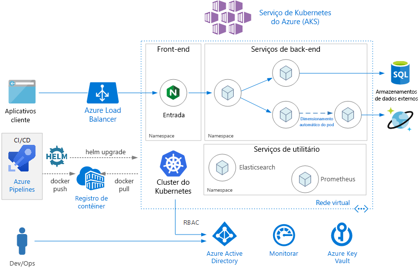
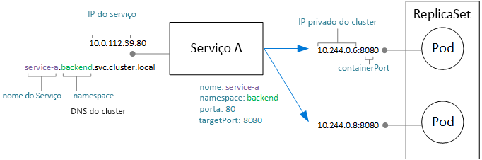
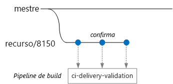
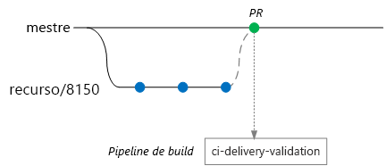
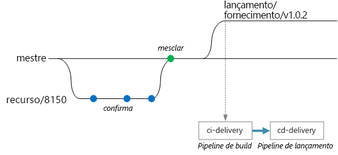

# <a name="microservices-architecture-on-azure-kubernetes-service-aks"></a>Arquitetura de microsserviços no AKS (Serviço de Kubernetes do Azure)

Essa arquitetura de referência mostra um aplicativo de microsserviços implantado no AKS (Serviço de Kubernetes do Azure). Ele mostra uma configuração básica do AKS que pode ser o ponto de partida para a maioria das implantações. Opções mais avançadas, incluindo opções avançadas de rede, serão abordadas em uma arquitetura de referência separada.

Este artigo pressupõe conhecimentos básicos de Kubernetes. O artigo se concentra principalmente na infraestrutura e nas considerações de DevOps na execução de uma arquitetura de microsserviços no AKS. Para obter orientação sobre como criar microsserviços de uma perspectiva de DDD (Design Controlado por Domínio), consulte [Projetando, compilando e operando microsserviços no Azure](/azure/architecture/microservices).



## <a name="architecture"></a>Arquitetura

A arquitetura consiste nos componentes a seguir.

**AKS** (Serviço de Kubernetes do Azure). O AKS é um serviço do Azure que implanta um cluster do Kubernetes gerenciado. 

**Cluster do Kubernetes**. O AKS é responsável por implantar o cluster do Kubernetes e gerenciar os mestres do Kubernetes. Você só pode gerenciar os nós de agente.

**Rede virtual**. Por padrão, o AKS cria uma rede virtual para ter onde implantar os nós de agente. Para cenários mais avançados, você pode criar a rede virtual primeiro, que permite controlar, por exemplo, como as sub-redes são configuradas, a conectividade local e o endereçamento IP. Para obter mais informações, consulte [Configurar rede avançada no AKS (Serviço de Kubernetes do Azure)](/azure/aks/configure-advanced-networking).

**Entrada**. Uma entrada expõe as rotas de HTTP(S) para serviços dentro do cluster. Para obter mais informações, consulte a seção [Gateway de API](#api-gateway) abaixo.

**Armazenamentos de dados externos**. Microsserviços são normalmente sem estado e gravam o estado em armazenamentos de dados externos, como o Banco de Dados SQL ou o Cosmos DB.

**Active Directory do Azure**. O AKS usa uma identidade do Azure AD (Azure Active Directory) para criar e gerenciar outros recursos do Azure, como os balanceadores de carga do Azure. O Azure AD também é recomendado para autenticação de usuário em aplicativos cliente.

**Registro de Contêiner do Azure**. Use o Registro de Contêiner para armazenar imagens privadas do Docker, que são implantadas no cluster. O AKS pode fazer a autenticação com o Registro de Contêiner usando sua identidade do Azure AD. Observe que o AKS não exige o Registro de Contêiner do Azure. Você pode usar outros registros de contêiner, como o Hub do Docker.

**Azure Pipelines**. O Azure Pipelines faz parte dos serviços de DevOps do Azure e executa compilações, testes e implantações automatizadas. Você também pode usar soluções de CI/CD de terceiros, como o Jenkins. 

**Helm**. O Helm funciona como um gerenciador de pacotes para o Kubernetes &mdash; e é uma maneira de agrupar objetos Kubernetes em uma única unidade que você pode publicar, implantar, atualizar e controlar a versão.

**Azure Monitor**. O Azure Monitor coleta e armazena métricas e logs, inclusive a métrica de plataforma para os serviços do Azure na telemetria do aplicativo e da solução. Use esses dados para monitorar o aplicativo, configurar alertas e painéis e executar a análise da causa raiz de falhas. O Azure Monitor integra-se ao AKS para coletar métricas de controladores, nós e contêineres, bem como logs do contêiner e logs do nó mestre.

## <a name="design-considerations"></a>Considerações sobre o design

Essa arquitetura de referência se concentra em arquiteturas de microsserviços, embora muitas das práticas recomendadas serão aplicáveis a outras cargas de trabalho em execução no AKS.

### <a name="microservices"></a>Microsserviços

O objeto Kubernetes Service é uma maneira natural de modelar microsserviços no Kubernetes. Um microsserviço é uma unidade flexível, com implantação independente do código. Os microsserviços normalmente se comunicam por meio de APIs bem definidas e podem ser descobertos por alguma forma de descoberta de serviços. O objeto Kubernetes Service fornece um conjunto de recursos que correspondem a estes requisitos:

- Endereço IP. O objeto Service fornece um endereço IP interno estático para um grupo de pods (ReplicaSet). À medida que os pods são criados ou movidos, o serviço fica sempre acessível nesse endereço IP interno.

- Balanceamento de carga. A carga do tráfego enviado para o endereço IP do serviço é balanceada nos pods. 

- Descoberta de serviço. Os serviços recebem entradas DNS internas do serviço DNS do Kubernetes. Isso significa que o gateway de API pode chamar um serviço de back-end usando o nome DNS. O mesmo mecanismo pode ser usado para comunicação entre serviços. As entradas DNS são organizadas por namespace e, portanto, se seus namespaces correspondem aos contextos limitados, o nome DNS para um serviço será mapeado naturalmente para o domínio do aplicativo.

O diagrama a seguir mostra a relação conceitual entre serviços e pods. O mapeamento real para portas e endereços IP do ponto de extremidade é feito pelo kube-proxy, o proxy de rede do Kubernetes.



### <a name="api-gateway"></a>Gateway de API

Um *gateway de API* é um gateway que se posiciona entre os clientes externos e os microsserviços. Ele atua como um proxy reverso, encaminhando as solicitações de clientes para os microsserviços. Ele também pode executar várias tarefas detalhadas, como autenticação, terminação de SSL e a limitação de taxa. 

A funcionalidade fornecida por um gateway pode ser agrupada da seguinte maneira:

- [Roteamento de Gateway](../../patterns/gateway-routing.md): roteamento de solicitações de cliente para os serviços de back-end corretos. Isso cria um ponto de extremidade único para os clientes e ajuda a separar clientes de serviços.

- [Agregação de Gateway](../../patterns/gateway-aggregation.md): agregação de várias solicitações em uma única solicitação, para reduzir conversas entre o cliente e o back-end.

- [Descarregamento de gateway](../../patterns/gateway-offloading.md). Um gateway pode descarregar funcionalidades de serviços de back-end, como terminação SSL, autenticação, lista de permissões de IP ou limitação de taxa do cliente (limitação).

Gateways de API são um [padrão de design de microsserviços](https://microservices.io/patterns/apigateway.html) geral. Elas podem ser implementadas usando várias tecnologias diferentes. Provavelmente, a implementação mais comum é a implantação de um roteador de borda ou proxy reverso, como Nginx, HAProxy ou Traefik, dentro do cluster. 

Outras opções incluem:

- Gateway de Aplicativo do Azure e/ou do Gerenciamento de API do Azure, que são dois serviços gerenciados que residem fora do cluster. Um Controlador de Entrada do Gateway de Aplicativo está atualmente em versão beta.

- Proxies do Azure Functions. Proxies podem modificar solicitações e respostas e rotear solicitações com base na URL.

O tipo de recurso **Entrada** do Kubernetes abstrai as definições de configuração para um servidor proxy. Ele funciona em conjunto com um controlador de entrada, que fornece a implementação subjacente da Entrada. Há controladores de entrada para Nginx, HAProxy, Traefik e Gateway de Aplicativo (versão prévia), entre outros.

O controlador de entrada lida com a configuração do servidor proxy. Geralmente, eles exigem arquivos de configuração complexos, que poderão ser difíceis de ajustar se você não for um especialista, por isso, o controlador de entrada é uma boa abstração. Além disso, o Controlador de Entrada tem acesso à API do Kubernetes e pode tomar decisões inteligentes sobre o roteamento e o balanceamento de carga. Por exemplo, o controlador de entrada Nginx ignora o proxy de rede do kube-proxy.

Por outro lado, se você precisa de controle total sobre as configurações, talvez queira ignorar essa abstração e configurar o servidor proxy manualmente. 

Um servidor proxy reverso é um possível gargalo ou um ponto único de falha, portanto, sempre implante pelo menos duas réplicas para alta disponibilidade.

### <a name="data-storage"></a>Armazenamento de dados

Em uma arquitetura de microsserviços, os serviços não devem compartilhar o armazenamento de dados. Cada serviço deve possuir seus próprios dados privados em um armazenamento lógico separado, para evitar dependências ocultas entre serviços. O motivo disso é evitar o acoplamento não intencional entre serviços, o que poderá ocorrer se os serviços compartilharem os mesmos esquemas de dados subjacentes. Além disso, quando os serviços gerenciam seus próprios armazenamentos de dados, eles podem usar o armazenamento de dados adequado para suas necessidades específicas. Para obter mais informações, confira [Criando microsserviços: considerações de dados](/azure/architecture/microservices/data-considerations).

Evite armazenar dados persistentes no armazenamento de cluster local, pois isso vincula os dados ao nó. Em vez disso: 

- Use um serviço externo, como o Banco de Dados SQL do Azure ou Cosmos DB *ou*

- Monte um volume persistente usando Discos do Azure ou Arquivos do Azure. Use os Arquivos do Azure quando o mesmo volume precisar ser compartilhado por vários pods.

### <a name="namespaces"></a>Namespaces

Use namespaces para organizar os serviços dentro do cluster. Todos os objetos em um cluster do Kubernetes pertencem a um namespace. Por padrão, quando você cria um novo objeto, ele vai para o namespace `default`. Porém, é uma boa prática criar namespaces que sejam mais descritivos para ajudar a organizar os recursos no cluster.

Primeiro, os namespaces ajudam a evitar conflitos de nomenclatura. Quando várias equipes implantam microsserviços no mesmo cluster, com possivelmente centenas de microsserviços, fica difícil administrar se todos vão para o mesmo namespace. Além disso, os namespaces permitem a você:

- Aplicar restrições de recursos a um namespace, para que o conjunto total de pods atribuído ao namespace não ultrapasse a cota de recursos do namespace.

- Aplicar políticas no nível do namespace, incluindo políticas de RBAC e segurança.

Para uma arquitetura de microsserviços, considere organizar os microsserviços em contextos limitados e criar namespaces para cada contexto limitado. Por exemplo, todos os microsserviços relativos ao contexto limitado "Preenchimento de pedidos" poderiam ir para o mesmo namespace. Outra alternativa é criar um namespace para cada equipe de desenvolvimento.

Posicione os serviços essenciais em seu próprio namespace separado. Por exemplo, você pode implantar Elasticsearch ou Prometheus para monitoramento de cluster, ou Tiller para o Helm.

## <a name="scalability-considerations"></a>Considerações sobre escalabilidade

O Kubernetes dá suporte à expansão em dois níveis:

- Dimensionar o número de pods alocado a uma implantação.
- Dimensionar os nós no cluster para aumentar os recursos de computação total disponíveis para o cluster.

Embora você possa escalar horizontalmente os pods e nós manualmente, recomendamos usar o dimensionamento automático para minimizar a possibilidade de os serviços ficarem sem recursos quando a carga é alta. Uma estratégia de dimensionamento automático precisa levar em consideração pods e nós. Se você simplesmente escalar os pods horizontalmente, acabará atingindo os limites de recursos dos nós. 

### <a name="pod-autoscaling"></a>Dimensionamento automático de pods

O HPA (Dimensionador Automático de Pod Horizontal) dimensiona os pods com base em métricas personalizadas, memória ou CPU observadas. Para configurar o dimensionamento horizontal de pods, você pode especificar uma métrica de destino (por exemplo, 70% da CPU) e o número mínimo e máximo de réplicas. Você deve fazer um teste de carga nos serviços para obter esses números.

Um efeito colateral do dimensionamento automático é que os pods podem ser criados ou removidos com maior frequência, de acordo com os eventos de expansão e redução horizontal ocorridos. Para reduzir os efeitos disso:

- Use investigações de preparação para que o Kubernetes saiba quando um novo pod está pronto para aceitar tráfego.
- Use os orçamentos de interrupção de pod para limitar quantos pods podem ser removidos de um serviço de cada vez.

### <a name="cluster-autoscaling"></a>Dimensionamento automático do cluster

O dimensionador automático de cluster dimensiona o número de nós. Se pods não puderem ser agendados devido a restrições de recursos, o dimensionador automático de cluster provisionará mais nós.  (Observação: a integração entre o AKS e o dimensionador automático de cluster está atualmente em versão prévia.)

Enquanto o HPA examina os recursos reais consumidos ou outras métricas dos pods em execução, o dimensionador automático de cluster está provisionando nós para pods que ainda não estão agendados. Portanto, ele examina os recursos solicitados, conforme especificado nas especificações de pod do Kubernetes para uma determinada implantação. Use o teste de carga para ajustar esses valores.

Não é possível mudar o tamanho da VM depois de criar um cluster, ou seja, é necessário fazer um planejamento da capacidade inicial para escolher um tamanho de VM adequado para os nós de agente ao criar o cluster. 

## <a name="availability-considerations"></a>Considerações sobre disponibilidade

### <a name="health-probes"></a>Investigações de integridade

O Kubernetes define dois tipos de investigação de integridade que um pod pode expor:

- Investigação de preparação: informa ao Kubernetes se o pod está pronto para aceitar solicitações.

- Investigação de atividade: informa ao Kubernetes se um pod precisa ser removido e uma nova instância precisa ser iniciada.

Ao pensar sobre os testes, é útil se lembrar de como funciona um serviço no Kubernetes. Um serviço tem um seletor de rótulo que corresponde a um conjunto de pods (zero ou mais). O Kubernetes balanceia a carga de tráfego para os pods que correspondem ao seletor. Somente os pods que foram iniciados com êxito e estão íntegros recebem tráfego. Em caso de falha de um contêiner, o Kubernetes elimina o pod e agenda uma substituição.

Às vezes, um pod pode não estar pronto para receber tráfego, mesmo que tenha sido iniciado com êxito. Por exemplo, pode haver tarefas de inicialização em que o aplicativo em execução no contêiner carregue coisas na memória ou leia dados de configuração. Para indicar que um pod está íntegro, mas não está pronto para receber tráfego, defina uma investigação de preparação. 

As investigações de atividade lidam com pods ainda em execução, mas que não estão íntegros e devem ser reciclados. Por exemplo, suponha que um contêiner esteja atendendo a solicitações HTTP, mas pare de responder por algum motivo. O contêiner não falha, mas ele para de atender às solicitações. Se você definir uma investigação de atividade de HTTP, a investigação vai parar de responder e informa ao Kubernetes para reiniciar o pod.

Aqui estão algumas considerações para a criação de testes:

- Se o código tem um longo tempo de inicialização, há o risco de uma investigação de atividade relatar falha antes da conclusão da inicialização. Para evitar isso, use a configuração initialDelaySeconds, que atrasa o início da investigação.

- A investigação de atividade só ajuda se a reinicialização do pod tiver chance de restaurá-lo para um estado íntegro. Você pode usar uma investigação de atividade para reduzir vazamentos de memória ou deadlocks inesperados, mas não há nenhuma razão para reiniciar um pod que vai falhar novamente de imediato.

- Às vezes, as investigações de preparação são usadas para verificar serviços dependentes. Por exemplo, se um pod tem uma dependência em um banco de dados, a investigação de atividade pode verificar a conexão de banco de dados. No entanto, essa abordagem pode criar problemas inesperados. Um serviço externo pode estar temporariamente indisponível por algum motivo. Isso fará com que a investigação de preparação falhe em todos os pods do serviço, fazendo com que todos sejam removidos do balanceamento de carga e criando falhas em cascata upstream. Uma abordagem melhor é implementar o tratamento de repetição no serviço, para que seu serviço possa se recuperar corretamente de falhas transitórias.

### <a name="resource-constraints"></a>Restrições de recursos

A contenção de recursos pode afetar a disponibilidade de um serviço. Defina restrições de recursos para contêineres, para que um mesmo contêiner não possa sobrecarregar os recursos de cluster (memória e CPU). Para recursos que não são de contêiner, como threads ou conexões de rede, considere o uso do [Padrão de Bulkhead](/azure/architecture/patterns/bulkhead) para isolar recursos.

Use cotas de recursos para limitar o total de recursos permitido para um namespace. Dessa forma, o front-end não pode enfraquecer os serviços de back-end por causa de recursos ou vice-versa.

## <a name="security-considerations"></a>Considerações de segurança

### <a name="role-based-access-control-rbac"></a>RBAC (Controle de Acesso Baseado em Função)

O Kubernetes e o Azure têm mecanismos de RBAC (controle de acesso baseado em função):

- O RBAC do Azure controla o acesso aos recursos no Azure, incluindo a capacidade de criar novos recursos do Azure. As permissões podem ser atribuídas a usuários, grupos ou entidades de serviço. (Uma entidade de serviço é uma identidade de segurança usada pelos aplicativos.)

- O RBAC do Kubernetes controla permissões para a API do Kubernetes. Por exemplo, a criação e a listagem de pods são ações que podem ser autorizadas (ou negadas) a um usuário por meio de RBAC. Para atribuir permissões de Kubernetes aos usuários, você cria *funções* e *associações de função*:

  - Role é um conjunto de permissões que se aplicam dentro de um namespace. As permissões são definidas como verbos (obter, atualizar, criar, excluir) em recursos (pods, implantações, etc.).

  - Um RoleBinding atribui usuários ou grupos a um Role.

  - Também há um objeto ClusterRole, que é como Role, mas se aplica a todo o cluster em todos os namespaces. Para atribuir usuários ou grupos a um ClusterRole, crie um ClusterRoleBinding.

O AKS integra esses dois mecanismos de RBAC. Quando você cria um cluster do AKS, é possível configurá-lo para usar o Azure AD na autenticação de usuários. Para obter detalhes sobre como configurar isso, confira [Integrar o Azure Active Directory com o Serviço de Kubernetes do Azure](/azure/aks/aad-integration).

Depois que isso é configurado, um usuário que deseja acessar a API do Kubernetes (por exemplo, por kubectl) deve entrar usando suas credenciais do Azure AD.

Por padrão, um usuário do Azure AD não tem acesso ao cluster. Para conceder acesso, o administrador de cluster cria RoleBindings que se referem a grupos ou usuários do Azure AD. Se um usuário não tiver permissões para determinada operação, ela falhará.

Se os usuários não têm acesso por padrão, como o administrador de cluster tem permissão para criar as associações de função, para começar? Um cluster do AKS, na verdade, tem dois tipos de credenciais para chamar o servidor de API do Kubernetes: usuário de cluster e o administrador de cluster. As credenciais de administrador de cluster concedem acesso total ao cluster. O comando da CLI do Azure `az aks get-credentials --admin` baixa as credenciais de administrador de cluster e as salva em seu arquivo kubeconfig. O administrador de cluster pode usar esse kubeconfig para criar funções e associações de função.

Como as credenciais de administrador de cluster têm muito poder, use o RBAC do Azure para restringir o acesso a elas:

- A "Função de administrador de cluster do Serviço de Kubernetes do Azure" tem permissão para baixar as credenciais de administrador de cluster. Somente os administradores de cluster devem receber essa função.

- A "Função de usuário de cluster do Serviço de Kubernetes do Azure" tem permissão para baixar as credenciais de usuário de cluster. Os usuários não administradores não podem receber essa função. Essa função não fornece nenhuma permissão específica em recursos do Kubernetes dentro do cluster &mdash; ela apenas permite que um usuário se conecte ao servidor de API. 

Quando você definir as políticas de RBAC (Kubernetes e Azure), pense sobre as funções em sua organização:

- Quem pode criar ou excluir um cluster do AKS e baixar as credenciais de administrador?
- Quem pode administrar um cluster?
- Quem pode criar ou atualizar recursos dentro de um namespace?

É uma boa prática criar o escopo das permissões de RBAC do Kubernetes por namespace, usando Roles e RoleBindings em vez de ClusterRoles e ClusterRoleBindings.

Por fim, convém saber quais permissões o cluster do AKS tem para criar e gerenciar recursos do Azure, como armazenamento, rede ou balanceadores de carga. Para se autenticar com as APIs do Azure, o cluster usa uma entidade de serviço do Azure AD. Se você não especificar uma entidade de serviço ao criar o cluster, uma será criada automaticamente. No entanto, é uma boa prática de segurança primeiro criar a entidade de serviço e atribuir as permissões mínimas de RBAC a ela. Para obter mais informações, confira [Entidades de serviço com o Serviço de Kubernetes do Azure](/azure/aks/kubernetes-service-principal).

### <a name="secrets-management-and-application-credentials"></a>Credenciais de aplicativo e gerenciamento de segredos

Aplicativos e serviços geralmente precisam de credenciais que permitam a eles se conectar a serviços externos, como o Armazenamento do Azure ou o Banco de Dados SQL. O desafio é manter essas credenciais seguras e não divulgá-las. 

Para recursos do Azure, uma opção é usar identidades gerenciadas. A ideia de uma identidade gerenciada é que um aplicativo ou serviço tenha uma identidade armazenada no Azure AD e use essa identidade para se autenticar em um serviço do Azure. O aplicativo ou serviço tem uma entidade de serviço criada para ele no Azure AD e é autenticado usando tokens OAuth 2.0. O processo de execução chama um endereço do localhost para obter o token. Dessa forma, você não precisa armazenar senhas ou cadeias de conexão. Você pode usar identidades gerenciadas no AKS atribuindo identidades a pods individuais, usando o projeto [aad-pod-identity](https://github.com/Azure/aad-pod-identity).

Atualmente, nem todos os serviços do Azure dão suporte à autenticação usando identidades gerenciadas. Para obter uma lista, consulte [Serviços do Azure que dão suporte à autenticação do Azure AD](/azure/active-directory/managed-identities-azure-resources/services-support-msi).

Mesmo com identidades gerenciadas, você provavelmente precisará armazenar algumas credenciais ou outros segredos do aplicativo, seja para serviços do Azure que não dão suporte a identidades gerenciadas, serviços de terceiros, chaves de API ou outros. Aqui estão algumas opções para armazenar segredos com segurança:

- Azure Key Vault. No AKS, você pode montar um ou mais segredos do Key Vault como um volume. O volume lê os segredos do Key Vault. O pod, em seguida, pode ler os segredos como um volume normal. Para obter mais informações, consulte o projeto [Kubernetes-KeyVault-FlexVolume](https://github.com/Azure/kubernetes-keyvault-flexvol) no GitHub.

    O pod se autentica usando uma identidade de pod (descrita acima) ou usando uma entidade de serviço do Azure AD, juntamente com um segredo do cliente. O uso de identidades de pod é recomendado porque o segredo do cliente não é necessário nesse caso. 

- HashiCorp Vault. Os aplicativos do Kubernetes podem se autenticar com o HashiCorp Vault usando identidades gerenciadas do Azure AD. Confira [O HashiCorp Vault é compatível com o Azure Active Directory](https://open.microsoft.com/2018/04/10/scaling-tips-hashicorp-vault-azure-active-directory/). Você pode implantar o Vault em si no Kubernetes, mas recomendamos executá-lo em um cluster dedicado separado de seu aplicativo cluster. 

- segredos do Kubernetes. Outra opção é simplesmente usar segredos do Kubernetes. Essa opção é a mais fácil de configurar, mas tem alguns desafios. Os segredos são armazenados em etcd, que é um armazenamento de chave-valor distribuído. O AKS [criptografa etcd em repouso](https://github.com/Azure/kubernetes-kms#azure-kubernetes-service-aks). A Microsoft gerencia as chaves de criptografia.

Usar um sistema como HashiCorp Vault ou o Azure Key Vault oferece várias vantagens, como:

- Controle centralizado de segredos.
- Garantia de que todos os segredos sejam criptografados em repouso.
- Gerenciamento centralizado de chaves.
- Controle de acesso de segredos.
- Auditoria

### <a name="pod-and-container-security"></a>Segurança do pod e do contêiner

Essa lista certamente não inclui todos os exemplos, mas aqui estão algumas práticas recomendadas para proteger seus pods e contêineres: 

Não execute contêineres no modo privilegiado. O modo privilegiado concede acesso ao contêiner para todos os dispositivos no host. Você pode definir a Política de Segurança de Pod para não permitir que os contêineres sejam executados no modo privilegiado. 

Quando possível, evite executar processos como raiz dentro de contêineres. Os contêineres não fornecem isolamento completo do ponto de vista de segurança e, portanto, é melhor executar um processo de contêiner como um usuário sem privilégios. 

Armazene imagens em um registro privado confiável, como o Registro de Contêiner do Azure ou o Docker Trusted Registry. Use um webhook de admissão de validação no Kubernetes para fazer com que os pods possam efetuar pull somente de imagens do registro confiável.

Verifique vulnerabilidades conhecidas nas imagens usando uma solução de verificação como Twistlock e Aqua, que estão disponíveis no Azure Marketplace.

Automatize a aplicação de patch em imagens usando Tarefas do ACR, um recurso do Registro de Contêiner do Azure. Uma imagem de contêiner baseia-se em camadas. As camadas de base incluem a imagem do sistema operacional e as imagens da estrutura de aplicativo, como ASP.NET Core ou Node.js. As imagens de base são normalmente criadas upstream a partir dos desenvolvedores de aplicativos e são mantidas por outros mantenedores do projeto. Quando essas imagens são corrigidas upstream, é importante atualizar, testar e reimplantar suas próprias imagens, para que você não deixe passar nenhuma vulnerabilidade de segurança conhecida. As Tarefas do ACR podem ajudar a automatizar esse processo.

## <a name="deployment-cicd-considerations"></a>Considerações de implantação (CI/CD)

Aqui estão algumas metas de um processo de CI/CD robusto para uma arquitetura de microsserviços:

- Cada equipe pode criar e implantar os serviços que ela possui independentemente, sem afetar ou interromper outras equipes.

- Antes de uma nova versão de um serviço ser implantada na produção, ela é implantada em ambientes de desenvolvimento/teste/garantia de qualidade para validação. Há restrições de qualidade impostas em cada estágio.

- Uma nova versão de um serviço pode ser implantada lado a lado com a versão anterior.

- Há políticas de controle de acesso suficientes em vigor.

- Você pode confiar nas imagens de contêiner que estão implantadas na produção.

### <a name="isolation-of-environments"></a>Isolamento de ambientes

Você terá vários ambientes com serviços implantados, incluindo ambientes de desenvolvimento, smoke test, testes de integração, testes de carga e, finalmente, produção. Esses ambientes precisam de algum nível de isolamento. No Kubernetes, você pode escolher entre o isolamento físico e o isolamento lógico. Isolamento físico significa implantar em clusters separados. O isolamento lógico faz uso de namespaces e as políticas, conforme descrito anteriormente.

Nossa recomendação é criar um cluster de produção dedicado juntamente com um cluster separado para seus ambientes de desenvolvimento/teste. Use o isolamento lógico para separar ambientes dentro do cluster de desenvolvimento/teste. Os serviços implantados no cluster de desenvolvimento/teste nunca devem ter acesso a armazenamentos de dados que contêm dados de negócios. 

### <a name="helm"></a>Helm

Considere usar o Helm para gerenciar, criar e implantar serviços. Alguns dos recursos do Helm que ajudam com CI/CD incluem:

- Organizar todos os objetos de Kubernetes de um microsserviço específico em um único gráfico do Helm.
- Implantar o gráfico como um comando do Helm único em vez de uma série de comandos kubectl.
- Acompanhar atualizações e revisões, usando controle de versão semântico, além da capacidade de reverter para uma versão anterior.
- Usar modelos para evitar a duplicação de informações, como rótulos e seletores, em vários arquivos.
- Gerenciar dependências entre gráficos.
- Publicar gráficos em um repositório do Helm, como um Registro de Contêiner do Azure, e integrá-los ao pipeline de build.

Para obter mais informações sobre como usar o Registro de Contêiner como um repositório do Helm, confira [Usar o Registro de Contêiner do Azure como um repositório do Helm para os gráficos do aplicativo](/azure/container-registry/container-registry-helm-repos).

### <a name="cicd-workflow"></a>Fluxo de trabalho de CI/CD

Antes de criar um fluxo de trabalho de CI/CD, você precisa saber como a base de código será estruturada e gerenciada.

- As equipes funcionam em repositórios separados ou em um repositório único?
- Qual é sua estratégia de ramificação?
- Quem pode efetuar push do código para a produção? Existe uma função de gerente de versão?

A abordagem de repositório único tem tido mais aceitação, mas há vantagens e desvantagens em ambas.

| &nbsp; | Repositório único | Vários repositórios |
|--------|----------|----------------|
| **Vantagens** | Compartilhamento de código<br/>Maior facilidade em padronizar o código e as ferramentas<br/>Maior facilidade em refatorar o código<br/>Detectabilidade – modo de exibição único do código<br/> | Propriedade clara por equipe<br/>Possivelmente menos conflitos de mesclagem<br/>Ajuda a impor o desacoplamento de microsserviços |
| **Desafios** | As alterações no código compartilhado podem afetar vários microsserviços<br/>Maior potencial de conflitos de mesclagem<br/>As ferramentas devem ser dimensionadas para uma base de código grande<br/>Controle de acesso<br/>Processo de implantação mais complexo | Mais difícil de compartilhar o código<br/>Mais difícil de impor padrões de codificação<br/>Gerenciamento de dependências<br/>Base de código difusa, baixa detectabilidade<br/>Falta de infraestrutura compartilhada

Nesta seção, apresentamos um possível fluxo de trabalho de CI/CD com base nas seguintes suposições:

- O repositório de código é único, com pastas organizadas por microsserviço.
- A estratégia de ramificação da equipe se baseia no [desenvolvimento com base em troncos](https://trunkbaseddevelopment.com/).
- A equipe usa o [Azure Pipelines](/azure/devops/pipelines) para executar o processo de CI/CD.
- A equipe usa [namespaces](/azure/container-registry/container-registry-best-practices#repository-namespaces) no Registro de Contêiner do Azure para isolar as imagens que foram aprovadas para a produção das imagens que ainda estão sendo testadas.

Neste exemplo, um desenvolvedor está trabalhando em um microsserviço chamado Serviço de Entrega. (O nome vem da implementação de referência descrita [aqui](../../microservices/design/index.md#scenario).) Ao desenvolver um novo recurso, o desenvolvedor coloca código em um branch de recursos.



O push de confirmações efetuado para esse branch dispara uma compilação de CI para o microsserviço. Por convenção, os branches de recursos recebem o nome de `feature/*`. O [arquivo de definição de compilação](/azure/devops/pipelines/yaml-schema) inclui um gatilho que filtra por nome do branch e por caminho de origem. Usando essa abordagem, cada equipe pode ter seu próprio pipeline de build.

```yaml
trigger:
  batch: true
  branches:
    include:
    - master
    - feature/*

    exclude:
    - feature/experimental/*

  paths:
     include:
     - /src/shipping/delivery/
```

Agora, no fluxo de trabalho, a compilação de CI executa uma verificação mínima no código:

1. Compilar o código
1. Executar testes de unidade

A ideia aqui é manter os tempos de compilação curtos para que o desenvolvedor possa receber comentários rapidamente. Quando o recurso está pronto para ser mesclado com o mestre, o desenvolvedor abre uma solicitação de pull. Isso dispara outra compilação de CI que executa verificações adicionais:

1. Compilar o código
1. Executar testes de unidade
1. Criar a imagem de contêiner do tempo de execução
1. Executar exames de vulnerabilidade na imagem



> [!NOTE]
> No Azure Repos, você pode definir [políticas](/azure/devops/repos/git/branch-policies) para proteger branches. Por exemplo, a política poderia exigir uma compilação de CI bem-sucedida e a aprovação de uma pessoa pertinente para fazer a mesclagem com o mestre.

Em algum momento, a equipe estará pronta para implantar uma nova versão do Serviço de Entrega. Para isso, o gerente de versão cria um branch do mestre com este padrão de nomenclatura: `release/<microservice name>/<semver>`. Por exemplo, `release/delivery/v1.0.2`.
Isso dispara uma compilação de CI completa que executa todas as etapas anteriores, além de:

1. Efetuar push da imagem do Docker para o Registro de Contêiner do Azure. A imagem é marcada com o número de versão obtido do nome do branch.
2. Executar `helm package` para empacotar o gráfico do Helm
3. Efetuar push do pacote do Helm para o Registro de Contêiner executando `az acr helm push`.

Supondo que essa compilação seja bem-sucedida, ela disparará um processo de implantação usando um [pipeline de lançamento](/azure/devops/pipelines/release/what-is-release-management) do Azure Pipelines. Este pipeline

1. Executa `helm upgrade` para implantar o gráfico do Helm em um ambiente de QA.
1. Um aprovador confirma a aprovação antes que o pacote seja movido para a produção. Confira [Controle de implantação de versão usando aprovações](/azure/devops/pipelines/release/approvals/approvals).
1. Marca novamente a imagem do Docker com o namespace de produção no Registro de Contêiner do Azure. Por exemplo, se a marca atual for `myrepo.azurecr.io/delivery:v1.0.2`, a marca de produção será `myrepo.azurecr.io/prod/delivery:v1.0.2`.
1. Executa `helm upgrade` para implantar o gráfico do Helm no ambiente de produção.



É importante lembrar que mesmo em um repositório único, o escopo dessas tarefas pode ser definido para microsserviços individuais, para que as equipes possam fazer a implantação rapidamente. Há algumas etapas manuais no processo: Aprovar solicitações de pull, criar branches de versão e aprovar implantações no cluster de produção. Essas etapas são manuais de acordo com a política &mdash; elas poderão ser totalmente automatizadas se a organização preferir.
