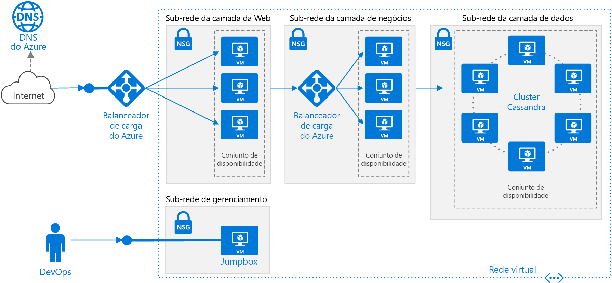

# <a name="linux-n-tier-application-in-azure-with-apache-cassandra"></a><span data-ttu-id="36a68-103">Aplicativo Linux de N camadas no Azure com Apache Cassandra</span><span class="sxs-lookup"><span data-stu-id="36a68-103">Linux N-tier application in Azure with Apache Cassandra</span></span>

<span data-ttu-id="36a68-104">Essa arquitetura de referência mostra como implantar VMs (máquinas virtuais) e uma rede virtual configurada para um aplicativo de N camadas usando o Apache Cassandra no Linux para a camada de dados.</span><span class="sxs-lookup"><span data-stu-id="36a68-104">This reference architecture shows how to deploy virtual machines (VMs) and a virtual network configured for an N-tier application, using Apache Cassandra on Linux for the data tier.</span></span> <span data-ttu-id="36a68-105">[**Implantar esta solução**](#deploy-the-solution).</span><span class="sxs-lookup"><span data-stu-id="36a68-105">[**Deploy this solution**](#deploy-the-solution).</span></span>



<span data-ttu-id="36a68-107">*Baixe um [Arquivo Visio][visio-download] dessa arquitetura.*</span><span class="sxs-lookup"><span data-stu-id="36a68-107">*Download a [Visio file][visio-download] of this architecture.*</span></span>

## <a name="architecture"></a><span data-ttu-id="36a68-108">Arquitetura</span><span class="sxs-lookup"><span data-stu-id="36a68-108">Architecture</span></span>

<span data-ttu-id="36a68-109">A arquitetura tem os seguintes componentes:</span><span class="sxs-lookup"><span data-stu-id="36a68-109">The architecture has the following components:</span></span>

- <span data-ttu-id="36a68-110">**Grupo de recursos**.</span><span class="sxs-lookup"><span data-stu-id="36a68-110">**Resource group**.</span></span> <span data-ttu-id="36a68-111">[Grupos de recursos][resource-manager-overview] são utilizados para agrupar os recursos para que eles possam ser gerenciados pelo tempo de vida, o proprietário ou outros critérios.</span><span class="sxs-lookup"><span data-stu-id="36a68-111">[Resource groups][resource-manager-overview] are used to group resources so they can be managed by lifetime, owner, or other criteria.</span></span>

- <span data-ttu-id="36a68-112">**VNet (Rede Virtual) e sub-redes**.</span><span class="sxs-lookup"><span data-stu-id="36a68-112">**Virtual network (VNet) and subnets**.</span></span> <span data-ttu-id="36a68-113">Cada VM do Azure é implantada em uma VNet que pode ser segmentada em sub-redes.</span><span class="sxs-lookup"><span data-stu-id="36a68-113">Every Azure VM is deployed into a VNet that can be segmented into subnets.</span></span> <span data-ttu-id="36a68-114">Sempre crie uma sub-rede separada para cada camada.</span><span class="sxs-lookup"><span data-stu-id="36a68-114">Create a separate subnet for each tier.</span></span>

- <span data-ttu-id="36a68-115">**NSGs**.</span><span class="sxs-lookup"><span data-stu-id="36a68-115">**NSGs**.</span></span> <span data-ttu-id="36a68-116">Use os NSGs [grupos de segurança de rede][nsg] para restringir o tráfego de rede na VNet.</span><span class="sxs-lookup"><span data-stu-id="36a68-116">Use [network security groups][nsg] (NSGs) to restrict network traffic within the VNet.</span></span> <span data-ttu-id="36a68-117">Por exemplo, na arquitetura de três camadas mostrada aqui, a camada de banco de dados aceita o tráfego da camada comercial e da sub-rede de gerenciamento, mas não do front-end da Web.</span><span class="sxs-lookup"><span data-stu-id="36a68-117">For example, in the three-tier architecture shown here, the database tier accepts traffic from the business tier and the management subnet, but not the web front end.</span></span>

- <span data-ttu-id="36a68-118">**Proteção contra DDoS**.</span><span class="sxs-lookup"><span data-stu-id="36a68-118">**DDoS Protection**.</span></span> <span data-ttu-id="36a68-119">Embora a plataforma do Azure forneça proteção básica em relação a ataques de negação de serviço distribuído (DDoS), é recomendável usar [Proteção contra DDoS Standard][ddos], que melhorou os recursos de mitigação de DDoS.</span><span class="sxs-lookup"><span data-stu-id="36a68-119">Although the Azure platform provides basic protection against distributed denial of service (DDoS) attacks, we recommend using [DDoS Protection Standard][ddos], which has enhanced DDoS mitigation features.</span></span> <span data-ttu-id="36a68-120">Confira [Considerações de segurança](#security-considerations).</span><span class="sxs-lookup"><span data-stu-id="36a68-120">See [Security considerations](#security-considerations).</span></span>

- <span data-ttu-id="36a68-121">**Máquinas virtuais**.</span><span class="sxs-lookup"><span data-stu-id="36a68-121">**Virtual machines**.</span></span> <span data-ttu-id="36a68-122">Para obter recomendações sobre como configurar máquinas virtuais, consulte [Executar uma VM do Windows no Azure](./windows-vm.md) e [Executar uma VM do Linux no Azure](./linux-vm.md).</span><span class="sxs-lookup"><span data-stu-id="36a68-122">For recommendations on configuring VMs, see [Run a Windows VM on Azure](./windows-vm.md) and [Run a Linux VM on Azure](./linux-vm.md).</span></span>

- <span data-ttu-id="36a68-123">**Conjuntos de disponibilidade**.</span><span class="sxs-lookup"><span data-stu-id="36a68-123">**Availability sets**.</span></span> <span data-ttu-id="36a68-124">Crie um [conjunto de disponibilidade][azure-availability-sets] para cada camada e provisione pelo menos duas VMs em cada camada, o que torna as VMs qualificadas para um [contrato de nível de serviço (SLA)][vm-sla] maior.</span><span class="sxs-lookup"><span data-stu-id="36a68-124">Create an [availability set][azure-availability-sets] for each tier, and provision at least two VMs in each tier, which makes the VMs eligible for a higher [service level agreement (SLA)][vm-sla].</span></span>

- <span data-ttu-id="36a68-125">**Balanceadores de carga do Azure**.</span><span class="sxs-lookup"><span data-stu-id="36a68-125">**Azure load balancers**.</span></span> <span data-ttu-id="36a68-126">Os [balanceadores de carga] [ load-balancer] distribuem solicitações de entrada da Internet para as instâncias de VM.</span><span class="sxs-lookup"><span data-stu-id="36a68-126">The [load balancers][load-balancer] distribute incoming Internet requests to the VM instances.</span></span> <span data-ttu-id="36a68-127">Use um [balanceador de carga público][load-balancer-external] para distribuir o tráfego de entrada da Internet para a camada da Web e um [balanceador de carga interno][load-balancer-internal] para distribuir o tráfego de rede da camada da Web para a camada comercial.</span><span class="sxs-lookup"><span data-stu-id="36a68-127">Use a [public load balancer][load-balancer-external] to distribute incoming Internet traffic to the web tier, and an [internal load balancer][load-balancer-internal] to distribute network traffic from the web tier to the business tier.</span></span>

- <span data-ttu-id="36a68-128">**Endereço IP público**.</span><span class="sxs-lookup"><span data-stu-id="36a68-128">**Public IP address**.</span></span> <span data-ttu-id="36a68-129">É necessário ter um endereço IP para que o balanceador de carga possa receber o tráfego da Internet.</span><span class="sxs-lookup"><span data-stu-id="36a68-129">A public IP address is needed for the public load balancer to receive Internet traffic.</span></span>

- <span data-ttu-id="36a68-130">**Jumpbox**.</span><span class="sxs-lookup"><span data-stu-id="36a68-130">**Jumpbox**.</span></span> <span data-ttu-id="36a68-131">Também chamada de um [host bastião].</span><span class="sxs-lookup"><span data-stu-id="36a68-131">Also called a [bastion host].</span></span> <span data-ttu-id="36a68-132">Uma VM protegida na rede que os administradores usam para se conectar às outras VMs.</span><span class="sxs-lookup"><span data-stu-id="36a68-132">A secure VM on the network that administrators use to connect to the other VMs.</span></span> <span data-ttu-id="36a68-133">O jumpbox tem um NSG que permite o tráfego remoto apenas de endereços IP públicos em uma lista segura.</span><span class="sxs-lookup"><span data-stu-id="36a68-133">The jumpbox has an NSG that allows remote traffic only from public IP addresses on a safe list.</span></span> <span data-ttu-id="36a68-134">O NSG deve permitir o tráfego SSH.</span><span class="sxs-lookup"><span data-stu-id="36a68-134">The NSG should allow ssh traffic.</span></span>

- <span data-ttu-id="36a68-135">**Banco de dados Apache Cassandra**.</span><span class="sxs-lookup"><span data-stu-id="36a68-135">**Apache Cassandra database**.</span></span> <span data-ttu-id="36a68-136">Fornece alta disponibilidade na camada de dados, habilitando replicação e failover.</span><span class="sxs-lookup"><span data-stu-id="36a68-136">Provides high availability at the data tier, by enabling replication and failover.</span></span>

- <span data-ttu-id="36a68-137">**DNS do Azure**.</span><span class="sxs-lookup"><span data-stu-id="36a68-137">**Azure DNS**.</span></span> <span data-ttu-id="36a68-138">O [DNS do Azure][azure-dns] é um serviço de hospedagem para domínios DNS.</span><span class="sxs-lookup"><span data-stu-id="36a68-138">[Azure DNS][azure-dns] is a hosting service for DNS domains.</span></span> <span data-ttu-id="36a68-139">Ele fornece resolução de nomes usando a infraestrutura do Microsoft Azure.</span><span class="sxs-lookup"><span data-stu-id="36a68-139">It provides name resolution using Microsoft Azure infrastructure.</span></span> <span data-ttu-id="36a68-140">Ao hospedar seus domínios no Azure, você pode gerenciar seus registros DNS usando as mesmas credenciais, APIs, ferramentas e cobrança que seus outros serviços do Azure.</span><span class="sxs-lookup"><span data-stu-id="36a68-140">By hosting your domains in Azure, you can manage your DNS records using the same credentials, APIs, tools, and billing as your other Azure services.</span></span>

## <a name="recommendations"></a><span data-ttu-id="36a68-141">Recomendações</span><span class="sxs-lookup"><span data-stu-id="36a68-141">Recommendations</span></span>

<span data-ttu-id="36a68-142">Seus requisitos podem ser diferentes dos requisitos da arquitetura descrita aqui.</span><span class="sxs-lookup"><span data-stu-id="36a68-142">Your requirements might differ from the architecture described here.</span></span> <span data-ttu-id="36a68-143">Use essas recomendações como ponto de partida.</span><span class="sxs-lookup"><span data-stu-id="36a68-143">Use these recommendations as a starting point.</span></span>

### <a name="vnet--subnets"></a><span data-ttu-id="36a68-144">VNet / Sub-redes</span><span class="sxs-lookup"><span data-stu-id="36a68-144">VNet / Subnets</span></span>

<span data-ttu-id="36a68-145">Quando você cria a VNet, determine quantos endereços IP seus recursos em cada sub-rede exigem.</span><span class="sxs-lookup"><span data-stu-id="36a68-145">When you create the VNet, determine how many IP addresses your resources in each subnet require.</span></span> <span data-ttu-id="36a68-146">Especifique uma máscara de sub-rede e um intervalo de endereços de VNet grande o suficiente para os endereços IP necessários, usando a notação [CIDR].</span><span class="sxs-lookup"><span data-stu-id="36a68-146">Specify a subnet mask and a VNet address range large enough for the required IP addresses, using [CIDR] notation.</span></span> <span data-ttu-id="36a68-147">Use um espaço de endereço que esteja dentro dos [blocos de endereço IP privados][private-ip-space] padrão, que são 10.0.0.0/8, 172.16.0.0/12 e 192.168.0.0/16.</span><span class="sxs-lookup"><span data-stu-id="36a68-147">Use an address space that falls within the standard [private IP address blocks][private-ip-space], which are 10.0.0.0/8, 172.16.0.0/12, and 192.168.0.0/16.</span></span>

<span data-ttu-id="36a68-148">Escolha um intervalo de endereços que não se sobreponha ao da rede local, caso seja necessário configurar um gateway entre a VNet e a rede local mais tarde.</span><span class="sxs-lookup"><span data-stu-id="36a68-148">Choose an address range that doesn't overlap with your on-premises network, in case you need to set up a gateway between the VNet and your on-premise network later.</span></span> <span data-ttu-id="36a68-149">Depois de criar a VNet, não será possível alterar o intervalo de endereços.</span><span class="sxs-lookup"><span data-stu-id="36a68-149">Once you create the VNet, you can't change the address range.</span></span>

<span data-ttu-id="36a68-150">Crie as sub-redes levando em conta os requisitos de funcionalidade e de segurança.</span><span class="sxs-lookup"><span data-stu-id="36a68-150">Design subnets with functionality and security requirements in mind.</span></span> <span data-ttu-id="36a68-151">Todas as VMs na mesma camada ou função devem ir para a mesma sub-rede, que pode ser um limite de segurança.</span><span class="sxs-lookup"><span data-stu-id="36a68-151">All VMs within the same tier or role should go into the same subnet, which can be a security boundary.</span></span> <span data-ttu-id="36a68-152">Para obter mais informações sobre como criar VNets e sub-redes, consulte [Planejar e criar redes virtuais do Azure][plan-network].</span><span class="sxs-lookup"><span data-stu-id="36a68-152">For more information about designing VNets and subnets, see [Plan and design Azure Virtual Networks][plan-network].</span></span>

### <a name="load-balancers"></a><span data-ttu-id="36a68-153">Balanceadores de carga</span><span class="sxs-lookup"><span data-stu-id="36a68-153">Load balancers</span></span>

<span data-ttu-id="36a68-154">Não exponha as VMs diretamente à Internet.</span><span class="sxs-lookup"><span data-stu-id="36a68-154">Do not expose the VMs directly to the Internet.</span></span> <span data-ttu-id="36a68-155">Em vez disso, dê um endereço IP privado a cada VM.</span><span class="sxs-lookup"><span data-stu-id="36a68-155">Instead, give each VM a private IP address.</span></span> <span data-ttu-id="36a68-156">Os clientes se conectam usando o endereço IP do balanceador de carga público.</span><span class="sxs-lookup"><span data-stu-id="36a68-156">Clients connect using the IP address of the public load balancer.</span></span>

<span data-ttu-id="36a68-157">Defina as regras do balanceador de carga para direcionar tráfego de rede para as VMs.</span><span class="sxs-lookup"><span data-stu-id="36a68-157">Define load balancer rules to direct network traffic to the VMs.</span></span> <span data-ttu-id="36a68-158">Por exemplo, para permitir tráfego HTTP, crie uma regra que mapeie a porta 80 da configuração de front-end para a porta 80 no pool de endereços de back-end.</span><span class="sxs-lookup"><span data-stu-id="36a68-158">For example, to enable HTTP traffic, create a rule that maps port 80 from the front-end configuration to port 80 on the back-end address pool.</span></span> <span data-ttu-id="36a68-159">Quando um cliente envia uma solicitação HTTP para a porta 80, o balanceador de carga seleciona um endereço IP de back-end usando um [algoritmo de hash][load-balancer-hashing] que inclui o endereço IP de origem.</span><span class="sxs-lookup"><span data-stu-id="36a68-159">When a client sends an HTTP request to port 80, the load balancer selects a back-end IP address by using a [hashing algorithm][load-balancer-hashing] that includes the source IP address.</span></span> <span data-ttu-id="36a68-160">As solicitações de cliente são distribuídas por todas as VMs.</span><span class="sxs-lookup"><span data-stu-id="36a68-160">Client requests are distributed across all the VMs.</span></span>

### <a name="network-security-groups"></a><span data-ttu-id="36a68-161">Grupos de segurança de rede</span><span class="sxs-lookup"><span data-stu-id="36a68-161">Network security groups</span></span>

<span data-ttu-id="36a68-162">Use as regras de NSG para restringir o tráfego entre as camadas.</span><span class="sxs-lookup"><span data-stu-id="36a68-162">Use NSG rules to restrict traffic between tiers.</span></span> <span data-ttu-id="36a68-163">Por exemplo, na arquitetura de três camadas mostrada acima, a camada da Web não se comunica diretamente com a camada de banco de dados.</span><span class="sxs-lookup"><span data-stu-id="36a68-163">For example, in the three-tier architecture shown above, the web tier does not communicate directly with the database tier.</span></span> <span data-ttu-id="36a68-164">Para impor isso, a camada de banco de dados deve bloquear o tráfego de entrada da sub-rede da camada da Web.</span><span class="sxs-lookup"><span data-stu-id="36a68-164">To enforce this, the database tier should block incoming traffic from the web tier subnet.</span></span>

1. <span data-ttu-id="36a68-165">Negue todo o tráfego de entrada do VNet.</span><span class="sxs-lookup"><span data-stu-id="36a68-165">Deny all inbound traffic from the VNet.</span></span> <span data-ttu-id="36a68-166">(Use a marca `VIRTUAL_NETWORK` na regra.)</span><span class="sxs-lookup"><span data-stu-id="36a68-166">(Use the `VIRTUAL_NETWORK` tag in the rule.)</span></span>
2. <span data-ttu-id="36a68-167">Permita o tráfego de entrada da sub-rede de camada de negócios.</span><span class="sxs-lookup"><span data-stu-id="36a68-167">Allow inbound traffic from the business tier subnet.</span></span>
3. <span data-ttu-id="36a68-168">Permita o tráfego de entrada da própria sub-rede de camada de dados.</span><span class="sxs-lookup"><span data-stu-id="36a68-168">Allow inbound traffic from the database tier subnet itself.</span></span> <span data-ttu-id="36a68-169">Essa regra permite a comunicação entre as VMs de banco de dados, que é necessária para failover e replicação de banco de dados.</span><span class="sxs-lookup"><span data-stu-id="36a68-169">This rule allows communication between the database VMs, which is needed for database replication and failover.</span></span>
4. <span data-ttu-id="36a68-170">Permita o tráfego SSH (porta 22) da sub-rede jumpbox.</span><span class="sxs-lookup"><span data-stu-id="36a68-170">Allow ssh traffic (port 22) from the jumpbox subnet.</span></span> <span data-ttu-id="36a68-171">Essa regra permite que os administradores se conectem à camada de banco de dados do jumpbox.</span><span class="sxs-lookup"><span data-stu-id="36a68-171">This rule lets administrators connect to the database tier from the jumpbox.</span></span>

<span data-ttu-id="36a68-172">Criar regras de 2 &ndash; 4 com prioridade mais alta que a primeira regra, para que elas a substituam.</span><span class="sxs-lookup"><span data-stu-id="36a68-172">Create rules 2 &ndash; 4 with higher priority than the first rule, so they override it.</span></span>

### <a name="cassandra"></a><span data-ttu-id="36a68-173">Cassandra</span><span class="sxs-lookup"><span data-stu-id="36a68-173">Cassandra</span></span>

<span data-ttu-id="36a68-174">Recomendamos o [DataStax Enterprise][datastax] para uso de produção, mas essas recomendações se aplicam a qualquer edição do Cassandra.</span><span class="sxs-lookup"><span data-stu-id="36a68-174">We recommend [DataStax Enterprise][datastax] for production use, but these recommendations apply to any Cassandra edition.</span></span> <span data-ttu-id="36a68-175">Para obter mais informações sobre como executar o DataStax no Azure, consulte [Guia de implantação do DataStax Enterprise no Azure][cassandra-in-azure].</span><span class="sxs-lookup"><span data-stu-id="36a68-175">For more information on running DataStax in Azure, see [DataStax Enterprise Deployment Guide for Azure][cassandra-in-azure].</span></span>

<span data-ttu-id="36a68-176">Coloque as VMs para um cluster Cassandra em um conjunto de disponibilidade para garantir que as réplicas do Cassandra sejam distribuídas entre vários domínios de falha e de atualização.</span><span class="sxs-lookup"><span data-stu-id="36a68-176">Put the VMs for a Cassandra cluster in an availability set to ensure that the Cassandra replicas are distributed across multiple fault domains and upgrade domains.</span></span> <span data-ttu-id="36a68-177">Para saber mais sobre domínios de falha e de atualização, consulte [Gerenciar a disponibilidade das máquinas virtuais][azure-availability-sets].</span><span class="sxs-lookup"><span data-stu-id="36a68-177">For more information about fault domains and upgrade domains, see [Manage the availability of virtual machines][azure-availability-sets].</span></span>

<span data-ttu-id="36a68-178">Configure três domínios de falha (o máximo) por conjunto de disponibilidade e 18 domínios de atualização por conjunto de disponibilidade.</span><span class="sxs-lookup"><span data-stu-id="36a68-178">Configure three fault domains (the maximum) per availability set and 18 upgrade domains per availability set.</span></span> <span data-ttu-id="36a68-179">Isso fornece o número máximo de domínios de atualização que ainda podem ser distribuído uniformemente entre os domínios de falha.</span><span class="sxs-lookup"><span data-stu-id="36a68-179">This provides the maximum number of upgrade domains that can still be distributed evenly across the fault domains.</span></span>

<span data-ttu-id="36a68-180">Configure os nós no modo de reconhecimento de rack.</span><span class="sxs-lookup"><span data-stu-id="36a68-180">Configure nodes in rack-aware mode.</span></span> <span data-ttu-id="36a68-181">Mapear domínios de falha para racks no arquivo `cassandra-rackdc.properties`.</span><span class="sxs-lookup"><span data-stu-id="36a68-181">Map fault domains to racks in the `cassandra-rackdc.properties` file.</span></span>

<span data-ttu-id="36a68-182">Não é necessário um balanceador de carga na frente do cluster.</span><span class="sxs-lookup"><span data-stu-id="36a68-182">You don't need a load balancer in front of the cluster.</span></span> <span data-ttu-id="36a68-183">O cliente se conecta diretamente a um nó no cluster.</span><span class="sxs-lookup"><span data-stu-id="36a68-183">The client connects directly to a node in the cluster.</span></span>

<span data-ttu-id="36a68-184">Para alta disponibilidade, implante o Cassandra em mais de uma região do Azure.</span><span class="sxs-lookup"><span data-stu-id="36a68-184">For high availability, deploy Cassandra in more than one Azure region.</span></span> <span data-ttu-id="36a68-185">Os nós de cada região são configurados no modo de reconhecimento de rack com domínios de falha e de atualização para garantir a resiliência dentro da região.</span><span class="sxs-lookup"><span data-stu-id="36a68-185">Nodes within each region are configured in rack-aware mode with fault and upgrade domains, for resiliency inside the region.</span></span>

### <a name="jumpbox"></a><span data-ttu-id="36a68-186">Jumpbox</span><span class="sxs-lookup"><span data-stu-id="36a68-186">Jumpbox</span></span>

<span data-ttu-id="36a68-187">Não permita o acesso SSH da Internet pública às VMs que executam a carga de trabalho do aplicativo.</span><span class="sxs-lookup"><span data-stu-id="36a68-187">Don't allow ssh access from the public Internet to the VMs that run the application workload.</span></span> <span data-ttu-id="36a68-188">Em vez disso, todo o acesso SSH a essas VMs deve ocorrer por meio do jumpbox.</span><span class="sxs-lookup"><span data-stu-id="36a68-188">Instead, all ssh access to these VMs must come through the jumpbox.</span></span> <span data-ttu-id="36a68-189">Um administrador faz logon no jumpbox e, em seguida, faz logon na VM por meio do jumpbox.</span><span class="sxs-lookup"><span data-stu-id="36a68-189">An administrator logs into the jumpbox, and then logs into the other VM from the jumpbox.</span></span> <span data-ttu-id="36a68-190">O jumpbox permite o tráfego SSH da Internet, mas apenas de endereços IP conhecidos e seguros.</span><span class="sxs-lookup"><span data-stu-id="36a68-190">The jumpbox allows ssh traffic from the Internet, but only from known, safe IP addresses.</span></span>

<span data-ttu-id="36a68-191">O jumpbox tem requisitos de desempenho mínimo, por isso, selecione uma VM de tamanho pequeno.</span><span class="sxs-lookup"><span data-stu-id="36a68-191">The jumpbox has minimal performance requirements, so select a small VM size.</span></span> <span data-ttu-id="36a68-192">Crie um [endereço IP público] para o jumpbox.</span><span class="sxs-lookup"><span data-stu-id="36a68-192">Create a [public IP address] for the jumpbox.</span></span> <span data-ttu-id="36a68-193">Coloque o jumpbox na mesma VNet que as outras VMs, mas em uma sub-rede de gerenciamento separada.</span><span class="sxs-lookup"><span data-stu-id="36a68-193">Place the jumpbox in the same VNet as the other VMs, but in a separate management subnet.</span></span>

<span data-ttu-id="36a68-194">Para proteger o jumpbox, adicione uma regra NSG que permite conexões SSH somente de um conjunto seguro de endereços IP públicos.</span><span class="sxs-lookup"><span data-stu-id="36a68-194">To secure the jumpbox, add an NSG rule that allows ssh connections only from a safe set of public IP addresses.</span></span> <span data-ttu-id="36a68-195">Configure os NSGs para outras sub-redes para permitir o tráfego SSH da sub-rede de gerenciamento.</span><span class="sxs-lookup"><span data-stu-id="36a68-195">Configure the NSGs for the other subnets to allow ssh traffic from the management subnet.</span></span>

## <a name="scalability-considerations"></a><span data-ttu-id="36a68-196">Considerações sobre escalabilidade</span><span class="sxs-lookup"><span data-stu-id="36a68-196">Scalability considerations</span></span>

<span data-ttu-id="36a68-197">Para as camadas Web e business, considere o uso de [conjuntos de dimensionamento de máquinas virtuais][vmss], em vez de implantar VMs separadas em um conjunto de disponibilidade.</span><span class="sxs-lookup"><span data-stu-id="36a68-197">For the web and business tiers, consider using [virtual machine scale sets][vmss], instead of deploying separate VMs into an availability set.</span></span> <span data-ttu-id="36a68-198">Um conjunto de dimensionamento facilita a implantação e gerenciamento de um conjunto de VMs idênticas e o dimensionamento automático de VMs com base em métricas de desempenho.</span><span class="sxs-lookup"><span data-stu-id="36a68-198">A scale set makes it easy to deploy and manage a set of identical VMs, and autoscale the VMs based on performance metrics.</span></span> <span data-ttu-id="36a68-199">À medida que a carga nas VMs aumenta, VMs adicionais são acrescentadas automaticamente ao balanceador de carga.</span><span class="sxs-lookup"><span data-stu-id="36a68-199">As the load on the VMs increases, additional VMs are automatically added to the load balancer.</span></span> <span data-ttu-id="36a68-200">Considere usar os conjuntos de dimensionamento se você precisar aumentar as VMs rapidamente ou se precisar de dimensionamento automático.</span><span class="sxs-lookup"><span data-stu-id="36a68-200">Consider scale sets if you need to quickly scale out VMs, or need to autoscale.</span></span>

<span data-ttu-id="36a68-201">Há duas maneiras básicas de configurar as VMs implantadas em um conjunto de dimensionamento:</span><span class="sxs-lookup"><span data-stu-id="36a68-201">There are two basic ways to configure VMs deployed in a scale set:</span></span>

- <span data-ttu-id="36a68-202">Use as extensões para configurar a VM depois que ela é implantada.</span><span class="sxs-lookup"><span data-stu-id="36a68-202">Use extensions to configure the VM after it's deployed.</span></span> <span data-ttu-id="36a68-203">Com essa abordagem, novas instâncias de VM podem levar mais tempo para ser iniciadas do que uma VM sem extensões.</span><span class="sxs-lookup"><span data-stu-id="36a68-203">With this approach, new VM instances may take longer to start up than a VM with no extensions.</span></span>

- <span data-ttu-id="36a68-204">Implante um [disco gerenciado](/azure/storage/storage-managed-disks-overview) com uma imagem de disco personalizada.</span><span class="sxs-lookup"><span data-stu-id="36a68-204">Deploy a [managed disk](/azure/storage/storage-managed-disks-overview) with a custom disk image.</span></span> <span data-ttu-id="36a68-205">Essa opção pode ser mais rápida de implantar.</span><span class="sxs-lookup"><span data-stu-id="36a68-205">This option may be quicker to deploy.</span></span> <span data-ttu-id="36a68-206">Porém, isso requer que você mantenha a imagem atualizada.</span><span class="sxs-lookup"><span data-stu-id="36a68-206">However, it requires you to keep the image up-to-date.</span></span>

<span data-ttu-id="36a68-207">Para obter mais informações, confira [Considerações de design para conjuntos de dimensionamento][vmss-design].</span><span class="sxs-lookup"><span data-stu-id="36a68-207">For more information, see [Design considerations for scale sets][vmss-design].</span></span>

> [!TIP]
> <span data-ttu-id="36a68-208">Ao usar qualquer solução de dimensionamento automático, teste-a com cargas de trabalho no nível de produção com bastante antecedência.</span><span class="sxs-lookup"><span data-stu-id="36a68-208">When using any autoscale solution, test it with production-level workloads well in advance.</span></span>

<span data-ttu-id="36a68-209">Cada assinatura do Azure tem limites padrão em vigor, incluindo um número máximo de VMs por região.</span><span class="sxs-lookup"><span data-stu-id="36a68-209">Each Azure subscription has default limits in place, including a maximum number of VMs per region.</span></span> <span data-ttu-id="36a68-210">Você pode aumentar o limite enviando uma solicitação de suporte.</span><span class="sxs-lookup"><span data-stu-id="36a68-210">You can increase the limit by filing a support request.</span></span> <span data-ttu-id="36a68-211">Para saber mais, confira [Assinatura e limites de serviço, cotas e restrições do Azure][subscription-limits].</span><span class="sxs-lookup"><span data-stu-id="36a68-211">For more information, see [Azure subscription and service limits, quotas, and constraints][subscription-limits].</span></span>

## <a name="availability-considerations"></a><span data-ttu-id="36a68-212">Considerações sobre disponibilidade</span><span class="sxs-lookup"><span data-stu-id="36a68-212">Availability considerations</span></span>

<span data-ttu-id="36a68-213">Se você não usar conjuntos de dimensionamento de máquinas virtuais, coloque as VMs para a mesma camada em um conjunto de disponibilidade.</span><span class="sxs-lookup"><span data-stu-id="36a68-213">If you don't use virtual machine scale sets, put VMs for the same tier into an availability set.</span></span> <span data-ttu-id="36a68-214">Crie pelo menos duas VMs no conjunto de disponibilidade para dar suporte ao [SLA de disponibilidade para VMs do Azure][vm-sla].</span><span class="sxs-lookup"><span data-stu-id="36a68-214">Create at least two VMs in the availability set to support the [availability SLA for Azure VMs][vm-sla].</span></span> <span data-ttu-id="36a68-215">Para obter mais informações, consulte [Gerenciar a disponibilidade de máquinas virtuais][availability-set].</span><span class="sxs-lookup"><span data-stu-id="36a68-215">For more information, see [Manage the availability of virtual machines][availability-set].</span></span> <span data-ttu-id="36a68-216">Os conjuntos de dimensionamento automaticamente usam *grupos de posicionamento*, que funcionam como um conjunto de disponibilidade implícito.</span><span class="sxs-lookup"><span data-stu-id="36a68-216">Scale sets automatically use *placement groups*, which act as an implicit availability set.</span></span>

<span data-ttu-id="36a68-217">O balanceador de carga utiliza [investigações de integridade][health-probes] para monitorar a disponibilidade de instâncias de VM.</span><span class="sxs-lookup"><span data-stu-id="36a68-217">The load balancer uses [health probes][health-probes] to monitor the availability of VM instances.</span></span> <span data-ttu-id="36a68-218">Se uma investigação não puder acessar uma instância dentro de um período de tempo limite, o balanceador de carga parará de enviar tráfego para essa VM.</span><span class="sxs-lookup"><span data-stu-id="36a68-218">If a probe can't reach an instance within a timeout period, the load balancer stops sending traffic to that VM.</span></span> <span data-ttu-id="36a68-219">O balanceador de carga continuará a investigar e, se a VM ficar disponível novamente, o balanceador de carga reiniciará o envio de tráfego para ela.</span><span class="sxs-lookup"><span data-stu-id="36a68-219">The load balancer will continue to probe, and if the VM becomes available again, the load balancer resumes sending traffic to that VM.</span></span>

<span data-ttu-id="36a68-220">Aqui estão algumas recomendações sobre as investigações de integridade do balanceador de carga:</span><span class="sxs-lookup"><span data-stu-id="36a68-220">Here are some recommendations on load balancer health probes:</span></span>

- <span data-ttu-id="36a68-221">As investigações podem testar HTTP ou TCP.</span><span class="sxs-lookup"><span data-stu-id="36a68-221">Probes can test either HTTP or TCP.</span></span> <span data-ttu-id="36a68-222">Se suas VMs são executadas em um servidor HTTP, crie uma investigação HTTP.</span><span class="sxs-lookup"><span data-stu-id="36a68-222">If your VMs run an HTTP server, create an HTTP probe.</span></span> <span data-ttu-id="36a68-223">Caso contrário, crie uma investigação TCP.</span><span class="sxs-lookup"><span data-stu-id="36a68-223">Otherwise create a TCP probe.</span></span>
- <span data-ttu-id="36a68-224">Para uma investigação HTTP, especifique o caminho para um ponto de extremidade HTTP.</span><span class="sxs-lookup"><span data-stu-id="36a68-224">For an HTTP probe, specify the path to an HTTP endpoint.</span></span> <span data-ttu-id="36a68-225">A investigação verifica uma resposta HTTP 200 para esse caminho.</span><span class="sxs-lookup"><span data-stu-id="36a68-225">The probe checks for an HTTP 200 response from this path.</span></span> <span data-ttu-id="36a68-226">Ele pode ser o caminho raiz (“/”) ou um ponto de extremidade de monitoramento de integridade que implementa lógica personalizada para verificar a integridade do aplicativo.</span><span class="sxs-lookup"><span data-stu-id="36a68-226">This can be the root path ("/"), or a health-monitoring endpoint that implements some custom logic to check the health of the application.</span></span> <span data-ttu-id="36a68-227">O ponto de extremidade deve permitir solicitações HTTP anônimas.</span><span class="sxs-lookup"><span data-stu-id="36a68-227">The endpoint must allow anonymous HTTP requests.</span></span>
- <span data-ttu-id="36a68-228">A investigação é enviada de um endereço IP [conhecido][health-probe-ip], 168.63.129.16.</span><span class="sxs-lookup"><span data-stu-id="36a68-228">The probe is sent from a [known IP address][health-probe-ip], 168.63.129.16.</span></span> <span data-ttu-id="36a68-229">Verifique se o tráfego de ou para esse endereço IP não é bloqueado por quaisquer políticas de firewall ou regras de NSG.</span><span class="sxs-lookup"><span data-stu-id="36a68-229">Make sure you don't block traffic to or from this IP address in any firewall policies or NSG rules.</span></span>
- <span data-ttu-id="36a68-230">Use os [logs de investigação de integridade][health-probe-log] para exibir o status das investigações de integridade.</span><span class="sxs-lookup"><span data-stu-id="36a68-230">Use [health probe logs][health-probe-log] to view the status of the health probes.</span></span> <span data-ttu-id="36a68-231">Habilite o registro em log no Portal do Azure para cada balanceador de carga.</span><span class="sxs-lookup"><span data-stu-id="36a68-231">Enable logging in the Azure portal for each load balancer.</span></span> <span data-ttu-id="36a68-232">Os logs são gravados no Armazenamento de Blobs do Azure.</span><span class="sxs-lookup"><span data-stu-id="36a68-232">Logs are written to Azure Blob storage.</span></span> <span data-ttu-id="36a68-233">Os logs mostram quantas VMs não estão recebendo o tráfego de rede devido a respostas de investigação com falha.</span><span class="sxs-lookup"><span data-stu-id="36a68-233">The logs show how many VMs aren't getting network traffic because of failed probe responses.</span></span>

<span data-ttu-id="36a68-234">Para o cluster Cassandra, os cenários de failover dependem dos níveis de consistência usados pelo aplicativo e do número de réplicas.</span><span class="sxs-lookup"><span data-stu-id="36a68-234">For the Cassandra cluster, the failover scenarios depend on the consistency levels used by the application and the number of replicas.</span></span> <span data-ttu-id="36a68-235">Para níveis de consistência e uso no Cassandra, consulte [Configurando a consistência dos dados][cassandra-consistency] e [Cassandra: quantos nós se comunicam com o Quorum?][cassandra-consistency-usage]</span><span class="sxs-lookup"><span data-stu-id="36a68-235">For consistency levels and usage in Cassandra, see [Configuring data consistency][cassandra-consistency] and [Cassandra: How many nodes are talked to with Quorum?][cassandra-consistency-usage]</span></span> <span data-ttu-id="36a68-236">A disponibilidade de dados do Cassandra é determinada pelo nível de consistência usado pelo aplicativo e pelo mecanismo de replicação.</span><span class="sxs-lookup"><span data-stu-id="36a68-236">Data availability in Cassandra is determined by the consistency level used by the application and the replication mechanism.</span></span> <span data-ttu-id="36a68-237">Para replicação no Cassandra, consulte [Explicação de replicação de dados em Bancos de Dados NoSQL][cassandra-replication].</span><span class="sxs-lookup"><span data-stu-id="36a68-237">For replication in Cassandra, see [Data Replication in NoSQL Databases Explained][cassandra-replication].</span></span>

## <a name="security-considerations"></a><span data-ttu-id="36a68-238">Considerações de segurança</span><span class="sxs-lookup"><span data-stu-id="36a68-238">Security considerations</span></span>

<span data-ttu-id="36a68-239">Redes virtuais são um limite de isolamento de tráfego no Azure.</span><span class="sxs-lookup"><span data-stu-id="36a68-239">Virtual networks are a traffic isolation boundary in Azure.</span></span> <span data-ttu-id="36a68-240">As VMs em uma VNet não podem se comunicar diretamente com VMs em uma VNet diferente.</span><span class="sxs-lookup"><span data-stu-id="36a68-240">VMs in one VNet can't communicate directly with VMs in a different VNet.</span></span> <span data-ttu-id="36a68-241">As VMs na mesma VNet podem se comunicar, a menos que você crie NSGs ([Grupos de Segurança de Rede][nsg]) para restringir o tráfego.</span><span class="sxs-lookup"><span data-stu-id="36a68-241">VMs within the same VNet can communicate, unless you create [network security groups][nsg] (NSGs) to restrict traffic.</span></span> <span data-ttu-id="36a68-242">Para obter mais informações, consulte [Serviços em nuvem da Microsoft e segurança de rede][network-security].</span><span class="sxs-lookup"><span data-stu-id="36a68-242">For more information, see [Microsoft cloud services and network security][network-security].</span></span>

<span data-ttu-id="36a68-243">Para tráfego de entrada da Internet, as regras do balanceador de carga definem qual tráfego pode alcançar o back-end.</span><span class="sxs-lookup"><span data-stu-id="36a68-243">For incoming Internet traffic, the load balancer rules define which traffic can reach the back end.</span></span> <span data-ttu-id="36a68-244">No entanto, as regras do balanceador de carga não dão suporte a listas de IP de confiança, por isso se você desejar adicionar determinados endereços IP públicos a uma lista de confiança, acrescente um NSG à sub-rede.</span><span class="sxs-lookup"><span data-stu-id="36a68-244">However, load balancer rules don't support IP safe lists, so if you want to add certain public IP addresses to a safe list, add an NSG to the subnet.</span></span>

<span data-ttu-id="36a68-245">**Rede de Perímetro**.</span><span class="sxs-lookup"><span data-stu-id="36a68-245">**DMZ**.</span></span> <span data-ttu-id="36a68-246">Considere adicionar uma NVA (solução de virtualização de rede) para criar uma DMZ entre a Internet e a rede virtual do Azure.</span><span class="sxs-lookup"><span data-stu-id="36a68-246">Consider adding a network virtual appliance (NVA) to create a DMZ between the Internet and the Azure virtual network.</span></span> <span data-ttu-id="36a68-247">NVA é um termo genérico para uma solução de virtualização que pode executar tarefas relacionadas à rede, como firewall, inspeção de pacotes, auditoria e roteamento personalizado.</span><span class="sxs-lookup"><span data-stu-id="36a68-247">NVA is a generic term for a virtual appliance that can perform network-related tasks, such as firewall, packet inspection, auditing, and custom routing.</span></span> <span data-ttu-id="36a68-248">Para obter mais informações, consulte [Implementação de uma DMZ entre o Azure e a Internet][dmz].</span><span class="sxs-lookup"><span data-stu-id="36a68-248">For more information, see [Implementing a DMZ between Azure and the Internet][dmz].</span></span>

<span data-ttu-id="36a68-249">**Criptografia**.</span><span class="sxs-lookup"><span data-stu-id="36a68-249">**Encryption**.</span></span> <span data-ttu-id="36a68-250">Criptografe dados confidenciais em repouso e use o [Azure Key Vault][azure-key-vault] para gerenciar as chaves de criptografia de banco de dados.</span><span class="sxs-lookup"><span data-stu-id="36a68-250">Encrypt sensitive data at rest and use [Azure Key Vault][azure-key-vault] to manage the database encryption keys.</span></span> <span data-ttu-id="36a68-251">O Key Vault pode armazenar chaves de criptografia em HSMs (módulos de segurança de hardware).</span><span class="sxs-lookup"><span data-stu-id="36a68-251">Key Vault can store encryption keys in hardware security modules (HSMs).</span></span> <span data-ttu-id="36a68-252">Também é recomendado para armazenar segredos do aplicativo, como cadeias de caracteres de conexão de banco de dados, no cofre de chaves.</span><span class="sxs-lookup"><span data-stu-id="36a68-252">It's also recommended to store application secrets, such as database connection strings, in Key Vault.</span></span>

<span data-ttu-id="36a68-253">**Proteção contra DDoS**.</span><span class="sxs-lookup"><span data-stu-id="36a68-253">**DDoS protection**.</span></span> <span data-ttu-id="36a68-254">A plataforma do Azure fornece a proteção contra DDoS básica por padrão.</span><span class="sxs-lookup"><span data-stu-id="36a68-254">The Azure platform provides basic DDoS protection by default.</span></span> <span data-ttu-id="36a68-255">Essa proteção básica se destina a proteger a infraestrutura do Azure como um todo.</span><span class="sxs-lookup"><span data-stu-id="36a68-255">This basic protection is targeted at protecting the Azure infrastructure as a whole.</span></span> <span data-ttu-id="36a68-256">Embora a proteção contra DDoS básica esteja habilitada automaticamente, é recomendável usar a [Proteção contra DDoS Standard][ddos].</span><span class="sxs-lookup"><span data-stu-id="36a68-256">Although basic DDoS protection is automatically enabled, we recommend using [DDoS Protection Standard][ddos].</span></span> <span data-ttu-id="36a68-257">A proteção Standard utiliza ajuste adaptável, com base nos padrões de tráfego de rede do seu aplicativo, para detectar ameaças.</span><span class="sxs-lookup"><span data-stu-id="36a68-257">Standard protection uses adaptive tuning, based on your application's network traffic patterns, to detect threats.</span></span> <span data-ttu-id="36a68-258">Isso permite aplicar mitigações de risco contra ataques de DDoS que podem não ser detectadas pelas políticas de DDoS de toda a infraestrutura.</span><span class="sxs-lookup"><span data-stu-id="36a68-258">This allows it to apply mitigations against DDoS attacks that might go unnoticed by the infrastructure-wide DDoS policies.</span></span> <span data-ttu-id="36a68-259">A proteção Standard também fornece alertas, telemetria e análise por meio do Azure Monitor.</span><span class="sxs-lookup"><span data-stu-id="36a68-259">Standard protection also provides alerting, telemetry, and analytics through Azure Monitor.</span></span> <span data-ttu-id="36a68-260">Para saber mais, confira [Proteção contra DDoS do Azure: Melhores práticas e arquiteturas de referência][ddos-best-practices].</span><span class="sxs-lookup"><span data-stu-id="36a68-260">For more information, see [Azure DDoS Protection: Best practices and reference architectures][ddos-best-practices].</span></span>

## <a name="deploy-the-solution"></a><span data-ttu-id="36a68-261">Implantar a solução</span><span class="sxs-lookup"><span data-stu-id="36a68-261">Deploy the solution</span></span>

<span data-ttu-id="36a68-262">Uma implantação para essa arquitetura de referência está disponível no [GitHub][github-folder].</span><span class="sxs-lookup"><span data-stu-id="36a68-262">A deployment for this reference architecture is available on [GitHub][github-folder].</span></span>

### <a name="prerequisites"></a><span data-ttu-id="36a68-263">Pré-requisitos</span><span class="sxs-lookup"><span data-stu-id="36a68-263">Prerequisites</span></span>

[!INCLUDE [ref-arch-prerequisites.md](../../../includes/ref-arch-prerequisites.md)]

### <a name="deploy-the-solution-using-azbb"></a><span data-ttu-id="36a68-264">Implantar a solução usando azbb</span><span class="sxs-lookup"><span data-stu-id="36a68-264">Deploy the solution using azbb</span></span>

<span data-ttu-id="36a68-265">Para implantar as VMs do Linux para uma arquitetura de referência de aplicativo de n camada, siga essas etapas:</span><span class="sxs-lookup"><span data-stu-id="36a68-265">To deploy the Linux VMs for an N-tier application reference architecture, follow these steps:</span></span>

1. <span data-ttu-id="36a68-266">Navegue até a pasta `virtual-machines\n-tier-linux` para o repositório que você clonou na etapa 1 dos pré-requisitos acima.</span><span class="sxs-lookup"><span data-stu-id="36a68-266">Navigate to the `virtual-machines\n-tier-linux` folder for the repository you cloned in step 1 of the pre-requisites above.</span></span>

2. <span data-ttu-id="36a68-267">O arquivo de parâmetro especifica um nome de usuário e senha de administrador padrão para cada VM na implantação.</span><span class="sxs-lookup"><span data-stu-id="36a68-267">The parameter file specifies a default administrator user name and password for each VM in the deployment.</span></span> <span data-ttu-id="36a68-268">Altere-os antes de implantar a arquitetura de referência.</span><span class="sxs-lookup"><span data-stu-id="36a68-268">Change these before you deploy the reference architecture.</span></span> <span data-ttu-id="36a68-269">Abra o arquivo `n-tier-linux.json` e substitua cada campo **adminUsername** e **adminPassword** com suas novas configurações.</span><span class="sxs-lookup"><span data-stu-id="36a68-269">Open the `n-tier-linux.json` file and replace each **adminUsername** and **adminPassword** field with your new settings.</span></span>   <span data-ttu-id="36a68-270">Salve o arquivo.</span><span class="sxs-lookup"><span data-stu-id="36a68-270">Save the file.</span></span>

3. <span data-ttu-id="36a68-271">Implante a arquitetura de referência usando a ferramenta **azbb** conforme mostrado abaixo.</span><span class="sxs-lookup"><span data-stu-id="36a68-271">Deploy the reference architecture using the **azbb** tool as shown below.</span></span>

   ```azurecli
   azbb -s <your subscription_id> -g <your resource_group_name> -l <azure region> -p n-tier-linux.json --deploy
   ```

<span data-ttu-id="36a68-272">Para obter mais informações sobre a implantação dessa arquitetura de referência de exemplo utilizando blocos de construção Blocos de Construção do Azure, visite o repositório [GitHub][git].</span><span class="sxs-lookup"><span data-stu-id="36a68-272">For more information on deploying this sample reference architecture using Azure Building Blocks, visit the [GitHub repository][git].</span></span>

<!-- links -->

[dmz]: ../dmz/secure-vnet-dmz.md
[multi-vm]: ./multi-vm.md
[naming conventions]: /azure/guidance/guidance-naming-conventions
[azure-availability-sets]: /azure/virtual-machines/virtual-machines-linux-manage-availability
[azure-dns]: /azure/dns/dns-overview
[azure-key-vault]: https://azure.microsoft.com/services/key-vault

[host bastião]: https://en.wikipedia.org/wiki/Bastion_host
[bastion host]: https://en.wikipedia.org/wiki/Bastion_host
[cassandra-in-azure]: https://academy.datastax.com/resources/deployment-guide-azure
[cassandra-consistency]: https://docs.datastax.com/en/cassandra/2.0/cassandra/dml/dml_config_consistency_c.html
[cassandra-replication]: https://academy.datastax.com/planet-cassandra/data-replication-in-nosql-databases-explained
[cassandra-consistency-usage]: https://medium.com/@foundev/cassandra-how-many-nodes-are-talked-to-with-quorum-also-should-i-use-it-98074e75d7d5#.b4pb4alb2

[cidr]: https://en.wikipedia.org/wiki/Classless_Inter-Domain_Routing
[datastax]: https://www.datastax.com/products/datastax-enterprise
[ddos]: /azure/virtual-network/ddos-protection-overview
[ddos-best-practices]: /azure/security/azure-ddos-best-practices
[git]: https://github.com/mspnp/template-building-blocks
[github-folder]: https://github.com/mspnp/reference-architectures/tree/master/virtual-machines/n-tier-linux
[load-balancer-external]: /azure/load-balancer/load-balancer-internet-overview
[load-balancer-internal]: /azure/load-balancer/load-balancer-internal-overview
[nsg]: /azure/virtual-network/virtual-networks-nsg
[nsg-rules]: /azure/azure-resource-manager/best-practices-resource-manager-security#network-security-groups
[plan-network]: /azure/virtual-network/virtual-network-vnet-plan-design-arm
[private-ip-space]: https://en.wikipedia.org/wiki/Private_network#Private_IPv4_address_spaces
[endereço IP público]: /azure/virtual-network/virtual-network-ip-addresses-overview-arm
[public IP address]: /azure/virtual-network/virtual-network-ip-addresses-overview-arm
[vm-sla]: https://azure.microsoft.com/support/legal/sla/virtual-machines
[visio-download]: https://archcenter.blob.core.windows.net/cdn/vm-reference-architectures.vsdx

[resource-manager-overview]: /azure/azure-resource-manager/resource-group-overview
[vmss]: /azure/virtual-machine-scale-sets/virtual-machine-scale-sets-overview
[load-balancer]: /azure/load-balancer/load-balancer-get-started-internet-arm-cli
[load-balancer-hashing]: /azure/load-balancer/load-balancer-overview#load-balancer-features
[vmss-design]: /azure/virtual-machine-scale-sets/virtual-machine-scale-sets-design-overview
[subscription-limits]: /azure/azure-subscription-service-limits
[availability-set]: /azure/virtual-machines/virtual-machines-windows-manage-availability
[health-probes]: /azure/load-balancer/load-balancer-overview#load-balancer-features
[health-probe-log]: /azure/load-balancer/load-balancer-monitor-log
[health-probe-ip]: /azure/virtual-network/virtual-networks-nsg#special-rules
[network-security]: /azure/best-practices-network-security
