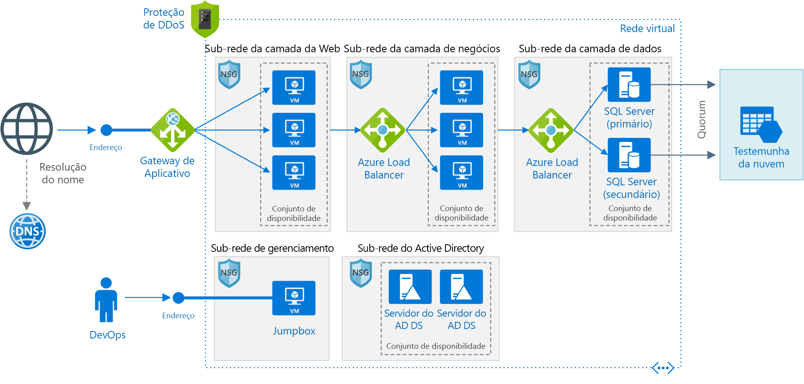

# <a name="windows-n-tier-application-on-azure-with-sql-server"></a><span data-ttu-id="94910-103">Aplicativo de N camadas do Windows no Azure com SQL Server</span><span class="sxs-lookup"><span data-stu-id="94910-103">Windows N-tier application on Azure with SQL Server</span></span>

<span data-ttu-id="94910-104">Essa arquitetura de referência mostra como implantar VMs e uma rede virtual configurada para um aplicativo de [N camadas](../../guide/architecture-styles/n-tier.md) usando o SQL Server no Windows para a camada de dados.</span><span class="sxs-lookup"><span data-stu-id="94910-104">This reference architecture shows how to deploy VMs and a virtual network configured for an [N-tier](../../guide/architecture-styles/n-tier.md) application, using SQL Server on Windows for the data tier.</span></span> <span data-ttu-id="94910-105">[**Implantar esta solução**](#deploy-the-solution).</span><span class="sxs-lookup"><span data-stu-id="94910-105">[**Deploy this solution**](#deploy-the-solution).</span></span>



<span data-ttu-id="94910-107">*Baixe um [Arquivo Visio][visio-download] dessa arquitetura.*</span><span class="sxs-lookup"><span data-stu-id="94910-107">*Download a [Visio file][visio-download] of this architecture.*</span></span>

## <a name="architecture"></a><span data-ttu-id="94910-108">Arquitetura</span><span class="sxs-lookup"><span data-stu-id="94910-108">Architecture</span></span>

<span data-ttu-id="94910-109">A arquitetura tem os seguintes componentes:</span><span class="sxs-lookup"><span data-stu-id="94910-109">The architecture has the following components:</span></span>

- <span data-ttu-id="94910-110">**Grupo de recursos**.</span><span class="sxs-lookup"><span data-stu-id="94910-110">**Resource group**.</span></span> <span data-ttu-id="94910-111">[Grupos de recursos][resource-manager-overview] são utilizados para agrupar os recursos para que eles possam ser gerenciados pelo tempo de vida, o proprietário ou outros critérios.</span><span class="sxs-lookup"><span data-stu-id="94910-111">[Resource groups][resource-manager-overview] are used to group resources so they can be managed by lifetime, owner, or other criteria.</span></span>

- <span data-ttu-id="94910-112">**VNet (Rede Virtual) e sub-redes**.</span><span class="sxs-lookup"><span data-stu-id="94910-112">**Virtual network (VNet) and subnets**.</span></span> <span data-ttu-id="94910-113">Cada VM do Azure é implantada em uma VNet que pode ser segmentada em sub-redes.</span><span class="sxs-lookup"><span data-stu-id="94910-113">Every Azure VM is deployed into a VNet that can be segmented into subnets.</span></span> <span data-ttu-id="94910-114">Sempre crie uma sub-rede separada para cada camada.</span><span class="sxs-lookup"><span data-stu-id="94910-114">Create a separate subnet for each tier.</span></span>

- <span data-ttu-id="94910-115">**Gateway de aplicativo**.</span><span class="sxs-lookup"><span data-stu-id="94910-115">**Application gateway**.</span></span> <span data-ttu-id="94910-116">[O Gateway de Aplicativo do Azure](/azure/application-gateway/) é um balanceador de carga de camada 7.</span><span class="sxs-lookup"><span data-stu-id="94910-116">[Azure Application Gateway](/azure/application-gateway/) is a layer 7 load balancer.</span></span> <span data-ttu-id="94910-117">Nessa arquitetura, ele roteia as solicitações HTTP para o front-end da web.</span><span class="sxs-lookup"><span data-stu-id="94910-117">In this architecture, it routes HTTP requests to the web front end.</span></span> <span data-ttu-id="94910-118">Gateway de Aplicativo também fornece um [firewall do aplicativo Web](/azure/application-gateway/waf-overview) (WAF) que protege o aplicativo contra vulnerabilidades e explorações comuns.</span><span class="sxs-lookup"><span data-stu-id="94910-118">Application Gateway also provides a [web application firewall](/azure/application-gateway/waf-overview) (WAF) that protects the application from common exploits and vulnerabilities.</span></span>

- <span data-ttu-id="94910-119">**NSGs**.</span><span class="sxs-lookup"><span data-stu-id="94910-119">**NSGs**.</span></span> <span data-ttu-id="94910-120">Use os NSGs [grupos de segurança de rede][nsg] para restringir o tráfego de rede na VNet.</span><span class="sxs-lookup"><span data-stu-id="94910-120">Use [network security groups][nsg] (NSGs) to restrict network traffic within the VNet.</span></span> <span data-ttu-id="94910-121">Por exemplo, na arquitetura de três camadas mostrada aqui, a camada de banco de dados não aceita o tráfego de front-end da Web, somente da camada comercial e da sub-rede de gerenciamento.</span><span class="sxs-lookup"><span data-stu-id="94910-121">For example, in the three-tier architecture shown here, the database tier does not accept traffic from the web front end, only from the business tier and the management subnet.</span></span>

- <span data-ttu-id="94910-122">**Proteção contra DDoS**.</span><span class="sxs-lookup"><span data-stu-id="94910-122">**DDoS Protection**.</span></span> <span data-ttu-id="94910-123">Embora a plataforma do Azure forneça proteção básica em relação a ataques de negação de serviço distribuído (DDoS), é recomendável usar [Proteção contra DDoS Standard][ddos], que melhorou os recursos de mitigação de DDoS.</span><span class="sxs-lookup"><span data-stu-id="94910-123">Although the Azure platform provides basic protection against distributed denial of service (DDoS) attacks, we recommend using [DDoS Protection Standard][ddos], which has enhanced DDoS mitigation features.</span></span> <span data-ttu-id="94910-124">Confira [Considerações de segurança](#security-considerations).</span><span class="sxs-lookup"><span data-stu-id="94910-124">See [Security considerations](#security-considerations).</span></span>

- <span data-ttu-id="94910-125">**Máquinas virtuais**.</span><span class="sxs-lookup"><span data-stu-id="94910-125">**Virtual machines**.</span></span> <span data-ttu-id="94910-126">Para obter recomendações sobre como configurar máquinas virtuais, consulte [Executar uma VM do Windows no Azure](./windows-vm.md) e [Executar uma VM do Linux no Azure](./linux-vm.md).</span><span class="sxs-lookup"><span data-stu-id="94910-126">For recommendations on configuring VMs, see [Run a Windows VM on Azure](./windows-vm.md) and [Run a Linux VM on Azure](./linux-vm.md).</span></span>

- <span data-ttu-id="94910-127">**Conjuntos de disponibilidade**.</span><span class="sxs-lookup"><span data-stu-id="94910-127">**Availability sets**.</span></span> <span data-ttu-id="94910-128">Crie um [conjunto de disponibilidade][azure-availability-sets] para cada camada e provisione pelo menos duas VMs em cada camada, o que torna as VMs qualificadas para um [contrato de nível de serviço (SLA)][vm-sla] maior.</span><span class="sxs-lookup"><span data-stu-id="94910-128">Create an [availability set][azure-availability-sets] for each tier, and provision at least two VMs in each tier, which makes the VMs eligible for a higher [service level agreement (SLA)][vm-sla].</span></span>

- <span data-ttu-id="94910-129">**Balanceadores de carga**.</span><span class="sxs-lookup"><span data-stu-id="94910-129">**Load balancers**.</span></span> <span data-ttu-id="94910-130">Use o [Azure Load Balancer] [ load-balancer] para distribuir o tráfego de rede da camada da Web para a camada comercial e da camada comercial para o SQL Server.</span><span class="sxs-lookup"><span data-stu-id="94910-130">Use [Azure Load Balancer][load-balancer] to distribute network traffic from the web tier to the business tier, and from the business tier to SQL Server.</span></span>

- <span data-ttu-id="94910-131">**Endereço IP público**.</span><span class="sxs-lookup"><span data-stu-id="94910-131">**Public IP address**.</span></span> <span data-ttu-id="94910-132">É necessário ter um endereço IP público para que aplicativo possa receber o tráfego da Internet.</span><span class="sxs-lookup"><span data-stu-id="94910-132">A public IP address is needed for the application to receive Internet traffic.</span></span>

- <span data-ttu-id="94910-133">**Jumpbox**.</span><span class="sxs-lookup"><span data-stu-id="94910-133">**Jumpbox**.</span></span> <span data-ttu-id="94910-134">Também chamada de um [host bastião].</span><span class="sxs-lookup"><span data-stu-id="94910-134">Also called a [bastion host].</span></span> <span data-ttu-id="94910-135">Uma VM protegida na rede que os administradores usam para se conectar às outras VMs.</span><span class="sxs-lookup"><span data-stu-id="94910-135">A secure VM on the network that administrators use to connect to the other VMs.</span></span> <span data-ttu-id="94910-136">O jumpbox tem um NSG que permite o tráfego remoto apenas de endereços IP públicos em uma lista segura.</span><span class="sxs-lookup"><span data-stu-id="94910-136">The jumpbox has an NSG that allows remote traffic only from public IP addresses on a safe list.</span></span> <span data-ttu-id="94910-137">O NSG deve permitir o tráfego de RDP (área de trabalho remota).</span><span class="sxs-lookup"><span data-stu-id="94910-137">The NSG should permit remote desktop (RDP) traffic.</span></span>

- <span data-ttu-id="94910-138">**Grupo de Disponibilidade Always On do SQL Server**.</span><span class="sxs-lookup"><span data-stu-id="94910-138">**SQL Server Always On Availability Group**.</span></span> <span data-ttu-id="94910-139">Fornece alta disponibilidade na camada de dados, habilitando replicação e failover.</span><span class="sxs-lookup"><span data-stu-id="94910-139">Provides high availability at the data tier, by enabling replication and failover.</span></span> <span data-ttu-id="94910-140">Usa a tecnologia WSFC (Cluster de Failover do Windows Server) para o failover.</span><span class="sxs-lookup"><span data-stu-id="94910-140">It uses Windows Server Failover Cluster (WSFC) technology for failover.</span></span>

- <span data-ttu-id="94910-141">**Servidores AD DS (Active Directory Domain Services)**.</span><span class="sxs-lookup"><span data-stu-id="94910-141">**Active Directory Domain Services (AD DS) Servers**.</span></span> <span data-ttu-id="94910-142">Os objetos de computação do cluster de failover e suas funções em cluster associadas são criados no Active Directory Domain Services (AD DS).</span><span class="sxs-lookup"><span data-stu-id="94910-142">The computer objects for the failover cluster and its associated clustered roles are created in Active Directory Domain Services (AD DS).</span></span>

- <span data-ttu-id="94910-143">**Testemunha de Nuvem**.</span><span class="sxs-lookup"><span data-stu-id="94910-143">**Cloud Witness**.</span></span> <span data-ttu-id="94910-144">Um cluster de failover requer mais da metade dos seus nós em execução, que é conhecido como ter quorum.</span><span class="sxs-lookup"><span data-stu-id="94910-144">A failover cluster requires more than half of its nodes to be running, which is known as having quorum.</span></span> <span data-ttu-id="94910-145">Se o cluster tem apenas dois nós, uma partição de rede pode fazer com que cada nó pense que é o principal.</span><span class="sxs-lookup"><span data-stu-id="94910-145">If the cluster has just two nodes, a network partition could cause each node to think it's the master node.</span></span> <span data-ttu-id="94910-146">Nesse caso, é necessário uma *testemunha* para desempatar e estabelecer o quorum.</span><span class="sxs-lookup"><span data-stu-id="94910-146">In that case, you need a *witness* to break ties and establish quorum.</span></span> <span data-ttu-id="94910-147">Testemunha é um recurso, como um disco compartilhado, que pode agir como um desempate para estabelecer o quorum.</span><span class="sxs-lookup"><span data-stu-id="94910-147">A witness is a resource such as a shared disk that can act as a tie breaker to establish quorum.</span></span> <span data-ttu-id="94910-148">A Testemunha de Nuvem é um tipo que usa o Armazenamento de Blobs do Azure.</span><span class="sxs-lookup"><span data-stu-id="94910-148">Cloud Witness is a type of witness that uses Azure Blob Storage.</span></span> <span data-ttu-id="94910-149">Para saber mais sobre o conceito de quorum, consulte [Entendendo o cluster e o quorum de pool](/windows-server/storage/storage-spaces/understand-quorum).</span><span class="sxs-lookup"><span data-stu-id="94910-149">To learn more about the concept of quorum, see [Understanding cluster and pool quorum](/windows-server/storage/storage-spaces/understand-quorum).</span></span> <span data-ttu-id="94910-150">Para obter mais informações sobre a Testemunha de Nuvem, consulte [Implantar uma Testemunha de Nuvem para um Cluster de Failover](/windows-server/failover-clustering/deploy-cloud-witness).</span><span class="sxs-lookup"><span data-stu-id="94910-150">For more information about Cloud Witness, see [Deploy a Cloud Witness for a Failover Cluster](/windows-server/failover-clustering/deploy-cloud-witness).</span></span>

- <span data-ttu-id="94910-151">**DNS do Azure**.</span><span class="sxs-lookup"><span data-stu-id="94910-151">**Azure DNS**.</span></span> <span data-ttu-id="94910-152">O [DNS do Azure][azure-dns] é um serviço de hospedagem para domínios DNS.</span><span class="sxs-lookup"><span data-stu-id="94910-152">[Azure DNS][azure-dns] is a hosting service for DNS domains.</span></span> <span data-ttu-id="94910-153">Ele fornece resolução de nomes usando a infraestrutura do Microsoft Azure.</span><span class="sxs-lookup"><span data-stu-id="94910-153">It provides name resolution using Microsoft Azure infrastructure.</span></span> <span data-ttu-id="94910-154">Ao hospedar seus domínios no Azure, você pode gerenciar seus registros DNS usando as mesmas credenciais, APIs, ferramentas e cobrança que seus outros serviços do Azure.</span><span class="sxs-lookup"><span data-stu-id="94910-154">By hosting your domains in Azure, you can manage your DNS records using the same credentials, APIs, tools, and billing as your other Azure services.</span></span>

## <a name="recommendations"></a><span data-ttu-id="94910-155">Recomendações</span><span class="sxs-lookup"><span data-stu-id="94910-155">Recommendations</span></span>

<span data-ttu-id="94910-156">Seus requisitos podem ser diferentes dos requisitos da arquitetura descrita aqui.</span><span class="sxs-lookup"><span data-stu-id="94910-156">Your requirements might differ from the architecture described here.</span></span> <span data-ttu-id="94910-157">Use essas recomendações como ponto de partida.</span><span class="sxs-lookup"><span data-stu-id="94910-157">Use these recommendations as a starting point.</span></span>

### <a name="vnet--subnets"></a><span data-ttu-id="94910-158">VNet / Sub-redes</span><span class="sxs-lookup"><span data-stu-id="94910-158">VNet / Subnets</span></span>

<span data-ttu-id="94910-159">Quando você cria a VNet, determine quantos endereços IP seus recursos em cada sub-rede exigem.</span><span class="sxs-lookup"><span data-stu-id="94910-159">When you create the VNet, determine how many IP addresses your resources in each subnet require.</span></span> <span data-ttu-id="94910-160">Especifique uma máscara de sub-rede e um intervalo de endereços de VNet grande o suficiente para os endereços IP necessários, usando a notação [CIDR].</span><span class="sxs-lookup"><span data-stu-id="94910-160">Specify a subnet mask and a VNet address range large enough for the required IP addresses, using [CIDR] notation.</span></span> <span data-ttu-id="94910-161">Use um espaço de endereço que esteja dentro dos [blocos de endereço IP privados][private-ip-space] padrão, que são 10.0.0.0/8, 172.16.0.0/12 e 192.168.0.0/16.</span><span class="sxs-lookup"><span data-stu-id="94910-161">Use an address space that falls within the standard [private IP address blocks][private-ip-space], which are 10.0.0.0/8, 172.16.0.0/12, and 192.168.0.0/16.</span></span>

<span data-ttu-id="94910-162">Escolha um intervalo de endereços que não se sobreponha ao da rede local para caso seja necessário configurar um gateway entre a VNet e a rede local mais tarde.</span><span class="sxs-lookup"><span data-stu-id="94910-162">Choose an address range that does not overlap with your on-premises network, in case you need to set up a gateway between the VNet and your on-premise network later.</span></span> <span data-ttu-id="94910-163">Depois de criar a VNet, não será possível alterar o intervalo de endereços.</span><span class="sxs-lookup"><span data-stu-id="94910-163">Once you create the VNet, you can't change the address range.</span></span>

<span data-ttu-id="94910-164">Crie as sub-redes levando em conta os requisitos de funcionalidade e de segurança.</span><span class="sxs-lookup"><span data-stu-id="94910-164">Design subnets with functionality and security requirements in mind.</span></span> <span data-ttu-id="94910-165">Todas as VMs na mesma camada ou função devem ir para a mesma sub-rede, que pode ser um limite de segurança.</span><span class="sxs-lookup"><span data-stu-id="94910-165">All VMs within the same tier or role should go into the same subnet, which can be a security boundary.</span></span> <span data-ttu-id="94910-166">Para obter mais informações sobre como criar VNets e sub-redes, consulte [Planejar e criar redes virtuais do Azure][plan-network].</span><span class="sxs-lookup"><span data-stu-id="94910-166">For more information about designing VNets and subnets, see [Plan and design Azure Virtual Networks][plan-network].</span></span>

### <a name="load-balancers"></a><span data-ttu-id="94910-167">Balanceadores de carga</span><span class="sxs-lookup"><span data-stu-id="94910-167">Load balancers</span></span>

<span data-ttu-id="94910-168">Não exponha as VMs diretamente à Internet, concedendo, em vez disso, um endereço IP privado a cada VM.</span><span class="sxs-lookup"><span data-stu-id="94910-168">Don't expose the VMs directly to the Internet, but instead give each VM a private IP address.</span></span> <span data-ttu-id="94910-169">Os clientes se conectam usando o endereço IP público associado com o Gateway de Aplicativo.</span><span class="sxs-lookup"><span data-stu-id="94910-169">Clients connect using the public IP address associated with the Application Gateway.</span></span>

<span data-ttu-id="94910-170">Defina as regras do balanceador de carga para direcionar tráfego de rede para as VMs.</span><span class="sxs-lookup"><span data-stu-id="94910-170">Define load balancer rules to direct network traffic to the VMs.</span></span> <span data-ttu-id="94910-171">Por exemplo, para permitir tráfego HTTP, mapeie a porta 80 da configuração de front-end para a porta 80 no pool de endereços de back-end.</span><span class="sxs-lookup"><span data-stu-id="94910-171">For example, to enable HTTP traffic, map port 80 from the front-end configuration to port 80 on the back-end address pool.</span></span> <span data-ttu-id="94910-172">Quando um cliente envia uma solicitação HTTP para a porta 80, o balanceador de carga seleciona um endereço IP de back-end usando um [algoritmo de hash][load-balancer-hashing] que inclui o endereço IP de origem.</span><span class="sxs-lookup"><span data-stu-id="94910-172">When a client sends an HTTP request to port 80, the load balancer selects a back-end IP address by using a [hashing algorithm][load-balancer-hashing] that includes the source IP address.</span></span> <span data-ttu-id="94910-173">As solicitações de cliente são distribuídas por todas as VMs no pool de endereços de back-end.</span><span class="sxs-lookup"><span data-stu-id="94910-173">Client requests are distributed across all the VMs in the back-end address pool.</span></span>

### <a name="network-security-groups"></a><span data-ttu-id="94910-174">Grupos de segurança de rede</span><span class="sxs-lookup"><span data-stu-id="94910-174">Network security groups</span></span>

<span data-ttu-id="94910-175">Use as regras de NSG para restringir o tráfego entre as camadas.</span><span class="sxs-lookup"><span data-stu-id="94910-175">Use NSG rules to restrict traffic between tiers.</span></span> <span data-ttu-id="94910-176">Na arquitetura de três camadas mostrada acima, a camada da Web não se comunica diretamente com a camada de banco de dados.</span><span class="sxs-lookup"><span data-stu-id="94910-176">In the three-tier architecture shown above, the web tier does not communicate directly with the database tier.</span></span> <span data-ttu-id="94910-177">Para impor isso, a camada de banco de dados deve bloquear o tráfego de entrada da sub-rede da camada da Web.</span><span class="sxs-lookup"><span data-stu-id="94910-177">To enforce this, the database tier should block incoming traffic from the web tier subnet.</span></span>

1. <span data-ttu-id="94910-178">Negue todo o tráfego de entrada do VNet.</span><span class="sxs-lookup"><span data-stu-id="94910-178">Deny all inbound traffic from the VNet.</span></span> <span data-ttu-id="94910-179">(Use a marca `VIRTUAL_NETWORK` na regra.)</span><span class="sxs-lookup"><span data-stu-id="94910-179">(Use the `VIRTUAL_NETWORK` tag in the rule.)</span></span>
2. <span data-ttu-id="94910-180">Permita o tráfego de entrada da sub-rede de camada de negócios.</span><span class="sxs-lookup"><span data-stu-id="94910-180">Allow inbound traffic from the business tier subnet.</span></span>
3. <span data-ttu-id="94910-181">Permita o tráfego de entrada da própria sub-rede de camada de dados.</span><span class="sxs-lookup"><span data-stu-id="94910-181">Allow inbound traffic from the database tier subnet itself.</span></span> <span data-ttu-id="94910-182">Essa regra permite a comunicação entre as VMs de banco de dados, que é necessária para failover e replicação de banco de dados.</span><span class="sxs-lookup"><span data-stu-id="94910-182">This rule allows communication between the database VMs, which is needed for database replication and failover.</span></span>
4. <span data-ttu-id="94910-183">Permita o tráfego RDP (porta 3389) da sub-rede jumpbox.</span><span class="sxs-lookup"><span data-stu-id="94910-183">Allow RDP traffic (port 3389) from the jumpbox subnet.</span></span> <span data-ttu-id="94910-184">Essa regra permite que os administradores se conectem à camada de banco de dados do jumpbox.</span><span class="sxs-lookup"><span data-stu-id="94910-184">This rule lets administrators connect to the database tier from the jumpbox.</span></span>

<span data-ttu-id="94910-185">Criar regras de 2 &ndash; 4 com prioridade mais alta que a primeira regra, para que elas a substituam.</span><span class="sxs-lookup"><span data-stu-id="94910-185">Create rules 2 &ndash; 4 with higher priority than the first rule, so they override it.</span></span>

### <a name="sql-server-always-on-availability-groups"></a><span data-ttu-id="94910-186">Grupos de Disponibilidade Always On do SQL Server</span><span class="sxs-lookup"><span data-stu-id="94910-186">SQL Server Always On Availability Groups</span></span>

<span data-ttu-id="94910-187">Recomendamos usar os [Grupos de Disponibilidade Always On][sql-alwayson] para alta disponibilidade no SQL Server.</span><span class="sxs-lookup"><span data-stu-id="94910-187">We recommend [Always On Availability Groups][sql-alwayson] for SQL Server high availability.</span></span> <span data-ttu-id="94910-188">Antes do Windows Server 2016, os Grupos de Disponibilidade Always On exigiam um controlador de domínio e todos os nós no grupo de disponibilidade precisavam estar no mesmo domínio do AD.</span><span class="sxs-lookup"><span data-stu-id="94910-188">Prior to Windows Server 2016, Always On Availability Groups require a domain controller, and all nodes in the availability group must be in the same AD domain.</span></span>

<span data-ttu-id="94910-189">Outras camadas se conectam ao banco de dados por meio de um [ouvinte do grupo de disponibilidade][sql-alwayson-listeners].</span><span class="sxs-lookup"><span data-stu-id="94910-189">Other tiers connect to the database through an [availability group listener][sql-alwayson-listeners].</span></span> <span data-ttu-id="94910-190">O ouvinte permite que um cliente SQL se conecte sem saber o nome da instância física do SQL Server.</span><span class="sxs-lookup"><span data-stu-id="94910-190">The listener enables a SQL client to connect without knowing the name of the physical instance of SQL Server.</span></span> <span data-ttu-id="94910-191">VMs que acessam o banco de dados precisam ser ingressadas no domínio.</span><span class="sxs-lookup"><span data-stu-id="94910-191">VMs that access the database must be joined to the domain.</span></span> <span data-ttu-id="94910-192">O cliente (neste caso, outra camada) usa o DNS para resolver o nome da rede virtual do ouvinte em endereços IP.</span><span class="sxs-lookup"><span data-stu-id="94910-192">The client (in this case, another tier) uses DNS to resolve the listener's virtual network name into IP addresses.</span></span>

<span data-ttu-id="94910-193">Configure um grupo de disponibilidade Always On do SQL Server da seguinte maneira:</span><span class="sxs-lookup"><span data-stu-id="94910-193">Configure the SQL Server Always On Availability Group as follows:</span></span>

1. <span data-ttu-id="94910-194">Crie um cluster WSFC (Clustering de Failover do Windows Server), um Grupo de Disponibilidade Always On do SQL Server e uma réplica primária.</span><span class="sxs-lookup"><span data-stu-id="94910-194">Create a Windows Server Failover Clustering (WSFC) cluster, a SQL Server Always On Availability Group, and a primary replica.</span></span> <span data-ttu-id="94910-195">Para obter mais informações, consulte [Introdução aos Grupos de disponibilidade Always On][sql-alwayson-getting-started].</span><span class="sxs-lookup"><span data-stu-id="94910-195">For more information, see [Getting Started with Always On Availability Groups][sql-alwayson-getting-started].</span></span>
2. <span data-ttu-id="94910-196">Crie um balanceador de carga interno com um endereço IP privado estático.</span><span class="sxs-lookup"><span data-stu-id="94910-196">Create an internal load balancer with a static private IP address.</span></span>
3. <span data-ttu-id="94910-197">Crie um ouvinte do grupo de disponibilidade e mapeie o nome DNS do ouvinte para o endereço IP de um balanceador de carga interno.</span><span class="sxs-lookup"><span data-stu-id="94910-197">Create an availability group listener, and map the listener's DNS name to the IP address of an internal load balancer.</span></span>
4. <span data-ttu-id="94910-198">Crie uma regra do balanceador de carga para a porta de escuta do SQL Server (porta TCP 1433 por padrão).</span><span class="sxs-lookup"><span data-stu-id="94910-198">Create a load balancer rule for the SQL Server listening port (TCP port 1433 by default).</span></span> <span data-ttu-id="94910-199">A regra do balanceador de carga deve habilitar *IP flutuante*, também chamado de Retorno de Servidor Direto.</span><span class="sxs-lookup"><span data-stu-id="94910-199">The load balancer rule must enable *floating IP*, also called Direct Server Return.</span></span> <span data-ttu-id="94910-200">Isso faz com que a VM responda diretamente para o cliente, o que permite uma conexão direta com a réplica primária.</span><span class="sxs-lookup"><span data-stu-id="94910-200">This causes the VM to reply directly to the client, which enables a direct connection to the primary replica.</span></span>

   > [!NOTE]
   > <span data-ttu-id="94910-201">Quando o IP flutuante está habilitado, o número da porta de front-end deve ser igual ao número da porta de back-end na regra do balanceador de carga.</span><span class="sxs-lookup"><span data-stu-id="94910-201">When floating IP is enabled, the front-end port number must be the same as the back-end port number in the load balancer rule.</span></span>
   >

<span data-ttu-id="94910-202">Quando um cliente SQL tenta se conectar, o balanceador de carga roteia a solicitação de conexão para a réplica primária.</span><span class="sxs-lookup"><span data-stu-id="94910-202">When a SQL client tries to connect, the load balancer routes the connection request to the primary replica.</span></span> <span data-ttu-id="94910-203">Se houver um failover para outra réplica, o balanceador de carga encaminhará automaticamente as novas solicitações para uma nova réplica primária.</span><span class="sxs-lookup"><span data-stu-id="94910-203">If there is a failover to another replica, the load balancer automatically routes new requests to a new primary replica.</span></span> <span data-ttu-id="94910-204">Para obter mais informações, consulte [Configurar um ouvinte de ILB para Grupos de Disponibilidade Always On do SQL Server][sql-alwayson-ilb].</span><span class="sxs-lookup"><span data-stu-id="94910-204">For more information, see [Configure an ILB listener for SQL Server Always On Availability Groups][sql-alwayson-ilb].</span></span>

<span data-ttu-id="94910-205">Durante um failover, as conexões de cliente existentes são fechadas.</span><span class="sxs-lookup"><span data-stu-id="94910-205">During a failover, existing client connections are closed.</span></span> <span data-ttu-id="94910-206">Após a conclusão do failover, novas conexões serão roteadas para a nova réplica primária.</span><span class="sxs-lookup"><span data-stu-id="94910-206">After the failover completes, new connections will be routed to the new primary replica.</span></span>

<span data-ttu-id="94910-207">Se seu aplicativo realiza muito mais leituras do que gravações, você pode descarregar algumas das consultas somente leitura para uma réplica secundária.</span><span class="sxs-lookup"><span data-stu-id="94910-207">If your application makes significantly more reads than writes, you can offload some of the read-only queries to a secondary replica.</span></span> <span data-ttu-id="94910-208">Consulte [Usar um ouvinte para se conectar a uma réplica secundária somente leitura (roteamento somente leitura)][sql-alwayson-read-only-routing].</span><span class="sxs-lookup"><span data-stu-id="94910-208">See [Using a Listener to Connect to a Read-Only Secondary Replica (Read-Only Routing)][sql-alwayson-read-only-routing].</span></span>

<span data-ttu-id="94910-209">Teste a implantação por [forçando um failover manual][sql-alwayson-force-failover] do grupo de disponibilidade.</span><span class="sxs-lookup"><span data-stu-id="94910-209">Test your deployment by [forcing a manual failover][sql-alwayson-force-failover] of the availability group.</span></span>

### <a name="jumpbox"></a><span data-ttu-id="94910-210">Jumpbox</span><span class="sxs-lookup"><span data-stu-id="94910-210">Jumpbox</span></span>

<span data-ttu-id="94910-211">Não permita o acesso RDP da Internet pública para as VMs que executam a carga de trabalho do aplicativo.</span><span class="sxs-lookup"><span data-stu-id="94910-211">Don't allow RDP access from the public Internet to the VMs that run the application workload.</span></span> <span data-ttu-id="94910-212">Em vez disso, todo o acesso RDP a essas VMs deve ocorrer por meio do jumpbox.</span><span class="sxs-lookup"><span data-stu-id="94910-212">Instead, all RDP access to these VMs must come through the jumpbox.</span></span> <span data-ttu-id="94910-213">Um administrador faz logon no jumpbox e, em seguida, faz logon na VM por meio do jumpbox.</span><span class="sxs-lookup"><span data-stu-id="94910-213">An administrator logs into the jumpbox, and then logs into the other VM from the jumpbox.</span></span> <span data-ttu-id="94910-214">O jumpbox permite que tráfego RDP da Internet, mas apenas de endereços IP conhecidos e seguros.</span><span class="sxs-lookup"><span data-stu-id="94910-214">The jumpbox allows RDP traffic from the Internet, but only from known, safe IP addresses.</span></span>

<span data-ttu-id="94910-215">O jumpbox tem requisitos de desempenho mínimo, por isso, selecione uma VM de tamanho pequeno.</span><span class="sxs-lookup"><span data-stu-id="94910-215">The jumpbox has minimal performance requirements, so select a small VM size.</span></span> <span data-ttu-id="94910-216">Crie um [endereço IP público] para o jumpbox.</span><span class="sxs-lookup"><span data-stu-id="94910-216">Create a [public IP address] for the jumpbox.</span></span> <span data-ttu-id="94910-217">Coloque o jumpbox na mesma VNet que as outras VMs, mas em uma sub-rede de gerenciamento separada.</span><span class="sxs-lookup"><span data-stu-id="94910-217">Place the jumpbox in the same VNet as the other VMs, but in a separate management subnet.</span></span>

<span data-ttu-id="94910-218">Para proteger o jumpbox, adicione uma regra NSG que permite conexões RDP somente de um conjunto seguro de endereços IP públicos.</span><span class="sxs-lookup"><span data-stu-id="94910-218">To secure the jumpbox, add an NSG rule that allows RDP connections only from a safe set of public IP addresses.</span></span> <span data-ttu-id="94910-219">Configure os NSGs para outras sub-redes para permitir o tráfego RDP da sub-rede de gerenciamento.</span><span class="sxs-lookup"><span data-stu-id="94910-219">Configure the NSGs for the other subnets to allow RDP traffic from the management subnet.</span></span>

## <a name="scalability-considerations"></a><span data-ttu-id="94910-220">Considerações sobre escalabilidade</span><span class="sxs-lookup"><span data-stu-id="94910-220">Scalability considerations</span></span>

<span data-ttu-id="94910-221">Para as camadas Web e business, considere o uso de [conjuntos de dimensionamento de máquinas virtuais][vmss], em vez de implantar VMs separadas em um conjunto de disponibilidade.</span><span class="sxs-lookup"><span data-stu-id="94910-221">For the web and business tiers, consider using [virtual machine scale sets][vmss], instead of deploying separate VMs into an availability set.</span></span> <span data-ttu-id="94910-222">Um conjunto de dimensionamento facilita a implantação e gerenciamento de um conjunto de VMs idênticas e o dimensionamento automático de VMs com base em métricas de desempenho.</span><span class="sxs-lookup"><span data-stu-id="94910-222">A scale set makes it easy to deploy and manage a set of identical VMs, and autoscale the VMs based on performance metrics.</span></span> <span data-ttu-id="94910-223">À medida que a carga nas VMs aumenta, VMs adicionais são acrescentadas automaticamente ao balanceador de carga.</span><span class="sxs-lookup"><span data-stu-id="94910-223">As the load on the VMs increases, additional VMs are automatically added to the load balancer.</span></span> <span data-ttu-id="94910-224">Considere usar os conjuntos de dimensionamento se você precisar aumentar as VMs rapidamente ou se precisar de dimensionamento automático.</span><span class="sxs-lookup"><span data-stu-id="94910-224">Consider scale sets if you need to quickly scale out VMs, or need to autoscale.</span></span>

<span data-ttu-id="94910-225">Há duas maneiras básicas de configurar as VMs implantadas em um conjunto de dimensionamento:</span><span class="sxs-lookup"><span data-stu-id="94910-225">There are two basic ways to configure VMs deployed in a scale set:</span></span>

- <span data-ttu-id="94910-226">Use as extensões para configurar a VM depois que ela é implantada.</span><span class="sxs-lookup"><span data-stu-id="94910-226">Use extensions to configure the VM after it's deployed.</span></span> <span data-ttu-id="94910-227">Com essa abordagem, novas instâncias de VM podem levar mais tempo para ser iniciadas do que uma VM sem extensões.</span><span class="sxs-lookup"><span data-stu-id="94910-227">With this approach, new VM instances may take longer to start up than a VM with no extensions.</span></span>

- <span data-ttu-id="94910-228">Implante um [disco gerenciado](/azure/storage/storage-managed-disks-overview) com uma imagem de disco personalizada.</span><span class="sxs-lookup"><span data-stu-id="94910-228">Deploy a [managed disk](/azure/storage/storage-managed-disks-overview) with a custom disk image.</span></span> <span data-ttu-id="94910-229">Essa opção pode ser mais rápida de implantar.</span><span class="sxs-lookup"><span data-stu-id="94910-229">This option may be quicker to deploy.</span></span> <span data-ttu-id="94910-230">Porém, isso requer que você mantenha a imagem atualizada.</span><span class="sxs-lookup"><span data-stu-id="94910-230">However, it requires you to keep the image up-to-date.</span></span>

<span data-ttu-id="94910-231">Para obter mais informações, confira [Considerações de design para conjuntos de dimensionamento][vmss-design].</span><span class="sxs-lookup"><span data-stu-id="94910-231">For more information, see [Design considerations for scale sets][vmss-design].</span></span>

> [!TIP]
> <span data-ttu-id="94910-232">Ao usar qualquer solução de dimensionamento automático, teste-a com cargas de trabalho no nível de produção com bastante antecedência.</span><span class="sxs-lookup"><span data-stu-id="94910-232">When using any autoscale solution, test it with production-level workloads well in advance.</span></span>

<span data-ttu-id="94910-233">Cada assinatura do Azure tem limites padrão em vigor, incluindo um número máximo de VMs por região.</span><span class="sxs-lookup"><span data-stu-id="94910-233">Each Azure subscription has default limits in place, including a maximum number of VMs per region.</span></span> <span data-ttu-id="94910-234">Você pode aumentar o limite enviando uma solicitação de suporte.</span><span class="sxs-lookup"><span data-stu-id="94910-234">You can increase the limit by filing a support request.</span></span> <span data-ttu-id="94910-235">Para saber mais, confira [Assinatura e limites de serviço, cotas e restrições do Azure][subscription-limits].</span><span class="sxs-lookup"><span data-stu-id="94910-235">For more information, see [Azure subscription and service limits, quotas, and constraints][subscription-limits].</span></span>

## <a name="availability-considerations"></a><span data-ttu-id="94910-236">Considerações sobre disponibilidade</span><span class="sxs-lookup"><span data-stu-id="94910-236">Availability considerations</span></span>

<span data-ttu-id="94910-237">Se você não usar conjuntos de dimensionamento de máquinas virtuais, coloque as VMs para a mesma camada em um conjunto de disponibilidade.</span><span class="sxs-lookup"><span data-stu-id="94910-237">If you don't use virtual machine scale sets, put VMs for the same tier into an availability set.</span></span> <span data-ttu-id="94910-238">Crie pelo menos duas VMs no conjunto de disponibilidade para dar suporte ao [SLA de disponibilidade para VMs do Azure][vm-sla].</span><span class="sxs-lookup"><span data-stu-id="94910-238">Create at least two VMs in the availability set to support the [availability SLA for Azure VMs][vm-sla].</span></span> <span data-ttu-id="94910-239">Para obter mais informações, consulte [Gerenciar a disponibilidade de máquinas virtuais][availability-set].</span><span class="sxs-lookup"><span data-stu-id="94910-239">For more information, see [Manage the availability of virtual machines][availability-set].</span></span> <span data-ttu-id="94910-240">Os conjuntos de dimensionamento automaticamente usam *grupos de posicionamento*, que funcionam como um conjunto de disponibilidade implícito.</span><span class="sxs-lookup"><span data-stu-id="94910-240">Scale sets automatically use *placement groups*, which act as an implicit availability set.</span></span>

<span data-ttu-id="94910-241">O balanceador de carga utiliza [investigações de integridade][health-probes] para monitorar a disponibilidade de instâncias de VM.</span><span class="sxs-lookup"><span data-stu-id="94910-241">The load balancer uses [health probes][health-probes] to monitor the availability of VM instances.</span></span> <span data-ttu-id="94910-242">Se uma investigação não puder acessar uma instância dentro de um período de tempo limite, o balanceador de carga parará de enviar tráfego para essa VM.</span><span class="sxs-lookup"><span data-stu-id="94910-242">If a probe can't reach an instance within a timeout period, the load balancer stops sending traffic to that VM.</span></span> <span data-ttu-id="94910-243">Contudo, o balanceador de carga continuará a investigar e, se a VM ficar disponível novamente, o balanceador de carga reiniciará o envio de tráfego para ela.</span><span class="sxs-lookup"><span data-stu-id="94910-243">However, the load balancer will continue to probe, and if the VM becomes available again, the load balancer resumes sending traffic to that VM.</span></span>

<span data-ttu-id="94910-244">Aqui estão algumas recomendações sobre as investigações de integridade do balanceador de carga:</span><span class="sxs-lookup"><span data-stu-id="94910-244">Here are some recommendations on load balancer health probes:</span></span>

- <span data-ttu-id="94910-245">As investigações podem testar HTTP ou TCP.</span><span class="sxs-lookup"><span data-stu-id="94910-245">Probes can test either HTTP or TCP.</span></span> <span data-ttu-id="94910-246">Se suas VMs são executadas em um servidor HTTP, crie uma investigação HTTP.</span><span class="sxs-lookup"><span data-stu-id="94910-246">If your VMs run an HTTP server, create an HTTP probe.</span></span> <span data-ttu-id="94910-247">Caso contrário, crie uma investigação TCP.</span><span class="sxs-lookup"><span data-stu-id="94910-247">Otherwise create a TCP probe.</span></span>
- <span data-ttu-id="94910-248">Para uma investigação HTTP, especifique o caminho para um ponto de extremidade HTTP.</span><span class="sxs-lookup"><span data-stu-id="94910-248">For an HTTP probe, specify the path to an HTTP endpoint.</span></span> <span data-ttu-id="94910-249">A investigação verifica uma resposta HTTP 200 para esse caminho.</span><span class="sxs-lookup"><span data-stu-id="94910-249">The probe checks for an HTTP 200 response from this path.</span></span> <span data-ttu-id="94910-250">Esse caminho pode ser o caminho raiz (“/”) ou um ponto de extremidade de monitoramento de integridade que implementa lógica personalizada para verificar a integridade do aplicativo.</span><span class="sxs-lookup"><span data-stu-id="94910-250">This path can be the root path ("/"), or a health-monitoring endpoint that implements some custom logic to check the health of the application.</span></span> <span data-ttu-id="94910-251">O ponto de extremidade deve permitir solicitações HTTP anônimas.</span><span class="sxs-lookup"><span data-stu-id="94910-251">The endpoint must allow anonymous HTTP requests.</span></span>
- <span data-ttu-id="94910-252">A investigação é enviada de um endereço IP [conhecido][health-probe-ip], 168.63.129.16.</span><span class="sxs-lookup"><span data-stu-id="94910-252">The probe is sent from a [known IP address][health-probe-ip], 168.63.129.16.</span></span> <span data-ttu-id="94910-253">Não bloqueie o tráfego de ou para esse IP em nenhuma política de firewall ou regra de NSG.</span><span class="sxs-lookup"><span data-stu-id="94910-253">Don't block traffic to or from this IP address in any firewall policies or NSG rules.</span></span>
- <span data-ttu-id="94910-254">Use os [logs de investigação de integridade][health-probe-log] para exibir o status das investigações de integridade.</span><span class="sxs-lookup"><span data-stu-id="94910-254">Use [health probe logs][health-probe-log] to view the status of the health probes.</span></span> <span data-ttu-id="94910-255">Habilite o registro em log no Portal do Azure para cada balanceador de carga.</span><span class="sxs-lookup"><span data-stu-id="94910-255">Enable logging in the Azure portal for each load balancer.</span></span> <span data-ttu-id="94910-256">Os logs são gravados no Armazenamento de Blobs do Azure.</span><span class="sxs-lookup"><span data-stu-id="94910-256">Logs are written to Azure Blob storage.</span></span> <span data-ttu-id="94910-257">Os logs mostram quantas VMs não estão recebendo o tráfego de rede devido a respostas de investigação com falha.</span><span class="sxs-lookup"><span data-stu-id="94910-257">The logs show how many VMs aren't getting network traffic because of failed probe responses.</span></span>

<span data-ttu-id="94910-258">Se você precisar de disponibilidade mais alta do que a fornecida pelo [SLA do Azure SLA para VMs][vm-sla], replique o aplicativo em duas regiões e use o Gerenciador de Tráfego do Azure para failover.</span><span class="sxs-lookup"><span data-stu-id="94910-258">If you need higher availability than the [Azure SLA for VMs][vm-sla] provides, consider replication the application across two regions, using Azure Traffic Manager for failover.</span></span> <span data-ttu-id="94910-259">Para obter mais informações, consulte [Aplicativo de N camadas de várias regiões para alta disponibilidade][multi-dc].</span><span class="sxs-lookup"><span data-stu-id="94910-259">For more information, see [Multi-region N-tier application for high availability][multi-dc].</span></span>

## <a name="security-considerations"></a><span data-ttu-id="94910-260">Considerações de segurança</span><span class="sxs-lookup"><span data-stu-id="94910-260">Security considerations</span></span>

<span data-ttu-id="94910-261">Redes virtuais são um limite de isolamento de tráfego no Azure.</span><span class="sxs-lookup"><span data-stu-id="94910-261">Virtual networks are a traffic isolation boundary in Azure.</span></span> <span data-ttu-id="94910-262">As VMs em uma VNet não podem se comunicar diretamente com VMs em uma VNet diferente.</span><span class="sxs-lookup"><span data-stu-id="94910-262">VMs in one VNet can't communicate directly with VMs in a different VNet.</span></span> <span data-ttu-id="94910-263">As VMs na mesma VNet podem se comunicar, a menos que você crie NSGs ([Grupos de Segurança de Rede][nsg]) para restringir o tráfego.</span><span class="sxs-lookup"><span data-stu-id="94910-263">VMs within the same VNet can communicate, unless you create [network security groups][nsg] (NSGs) to restrict traffic.</span></span> <span data-ttu-id="94910-264">Para obter mais informações, consulte [Serviços em nuvem da Microsoft e segurança de rede][network-security].</span><span class="sxs-lookup"><span data-stu-id="94910-264">For more information, see [Microsoft cloud services and network security][network-security].</span></span>

<span data-ttu-id="94910-265">**Rede de Perímetro**.</span><span class="sxs-lookup"><span data-stu-id="94910-265">**DMZ**.</span></span> <span data-ttu-id="94910-266">Considere adicionar uma NVA (solução de virtualização de rede) para criar uma DMZ entre a Internet e a rede virtual do Azure.</span><span class="sxs-lookup"><span data-stu-id="94910-266">Consider adding a network virtual appliance (NVA) to create a DMZ between the Internet and the Azure virtual network.</span></span> <span data-ttu-id="94910-267">NVA é um termo genérico para uma solução de virtualização que pode executar tarefas relacionadas à rede, como firewall, inspeção de pacotes, auditoria e roteamento personalizado.</span><span class="sxs-lookup"><span data-stu-id="94910-267">NVA is a generic term for a virtual appliance that can perform network-related tasks, such as firewall, packet inspection, auditing, and custom routing.</span></span> <span data-ttu-id="94910-268">Para obter mais informações, consulte [Implementação de uma DMZ entre o Azure e a Internet][dmz].</span><span class="sxs-lookup"><span data-stu-id="94910-268">For more information, see [Implementing a DMZ between Azure and the Internet][dmz].</span></span>

<span data-ttu-id="94910-269">**Criptografia**.</span><span class="sxs-lookup"><span data-stu-id="94910-269">**Encryption**.</span></span> <span data-ttu-id="94910-270">Criptografe dados confidenciais em repouso e use o [Azure Key Vault][azure-key-vault] para gerenciar as chaves de criptografia de banco de dados.</span><span class="sxs-lookup"><span data-stu-id="94910-270">Encrypt sensitive data at rest and use [Azure Key Vault][azure-key-vault] to manage the database encryption keys.</span></span> <span data-ttu-id="94910-271">O Key Vault pode armazenar chaves de criptografia em HSMs (módulos de segurança de hardware).</span><span class="sxs-lookup"><span data-stu-id="94910-271">Key Vault can store encryption keys in hardware security modules (HSMs).</span></span> <span data-ttu-id="94910-272">Para mais informações, consulte [Configurar a Integração do Azure Key Vault para o SQL nas VMs do Azure][sql-keyvault].</span><span class="sxs-lookup"><span data-stu-id="94910-272">For more information, see [Configure Azure Key Vault Integration for SQL Server on Azure VMs][sql-keyvault].</span></span> <span data-ttu-id="94910-273">Também é recomendado para armazenar segredos do aplicativo, como cadeias de caracteres de conexão de banco de dados, no cofre de chaves.</span><span class="sxs-lookup"><span data-stu-id="94910-273">It's also recommended to store application secrets, such as database connection strings, in Key Vault.</span></span>

<span data-ttu-id="94910-274">**Proteção contra DDoS**.</span><span class="sxs-lookup"><span data-stu-id="94910-274">**DDoS protection**.</span></span> <span data-ttu-id="94910-275">A plataforma do Azure fornece a proteção contra DDoS básica por padrão.</span><span class="sxs-lookup"><span data-stu-id="94910-275">The Azure platform provides basic DDoS protection by default.</span></span> <span data-ttu-id="94910-276">Essa proteção básica se destina a proteger a infraestrutura do Azure como um todo.</span><span class="sxs-lookup"><span data-stu-id="94910-276">This basic protection is targeted at protecting the Azure infrastructure as a whole.</span></span> <span data-ttu-id="94910-277">Embora a proteção contra DDoS básica esteja habilitada automaticamente, é recomendável usar a [Proteção contra DDoS Standard][ddos].</span><span class="sxs-lookup"><span data-stu-id="94910-277">Although basic DDoS protection is automatically enabled, we recommend using [DDoS Protection Standard][ddos].</span></span> <span data-ttu-id="94910-278">A proteção Standard utiliza ajuste adaptável, com base nos padrões de tráfego de rede do seu aplicativo, para detectar ameaças.</span><span class="sxs-lookup"><span data-stu-id="94910-278">Standard protection uses adaptive tuning, based on your application's network traffic patterns, to detect threats.</span></span> <span data-ttu-id="94910-279">Isso permite aplicar mitigações de risco contra ataques de DDoS que podem não ser detectadas pelas políticas de DDoS de toda a infraestrutura.</span><span class="sxs-lookup"><span data-stu-id="94910-279">This allows it to apply mitigations against DDoS attacks that might go unnoticed by the infrastructure-wide DDoS policies.</span></span> <span data-ttu-id="94910-280">A proteção Standard também fornece alertas, telemetria e análise por meio do Azure Monitor.</span><span class="sxs-lookup"><span data-stu-id="94910-280">Standard protection also provides alerting, telemetry, and analytics through Azure Monitor.</span></span> <span data-ttu-id="94910-281">Para saber mais, confira [Proteção contra DDoS do Azure: Melhores práticas e arquiteturas de referência][ddos-best-practices].</span><span class="sxs-lookup"><span data-stu-id="94910-281">For more information, see [Azure DDoS Protection: Best practices and reference architectures][ddos-best-practices].</span></span>

## <a name="deploy-the-solution"></a><span data-ttu-id="94910-282">Implantar a solução</span><span class="sxs-lookup"><span data-stu-id="94910-282">Deploy the solution</span></span>

<span data-ttu-id="94910-283">Uma implantação para essa arquitetura de referência está disponível no [GitHub][github-folder].</span><span class="sxs-lookup"><span data-stu-id="94910-283">A deployment for this reference architecture is available on [GitHub][github-folder].</span></span> <span data-ttu-id="94910-284">A implantação inteira pode levar até duas horas, que inclui a execução de scripts para configurar o AD DS, o cluster de failover do Windows Server e o grupo de disponibilidade do SQL Server.</span><span class="sxs-lookup"><span data-stu-id="94910-284">The entire deployment can take up to two hours, which includes running the scripts to configure AD DS, the Windows Server failover cluster, and the SQL Server availability group.</span></span>

### <a name="prerequisites"></a><span data-ttu-id="94910-285">Pré-requisitos</span><span class="sxs-lookup"><span data-stu-id="94910-285">Prerequisites</span></span>

[!INCLUDE [ref-arch-prerequisites.md](../../../includes/ref-arch-prerequisites.md)]

### <a name="deployment-steps"></a><span data-ttu-id="94910-286">Etapas de implantação.</span><span class="sxs-lookup"><span data-stu-id="94910-286">Deployment steps</span></span>

1. <span data-ttu-id="94910-287">Execute o seguinte comando para criar um grupo de recursos.</span><span class="sxs-lookup"><span data-stu-id="94910-287">Run the following command to create a resource group.</span></span>

    ```azurecli
    az group create --location <location> --name <resource-group-name>
    ```

2. <span data-ttu-id="94910-288">Execute o seguinte comando para criar uma conta de Armazenamento para a Testemunha de Nuvem.</span><span class="sxs-lookup"><span data-stu-id="94910-288">Run the following command to create a Storage account for the Cloud Witness.</span></span>

    ```azurecli
    az storage account create --location <location> \
      --name <storage-account-name> \
      --resource-group <resource-group-name> \
      --sku Standard_LRS
    ```

3. <span data-ttu-id="94910-289">Navegue para a pasta `virtual-machines\n-tier-windows` do repositório GitHub de arquiteturas de referência.</span><span class="sxs-lookup"><span data-stu-id="94910-289">Navigate to the `virtual-machines\n-tier-windows` folder of the reference architectures GitHub repository.</span></span>

4. <span data-ttu-id="94910-290">Abra o arquivo `n-tier-windows.json` .</span><span class="sxs-lookup"><span data-stu-id="94910-290">Open the `n-tier-windows.json` file.</span></span>

5. <span data-ttu-id="94910-291">Procurar todas as instâncias de "witnessStorageBlobEndPoint" e substitua o texto do espaço reservado pelo nome da conta de Armazenamento da etapa 2.</span><span class="sxs-lookup"><span data-stu-id="94910-291">Search for all instances of "witnessStorageBlobEndPoint" and replace the placeholder text with the name of the Storage account from step 2.</span></span>

    ```json
    "witnessStorageBlobEndPoint": "https://[replace-with-storageaccountname].blob.core.windows.net",
    ```

6. <span data-ttu-id="94910-292">Execute o comando a seguir para enumerar as chaves de conta para a conta de armazenamento.</span><span class="sxs-lookup"><span data-stu-id="94910-292">Run the following command to list the account keys for the storage account.</span></span>

    ```azurecli
    az storage account keys list \
      --account-name <storage-account-name> \
      --resource-group <resource-group-name>
    ```

    <span data-ttu-id="94910-293">A saída deve parecer com o seguinte.</span><span class="sxs-lookup"><span data-stu-id="94910-293">The output should look like the following.</span></span> <span data-ttu-id="94910-294">Copie o valor de `key1`.</span><span class="sxs-lookup"><span data-stu-id="94910-294">Copy the value of `key1`.</span></span>

    ```json
    [
    {
        "keyName": "key1",
        "permissions": "Full",
        "value": "..."
    },
    {
        "keyName": "key2",
        "permissions": "Full",
        "value": "..."
    }
    ]
    ```

7. <span data-ttu-id="94910-295">No arquivo `n-tier-windows.json`, procure todas as instâncias de "witnessStorageAccountKey e cole na chave de conta.</span><span class="sxs-lookup"><span data-stu-id="94910-295">In the `n-tier-windows.json` file, search for all instances of "witnessStorageAccountKey" and paste in the account key.</span></span>

    ```json
    "witnessStorageAccountKey": "[replace-with-storagekey]"
    ```

8. <span data-ttu-id="94910-296">No arquivo `n-tier-windows.json`, procure todas as instâncias de `[replace-with-password]` e `[replace-with-sql-password]` substitua-as por uma senha forte.</span><span class="sxs-lookup"><span data-stu-id="94910-296">In the `n-tier-windows.json` file, search for all instances of `[replace-with-password]` and `[replace-with-sql-password]` replace them with a strong password.</span></span> <span data-ttu-id="94910-297">Salve o arquivo.</span><span class="sxs-lookup"><span data-stu-id="94910-297">Save the file.</span></span>

    > [!NOTE]
    > <span data-ttu-id="94910-298">Se você alterar o nome de usuário do administrador, também terá que atualizar os blocos `extensions` no arquivo JSON.</span><span class="sxs-lookup"><span data-stu-id="94910-298">If you change the adminstrator user name, you must also update the `extensions` blocks in the JSON file.</span></span>

9. <span data-ttu-id="94910-299">Execute o seguinte comando para implantar a arquitetura.</span><span class="sxs-lookup"><span data-stu-id="94910-299">Run the following command to deploy the architecture.</span></span>

    ```azurecli
    azbb -s <your subscription_id> -g <resource_group_name> -l <location> -p n-tier-windows.json --deploy
    ```

<span data-ttu-id="94910-300">Para obter mais informações sobre a implantação dessa arquitetura de referência de exemplo utilizando blocos de construção Blocos de Construção do Azure, visite o repositório [GitHub][git].</span><span class="sxs-lookup"><span data-stu-id="94910-300">For more information on deploying this sample reference architecture using Azure Building Blocks, visit the [GitHub repository][git].</span></span>

## <a name="next-steps"></a><span data-ttu-id="94910-301">Próximas etapas</span><span class="sxs-lookup"><span data-stu-id="94910-301">Next steps</span></span>

- [<span data-ttu-id="94910-302">Módulo do Microsoft Learn: Tour pelo estilo de arquitetura de N camadas</span><span class="sxs-lookup"><span data-stu-id="94910-302">Microsoft Learn module: Tour the N-tier architecture style</span></span>](/learn/modules/n-tier-architecture/)

<!-- links -->
[dmz]: ../dmz/secure-vnet-dmz.md
[multi-dc]: multi-region-sql-server.md
[n-tier]: n-tier.md
[azure-availability-sets]: /azure/virtual-machines/virtual-machines-windows-manage-availability#configure-each-application-tier-into-separate-availability-sets
[azure-dns]: /azure/dns/dns-overview
[azure-key-vault]: https://azure.microsoft.com/services/key-vault
[host bastião]: https://en.wikipedia.org/wiki/Bastion_host
[bastion host]: https://en.wikipedia.org/wiki/Bastion_host
[cidr]: https://en.wikipedia.org/wiki/Classless_Inter-Domain_Routing
[ddos]: /azure/virtual-network/ddos-protection-overview
[ddos-best-practices]: /azure/security/azure-ddos-best-practices
[git]: https://github.com/mspnp/template-building-blocks
[github-folder]: https://github.com/mspnp/reference-architectures/tree/master/virtual-machines/n-tier-windows
[nsg]: /azure/virtual-network/virtual-networks-nsg
[plan-network]: /azure/virtual-network/virtual-network-vnet-plan-design-arm
[private-ip-space]: https://en.wikipedia.org/wiki/Private_network#Private_IPv4_address_spaces
[endereço IP público]: /azure/virtual-network/virtual-network-ip-addresses-overview-arm
[public IP address]: /azure/virtual-network/virtual-network-ip-addresses-overview-arm
[sql-alwayson]: https://msdn.microsoft.com/library/hh510230.aspx
[sql-alwayson-force-failover]: https://msdn.microsoft.com/library/ff877957.aspx
[sql-alwayson-getting-started]: https://msdn.microsoft.com/library/gg509118.aspx
[sql-alwayson-ilb]: /azure/virtual-machines/windows/sql/virtual-machines-windows-portal-sql-alwayson-int-listener
[sql-alwayson-listeners]: https://msdn.microsoft.com/library/hh213417.aspx
[sql-alwayson-read-only-routing]: https://technet.microsoft.com/library/hh213417.aspx#ConnectToSecondary
[sql-keyvault]: /azure/virtual-machines/virtual-machines-windows-ps-sql-keyvault
[vm-sla]: https://azure.microsoft.com/support/legal/sla/virtual-machines
[vnet faq]: /azure/virtual-network/virtual-networks-faq
[wsfc-whats-new]: https://technet.microsoft.com/windows-server-docs/failover-clustering/whats-new-in-failover-clustering
[visio-download]: https://archcenter.blob.core.windows.net/cdn/vm-reference-architectures.vsdx
[resource-manager-overview]: /azure/azure-resource-manager/resource-group-overview
[vmss]: /azure/virtual-machine-scale-sets/virtual-machine-scale-sets-overview
[load-balancer]: /azure/load-balancer/
[load-balancer-hashing]: /azure/load-balancer/load-balancer-overview#load-balancer-features
[vmss-design]: /azure/virtual-machine-scale-sets/virtual-machine-scale-sets-design-overview
[subscription-limits]: /azure/azure-subscription-service-limits
[availability-set]: /azure/virtual-machines/virtual-machines-windows-manage-availability
[health-probes]: /azure/load-balancer/load-balancer-overview#load-balancer-features
[health-probe-log]: /azure/load-balancer/load-balancer-monitor-log
[health-probe-ip]: /azure/virtual-network/virtual-networks-nsg#special-rules
[network-security]: /azure/best-practices-network-security
