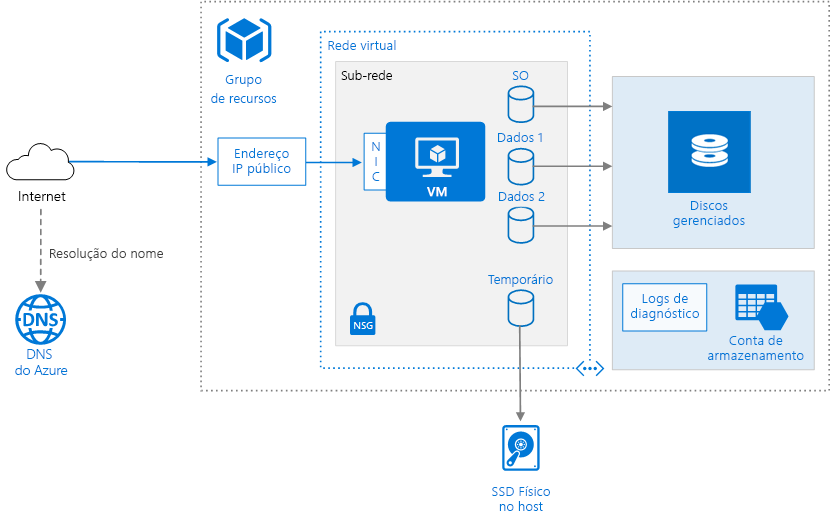

# <a name="run-a-windows-virtual-machine-on-azure"></a><span data-ttu-id="7c27d-103">Executar uma máquina virtual com Windows no Azure</span><span class="sxs-lookup"><span data-stu-id="7c27d-103">Run a Windows virtual machine on Azure</span></span>

<span data-ttu-id="7c27d-104">O provisionamento de uma VM (máquina virtual) no Azure requer alguns componentes adicionais além da própria VM, incluindo recursos de rede e armazenamento.</span><span class="sxs-lookup"><span data-stu-id="7c27d-104">Provisioning a virtual machine (VM) in Azure requires some additional components besides the VM itself, including networking and storage resources.</span></span> <span data-ttu-id="7c27d-105">Este artigo mostra as melhores práticas para executar uma VM do Windows no Azure.</span><span class="sxs-lookup"><span data-stu-id="7c27d-105">This article shows best practices for running a Windows VM on Azure.</span></span>



## <a name="resource-group"></a><span data-ttu-id="7c27d-107">Grupo de recursos</span><span class="sxs-lookup"><span data-stu-id="7c27d-107">Resource group</span></span>

<span data-ttu-id="7c27d-108">Um [grupo de recursos][resource-manager-overview] é um contêiner lógico que armazena os recursos relacionados ao Azure.</span><span class="sxs-lookup"><span data-stu-id="7c27d-108">A [resource group][resource-manager-overview] is a logical container that holds related Azure resources.</span></span> <span data-ttu-id="7c27d-109">Em geral, recursos de grupo baseados em seu tempo de vida e que vão gerenciá-los.</span><span class="sxs-lookup"><span data-stu-id="7c27d-109">In general, group resources based on their lifetime and who will manage them.</span></span>

<span data-ttu-id="7c27d-110">Coloque recursos estreitamente associados que compartilhem o mesmo ciclo de vida no mesmo [grupo de recursos][resource-manager-overview].</span><span class="sxs-lookup"><span data-stu-id="7c27d-110">Put closely associated resources that share the same lifecycle into the same [resource group][resource-manager-overview].</span></span> <span data-ttu-id="7c27d-111">Os grupos de recursos permitem implantar e monitorar recursos como um grupo e rastrear custos de cobrança por grupo de recursos.</span><span class="sxs-lookup"><span data-stu-id="7c27d-111">Resource groups allow you to deploy and monitor resources as a group and track billing costs by resource group.</span></span> <span data-ttu-id="7c27d-112">Também é possível excluir recursos como um conjunto, o que é muito útil para implantações de teste.</span><span class="sxs-lookup"><span data-stu-id="7c27d-112">You can also delete resources as a set, which is very useful for test deployments.</span></span> <span data-ttu-id="7c27d-113">Atribua nomes de recursos significativos para simplificar a localização de um recurso específico e o reconhecimento de sua função.</span><span class="sxs-lookup"><span data-stu-id="7c27d-113">Assign meaningful resource names to simplify locating a specific resource and understanding its role.</span></span> <span data-ttu-id="7c27d-114">Para obter mais informações, consulte as [Convenções de nomenclatura recomendadas para os Recursos do Azure][naming-conventions].</span><span class="sxs-lookup"><span data-stu-id="7c27d-114">For more information, see [Recommended Naming Conventions for Azure Resources][naming-conventions].</span></span>

## <a name="virtual-machine"></a><span data-ttu-id="7c27d-115">Máquina virtual</span><span class="sxs-lookup"><span data-stu-id="7c27d-115">Virtual machine</span></span>

<span data-ttu-id="7c27d-116">Você pode provisionar uma VM a partir de uma lista de imagens publicadas, de um arquivo gerenciado personalizado ou um arquivo de VHD (disco rígido virtual) carregado no armazenamento Blobs do Azure.</span><span class="sxs-lookup"><span data-stu-id="7c27d-116">You can provision a VM from a list of published images, or from a custom managed image or virtual hard disk (VHD) file uploaded to Azure Blob storage.</span></span>

<span data-ttu-id="7c27d-117">O Azure oferece vários tamanhos de máquinas virtuais diferentes.</span><span class="sxs-lookup"><span data-stu-id="7c27d-117">Azure offers many different virtual machine sizes.</span></span> <span data-ttu-id="7c27d-118">Para obter mais informações, confira [Tamanhos das máquinas virtuais no Azure][virtual-machine-sizes].</span><span class="sxs-lookup"><span data-stu-id="7c27d-118">For more information, see [Sizes for virtual machines in Azure][virtual-machine-sizes].</span></span> <span data-ttu-id="7c27d-119">Se você estiver movendo uma carga de trabalho existente para o Azure, deverá começar com o tamanho da VM que mais se aproxima de seus servidores locais.</span><span class="sxs-lookup"><span data-stu-id="7c27d-119">If you are moving an existing workload to Azure, start with the VM size that's the closest match to your on-premises servers.</span></span> <span data-ttu-id="7c27d-120">Em seguida, meça o desempenho da carga de trabalho real em termos de CPU, memória e IOPS (operações de entrada/saída de disco por segundo) e ajuste o tamanho conforme a necessidade.</span><span class="sxs-lookup"><span data-stu-id="7c27d-120">Then measure the performance of your actual workload in terms of CPU, memory, and disk input/output operations per second (IOPS), and adjust the size as needed.</span></span>

<span data-ttu-id="7c27d-121">Em geral, escolha a região do Azure que esteja mais próxima de seus usuários internos ou clientes.</span><span class="sxs-lookup"><span data-stu-id="7c27d-121">Generally, choose an Azure region that is closest to your internal users or customers.</span></span> <span data-ttu-id="7c27d-122">Nem todos os tamanhos de VM estão disponíveis em todas as regiões.</span><span class="sxs-lookup"><span data-stu-id="7c27d-122">Not all VM sizes are available in all regions.</span></span> <span data-ttu-id="7c27d-123">Para obter mais informações, consulte [Serviços por região][services-by-region].</span><span class="sxs-lookup"><span data-stu-id="7c27d-123">For more information, see [Services by region][services-by-region].</span></span> <span data-ttu-id="7c27d-124">Para obter uma lista dos tamanhos de VM disponíveis em uma região específica, execute o seguinte comando a partir da interface de linha de comando do Azure (CLI):</span><span class="sxs-lookup"><span data-stu-id="7c27d-124">For a list of the VM sizes available in a specific region, run the following command from the Azure command-line interface (CLI):</span></span>

```azurecli
az vm list-sizes --location <location>
```

<span data-ttu-id="7c27d-125">Para obter informações sobre como escolher uma imagem de VM publicada, consulte [Localizar imagens de VM do Windows][select-vm-image].</span><span class="sxs-lookup"><span data-stu-id="7c27d-125">For information about choosing a published VM image, see [Find Windows VM images][select-vm-image].</span></span>

## <a name="disks"></a><span data-ttu-id="7c27d-126">Discos</span><span class="sxs-lookup"><span data-stu-id="7c27d-126">Disks</span></span>

<span data-ttu-id="7c27d-127">Para um melhor desempenho de E/S de disco, recomendamos o [Armazenamento Premium][premium-storage], que armazena dados em SSDs (unidades de estado sólido).</span><span class="sxs-lookup"><span data-stu-id="7c27d-127">For best disk I/O performance, we recommend [Premium Storage][premium-storage], which stores data on solid-state drives (SSDs).</span></span> <span data-ttu-id="7c27d-128">O custo é baseado na capacidade do disco provisionado.</span><span class="sxs-lookup"><span data-stu-id="7c27d-128">Cost is based on the capacity of the provisioned disk.</span></span> <span data-ttu-id="7c27d-129">O IOPS e a taxa de transferência também dependem do tamanho do disco. Portanto, ao provisionar um disco, considere todos os três fatores (capacidade, IOPS e taxa de transferência).</span><span class="sxs-lookup"><span data-stu-id="7c27d-129">IOPS and throughput also depend on disk size, so when you provision a disk, consider all three factors (capacity, IOPS, and throughput).</span></span>

<span data-ttu-id="7c27d-130">Também é recomendável usar [Managed Disks][managed-disks].</span><span class="sxs-lookup"><span data-stu-id="7c27d-130">We also recommend using [Managed Disks][managed-disks].</span></span> <span data-ttu-id="7c27d-131">Os discos gerenciados simplificam o gerenciamento de disco manipulando o armazenamento por você.</span><span class="sxs-lookup"><span data-stu-id="7c27d-131">Managed disks simplify disk management by handling the storage for you.</span></span> <span data-ttu-id="7c27d-132">Os discos gerenciados não exigem uma conta de armazenamento.</span><span class="sxs-lookup"><span data-stu-id="7c27d-132">Managed disks do not require a storage account.</span></span> <span data-ttu-id="7c27d-133">Você simplesmente especifica o tamanho e o tipo de disco e ele é implantado como um recurso altamente disponível</span><span class="sxs-lookup"><span data-stu-id="7c27d-133">You simply specify the size and type of disk and it is deployed as a highly available resource</span></span>

<span data-ttu-id="7c27d-134">O disco de OS é um VHD armazenado no [Armazenamento do Microsoft Azure ][azure-storage], de modo que ele persiste mesmo quando o computador host está desligado.</span><span class="sxs-lookup"><span data-stu-id="7c27d-134">The OS disk is a VHD stored in [Azure Storage][azure-storage], so it persists even when the host machine is down.</span></span> <span data-ttu-id="7c27d-135">Também é recomendável criar um ou mais [discos de dados][data-disk], que são VHDs persistentes usados para dados de aplicativo.</span><span class="sxs-lookup"><span data-stu-id="7c27d-135">We also recommend creating one or more [data disks][data-disk], which are persistent VHDs used for application data.</span></span> <span data-ttu-id="7c27d-136">Quando possível, instale aplicativos em um disco de dados, não no disco do sistema operacional.</span><span class="sxs-lookup"><span data-stu-id="7c27d-136">When possible, install applications on a data disk, not the OS disk.</span></span> <span data-ttu-id="7c27d-137">Algumas aplicações legadas podem precisar instalar componentes na unidade C:. Nesse caso, você pode [redimensionar o disco de SO][resize-os-disk] utilizando o PowerShell.</span><span class="sxs-lookup"><span data-stu-id="7c27d-137">Some legacy applications might need to install components on the C: drive; in that case, you can [resize the OS disk][resize-os-disk] using PowerShell.</span></span>

<span data-ttu-id="7c27d-138">A VM também é criada com um disco temporário (a unidade `D:` no Windows).</span><span class="sxs-lookup"><span data-stu-id="7c27d-138">The VM is also created with a temporary disk (the `D:` drive on Windows).</span></span> <span data-ttu-id="7c27d-139">Esse disco é armazenado em uma unidade física no computador host.</span><span class="sxs-lookup"><span data-stu-id="7c27d-139">This disk is stored on a physical drive on the host machine.</span></span> <span data-ttu-id="7c27d-140">Ele *não* é salvo no Armazenamento do Microsoft Azure e pode ser excluído durante a reinicialização e outros eventos de ciclo de vida da VM.</span><span class="sxs-lookup"><span data-stu-id="7c27d-140">It is *not* saved in Azure Storage and may be deleted during reboots and other VM lifecycle events.</span></span> <span data-ttu-id="7c27d-141">Use esse disco somente para dados temporários, como arquivos de paginação ou de permuta.</span><span class="sxs-lookup"><span data-stu-id="7c27d-141">Use this disk only for temporary data, such as page or swap files.</span></span>

## <a name="network"></a><span data-ttu-id="7c27d-142">Rede</span><span class="sxs-lookup"><span data-stu-id="7c27d-142">Network</span></span>

<span data-ttu-id="7c27d-143">Os componentes de rede incluem os seguintes recursos:</span><span class="sxs-lookup"><span data-stu-id="7c27d-143">The networking components include the following resources:</span></span>

- <span data-ttu-id="7c27d-144">**Rede virtual**.</span><span class="sxs-lookup"><span data-stu-id="7c27d-144">**Virtual network**.</span></span> <span data-ttu-id="7c27d-145">Cada VM é implantada em uma rede virtual que pode ser segmentada em várias sub-redes.</span><span class="sxs-lookup"><span data-stu-id="7c27d-145">Every VM is deployed into a virtual network that can be segmented into multiple subnets.</span></span>

- <span data-ttu-id="7c27d-146">**NIC (adaptador de rede)**.</span><span class="sxs-lookup"><span data-stu-id="7c27d-146">**Network interface (NIC)**.</span></span> <span data-ttu-id="7c27d-147">A NIC permite que a VM se comunique com a rede virtual.</span><span class="sxs-lookup"><span data-stu-id="7c27d-147">The NIC enables the VM to communicate with the virtual network.</span></span> <span data-ttu-id="7c27d-148">Se você precisar de vários NICs para sua VM, esteja ciente de que existe um número máximo de NICs definido para cada [tamanho de VM][vm-size-tables].</span><span class="sxs-lookup"><span data-stu-id="7c27d-148">If you need multiple NICs for your VM, be aware that a maximum number of NICs is defined for each [VM size][vm-size-tables].</span></span>

- <span data-ttu-id="7c27d-149">**Endereço IP público**.</span><span class="sxs-lookup"><span data-stu-id="7c27d-149">**Public IP address**.</span></span> <span data-ttu-id="7c27d-150">Um endereço IP público é necessário para se comunicar com a VM &mdash; por exemplo, sobre RDP (área de trabalho remota).</span><span class="sxs-lookup"><span data-stu-id="7c27d-150">A public IP address is needed to communicate with the VM &mdash; for example, via remote desktop (RDP).</span></span> <span data-ttu-id="7c27d-151">Esse endereço IP público pode ser dinâmico ou estático.</span><span class="sxs-lookup"><span data-stu-id="7c27d-151">The public IP address can be dynamic or static.</span></span> <span data-ttu-id="7c27d-152">O padrão é dinâmico.</span><span class="sxs-lookup"><span data-stu-id="7c27d-152">The default is dynamic.</span></span>

- <span data-ttu-id="7c27d-153">Reserve um [endereço IP estático][static-ip] se precisar de um endereço IP fixo que não mudará, &mdash;por exemplo, se precisar criar um registro 'A' de DNS ou adicionar o IP endereço para uma lista segura.</span><span class="sxs-lookup"><span data-stu-id="7c27d-153">Reserve a [static IP address][static-ip] if you need a fixed IP address that won't change &mdash; for example, if you need to create a DNS 'A' record or add the IP address to a safe list.</span></span>
- <span data-ttu-id="7c27d-154">Você também pode criar um FQDN (nome de domínio totalmente qualificado) para o endereço IP.</span><span class="sxs-lookup"><span data-stu-id="7c27d-154">You can also create a fully qualified domain name (FQDN) for the IP address.</span></span> <span data-ttu-id="7c27d-155">Em seguida, é possível registrar um [registro CNAME][cname-record] no DNS que aponta para o FQDN.</span><span class="sxs-lookup"><span data-stu-id="7c27d-155">You can then register a [CNAME record][cname-record] in DNS that points to the FQDN.</span></span> <span data-ttu-id="7c27d-156">Para saber mais, consulte [Criar um nome de domínio totalmente qualificado no Portal do Azure][fqdn].</span><span class="sxs-lookup"><span data-stu-id="7c27d-156">For more information, see [Create a fully qualified domain name in the Azure portal][fqdn].</span></span>

- <span data-ttu-id="7c27d-157">**NSG (grupo de segurança de rede)**.</span><span class="sxs-lookup"><span data-stu-id="7c27d-157">**Network security group (NSG)**.</span></span> <span data-ttu-id="7c27d-158">Os [Grupos de segurança de rede][nsg] são utilizados para permitir ou recusar o tráfego de rede a VMs.</span><span class="sxs-lookup"><span data-stu-id="7c27d-158">[Network security groups][nsg] are used to allow or deny network traffic to VMs.</span></span> <span data-ttu-id="7c27d-159">Os NSGs podem ser associados com sub-redes ou com instâncias VM individuais.</span><span class="sxs-lookup"><span data-stu-id="7c27d-159">NSGs can be associated either with subnets or with individual VM instances.</span></span>

<span data-ttu-id="7c27d-160">Todos os NSGs contêm um conjunto de [regras padrão][nsg-default-rules], incluindo uma regra que bloqueia todo o tráfego de Internet de entrada.</span><span class="sxs-lookup"><span data-stu-id="7c27d-160">All NSGs contain a set of [default rules][nsg-default-rules], including a rule that blocks all inbound Internet traffic.</span></span> <span data-ttu-id="7c27d-161">As regras padrão não podem ser excluídas, mas outras regras podem substituí-las.</span><span class="sxs-lookup"><span data-stu-id="7c27d-161">The default rules cannot be deleted, but other rules can override them.</span></span> <span data-ttu-id="7c27d-162">Para habilitar o tráfego de Internet, crie regras que permitam o tráfego de entrada em portas específicas &mdash; por exemplo, a porta 80 para HTTP.</span><span class="sxs-lookup"><span data-stu-id="7c27d-162">To enable Internet traffic, create rules that allow inbound traffic to specific ports &mdash; for example, port 80 for HTTP.</span></span> <span data-ttu-id="7c27d-163">Para habilitar o RDP, adicione uma regra NSG que permita o tráfego de entrada na porta TCP 3389.</span><span class="sxs-lookup"><span data-stu-id="7c27d-163">To enable RDP, add an NSG rule that allows inbound traffic to TCP port 3389.</span></span>

## <a name="operations"></a><span data-ttu-id="7c27d-164">Operações</span><span class="sxs-lookup"><span data-stu-id="7c27d-164">Operations</span></span>

<span data-ttu-id="7c27d-165">**Diagnóstico**.</span><span class="sxs-lookup"><span data-stu-id="7c27d-165">**Diagnostics**.</span></span> <span data-ttu-id="7c27d-166">Habilite o monitoramento e diagnóstico, incluindo métricas de integridade básicas, logs de infraestrutura de diagnóstico e [diagnóstico de inicialização][boot-diagnostics].</span><span class="sxs-lookup"><span data-stu-id="7c27d-166">Enable monitoring and diagnostics, including basic health metrics, diagnostics infrastructure logs, and [boot diagnostics][boot-diagnostics].</span></span> <span data-ttu-id="7c27d-167">O diagnóstico de inicialização poderá ajudar a diagnosticar uma falha de inicialização se sua VM entrar em um estado não inicializável.</span><span class="sxs-lookup"><span data-stu-id="7c27d-167">Boot diagnostics can help you diagnose boot failure if your VM gets into a non-bootable state.</span></span> <span data-ttu-id="7c27d-168">Crie uma conta do Armazenamento do Azure para armazenar os logs.</span><span class="sxs-lookup"><span data-stu-id="7c27d-168">Create an Azure Storage account to store the logs.</span></span> <span data-ttu-id="7c27d-169">Uma conta LRS (armazenamento com redundância local) padrão é suficiente para os logs de diagnóstico.</span><span class="sxs-lookup"><span data-stu-id="7c27d-169">A standard locally redundant storage (LRS) account is sufficient for diagnostic logs.</span></span> <span data-ttu-id="7c27d-170">Para saber mais, confira [Habilitar monitoramento e diagnóstico][enable-monitoring].</span><span class="sxs-lookup"><span data-stu-id="7c27d-170">For more information, see [Enable monitoring and diagnostics][enable-monitoring].</span></span>

<span data-ttu-id="7c27d-171">**Disponibilidade**.</span><span class="sxs-lookup"><span data-stu-id="7c27d-171">**Availability**.</span></span> <span data-ttu-id="7c27d-172">Sua VM pode ser afetada por [manutenção planejada][planned-maintenance] ou por [tempo de inatividade não planejado][manage-vm-availability].</span><span class="sxs-lookup"><span data-stu-id="7c27d-172">Your VM may be affected by [planned maintenance][planned-maintenance] or [unplanned downtime][manage-vm-availability].</span></span> <span data-ttu-id="7c27d-173">Você pode usar os[ logs de reinicialização da VM][reboot-logs] para determinar se uma reinicialização da VM foi causada por manutenção planejada.</span><span class="sxs-lookup"><span data-stu-id="7c27d-173">You can use [VM reboot logs][reboot-logs] to determine whether a VM reboot was caused by planned maintenance.</span></span> <span data-ttu-id="7c27d-174">Para obter maior disponibilidade, implante várias VMs em um [conjunto de disponibilidade](/azure/virtual-machines/windows/manage-availability#configure-multiple-virtual-machines-in-an-availability-set-for-redundancy).</span><span class="sxs-lookup"><span data-stu-id="7c27d-174">For higher availability, deploy multiple VMs in an [availability set](/azure/virtual-machines/windows/manage-availability#configure-multiple-virtual-machines-in-an-availability-set-for-redundancy).</span></span> <span data-ttu-id="7c27d-175">Essa configuração fornece um maior [SLA (contrato de nível de serviço)][vm-sla].</span><span class="sxs-lookup"><span data-stu-id="7c27d-175">This configuration provides a higher [service level agreement (SLA)][vm-sla].</span></span>

<span data-ttu-id="7c27d-176">**Backups** Para se proteger contra perda acidental de dados, use o serviço [Backup do Azure](/azure/backup/) a fim de fazer o backup das VMs em um armazenamento com redundância geográfica.</span><span class="sxs-lookup"><span data-stu-id="7c27d-176">**Backups** To protect against accidental data loss, use the [Azure Backup](/azure/backup/) service to back up your VMs to geo-redundant storage.</span></span> <span data-ttu-id="7c27d-177">O Backup do Azure fornece backups consistentes com o aplicativo.</span><span class="sxs-lookup"><span data-stu-id="7c27d-177">Azure Backup provides application-consistent backups.</span></span>

<span data-ttu-id="7c27d-178">**Interromper uma VM**.</span><span class="sxs-lookup"><span data-stu-id="7c27d-178">**Stopping a VM**.</span></span> <span data-ttu-id="7c27d-179">O Azure faz uma distinção entre os estados "parado" e "desalocado".</span><span class="sxs-lookup"><span data-stu-id="7c27d-179">Azure makes a distinction between "stopped" and "deallocated" states.</span></span> <span data-ttu-id="7c27d-180">Você será cobrado quando o status da VM for interrompido, mas não quando a VM for desalocada.</span><span class="sxs-lookup"><span data-stu-id="7c27d-180">You are charged when the VM status is stopped, but not when the VM is deallocated.</span></span> <span data-ttu-id="7c27d-181">No Portal do Azure, o botão **Parar** desaloca a VM.</span><span class="sxs-lookup"><span data-stu-id="7c27d-181">In the Azure portal, the **Stop** button deallocates the VM.</span></span> <span data-ttu-id="7c27d-182">No entanto, se você desligar por meio do sistema operacional enquanto estiver conectado, a VM será interrompida, mas **não** desalocada e, portanto, você ainda será cobrado.</span><span class="sxs-lookup"><span data-stu-id="7c27d-182">If you shut down through the OS while logged in, the VM is stopped but **not** deallocated, so you will still be charged.</span></span>

<span data-ttu-id="7c27d-183">**Excluir uma VM**.</span><span class="sxs-lookup"><span data-stu-id="7c27d-183">**Deleting a VM**.</span></span> <span data-ttu-id="7c27d-184"> Se você excluir uma VM, os VHDs não serão excluídos.</span><span class="sxs-lookup"><span data-stu-id="7c27d-184">If you delete a VM, the VHDs are not deleted.</span></span> <span data-ttu-id="7c27d-185">Isso significa que você poderá excluir com segurança a VM sem perda de dados.</span><span class="sxs-lookup"><span data-stu-id="7c27d-185">That means you can safely delete the VM without losing data.</span></span> <span data-ttu-id="7c27d-186">No entanto, você ainda será cobrado pelo armazenamento.</span><span class="sxs-lookup"><span data-stu-id="7c27d-186">However, you will still be charged for storage.</span></span> <span data-ttu-id="7c27d-187">Para excluir o VHD, exclua o arquivo do [Armazenamento de blobs][blob-storage].</span><span class="sxs-lookup"><span data-stu-id="7c27d-187">To delete the VHD, delete the file from [Blob storage][blob-storage].</span></span> <span data-ttu-id="7c27d-188">Para evitar a exclusão acidental, use um [bloqueio de recurso][resource-lock] para bloquear o grupo de recursos inteiro ou bloquear recursos individuais, como uma VM.</span><span class="sxs-lookup"><span data-stu-id="7c27d-188">To prevent accidental deletion, use a [resource lock][resource-lock] to lock the entire resource group or lock individual resources, such as a VM.</span></span>

## <a name="security-considerations"></a><span data-ttu-id="7c27d-189">Considerações de segurança</span><span class="sxs-lookup"><span data-stu-id="7c27d-189">Security considerations</span></span>

<span data-ttu-id="7c27d-190">Use a [Central de Segurança do Azure][security-center] para obter uma exibição central do estado da segurança de seus recursos do Azure.</span><span class="sxs-lookup"><span data-stu-id="7c27d-190">Use [Azure Security Center][security-center] to get a central view of the security state of your Azure resources.</span></span> <span data-ttu-id="7c27d-191">A Central de Segurança monitora problemas de segurança potenciais e fornece uma visão abrangente da integridade de segurança de sua implantação.</span><span class="sxs-lookup"><span data-stu-id="7c27d-191">Security Center monitors potential security issues and provides a comprehensive picture of the security health of your deployment.</span></span> <span data-ttu-id="7c27d-192">A Central de Segurança é configurada por assinatura do Azure.</span><span class="sxs-lookup"><span data-stu-id="7c27d-192">Security Center is configured per Azure subscription.</span></span> <span data-ttu-id="7c27d-193">Habilite a coleta de dados de segurança conforme descrito em [Integrar a assinatura do Azure à Central de Segurança Standard][security-center-get-started].</span><span class="sxs-lookup"><span data-stu-id="7c27d-193">Enable security data collection as described in [Onboard your Azure subscription to Security Center Standard][security-center-get-started].</span></span> <span data-ttu-id="7c27d-194">Depois que a coleta de dados for habilitada, a Central de Segurança examinará automaticamente todas as VMs criadas nessa assinatura.</span><span class="sxs-lookup"><span data-stu-id="7c27d-194">When data collection is enabled, Security Center automatically scans any VMs created under that subscription.</span></span>

<span data-ttu-id="7c27d-195">**Gerenciamento de patch**.</span><span class="sxs-lookup"><span data-stu-id="7c27d-195">**Patch management**.</span></span> <span data-ttu-id="7c27d-196">Se for habilitada, a Central de Segurança verificará se quaisquer atualizações críticas e de segurança estão ausentes.</span><span class="sxs-lookup"><span data-stu-id="7c27d-196">If enabled, Security Center checks whether any security and critical updates are missing.</span></span> <span data-ttu-id="7c27d-197">Use as [Configurações da Política de Grupo][group-policy] na VM para habilitar as atualizações automáticas do sistema.</span><span class="sxs-lookup"><span data-stu-id="7c27d-197">Use [Group Policy settings][group-policy] on the VM to enable automatic system updates.</span></span>

<span data-ttu-id="7c27d-198">**Antimalware**.</span><span class="sxs-lookup"><span data-stu-id="7c27d-198">**Antimalware**.</span></span> <span data-ttu-id="7c27d-199"> Se for habilitada, a Central de Segurança verificará se o software antimalware está instalado.</span><span class="sxs-lookup"><span data-stu-id="7c27d-199">If enabled, Security Center checks whether antimalware software is installed.</span></span> <span data-ttu-id="7c27d-200">Você também pode usar a Central de Segurança para instalar o software antimalware por meio do Portal do Azure.</span><span class="sxs-lookup"><span data-stu-id="7c27d-200">You can also use Security Center to install antimalware software from inside the Azure portal.</span></span>

<span data-ttu-id="7c27d-201">**Controle de acesso**.</span><span class="sxs-lookup"><span data-stu-id="7c27d-201">**Access control**.</span></span> <span data-ttu-id="7c27d-202">Use o [RBAC (controle de acesso baseado em função)][rbac] para controlar o acesso aos recursos do Azure.</span><span class="sxs-lookup"><span data-stu-id="7c27d-202">Use [role-based access control (RBAC)][rbac] to control access to Azure resources.</span></span> <span data-ttu-id="7c27d-203">O RBAC permite atribuir funções de autorização aos membros de sua equipe de DevOps.</span><span class="sxs-lookup"><span data-stu-id="7c27d-203">RBAC lets you assign authorization roles to members of your DevOps team.</span></span> <span data-ttu-id="7c27d-204">Por exemplo, a função Leitor pode exibir os recursos do Azure, mas não criar, gerenciar nem excluí-los.</span><span class="sxs-lookup"><span data-stu-id="7c27d-204">For example, the Reader role can view Azure resources but not create, manage, or delete them.</span></span> <span data-ttu-id="7c27d-205">Algumas permissões são específicas para determinado tipo de recurso do Azure.</span><span class="sxs-lookup"><span data-stu-id="7c27d-205">Some permissions are specific to an Azure resource type.</span></span> <span data-ttu-id="7c27d-206">Por exemplo, a função Colaborador da Máquina Virtual pode reiniciar ou desalocar uma VM, redefinir a senha de administrador, criar uma nova VM e, assim por diante.</span><span class="sxs-lookup"><span data-stu-id="7c27d-206">For example, the Virtual Machine Contributor role can restart or deallocate a VM, reset the administrator password, create a new VM, and so on.</span></span> <span data-ttu-id="7c27d-207">Outras [funções RBAC internas][rbac-roles] que podem ser úteis para esta arquitetura incluem [Usuário de DevTest Labs][rbac-devtest] e [Colaborador de Rede][rbac-network].</span><span class="sxs-lookup"><span data-stu-id="7c27d-207">Other [built-in RBAC roles][rbac-roles] that may be useful for this architecture include [DevTest Labs User][rbac-devtest] and [Network Contributor][rbac-network].</span></span> 

> [!NOTE]
> <span data-ttu-id="7c27d-208">O RBAC não limita as ações que podem ser executadas por um usuário conectado a uma VM.</span><span class="sxs-lookup"><span data-stu-id="7c27d-208">RBAC does not limit the actions that a user logged into a VM can perform.</span></span> <span data-ttu-id="7c27d-209">Essas permissões são determinadas pelo tipo de conta no SO convidado.</span><span class="sxs-lookup"><span data-stu-id="7c27d-209">Those permissions are determined by the account type on the guest OS.</span></span>

<span data-ttu-id="7c27d-210">**Logs de auditoria**.</span><span class="sxs-lookup"><span data-stu-id="7c27d-210">**Audit logs**.</span></span> <span data-ttu-id="7c27d-211">Use os [logs de auditoria][audit-logs] para ver as ações de provisionamento e outros eventos da VM.</span><span class="sxs-lookup"><span data-stu-id="7c27d-211">Use [audit logs][audit-logs] to see provisioning actions and other VM events.</span></span>

<span data-ttu-id="7c27d-212">**Criptografia de dados**.</span><span class="sxs-lookup"><span data-stu-id="7c27d-212">**Data encryption**.</span></span> <span data-ttu-id="7c27d-213">Use o [Azure Disk Encryption][disk-encryption] se você precisa criptografar os discos do sistema operacional e de dados.</span><span class="sxs-lookup"><span data-stu-id="7c27d-213">Use [Azure Disk Encryption][disk-encryption] if you need to encrypt the OS and data disks.</span></span>

## <a name="next-steps"></a><span data-ttu-id="7c27d-214">Próximas etapas</span><span class="sxs-lookup"><span data-stu-id="7c27d-214">Next steps</span></span>

- <span data-ttu-id="7c27d-215">Para provisionar uma VM do Windows, confira [Criar e gerenciar VMs do Windows com o Azure PowerShell](/azure/virtual-machines/windows/tutorial-manage-vm)</span><span class="sxs-lookup"><span data-stu-id="7c27d-215">To provision a Windows VM, see [Create and Manage Windows VMs with Azure PowerShell](/azure/virtual-machines/windows/tutorial-manage-vm)</span></span>
- <span data-ttu-id="7c27d-216">Para uma arquitetura de N camadas completa em VMs do Windows, confira [Aplicativo de N camadas do Windows no Azure com o SQL Server](./n-tier-sql-server.md).</span><span class="sxs-lookup"><span data-stu-id="7c27d-216">For a complete N-tier architecture on Windows VMs, see [Windows N-tier application on Azure with SQL Server](./n-tier-sql-server.md).</span></span>

<!-- links -->
[audit-logs]: https://azure.microsoft.com/blog/analyze-azure-audit-logs-in-powerbi-more/
[azure-storage]: /azure/storage/storage-introduction
[blob-storage]: /azure/storage/storage-introduction
[boot-diagnostics]: https://azure.microsoft.com/blog/boot-diagnostics-for-virtual-machines-v2/
[cname-record]: https://en.wikipedia.org/wiki/CNAME_record
[data-disk]: /azure/virtual-machines/virtual-machines-windows-about-disks-vhds
[disk-encryption]: /azure/security/azure-security-disk-encryption
[enable-monitoring]: /azure/monitoring-and-diagnostics/insights-how-to-use-diagnostics
[fqdn]: /azure/virtual-machines/virtual-machines-windows-portal-create-fqdn
[group-policy]: /windows-server/administration/windows-server-update-services/deploy/4-configure-group-policy-settings-for-automatic-updates
[manage-vm-availability]: /azure/virtual-machines/virtual-machines-windows-manage-availability
[managed-disks]: /azure/storage/storage-managed-disks-overview
[naming-conventions]: ../../best-practices/naming-conventions.md
[nsg]: /azure/virtual-network/virtual-networks-nsg
[nsg-default-rules]: /azure/virtual-network/virtual-networks-nsg#default-rules
[planned-maintenance]: /azure/virtual-machines/virtual-machines-windows-planned-maintenance
[premium-storage]: /azure/virtual-machines/windows/premium-storage
[rbac]: /azure/active-directory/role-based-access-control-what-is
[rbac-roles]: /azure/active-directory/role-based-access-built-in-roles
[rbac-devtest]: /azure/active-directory/role-based-access-built-in-roles#devtest-labs-user
[rbac-network]: /azure/active-directory/role-based-access-built-in-roles#network-contributor
[reboot-logs]: https://azure.microsoft.com/blog/viewing-vm-reboot-logs/
[resize-os-disk]: /azure/virtual-machines/virtual-machines-windows-expand-os-disk
[resource-lock]: /azure/resource-group-lock-resources
[resource-manager-overview]: /azure/azure-resource-manager/resource-group-overview
[security-center]: /azure/security-center/security-center-intro
[security-center-get-started]: /azure/security-center/security-center-get-started
[select-vm-image]: /azure/virtual-machines/virtual-machines-windows-cli-ps-findimage
[services-by-region]: https://azure.microsoft.com/regions/#services
[static-ip]: /azure/virtual-network/virtual-networks-reserved-public-ip
[virtual-machine-sizes]: /azure/virtual-machines/virtual-machines-windows-sizes
[visio-download]: https://archcenter.blob.core.windows.net/cdn/vm-reference-architectures.vsdx
[vm-size-tables]: /azure/virtual-machines/virtual-machines-windows-sizes
[vm-sla]: https://azure.microsoft.com/support/legal/sla/virtual-machines
