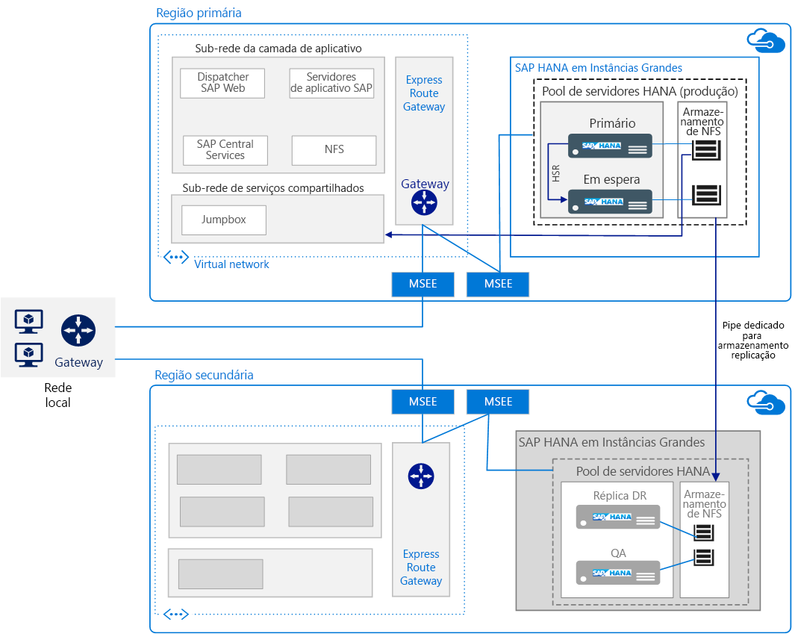

# Executar SAP HANA em Instâncias Grandes do Azure

Essa arquitetura de referência mostra um conjunto de práticas comprovadas para executar o SAP HANA no Azure (Instâncias Grandes) com alta disponibilidade e recuperação de desastre (DR). Chamada de Instâncias Grandes do HANA, essa oferta é implantada em servidores físicos em regiões do Azure.

*Baixe um [Arquivo Visio][visio-download] dessa arquitetura.*

> [!NOTE]
> Implantar essa arquitetura de referência requer um licenciamento apropriado de produtos SAP e outras tecnologias que não são da Microsoft.

## Arquitetura

Essa arquitetura consiste nos componentes de infraestrutura a seguir.

- **Rede virtual**. O serviço da [Rede Virtual do Azure][vnet] conecta os recursos do Azure entre si de modo seguro e é subdividido em [sub-redes separadas][subnet] para cada camada. As camadas de aplicativos SAP são implantadas em máquinas virtuais (VMs) do Azure para conectar-se à camada de banco de dados do HANA que resida em instâncias grandes.

- **Máquinas virtuais**. As máquinas virtuais são usadas na camada de aplicativo e na camada de serviços compartilhados do SAP. A última inclui um jumpbox usado por administradores para configurar Instâncias Grandes do HANA e fornecer acesso a outras máquinas virtuais.

- **Instância Grande do HANA**. Um [servidor físico][physical] certificado para atender aos padrões de Integração de Datacenter Personalizado (TDI) do SAP HANA que executa o SAP HANA. Essa arquitetura usa duas Instâncias Grandes do HANA: uma unidade de computação principal e uma secundária. A alta disponibilidade da camada de dados é fornecida por meio da HSR (Replicação de Sistema do HANA).

- **Par de alta disponibilidade**. Um grupo de folhas das Instâncias Grandes do HANA são gerenciadas em conjunto para fornecer redundância e confiabilidade de aplicativo.

- **MSEE (Microsoft Enterprise Edge)**. O MSEE é um ponto de conexão de um provedor de conectividade ou de seu limite de rede por meio de um circuito ExpressRoute.

- **NICs (Placas de interface de rede)**. Para habilitar a comunicação, o servidor de Instância Grande do HANA fornece quatro NICs virtuais por padrão. Essa arquitetura requer um NIC para comunicação de cliente, um segundo NIC para a conectividade de nó para nó necessário pela HSR, um terceiro NIC para armazenamento de Instância Grande do HANA e um quarto para iSCSI usado no cluster de alta disponibilidade.

- **Armazenamento do NFS (Network File System)**. O servidor de [NFS][nfs] oferece suporte ao compartilhamento de arquivos da rede que fornece a persistência de dados seguros para a Instância Grande do HANA.

- **ExpressRoute**. O [ExpressRoute][expressroute] é o serviço de rede do Azure recomendado para criar conexões privadas entre uma rede local e redes virtuais do Azure que não passam pela Internet pública. As máquinas virtuais do Azure se conectam às Instâncias Grandes do HANA usando outra conexão de ExpressRoute. A conexão de ExpressRoute entre a rede virtual do Azure e as Instâncias Grandes do HANA é configurada como parte da oferta da Microsoft.

- **Gateway**. O Gateway de ExpressRoute é usado para conectar a rede virtual do Azure usada para a camada de aplicativo do SAP para a rede de Instância Grande do HANA. Use a SKU [Alto desempenho ou Ultradesempenho][sku].

- **DR (recuperação de desastre)**. Mediante solicitação, a replicação de armazenamento tem suporte e será configurada do site primário ao [site de DR][DR-site] localizado em outra região.

## Recomendações

Os requisitos podem variar, portanto, use essas recomendações como ponto de partida.

### Computação das Instâncias Grandes do HANA

[Instâncias Grandes][physical] são servidores físicos com base na arquitetura de CPU Intel EX E7 e são configuradas em um selo de instância grande, ou seja, um conjunto específico de servidores ou folhas. Uma unidade de computação é igual a um servidor ou uma folha, e um selo é composto por vários servidores ou folhas. Dentro de um selo de instância grande, os servidores não são compartilhados e são dedicados à execução de uma implantação do SAP HANA do cliente.

Há diversas SKUs disponíveis para Instâncias Grandes do HANA, oferecendo suporte a uma instância única de até 20 TB (expansão para 60 TB) de memória para S/4HANA ou outras cargas de trabalho do SAP HANA. [Duas classes][classes] de servidores são oferecidas:

- Classe do Tipo I: S72, S72m, S144, S144m, S192 e S192m

- Classe do Tipo II: S384, S384m, S384xm, S576m, S768m e S960m

Por exemplo, a SKU S72 vem com 768 GB de RAM, 3 TB (terabytes) de armazenamento e 2 processadores Intel Xeon (E7-8890 v3) com 36 núcleos. Escolha uma SKU que atenda aos requisitos de dimensionamento determinados por você nas sessões de arquitetura e design. Verifique sempre se o tamanho se aplica à SKU correta. Os requisitos de recursos e implantação [variam por tipo][type], e a disponibilidade varia de acordo com a [região][region]. Também é possível fazer o upgrade de uma SKU para uma maior.

A Microsoft ajuda a estabelecer a configuração de instância grande, mas é sua responsabilidade verificar as definições de configuração do sistema operacional. Verifique se você analisou as Notas SAP mais atuais em relação à sua versão exata do Linux.

### Armazenamento

O layout de armazenamento é implementado de acordo com a recomendação da TDI do SAP HANA. As Instâncias Grandes do HANA vêm com uma configuração de armazenamento específica para as especificações de TDI padrão. Contudo, é possível adquirir armazenamento adicional em incrementos de 1 TB.

Para dar suporte aos requisitos de ambientes de missão crítica, incluindo a recuperação rápida, é usado o NFS e não um armazenamento anexado diretamente. O servidor de armazenamento do NFS para Instâncias Grandes do HANA é hospedado em um ambiente multilocatário, em que os locatários são separados e protegidos usando o isolamento de computação, rede e armazenamento.

Para dar suporte à alta disponibilidade no site principal, use diferentes layouts de armazenamento. Por exemplo, em uma expansão de vários hosts, o armazenamento é compartilhado. Outra opção de alta disponibilidade é a replicação baseada em aplicativo, como uma HSR. Para a DR, porém, é usada uma replicação de armazenamento baseada em instantâneos.

### Rede

Essa arquitetura usa redes físicas e virtuais. A rede virtual faz parte da IaaS do Azure e conecta-se a uma rede física discreta de Instâncias Grandes do HANA por meio de circuitos de [ExpressRoute][expressroute]. Um gateway entre locais conecta suas cargas de trabalho na rede virtual do Azure aos seus sites locais.

As redes de Instâncias Grandes do HANA ficam isoladas umas das outras para fins de segurança. As instâncias que residem em diferentes regiões não se comunicam entre si, exceto para a replicação de armazenamento dedicada. Contudo, para usar a HSR, as comunicações entre regiões são necessárias. [Tabelas de roteamento de IP][ip] ou proxies podem ser usados para habilitar a HSR entre regiões.

Todas as redes virtuais do Azure que se conectam às Instâncias Grandes do HANA em uma região podem ser [conectadas entre si][cross-connected] por meio do ExpressRoute para Instâncias Grandes do HANA em uma região secundária.

O ExpressRoute para Instâncias Grandes do HANA é incluído por padrão durante o provisionamento. Para a instalação, é necessário um layout de rede específico, incluindo intervalos de endereços CIDR necessários e o domínio de roteamento. Para obter mais informações, confira [Infraestrutura e conectividade do SAP HANA (Instâncias Grandes) no Azure][HLI-infrastructure].

## Considerações sobre escalabilidade

Para escalar ou reduzir verticalmente, é possível escolher entre vários tamanhos de servidores que estão disponíveis para Instâncias Grandes do HANA. Eles são categorizados como [Tipo I e Tipo II][classes] e são adaptados para diferentes cargas de trabalho. Escolha um tamanho que possa crescer junto com a sua carga de trabalho nos próximos três anos. Os compromissos de um ano também estão disponíveis.

Uma implantação escalável de vários hosts geralmente é usada para implantações de BW/4HANA como um tipo de estratégia de particionamento do banco de dados. Para escalar horizontalmente, planeje o posicionamento das tabelas do HANA antes da instalação. Do ponto de vista de infraestrutura, vários hosts estão conectados a um volume de armazenamento compartilhado, permitindo o controle rápido por hosts em espera no caso de um dos nós de trabalho de computação no sistema HANA falhar.

S/4HANA e SAP Business Suite no HANA em uma única folha podem ser escalados verticalmente para até 20 TB, com uma única instância das Instâncias Grandes do HANA.

Para cenários de ambiente, o [SAP Quick Sizer][quick-sizer] está disponível para calcular os requisitos de memória da implementação de software do SAP sobre o HANA. Os requisitos de memória para o HANA aumentam conforme o volume de dados aumenta. Use o consumo de memória atual do seu sistema como base para prever o consumo futuro, depois mapeie a demanda de entrada de um dos tamanhos de Instâncias Grandes do HANA.

Caso já tenha as implantações do SAP, ele fornece relatórios que podem ser usados para verificar os dados usados por sistemas existentes e calcular os requisitos de memória para uma instância do HANA. Para obter um exemplo, confira estas Notas SAP:

- Nota SAP [1793345][sap-1793345] – Dimensionamento do SAP Suite no HANA
- Nota SAP [1872170][sap-1872170] – Relatório de dimensionamento do Suite no HANA e S/4 HANA
- Nota SAP [2121330][sap-2121330] - Perguntas Frequentes: relatório de dimensionamento do SAP BW no HANA
- Nota SAP [1736976][sap-1736976] – Relatório de dimensionamento do BW no HANA
- Nota SAP [2296290][sap-2296290] – Novo relatório de dimensionamento do BW no HANA

## Considerações sobre disponibilidade

A redundância de recursos é o tema geral em soluções de infraestrutura altamente disponíveis. Para empresas que contam com um SLA menos rigoroso, as máquinas virtuais de instância única do Azure oferecem um SLA de tempo de atividade. Para obter mais informações, confira [Contrato de Nível de Serviço do Azure](https://azure.microsoft.com/support/legal/sla/).

Trabalhe junto com o SAP, seu integrador de sistemas ou com a Microsoft para arquitetar e implementar adequadamente uma estratégia de [alta disponibilidade e recuperação de desastre][hli-hadr]. Essa arquitetura segue o [contrato de nível de serviço][sla] (SLA) do Azure para HANA no Azure (Instâncias Grandes). Para avaliar seus requisitos de disponibilidade, considere todos os pontos únicos de falha, o nível desejado de tempo de atividade para serviços e estas métricas comuns:

- O Objetivo de Tempo de Recuperação (RTO) é a duração de tempo em que o servidor de Instâncias Grandes do HANA está disponível.

- O Objetivo de Ponto de Recuperação (RPO) é o período máximo tolerável em que dados do cliente podem ser perdidos devido a uma falha.

Para obter a alta disponibilidade, implante mais de uma instância em um par de alta disponibilidade e use uma HSR em um modo síncrono para minimizar a perda de dados e o tempo de inatividade. Além de uma configuração de alta disponibilidade local de dois nós, a HSR oferece suporte à replicação de várias camadas, em que um terceiro nó em uma região separada do Azure é registrada na réplica secundária do par da HSR com cluster como seu destino de replicação. Isso forma uma corrente encadeada de replicação. O failover para o nó de recuperação de desastre é um processo manual.

Ao configurar a HSR das Instâncias Grandes do HANA com failover automático, é possível solicitar que a equipe de Gerenciamento de Serviços da Microsoft configure um [dispositivo STONITH][stonith] para seus servidores existentes.

## Considerações de recuperação de desastres

Essa arquitetura oferece suporte à [recuperação de desastre][hli-dr] entre Instâncias Grandes do HANA em diferentes regiões do Azure. Há duas maneiras de oferecer suporte a DRs com Instâncias Grandes do HANA:

- Replicação de armazenamento. O conteúdo de armazenamento primário é replicado constantemente para os sistemas de armazenamento de DR remota disponíveis no servidor designado para DR de Instâncias Grandes do HANA. Na replicação de armazenamento, o banco de dados do HANA não é carregado na memória. Essa opção de DR é mais simples sob uma perspectiva administrativa. Para determinar se essa é uma estratégia adequada, considere o tempo de carregamento do banco de dados em relação ao SLA de disponibilidade. A replicação de armazenamento também permite a execução da recuperação pontual. Caso seja configurada uma DR com vários fins (otimização de custo), você deve adquirir armazenamento adicional do mesmo tamanho no local de DR. A Microsoft fornece [instantâneo de armazenamento e scripts de failover][scripts] para failover do HANA como parte da oferta das Instâncias Grandes do HANA.

- A HSR de várias camadas com uma terceira réplica na região da DR (onde o banco de dados do HANA é carregado na memória). Essa opção oferece suporte a um tempo de recuperação mais rápido, mas não à recuperação pontual. A HSR requer um sistema secundário. A replicação de sistema do HANA para o site de DR é tratada por meio de proxies como nginx ou tabelas IP.

> [!NOTE]
> É possível otimizar essa arquitetura de referência para os custos executando em um ambiente de instância única. Esse [cenário de otimização de custos](https://blogs.sap.com/2016/07/19/new-whitepaper-for-high-availability-for-sap-hana-cost-optimized-scenario/) é adequado para cargas de trabalho de não produção do HANA.

## Considerações de backup

Com base em seus requisitos de negócios, escolha entre várias opções disponíveis para [backup e recuperação][hli-backup].

| Opções de backup                   | Prós                                                                                                   | Contras                                                       |
|---------------------------------|--------------------------------------------------------------------------------------------------------|------------------------------------------------------------|
| Backup do HANA        | Nativo para SAP. Verificação de consistência integrada.                                                             | Longo tempo de backup e recuperação. Consumo de espaço de armazenamento. |
| Instantâneo do HANA      | Nativo para SAP. Backup e restauração rápidos.                                                               |                                       |
| Instantâneo de armazenamento   | Incluído nas Instâncias Grandes do HANA. DR otimizada para Instâncias Grandes do HANA. Suporte de backup do volume de inicialização. | Máximo de 254 instantâneos por volume.                          |
| Backup de log         | Exigido para recuperação pontual.                                                                   |                                                            |
| Outras ferramentas de backup | Local de backup redundante.                                                                             | Custos adicionais de licenciamento.                                |

## Considerações sobre capacidade de gerenciamento

Monitore os recursos das Instâncias Grandes do HANA, como CPU, memória, largura de banda de rede e espaço de armazenamento usando o SAP HANA Studio, SAP HANA Cockpit, SAP Solution Manager e outras ferramentas nativas do Linux. As Instâncias Grandes do HANA não vêm com ferramentas de monitoramento interno. A Microsoft oferece recursos para ajudar a [solucionar problemas e monitorar][hli-troubleshoot] de acordo com os requisitos da organização, e a equipe de suporte da Microsoft pode ajudar na solução de problemas técnicos.

Caso precise de mais capacidade de computação, é preciso obter uma SKU maior.

## Considerações de segurança

- Por padrão, as Instâncias Grandes do HANA usam criptografia de armazenamento com base na TDE (criptografia transparente de dados) para os dados inativos.

- Não são criptografados os dados em trânsito entre as Instâncias Grandes do HANA e as máquinas virtuais. Para criptografar a transferência de dados, habilite a criptografia específica do aplicativo. Confira a Nota SAP [2159014][sap-2159014] - Perguntas frequentes: Segurança do SAP HANA.

- O isolamento fornece segurança entre os locatários no ambiente multilocatário das Instâncias Grandes do HANA. Os locatários são isolados usando suas próprias VLANs.

- As [práticas recomendadas de segurança de rede do Azure][network-best-practices] fornecem orientações úteis.

- Assim como acontece com qualquer implantação, é recomendável a [proteção do sistema operacional][os-hardening].

- Para a segurança física, o acesso aos datacenters do Azure é limitado apenas a pessoal autorizado. Nenhum cliente pode acessar os servidores físicos.

Para obter mais informações, confira [Segurança do SAP HANA — visão geral][sap-security]. (É necessária uma conta do SAP Service Marketplace para o acesso.)

## Comunidades

As comunidades podem responder a perguntas e ajudá-lo a configurar uma implantação bem-sucedida. Considere o seguinte:

- [Como executar aplicativos SAP no blog Microsoft Platform][running-sap-blog]
- [Suporte da Comunidade do Azure][azure-forum]
- [SAP Community][sap-community]
- [Stack Overflow SAP][stack-overflow]

## Recursos relacionados

Talvez seja melhor examinar os seguintes [cenários de exemplo do Azure](/azure/architecture/example-scenario), que demonstram soluções específicas usando algumas das mesmas tecnologias:

- [Executando cargas de trabalho de produção do SAP usando um Oracle Database no Azure](/azure/architecture/example-scenario/apps/sap-production)
- [Ambientes de desenvolvimento/teste para cargas de trabalho do SAP no Azure](/azure/architecture/example-scenario/apps/sap-dev-test)

<!-- links -->

[azure-forum]: https://azure.microsoft.com/support/forums/
[azure-large-instances]: /azure/virtual-machines/workloads/sap/hana-overview-architecture
[classes]: /azure/virtual-machines/workloads/sap/hana-overview-architecture
[cross-connected]: /azure/virtual-machines/workloads/sap/hana-overview-high-availability-disaster-recovery#network-considerations-for-disaster-recovery-with-hana-large-instances
[dr-site]: /azure/virtual-machines/workloads/sap/hana-overview-high-availability-disaster-recovery
[expressroute]: /azure/architecture/reference-architectures/hybrid-networking/expressroute
[filter-network]: https://azure.microsoft.com/blog/multiple-vm-nics-and-network-virtual-appliances-in-azure/
[hli-dr]: /azure/virtual-machines/workloads/sap/hana-overview-high-availability-disaster-recovery#network-considerations-for-disaster-recovery-with-hana-large-instances
[hli-backup]: /azure/virtual-machines/workloads/sap/hana-overview-high-availability-disaster-recovery#backup-and-restore
[hli-hadr]: /azure/virtual-machines/workloads/sap/hana-overview-high-availability-disaster-recovery?toc=%2fazure%2fvirtual-machines%2flinux%2ftoc.json
[hli-infrastructure]: /azure/virtual-machines/workloads/sap/hana-overview-infrastructure-connectivity
[hli-overview]: /azure/virtual-machines/workloads/sap/hana-overview-architecture
[hli-troubleshoot]: /azure/virtual-machines/workloads/sap/troubleshooting-monitoring
[ip]: https://blogs.msdn.microsoft.com/saponsqlserver/2018/02/10/setting-up-hana-system-replication-on-azure-hana-large-instances/
[network-best-practices]: /azure/security/azure-security-network-security-best-practices
[nfs]: /azure/virtual-machines/workloads/sap/high-availability-guide-suse-nfs
[os-hardening]: /azure/security/azure-security-iaas
[physical]: /azure/virtual-machines/workloads/sap/hana-overview-architecture
[planning]: /azure/vpn-gateway/vpn-gateway-plan-design
[protecting-sap]: https://blogs.msdn.microsoft.com/saponsqlserver/2016/05/06/protecting-sap-systems-running-on-vmware-with-azure-site-recovery/
[ref-arch]: /azure/architecture/reference-architectures/
[running-SAP]: https://blogs.msdn.microsoft.com/saponsqlserver/2016/06/07/sap-on-sql-general-update-for-customers-partners-june-2016/
[region]: https://azure.microsoft.com/global-infrastructure/services/
[running-sap-blog]: https://blogs.msdn.microsoft.com/saponsqlserver/2017/05/04/sap-on-azure-general-update-for-customers-partners-april-2017/
[quick-sizer]: https://service.sap.com/quicksizing
[sap-1793345]: https://launchpad.support.sap.com/#/notes/1793345
[sap-1872170]: https://launchpad.support.sap.com/#/notes/1872170
[sap-2121330]: https://launchpad.support.sap.com/#/notes/2121330
[sap-2159014]: https://launchpad.support.sap.com/#/notes/2159014
[sap-1736976]: https://launchpad.support.sap.com/#/notes/1736976
[sap-2296290]: https://launchpad.support.sap.com/#/notes/2296290
[sap-community]: https://www.sap.com/community.html
[sap-security]: https://archive.sap.com/documents/docs/DOC-62943
[scripts]: /azure/virtual-machines/workloads/sap/hana-overview-high-availability-disaster-recovery
[sku]: /azure/expressroute/expressroute-about-virtual-network-gateways
[sla]: https://azure.microsoft.com/support/legal/sla/virtual-machines
[stack-overflow]: https://stackoverflow.com/tags/sap/info
[stonith]: /azure/virtual-machines/workloads/sap/ha-setup-with-stonith
[subnet]: /azure/virtual-network/virtual-network-manage-subnet
[swd]: https://help.sap.com/doc/saphelp_nw70ehp2/7.02.16/en-us/48/8fe37933114e6fe10000000a421937/frameset.htm
[type]: /azure/virtual-machines/workloads/sap/hana-installation
[vnet]: /azure/virtual-network/virtual-networks-overview
[visio-download]: https://archcenter.blob.core.windows.net/cdn/sap-reference-architectures.vsdx