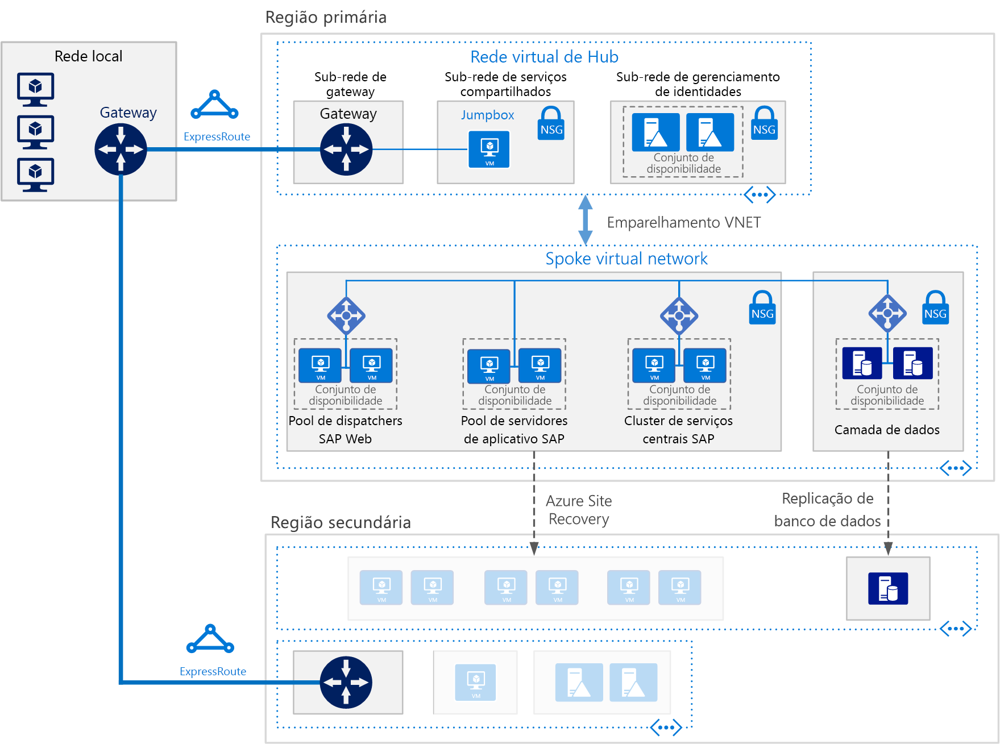

# Implantar o SAP NetWeaver (Windows) para AnyDB em Máquinas Virtuais do Azure

Essa arquitetura de referência mostra um conjunto de práticas comprovadas para executar o SAP NetWeaver em um ambiente Windows no Azure com alta disponibilidade. O banco de dados é o AnyDB, o termo da SAP para qualquer DBMS com suporte, além do SAP HANA. Essa arquitetura é implantada com tamanhos específicos de VM (máquina virtual) que podem ser alterados para acomodar as necessidades da sua organização.

*Baixe um [Arquivo Visio][visio-download] dessa arquitetura.*

> [!NOTE] 
> Implantar essa arquitetura de referência requer um licenciamento apropriado de produtos SAP e outras tecnologias que não são da Microsoft.

## Arquitetura
A arquitetura consiste na infraestrutura e nos componentes de software principais a seguir.

**Rede virtual**. O serviço da Rede Virtual do Azure conecta com segurança os recursos do Azure entre si. Nessa arquitetura, a rede virtual se conecta a um ambiente local por meio de um gateway VPN implantado no hub de um [hub-spoke](../hybrid-networking/hub-spoke.md). O spoke é a rede virtual usada para os aplicativos SAP e para a camada de banco de dados.

**Sub-redes**. A rede virtual é subdividida em sub-redes separadas para cada camada: aplicativo (SAP NetWeaver), banco de dados, serviços compartilhados (o jumpbox) e Active Directory.
    
**Máquinas virtuais**. Essa arquitetura usa máquinas virtuais para a camada de aplicativo e a camada de banco de dados, agrupadas da seguinte maneira:

- **SAP NetWeaver**. A camada de aplicativo usa máquinas virtuais do Windows e executa os SAP Central Services e servidores de aplicativo SAP. As VMs que executam os Central Services são configuradas como um Cluster de Failover do Windows Server para alta disponibilidade, com suporte pelo SIOS DataKeeper Cluster Edition.
- **AnyDB**. A camada de banco de dados executa o AnyDB como o banco de dados de origem, como Microsoft SQL Server, Oracle ou IBM DB2.
- **Jumpbox**. Também chamada de um host bastião. Essa é uma máquina virtual segura na rede que os administradores usam para se conectar às outras máquinas virtuais.
- **Controladores de domínio do Active Directory do Windows Server**. Os controladores de domínio são usados em todas as máquinas virtuais e usuários do domínio.

**Balanceadores de carga**. Tanto os balanceadores de carga internos do SAP quanto o [Azure Load Balancer](/azure/load-balancer/load-balancer-overview) são usados para obter a alta disponibilidade. As instâncias do Azure Load Balancer são usadas para distribuir o tráfego para máquinas virtuais na sub-rede de camada de aplicativo.

**Conjuntos de disponibilidade**. As máquinas virtuais para funções do SAP Web Dispatcher, servidor de aplicativos SAP e (A)SCS são agrupadas em [conjuntos de disponibilidades](/azure/virtual-machines/windows/tutorial-availability-sets) separados, e pelo menos duas máquinas virtuais são provisionadas por função. Isso torna as máquinas virtuais qualificadas para um [SLA (Contrato de Nível de Serviço)](https://azure.microsoft.com/support/legal/sla/virtual-machines) mais elevado.

**NICs**. Os [cartões de interface de rede](/azure/virtual-network/virtual-network-network-interface) (NICs) permitem toda a comunicação de máquinas virtuais em uma rede virtual.

**Grupos de segurança de rede**. Para restringir o tráfego de entrada, saída e dentro da sub-rede na rede virtual, é possível criar [NSGs (grupos de segurança de rede)](/azure/virtual-network/virtual-networks-nsg).

**Gateway**. Um gateway estende sua rede local para a rede virtual do Azure. O [ExpressRoute](/azure/architecture/reference-architectures/hybrid-networking/expressroute) é o serviço do Azure recomendado para criar conexões privadas que não passem pela Internet pública, mas uma conexão [Site a Site](/azure/vpn-gateway/vpn-gateway-howto-site-to-site-resource-manager-portal) também pode ser usada.

**Armazenamento do Azure**. Para fornecer um armazenamento persistente de um VHD (disco rígido virtual) de uma máquina virtual, é necessário o [Armazenamento do Azure](/azure/storage/storage-standard-storage). Ele também é usado por [Testemunha de nuvem](/windows-server/failover-clustering/deploy-cloud-witness) para implementar uma operação de cluster de failover. 

## Recomendações
Seus requisitos podem ser diferentes dos requisitos da arquitetura descrita aqui. Use essas recomendações como ponto de partida.

### Pool do SAP Web Dispatcher

O componente Web Dispatcher é usado como um balanceador de carga para tráfego da SAP entre os servidores de aplicativos SAP. Para obter a alta disponibilidade para o componente Web Dispatcher, o Azure Load Balancer é usado para implementar a configuração paralela do Web Dispatcher. O Web Dispatcher usa uma configuração de round robin para distribuição de tráfego HTTP(S) entre os Web Dispatchers disponíveis no pool de balanceadores.

Para obter detalhes sobre o SAP NetWeaver em VMs do Azure, confira [Planejamento e implementação de Máquinas Virtuais do Azure para SAP NetWeaver](/azure/virtual-machines/workloads/sap/planning-guide).

### Pool de servidores de aplicativos

Para gerenciar grupos de logon para servidores de aplicativos ABAP, é usada a transação SMLG. Ela usa a função de balanceamento de carga no servidor de mensagens do Central Services para distribuir a carga de trabalho entre o pool de servidores de aplicativos SAP para o tráfego de SAPGUIs e RFC. A conexão do servidor de aplicativos para o Central Services altamente disponível é feita através do nome de rede virtual do cluster.

### Cluster do SAP Central Services

Essa arquitetura de referência executa o Central Services em VMs na camada de aplicativo. O Central Services é um SPOF (ponto único de falha) potencial quando implantado em uma única VM — uma implantação típica quando a alta disponibilidade não é um requisito. Para implementar uma solução de alta disponibilidade, pode ser usado um cluster de disco compartilhado ou um cluster de compartilhamento de arquivos.

Para configurar VMs para um cluster de disco compartilhado, use [Cluster de Failover do Windows Server](https://blogs.sap.com/2018/01/25/how-to-create-sap-resources-in-windows-failover-cluster/). A [Testemunha de nuvem](/windows-server/failover-clustering/deploy-cloud-witness) é recomendada como uma testemunha de quorum. Para dar suporte ao ambiente de cluster de failover, a [SIOS DataKeeper Cluster Edition](https://azuremarketplace.microsoft.com/marketplace/apps/sios_datakeeper.sios-datakeeper-8) executa a função de volume de cluster compartilhado replicando discos independentes pertencentes a nós de cluster. O Azure não oferece suporte a discos compartilhados e, portanto, requer soluções fornecidas pelo SIOS.

Para obter detalhes, consulte “3. Atualização importante para o clientes SAP que executam o ASCS no SIOS no Azure” em [Execução de aplicativos SAP na plataforma Microsoft](https://blogs.msdn.microsoft.com/saponsqlserver/2017/05/04/sap-on-azure-general-update-for-customers-partners-april-2017/).

Outra maneira de lidar com o clustering é implementando um cluster de compartilhamento de arquivos usando o Cluster de Failover do Windows Server. Recentemente, a [SAP](https://blogs.sap.com/2018/03/19/migration-from-a-shared-disk-cluster-to-a-file-share-cluster/) modificou o padrão de implantação do Central Services para acessar os diretórios globais /sapmnt por meio de um caminho UNC. Essa alteração [remove o requisito](https://blogs.msdn.microsoft.com/saponsqlserver/2017/08/10/high-available-ascs-for-windows-on-file-share-shared-disk-no-longer-required/) para SIOS ou outras soluções compartilhadas de disco nas VMs do Central Services. Ainda é recomendável garantir que o compartilhamento do UNC /sapmnt seja [altamente disponível](https://blogs.sap.com/2017/07/21/how-to-create-a-high-available-sapmnt-share/). Isso pode ser feito na instância do Central Services usando um Cluster de Failover do Windows Server com [SOFS (Servidor de Arquivos de Escalabilidade Horizontal)](https://blogs.msdn.microsoft.com/saponsqlserver/2017/11/14/file-server-with-sofs-and-s2d-as-an-alternative-to-cluster-shared-disk-for-clustering-of-an-sap-ascs-instance-in-azure-is-generally-available/) e o recurso [S2D (Espaços de Armazenamento Diretos)](https://blogs.sap.com/2018/03/07/your-sap-on-azure-part-5-ascs-high-availability-with-storage-spaces-direct/) no Windows Server 2016. 

### Conjuntos de disponibilidade

Os conjuntos de disponibilidade distribuem os servidores a diferentes grupos de infraestrutura e atualizam grupos para melhorar a disponibilidade de serviço. Use máquinas virtuais que executem a mesma função em conjuntos de disponibilidade para ajudar a proteger contra o tempo de inatividade causado por uma manutenção da infraestrutura do Azure e para atender às [SLAs](https://azure.microsoft.com/support/legal/sla/virtual-machines). É recomendável ter duas ou mais máquinas virtuais por conjunto de disponibilidade.

Todas as máquinas virtuais em um conjunto devem executar a mesma função. Não misture servidores de funções diferentes no mesmo conjunto de disponibilidade. Por exemplo, não coloque um nó do Central Services no mesmo conjunto de disponibilidade com o servidor de aplicativos.

### NICs

Implantações tradicionais locais da SAP implementam vários NICs (Cartões de interface de rede) por computador para separar o tráfego administrativo do tráfego de negócios. No Azure, a rede virtual é uma rede definida pelo software que envia todo o tráfego pela mesma malha de rede. Portanto, é desnecessário o uso de vários NICs. No entanto, se sua organização precisar separar o tráfego, você pode implantar vários NICs por VM, conectar cada NIC a uma sub-rede diferente e, então, usar os NSGs para impor diferentes políticas de controle de acesso.

### Sub-redes e NSGs

Essa arquitetura subdivide o espaço de endereço da rede virtual em sub-redes. Essa arquitetura de referência se concentra principalmente na sub-rede da camada de aplicativo. Cada sub-rede pode ser associada a um NSG que define as políticas de acesso para a sub-rede. Coloque os servidores de aplicativos em uma sub-rede separada para poder protegê-los mais facilmente por meio do gerenciamento das políticas de segurança de sub-rede, não dos servidores individuais.

Quando um NSG está associado a uma sub-rede, ele se aplica a todos os servidores dentro dessa sub-rede. Para saber mais sobre como usar os NSGs para um controle refinado sobre os servidores em uma sub-rede, veja [Filtrar o tráfego de rede com os grupos de segurança de rede](https://azure.microsoft.com/en-us/blog/multiple-vm-nics-and-network-virtual-appliances-in-azure/).

### Balanceadores de carga

O [SAP Web Dispatcher](https://help.sap.com/doc/saphelp_nw73ehp1/7.31.19/en-US/48/8fe37933114e6fe10000000a421937/frameset.htm) lida com o balanceamento de carga do tráfego HTTP(S) a um pool de servidores de aplicativos SAP.

Para o tráfego de clientes do SAP GUI se conectando a um servidor SAP via protocolo DIAG ou RFC (Remote Function Calls), o servidor de mensagens do Central Services faz o balanceamento da carga por meio de [grupos de logon](https://wiki.scn.sap.com/wiki/display/SI/ABAP+Logon+Group+based+Load+Balancing) do servidor de aplicativos SAP, não sendo necessário nenhum balanceador de carga adicional.

### Armazenamento do Azure

É recomendável usar o Armazenamento Premium do Azure para latência de leitura/gravação consistente em todas as máquinas virtuais do servidor de banco de dados. Para qualquer máquina virtual de instância única usando o Armazenamento Premium em todos os discos do sistema operacional e discos de dados, consulte [SLA para máquinas virtuais](https://azure.microsoft.com/support/legal/sla/virtual-machines). Além disso, para sistemas SAP de produção, é recomendável usar o [Azure Managed Disks](/azure/storage/storage-managed-disks-overview) Premium em todos os casos. Para fins de confiabilidade, os Managed Disks são usados para gerenciar os arquivos VHD dos discos. Os discos gerenciados garantem que os discos para máquinas virtuais dentro de um conjunto de disponibilidade fiquem isolados para evitar pontos únicos de falha.

Para servidores de aplicativos SAP, incluindo as máquinas virtuais do Central Services, é possível usar o Armazenamento Padrão do Azure para reduzir os custos, uma vez que a execução do aplicativo ocorre na memória e os discos são usados somente para registro em log. No entanto, neste momento, o Armazenamento Padrão só está certificado para armazenamento não gerenciado. Uma vez que os servidores de aplicativos não hospedam nenhum dado, também é possível usar os discos menores de Armazenamento Premium P4 e P6 para ajudar a minimizar o custo.

O Armazenamento do Azure também é usado pela [Testemunha de nuvem](/windows-server/failover-clustering/deploy-cloud-witness) para manter o quorum com um dispositivo em uma região remota do Azure longe da região primária em que reside o cluster.

Para o repositório de dados de backup, é recomendável usar a [camada de acesso esporádico](/azure/storage/storage-blob-storage-tiers) do Azure e o [armazenamento da camada de acesso de arquivos](/azure/storage/storage-blob-storage-tiers). Essas camadas de armazenamento são maneiras econômicas para armazenar dados de longa vida útil que são acessados com pouca frequência.

## Considerações sobre o desempenho

Os servidores de aplicativos SAP realizam constantes comunicações com os servidores de banco de dados. Para aplicativos com desempenho essencial sendo executados em quaisquer plataformas de banco de dados, incluindo o SAP HANA, cogite habilitar o [Acelerador de gravação](/azure/virtual-machines/linux/how-to-enable-write-accelerator) para melhorar a latência de gravação de log. Para otimizar as comunicações entre servidores, use a [Rede Acelerada](https://azure.microsoft.com/blog/linux-and-windows-networking-performance-enhancements-accelerated-networking/). Observe que esses aceleradores estão disponíveis apenas para determinadas séries de VM.

Para obter altas IOPS e taxas de transferências de largura de banda de disco, as práticas comuns na [otimização de desempenho](/azure/virtual-machines/windows/premium-storage-performance) do volume de armazenamento se aplicam ao layout de armazenamento do Azure. Por exemplo, a combinação de vários discos em conjunto para criar um volume de discos distribuídos melhora o desempenho de E/S. Habilitar o cache de leitura do conteúdo de armazenamento que raramente é alterado melhora a velocidade de recuperação de dados.

Para SAP no SQL, o blog [As 10 principais considerações para a implantação de aplicativos SAP no Azure](https://blogs.msdn.microsoft.com/saponsqlserver/2015/05/25/top-10-key-considerations-for-deploying-sap-applications-on-azure/) oferece excelentes conselhos sobre como otimizar o armazenamento do Azure para cargas de trabalho da SAP no SQL Server.

## Considerações sobre escalabilidade

Na camada de aplicativo SAP, o Azure oferece uma ampla variedade de tamanhos de máquina virtual para escalar vertical ou horizontalmente. Para obter uma lista inclusiva, consulte [Nota SAP 1928533](https://launchpad.support.sap.com/#/notes/1928533) – Aplicativos SAP no Azure: tipos de VM do Azure e produtos com suporte. (Uma conta do SAP Service Marketplace é necessária para o acesso.) Servidores de aplicativos SAP e os clusters do Central Services podem ser escalado ou reduzido verticalmente com a adição de mais instâncias. O banco de dados AnyDB pode ser escalado ou reduzido verticalmente, mas não escalado horizontalmente. O contêiner do banco de dados SAP para AnyDB não oferece suporte para fragmentação.

## Considerações sobre disponibilidade

A redundância de recursos é o tema geral em soluções de infraestrutura altamente disponíveis. Para empresas que contam com um SLA menos rigoroso, as máquinas virtuais de instância única do Azure oferecem um SLA de tempo de atividade. Para obter mais informações, confira [Contrato de Nível de Serviço do Azure](https://azure.microsoft.com/support/legal/sla/).

Nessa instalação distribuída do aplicativo SAP, a instalação básica é replicada para obter a alta disponibilidade. O design de alta disponibilidade varia para cada camada da arquitetura.

### Camada de aplicativo

A alta disponibilidade do SAP Web Dispatcher é alcançada com instâncias redundantes. Consulte [SAP Web Dispatcher](https://help.sap.com/doc/saphelp_nw70ehp2/7.02.16/en-us/48/8fe37933114e6fe10000000a421937/frameset.htm) na documentação da SAP.

A alta disponibilidade do Central Services é implementada com o Cluster de Failover do Windows Server. Quando implantado no Azure, o armazenamento de cluster para o cluster de failover pode ser configurado usando duas abordagens: um volume compartilhado do cluster ou um compartilhamento de arquivos.

Uma vez que discos compartilhados não são possíveis no Azure, é usado o SIOS Datakeeper para replicar o conteúdo de discos independentes anexados a nós do cluster e para abstrair as unidades como um cluster de volume compartilhado para o gerenciador de cluster. Para obter detalhes de implementação, consulte [Clustering do SAP ASCS no Azure](https://blogs.msdn.microsoft.com/saponsqlserver/2015/05/20/clustering-sap-ascs-instance-using-windows-server-failover-cluster-on-microsoft-azure-with-sios-datakeeper-and-azure-internal-load-balancer/).

Outra opção é usar um compartilhamento de arquivo apresentado pelo [SOFS (Servidor de Arquivos de Escalabilidade Horizontal)](https://blogs.msdn.microsoft.com/saponsqlserver/2017/11/14/file-server-with-sofs-and-s2d-as-an-alternative-to-cluster-shared-disk-for-clustering-of-an-sap-ascs-instance-in-azure-is-generally-available/). O SOFS oferece compartilhamentos de arquivos resilientes que podem ser usados como um volume compartilhado de cluster para o cluster do Windows. Um cluster SOFS pode ser compartilhado entre vários nós do Central Services. A partir dessa gravação, o SOFS é usado apenas para o design de alta disponibilidade porque o cluster SOFS não se estende entre as regiões para dar suporte à recuperação de desastres.

A alta disponibilidade dos servidores de aplicativo SAP é obtida pelo tráfego de balanceamento de carga dentro de um pool de servidores de aplicativos.
Veja [Certificações e configurações da SAP em execução no Microsoft Azure](/azure/virtual-machines/workloads/sap/sap-certifications).

### Camada de banco de dados

Essa arquitetura de referência pressupõe que o banco de dados de origem esteja em execução no AnyDB — ou seja, um DBMS, como SQL Server, SAP ASE, IBM DB2 ou Oracle. O recurso de replicação nativa da camada de banco de dados fornece o failover manual ou automático entre nós replicados.

Para obter detalhes de implementação sobre sistemas específicos de banco de dados, consulte [Implantação de DBMS de Máquinas Virtuais do Azure para SAP NetWeaver](/azure/virtual-machines/workloads/sap/dbms-guide).

## Considerações de recuperação de desastres

Para DR (recuperação de desastres), você deve ser capaz de fazer failover para uma região secundária. Cada camada usa uma estratégia diferente para fornecer proteção de recuperação de desastres.

- **Camada de servidores de aplicativos**. Os servidores de aplicativos SAP não contêm dados corporativos. No Azure, uma estratégia simples de DR é criar servidores de aplicativos SAP na região secundária, depois tirá-los do ar. Após quaisquer alterações de configuração ou atualizações de kernel no servidor de aplicativo primário, as mesmas alterações devem ser copiadas para as máquinas virtuais na região secundária. Por exemplo, os executáveis de kernel copiados para as máquinas virtuais de DR. Para a replicação automática dos servidores de aplicativos para uma região secundária, o [Azure Site Recovery](/azure/site-recovery/site-recovery-overview) é a solução recomendada.

- **Central Services**. Esse componente da pilha do aplicativo SAP também não persiste dados corporativos. Você pode criar uma VM na região de recuperação de desastres para executar a função do Central Services. O único conteúdo do nó do Central Services primário a ser sincronizado é o conteúdo compartilhado /sapmnt. Além disso, se as configurações mudarem ou ocorrerem atualizações de kernel em servidores primários do Central Services, elas devem ser repetidas na VM na região de recuperação de desastres sendo executada no Central Services. Para sincronizar os dois servidores, você pode usar o Azure Site Recovery para replicar os nós de cluster ou simplesmente usar um trabalho de cópia agendado regularmente para copiar /sapmnt à região de recuperação de desastres. Para obter detalhes sobre essa compilação, cópia e o processo do método de replicação de failover de teste, baixe [SAP NetWeaver: Criando uma solução de recuperação de desastres baseada em Hyper-V e no Microsoft Azure](http://download.microsoft.com/download/9/5/6/956FEDC3-702D-4EFB-A7D3-2DB7505566B6/SAP%20NetWeaver%20-%20Building%20an%20Azure%20based%20Disaster%20Recovery%20Solution%20V1_5%20.docx) e consulte “4.3. Camada SAP SPOF (ASCS)."

- **Camada de banco de dados**. A melhor implementação da DR é com a tecnologia de replicação integrada própria do banco de dados. No caso do SQL Server, por exemplo, é recomendável usar o Grupo de Disponibilidade do AlwaysOn para estabelecer uma réplica em uma região remota, replicando as transações de maneira assíncrona com failover manual. A replicação assíncrona evita um impacto no desempenho de cargas de trabalho interativas no site primário. O failover manual oferece a oportunidade de uma pessoa avaliar o impacto da DR e decidir se a operação do site da DR é justificada.

Para usar o Azure Site Recovery para compilar automaticamente um site de produção totalmente replicado do original, você deve executar [scripts de implantação](/azure/site-recovery/site-recovery-runbook-automation) personalizados. Primeiro a recuperação de site implanta as VMs em conjuntos de disponibilidade, depois executa scripts para adicionar recursos, como balanceadores de carga.

## Considerações sobre capacidade de gerenciamento

O Azure oferece várias funções para [monitoramento e diagnóstico](/azure/architecture/best-practices/monitoring) da infraestrutura geral. Além disso, o monitoramento avançado de máquinas virtuais do Azure é tratado pelo Azure OMS (Operations Management Suite).

Para fornecer monitoramento de recursos baseado na SAP e desempenho de serviço da infraestrutura da SAP, é usada a extensão [Monitoramento Avançado da SAP do Azure](/azure/virtual-machines/workloads/sap/deployment-guide#detailed-tasks-for-sap-software-deployment). Essa extensão fornece as estatísticas de monitoramento do Azure para o aplicativo SAP para monitoramento do sistema operacional e as funções da ferramenta cockpit de DBA.

## Considerações de segurança

O SAP tem seu próprio mecanismo de gerenciamento de usuários (UME) para controlar o acesso e a autorização baseados em função do aplicativo SAP. Para obter detalhes, consulte [Servidor de aplicativos do SAP NetWeaver para o guia de segurança ABAP](https://help.sap.com/doc/7b932ef4728810148a4b1a83b0e91070/1610 001/en-US/frameset.htm?4dde53b3e9142e51e10000000a42189c.html) e [Guia de segurança do servidor de aplicativos Java do SAP NetWeaver](https://help.sap.com/doc/saphelp_snc_uiaddon_10/1.0/en-US/57/d8bfcf38f66f48b95ce1f52b3f5184/frameset.htm).

Para a segurança da rede adicional, cogite implementar uma [rede de perímetro](../dmz/secure-vnet-hybrid.md), a qual usa um dispositivo de rede virtual para criar um firewall na frente da sub-rede para o Web Dispatcher.

Para a segurança da infraestrutura, os dados são criptografados em trânsito e em repouso. A seção “Considerações sobre segurança” do [SAP NetWeaver nas máquinas virtuais (VMs) do Azure – Guia de planejamento e implementação](/azure/virtual-machines/workloads/sap/planning-guide) começa a tratar da segurança de rede. O guia também especifica as portas de rede que você deve abrir nos firewalls para permitir a comunicação do aplicativo.

Para criptografar os discos da máquina virtual do Windows, é possível usar o [Azure Disk Encryption](/azure/security/azure-security-disk-encryption). Ele usa o recurso BitLocker do Windows para fornecer criptografia de volume para o sistema operacional e os discos de dados. A solução também funciona com o Azure Key Vault para ajudá-lo a controlar e gerenciar os segredos e chaves de criptografia de disco em sua assinatura do Key Vault. Os dados em discos da máquina virtual são criptografados em repouso no armazenamento do Azure.

## Comunidades

As comunidades podem responder a perguntas e ajudá-lo a configurar uma implantação bem-sucedida. Considere o seguinte:

- [Como executar aplicativos SAP no blog Microsoft Platform](https://blogs.msdn.microsoft.com/saponsqlserver/2017/05/04/sap-on-azure-general-update-for-customers-partners-april-2017/)
- [Suporte da Comunidade do Azure](https://azure.microsoft.com/support/community/)
- [Comunidade do SAP](https://www.sap.com/community.html)
- [Stack Overflow](https://stackoverflow.com/tags/sap/)

[visio-download]: https://archcenter.blob.core.windows.net/cdn/sap-reference-architectures.vsdx