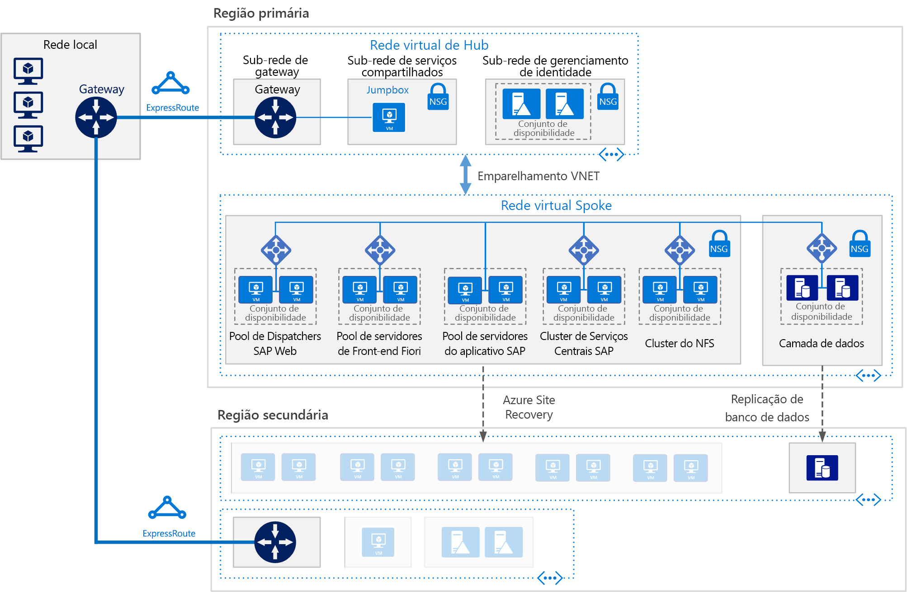

# SAP S/4HANA para máquinas virtuais com Linux no AzureSAP S/4HANA for Linux virtual machines on Azure

Essa arquitetura de referência mostra um conjunto de práticas comprovadas para executar o S/4HANA em um ambiente de alta disponibilidade no Azure que dê suporte à recuperação de desastre no Azure.This reference architecture shows a set of proven practices for running S/4HANA in a high availability environment that supports disaster recovery on Azure. Essa arquitetura é implantada com tamanhos específicos de VM (máquina virtual) que podem ser alterados para acomodar as necessidades da sua organização.This architecture is deployed with specific virtual machine (VM) sizes that can be changed to accommodate your organization's needs.

*Baixe um [Arquivo Visio][visio-download] dessa arquitetura.**Download a [Visio file][visio-download] of this architecture.*

> [!NOTE]
> Implantar essa arquitetura de referência requer um licenciamento apropriado de produtos SAP e outras tecnologias que não são da Microsoft.Deploying this reference architecture requires appropriate licensing of SAP products and other non-Microsoft technologies.

## ArquiteturaArchitecture

Essa arquitetura de referência descreve um nível empresarial, o sistema de nível de produção.This reference architecture describes a enterprise-grade, production-level system. De acordo com a necessidade da sua empresa, essa configuração poderá ser reduzida para uma única máquina virtual.To suit your business needs, this configuration can be reduced to a single virtual machine. No entanto, os seguintes componentes são necessários:However, the following components are required:

**Rede virtual**.**Virtual network**. O serviço [Rede Virtual do Azure](/azure/virtual-network/virtual-networks-overview) conecta com segurança os recursos do Azure entre si.The [Azure Virtual Network](/azure/virtual-network/virtual-networks-overview) service securely connects Azure resources to each other. Nessa arquitetura, a rede virtual se conecta a um ambiente local por meio de um gateway implantado no hub de uma [tecnologia hub-spoke](../hybrid-networking/hub-spoke.md).In this architecture, the virtual network connects to an on-premises environment through a gateway deployed in the hub of a [hub-spoke topology](../hybrid-networking/hub-spoke.md). O spoke é a rede virtual usada para os aplicativos SAP.The spoke is the virtual network used for the SAP applications.

**Sub-redes**.**Subnets**. A rede virtual é subdividida em [sub-redes](/azure/virtual-network/virtual-network-manage-subnet) separadas para cada camada: gateway, aplicativo, banco de dados e serviços compartilhados.The virtual network is subdivided into separate [subnets](/azure/virtual-network/virtual-network-manage-subnet) for each tier: gateway, application, database, and shared services.

**Máquinas virtuais**.**Virtual machines**. Essa arquitetura usa máquinas virtuais que executam Linux para a camada de aplicativo e a camada de banco de dados, agrupadas da seguinte maneira:This architecture uses virtual machines running Linux for the application tier and database tier, grouped as follows:

- **Camada de aplicativo**.**Application tier**. Inclui o pool de Servidores de Front-end Fiori, o pool do SAP Web Dispatcher, o pool de servidores de aplicativo e o cluster do SAP Central Services.Includes the Fiori Front-end Server pool, SAP Web Dispatcher pool, application server pool, and SAP Central Services cluster. Para alta disponibilidade do Central Services nas Máquinas Virtuais do Linux do Azure, é necessário um serviço NFS (Network File System) altamente disponível.For high availability of Central Services on Azure Linux virtual machines, a highly available Network File System (NFS) service is required.
- **Cluster NFS**.**NFS cluster**. Essa arquitetura usa um servidor [NFS](/azure/virtual-machines/workloads/sap/high-availability-guide-suse-nfs) em execução em um cluster Linux para armazenar dados compartilhados entre os sistemas SAP.This architecture uses an [NFS](/azure/virtual-machines/workloads/sap/high-availability-guide-suse-nfs) server running on a Linux cluster to store data shared between SAP systems. Este cluster centralizado pode ser compartilhado por vários sistemas SAP.This centralized cluster can be shared across multiple SAP systems. Para alta disponibilidade do serviço NFS, é usada a Extensão de Alta Disponibilidade apropriada para a distribuição de Linux selecionada.For high availability of the NFS service, the appropriate High Availability Extension for the selected Linux distribution is used.
- **SAP HANA**.**SAP HANA**. A camada de banco de dados usa duas ou mais máquinas virtuais do Linux em um cluster para obter alta disponibilidade.The database tier uses two or more Linux virtual machines in a cluster to achieve high availability. A HSR (Replicação de Sistema do HANA) é usada para replicar conteúdo entre os sistemas HANA primários e secundários.HANA System Replication (HSR) is used to replicate contents between primary and secondary HANA systems. O clustering do Linux é usado para detectar falhas de sistema e facilitar o failover automático.Linux clustering is used to detect system failures and facilitate automatic failover. Um mecanismo de isolamento com base em nuvem ou em armazenamento pode ser usado para garantir que o sistema com falha seja isolado ou desligado para evitar a condição de separação de cluster.A storage-based or cloud-based fencing mechanism can be used to ensure the failed system is isolated or shut down to avoid the cluster split-brain condition.
- **Jumpbox**.**Jumpbox**. Também chamada de um host bastião.Also called a bastion host. Essa é uma máquina virtual segura na rede que os administradores usam para se conectar às outras máquinas virtuais.This is a secure virtual machine on the network that administrators use to connect to the other virtual machines. Ele pode executar o Windows ou o Linux.It can run Windows or Linux. Use um jumpbox do Windows para a conveniência de navegação na Web ao usar as ferramentas de gerenciamento do HANA Cockpit ou do HANA Studio.Use a Windows jumpbox for web browsing convenience when using HANA Cockpit or HANA Studio management tools.

**Balanceadores de carga**.**Load balancers**. Tanto os balanceadores de carga internos do SAP quanto o [Azure Load Balancer](/azure/load-balancer/load-balancer-overview) são usados para obter a alta disponibilidade.Both built-in SAP load balancers and [Azure Load Balancer](/azure/load-balancer/load-balancer-overview) are used to achieve HA. As instâncias do Azure Load Balancer são usadas para distribuir o tráfego para máquinas virtuais na sub-rede de camada de aplicativo.Azure Load Balancer instances are used to distribute traffic to virtual machines in the application tier subnet.

**Conjuntos de disponibilidade**.**Availability sets**. As máquinas virtuais para todos os pools e clusters (Web Dispatcher, servidores de aplicativos SAP, Central Services, NFS e HANA) são agrupadas em [conjuntos de disponibilidades](/azure/virtual-machines/windows/tutorial-availability-sets) separados, e pelo menos duas máquinas virtuais são provisionadas por função.Virtual machines for all pools and clusters (Web Dispatcher, SAP application servers, Central Services, NFS, and HANA) are grouped into separate [availability sets](/azure/virtual-machines/windows/tutorial-availability-sets), and at least two virtual machines are provisioned per role. Isso torna as máquinas virtuais qualificadas para um [SLA (Contrato de Nível de Serviço)](https://azure.microsoft.com/support/legal/sla/virtual-machines) mais elevado.This makes the virtual machines eligible for a higher [service level agreement](https://azure.microsoft.com/support/legal/sla/virtual-machines) (SLA).

**NICs**.**NICs**. Os [cartões de interface de rede](/azure/virtual-network/virtual-network-network-interface) (NICs) permitem toda a comunicação de máquinas virtuais em uma rede virtual.[Network interface cards](/azure/virtual-network/virtual-network-network-interface) (NICs) enable all communication of virtual machines on a virtual network.

**Grupos de segurança de rede**.**Network security groups**. Para restringir o tráfego de entrada, saída e dentro da sub-rede na rede virtual, é possível criar [grupos de segurança de rede](/azure/virtual-network/virtual-networks-nsg) (NSGs).To restrict incoming, outgoing, and intra-subnet traffic in the virtual network, [network security groups](/azure/virtual-network/virtual-networks-nsg) (NSGs) are used.

**Gateway**.**Gateway**. Um gateway estende sua rede local para a rede virtual do Azure.A gateway extends your on-premises network to the Azure virtual network. O [ExpressRoute](/azure/architecture/reference-architectures/hybrid-networking/expressroute) é o serviço do Azure recomendado para criar conexões privadas que não passem pela Internet pública, mas uma conexão [Site a Site](/azure/vpn-gateway/vpn-gateway-howto-site-to-site-resource-manager-portal) também pode ser usada.[ExpressRoute](/azure/architecture/reference-architectures/hybrid-networking/expressroute) is the recommended Azure service for creating private connections that do not go over the public Internet, but a [Site-to-Site](/azure/vpn-gateway/vpn-gateway-howto-site-to-site-resource-manager-portal) connection can also be used.

**Armazenamento do Azure**.**Azure Storage**. Para fornecer um armazenamento persistente de um VHD (disco rígido virtual) de uma máquina virtual, é necessário o [Armazenamento do Azure](/azure/storage/).To provide persistent storage of a virtual machine's virtual hard disk (VHD), [Azure Storage](/azure/storage/) is required.

## RecomendaçõesRecommendations

Essa arquitetura descreve a implantação de uma empresa com um nível de produção pequeno.This architecture describes a small production-level enterprise deployment. Sua implantação será diferente de acordo com suas necessidades de negócios.Your deployment will differ based on your business requirements. Use essas recomendações como ponto de partida.Use these recommendations as a starting point.

### Máquinas virtuaisVirtual machines

Nos pools e clusters de servidor de aplicativos, ajuste o número de máquinas virtuais com base nos seus requisitos.In application server pools and clusters, adjust the number of virtual machines based on your requirements. O [guia de planejamento e implementação de Máquinas Virtuais do Azure](/azure/virtual-machines/workloads/sap/planning-guide) inclui detalhes sobre a execução do SAP NetWeaver em máquinas virtuais, mas as informações também se aplicam ao SAP S/4HANA.The [Azure Virtual Machines planning and implementation guide](/azure/virtual-machines/workloads/sap/planning-guide) includes details about running SAP NetWeaver on virtual machines, but the information applies to SAP S/4HANA as well.

Para obter detalhes sobre o suporte da SAP para tipos de máquina virtual do Azure e métricas de taxa de transferência (SAPS), consulte [Nota SAP 1928533](https://launchpad.support.sap.com/#/notes/1928533).For details about SAP support for Azure virtual machine types and throughput metrics (SAPS), see [SAP Note 1928533](https://launchpad.support.sap.com/#/notes/1928533).

### Pool do SAP Web DispatcherSAP Web Dispatcher pool

O componente Web Dispatcher é usado como um balanceador de carga para tráfego da SAP entre os servidores de aplicativos SAP.The Web Dispatcher component is used as a load balancer for SAP traffic among the SAP application servers. Para obter alta disponibilidade para o componente Web Dispatcher, o Azure Load Balancer será usado para implementar a configuração paralela do Web Dispatcher em uma configuração de round-robin para distribuição de tráfego de HTTP(S) entre os Web Dispatchers disponíveis no pool de back-end dos balanceadores.To achieve high availability for the Web Dispatcher component, Azure Load Balancer is used to implement the parallel Web Dispatcher setup in a round-robin configuration for HTTP(S) traffic distribution among the available Web Dispatchers in the balancers back-end pool.

### Servidor Front-end FioriFiori Front-end Server

O Servidor de Front-end Fiori usa um [NetWeaver Gateway](https://help.sap.com/doc/saphelp_gateway20sp12/2.0/en-US/76/08828d832e4aa78748e9f82204a864/content.htm?no_cache=true).The Fiori Front-end Server uses a [NetWeaver Gateway](https://help.sap.com/doc/saphelp_gateway20sp12/2.0/en-US/76/08828d832e4aa78748e9f82204a864/content.htm?no_cache=true). Para implantações pequenas, ele pode ser carregado no servidor Fiori.For small deployments, it can be loaded on the Fiori server. Para grandes implantações, um servidor separado para o NetWeaver Gateway pode ser implantado na frente do pool de Servidores de Front-end Fiori.For large deployments, a separate server for the NetWeaver Gateway may be deployed in front of the Fiori Front-end Server pool.

### Pool de servidores de aplicativosApplication servers pool

Para gerenciar grupos de logon para servidores de aplicativos ABAP, é usada a transação SMLG.To manage logon groups for ABAP application servers, the SMLG transaction is used. Ela usa a função de balanceamento de carga no servidor de mensagens do Central Services para distribuir a carga de trabalho entre o pool de servidores de aplicativos SAP para o tráfego de SAPGUIs e RFC.It uses the load balancing function within the message server of the Central Services to distribute workload among SAP application servers pool for SAPGUIs and RFC traffic. A conexão do servidor de aplicativos para o Central Services altamente disponível é feita através do nome de rede virtual do cluster.The application server connection to the highly available Central Services is through the cluster virtual network name. Isso evita a necessidade de alterar o perfil de servidor de aplicativos para a conectividade do Central Services após um failover local.This avoids the need to change the application server profile for Central Services connectivity after a local failover.

### Cluster do SAP Central ServicesSAP Central Services cluster

O Central Services poderá ser implantado em uma única máquina virtual quando não for um requisito de alta disponibilidade.Central Services can be deployed to a single virtual machine when high availability is not a requirement. No entanto, a máquina virtual única se torna um potencial ponto único de falha (SPOF) para o ambiente do SAP.However, the single virtual machine becomes a potential single point of failure (SPOF) for the SAP environment. Para uma implantação do Central Services altamente disponível, um cluster NFS altamente disponível e um cluster do Central Services altamente disponível são usados.For a highly available Central Services deployment, a highly available NFS cluster and a highly available Central Services cluster are used.

### Cluster NFSNFS cluster

O DRBD (Distributed Replicated Block Device) é usado para a replicação entre os nós do cluster de NFS.DRBD (Distributed Replicated Block Device) is used for replication between the nodes of the NFS cluster.

### Conjuntos de disponibilidadeAvailability sets

Os conjuntos de disponibilidade distribuem os servidores a diferentes grupos de infraestrutura e atualizam grupos para melhorar a disponibilidade de serviço.Availability sets distribute servers to different physical infrastructure and update groups to improve service availability. Use máquinas virtuais que executem a mesma função em conjuntos de disponibilidade para ajudar a proteger contra o tempo de inatividade causado por uma manutenção da infraestrutura do Azure e para atender às [SLAs](https://azure.microsoft.com/support/legal/sla/virtual-machines).Put virtual machines that perform the same role into an availability sets to help guard against downtime caused by Azure infrastructure maintenance and to meet [SLAs](https://azure.microsoft.com/support/legal/sla/virtual-machines). É recomendável ter duas ou mais máquinas virtuais por conjunto de disponibilidade.Two or more virtual machines per availability set is recommended.

Todas as máquinas virtuais em um conjunto devem executar a mesma função.All virtual machines in a set must perform the same role. Não misture servidores de funções diferentes no mesmo conjunto de disponibilidade.Do not mix servers of different roles in the same availability set. Por exemplo, não coloque um nó do ASCS no mesmo conjunto de disponibilidade com o servidor de aplicativos.For example, don't place a ASCS node in the same availability set with the application server.

### NICsNICs

As paisagens tradicionais locais da SAP implementam várias NICs (placas de interface de rede) por computador para separar o tráfego administrativo do tráfego de negócios.Traditional on-premises SAP landscapes implement multiple network interface cards (NICs) per machine to segregate administrative traffic from business traffic. No Azure, a rede virtual é uma rede definida pelo software que envia todo o tráfego pela mesma malha de rede.On Azure, the virtual network is a software-defined network that sends all traffic through the same network fabric. Portanto, é desnecessário o uso de vários NICs.Therefore, the use of multiple NICs is unnecessary. No entanto, se sua organização precisar separar o tráfego, você pode implantar vários NICs por VM, conectar cada NIC a uma sub-rede diferente e, então, usar os NSGs para impor diferentes políticas de controle de acesso.However, if your organization needs to segregate traffic, you can deploy multiple NICs per VM, connect each NIC to a different subnet, and then use NSGs to enforce different access control policies.

### Sub-redes e NSGsSubnets and NSGs

Essa arquitetura subdivide o espaço de endereço da rede virtual em sub-redes.This architecture subdivides the virtual network address space into subnets. Cada sub-rede pode ser associada a um NSG que define as políticas de acesso para a sub-rede.Each subnet can be associated with a NSG that defines the access policies for the subnet. Coloque os servidores de aplicativos em uma sub-rede separada para poder protegê-los mais facilmente por meio do gerenciamento das políticas de segurança de sub-rede, não dos servidores individuais.Place application servers on a separate subnet so you can secure them more easily by managing the subnet security policies, not the individual servers.

Quando um NSG está associado a uma sub-rede, então ele se aplica a todos os servidores dentro dessa sub-rede.When a NSG is associated with a subnet, it then applies to all the servers within the subnet. Para saber mais sobre como usar os NSGs para um controle refinado sobre os servidores em uma sub-rede, veja [Filtrar o tráfego de rede com os grupos de segurança de rede](https://azure.microsoft.com/blog/multiple-vm-nics-and-network-virtual-appliances-in-azure/).For more information about using NSGs for fine-grained control over the servers in a subnet, see [Filter network traffic with network security groups](https://azure.microsoft.com/blog/multiple-vm-nics-and-network-virtual-appliances-in-azure/).

Veja também [Planejamento e design para o Gateway de VPN](/azure/vpn-gateway/vpn-gateway-plan-design).See also [Planning and design for VPN Gateway](/azure/vpn-gateway/vpn-gateway-plan-design).

### Balanceadores de cargaLoad balancers

O [SAP Web Dispatcher](https://help.sap.com/doc/saphelp_nw73ehp1/7.31.19/en-US/48/8fe37933114e6fe10000000a421937/frameset.htm) lida com o balanceamento de carga do tráfego HTTP(S) incluindo aplicativos do estilo do Fiori a um pool de servidores de aplicativos SAP.[SAP Web Dispatcher](https://help.sap.com/doc/saphelp_nw73ehp1/7.31.19/en-US/48/8fe37933114e6fe10000000a421937/frameset.htm) handles load balancing of HTTP(S) traffic including Fiori style applications to a pool of SAP application servers.

Para o tráfego de clientes do SAP GUI se conectando a um servidor SAP via DIAG ou RFC (Remote Function Calls), o servidor de mensagens do Central Services faz o balanceamento da carga por meio de [grupos de logon](https://wiki.scn.sap.com/wiki/display/SI/ABAP+Logon+Group+based+Load+Balancing) do servidor de aplicativos SAP, não sendo necessário nenhum balanceador de carga adicional.For traffic from SAP GUI clients connecting a SAP server via DIAG or Remote Function Calls (RFC), the Central Service message server balances the load through SAP application server [logon groups](https://wiki.scn.sap.com/wiki/display/SI/ABAP+Logon+Group+based+Load+Balancing), so no additional load balancer is needed.

### Armazenamento do AzureAzure Storage

É recomendável usar o Armazenamento Premium do Azure para as máquinas de virtuais do servidor de banco de dados.We recommend using Azure Premium Storage for the database server virtual machines. O armazenamento Premium oferece latência de leitura/gravação consistente.Premium storage provides consistent read/write latency. Para obter detalhes sobre o uso do Armazenamento Premium para os discos do sistema operacional e os discos de dados de uma máquina de instância única, veja [SLA para máquinas virtuais](https://azure.microsoft.com/support/legal/sla/virtual-machines/).For details about using Premium Storage for the operating system disks and data disks of a single-instance virtual machine, see [SLA for Virtual Machines](https://azure.microsoft.com/support/legal/sla/virtual-machines/).

Para todos os sistemas SAP de produção, é recomendável usar o [Azure Managed Disks](/azure/storage/storage-managed-disks-overview) Premium.For all production SAP systems, we recommend using Premium [Azure Managed Disks](/azure/storage/storage-managed-disks-overview). Os Managed Disks são usados para gerenciar os arquivos VHD dos discos, adicionando confiabilidade.Managed Disks are used to manage the VHD files for the disks, adding reliability. Eles também garantem que os discos para máquinas virtuais dentro de um conjunto de disponibilidade fiquem isolados para evitar pontos únicos de falha.They also ensure that the disks for virtual machines within an availability set are isolated to avoid single points of failure.

Para servidores de aplicativos SAP, incluindo as máquinas virtuais do Central Services, é possível usar o Armazenamento Padrão do Azure para reduzir os custos, uma vez que a execução do aplicativo ocorre na memória e usa os discos somente para registro em log.For SAP application servers, including the Central Services virtual machines, you can use Azure Standard Storage to reduce cost, because application execution takes place in memory and uses disks for logging only. No entanto, neste momento, o Armazenamento Padrão só está certificado para armazenamento não gerenciado.However, at this time, Standard Storage is only certified for unmanaged storage. Uma vez que os servidores de aplicativos não hospedam nenhum dado, também é possível usar os discos menores de Armazenamento Premium P4 e P6 para ajudar a minimizar o custo.Since application servers do not host any data, you can also use the smaller P4 and P6 Premium Storage disks to help minimize cost.

Para o repositório de dados de backup, é recomendável usar a [camada de acesso esporádico e/ou o armazenamento da camada de acesso de arquivos](/azure/storage/storage-blob-storage-tiers) do Azure.For the backup data store, we recommend using Azure [cool access tier storage and/or archive access tier storage](/azure/storage/storage-blob-storage-tiers). Essas camadas de armazenamento são maneiras econômicas para armazenar dados de longa vida útil que são acessados com menos frequência.These storage tiers are cost-effective ways to store long-lived data that is less frequently accessed.

## Considerações sobre o desempenhoPerformance considerations

Os servidores de aplicativos SAP realizam constantes comunicações com os servidores de banco de dados.SAP application servers carry on constant communications with the database servers. Para as máquinas virtuais de banco de dados HANA, considere habilitar o [Acelerador de Gravação](/azure/virtual-machines/linux/how-to-enable-write-accelerator) para melhorar a latência da gravação de logs.For the HANA database virtual machines, consider enabling [Write Accelerator](/azure/virtual-machines/linux/how-to-enable-write-accelerator) to improve log write latency. Para otimizar as comunicações entre servidores, use a [Rede Acelerada](https://azure.microsoft.com/blog/linux-and-windows-networking-performance-enhancements-accelerated-networking/).To optimize inter-server communications, use the [Accelerated Network](https://azure.microsoft.com/blog/linux-and-windows-networking-performance-enhancements-accelerated-networking/). Observe que esses aceleradores estão disponíveis apenas para determinadas séries de VM.Note that these accelerators are available only for certain VM series.

Para obter altas IOPS e taxas de transferências de largura de banda de disco, as práticas comuns na [otimização de desempenho](/azure/virtual-machines/linux/premium-storage-performance) do volume de armazenamento se aplicam ao layout de armazenamento do Azure.To achieve high IOPS and disk bandwidth throughput, the common practices in storage volume [performance optimization](/azure/virtual-machines/linux/premium-storage-performance) apply to Azure storage layout. Por exemplo, a combinação de vários discos em conjunto para criar um volume de discos distribuídos melhora o desempenho de E/S.For example, combining multiple disks together to create a striped disk volume improves IO performance. Habilitar o cache de leitura do conteúdo de armazenamento que raramente é alterado melhora a velocidade de recuperação de dados.Enabling the read cache on storage content that changes infrequently enhances the speed of data retrieval. Para obter detalhes sobre os requisitos de desempenho, consulte [Nota SAP 1943937 - Ferramenta de verificação de configuração de hardware](https://launchpad.support.sap.com/#/notes/1943937) (conta do SAP Service Marketplace necessária para o acesso).For details about performance requirements, see [SAP note 1943937 - Hardware Configuration Check Tool](https://launchpad.support.sap.com/#/notes/1943937) (SAP Service Marketplace account required for access).

## Considerações sobre escalabilidadeScalability considerations

Na camada de aplicativo SAP, o Azure oferece uma ampla variedade de tamanhos de máquina virtual para escalar vertical ou horizontalmente. Para obter uma lista inclusiva, confira a [Nota SAP 1928533](https://launchpad.support.sap.com/#/notes/1928533) - Aplicativos SAP no Azure: Produtos e tipos de VM do Azure com suporte (é necessário ter uma conta do SAP Service Marketplace para ter acesso).At the SAP application layer, Azure offers a wide range of virtual machine sizes for scaling up and scaling out. For an inclusive list, see [SAP Note 1928533](https://launchpad.support.sap.com/#/notes/1928533) - SAP Applications on Azure: Supported Products and Azure VM types (SAP Service Marketplace account required for access). Conforme continuamos a certificar mais tipos de máquinas virtuais, você pode expandir ou reduzir com a mesma implantação de nuvem.As we continue to certify more virtual machines types, you can scale up or down with the same cloud deployment.

Na camada de banco de dados, essa arquitetura executa o HANA em máquinas virtuais.At the database layer, this architecture runs HANA on VMs. Se sua carga de trabalho exceder o tamanho máximo da VM, a Microsoft também oferecerá [Instâncias Grandes do Azure](/azure/virtual-machines/workloads/sap/hana-overview-architecture) para o SAP HANA.If your workload exceeds the maximum VM size, Microsoft also offers [Azure Large Instances](/azure/virtual-machines/workloads/sap/hana-overview-architecture) for SAP HANA. Esses servidores físicos são colocados em um datacenter certificado do Microsoft Azure e, no momento da redação deste artigo, forneça até 20 TB de capacidade de memória para uma única instância.These physical servers are co-located in a Microsoft Azure certified datacenter and as of this writing, provide up to 20 TB of memory capacity for a single instance. Uma configuração de vários nós também é possível com uma capacidade de memória total de até 60 TB.Multi-node configuration is also possible with a total memory capacity of up to 60 TB.

## Considerações sobre disponibilidadeAvailability considerations

A redundância de recursos é o tema geral em soluções de infraestrutura altamente disponíveis.Resource redundancy is the general theme in highly available infrastructure solutions. Para empresas que contam com um SLA menos rigoroso, as máquinas virtuais de instância única do Azure oferecem um SLA de tempo de atividade.For enterprises that have a less stringent SLA, single-instance Azure VMs offer an uptime SLA. Para obter mais informações, confira [Contrato de Nível de Serviço do Azure](https://azure.microsoft.com/support/legal/sla/).For more information, see [Azure Service Level Agreement](https://azure.microsoft.com/support/legal/sla/).

Nessa instalação distribuída do aplicativo SAP, a instalação básica é replicada para obter a alta disponibilidade.In this distributed installation of the SAP application, the base installation is replicated to achieve high availability. O design de alta disponibilidade varia para cada camada da arquitetura.For each layer of the architecture, the high availability design varies.

### Camada de aplicativoApplication tier

- Web Dispatcher.Web Dispatcher. A alta disponibilidade é obtida com instâncias redundantes do Web Dispatcher.High availability is achieved with redundant Web Dispatcher instances. Veja [SAP Web Dispatcher](https://help.sap.com/doc/saphelp_nw70ehp2/7.02.16/en-us/48/8fe37933114e6fe10000000a421937/frameset.htm) na documentação do SAP.See [SAP Web Dispatcher](https://help.sap.com/doc/saphelp_nw70ehp2/7.02.16/en-us/48/8fe37933114e6fe10000000a421937/frameset.htm) in the SAP documentation.
- Servidores Fiori.Fiori servers. A alta disponibilidade é obtida pelo tráfego de balanceamento de carga dentro de um pool de servidores.High availability is achieved by load balancing traffic within a pool of servers.
- Central Services.Central Services. Para a alta disponibilidade do Central Services em Máquinas Virtuais do Linux do Azure, a Extensão de Alta Disponibilidade apropriada para a distribuição Linux selecionada é usada, e o cluster NFS altamente disponível hospeda o armazenamento DRBD.For high availability of Central Services on Azure Linux virtual machines, the appropriate High Availability Extension for the selected Linux distribution is used, and the highly available NFS cluster hosts DRBD storage.
- Servidores de aplicativos.Application servers. A alta disponibilidade é obtida pelo tráfego de balanceamento de carga dentro de um pool de servidores de aplicativos.High availability is achieved by load balancing traffic within a pool of application servers.

### Camada de banco de dadosDatabase tier

Essa arquitetura de referência descreve um sistema altamente disponível de banco de dados SAP HANA com duas máquinas virtuais do Azure.This reference architecture depicts a highly available SAP HANA database system consisting of two Azure virtual machines. O recurso de replicação de sistema nativo da camada de banco de dados fornece o failover manual ou automático entre nós replicados:The database tier's native system replication feature provides either manual or automatic failover between replicated nodes:

- Para failover manual, implante mais de uma instância do HANA e use a Replicação de Sistema do HANA (HSR).For manual failover, deploy more than one HANA instance and use HANA System Replication (HSR).
- Para failover automático, use HSR e a Extensão de Alta Disponibilidade (HAE) do Linux para sua distribuição Linux.For automatic failover, use both HSR and Linux High Availability Extension (HAE) for your Linux distribution. O HAE Linux fornece os serviços de cluster para os recursos do HANA, detecção de eventos de falha e orquestração do failover de serviços problemáticos para o nó íntegro.Linux HAE provides the cluster services to the HANA resources, detecting failure events and orchestrating the failover of errant services to the healthy node.

Veja [Certificações e configurações da SAP em execução no Microsoft Azure](/azure/virtual-machines/workloads/sap/sap-certifications).See [SAP certifications and configurations running on Microsoft Azure](/azure/virtual-machines/workloads/sap/sap-certifications).

### Considerações de recuperação de desastresDisaster recovery considerations

Cada camada usa uma estratégia diferente para fornecer proteção de recuperação de desastres.Each tier uses a different strategy to provide disaster recovery (DR) protection.

- **Camada de servidores de aplicativos**.**Application servers tier**. Os servidores de aplicativos SAP não contêm dados corporativos.SAP application servers do not contain business data. No Azure, uma estratégia simples de DR é criar servidores de aplicativos SAP na região secundária, depois tirá-los do ar.On Azure, a simple DR strategy is to create SAP application servers in the secondary region, then shut them down. Após quaisquer alterações de configuração ou atualizações de kernel no servidor de aplicativo primário, as mesmas alterações devem ser aplicadas às máquinas virtuais na região secundária.Upon any configuration changes or kernel updates on the primary application server, the same changes must be applied to the virtual machines in the secondary region. Por exemplo, copie os executáveis de kernel do SAP para as máquinas virtuais de recuperação de desastre.For example, copy the SAP kernel executables to the DR virtual machines. Para a replicação automática dos servidores de aplicativos para uma região secundária, o [Azure Site Recovery](/azure/site-recovery/site-recovery-overview) é a solução recomendada.For automatic replication of application servers to a secondary region, [Azure Site Recovery](/azure/site-recovery/site-recovery-overview) is the recommended solution. No momento da preparação deste documento, o ASR ainda não dá suporte à replicação da configuração de Rede Acelerada em VMs do Azure.As of the writing of this paper, ASR doesn't yet support the replication of the Accelerated Network configuration setting in Azure VMs.

- **Central Services**.**Central Services**. Esse componente da pilha do aplicativo SAP também não persiste dados corporativos.This component of the SAP application stack also does not persist business data. Você pode criar uma VM na região secundária para executar a função do Central Services.You can build a VM in the secondary region to run the Central Services role. O único conteúdo do nó do Central Services primário a ser sincronizado é o conteúdo compartilhado /sapmnt.The only content from the primary Central Services node to synchronize is the /sapmnt share content. Além disso, se as configurações mudarem ou ocorrerem atualizações de kernel em servidores primários do Central Services, elas devem ser repetidas na VM na região secundária sendo executada no Central Services.Also, if configuration changes or kernel updates take place on the primary Central Services servers, they must be repeated on the VM in the secondary region running Central Services. Para sincronizar os dois servidores, você pode usar o Azure Site Recovery para replicar os nós de cluster ou simplesmente usar um trabalho de cópia agendado regularmente para copiar /sapmnt para o lado da recuperação de desastre.To synchronize the two servers, you can use either Azure Site Recovery, to replicate the cluster nodes, or simply use a regularly scheduled copy job to copy /sapmnt to the DR side. Para obter detalhes sobre a compilação, cópia e teste do processo de failover, baixe [SAP NetWeaver: Compilar uma solução de recuperação de desastre baseada em Hyper-V e no Microsoft Azure](https://download.microsoft.com/download/9/5/6/956FEDC3-702D-4EFB-A7D3-2DB7505566B6/SAP%20NetWeaver%20-%20Building%20an%20Azure%20based%20Disaster%20Recovery%20Solution%20V1_5%20.docx) e consulte a seção 4.3, "Camada SAP SPOF (ASCS)".For details about the build, copy, and test failover process, download [SAP NetWeaver: Building a Hyper-V and Microsoft Azure–based Disaster Recovery Solution](https://download.microsoft.com/download/9/5/6/956FEDC3-702D-4EFB-A7D3-2DB7505566B6/SAP%20NetWeaver%20-%20Building%20an%20Azure%20based%20Disaster%20Recovery%20Solution%20V1_5%20.docx), and refer to section 4.3, "SAP SPOF layer (ASCS)." Este artigo se aplica ao NetWeaver em execução no Windows, mas você pode criar a configuração equivalente para Linux.This paper applies to NetWeaver running on Windows, but you can create the equivalent configuration for Linux. Para o Central Services, use o [Azure Site Recovery](/en-us/azure/site-recovery/site-recovery-overview) para replicar os nós e o armazenamento do cluster.For Central Services, use [Azure Site Recovery](/en-us/azure/site-recovery/site-recovery-overview) to replicate the cluster nodes and storage. Para o Linux, crie um cluster geográfico de três nós usando uma Extensão de Alta Disponibilidade.For Linux, create a three node geo-cluster using a High Availability Extension.

- **Camada de banco de dados do SAP**.**SAP database tier**. Use o HSR para replicação com suporte do HANA.Use HSR for HANA-supported replication. Além de uma configuração de alta disponibilidade local de dois nós, a HSR oferece suporte à replicação de várias camadas, em que um terceiro nó em uma região separada do Azure age como uma entidade estrangeira, que não faz parte do cluster, e é registrado na réplica secundária do par da HSR com cluster como seu destino de replicação.In addition to a local, two-node high availability setup, HSR supports multi-tier replication where a third node in a separate Azure region acts as a foreign entity, not part of the cluster, and registers to the secondary replica of the clustered HSR pair as its replication target. Isso forma uma corrente encadeada de replicação.This form a replication daisy chain. O failover para o nó de recuperação de desastre é um processo manual.The failover to the DR node is a manual process.

Para usar o Azure Site Recovery para compilar automaticamente um site de produção totalmente replicado do original, você deve executar [scripts de implantação](/azure/site-recovery/site-recovery-runbook-automation) personalizados.To use Azure Site Recovery to automatically build a fully replicated production site of your original, you must run customized [deployment scripts](/azure/site-recovery/site-recovery-runbook-automation). Primeiro a recuperação de site implanta as máquinas virtuais em conjuntos de disponibilidade, depois executa scripts para adicionar recursos, como balanceadores de carga.Site Recovery first deploys the virtual machines in availability sets, then runs scripts to add resources such as load balancers.

## Considerações sobre capacidade de gerenciamentoManageability considerations

O SAP HANA tem um recurso de backup que usa a infraestrutura subjacente do Azure.SAP HANA has a backup feature that makes use of the underlying Azure infrastructure. Para fazer backup do banco de dados do SAP HANA em execução em máquinas virtuais do Azure, o instantâneo do armazenamento do Azure e o instantâneo do SAP HANA são usados para garantir a consistência dos arquivos de backup.To back up the SAP HANA database running on Azure virtual machines, both the SAP HANA snapshot and Azure storage snapshot are used to ensure the backup files' consistency. Para obter detalhes, veja o [Guia de backup para o SAP HANA em máquinas virtuais do Azure](/azure/virtual-machines/workloads/sap/sap-hana-backup-guide) e [Perguntas frequentes sobre o serviço de Backup do Azure](/azure/backup/backup-azure-backup-faq).For details, see [Backup guide for SAP HANA on Azure Virtual Machines](/azure/virtual-machines/workloads/sap/sap-hana-backup-guide) and the [Azure Backup service FAQ](/azure/backup/backup-azure-backup-faq). Somente as implantações de contêiner único do HANA oferecem suporte a instantâneos de armazenamento do Azure.Only HANA single container deployments support Azure storage snapshot.

### Gerenciamento de identidadesIdentity management

Controle o acesso aos recursos usando um sistema de gerenciamento centralizado de identidades em todos os níveis:Control access to resources by using a centralized identity management system at all levels:

- Forneça acesso aos recursos do Azure por meio de [controle de acesso baseado em função](/azure/active-directory/role-based-access-control-what-is) (RBAC).Provide access to Azure resources through [role-based access control](/azure/active-directory/role-based-access-control-what-is) (RBAC).
- Conceda acesso às VMs do Azure por meio do LDAP, Azure Active Directory, Kerberos ou outro sistema.Grant access to Azure VMs through LDAP, Azure Active Directory, Kerberos, or another system.
- Ofereça suporte ao acesso de dentro dos próprios apps por meio dos serviços fornecidos pela SAP ou use o [OAuth 2.0 e o Azure Active Directory](/azure/active-directory/develop/active-directory-protocols-oauth-code).Support access within the apps themselves through the services that SAP provides, or use [OAuth 2.0 and Azure Active Directory](/azure/active-directory/develop/active-directory-protocols-oauth-code).

### MonitoramentoMonitoring

O Azure oferece várias funções para [monitoramento e diagnóstico](/azure/architecture/best-practices/monitoring) da infraestrutura geral.Azure provides several functions for [monitoring and diagnostics](/azure/architecture/best-practices/monitoring) of the overall infrastructure. Além disso, o monitoramento avançado de máquinas virtuais do Azure (Linux ou Windows) é tratado pelo Azure Operations Management Suite (OMS).Also, enhanced monitoring of Azure virtual machines (Linux or Windows) is handled by Azure Operations Management Suite (OMS).

Para fornecer monitoramento de recursos baseado na SAP e desempenho de serviço da infraestrutura da SAP, é usada a extensão [Monitoramento Avançado da SAP do Azure](/azure/virtual-machines/workloads/sap/deployment-guide#d98edcd3-f2a1-49f7-b26a-07448ceb60ca).To provide SAP-based monitoring of resources and service performance of the SAP infrastructure, the [Azure SAP Enhanced Monitoring](/azure/virtual-machines/workloads/sap/deployment-guide#d98edcd3-f2a1-49f7-b26a-07448ceb60ca) extension is used. Essa extensão fornece as estatísticas de monitoramento do Azure para o aplicativo SAP para monitoramento do sistema operacional e as funções da ferramenta cockpit de DBA.This extension feeds Azure monitoring statistics into the SAP application for operating system monitoring and DBA Cockpit functions. O monitoramento avançado do SAP é um pré-requisito obrigatório para executar o SAP no Azure.SAP enhanced monitoring is a mandatory prerequisite to run SAP on Azure. Verifique os detalhes na [nota do SAP 2191498](https://launchpad.support.sap.com/#/notes/2191498) – "SAP no Linux com o Azure: Monitoramento avançado."For details, see [SAP Note 2191498](https://launchpad.support.sap.com/#/notes/2191498) – "SAP on Linux with Azure: Enhanced Monitoring."

## Considerações de segurançaSecurity considerations

O SAP tem seu próprio mecanismo de gerenciamento de usuários (UME) para controlar o acesso e a autorização baseados em função do aplicativo SAP.SAP has its own Users Management Engine (UME) to control role-based access and authorization within the SAP application. Para obter detalhes, veja [Segurança do SAP HANA — uma visão geral](https://archive.sap.com/documents/docs/DOC-62943) (uma conta da SAP Service Marketplace é necessária para o acesso).For details, see [SAP HANA Security—An Overview](https://archive.sap.com/documents/docs/DOC-62943) (SAP Service Marketplace account required for access.)

Para a segurança da rede adicional, cogite implementar uma [Rede de Perímetro](/azure/architecture/reference-architectures/dmz/secure-vnet-hybrid), a qual usa um dispositivo de rede virtual para criar um firewall na frente da sub-rede para o Web Dispatcher e pools de Servidores de Front-end Fiori.For additional network security, consider implementing a [Network DMZ](/azure/architecture/reference-architectures/dmz/secure-vnet-hybrid), which uses a network virtual appliance to create a firewall in front of the subnet for Web Dispatcher and Fiori Front-End Server pools.

Para a segurança da infraestrutura, os dados são criptografados em trânsito e em repouso.For infrastructure security, data is encrypted in transit and at rest. A seção "Considerações sobre segurança" do [SAP NetWeaver nas máquinas virtuais do Azure – Guia de planejamento e implementação](/azure/virtual-machines/workloads/sap/planning-guide) começa a tratar da segurança de rede e a aplica ao S/4HANA.The "Security considerations" section of the [SAP NetWeaver on Azure Virtual Machines–Planning and Implementation Guide](/azure/virtual-machines/workloads/sap/planning-guide) begins to address network security and applies to S/4HANA. O guia também especifica as portas de rede que você deve abrir nos firewalls para permitir a comunicação do aplicativo.The guide also specifies the network ports you must open on the firewalls to allow application communication.

Para criptografar os discos de máquina virtual do IaaS Linux, você pode usar o [Azure Disk Encryption](/azure/security/azure-security-disk-encryption).To encrypt Linux IaaS virtual machine disks, you can use [Azure Disk Encryption](/azure/security/azure-security-disk-encryption). Ele usa o recurso DM-Crypt do Linux para fornecer criptografia de volume para o sistema operacional e os discos de dados.It uses the DM-Crypt feature of Linux to provide volume encryption for the operating system and the data disks. A solução também funciona com o Azure Key Vault para ajudá-lo a controlar e gerenciar os segredos e chaves de criptografia de disco em sua assinatura do Key Vault.The solution also works with Azure Key Vault to help you control and manage the disk-encryption keys and secrets in your key vault subscription. Os dados em discos da máquina virtual são criptografados em repouso no armazenamento do Azure.Data on the virtual machine disks are encrypted at rest in your Azure storage.

Para criptografia de dados em repouso do SAP HANA, é recomendável usar a tecnologia de criptografia nativa do SAP HANA.For SAP HANA data-at-rest encryption, we recommend using the SAP HANA native encryption technology.

> [!NOTE]
> Não use a criptografia de dados em repouso HANA com Azure Disk Encryption no mesmo servidor.Do not use the HANA data-at-rest encryption with Azure Disk Encryption on the same server. Para o HANA, use somente a criptografia de dados do HANA.For HANA, use only HANA data encryption.

## ComunidadesCommunities

As comunidades podem responder a perguntas e ajudá-lo a configurar uma implantação bem-sucedida.Communities can answer questions and help you set up a successful deployment. Considere o seguinte:Consider the following:

- [Como executar aplicativos SAP no blog Microsoft PlatformRunning SAP Applications on the Microsoft Platform Blog](https://blogs.msdn.microsoft.com/saponsqlserver/2017/05/04/sap-on-azure-general-update-for-customers-partners-april-2017/)
- [Suporte da Comunidade do AzureAzure Community Support](https://azure.microsoft.com/support/community/)
- [Comunidade do SAPSAP Community](https://www.sap.com/community.html)
- [Stack OverflowStack Overflow](https://stackoverflow.com/tags/sap/)

## Recursos relacionadosRelated resources

Talvez seja melhor examinar os seguintes [cenários de exemplo do Azure](/azure/architecture/example-scenario), que demonstram soluções específicas usando algumas das mesmas tecnologias:You may wish to review the following [Azure example scenarios](/azure/architecture/example-scenario) that demonstrate specific solutions using some of the same technologies:

- [Executando cargas de trabalho de produção do SAP usando um Oracle Database no AzureRunning SAP production workloads using an Oracle Database on Azure](/azure/architecture/example-scenario/apps/sap-production)
- [Ambientes de desenvolvimento/teste para cargas de trabalho do SAP no AzureDev/test environments for SAP workloads on Azure](/azure/architecture/example-scenario/apps/sap-dev-test)

<!-- links -->

[visio-download]: https://archcenter.blob.core.windows.net/cdn/sap-reference-architectures.vsdx
