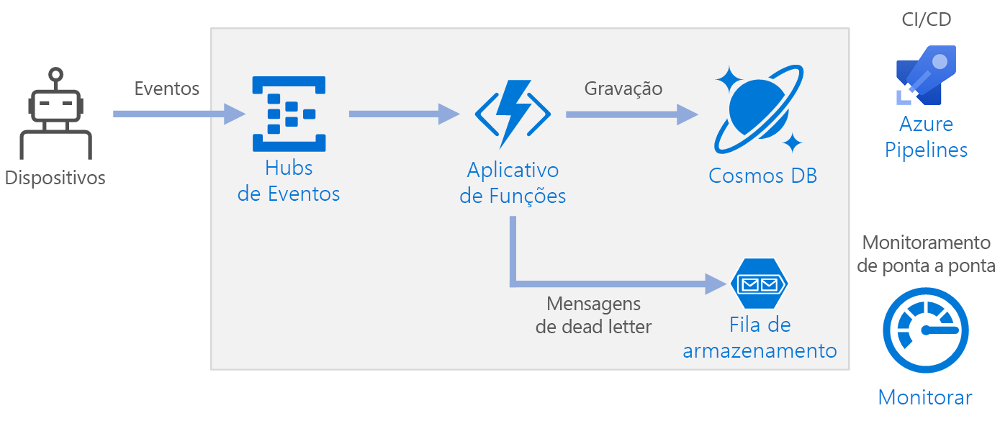

# <a name="serverless-event-processing-using-azure-functions"></a>Processamento de evento sem servidor usando o Azure Functions

Essa arquitetura de referência mostra uma arquitetura [sem servidor](https://azure.microsoft.com/solutions/serverless/) controlada por evento que ingere um fluxo de dados, processa os dados e grava os resultados em um banco de dados back-end. Há uma implantação de referência para essa arquitetura de referência disponível no [GitHub][github].



## <a name="architecture"></a>Arquitetura

Os **Hubs de Eventos** ingerem o fluxo de dados. Os [Hubs de Eventos][eh] foram projetados para cenários de streaming de dados com alta taxa de transferência.

> [!NOTE]
> Para cenários de IoT, recomendamos o Hub IoT. O Hub IoT tem um ponto de extremidade interno compatível com a API de Hubs de Eventos do Azure, para que você possa usar um dos serviços nessa arquitetura sem grandes mudanças no processamento de back-end. Para saber mais, confira [Conectar dispositivos IoT ao Azure: Hub IoT e Hubs de Eventos][iot].

**Aplicativo de funções**. O [Azure Functions][functions] é uma opção de computação sem servidor. Ele usa um modelo controlado por evento, em que um trecho de código (uma "função") é invocado por um gatilho. Nessa arquitetura, quando os eventos chegam aos Hubs de Eventos, eles disparam uma função que processa os eventos e grava os resultados no armazenamento.

Os Aplicativos de Funções são adequados para processar registros individuais dos Hubs de Eventos. Para cenários de processamento de fluxo mais complexos, considere o Apache Spark com o Azure Databricks, ou o Azure Stream Analytics.

**Cosmos DB**. O [Cosmos DB][cosmosdb] é um serviço de banco de dados multimodelo. Para este cenário, a função de processamento de eventos armazena registros JSON, usando a [API do SQL][cosmosdb-sql] do Cosmos DB.

**Armazenamento de filas**. O [Armazenamento de filas][queue] é usado para mensagens mortas. Se ocorrer um erro ao processar um evento, a função armazenará os dados do evento em uma fila de mensagens mortas para processamento posterior. Para saber mais, confira [Considerações de resiliência](#resiliency-considerations).

**Azure Monitor**. O [Monitor][monitor] coleta métricas de desempenho sobre os serviços do Azure implantados na solução. Ao visualizá-las em um painel, você obtém informações sobre a integridade da solução.

**Azure Pipelines**. O [Pipelines][pipelines] é um serviço de CI (integração contínua) e CD (entrega contínua) que compila, testa e implanta o aplicativo.

## <a name="scalability-considerations"></a>Considerações sobre escalabilidade

### <a name="event-hubs"></a>Hubs de Eventos

A capacidade da taxa de transferência dos Hubs de Eventos é medida em [unidades de produtividade][eh-throughput]. É possível fazer o dimensionamento automático de um hub de eventos ao permitir a [inflação automática][eh-autoscale], o que dimensiona automaticamente as unidades de produtividade com base no tráfego até um número máximo configurado.

O [gatilho do Hub de Eventos][eh-trigger] no aplicativo de funções é dimensionado de acordo com o número de partições no hub de eventos. Cada partição recebe uma instância de função por vez. Para maximizar a taxa de transferência, receba os eventos em lote, em vez de um de cada vez.

### <a name="cosmos-db"></a>Cosmos DB

A capacidade da taxa de transferência para o Cosmos DB é medida em [Unidades de Solicitação][ru] (RU). Para dimensionar um contêiner do Cosmos DB acima de 10.000 RU, é preciso especificar uma [chave de partição][partition-key] ao criar o contêiner e incluir a chave de partição em todos os documentos criados por você.

Estas são algumas características de uma boa chave de partição:

- O espaço para o valor de chave é grande.
- Haverá uma distribuição uniforme de leituras/gravações por valor de chave, evitando teclas de atalho.
- O máximo de dados armazenado para qualquer valor de chave única não excederá o tamanho máximo da partição física (10 GB).
- A chave de partição de um documento não será alterada. Não é possível atualizar a chave de partição em um documento existente.

No cenário dessa arquitetura de referência, a função armazena exatamente um documento por dispositivo que está enviando dados. A função atualiza continuamente os documentos com o status mais recente do dispositivo, usando uma operação upsert. A ID do dispositivo é uma boa chave de partição para esse cenário, pois as gravações serão distribuídas uniformemente entre as chaves e o tamanho de cada partição será estritamente limitado, pois há um único documento para cada valor de chave. Para saber mais sobre chaves de particionamento, confira [Particionar e dimensionar no Azure Cosmos DB][cosmosdb-scale].

## <a name="resiliency-considerations"></a>Considerações de resiliência

Ao usar o gatilho dos Hubs de Eventos com o Functions, capture exceções dentro de seu loop de processamento. Se ocorrer uma exceção sem tratamento, o tempo de execução do Functions não tentará novamente as mensagens. Se não for possível processar uma mensagem, coloque-a em uma fila de mensagens mortas. Use um processo fora de banda para examinar as mensagens e determinar a ação corretiva.

O código a seguir mostra como a função de ingestão captura exceções e coloca as mensagens não processadas em uma fila de mensagens mortas.

```csharp
[FunctionName("RawTelemetryFunction")]
[StorageAccount("DeadLetterStorage")]
public static async Task RunAsync(
    [EventHubTrigger("%EventHubName%", Connection = "EventHubConnection", ConsumerGroup ="%EventHubConsumerGroup%")]EventData[] messages,
    [Queue("deadletterqueue")] IAsyncCollector<DeadLetterMessage> deadLetterMessages,
    ILogger logger)
{
    foreach (var message in messages)
    {
        DeviceState deviceState = null;

        try
        {
            deviceState = telemetryProcessor.Deserialize(message.Body.Array, logger);
        }
        catch (Exception ex)
        {
            logger.LogError(ex, "Error deserializing message", message.SystemProperties.PartitionKey, message.SystemProperties.SequenceNumber);
            await deadLetterMessages.AddAsync(new DeadLetterMessage { Issue = ex.Message, EventData = message });
        }

        try
        {
            await stateChangeProcessor.UpdateState(deviceState, logger);
        }
        catch (Exception ex)
        {
            logger.LogError(ex, "Error updating status document", deviceState);
            await deadLetterMessages.AddAsync(new DeadLetterMessage { Issue = ex.Message, EventData = message, DeviceState = deviceState });
        }
    }
}
```

Observe que a função usa a [associação de saída do armazenamento de filas][queue-binding] para colocar itens na fila.

O código exibido acima também registra exceções em log para o Application Insights. Use o número de sequência e a chave de partição para correlacionar mensagens mortas com as exceções nos logs.

As mensagens na fila de mensagens mortas devem ter informações suficientes para você entender o contexto do erro. Neste exemplo, a classe `DeadLetterMessage` contém a mensagem de exceção, os dados do evento original e a mensagem de evento desserializada (se estiver disponível).

```csharp
public class DeadLetterMessage
{
    public string Issue { get; set; }
    public EventData EventData { get; set; }
    public DeviceState DeviceState { get; set; }
}
```

Use o [Azure Monitor][monitor] para monitorar o hub de eventos. Se você vir que há entrada, mas nenhuma saída, as mensagens não estarão sendo processadas. Nesse caso, acesse o [Log Analytics][log-analytics] e procure exceções ou outros erros.

## <a name="disaster-recovery-considerations"></a>Considerações de recuperação de desastres

A implantação exibida aqui reside em uma única região do Azure. Para uma abordagem mais resiliente à recuperação de desastres, aproveite os recursos de distribuição geográfica de vários serviços:

- **Hubs de Evento**. Crie dois namespaces de Hubs de Eventos, um namespace primário (ativo) e um namespace secundário (passivo). As mensagens são roteadas automaticamente para o namespace ativo, a menos que você faça o failover para o namespace secundário. Para saber mais, confira [Recuperação de desastre geográfico dos Hubs de Eventos do Azure][eh-dr].

- **Aplicativo de funções**. Implante um segundo aplicativo de função que está aguardando leitura do namespace secundário de Hubs de Eventos. Essa função grava em uma conta de armazenamento secundário para a fila de mensagens mortas.

- **Cosmos DB**. O Cosmos DB dá suporte a [várias regiões mestres][cosmosdb-geo], o que permite a gravação em qualquer região adicionada à sua conta do Cosmos DB. Se você não habilitar vários mestres, ainda poderá fazer o failover da região de gravação primária. Os SDKs de cliente do Cosmos DB e as associações do Azure Functions tratam automaticamente o failover, assim você não precisa atualizar as definições de configuração do aplicativo.

- **Armazenamento do Azure**. Use o armazenamento [RA-GRS][ra-grs] para a fila de mensagens mortas. Isso cria uma réplica somente leitura em outra região. Se a região primária ficar indisponível, você poderá ler os itens atualmente na fila. Além disso, provisione outra conta de armazenamento na região secundária para gravação da função após um failover.

## <a name="deploy-the-solution"></a>Implantar a solução

Para implantar essa arquitetura de referência, confira o [Leiame do GitHub][readme].

<!-- links -->

[cosmosdb]: /azure/cosmos-db/introduction
[cosmosdb-geo]: /azure/cosmos-db/distribute-data-globally
[cosmosdb-scale]: /azure/cosmos-db/partition-data
[cosmosdb-sql]: /azure/cosmos-db/sql-api-introduction
[eh]: /azure/event-hubs/
[eh-autoscale]: /azure/event-hubs/event-hubs-auto-inflate
[eh-dr]: /azure/event-hubs/event-hubs-geo-dr
[eh-throughput]: /azure/event-hubs/event-hubs-features#throughput-units
[eh-trigger]: /azure/azure-functions/functions-bindings-event-hubs
[functions]: /azure/azure-functions/functions-overview
[iot]: /azure/iot-hub/iot-hub-compare-event-hubs
[log-analytics]: /azure/log-analytics/log-analytics-queries
[monitor]: /azure/azure-monitor/overview
[partition-key]: /azure/cosmos-db/partition-data
[pipelines]: /azure/devops/pipelines/index
[queue]: /azure/storage/queues/storage-queues-introduction
[queue-binding]: /azure/azure-functions/functions-bindings-storage-queue#output
[ra-grs]: /azure/storage/common/storage-redundancy-grs
[ru]: /azure/cosmos-db/request-units

[github]: https://github.com/mspnp/serverless-reference-implementation
[readme]: https://github.com/mspnp/serverless-reference-implementation/blob/master/README.md
