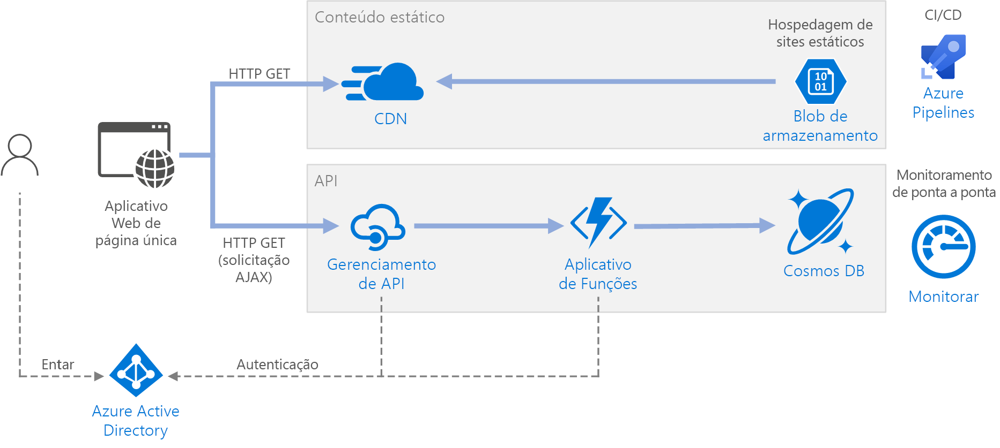

# <a name="serverless-web-application"></a>Aplicativo web sem servidor 

Esta arquitetura de referência mostra um aplicativo Web [sem servidor](https://azure.microsoft.com/solutions/serverless/). O aplicativo fornece conteúdo estático do Armazenamento de Blobs do Azure e implementa uma API usando o Azure Functions. A API lê dados do Cosmos DB e retorna os resultados para o aplicativo Web. Há uma implantação de referência para essa arquitetura de referência disponível no [GitHub][github].


 
O termo "sem servidor" tem dois significados diferentes, porém relacionados:

- **Back-end como serviço** (BaaS). Os serviços de nuvem de back-end, como bancos de dados e armazenamento, fornecem APIs que permitem aos aplicativos cliente se conectarem diretamente a esses serviços. 
- **Funções como serviço** (FaaS). Nesse modelo, uma "função" é um trecho de código implantado na nuvem e executado dentro de um ambiente de hospedagem que abstrai completamente os servidores que executam o código. 

As duas definições têm em comum a ideia de que os desenvolvedores e a equipe de DevOps não precisam implantar, configurar ou gerenciar servidores. Esta arquitetura de referência foca no FaaS usando o Azure Functions, embora o fornecimento de conteúdo da Web do Armazenamento de Blobs do Azure seja um exemplo de BaaS. Veja algumas características importantes do FaaS:

1. Os recursos de computação são alocados dinamicamente conforme exigido pela plataforma.
1. Preço com base no consumo: você recebe uma cobrança apenas pelos recursos de computação usados para execução do seu código.
1. Os recursos de computação aumentam sob demanda com base no tráfego, sem que o desenvolvedor precise realizar qualquer configuração.

As funções são executadas quando um gatilho externo ocorre, como uma solicitação HTTP ou uma mensagem que chega a uma fila. Isso faz com que um [estilo de arquitetura orientada a eventos][event-driven] seja natural para arquiteturas sem servidor. Para coordenar o trabalho entre os componentes da arquitetura, considere o uso de agentes de mensagens ou padrões de pub/sub. Para obter ajuda com a escolha entre as tecnologias de mensagens no Azure, confira [Escolher entre os serviços do Azure que entregam mensagens][azure-messaging].

## <a name="architecture"></a>Arquitetura
A arquitetura consiste nos componentes a seguir.

**Armazenamento de Blobs**. O conteúdo Web estático, como arquivos HTML, CSS e JavaScript, é armazenado no Armazenamento de Blobs do Azure e fornecido aos clientes usando a [hospedagem de site estático][static-hosting]. Toda a interação dinâmica ocorre através das chamadas do código JavaScript para as APIs de back-end. Não há código do lado do servidor para renderizar a página da Web. A hospedagem do site estático oferece suporte à indexação de documentos e páginas de erro 404 personalizadas.

> [!NOTE]
> A hospedagem do site estático está em [versão prévia][static-hosting-preview] no momento.

**CDN**. Use a CDN ([Rede de Distribuição de Conteúdo do Azure][cdn]) para armazenar em cache o conteúdo para latência mais baixa e distribuição mais rápida do conteúdo, além de fornecer um ponto de extremidade HTTPS.

**Aplicativos de Funções**. O [Azure Functions][functions] é uma opção de computação sem servidor. Ele usa um modelo controlado por eventos, em que um trecho de código (uma "função") é invocado por um gatilho. Nessa arquitetura, a função é invocada quando um cliente faz uma solicitação HTTP. A solicitação é sempre roteada por meio de um gateway de API, descrito abaixo.

**Gerenciamento de API**. O [Gerenciamento de API][apim] fornece um gateway de API localizado à frente da função HTTP. Use o Gerenciamento de API para publicar e gerenciar APIs usadas por aplicativos cliente. O uso de um gateway ajuda a desacoplar o aplicativo de front-end das APIs de back-end. Por exemplo, o Gerenciamento de API pode reescrever URLs, transformar solicitações antes que elas atinjam o back-end, definir cabeçalhos de solicitação ou resposta e assim por diante.

O Gerenciamento de API também pode ser usado para implementar características transversais, como:

- Imposição do uso de cotas e limites de taxa
- Validação de tokens OAuth para autenticação
- Habilitação de CORS (solicitações entre origens)
- Armazenamento de respostas em cache
- Monitoramento e registro em log de solicitações  

Se você não precisar de toda a funcionalidade fornecida pelo Gerenciamento de API, outra opção será usar [Proxies do Functions][functions-proxy]. Esse recurso do Azure Functions permite a definição de uma única superfície de API para vários aplicativos de funções por meio da criação de rotas para funções de back-end. Os proxies de função também podem executar transformações limitadas na solicitação e resposta HTTP. No entanto, eles não fornecem os mesmos recursos avançados baseados em política do Gerenciamento de API.

**Cosmos DB**. O [Cosmos DB][cosmosdb] é um serviço de banco de dados multimodelo. Para esse cenário, o aplicativo de função busca documentos do Cosmos DB em resposta a solicitações HTTP GET do cliente.

**Azure Active Directory** (Azure AD). Os usuários fazem logon no aplicativo Web usando suas credenciais do Azure AD. O Azure AD retorna um token de acesso para a API, que o aplicativo Web usa para autenticar solicitações de API (confira [Autenticação](#authentication)).

**Azure Monitor**. O [Monitor][monitor] coleta métricas de desempenho sobre os serviços do Azure implantados na solução. Ao visualizá-las em um painel, você obtém informações sobre a integridade da solução. O Monitor também coletou logs de aplicativo.

**Azure Pipelines**. O [Pipelines][pipelines] é um serviço de CI (integração contínua) e CD (entrega contínua) que compila, testa e implanta o aplicativo.

## <a name="recommendations"></a>Recomendações

### <a name="function-app-plans"></a>Planos do Aplicativo de funções

O Azure Functions dá suporte a dois modelos de hospedagem. O **plano de consumo** aloca automaticamente a potência de computação quando o código estiver em execução.  Com o plano de **Serviço de Aplicativo**, um conjunto de VMs é alocado para seu código. O plano de Serviço de Aplicativo define o número de VMs e o tamanho da VM. 

Observe que o plano de Serviço de Aplicativo não é estritamente *sem servidor*, de acordo com a definição fornecida acima. O modelo de programação é o mesmo, porém &mdash; o mesmo código de função pode ser executado em um plano de consumo e em um plano de Serviço de Aplicativo.

Veja alguns fatores a serem considerados ao escolher qual tipo de plano usar:

- **Inicialização a frio**. Com o plano de consumo, uma função que não foi invocada recentemente incorre em alguma latência adicional na próxima vez que for executada. A latência adicional ocorre devido à alocação e à preparação do ambiente de tempo de execução. Normalmente, demora segundos, mas depende de vários fatores, incluindo o número de dependências que precisam ser carregadas. Para saber mais, confira [Noções básicas sobre a inicialização a frio sem servidor][functions-cold-start]. Normalmente, a inicialização a frio é uma preocupação para cargas de trabalho interativas (gatilhos HTTP) do que para cargas de trabalho assíncronas orientadas a mensagem (gatilhos de fila ou hubs de evento), pois a latência adicional é observada diretamente pelos usuários.
- **Tempo limite**.  Em um plano de consumo, o tempo de execução de uma função expira após um período [configurável][functions-timeout] (até 10 minutos, no máximo)
- **Isolamento da rede virtual**. O uso de um plano de Serviço de Aplicativo permite a execução das funções dentro de um [Ambiente de Serviço de Aplicativo][ase], que é um ambiente de hospedagem dedicado e isolado.
- **Modelo de preços**. O plano de consumo é cobrado pelo número de execuções e pelo consumo de recursos (tempo de execução da memória &times;). O plano de Serviço de Aplicativo é cobrado por hora com base no SKU da instância da VM. Geralmente, o plano de consumo é mais barato que um plano de Serviço de Aplicativo, pois você paga apenas pelos recursos de computação que usar. Principalmente se o tráfego apresentar picos e ciclos. No entanto, se um aplicativo apresentar uma taxa de transferência de alto volume constante, um plano de Serviço de Aplicativo poderá custar menos do que o plano de consumo.
- **Dimensionamento**. Uma grande vantagem do modelo de consumo é que ele se ajusta dinamicamente conforme o necessário, com base no tráfego de entrada. Embora esse dimensionamento ocorra rapidamente, ainda há um período de crescimento. Para algumas cargas de trabalho, convém sobreprovisionar deliberadamente as VMs, para que você possa lidar com picos de tráfego com um tempo de crescimento nulo. Nesse caso, considere um plano de Serviço de Aplicativo.

### <a name="function-app-boundaries"></a>Limites do Aplicativo de funções

Um *aplicativo de funções* hospeda a execução de uma ou mais *funções*. Use um aplicativo de funções para agrupar várias funções como uma unidade lógica. Dentro de um aplicativo de funções, as funções compartilham as mesmas configurações de aplicativo, plano de hospedagem e ciclo de vida de implantação. Cada aplicativo de funções tem seu próprio nome de host.  

Use os aplicativos de função para agrupar funções que compartilham o mesmo ciclo de vida e configurações. Funções que não compartilham o mesmo ciclo de vida devem ser hospedadas em aplicativos de funções diferentes. 

Analise o uso de uma abordagem de microsserviços, em que cada aplicativo de funções representa um microsserviço, possivelmente composto por várias funções relacionadas. Em uma arquitetura de microsserviços, os serviços devem ter um acoplamento flexível e alta coesão funcional. O acoplamento *flexível* significa que você pode alterar um serviço sem a necessidade de atualizar simultaneamente outros serviços. *Coesão* significa que um serviço tem uma finalidade única e bem definida. Para saber mais sobre essas ideias, confira [Criação de microsserviços: análise de domínio][microservices-domain-analysis].

### <a name="function-bindings"></a>Associações de função

Use as [associações][functions-bindings] do Functions quando possível. As associações fornecem uma maneira declarativa de conectar seu código aos dados e integrá-los a outros serviços do Azure. Uma associação de entrada preenche um parâmetro de entrada de uma fonte de dados externa. Uma associação de saída envia o valor de retorno da função para um coletor de dados, como uma fila ou um banco de dados.

Por exemplo, a função `GetStatus` na implementação de referência usa a [associação de entrada][cosmosdb-input-binding] do Cosmos DB. Essa associação é configurada para pesquisar um documento no Cosmos DB usando os parâmetros de consulta obtidos da cadeia de consulta da solicitação HTTP. Se o documento for encontrado, ele será passado para a função como um parâmetro.

```csharp
[FunctionName("GetStatusFunction")]
public static Task<IActionResult> Run(
    [HttpTrigger(AuthorizationLevel.Function, "get", Route = null)] HttpRequest req, 
    [CosmosDB(
        databaseName: "%COSMOSDB_DATABASE_NAME%",
        collectionName: "%COSMOSDB_DATABASE_COL%",
        ConnectionStringSetting = "COSMOSDB_CONNECTION_STRING",
        Id = "{Query.deviceId}",
        PartitionKey = "{Query.deviceId}")] dynamic deviceStatus, 
    ILogger log)
{
    ...
}
```

Ao usar associações, você não precisa escrever um código para se comunicar diretamente com o serviço, o que simplifica o código de função e também abstrai os detalhes da fonte de dados ou do coletor. Porém, em alguns casos, talvez você precise de uma lógica mais complexa do que a fornecida pela associação. Nesse caso, use os SDKs do cliente do Azure diretamente.

## <a name="scalability-considerations"></a>Considerações sobre escalabilidade

**Functions**. Para o plano de consumo, o gatilho HTTP é dimensionado com base no tráfego. Há um limite para o número de instâncias simultâneas de função, mas cada instância pode processar mais de uma solicitação por vez. No caso de um plano de Serviço de Aplicativo, o gatilho HTTP é dimensionado de acordo com o número de instâncias de VM, que pode ser um valor fixo ou dimensionado automaticamente com base em um conjunto de regras de dimensionamento automático. Para saber mais, confira [Escala e hospedagem do Azure Functions][functions-scale]. 

**Cosmos DB**. A capacidade da taxa de transferência para o Cosmos DB é medida em [Unidades de Solicitação][ru] (RU). Uma taxa de transferência de 1-RU corresponde à taxa de transferência exigida para obter (GET) um documento de 1 KB. Para dimensionar um contêiner do Cosmos DB acima de 10.000 RU, é preciso especificar uma [chave de partição][partition-key] ao criar o contêiner e incluir a chave de partição em todos os documentos criados por você. Para saber mais sobre chaves de particionamento, confira [Particionar e dimensionar no Azure Cosmos DB][cosmosdb-scale].

**Gerenciamento de API**. O Gerenciamento de API permite escalar horizontalmente e dá suporte ao dimensionamento automático baseado em regra. Observe que o processo de dimensionamento demora pelo menos 20 minutos. Se o tráfego for intermitente, provisione para o tráfego intermitente máximo esperado. No entanto, o dimensionamento automático é útil para lidar com variações por hora ou dia no tráfego. Para saber mais, confira [Escalar automaticamente uma instância do Gerenciamento de API do Azure][apim-scale].

## <a name="disaster-recovery-considerations"></a>Considerações de recuperação de desastres

A implantação exibida aqui reside em uma única região do Azure. Para uma abordagem mais resiliente à recuperação de desastres, aproveite os recursos de distribuição geográfica de vários serviços:

- O Gerenciamento de API oferece suporte à implantação multirregião, que pode ser usada para distribuir uma única instância de Gerenciamento de API por qualquer quantidade de regiões do Azure. Para saber mais, confira [Como implantar uma instância do serviço de Gerenciamento de API do Azure em várias regiões do Azure][api-geo].

- Use o [Gerenciador de Tráfego][tm] para rotear as solicitações HTTP para a região primária. Se o Aplicativo de Funções nessa região ficar indisponível, o Gerenciador de Tráfego realizará o failover para a região secundária.

- O Cosmos DB dá suporte a [várias regiões mestres][cosmosdb-geo], o que permite a gravação em qualquer região adicionada à sua conta do Cosmos DB. Se você não habilitar vários mestres, ainda poderá fazer o failover da região de gravação primária. Os SDKs de cliente do Cosmos DB e as associações do Azure Functions tratam automaticamente do failover. Dessa forma, você não precisa atualizar as definições de configuração do aplicativo.

## <a name="security-considerations"></a>Considerações de segurança

### <a name="authentication"></a>Autenticação

A API `GetStatus` na implementação de referência usa o Azure AD para autenticar solicitações. O AD do Azure oferece suporte ao protocolo Open ID Connect, que é um protocolo de autenticação criado sobre o protocolo OAuth 2.

Nessa arquitetura, o aplicativo cliente é um aplicativo de página única (SPA) executado no navegador. Esse tipo de aplicativo cliente não consegue ocultar o segredo de um cliente ou um código de autorização, por isso o fluxo de concessão implícita é apropriado. (Confira [Qual fluxo de OAuth 2.0 devo usar?] [oauth-flow]). Veja o fluxo geral:

1. O usuário clica no link "Entrar" no aplicativo Web.
1. O navegador é redirecionado para a página de entrada do Azure AD. 
1. O usuário entra.
1. O Azure AD redireciona de volta para o aplicativo cliente, incluindo um token de acesso no fragmento de URL.
1. Quando o aplicativo Web chama a API, ele inclui o token de acesso no cabeçalho de Autenticação. A ID do aplicativo é enviada como a declaração "aud" (público) no token de acesso. 
1. A API de back-end valida o token de acesso.

Para configurar a autenticação:

- Registre um aplicativo no locatário do Azure AD. Isso gera uma ID de aplicativo, que é incluída pelo cliente com a URL de logon.

- Habilite a autenticação do Azure AD dentro do Aplicativo de Funções. Para saber mais, confira [Autenticação e autorização no Serviço de Aplicativo do Azure][app-service-auth].

- Adicione [validate-jwt policy][apim-validate-jwt] ao Gerenciamento de API para pré-autorizar a solicitação validando o token de acesso.

Para saber mais, confira o [Leiame do GitHub][readme].

É recomendável criar registros de aplicativo separados no Azure AD para o aplicativo cliente e a API de back-end. Conceda permissão ao aplicativo cliente para chamar a API. Essa abordagem lhe dá a flexibilidade para definir várias APIs e clientes e controlar as permissões de cada um. 

Na API, use [escopos][scopes] para fornecer aos aplicativos um controle refinado sobre quais permissões eles solicitam de um usuário. Por exemplo, uma API pode ter os escopos `Read` e `Write`, e um aplicativo cliente específico pode solicitar que o usuário autorize apenas as permissões `Read`.

### <a name="authorization"></a>Autorização

Em muitos aplicativos, a API de back-end deve verificar se um usuário tem permissão para executar uma determinada ação. Recomendamos o uso da [autorização baseada em declarações][claims], nas quais as informações sobre o usuário são transmitidas pelo provedor de identidade (nesse caso, o Azure AD) e usadas para tomar decisões de autorização. 

Algumas declarações são fornecidas dentro do token de ID retornado pelo Azure AD para o cliente. Você pode obter essas declarações de dentro do aplicativo de funções examinando o cabeçalho X-MS-CLIENT-PRINCIPAL na solicitação. Para outras declarações, use o [Microsoft Graph][graph] para consultar o Azure AD (exige o consentimento do usuário durante a entrada). 

Por exemplo, ao registrar um aplicativo no Azure AD, é possível definir um conjunto de funções de aplicativo no manifesto de registro do aplicativo. Quando um usuário entra no aplicativo, o Azure AD inclui uma declaração de "funções" para cada função que o usuário recebeu (incluindo funções herdadas pela associação a um grupo). 

Na implementação de referência, a função verifica se o usuário autenticado é membro da função de aplicativo `GetStatus`. Caso contrário, a função retornará uma resposta HTTP Não Autorizado (401). 

```csharp
[FunctionName("GetStatusFunction")]
public static Task<IActionResult> Run(
    [HttpTrigger(AuthorizationLevel.Function, "get", "post", Route = null)] HttpRequest req, 
    [CosmosDB(
        databaseName: "%COSMOSDB_DATABASE_NAME%",
        collectionName: "%COSMOSDB_DATABASE_COL%",
        ConnectionStringSetting = "COSMOSDB_CONNECTION_STRING",
        Id = "{Query.deviceId}",
        PartitionKey = "{Query.deviceId}")] dynamic deviceStatus, 
    ILogger log)
{
    log.LogInformation("Processing GetStatus request.");

    return req.HandleIfAuthorizedForRoles(new[] { GetDeviceStatusRoleName },
        async () =>
        {
            string deviceId = req.Query["deviceId"];
            if (deviceId == null)
            {
                return new BadRequestObjectResult("Missing DeviceId");
            }

            return await Task.FromResult<IActionResult>(deviceStatus != null
                    ? (ActionResult)new OkObjectResult(deviceStatus)
                    : new NotFoundResult());
        },
        log);
}
```

Neste exemplo de código, `HandleIfAuthorizedForRoles` é um método de extensão que verifica a declaração de função e retorna HTTP 401, se a declaração não for encontrada. Encontre o código de origem [aqui][HttpRequestAuthorizationExtensions]. Observe que `HandleIfAuthorizedForRoles` aceita um parâmetro `ILogger`. Registre solicitações não autorizadas para que você tenha uma trilha de auditoria e possa diagnosticar problemas, se for necessário. Ao mesmo tempo, evite o vazamento de informações detalhadas na resposta HTTP 401.

### <a name="cors"></a>CORS

Nessa arquitetura de referência, o aplicativo Web e a API não compartilham a mesma origem. Isso significa que, quando o aplicativo chama a API, essa solicitação ocorre entre origens. A segurança do navegador impede que uma página da Web envie solicitações do AJAX para outro domínio. Essa restrição se chama *política da mesma origem* e impede que um site mal-intencionado leia dados confidenciais de outro site. Para habilitar uma solicitação entre origens, adicione uma [política][cors-policy] CORS (Compartilhamento de recursos entre origens) para o gateway de Gerenciamento de API:

```xml
<cors allow-credentials="true">
    <allowed-origins>
        <origin>[Website URL]</origin>
    </allowed-origins>
    <allowed-methods>
        <method>GET</method>
    </allowed-methods>
    <allowed-headers>
        <header>*</header>
    </allowed-headers>
</cors>
```

Neste exemplo, o atributo **allow-credentials** é **true**. Isso autoriza o navegador a enviar credenciais (incluindo cookies) com a solicitação. Caso contrário, o navegador envia, por padrão, as credenciais com uma solicitação entre origens.

> [!NOTE] 
> Tenha muito cuidado ao configurar **allow-credentials** como **true**, pois isso significa que um site pode enviar as credenciais do usuário para sua API em nome do usuário, sem que o usuário fique ciente. Você deve confiar na origem permitida.

### <a name="enforce-https"></a>Impor HTTPS

Para obter o máximo de segurança, exija HTTPS em todo o pipeline de solicitações:

- **CDN**. A CDN do Azure oferece suporte a HTTPS em um subdomínio `*.azureedge.net` por padrão. Para habilitar HTTPS na CDN para nomes de domínio personalizados, confira [Tutorial: Configurar o HTTPS em um domínio personalizado de CDN do Azure][cdn-https]. 

- **Hospedagem de sites estáticos**. Habilite a opção "[Transferência segura obrigatória][storage-https]" na conta de armazenamento. Quando essa opção estiver habilitada, a conta de armazenamento permitirá apenas solicitações de conexões HTTPS seguras. 

- **Gerenciamento de API**. Configure as APIs para usar somente o protocolo HTTPS. Configure isso no portal do Azure ou usando o modelo do Resource Manager:

    ```json
    {
        "apiVersion": "2018-01-01",
        "type": "apis",
        "name": "dronedeliveryapi",
        "dependsOn": [
            "[concat('Microsoft.ApiManagement/service/', variables('apiManagementServiceName'))]"
        ],
        "properties": {
            "displayName": "Drone Delivery API",
            "description": "Drone Delivery API",
            "path": "api",
            "protocols": [ "HTTPS" ]
        },
        ...
    }
    ```

- **Azure Functions**. Habilite a configuração "[Somente HTTPS][functions-https]". 

### <a name="lock-down-the-function-app"></a>Bloquear o aplicativo de funções

Todas as chamadas para a função devem passar pelo gateway de API. Faça isso da seguinte maneira:

- Configure o aplicativo de funções para exigir uma chave de função. O gateway de Gerenciamento de API inclui a tecla de função quando ela chamar o aplicativo de funções. Isso impede que os clientes chamem a função diretamente, ignorando o gateway. 

- O gateway do Gerenciamento de API tem um [endereço IP estático][apim-ip]. Restrinja o Azure Functions para permitir apenas chamadas desse endereço IP estático. Para saber mais, confira [Restrições de IP estático do Serviço de Aplicativo do Azure][app-service-ip-restrictions]. (Esse recurso está disponível apenas para serviços do tipo Standard.) 

### <a name="protect-application-secrets"></a>Proteger segredos do aplicativo

Não armazene segredos do aplicativo, como credenciais de banco de dados, nos arquivos de configuração ou código. Em vez disso, use as Configurações do Aplicativo, que estão armazenadas criptografadas no Azure. Para saber mais, confira [Segurança no Serviço de Aplicativo do Azure e no Azure Functions][app-service-security].

Como alternativa, armazene segredos do aplicativo no Key Vault. Isso permite que você centralize o armazenamento de segredos, controle sua distribuição e monitore como e quando os segredos são acessados. Para saber mais, confira [Configurar um aplicativo Web do Azure para ler um segredo do Key Vault][key-vault-web-app]. No entanto, observe que os gatilhos e associações do Functions carregam suas definições de configuração das configurações do aplicativo. Não há modos internos para configurar os gatilhos e associações para usar segredos do Key Vault.

## <a name="devops-considerations"></a>Considerações de DevOps

### <a name="deployment"></a>Implantação

Para implantar o aplicativo de funções, é recomendável usar [arquivos de pacote][functions-run-from-package] (“Execução a partir do pacote”). Usando essa abordagem, você carrega um arquivo zip em um contêiner de Armazenamento de Blobs e o tempo de execução das Funções monta o arquivo zip como um sistema de arquivos somente leitura. Essa é uma operação atômica, o que reduz a chance de uma implantação com falhas deixar o aplicativo em um estado inconsistente. Também é possível melhorar os tempos de inicialização a frio, especialmente para aplicativos Node.js, já que todos os arquivos são trocados ao mesmo tempo.

### <a name="api-versioning"></a>Controle de versão de API

Uma API é um contrato entre um serviço e os clientes. Nessa arquitetura, o contrato de API é definido na camada de Gerenciamento de API. O Gerenciamento de API oferece suporte a dois [conceitos de controle de versão][apim-versioning] distintos, mas complementares:

- As *versões* permitem que os consumidores escolham uma versão de API com base nas necessidades, como v1 vs. v2. 

- *Revisões* permitem que os administradores de API façam alterações sem interrupções em uma API e implantem essas alterações, juntamente com um log de alterações para informar aos consumidores da API sobre as alterações.

Se você fizer uma alteração significativa em uma API, publique uma nova versão no Gerenciamento de API. Implante a nova versão lado a lado da versão original em um Aplicativo de funções separado. Isso permite que você migre clientes existentes para a nova API sem invalidar os aplicativos cliente. Por fim, substitua a versão anterior. O Gerenciamento de API dá suporte a vários [esquemas de controle de versão][apim-versioning-schemes]: caminho de URL, cabeçalho HTTP ou a cadeia de consulta. Para obter mais informações sobre o controle de versão de API, confira [Controle de versão de uma API da Web RESTful][api-versioning].

Para atualizações que não são alterações da falha na API, implante a nova versão em um slot de preparo no mesmo Aplicativo de funções. Verifique se a implantação foi bem-sucedida e, em seguida, troque a versão de preparo pela versão de produção. Publique uma revisão no Gerenciamento de API.

## <a name="deploy-the-solution"></a>Implantar a solução

Para implantar essa arquitetura de referência, confira o [Leiame do GitHub][readme]. 

<!-- links -->

[api-versioning]: ../../best-practices/api-design.md#versioning-a-restful-web-api
[apim]: /azure/api-management/api-management-key-concepts
[apim-ip]: /azure/api-management/api-management-faq#is-the-api-management-gateway-ip-address-constant-can-i-use-it-in-firewall-rules
[api-geo]: /azure/api-management/api-management-howto-deploy-multi-region
[apim-scale]: /azure/api-management/api-management-howto-autoscale
[apim-validate-jwt]: /azure/api-management/api-management-access-restriction-policies#ValidateJWT
[apim-versioning]: /azure/api-management/api-management-get-started-publish-versions
[apim-versioning-schemes]: /azure/api-management/api-management-get-started-publish-versions#choose-a-versioning-scheme
[app-service-auth]: /azure/app-service/app-service-authentication-overview
[app-service-ip-restrictions]: /azure/app-service/app-service-ip-restrictions
[app-service-security]: /azure/app-service/app-service-security
[ase]: /azure/app-service/environment/intro
[azure-messaging]: /azure/event-grid/compare-messaging-services
[claims]: https://en.wikipedia.org/wiki/Claims-based_identity
[cdn]: https://azure.microsoft.com/services/cdn/
[cdn-https]: /azure/cdn/cdn-custom-ssl
[cors-policy]: /azure/api-management/api-management-cross-domain-policies
[cosmosdb]: /azure/cosmos-db/introduction
[cosmosdb-geo]: /azure/cosmos-db/distribute-data-globally
[cosmosdb-input-binding]: /azure/azure-functions/functions-bindings-cosmosdb-v2#input
[cosmosdb-scale]: /azure/cosmos-db/partition-data
[event-driven]: ../../guide/architecture-styles/event-driven.md
[functions]: /azure/azure-functions/functions-overview
[functions-bindings]: /azure/azure-functions/functions-triggers-bindings
[functions-cold-start]: https://blogs.msdn.microsoft.com/appserviceteam/2018/02/07/understanding-serverless-cold-start/
[functions-https]: /azure/app-service/app-service-web-tutorial-custom-ssl#enforce-https
[functions-proxy]: /azure/azure-functions/functions-proxies
[functions-run-from-package]: /azure/azure-functions/run-functions-from-deployment-package
[functions-scale]: /azure/azure-functions/functions-scale
[functions-timeout]: /azure/azure-functions/functions-scale#consumption-plan
[functions-zip-deploy]: /azure/azure-functions/deployment-zip-push
[graph]: https://developer.microsoft.com/graph/docs/concepts/overview
[key-vault-web-app]: /azure/key-vault/tutorial-web-application-keyvault
[microservices-domain-analysis]: ../../microservices/domain-analysis.md
[monitor]: /azure/azure-monitor/overview
[oauth-flow]: https://auth0.com/docs/api-auth/which-oauth-flow-to-use
[partition-key]: /azure/cosmos-db/partition-data
[pipelines]: /azure/devops/pipelines/index
[ru]: /azure/cosmos-db/request-units
[scopes]: /azure/active-directory/develop/v2-permissions-and-consent
[static-hosting]: /azure/storage/blobs/storage-blob-static-website
[static-hosting-preview]: https://azure.microsoft.com/blog/azure-storage-static-web-hosting-public-preview/
[storage-https]: /azure/storage/common/storage-require-secure-transfer
[tm]: /azure/traffic-manager/traffic-manager-overview

[github]: https://github.com/mspnp/serverless-reference-implementation
[HttpRequestAuthorizationExtensions]: https://github.com/mspnp/serverless-reference-implementation/blob/master/src/DroneStatus/dotnet/DroneStatusFunctionApp/HttpRequestAuthorizationExtensions.cs
[readme]: https://github.com/mspnp/serverless-reference-implementation/blob/master/README.md
