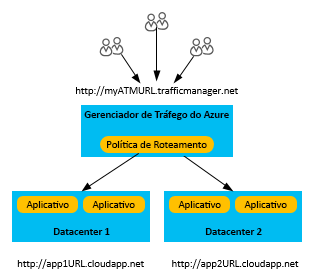
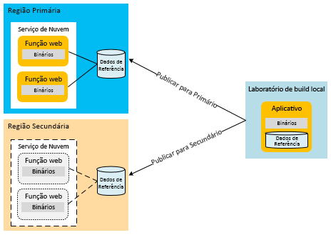
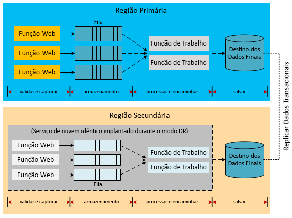
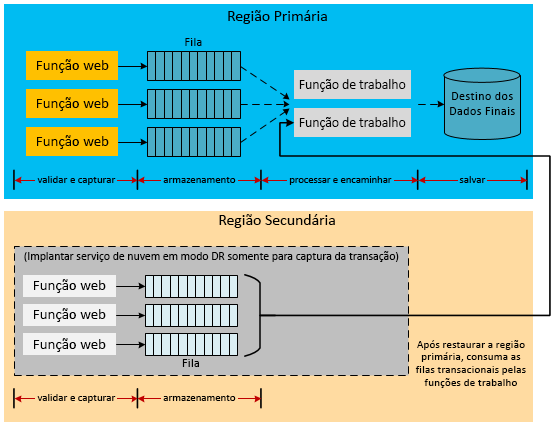
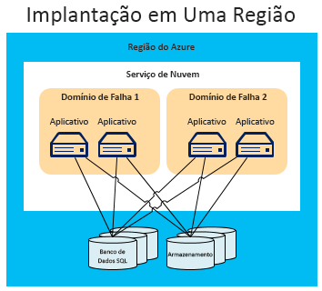
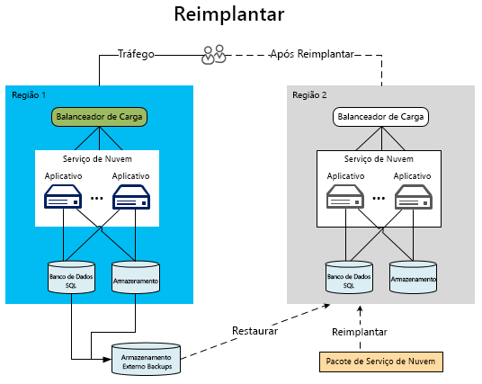
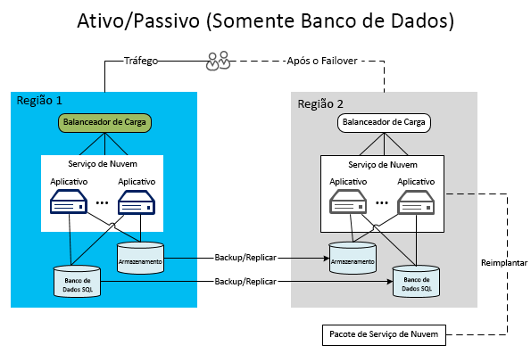
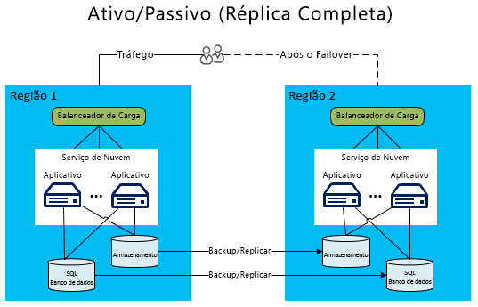
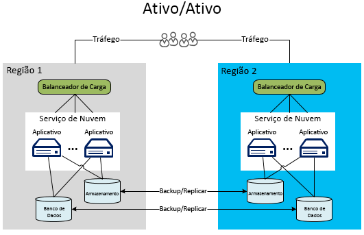

# Recuperação de desastre para aplicativos do Azure

A recuperação de desastres (DR) tem como foco a recuperação após uma perda catastrófica de funcionalidade do aplicativo. Por exemplo, se uma região do Azure que hospeda o aplicativo ficar indisponível, você precisa de um plano para executar seu aplicativo ou acessar os dados em outra região.

Proprietários de negócios e tecnologia devem determinar quanta funcionalidade é necessária durante um desastre. Esse nível de funcionalidade apresenta-se destas formas: totalmente indisponível, parcialmente disponível, por funcionalidade reduzida ou processamento com atraso, ou totalmente disponível.

Estratégias de resiliência e alta disponibilidade têm como objetivo lidar com condições de falha temporária.  A execução desse plano envolve pessoas, processos e aplicativos de suporte que permitem que o sistema continue funcionando. Seu plano deve incluir ensaio de falhas e testes de recuperação de bancos de dados para garantir que o plano é sólido.

## Recursos de recuperação de desastre do Azure

Assim como nas considerações de disponibilidade, o Azure oferece [orientações técnicas de resiliência](./index.md) desenvolvidas para lidar com a recuperação de desastre. Também há uma relação entre recursos de disponibilidade do Azure e a recuperação de desastre. Por exemplo, o gerenciamento de funções entre domínios de falha aumenta a disponibilidade de um aplicativo. Sem esse gerenciamento, uma falha de hardware sem tratamento se tornaria um cenário de "desastre". O aproveitamento desses recursos e estratégias de disponibilidade é uma parte importante da blindagem de seu aplicativo contra desastres. No entanto, este artigo vai além de problemas gerais de disponibilidade e aborda eventos de desastre mais graves (e mais raros).

## Múltiplas regiões de datacenter

O Azure mantém datacenters em muitas regiões ao redor do mundo. Essa infraestrutura é compatível com vários cenários de recuperação de desastre, como a replicação geográfica, fornecida pelo sistema, do Armazenamento do Microsoft Azure para regiões secundárias. Você também pode implantar, de forma fácil e com baixo custo, um serviço de nuvem em vários locais do mundo. Compare isso com o custo e a dificuldade de criar e manter seus próprios datacenters em várias regiões. Implantar serviços e dados em várias regiões ajuda a proteger o aplicativo contra uma grande interrupção em uma única região. Ao projetar seu plano de recuperação de desastres, é importante compreender o conceito de regiões emparelhadas. Para saber mais, confira [Continuidade dos negócios e recuperação de desastres (BCDR): Regiões Combinadas do Azure](/azure/best-practices-availability-paired-regions).

## Azure Site Recovery

[Azure Site Recovery](/azure/site-recovery/) fornece uma maneira simples de replicar VMs do Azure entre regiões. Ele tem sobrecarga mínima de gerenciamento, pois você não precisa provisionar recursos adicionais na região secundária. Quando você habilitar a replicação, o Site Recovery criará automaticamente os recursos necessários na região de destino, com base nas configurações da VM de origem. Ele fornece replicação contínua automatizada e permite que você execute o failover de aplicativo com um único clique. Execute também exercícios de recuperação de desastres com testes de failover, sem afetar a cargas de trabalho de produção ou de replicação contínua.

## Gerenciador de Tráfego do Azure

Quando ocorre uma falha específica de região, você deve redirecionar o tráfego para serviços ou implantações em outra região. É mais eficaz lidar com isso por meio de serviços como o Gerenciador de Tráfego do Microsoft Azure, que automatiza o failover de tráfego de usuários para outra região se a região principal falhar. É importante entender as noções básicas sobre o Gerenciador de Tráfego ao projetar uma estratégia de recuperação de desastres eficiente.

O Gerenciador de Tráfego usa o DNS (Sistema de Nomes de Domínio) para direcionar solicitações de cliente ao ponto de extremidade mais apropriado com base em um método de roteamento de tráfego e na integridade dos pontos de extremidade. No diagrama a seguir, os usuários se conectam a uma URL do Gerenciador de Tráfego (`http://myATMURL.trafficmanager.net`) que abstrai as URLs do site real (`http://app1URL.cloudapp.net` e `http://app2URL.cloudapp.net`). As solicitações do usuário são roteadas para a URL subjacente adequada com base no [método de roteamento do Gerenciador de Tráfego](/azure/traffic-manager/traffic-manager-routing-methods) configurado. Neste artigo, abordaremos somente a opção de failover.

Ao configurar o Gerenciador de Tráfego, você fornece um novo prefixo DNS de Gerenciador de Tráfego, que será usado pelos usuários para acessar o seu serviço. Agora, o Gerenciador de Tráfego abstrai o balanceamento de carga um nível acima do que o nível da região. O DNS do Gerenciador de Tráfego é mapeado para um CNAME para todas as implantações que gerencia.

No Gerenciador de Tráfego, você especifica uma lista priorizada de implantações para as quais os usuários serão roteados quando ocorrer uma falha. O Gerenciador de Tráfego monitora os pontos de extremidade de implantação. Se a implantação primária ficar indisponível, o Gerenciador de Tráfego roteia usuários para a implantação seguinte na lista de prioridades.

Embora o Gerenciador de Tráfego decida para onde ir durante um failover, você pode decidir se o domínio do failover estará inativo ou ativo enquanto você não estiver no modo de failover (que não tem relação com o Gerenciador de Tráfego). O Gerenciador de Tráfego detecta uma falha no site primário e passa para o site de failover, independente de o site estar atendendo aos usuários no momento.

Para saber mais sobre o funcionamento do Gerenciador de Tráfego do Azure, consulte:

- [Visão geral do Gerenciador de Tráfego](/azure/traffic-manager/traffic-manager-overview/)
- [Métodos de roteamento do Gerenciador de Tráfego](/azure/traffic-manager/traffic-manager-routing-methods)
- [Configurar o método de roteamento de failover](/azure/traffic-manager/traffic-manager-configure-failover-routing-method/)

## Cenários de desastre do Azure

As seções a seguir abrangem vários tipos diferentes de cenários de desastre. Interrupções de serviço que afetam toda a região não são a única causa de falhas que afetam todo o aplicativo. Design inadequado e erros administrativos também podem levar a interrupções. É importante levar em consideração as possíveis causas de uma falha durante as fases de design e teste de seu plano de recuperação. Um bom plano aproveita os recursos do Azure e os aperfeiçoa com estratégias específicas ao aplicativo. A resposta escolhida é determinada pela importância do aplicativo, o objetivo do ponto de recuperação (RPO) e o objetivo do tempo de recuperação (RTO).

### Falha do aplicativo

O Gerenciador de Tráfego trata automaticamente das falhas que resultam do software do sistema operacional ou do hardware subjacente na máquina virtual do host. O Azure cria uma nova instância de função e a adiciona ao pool disponível. Se mais de uma instância de função já estiver em execução, o Azure passará o processamento para as demais instâncias de função em execução enquanto substitui o nó com falha.

Erros graves do aplicativo podem ocorrer sem nenhuma falha subjacente do hardware ou sistema operacional. O aplicativo pode falhar devido às exceções catastróficas causadas por problemas de integridade de dados ou lógica incorreta. Você precisa incluir telemetria suficiente ao código do aplicativo para que um sistema de monitoramento possa detectar condições de falha e notificar um administrador do aplicativo. Um administrador com total conhecimento dos processos de recuperação de desastres pode decidir o acionamento de um processo de failover ou aceitar uma interrupção de disponibilidade ao resolver os erros críticos.

### Dados corrompidos

O Azure armazena automaticamente os dados do Banco de Dados SQL do Azure e do Armazenamento do Microsoft Azure três vezes, de forma redundante, em diferentes domínios de falha na mesma região. Se você usar a replicação geográfica, os dados serão armazenados mais três vezes em uma região diferente. No entanto, se os usuários ou o aplicativo corromperem esses dados na cópia primária, os dados serão replicados rapidamente para as outras cópias. Infelizmente, isso resulta em várias cópias de dados corrompidos.

Para gerenciar a possível corrupção dos dados, você tem duas opções. Primeiro, você pode gerenciar uma estratégia de backup personalizada. Você pode armazenar seus backups no Azure ou localmente, dependendo de seus requisitos de negócios ou das normas governamentais. Outra opção é usar a opção de restauração pontual para recuperar um banco de dados SQL. Para obter mais informações, consulte a seção [Estratégias de dados para recuperação de desastre](#data-strategies-for-disaster-recovery) abaixo.

### Interrupção de rede

Quando partes da rede do Azure estiverem inacessíveis, talvez você não consiga acessar o aplicativo ou os dados. Se uma ou mais instâncias de função estiverem indisponíveis devido a problemas de rede, o Azure usará as instâncias disponíveis restantes do aplicativo. Se o aplicativo não puder acessar os respectivos dados devido a uma interrupção de rede do Azure, você poderá operar localmente com funcionalidade reduzida do aplicativo usando dados armazenados em cache. Você precisa criar a estratégia de recuperação de desastres a ser executada com funcionalidade reduzida no seu aplicativo. Para alguns aplicativos, talvez isso não seja prático.

Outra opção é armazenar dados em um local alternativo até que a conectividade seja restaurada. Se a redução da funcionalidade não for uma opção, as opções restantes serão o tempo de inatividade do aplicativo ou o failover para uma região alternativa. O design de um aplicativo que é executado com funcionalidade reduzida é tanto uma decisão de negócios quanto técnica. Isso é discutido com mais detalhes na seção [funcionalidade reduzida do aplicativo](#reduced-application-functionality).

### Falha de um serviço dependente

O Azure fornece muitos serviços que podem passar por tempo de inatividade periodicamente. Por exemplo, [Cache Redis do Azure](https://azure.microsoft.com/services/cache/) é um serviço multilocatário que fornece recursos de cache para seu aplicativo. Será importante levar em consideração o que acontece em seu aplicativo se o serviço dependente ficar indisponível. Em muitos aspectos, esse cenário é semelhante ao cenário de interrupção da rede. No entanto, considerar cada serviço de forma independente resulta em potenciais melhorias no plano geral.

O Cache Redis do Azure fornece cache ao seu aplicativo de dentro da implantação do serviço de nuvem, o que é benéfico para a recuperação de desastre. Primeiro, o serviço agora é executado em funções que são locais com relação à sua implantação. Portanto, você conseguirá monitorar e gerenciar melhor o status do cache como parte dos processos de gerenciamento geral do serviço de nuvem. Esse tipo de armazenamento em cache também apresenta novos recursos, como alta disponibilidade para os dados armazenados em cache, o que preserva os dados armazenados em cache caso um único nó falhe, mantendo cópias duplicadas em outros nós.

Observe que a alta disponibilidade diminui a taxa de transferência e aumenta a latência, pois as operações de gravação também precisam atualizar as cópias secundárias. A quantidade de memória necessária para armazenar os dados em cache é efetivamente duplicada, o que deve ser levado em conta durante o planejamento de capacidade.  Esse exemplo demonstra que cada serviço dependente pode ter recursos que melhoram a disponibilidade e a resistência geral a falhas catastróficas.

Com cada serviço dependente, você precisa entender as implicações de uma interrupção do serviço. No exemplo do cache, talvez seja possível acessar os dados diretamente por meio de um banco de dados até que você restaure seu cache. Isso resultaria em desempenho reduzido ao fornecer acesso completo aos dados do aplicativo.

### Interrupção do serviço em toda uma região

As falhas anteriores foram, principalmente, falhas que poderiam ser gerenciadas dentro de uma mesma região do Azure. No entanto, você também deve se preparar para a possibilidade de que haja uma interrupção do serviço em toda a região. Se ocorrer uma interrupção do serviço em toda a região, as cópias dos seus dados que forem redundantes localmente não ficarão disponíveis. Se você tiver habilitado a replicação geográfica, haverá três cópias adicionais dos seus blobs e tabelas em uma região diferente. Se a Microsoft declarar a região como perdida, o Azure remapeará todas as entradas DNS para a região da replicação geográfica.

> [!NOTE]
> Lembre-se de que você não tem nenhum controle sobre esse processo e de que ele ocorrerá apenas em caso de interrupção do serviço em toda uma região. Considere o uso do [Azure Site Recovery](/azure/site-recovery/) para alcançar melhor RPO e RTO. O Site Recovery permite que o aplicativo decida o que é uma interrupção aceitável e quando executar failover nas VMs replicadas.

### Interrupção do serviço em todo o Azure

No planejamento para desastres, você deve levar em consideração toda a gama de possíveis desastres. Uma das interrupções de serviço mais graves envolveria todas as regiões do Azure simultaneamente. Assim como em outros tipos de interrupção de serviço, você pode optar por aceitar o risco de que haja um tempo de inatividade temporário caso a situação ocorra. Interrupções de serviço amplas que afetam várias regiões são muito mais raras do que interrupções de serviço isoladas envolvendo serviços dependentes ou regiões únicas.

No entanto, você pode decidir que determinados aplicativos essenciais exigem um plano de backup para uma interrupção do serviço em várias regiões. Esse plano poderia incluir failover para serviços em uma [nuvem alternativa](#alternative-cloud) ou uma [solução híbrida local e na nuvem](#hybrid-on-premises-and-cloud-solution).

### Funcionalidade reduzida do aplicativo

Um aplicativo bem projetado normalmente usa serviços que se comunicam uns com os outros por meio da implementação de padrões de troca de informações com acoplamento pouco rígido. Um aplicativo adequado à DR requer a separação de responsabilidades no nível de serviço. Isso impede que a interrupção de um serviço dependente faça com que o aplicativo inteiro fique inativo. Por exemplo, considere o aplicativo de comércio eletrônico da Empresa Y. Os seguintes módulos podem constituir o aplicativo:

- **Catálogo de Produtos** permite que os usuários procurem produtos.
- **Carrinho de Compras** permite que os usuários adicionem/removam produtos de seu carrinho de compras.
- **Status do Pedido** mostra o status de envio dos pedidos dos usuários.
- **Envio de Pedidos** finaliza a sessão de compras enviando o pedido com o pagamento.
- **Processamento de Pedidos** valida o pedido com relação à integridade de dados e executa a verificação de disponibilidade de quantidade.

Quando uma dependência do serviço neste aplicativo fica indisponível, como o serviço funciona até que a dependência seja recuperada? Um sistema bem projetado implementa limites de isolamento por meio da separação de responsabilidades no momento do design e no momento da execução. Você pode categorizar cada falha como recuperável e não recuperável. Erros não recuperáveis desativarão o serviço, mas é possível atenuar erros recuperáveis com alternativas. Determinados problemas resolvidos automaticamente tratando falhas e adotando ações alternativas são transparentes para o usuário. Durante uma interrupção de serviço mais grave, o aplicativo pode ficar completamente indisponível. Uma terceira opção é continuar a tratar as solicitações do usuário com funcionalidade reduzida.

Por exemplo, se o banco de dados que hospeda pedidos ficar inativo, o serviço de Processamento de pedidos perderá a capacidade de processar transações de vendas. Dependendo da arquitetura, pode ser difícil ou impossível que os serviços de Envio de pedidos e Processamento de pedidos do aplicativo continuem. Se o aplicativo não tiver sido projetado para lidar com esse cenário, o aplicativo inteiro poderá ficar offline. No entanto, se os dados de produto são armazenados em um local diferente, o módulo de Catálogo de produtos ainda pode ser usado para exibir produtos. No entanto, outras partes do aplicativo ficarão indisponíveis, como a realização de pedidos ou consultas de estoque.

A decisão de qual funcionalidade reduzida do aplicativo estará disponível é uma decisão de negócios e uma decisão técnica. Você deve decidir como o aplicativo vai informar os usuários sobre problemas temporários. No exemplo acima, o aplicativo poderia permitir a exibição de produtos e a adição deles a um carrinho de compras. No entanto, quando o usuário tentasse fazer uma compra, o aplicativo o notificaria de que a funcionalidade de realização de pedidos está indisponível temporariamente. Isso não é ideal para o cliente, mas evita a interrupção do serviço de todo o aplicativo.

## estratégias de dados para recuperação de desastre

O tratamento adequado dos dados é um aspecto desafiador de um plano de recuperação de desastres. Durante o processo de recuperação, a restauração de dados geralmente leva mais tempo. Escolhas diferentes para funcionalidades reduzidas levam a desafios difíceis em termos de recuperação de dados após uma falha e consistência após uma falha.

Uma consideração é a necessidade de restaurar ou manter uma cópia dos dados do aplicativo. Você usará esses dados para fins de referência e transacionais em um site secundário. Uma implantação local requer um processo de planejamento caro e longo para implementar uma estratégia de recuperação de desastre envolvendo várias regiões. De foma conveniente, a maioria dos provedores de nuvem, incluindo o Azure, permitem prontamente a implantação de aplicativos em várias regiões. Essas regiões são distribuídas geograficamente de forma que a interrupção do serviço em várias regiões deve ser extremamente rara. A estratégia para lidar com dados entre regiões é um dos fatores que contribuem para o sucesso de qualquer plano de recuperação de desastre.

As seções a seguir discutem as técnicas de recuperação de desastre relacionadas a backups de dados, dados de referência e dados transacionais.

### Backup e restauração

Backups regulares dos dados do aplicativo podem dar suporte a alguns cenários de recuperação de desastre. Diferentes recursos de armazenamento requerem diferentes técnicas.

#### Banco de dados SQL

Para as camadas Basic, Standard e Premium do Banco de Dados SQL, você pode aproveitar a restauração pontual para recuperar o banco de dados. Para obter mais informações, confira [Visão Geral: continuidade de negócios em nuvem e recuperação de desastre do banco de dados com o Banco de Dados SQL](/azure/sql-database/sql-database-business-continuity/). Outra opção é usar a Replicação Geográfica Ativa para o Banco de Dados SQL. Ela replica automaticamente alterações no banco de dados para bancos de dados secundários na mesma região ou até mesmo em uma região diferente do Azure. Isso oferece uma alternativa potencial para algumas das técnicas de sincronização de dados mais manuais apresentadas neste artigo. Para obter mais informações, confira [Visão Geral: Replicação geográfica ativa para Banco de Dados SQL](/azure/sql-database/sql-database-geo-replication-overview/).

Você também pode usar uma abordagem mais manual para o backup e restauração. Use o comando CÓPIA DE BANCO DE DADOS para criar uma cópia de backup do banco de dados com consistência transacional. Você também pode usar o serviço de importação/exportação do Banco de Dados SQL do Azure, que oferece suporte à exportação de bancos de dados para arquivos BACPAC (arquivos compactados contendo o esquema de banco de dados e dados associados) que são armazenados no armazenamento de Blobs do Azure.

A redundância interna do Armazenamento do Azure cria duas réplicas do arquivo de backup na mesma região. No entanto, a frequência de execução do processo de backup determina o RPO, que é a quantidade de dados que você pode perder em cenários de desastre. Por exemplo, imagine que você execute um backup no início de cada hora e um desastre ocorre dois minutos antes do início da hora. Você perde 58 minutos de dados gravados após o último backup ter sido executado. Além disso, para se proteger de uma interrupção do serviço de toda a região, você deve copiar os arquivos BACPAC para uma região alternativa. Depois, você tem a opção de restaurar esses backups na região alternativa. Para mais detalhes, confira [Visão Geral: continuidade de negócios em nuvem e recuperação de desastre do banco de dados com o Banco de Dados SQL](/azure/sql-database/sql-database-business-continuity/).

#### SQL Data Warehouse

Para o SQL Data Warehouse, use [backups geográficos](/azure/sql-data-warehouse/backup-and-restore#geo-backups) para restaurar uma região emparelhada para recuperação de desastre. Esses backups são realizados a cada 24 horas e podem ser restaurados em 20 minutos na região emparelhada. Esse recurso está ativado por padrão para todos os data warehouses do SQL. Para obter mais informações sobre como restaurar seu data warehouse, confira [Restaurar um banco de dados excluído usando o PowerShell](/azure/sql-data-warehouse/sql-data-warehouse-restore#restore-from-an-azure-geographical-region-using-powershell).

#### Armazenamento do Azure

Para o Armazenamento do Azure, você pode desenvolver um processo de backup personalizado ou usar uma das diversas ferramentas de backup de terceiros. Observe que a maioria dos designs de aplicativo tem complexidades adicionais em que os recursos de armazenamento fazem referência um ao outro. Por exemplo, considere um banco de dados SQL que tem uma coluna com vínculo a um blob no Armazenamento do Azure. Se os backups não acontecerem simultaneamente, o banco de dados poderá ter um ponteiro voltado a um blob do qual não foi feito backup antes da falha. O plano de recuperação de desastre ou aplicativo deve implementar processos para tratar dessa inconsistência após uma recuperação.

#### Outras plataformas de dados

Outras plataformas hospedadas em infraestrutura como serviço (IaaS), como Elasticsearch ou MongoDB, têm seus próprios recursos e considerações ao criar um processo de restauração e backup integrado. Para essas plataformas de dados, a recomendação geral é usar quaisquer recursos de instantâneo ou replicação baseada em integração nativa ou disponível. Se esses recursos não existem ou não são adequados, considere usar o Serviço de Backup do Azure ou instantâneos de disco gerenciado/não gerenciado para criar uma cópia pontual dos dados do aplicativo. Em todos os casos, é importante determinar como realizar backups consistentes, especialmente quando os dados do aplicativo se estendem por vários sistemas de arquivos, ou quando várias unidades são combinadas em um único sistema de arquivos usando os gerenciadores de volumes ou RAID com base em software.

### Padrão de dados de referência para a recuperação de desastre

Os dados de referência são somente leitura e compatíveis com a funcionalidade do aplicativo. Normalmente, eles não mudam com muita frequência. Embora o backup e restauração seja um método para lidar com interrupções de serviço em toda uma região, o RTO é relativamente longo. Quando você implanta o aplicativo em uma região secundária, algumas estratégias podem melhorar o RTO para dados de referência.

Como os dados de referência mudam com pouca frequência, você pode melhorar o RTO mantendo uma cópia permanente dos dados de referência na região secundária. Isso elimina o tempo necessário para restaurar backups no caso de um desastre. Para atender aos requisitos de recuperação de desastre em várias regiões, você deve implantar o aplicativo e os dados de referência juntos em várias regiões. Você pode implantar os dados de referência na própria função, no armazenamento externo ou em uma combinação de ambos.

O modelo de implantação de dados de referência em nós de computação atende implicitamente aos requisitos de recuperação de desastre. A implantação de dados de referência no Banco de Dados SQL requer que você implante uma cópia dos dados de referência em cada região. A mesma estratégia se aplica ao Armazenamento do Azure. Você deve implantar uma cópia de todos os dados de referência que são armazenados no Armazenamento do Azure nas regiões primária e secundária.

É preciso implementar suas próprias rotinas de backup específicas ao aplicativo para todos os dados, incluindo dados de referência. As cópias com replicação geográfica entre regiões são usadas somente em uma interrupção de serviço que afete toda uma região. Para evitar um tempo de inatividade estendido, implante as partes críticas dos dados do aplicativo na região secundária. Para ver um exemplo dessa topologia, veja o [modelo ativo-passivo](#active-passive).

### Padrão de dados transacionais para a recuperação de desastre

A implementação de uma estratégia de modo de desastre totalmente funcional exige a replicação assíncrona dos dados transacionais para a região secundária. As janelas de tempo práticas em que a replicação pode ocorrer determinarão as características de RPO do aplicativo. Você ainda pode recuperar os dados que foram perdidos da região primária durante a janela de replicação. Também é possível mesclar com a região secundária posteriormente.

Os exemplos de arquitetura a seguir fornecem algumas ideias sobre diferentes maneiras de lidar com dados transacionais em um cenário de failover. É importante observar que esses exemplos não são exaustivos. Por exemplo, locais de armazenamento intermediários, como filas, podem ser substituídos pelo Banco de Dados SQL do Azure. As próprias filas podem ser filas do Barramento de Serviço ou do Armazenamento do Microsoft Azure (confira [Filas do Azure e filas do Barramento de Serviço - comparações e contrastes](/azure/service-bus-messaging/service-bus-azure-and-service-bus-queues-compared-contrasted/)). Os destinos de armazenamento do servidor também podem variar, como tabelas do Azure em vez de Banco de Dados SQL. Além disso, funções de trabalho podem ser inseridas como intermediárias em várias etapas. O objetivo não é emular exatamente essas arquiteturas, mas levar em consideração várias alternativas na recuperação de dados transacionais e módulos relacionados.

#### Replicação de dados transacionais na preparação para recuperação de desastre

Considere um aplicativo que usa filas do Armazenamento do Azure para manter dados transacionais. Isso permite que as funções de trabalho processem os dados transacionais no banco de dados do servidor em uma arquitetura desacoplada. Isso exige que as transações usem alguma forma de cache temporário se as funções front-end exigirem a consulta imediata desses dados. Dependendo do nível de tolerância à perda de dados, você pode optar por replicar as filas, o banco de dados ou todos os recursos de armazenamento. Com apenas a replicação do banco de dados, se a região primária ficar inativa, você ainda poderá recuperar os dados nas filas quando a região primária voltar.

O diagrama a seguir mostra uma arquitetura em que o banco de dados do servidor é sincronizado entre regiões.

O maior desafio para implementar essa arquitetura é a estratégia de replicação entre regiões. O serviço de [Sincronização de Dados SQL do Azure](/azure/sql-database/sql-database-get-started-sql-data-sync/) permite esse tipo de replicação. No momento em que este artigo foi escrito, o serviço está em versão prévia e não é recomendado para ambientes de produção. Para obter mais informações, confira [Visão Geral: continuidade de negócios em nuvem e recuperação de desastre do banco de dados com o Banco de Dados SQL](/azure/sql-database/sql-database-business-continuity/). Para aplicativos de produção, você deve investir em uma solução de terceiros ou criar sua própria lógica de replicação no código. Dependendo da arquitetura, a replicação pode ser bidirecional, o que é mais complexo.

Uma implementação potencial pode fazer uso da fila intermediária no exemplo anterior. A função de trabalho que processa os dados para o destino de armazenamento final pode fazer a alteração nas regiões primária e secundária. Essas tarefas não são triviais e uma orientação completa para o código de replicação vai além do escopo deste artigo. Invista tempo adequado e realize testes na abordagem para replicar dados para a região secundária. Processamento e testes adicionais podem ajudar a garantir que os processos de failover e recuperação tratem corretamente quaisquer inconsistências de dados ou transações duplicadas possíveis.

> [!NOTE]
> A maior parte deste documento se concentra na PaaS (plataforma como serviço). No entanto, opções adicionais de replicação e disponibilidade para aplicativos híbridos usam as Máquinas Virtuais do Azure. Esses aplicativos híbridos usam IaaS (infraestrutura como serviço) para hospedar o SQL Server em máquinas virtuais no Azure. Isso permite abordagens tradicionais de disponibilidade no SQL Server, como Grupos de Disponibilidade AlwaysOn ou Envio de Logs. Algumas técnicas, como o AlwaysOn, funcionam apenas entre instâncias locais do SQL Server e máquinas virtuais do Azure. Para saber mais, confira [Alta disponibilidade e recuperação de desastres para o SQL Server em Máquinas Virtuais do Azure](/azure/virtual-machines/windows/sql/virtual-machines-windows-sql-high-availability-dr/).

#### Funcionalidade reduzida do aplicativo para a captura de transação

Considere uma segunda arquitetura que opera com funcionalidade reduzida. O aplicativo na região secundária desativa toda a funcionalidade, como relatórios, BI (business intelligence) ou filas de drenagem. Ele aceita apenas os tipos mais importantes de fluxos de trabalho transacionais, conforme definido pelos requisitos de negócios. O sistema captura as transações e as grava em filas. O sistema pode adiar o processamento de dados durante a fase inicial da interrupção do serviço. Se o sistema na região primária for reativado dentro da janela de tempo esperada, as funções de trabalho na região primária poderão drenar as filas. Esse processo elimina a necessidade de mesclar o banco de dados. Se a interrupção do serviço na região primária for além da janela tolerável, o aplicativo poderá iniciar o processamento das filas.

Nesse cenário, o banco de dados na região secundária contém dados transacionais incrementais que devem ser mesclados depois que a região primária é reativada. O diagrama a seguir mostra essa estratégia para armazenar temporariamente dados transacionais até que a região primária seja restaurada.

Para saber mais sobre técnicas de gerenciamento de dados para aplicativos resilientes do Azure, confira [Failsafe: diretrizes para arquiteturas de nuvem resilientes](https://channel9.msdn.com/Series/FailSafe).

## Topologias de implantação para recuperação de desastre

Você deve preparar aplicativos essenciais para lidar com interrupções de serviço em toda a região. Incorpore uma estratégia de implantação em várias regiões ao planejamento operacional.

Implantações em várias regiões podem envolver processos de TI para publicar o aplicativo e os dados de referência na região secundária após um desastre. Se o aplicativo exigir um failover instantâneo, o processo de implantação poderá envolver uma configuração ativo/passivo ou ativo/ativo. Esse tipo de implantação tem instâncias existentes do aplicativo em execução na região alternativa. Um serviço de roteamento como o Gerenciador de Tráfego do Azure fornece serviços de balanceamento de carga no nível do DNS. Ela pode detectar interrupções de serviço e encaminhar os usuários para diferentes regiões quando for necessário.

Uma recuperação de desastre bem-sucedida no Azure inclui desenvolver essa recuperação na solução desde o início. A nuvem oferece opções adicionais para se recuperar de falhas durante um desastre que não estão disponíveis em um provedor de hospedagem tradicional. Especificamente, você pode rápida e dinamicamente alocar recursos em uma região diferente, evitando o custo de recursos ociosos antes de uma falha.

As seções a seguir abrangem diferentes topologias de implantação para recuperação de desastre. Normalmente, a disponibilidade adicional acarreta custos mais altos ou maior complexidade.

### Implantação em uma região

Uma implantação em uma região não é de fato uma topologia de recuperação de desastre, mas a finalidade é contrastar com as outras arquiteturas. Implantações em regiões únicas são comuns para aplicativos no Azure. No entanto, elas não atendem os requisitos de uma topologia de recuperação de desastres.

O diagrama a seguir mostra um aplicativo em execução em uma única região do Azure. O Gerenciador de Tráfego do Azure e o uso de domínios de atualização e falha aumentam a disponibilidade do aplicativo na região.

Nesse cenário, o banco de dados é um único ponto de falha. Embora o Azure replique os dados em diferentes domínios de falha para réplicas internas, essa replicação ocorre apenas na mesma região. O aplicativo não pode resistir a uma falha catastrófica. Se a região tornar-se indisponível, todos os domínios de falha também ficarão, incluindo todas as instâncias de serviço e os recursos de armazenamento.

Para todos os aplicativos, exceto pelos menos críticos, você deve desenvolver um plano para implantar o aplicativo em várias regiões. Você também deve levar em consideração as restrições de custo e RTO ao avaliar qual topologia de implantação usar.

Vejamos agora abordagens específicas para suporte a failover em regiões diferentes. Todos estes exemplos usam duas regiões para descrever o processo.

### Failover usando o Azure Site Recovery

Quando você habilita a replicação de VM do Azure usando o Azure Site Recovery, ele cria vários recursos na região secundária:

- Grupo de recursos.
- Rede virtual (VNet).
- Conta de armazenamento.
- Conjuntos de disponibilidade para manter VMs após o failover.

Gravações de dados em discos de VM na região primária são continuamente transferidas para a conta de armazenamento na região secundária. Os pontos de recuperação são gerados na conta de armazenamento de destino a cada poucos minutos. Quando você inicia um failover, VMs recuperadas são criadas no grupo de recursos, na VNet e no conjunto de disponibilidade de destino. Durante um failover, você pode usar qualquer ponto de recuperação disponível.

### Reimplantação em uma região secundária do Azure

Na abordagem de reimplantação em uma região secundária, somente a região primária tem aplicativos e bancos de dados em execução. A região secundária não está configurada para um failover automático. Assim, quando um desastre ocorrer, você precisará acionar todas as partes do serviço na nova região. Isso inclui carregar um serviço de nuvem no Azure, implantar o serviço de nuvem, restaurar os dados e modificar o DNS para redirecionar o tráfego.

Embora se trate da mais acessível entre as opções de várias regiões, ela tem as piores características de RTO. Nesse modelo, os backups de banco de dados e o pacote de serviço são armazenados localmente ou na instância de Armazenamento de Blobs do Azure da região secundária. No entanto, você precisa implantar um novo serviço e restaurar os dados antes de retomar a operação. Mesmo com total automação da transferência de dados do armazenamento de backup, o provisionamento de um novo ambiente de banco de dados consome muito tempo. A parte mais cara do processo de restauração é mover os dados do armazenamento de backup em disco para o banco de dados vazio na região secundária. No entanto, você precisa fazer isso para colocar o novo banco de dados em um estado operacional, pois ele não é replicado.

A melhor abordagem é armazenar os pacotes de serviço no armazenamento de Blobs na região secundária. Isso elimina a necessidade de carregar o pacote no Azure, que é o que acontece quando você implanta por meio de uma máquina de desenvolvimento local. Você pode implantar rapidamente os pacotes de serviço em um novo serviço de nuvem por meio do armazenamento de blobs usando scripts do PowerShell.

Essa opção é prática apenas para aplicativos não críticos que podem tolerar um RTO alto. Por exemplo, pode funcionar para um aplicativo que pode ficar inativo por várias horas, mas precisa estar disponível dentro de 24 horas.

### Ativo-passivo

Uma topologia ativo-passivo é a opção preferida por muitas empresas. Essa topologia traz melhorias ao RTO com um aumento relativamente pequeno do custo com relação à abordagem de reimplantação. Nesse cenário, há novamente uma região principal e uma região secundária do Azure. Todo o tráfego vai para a implantação ativa na região primária. A região secundária está melhor preparada para recuperação de desastre, pois o banco de dados está sendo executado em ambas as regiões. Além disso, um mecanismo de sincronização está definido entre elas. Essa abordagem de espera pode envolver duas variações: uma abordagem apenas de banco de dados ou uma implantação completa na região secundária.

#### Apenas banco de dados

Na primeira variação da topologia ativo-passivo, somente a região primária tem um aplicativo de serviço de nuvem implantado. No entanto, diferentemente da topologia de reimplantação, ambas as regiões são sincronizadas com o conteúdo do banco de dados. (Para saber mais, confira a seção sobre o [padrão de dados transacionais para recuperação de desastre](#transactional-data-pattern-for-disaster-recovery)). Quando ocorre um desastre, há menos requisitos de ativação. Você iniciar o aplicativo na região secundária, muda cadeias de conexão para o novo banco de dados e altera as entradas DNS para redirecionar o tráfego.

Assim como a abordagem de reimplantação, você já deve ter armazenado os pacotes de serviço no armazenamento de Blobs do Azure na região secundária para uma implantação mais rápida. No entanto, você não sofre a maioria da sobrecarga que as operações de restauração de banco de dados requerem, porque o banco de dados está pronto e em operação. Isso economiza um tempo significativo, o que faz desse um padrão de DR acessível (e o usado com mais frequência).

#### Réplica completa

Na segunda variação da topologia ativo-passivo, a região principal e a secundária têm uma implantação completa. Essa implantação inclui os serviços de nuvem e um banco de dados sincronizado. No entanto, somente a região primária processa ativamente solicitações de rede dos usuários. A região secundária se torna ativa apenas quando a região primária apresentar uma interrupção do serviço. Nesse caso, todas as novas solicitações de rede são encaminhadas para a região secundária. O Gerenciador de Tráfego do Azure pode gerenciar esse failover automaticamente.

O failover ocorre mais rapidamente do que na variação apenas de banco de dados, pois os serviços já foram implantados. Essa topologia fornece um RTO muito baixo. A região secundária do failover deve estar pronta para entrar em atividade imediatamente após a falha da região primária.

Juntamente com um tempo de resposta mais rápido, essa topologia pré-aloca e implanta serviços de backup, evitando a possibilidade de falta de espaço para alocar novas instâncias durante um desastre. Isso é importante se a sua região secundária do Azure está se aproximando da capacidade total. Nenhum contrato de nível de serviço (SLA) garante que você possa imediatamente implantar um ou mais novos serviços em nuvem em qualquer região.

Para ter tempo de resposta mais rápido com esse modelo, você precisa ter escalas (número de instâncias de função) semelhantes nas regiões primária e secundária. Apesar das vantagens, pagar por instâncias de computação não utilizadas é caro, e pode não ser a opção financeira mais aconselhável. Por isso, é mais comum usar uma versão um pouco reduzida dos serviços de nuvem na região secundária. Dessa forma, você poderá fazer o failover rapidamente e escalar horizontalmente a implantação secundária se for necessário. Você deve automatizar o processo de failover para que, depois que a região primária estiver inacessível, seja possível ativar instâncias adicionais, dependendo da carga. Isso pode envolver o uso de um mecanismo de dimensionamento automático, como os [conjuntos de escalas de máquina virtual](/azure/virtual-machine-scale-sets/virtual-machine-scale-sets-overview/).

O diagrama a seguir mostra o modelo em que as regiões primária e secundária contêm um serviço de nuvem totalmente implantado em uma topologia de ativo-passivo.

### Ativo-ativo

Em uma topologia de ativo-ativo, o banco de dados e os serviços de nuvem são totalmente implantados nas duas regiões. Diferente do modelo ativo-passivo, as duas regiões recebem tráfego de usuários. Esta opção gera o tempo de recuperação mais rápido. Os serviços já estão dimensionados para lidar com parte da carga em cada região. O DNS já está habilitado para usar a região secundária. Há uma complexidade adicional para determinar como encaminhar os usuários para a região apropriada. O agendamento em round robin pode ser possível. É mais provável que determinados usuários usem uma região específica onde reside a cópia primária de seus dados.

No caso de failover, basta desabilitar o DNS para a região primária. Isso roteia todo o tráfego para a região secundária.

Mesmo nesse modelo, há algumas variações. Por exemplo, o diagrama a seguir ilustra uma região primária que possui a cópia mestra do banco de dados. Os serviços de nuvem nas duas regiões são gravados nesse banco de dados primário. A implantação secundária pode ler do banco de dados primário ou do replicado. A replicação neste exemplo é unidirecional.

Há uma desvantagem na arquitetura com padrão ativo-ativo no diagrama anterior. A segunda região precisa acessar o banco de dados na primeira região porque a cópia mestra reside nele. O desempenho é reduzido significativamente quando você acessa dados fora de uma região. Em chamadas de banco de dados entre regiões, você precisa considerar algum tipo de estratégia de envio em lote para melhorar o desempenho dessas chamadas. Para saber mais, confira [Como usar o envio em lote para melhorar o desempenho do aplicativo Banco de Dados SQL](/azure/sql-database/sql-database-use-batching-to-improve-performance/).

Uma arquitetura alternativa pode envolver cada região acessando seu próprio banco de dados diretamente. Nesse modelo, é necessário algum tipo de replicação bidirecional para sincronizar os bancos de dados em cada região.

Com as topologias anteriores, a diminuição do RTO geralmente aumenta a complexidade e os custos. A topologia de ativo-ativo desvia desse padrão de custo. Na topologia de ativo-ativo, talvez não sejam necessárias tantas instâncias na região primária quanto seriam necessárias na topologia de ativo-passivo. Se você tiver 10 instâncias na região primária em uma arquitetura com padrão ativo-passivo, talvez seja preciso apenas 5 em cada região em uma arquitetura com padrão ativo-ativo. Agora, as duas regiões compartilham a carga. Isso pode representar uma economia de custos em relação à topologia de ativo-passivo se você mantiver uma espera passiva na região passiva, com 10 instâncias esperando o failover.

Observe que, até que você restaure a região primária, a região secundária pode receber um aumento repentino de novos usuários. Se houver 10.000 usuários em cada servidor quando a região primária sofrer uma interrupção do serviço, a região secundária subitamente precisará lidar com 20.000 usuários. Regras de monitoramento na região secundária devem detectar esse aumento e dobrar as instâncias na região secundária. Para saber mais sobre isso, confira a seção sobre [detecção de falhas](#failure-detection).

## solução híbrida local e na nuvem

Uma estratégia adicional para a recuperação de desastres é criar um aplicativo híbrido que é executado localmente e na nuvem. Dependendo do aplicativo, a região primária pode ser qualquer um desses locais. Considere as arquiteturas anteriores e imagine a região primária ou secundária como local.

Há alguns desafios nessas arquiteturas híbridas. Em primeiro lugar, a maior parte deste artigo abordou padrões da arquitetura PaaS. Aplicativos típicos de PaaS no Azure dependem de construções específicas do Azure, como funções, serviços de nuvem e Gerenciador de Tráfego. A criação de uma solução local para esse tipo de aplicativo PaaS exigiria uma arquitetura consideravelmente diferente. Isso pode não ser viável do ponto de vista do gerenciamento ou do custo.

No entanto, uma solução híbrida para recuperação de desastre tem menos desafios para arquiteturas tradicionais que foram movidas para a nuvem, como arquiteturas baseadas em IaaS. Aplicativos de IaaS usam máquinas virtuais na nuvem que podem ter equivalentes diretos locais. Você também pode usar redes virtuais para conectar computadores na nuvem com os recursos de rede locais. Isso permite que haja várias possibilidades que não são possíveis com aplicativos somente PaaS. Por exemplo, o SQL Server aproveitar soluções de recuperação de desastre como os Grupos de Disponibilidade AlwaysOn e o espelhamento de banco de dados. Para obter detalhes, confira [Alta disponibilidade e recuperação de desastre para SQL Server nas Máquinas Virtuais do Azure](/azure/virtual-machines/windows/sql/virtual-machines-windows-sql-high-availability-dr/).

Soluções de IaaS também oferecem um caminho mais fácil para aplicativos locais usarem o Azure como a opção de failover. Você pode ter um aplicativo totalmente funcional em uma região local existente. No entanto, o que acontecerá se você não tiver os recursos para manter uma região separada geograficamente para failover? Você pode optar por usar redes virtuais e máquinas virtuais para executar seu aplicativo no Azure. Nesse caso, defina processos que sincronizem os dados com a nuvem. A implantação do Azure se torna a região secundária a ser usada para failover. A região primária permanece como o aplicativo local. Para saber mais sobre os recursos e arquiteturas de IaaS, confira a [documentação das Máquinas Virtuais](/azure/virtual-machines/).

## Nuvem alternativa

Há situações em que os recursos abrangentes do Microsoft Azure ainda não conseguem atender às regras ou políticas internas de conformidade exigidas pela sua organização. Até mesmo a melhor preparação e o melhor design para implementar sistemas de backup durante um desastre são inadequadas durante uma interrupção global do serviço de um provedor de serviços de nuvem.

É recomendável comparar os requisitos de disponibilidade com o custo e a complexidade da maior disponibilidade. Faça uma análise de risco e definia o RTO e o RPO para sua solução. Se seu aplicativo não puder tolerar nenhum tempo de inatividade, é recomendável considerar uma solução de nuvem adicional. A menos que a Internet inteira fique inativa, outra solução de nuvem ainda poderá estar disponível se o Azure se tornar inacessível globalmente.

Assim como no cenário híbrido, as implantações de failover nas arquiteturas de recuperação de desastre anteriores também podem existir em outra solução de nuvem. Sites alternativos de DR de nuvem devem ser usados para soluções com um RTO que permita muito pouco, se algum, tempo de inatividade. Observe que uma solução que usa um site de DR fora do Azure exigirá mais trabalho para ser configurada, desenvolvida, implantada e mantida. Também é mais difícil implementar práticas comprovadas em arquiteturas entre nuvens. Embora plataformas de nuvem tenham conceitos gerais semelhantes, as APIs e arquiteturas são diferentes.

Se sua estratégia de recuperação de desastres depende de várias plataformas de nuvem, é importante incluir camadas de abstração no design da solução. Isso elimina a necessidade de desenvolver e manter duas versões diferentes do mesmo aplicativo para diferentes plataformas de nuvem em caso de desastre. Assim como no cenário híbrido, nesses casos, o uso das Máquinas Virtuais do Azure ou do Serviço de Contêiner do Azure pode ser mais fácil que o uso de designs de PaaS específicos de nuvem.

## Automação

Alguns dos padrões que acabamos de discutir exigem ativação rápida de implantações offline, bem como restauração de partes específicas de um sistema. Scripts de automação podem ativar recursos sob demanda e implantar soluções rapidamente. Os exemplos de automação relacionados à recuperação de desastres abaixo usam o [Azure PowerShell](https://msdn.microsoft.com/library/azure/jj156055.aspx), mas usar a [CLI do Azure](https://docs.microsoft.com/cli/azure/get-started-with-azure-cli) ou a [API REST de gerenciamento de serviços](https://msdn.microsoft.com/library/azure/ee460799.aspx) também são boas opções.

Os scripts de automação gerenciam os aspectos da recuperação de desastres que não são tratados de forma transparente pelo Azure. Isso produz resultados consistentes e reproduzíveis, minimizando o erro humano. Os scripts de recuperação de desastres predefinidos também reduz o tempo para recriação de um sistema e suas partes constituintes durante um desastre. Você não quer tentar descobrir manualmente como restaurar seu site enquanto ele está inativo e perdendo dinheiro a cada minuto.

Teste seus scripts repetidamente do início ao fim. Após verificar a funcionalidade básica, certifique-se de testá-los em uma [simulação de desastre](#disaster-simulation). Isso ajuda a revelar defeitos nos scripts ou processos.

Uma prática recomendada da automação é criar um repositório de scripts do PowerShell ou scripts de CLI (interface de linha de comando) para recuperação de desastre do Azure. Maque-os e categorize-os claramente para agilizar o acesso. Designe uma pessoa primária para gerenciar o repositório e controlar a versão dos scripts. Documente-os bem, com explicações de parâmetros e exemplos de uso dos scripts. Certifique-se também de manter esta documentação em sincronia com as implantações do Azure. Isso destaca o propósito de ter uma pessoa primária responsável por todas as partes do repositório.

## detecção de falhas

Para lidar corretamente com problemas de disponibilidade e recuperação de desastre, você precisa ser capaz de detectar e diagnosticar falhas. Execute monitoramento avançado do servidor e da implantação para reconhecer rapidamente quando um sistema ou seus componentes se tornam indisponíveis repentinamente. Ferramentas de monitoramento que avaliam a integridade geral do serviço de nuvem e suas dependências podem fazer parte desse trabalho. Uma ferramenta adequada da Microsoft é o [System Center 2016](https://www.microsoft.com/cloud-platform/system-center). Ferramentas de terceiros também podem fornecer recursos de monitoramento. A maioria das soluções de monitoramento monitora os principais contadores de desempenho e a disponibilidade do serviço.

Embora essas ferramentas sejam vitais, você deve se planejar para a detecção de falhas e dos relatórios em um serviço de nuvem. Você também deve se planejar para usar adequadamente o Diagnóstico do Azure. Contadores de desempenho personalizados ou entradas de log de eventos também podem fazer parte da estratégia geral. Isso fornece mais dados durante falhas para diagnosticar o problema rapidamente e restaurar todos os recursos. Esse recurso também fornece métricas adicionais que as ferramentas de monitoramento podem usar para determinar a integridade do aplicativo. Para saber mais, confira [Habilitando o Diagnóstico do Azure nos Serviços de Nuvem do Azure](/azure/cloud-services/cloud-services-dotnet-diagnostics/). Para uma discussão sobre como planejar um "modelo de integridade" geral, confira [Failsafe: diretrizes para arquiteturas de nuvem resilientes](https://channel9.msdn.com/Series/FailSafe).

## simulação de desastre

Testes de simulação envolvem a criação de situações da vida real de pequeno porte no local de trabalho para observar como os membros da equipe reagem. As simulações também mostram o quanto as soluções do plano de recuperação são eficazes. Execute as simulações para que os cenários criados não afetem negócios reais, embora ainda pareçam situações reais.

Considere a possibilidade de criar um tipo de "meu de controle" no aplicativo para simular manualmente problemas de disponibilidade. Por exemplo, por meio de um controle suave, dispare exceções de acesso ao banco de dados para um módulo de ordenamento fazendo com que ele não funcione corretamente. Você pode adotar abordagens semelhantes menos agressivas para outros módulos no nível de interface de rede.

A simulação destaca todos os problemas que foram tratados incorretamente. Os cenários simulados devem ser completamente controláveis. Isso significa que, mesmo que o plano de recuperação pareça estar falhando, você pode restaurar a situação voltar ao normal sem danos significativos. Também é importante que você informe o gerenciamento de nível superior sobre quando e como os exercícios de simulação serão executados. Esse plano deve detalhar o tempo ou os recursos afetados durante a simulação. Também defina as medidas de sucesso ao testar seu plano de recuperação de desastres.

Se você estiver usando o Azure Site Recovery, poderá executar um failover de teste no Azure, validar sua estratégia de replicação ou executar exercícios de recuperação de desastres sem perda de dados ou tempo de inatividade. Um failover de teste não afeta a replicação da VM em andamento nem o ambiente de produção.

Várias outras técnicas podem testar os planos de recuperação de desastres. No entanto, a maioria deles são simplesmente variações dessas técnicas básicas. O objetivo desse teste é avaliar a viabilidade do plano de recuperação. Testes de recuperação de desastre se concentram em detalhes para descobrir lacunas no plano básico de recuperação.

## Diretriz específica do serviço

Os tópicos a seguir descrevem os serviços do Azure específicos de recuperação de desastres:

| Serviço | Tópico |
|---------|-------|
| Banco de Dados do Azure para MySQL | [Visão geral da continuidade dos negócios com o Banco de Dados do Azure para MySQL](/azure/mysql/concepts-business-continuity) |
| Banco de Dados do Azure para PostgreSQL | [Visão geral da continuidade dos negócios com o Banco de Dados do Azure para PostgreSQL](/azure/postgresql/concepts-business-continuity)
| Serviços de Nuvem | [O que fazer no caso de uma interrupção de serviço do Azure que afete os Serviços de Nuvem do Azure](/azure/cloud-services/cloud-services-disaster-recovery-guidance) |
| Cosmos DB | [Failover regional automático para a continuidade dos negócios no Azure Cosmos DB](/azure/cosmos-db/regional-failover)
| Key Vault | [Redundância e disponibilidade de Azure Key Vault](/azure/key-vault/key-vault-disaster-recovery-guidance) |
|Armazenamento | [O que fazer se uma ocorrer interrupção no Armazenamento do Microsoft Azure](/azure/storage/storage-disaster-recovery-guidance) |
| Banco de dados SQL | [Restaurar um Banco de Dados SQL ou fazer failover para um secundário](/azure/sql-database/sql-database-disaster-recovery) |
| Máquinas virtuais | [O que fazer caso uma interrupção de serviço do Azure afete as máquinas virtuais do Azure](/azure/virtual-machines/virtual-machines-disaster-recovery-guidance) |
| Redes virtuais | [Rede Virtual – Continuidade de Negócios](/azure/virtual-network/virtual-network-disaster-recovery-guidance) |
