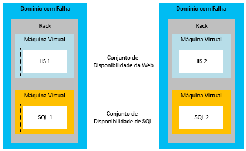
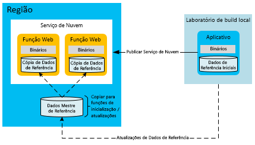
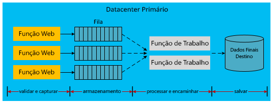

[!INCLUDE [header](../_includes/header.md)]

# Alta disponibilidade para aplicativos baseados no Microsoft AzureHigh availability for applications built on Microsoft Azure
Um aplicativo altamente disponível absorve flutuações na disponibilidade, carga e falhas temporárias em serviços e hardware dependentes.A highly available application absorbs fluctuations in availability, load, and temporary failures in dependent services and hardware. O aplicativo continua funcionando de forma aceitável, conforme definido pelos requisitos de negócios ou SLAs (contratos de nível de serviço) do aplicativo.The application continues to perform acceptably, as defined by business requirements or application service-level agreements (SLAs).

## Recursos de alta disponibilidade do AzureAzure high-availability features
O Azure tem muitos recursos internos da plataforma que oferecem suporte a aplicativos altamente disponíveis.Azure has many built-in platform features that support highly available applications. Esta seção descreve alguns desses recursos principais.This section describes some of those key features.

### Controlador de malhaFabric controller
O controlador de malha do Azure provisiona e monitora a condição das instâncias de computação do Azure.The Azure fabric controller provisions and monitors the condition of Azure compute instances. O controlador de malha monitora o status do hardware e do software das instâncias do computador host e convidado.The fabric controller monitors the status of the hardware and software of the host and guest machine instances. Quando ele detecta uma falha, ele mantém os SLAs automaticamente realocando as instâncias da VM.When it detects a failure, it maintains SLAs by automatically relocating the VM instances. O conceito de domínios de falha e atualização dá ainda mais suporte ao SLA de computação.The concept of fault and upgrade domains further supports the compute SLA.

Quando várias instâncias de função do Serviço de Nuvem são implantadas, o Azure implanta essas instâncias em diferentes domínios de falha.When multiple Cloud Service role instances are deployed, Azure deploys these instances to different fault domains. Um limite de domínio de falha é basicamente um rack de hardware diferente na mesma região.A fault domain boundary is essentially a different hardware rack in the same region. Domínios de falha reduzem a probabilidade de que uma falha de hardware localizada interrompa o serviço de um aplicativo.Fault domains reduce the probability that a localized hardware failure interrupts the service of an application. Não é possível gerenciar o número de domínios de falha das suas funções de trabalho ou Web.You cannot manage the number of fault domains of your worker roles or web roles. O controlador de malha usa os recursos dedicados que são separados dos aplicativos hospedados pelo Azure.The fabric controller uses dedicated resources that are separate from Azure-hosted applications. Ele requer 100% de tempo de atividade porque atua como núcleo do sistema do Azure.It requires 100 percent uptime because it serves as the nucleus of the Azure system. Ele monitora e gerencia instâncias da função em domínios de falha.It monitors and manages role instances across fault domains.

O diagrama a seguir mostra recursos compartilhados do Azure que o controlador de malha implanta e gerencia nos diferentes domínios de falha.The following diagram shows Azure shared resources that the fabric controller deploys and manages across different fault domains.

Embora os domínios de falha sejam separações físicas para mitigar falhas, os domínios de atualização são unidades lógicas de separação da instância que determinam quais instâncias de um serviço serão atualizadas em um momento específico.While fault domains are physical separations to mitigate failure, upgrade domains are logical units of instance separation that determine which instances of a service will be upgraded at a specific time. Por padrão, cinco domínios de atualização são definidos na sua implantação de serviço hospedado.By default, five upgrade domains are defined for your hosted service deployment. No entanto, você pode alterar esse valor no arquivo de definição de serviço.However, you can change that value in the service definition file. Por exemplo, se você tiver oito instâncias da função Web, haverá duas instâncias em três domínios de atualização e duas instâncias em um domínio de atualização.For example, if you have eight instances of your web role, there are two instances in three upgrade domains and two instances in one upgrade domain. O Azure define a sequência de atualização com base no número de domínios de atualização.Azure defines the update sequence based on the number of upgrade domains. Para obter mais informações, consulte [Atualizar um serviço de nuvem](/azure/cloud-services/cloud-services-update-azure-service/).For more information, see [Update a cloud service](/azure/cloud-services/cloud-services-update-azure-service/).

### Recursos em outros serviçosFeatures in other services
Além dos recursos de plataforma compatíveis com funcionalidades da computação de alta disponibilidade, o Azure insere recursos de alta disponibilidade em outros serviços.In addition to the platform features that support high availability of compute resources, Azure embeds high-availability features in its other services. Por exemplo, o Armazenamento do Azure mantém pelo menos três réplicas de todos os dados em sua conta de armazenamento do Azure.For example, Azure Storage maintains at least three replicas of all data in your Azure storage account. Ele também habilita a replicação geográfica para armazenar cópias de seus dados em uma região secundária.It also enables geo-replication to store copies of your data in a secondary region. A Rede de Distribuição de Conteúdo do Microsoft Azure permite que os blobs sejam armazenados em cache em todo o mundo para redundância, escalabilidade e menor latência.The Azure Content Delivery Network allows blobs to be cached around the world for redundancy, scalability, and lower latency. Banco de dados SQL do Azure mantém várias réplicas também.Azure SQL Database maintains multiple replicas as well.

Para ver uma discussão mais aprofundada sobre os recursos de disponibilidade da plataforma do Azure, consulte [Orientações técnicas de resiliência](index.md).For a deeper discussion of Azure platform availability features, see [Resiliency technical guidance](index.md). Veja também as [Práticas recomendadas para a criação de serviços em grande escala no Microsoft Azure](https://azure.microsoft.com/blog/best-practices-for-designing-large-scale-services-on-windows-azure/).Also see [Best practices for designing large-scale services on Windows Azure](https://azure.microsoft.com/blog/best-practices-for-designing-large-scale-services-on-windows-azure/).

Embora o Azure ofereça vários recursos compatíveis com a alta disponibilidade, é importante compreender suas limitações:Although Azure provides multiple features that support high availability, it's important to understand their limitations:

* Para computação, o Azure garante que as funções estejam disponíveis e em execução, mas ele não detecta se seu aplicativo está em execução ou sobrecarregado.For compute, Azure guarantees that your roles are available and running, but it cannot detect whether your application is running or overloaded.
* Para banco de dados SQL do Azure, os dados são replicados de forma síncrona dentro da região.For Azure SQL Database, data is replicated synchronously within the region. Você pode optar pela replicação geográfica ativa, que permite até quatro cópias adicionais de banco de dados na mesma região (ou em regiões diferentes).You can choose active geo-replication, which allows up to four additional database copies in the same region (or different regions). Embora essas réplicas de banco de dados não sejam backups pontuais, o Banco de Dados SQL fornecem recursos de backup pontual.While these database replicas are not point-in-time backups, SQL Database does provide point-in-time backup capabilities. Para obter mais informações, consulte [Recuperar um Banco de Dados SQL do Azure usando backups de dados automatizados: restauração pontual](/azure/sql-database/sql-database-recovery-using-backups#point-in-time-restore).For more information, see [Recover an Azure SQL Database using automated data backups: Point-in-time restore](/azure/sql-database/sql-database-recovery-using-backups#point-in-time-restore).
* Para o Armazenamento do Azure, dados de tabela e de blobs são replicados por padrão em uma região alternativa.For Azure Storage, table data and blob data are replicated by default to an alternate region. No entanto, você não pode acessar as réplicas até que o Microsoft decida efetuar failover para o site alternativo.However, you cannot access the replicas until Microsoft chooses to fail over to the alternate site. Um failover de região ocorre apenas durante uma interrupção prolongada do serviço de toda a região e não há nenhum SLA para tempo de failover geográfico.A region failover occurs only during a prolonged region-wide service disruption, and there is no SLA for geo-failover time. Também é importante observar que qualquer dado corrompido se espalha rapidamente nas réplicas.It's also important to note that any data corruption quickly spreads to the replicas. Por essas razões, é necessário complementar os recursos de disponibilidade da plataforma com recursos de disponibilidade específicos do aplicativo, incluindo o recurso de instantâneo de blobs para criar de backups pontuais dos dados de blobs.For these reasons, you must supplement platform availability features with application-specific availability features, including the blob snapshot feature to create point-in-time backups of blob data.

### Conjuntos de disponibilidade para Máquinas Virtuais do AzureAvailability sets for Azure Virtual Machines
Esse documento se concentra primariamente em serviços de nuvem, que usam um modelo PaaS (plataforma como serviço).This document primarily focuses on cloud services, which use a platform-as-a-service (PaaS) model. No entanto, também há recursos de disponibilidade específicos para Máquinas Virtuais do Azure, que usam um modelo IaaS (infraestrutura como serviço).There are also specific availability features for Azure Virtual Machines, which use an infrastructure-as-a-service (IaaS) model. Para alcançar alta disponibilidade com Máquinas Virtuais, é necessário usar conjuntos de disponibilidade, que têm função semelhante aos domínios de falha e de atualização.To achieve high availability with Virtual Machines, you must use availability sets, which serve a similar function to fault and upgrade domains. Em um conjunto de disponibilidade, o Azure posiciona as máquinas virtuais de forma a impedir as falhas de hardware localizadas e que as atividades de manutenção desativem todos os computadores nesse grupo.Within an availability set, Azure positions the virtual machines in a way that prevents localized hardware faults and maintenance activities from bringing down all the machines in that group. Conjuntos de disponibilidade são necessários para obter o SLA do Azure para disponibilidade de máquinas virtuais.Availability sets are required to achieve the Azure SLA for the availability of Virtual Machines.

O diagrama a seguir mostra dois conjuntos de disponibilidade para Web e máquinas virtuais do SQL Server, respectivamente.The following diagram shows two availability sets for web and SQL Server virtual machines, respectively.

> [!NOTE]
> No diagrama anterior, o SQL Server está instalado e em execução em máquinas virtuais.In the preceding diagram, SQL Server is installed and running on virtual machines. Isso é diferente do Banco de Dados SQL do Azure, que fornece um banco de dados como um serviço gerenciado.This is different from Azure SQL Database, which provides a database as a managed service.
> 
> 

## Estratégias de aplicativo para alta disponibilidadeApplication strategies for high availability
A maioria das estratégias de aplicativo para alta disponibilidade envolve a redundância ou a remoção de dependências de hardware entre componentes de aplicativos.Most application strategies for high availability involve either redundancy or the removal of hard dependencies between application components. O design do aplicativo deve dar suporte a tolerância a falhas durante tempo de inatividade esporádico do Azure ou serviços de terceiros.Application design should support fault tolerance during sporadic downtime of Azure or third-party services. As seções a seguir descrevem padrões de aplicativo para aumentar a disponibilidade dos serviços de nuvem.The following sections describe application patterns for improving the availability of your cloud services.

### Comunicação assíncrona e filas duráveisAsynchronous communication and durable queues
Para aumentar a disponibilidade nos aplicativos do Azure, considere usar comunicação assíncrona entre serviços com acoplamento flexível.To increase availability in Azure applications, consider asynchronous communication between loosely coupled services. Nesse padrão, as mensagens são gravadas em filas de armazenamento ou em filas do Barramento de Serviço do Azure para processamento posterior.In this pattern, messages are written to either storage queues or Azure Service Bus queues for later processing. Quando uma mensagem é escrita na fila, o controle a retorna imediatamente para o remetente.When a message is written to the queue, control immediately returns to the sender. Outro serviço do aplicativo (geralmente implementado como uma função de trabalho) processa a mensagem.Another service of the application (typically implemented as a worker role) processes the message. Se o serviço de processamento parar de funcionar, as mensagens serão acumuladas na fila até que o serviço de processamento seja restaurado.If the processing service stops working, the messages accumulate in the queue until the processing service is restored. Não há nenhuma dependência direta entre o remetente de front-end e o processador de mensagens.There is no direct dependency between the front-end sender and the message processor. Isso elimina a necessidade de chamadas de serviço síncronas que podem causar gargalos em aplicativos distribuídos.This eliminates synchronous service calls that can cause bottlenecks in distributed applications.

Uma variação desse padrão armazena informações sobre chamadas de banco de dados com falha no Armazenamento do Azure (blobs, tabelas ou filas) ou filas do Barramento de Serviço.A variation of this pattern stores information about failed database calls in Azure Storage (blobs, tables, or queues) or Service Bus queues. Por exemplo, uma chamada síncrona de um aplicativo para outro serviço (como o banco de dados SQL do Azure) falha repetidamente.For example, a synchronous call within an application to another service (such as Azure SQL Database) fails repeatedly. Você pode serializar essa solicitação em armazenamento durável.You might be able to serialize that request into durable storage. Em algum momento posterior, quando o serviço ou o banco de dados estiver novamente online, o aplicativo poderá enviar novamente a solicitação do armazenamento.At some later point when the service or database is back online, the application can resubmit the request from storage. A diferença nesse modelo é que o local intermediário é usado somente durante falhas e não é uma parte regular do fluxo de trabalho do aplicativo.The difference in this model is that the intermediate location is used only during failures, not as a regular part of the application workflow.

Em ambos os cenários, a comunicação assíncrona e o armazenamento intermediário impedem que um serviço de back-end inativo interrompa o aplicativo inteiro.In both scenarios, asynchronous communication and intermediate storage prevent a downed back-end service from bringing down the entire application. As filas servem como um intermediário lógico.Queues serve as a logical intermediary. Para saber mais sobre como escolher os serviços de enfileiramento, consulte [Filas do Azure e do Barramento de Serviço do Azure &mdash; comparações e contrastes](/azure/service-bus-messaging/service-bus-azure-and-service-bus-queues-compared-contrasted/).For more information on choosing between queuing services, see [Azure queues and Azure Service Bus queues &mdash; compared and contrasted](/azure/service-bus-messaging/service-bus-azure-and-service-bus-queues-compared-contrasted/).

### Lógica de detecção e repetição de falhasFault detection and retry logic
Um aspecto principal do design de aplicativos altamente disponíveis é usar a lógica de repetição no código para tratar normalmente um serviço temporariamente indisponível.A key aspect of the design of highly available applications is the use of retry logic within code to gracefully handle a service that is temporarily unavailable. As versões recentes de SDKs para o Armazenamento do Azure e o Barramento de Serviço do Azure são nativamente compatíveis com repetições.Recent versions of SDKs for both Azure Storage and Azure Service Bus natively support retries. Para obter mais informações sobre como fornecer a lógica de repetição personalizada para seu aplicativo, consulte o [Padrão de repetição](../patterns/retry.md).For more information on providing custom retry logic for your application, see the [Retry pattern](../patterns/retry.md).

### Padrão de dados de referência para alta disponibilidadeReference data pattern for high availability
Dados de referência são os dados somente leitura de um aplicativo.Reference data is the read-only data of an application. Esses dados fornecem o contexto de negócios dentro do qual o aplicativo gera dados transacionais durante uma operação de negócios.This data provides the business context within which the application generates transactional data during a business operation. A integridade dos dados transacionais depende do instantâneo dos dados de referência no momento de conclusão da transação.The integrity of transactional data depends on a snapshot of the reference data at the time the transaction was completed.

Dados de referência são necessários para a operação correta do aplicativo.Reference data is necessary for the proper operation of the application. Diversos aplicativos criam e mantêm dados de referência; sistemas MDM (Gerenciamento de Dados Mestre) executam essa função com frequência.Various applications create and maintain reference data; master data management (MDM) systems often perform this function. Esses sistemas são responsáveis pelo ciclo de vida dos dados de referência.These systems are responsible for the life cycle of the reference data. Catálogo de produtos, mestre de funcionários, mestre de peças e mestre de equipamentos são exemplos de dados de referência.Examples of reference data include product catalog, employee master, parts master, and equipment master. Os dados de referência também podem se originar fora da organização, por exemplo, CEPs ou alíquota de imposto.Reference data can also originate from outside the organization, for example, postal codes or tax rates. Estratégias para aumentar a disponibilidade dos dados de referência normalmente são menos difíceis que para dados transacionais.Strategies for increasing the availability of reference data are typically less difficult than those for transactional data. Dados de referência têm a vantagem de ser, na maior parte, imutáveis.Reference data has the advantage of being mostly immutable.

Funções Web e de trabalho do Azure que consomem dados de referência podem ser transformadas em autônomas no tempo de execução implantando os dados de referência junto com o aplicativo.Azure web and worker roles that consume reference data can be made autonomous at runtime by deploying the reference data along with the application. Essa abordagem é ideal se o tamanho do armazenamento local permitir essa implantação.This approach is ideal if the size of the local storage allows such a deployment. Bancos de dados SQL inseridos, bancos de dados NoSQL ou arquivos XML implantados localmente ajudam na autonomia de unidades de escala de computação do Azure.Embedded SQL databases, NoSQL databases, or XML files deployed locally help with the autonomy of Azure compute scale units. No entanto, você deve ter um mecanismo para atualizar os dados em cada função sem a necessidade de reimplantação.However, you should have a mechanism to update the data in each role without requiring redeployment. Para fazer isso, coloque as atualizações dos dados de referência em um ponto de extremidade de armazenamento de nuvem (por exemplo, o Armazenamento de Blobs do Azure ou o Banco de Dados SQL).To do this, place any updates to the reference data at a cloud storage endpoint (for example, Azure Blob storage or SQL Database). Adicione código a cada função que baixa as atualizações de dados em nós de computação na inicialização da função.Add code to each role that downloads the data updates into the compute nodes at role startup. Como alternativa, adicione o código que permite que um administrador execute um download forçado nas instâncias da função.Alternatively, add code that allows an administrator to perform a forced download into the role instances.

Para aumentar a disponibilidade, as funções também devem conter um conjunto de dados de referência caso o armazenamento esteja inativo.To increase availability, the roles should also contain a set of reference data in case storage is down. As funções podem começar com um conjunto básico de dados de referência até que os recursos de armazenamento estejam disponíveis para as atualizações.Roles can start with a basic set of reference data until the storage resource becomes available for the updates.

Com esse padrão, as novas implantações ou instâncias de função podem levar mais tempo para iniciar se você estiver implantando ou baixando grandes volumes de dados de referência.With this pattern, new deployments or role instances may take longer to start if you are deploying or downloading large amounts of reference data. Essa compensação pode ser aceitável para a autonomia de ter dados de referência imediatamente disponíveis em cada função em vez de depender de serviços de armazenamento externo.This tradeoff might be acceptable for the autonomy of having the reference data immediately available on each role, rather than depending on external storage services.

### Padrão de dados transacionais para alta disponibilidadeTransactional data pattern for high availability
Dados transacionais são os dados que o aplicativo gera em um contexto de negócios.Transactional data is the data that the application generates in a business context. Dados transacionais são uma combinação do conjunto de processos de negócios que o aplicativo implementa e dos dados de referência que permitem esses processos.Transactional data is a combination of the set of business processes that the application implements and the reference data that supports these processes. Exemplos de dados transacionais podem incluir pedidos, aviso de envio avançado, faturas e oportunidades de CRM (gerenciamento de relacionamento com o cliente).Examples of transactional data can include orders, advanced shipping notices, invoices, and customer relationship management (CRM) opportunities. Os dados transacionais são fornecidos para sistemas externos para manter um registro ou para processamento adicional.Transactional data is supplied to external systems for record keeping or for further processing.

Os dados de referência podem ser alterados nos sistemas que são responsáveis por esses dados.Reference data can change within the systems that are responsible for that data. Portanto, os dados transacionais devem salvar o contexto de dados de referência pontual para minimizar as dependências externas para consistência semântica.Therefore, transactional data must save the point-in-time reference data context to minimize external dependencies for its semantic consistency. Por exemplo, um produto pode ser removido do catálogo vários meses depois que um pedido é atendido.For example, a product may be removed from the catalog several months after an order is fulfilled. É recomendável armazenar o máximo de contexto de dados de referência possível com a transação.Storing as much reference data context as possible with the transaction is recommended. Essa abordagem preserva a semântica associada à transação, mesmo se os dados de referência forem alterados após a captura da transação.This approach preserves the semantics associated with the transaction, even if the reference data changes after the transaction is captured.

Conforme mencionado anteriormente, arquiteturas que usam acoplamento flexível e comunicação assíncrona podem fornecer níveis mais altos de disponibilidade.As mentioned previously, architectures that use loose coupling and asynchronous communication can provide higher levels of availability. Isso também é verdadeiro para dados transacionais, mas a implementação é mais complexa.This is true for transactional data as well, but the implementation is more complex. Os padrões transacionais tradicionais normalmente contam com o banco de dados para garantir a transação.Traditional transactional patterns usually rely on the database for guaranteeing the transaction. Quando você introduz camadas intermediárias, o código do aplicativo deve tratar corretamente os dados em várias camadas para garantir consistência e durabilidade suficientes.When you introduce intermediate layers, the application code must correctly handle the data at various layers to ensure sufficient consistency and durability.

A seguinte sequência descreve um fluxo de trabalho que separa a captura de dados transacionais de seu processamento:The following sequence describes a workflow that separates the capture of transactional data from its processing:

1. Nó de computação na Web: apresente dados de referência.Web compute node: Present reference data.
2. Armazenamento externo: salve dados transacionais intermediários.External storage: Save intermediate transactional data.
3. Nó de computação na Web: conclua a transação do usuário final.Web compute node: Complete the end-user transaction.
4. Nó de computação na Web: envie os dados transacionais concluídos com o contexto de dados de referência para um armazenamento durável temporário com garantia de oferecer uma resposta previsível.Web compute node: Send the completed transactional data with its reference data context to temporary durable storage that is guaranteed to give a predictable response.
5. Nó de computação na Web: informe ao usuário final a conclusão da transação.Web compute node: Signal the end-user completion of the transaction.
6. Nó de computação em segundo plano: extraia os dados transacionais, realize processamento adicional, se necessário e envie-os para o local de armazenamento final no sistema atual.Background compute node: Extract the transactional data, process it further if necessary, and send it to its final storage location in the current system.

O diagrama a seguir mostra uma possível implementação desse projeto em um serviço de nuvem hospedado pelo Azure.The following diagram shows one possible implementation of this design in an Azure-hosted cloud service.

As setas tracejadas no diagrama acima indicam processamento assíncrono.The dashed arrows in the preceding diagram indicate asynchronous processing. A função web front-end não está ciente desse processamento assíncrono.The front-end web role is not aware of this asynchronous processing. Isso resulta no armazenamento da transação no seu destino final com referência ao sistema atual.This leads to the storage of the transaction at its final destination with reference to the current system. Devido à latência apresentada neste modelo assíncrono, os dados transacionais não estão imediatamente disponíveis para consulta.Due to the latency that this asynchronous model introduces, the transactional data is not immediately available for query. Portanto, cada unidade de dados transacionais precisa ser salva em um cache ou uma sessão de usuário para atender às necessidades imediatas da interface do usuário.Therefore, each unit of the transactional data needs to be saved in a cache or a user session to meet the immediate UI needs.

A função web independe do restante da infraestrutura.The web role is autonomous from the rest of the infrastructure. O perfil de disponibilidade é uma combinação da função web e fila do Azure e não de toda a infraestrutura.Its availability profile is a combination of the web role and the Azure queue and not the entire infrastructure. Além de alta disponibilidade, essa abordagem permite que a função web seja escala horizontalmente, independentemente do armazenamento de back-end.In addition to high availability, this approach allows the web role to scale horizontally, independent of the back-end storage. Esse modelo de alta disponibilidade pode ter um impacto sobre a economia das operações.This high-availability model can have an impact on the economics of operations. Componentes adicionais, como filas do Azure e funções de trabalho, podem afetar os custos mensais com uso.Additional components like Azure queues and worker roles can affect monthly usage costs.

Observe que o diagrama anterior mostra uma implementação dessa abordagem desacoplada para dados transacionais.The previous diagram shows one implementation of this decoupled approach to transactional data. Há muitas outras implementações possíveis.There are many other possible implementations. A lista a seguir fornece algumas alternativas:The following list provides some alternatives:

* Uma função de trabalho deve ser colocada entre a função web e a fila de armazenamento.A worker role might be placed between the web role and the storage queue.
* Uma fila do Barramento de Serviço pode ser usada em vez de uma fila de armazenamento do Azure.A Service Bus queue can be used instead of an Azure Storage queue.
* O destino final pode ser o armazenamento do Azure ou um provedor de banco de dados diferente.The final destination might be Azure Storage or a different database provider.
* O Cache do Azure pode ser usado na camada Web para fornecer os requisitos imediatos de cache após a transação.Azure Cache can be used at the web layer to provide the immediate caching requirements after the transaction.

### Padrões de escalabilidadeScalability patterns
É importante observar que a escalabilidade do serviço de nuvem afeta diretamente a disponibilidade.It's important to note that the scalability of a cloud service directly affects availability. Se uma carga maior fizer com que o serviço não responda, a impressão do usuário será que o aplicativo está inativo.If increased load causes your service to be unresponsive, the user perception is that the application is down. Siga as práticas comprovadas para escalabilidade com base em sua carga esperada de aplicativo e em futuras expectativas.Follow proven practices for scalability based on your expected application load and future expectations. Maximizar a escala envolve várias considerações, como o uso de uma única conta ou de várias contas de armazenamento, compartilhando entre vários bancos de dados e estratégias de cache.Maximizing scale involves many considerations, such as single versus multiple storage accounts, sharing across multiple databases, and caching strategies. Para ver informações detalhadas sobre esses padrões, consulte [Práticas recomendadas para projetar serviços em grande escala no Microsoft Azure](https://azure.microsoft.com/blog/best-practices-for-designing-large-scale-services-on-windows-azure/).For in-depth information about these patterns, see [Best practices for designing large-scale services on Microsoft Azure](https://azure.microsoft.com/blog/best-practices-for-designing-large-scale-services-on-windows-azure/).

## Próximas etapasNext steps
Essa série de documentos abrange a recuperação de desastres e alta disponibilidade para aplicativos criados no Microsoft Azure.This series of documents covers disaster recovery and high availability for applications built on Microsoft Azure. O próximo artigo dessa série é [Recuperação de desastre para aplicativos criados no Microsoft Azure](disaster-recovery-azure-applications.md).The next article in the series is [Disaster recovery for applications built on Microsoft Azure](disaster-recovery-azure-applications.md).

