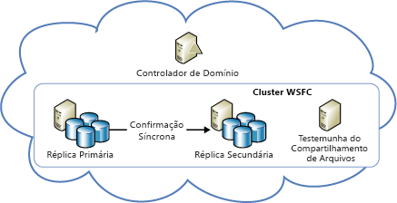
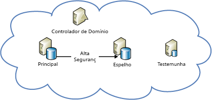

[!INCLUDE [header](../_includes/header.md)]

# Orientações técnicas de resiliência do Azure: Recuperação de falhas locais no AzureAzure resiliency technical guidance: Recovery from local failures in Azure

Há duas ameaças básicas à disponibilidade de aplicativos:There are two primary threats to application availability:

- A falha de dispositivos, como unidades e servidoresThe failure of devices, such as drives and servers
- O esgotamento de recursos essenciais, como a computação em condições de picos de cargaThe exhaustion of critical resources, such as compute under peak load conditions

O Azure fornece uma combinação de gerenciamento de recursos, elasticidade, balanceamento de carga e particionamento para permitir alta disponibilidade sob essas circunstâncias.Azure provides a combination of resource management, elasticity, load balancing, and partitioning to enable high availability under these circumstances. Alguns desses recursos são executados automaticamente para todos os serviços do Azure.Some of these features are performed automatically for all Azure services. No entanto, em alguns casos, o desenvolvedor de aplicativo precisa fazer alguns ajustes para se beneficiar deles.However, in some cases, the application developer must do some additional work to benefit from them.

## Serviços de NuvemCloud Services

Os Serviços de Nuvem do Azure consistem em conjuntos de uma ou mais funções de trabalho ou web.Azure Cloud Services consists of collections of one or more web or worker roles. Uma ou mais instâncias de uma função podem ser executadas simultaneamente.One or more instances of a role can run concurrently. A configuração determina o número de instâncias.The configuration determines the number of instances. As instâncias de função são monitoradas e gerenciadas por meio de um componente chamado de controlador de malha.Role instances are monitored and managed through a component called the fabric controller. O controlador de malha detecta e responde automaticamente às falhas de software e hardware.The fabric controller detects and responds to both software and hardware failures automatically.

Cada instância de função é executada em sua própria VM (máquina virtual) e se comunica com seu controlador de malha por meio de um agente convidado.Every role instance runs in its own virtual machine (VM) and communicates with its fabric controller through a guest agent. O agente convidado coleta métricas de recurso e de nó, incluindo uso, status, logs, uso de recursos, exceções e condições de falha da VM.The guest agent collects resource and node metrics, including VM usage, status, logs, resource usage, exceptions, and failure conditions. O controlador de malha consulta o agente convidado em intervalos configuráveis e reinicia a VM se o agente convidado não responder.The fabric controller queries the guest agent at configurable intervals, and it restarts the VM if the guest agent fails to respond. No caso de falha de hardware, o controlador de malha associado move todas as instâncias de função afetadas para um novo nó de hardware e reconfigura a rede para rotear o tráfego para lá.In the event of hardware failure, the associated fabric controller moves all affected role instances to a new hardware node and reconfigures the network to route traffic there.

Para tirar proveito desses recursos, os desenvolvedores devem garantir que todas as funções de serviço evitem armazenar o estado nas instâncias de função.To benefit from these features, developers should ensure that all service roles avoid storing state on the role instances. Em vez disso, todos os dados persistentes devem ser acessados do armazenamento durável, como Armazenamento do Azure ou Banco de Dados SQL do Azure.Instead, all persistent data should be accessed from durable storage, such as Azure Storage or Azure SQL Database. Isso permite que qualquer função manipule solicitações.This allows any roles to handle requests. Isso também significa que as instâncias de função podem ficar inoperantes a qualquer momento sem criar inconsistências no estado transiente ou persistente do serviço.It also means that role instances can go down at any time without creating inconsistencies in the transient or persistent state of the service.

O requisito para armazenar o estado externamente nas funções tem várias implicações.The requirement to store state externally to the roles has several implications. Significa, por exemplo, que todas as alterações relacionadas a uma tabela de Armazenamento do Azure devem ser modificadas em uma única transação de grupo de entidades, se possível.It implies, for example, that all related changes to an Azure Storage table should be changed in a single entity-group transaction, if possible. Obviamente, nem sempre é possível fazer todas as alterações em uma única transação.Of course, it isn't always possible to make all changes in a single transaction. Você deve tomar cuidado especial para garantir que falhas de instância de função não causem problemas quando interromperem operações de longa execução abrangendo duas ou mais atualizações para o estado persistente do serviço.You must take special care to ensure that role instance failures do not cause problems when they interrupt long-running operations that span two or more updates to the persistent state of the service. Se outra função tentar repetir essa operação, ela deverá prever e tratar do caso em que o trabalho foi parcialmente concluído.If another role attempts to retry such an operation, it should anticipate and handle the case where the work was partially completed.

Por exemplo, considere um serviço que particione dados entre vários repositórios.For example, consider a service that partitions data across multiple stores. Se uma função de trabalho falhar enquanto estiver realocando um fragmento, talvez a realocação do fragmento não seja finalizada.If a worker role goes down while it's relocating a shard, the relocation of the shard might not finish. Ou a realocação pode ser repetida desde seu início por uma função de trabalho diferente, possivelmente causando uma corrupção de dados ou deixando dados órfãos.Or the relocation might be repeated from its inception by a different worker role, potentially causing orphaned data or data corruption. Para evitar problemas, as operações de longa execução devem ser dos tipos a seguir:To prevent problems, long-running operations must be one or both of the following:

- *Idempotente*: repetíveis sem efeitos colaterais.*Idempotent*: Repeatable without side effects. Para ser idempotente, uma operação de longa execução deve ter o mesmo efeito, não importando quantas vezes ela é executada, mesmo que ela seja interrompida durante a execução.To be idempotent, a long-running operation should have the same effect no matter how many times it's executed, even when it's interrupted during execution.
- *Reinicializável incrementalmente*: capaz de continuar do ponto de falha mais recente.*Incrementally restartable*: Able to continue from the most recent point of failure. Para ser reinicializável incrementalmente, uma operação longa execução deve consistir em uma sequência de operações atômicas menores.To be incrementally restartable, a long-running operation should consist of a sequence of smaller atomic operations. Ela também deve registrar seu progresso no armazenamento durável, de modo que cada invocação subsequente obtenha seu predecessor interrompido.It should also record its progress in durable storage, so that each subsequent invocation picks up where its predecessor stopped.

Por fim, todas as operações de longa execução devem ser invocadas repetidamente até que sejam bem-sucedidas.Finally, all long-running operations should be invoked repeatedly until they succeed. Por exemplo, uma operação de provisionamento pode ser colocada em uma fila do Azure e depois ser removida da fila por uma função de trabalho somente quando for bem-sucedida.For example, a provisioning operation might be placed in an Azure queue, and then removed from the queue by a worker role only when it succeeds. A coleta de lixo pode ser necessária para limpar os dados criados por operações interrompidas.Garbage collection might be necessary to clean up data that interrupted operations create.

### ElasticidadeElasticity

O número inicial de instâncias em execução para cada função é determinado na configuração de cada função.The initial number of instances running for each role is determined in each role’s configuration. Os administradores devem configurar inicialmente cada uma das funções para execução com duas ou mais instâncias baseadas na carga esperada.Administrators should initially configure each role to run with two or more instances based on expected load. Porém, é possível escalar verticalmente instâncias de função facilmente à medida que os padrões de uso mudam.But you can easily scale role instances up or down as usage patterns change. Você pode fazer isso manualmente no portal do Azure ou pode automatizar o processo usando o Windows PowerShell, a API de Gerenciamento de Serviços ou ferramentas de terceiros.You can do this manually in the Azure portal, or you can automate the process by using Windows PowerShell, the Service Management API, or third-party tools. Para saber mais, confira [Como dimensionar automaticamente um serviço de nuvem](/azure/cloud-services/cloud-services-how-to-scale/).For more information, see [How to autoscale an application](/azure/cloud-services/cloud-services-how-to-scale/).

### ParticionamentoPartitioning

O controlador de malha do Azure usa dois tipos de partição:The Azure fabric controller uses two types of partitions:

- Um *domínio de atualização* é usado para atualizar instâncias de função de um serviço em grupos.An *update domain* is used to upgrade a service’s role instances in groups. O Azure implanta instâncias do serviço em vários domínios de atualização.Azure deploys service instances into multiple update domains. Para uma atualização in-loco, o controlador de malha desativa todas as instâncias em um domínio de atualização, as atualiza e as reinicia antes de passar para o próximo domínio de atualização.For an in-place update, the fabric controller brings down all the instances in one update domain, updates them, and then restarts them before moving to the next update domain. Essa abordagem impede que o serviço inteiro fique indisponível durante o processo de atualização.This approach prevents the entire service from being unavailable during the update process.
- Um *domínio de falha* define pontos potenciais de falha de hardware ou de rede.A *fault domain* defines potential points of hardware or network failure. Para qualquer função que tenha mais de uma instância, o controlador de malha garante que as instâncias sejam distribuídas entre vários domínios de falha, a fim de evitar que falhas de hardware isoladas interrompam o serviço.For any role that has more than one instance, the fabric controller ensures that the instances are distributed across multiple fault domains, to prevent isolated hardware failures from disrupting service. Os domínios de falha administram toda a exposição de falhas de servidor e cluster.Fault domains govern all exposure to server and cluster failures.

O [SLA (contrato de nível de serviço) do Azure](https://azure.microsoft.com/support/legal/sla/) garante que quando duas ou mais instâncias de função web são implantadas em diferentes domínios de falha e atualização, elas tenham conectividade externa, pelo menos, 99,95% do tempo.The [Azure service-level agreement (SLA)](https://azure.microsoft.com/support/legal/sla/) guarantees that when two or more web role instances are deployed to different fault and upgrade domains, they'll have external connectivity at least 99.95 percent of the time. Ao contrário do que ocorre nos domínios de atualização, não há nenhuma maneira de controlar o número de domínios de falha.Unlike update domains, there's no way to control the number of fault domains. O Azure aloca domínios de falha e distribui instâncias de função entre eles automaticamente.Azure automatically allocates fault domains and distributes role instances across them. Pelo menos as primeiras duas instâncias de cada função são colocadas em diferentes domínios de falha e de atualização para garantir que qualquer função com pelo menos duas instâncias atenda ao SLA.At least the first two instances of every role are placed in different fault and upgrade domains to ensure that any role with at least two instances will satisfy the SLA. Isso é representado no diagrama a seguir.This is represented in the following diagram.

### Balanceamento de cargaLoad balancing

Todo o tráfego de entrada para uma função web passa por um balanceador de carga sem estado, que distribui solicitações de cliente entre instâncias de função.All inbound traffic to a web role passes through a stateless load balancer, which distributes client requests among the role instances. Instâncias de função individuais não têm endereços IP públicos e não podem ser endereçáveis diretamente da Internet.Individual role instances do not have public IP addresses, and they are not directly addressable from the Internet. As funções web não tem estado, de modo que qualquer solicitação de cliente possa ser roteada para qualquer instância de função.Web roles are stateless so that any client request can be routed to any role instance. Um evento [StatusCheck](https://msdn.microsoft.com/library/microsoft.windowsazure.serviceruntime.roleenvironment.statuscheck.aspx) é gerado a cada 15 segundos.A [StatusCheck](https://msdn.microsoft.com/library/microsoft.windowsazure.serviceruntime.roleenvironment.statuscheck.aspx) event is raised every 15 seconds. Você pode usá-lo para indicar se a função está pronta para receber tráfego ou se ela está ocupada e deve ser retirada da rotação do balanceador de carga.You can use this to indicate whether the role is ready to receive traffic, or whether it's busy and should be taken out of the load-balancer rotation.

## Máquinas VirtuaisVirtual Machines

As Máquinas Virtuais do Azure são diferentes de funções de computação de PaaS (plataforma como serviço) em vários aspectos, no que se refere à alta disponibilidade.Azure Virtual Machines differs from platform as a service (PaaS) compute roles in several respects in relation to high availability. Em alguns casos, você precisa fazer trabalho adicional para garantir a alta disponibilidade.In some instances, you must do additional work to ensure high availability.

### Durabilidade de discoDisk durability

Diferentemente do que ocorre nas instâncias de função de PaaS, os dados armazenados em unidades de máquina virtual são persistentes mesmo quando a máquina virtual é realocada.Unlike PaaS role instances, data stored on virtual machine drives is persistent even when the virtual machine is relocated. As máquinas virtuais do Azure usam discos de VM que existem como blobs no Armazenamento do Azure.Azure virtual machines use VM disks that exist as blobs in Azure Storage. Devido às características de disponibilidade do Armazenamento do Azure, os dados armazenados nas unidades de uma máquina virtual também têm alta disponibilidade.Because of the availability characteristics of Azure Storage, the data stored on a virtual machine’s drives is also highly available.

Observe que a unidade D (em VMs do Windows) é a exceção a essa regra.Note that drive D (in Windows VMs) is the exception to this rule. A unidade D é na verdade o armazenamento físico no servidor de rack que hospeda a VM, e seus dados serão perdidos se a VM for reciclada.Drive D is actually physical storage on the rack server that hosts the VM, and its data will be lost if the VM is recycled. A unidade D destina-se somente a armazenamento temporário.Drive D is intended for temporary storage only. No Linux, o Azure "geralmente" (mas nem sempre) expõe o disco temporário local como o dispositivo de bloco /dev/sdb.In Linux, Azure “usually” (but not always) exposes the local temporary disk as /dev/sdb block device. Geralmente, ele é montado pelo Agente Linux do Azure como pontos de montagem /mnt/resource ou /mnt (configuráveis via /etc/waagent.conf).It is often mounted by the Azure Linux Agent as /mnt/resource or /mnt mount points (configurable via /etc/waagent.conf).

<!-- markdownlint-disable MD024 -->

### ParticionamentoPartitioning

O Azure compreende nativamente as camadas em um aplicativo de PaaS (função web e função de trabalho) e, portanto, pode distribuí-las entre domínios de falha e atualização.Azure natively understands the tiers in a PaaS application (web role and worker role) and thus can properly distribute them across fault and update domains. Em contrapartida, as camadas em um aplicativos de IaaS (infraestrutura como serviço) devem ser definidas manualmente por meio de conjuntos de disponibilidade.In contrast, the tiers in an infrastructure as a service (IaaS) application must be manually defined through availability sets. Os conjuntos de disponibilidade são necessários para um SLA de IaaS.Availability sets are required for an SLA under IaaS.

No diagrama anterior, a camada de IIS (Serviços de Informações da Internet) (que funciona como uma camada de aplicativo Web) e a camada SQL (que funciona como uma camada de dados) são atribuídas a diferentes conjuntos de disponibilidade.In the preceding diagram, the Internet Information Services (IIS) tier (which works as a web app tier) and the SQL tier (which works as a data tier) are assigned to different availability sets. Isso garante que todas as instâncias de cada camada tenham redundância de hardware na distribuição de máquinas virtuais entre domínios de falha e que as camadas inteiras não sejam desativadas durante uma atualização.This ensures that all instances of each tier have hardware redundancy by distributing virtual machines across fault domains, and that entire tiers are not taken down during an update.

### Balanceamento de cargaLoad balancing

Se as VMs devem ter tráfego distribuído entre elas, você deve agrupá-las em um aplicativo e realizar o balanceamento de carga por um ponto de extremidade TCP ou UDP específico.If the VMs should have traffic distributed across them, you must group the VMs in an application and load balance across a specific TCP or UDP endpoint. Para saber mais, confira [Balanceamento de carga de máquinas virtuais](/azure/virtual-machines/virtual-machines-linux-load-balance/?toc=%2fazure%2fvirtual-machines%2flinux%2ftoc.json).For more information, see [Load balancing virtual machines](/azure/virtual-machines/virtual-machines-linux-load-balance/?toc=%2fazure%2fvirtual-machines%2flinux%2ftoc.json). Se as VMs receberem entrada de outra fonte (por exemplo, um mecanismo de enfileiramento), não será necessário um balanceador de carga.If the VMs receive input from another source (for example, a queuing mechanism), a load balancer is not required. O balanceador de carga usará uma verificação básica de integridade para determinar se o tráfego deve ser enviado para o nó.The load balancer uses a basic health check to determine whether traffic should be sent to the node. Também é possível criar suas próprias investigações para implementar as métricas de integridade específicas de aplicativo que determinam se a VM deve receber tráfego.It's also possible to create your own probes to implement application-specific health metrics that determine whether the VM should receive traffic.

## ArmazenamentoStorage

O Armazenamento do Azure é o serviço de dados durável de linha de base do Azure.Azure Storage is the baseline durable data service for Azure. Ele fornece blob, tabela, fila e armazenamento de VM em disco.It provides blob, table, queue, and VM disk storage. Ele usa uma combinação de replicação e gerenciamento de recursos para fornecer alta disponibilidade em um único datacenter.It uses a combination of replication and resource management to provide high availability within a single datacenter. O SLA de disponibilidade do Armazenamento do Azure garante que em pelo menos 99,9% do tempo:The Azure Storage availability SLA guarantees that at least 99.9 percent of the time:

- As solicitações corretamente formatadas para adicionar, atualizar, ler e excluir dados serão ser bem-sucedidas e processadas corretamente.Correctly formatted requests to add, update, read, and delete data will be successfully and correctly processed.
- As contas de armazenamento terão conectividade com o gateway de Internet.Storage accounts will have connectivity to the Internet gateway.

### ReplicaçãoReplication

O Armazenamento do Azure facilita a durabilidade de dados mantendo várias cópias de todos os dados em diferentes unidades pelos subsistemas físicos de armazenamento totalmente independentes na região.Azure Storage facilitates data durability by maintaining multiple copies of all data on different drives across fully independent physical storage subsystems within the region. Os dados são replicados de forma síncrona e todas as cópias são confirmadas antes da confirmação da gravação.Data is replicated synchronously, and all copies are committed before the write is acknowledged. O Armazenamento do Azure é altamente consistente, o que significa que há garantia de que as leituras reflitam as gravações mais recentes.Azure Storage is strongly consistent, meaning that reads are guaranteed to reflect the most recent writes. Além disso, cópias de dados são verificadas continuamente para detectar e reparar bits corrompidos, uma ameaça frequentemente desconsiderada à integridade dos dados armazenados.In addition, copies of data are continually scanned to detect and repair bit rot, an often overlooked threat to the integrity of stored data.

Os serviços se beneficiam da replicação apenas pelo uso do Armazenamento do Azure.Services benefit from replication just by using Azure Storage. O desenvolvedor do serviço não precisa fazer mais nada para se recuperar de uma falha local.The service developer doesn't need to do additional work to recover from a local failure.

### Gerenciamento de recursosResource management

As contas de armazenamento criadas depois de maio de 2014 podem ter até 500 TB (o máximo anterior era 200 TB).Storage accounts created after May 2014, can grow to up to 500 TB (the previous maximum was 200 TB). Se espaço adicional for necessário, os aplicativos deverão ser criados para usar várias contas de armazenamento.If additional space is required, applications must be designed to use multiple storage accounts.

### Discos de máquina virtualVirtual machine disks

O disco de uma máquina virtual é armazenado como um blob de páginas no Armazenamento do Azure, o que dá a ele todas as mesmas propriedades de durabilidade e escalabilidade do armazenamento de Blobs.A virtual machine’s disk is stored as a page blob in Azure Storage, giving it all the same durability and scalability properties as Blob storage. Esse design torna os dados em um disco de máquina virtual persistentes, mesmo se o servidor que executa a VM falhar e a VM precisa ser reiniciada em outro servidor.This design makes the data on a virtual machine’s disk persistent, even if the server running the VM fails and the VM must be restarted on another server.

## Banco de dadosDatabase

### Banco de dados SQLSQL Database

O Banco de Dados SQL do Azure fornece banco de dados como serviço.Azure SQL Database provides database as a service. Ele permite que aplicativos sejam provisionados rapidamente, insiram dados e consultem bancos de dados relacionais.It allows applications to quickly provision, insert data into, and query relational databases. Ele fornece muitos dos recursos e funcionalidades conhecidos do SQL Server, ao mesmo tempo que abstrai a carga de hardware, configuração, aplicação de patch e resiliência.It provides many of the familiar SQL Server features and functionality, while abstracting the burden of hardware, configuration, patching, and resiliency.

> [!NOTE]
> O Banco de Dados do SQL Azure não fornece paridade de recurso um para um com o SQL Server.Azure SQL Database does not provide one-to-one feature parity with SQL Server. Ele foi desenvolvido para atender a um conjunto diferente de requisitos — um que seja exclusivamente adequado para aplicativos de nuvem (escala elástica, banco de dados como serviço para reduzir custos de manutenção e assim por diante).It's intended to fulfill a different set of requirements--one that's uniquely suited to cloud applications (elastic scale, database as a service to reduce maintenance costs, and so on). Para mais informações, confira [Escolher uma opção do SQL Server de nuvem: Banco de dados do Azure SQL (PaaS) ou SQL Server em máquinas virtuais do Azure (IaaS)](/azure/sql-database/sql-database-paas-vs-sql-server-iaas/).For more information, see [Choose a cloud SQL Server option: Azure SQL (PaaS) Database or SQL Server on Azure VMs (IaaS)](/azure/sql-database/sql-database-paas-vs-sql-server-iaas/).

#### ReplicaçãoReplication

O Banco de Dados SQL do Azure fornece resiliência interna a falhas no nível de nó.Azure SQL Database provides built-in resiliency to node-level failure. Todas as gravações em um banco de dados são replicadas automaticamente em dois ou mais nós em segundo plano por meio de uma técnica de confirmação de quorum.All writes into a database are automatically replicated to two or more background nodes through a quorum commit technique. (A réplica primária, e pelo menos uma secundária, devem confirmar que a atividade foi gravada no log de transações antes que a transação seja considerada bem-sucedida e retorne.) No caso de falha de nó, o banco de dados faz failover automaticamente para uma das réplicas secundárias.(The primary and at least one secondary must confirm that the activity is written to the transaction log before the transaction is deemed successful and returns.) In the case of node failure, the database automatically fails over to one of the secondary replicas. Isso causa uma interrupção de conexão transitória para aplicativos cliente.This causes a transient connection interruption for client applications. Por esse motivo, todos os clientes do Banco de Dados SQL do Azure devem implementar alguma forma de tratamento de conexão transitória.For this reason, all Azure SQL Database clients must implement some form of transient connection handling. Para saber mais, confira [Diretriz específica do serviço de repetição](/azure/best-practices-retry-service-specific/).For more information, see [Retry service specific guidance](/azure/best-practices-retry-service-specific/).

#### Gerenciamento de recursosResource management

Cada banco de dados, quando criado, é configurado com um limite de tamanho superior.Each database, when created, is configured with an upper size limit. O tamanho máximo disponível atualmente é de 1 TB (os limites de tamanho variam com base em sua camada de serviço; confira [camadas de serviço e níveis de desempenho de Bancos de Dados do SQL Azure](/azure/sql-database/sql-database-resource-limits/#service-tiers-and-performance-levels).The currently available maximum size is 1 TB (size limits vary based on your service tier, see [service tiers and performance levels of Azure SQL Databases](/azure/sql-database/sql-database-resource-limits/#service-tiers-and-performance-levels). Quando um banco de dados atinge seu limite de tamanho superior, ele rejeita os comandos adicionais INSERT ou UPDATE.When a database hits its upper size limit, it rejects additional INSERT or UPDATE commands. (Ainda é possível consultar e excluir dados).(Querying and deleting data is still possible.)

Em um banco de dados, o Banco de Dados SQL do Azure usa uma malha para gerenciar recursos.Within a database, Azure SQL Database uses a fabric to manage resources. No entanto, em vez de um controlador de malha, ele usa uma topologia de anel para detectar falhas.However, instead of a fabric controller, it uses a ring topology to detect failures. Cada réplica em um cluster tem dois vizinhos e é responsável por detectar quando eles são desativados.Every replica in a cluster has two neighbors and is responsible for detecting when they go down. Quando uma réplica é desativada, seus vizinhos disparam um agente de reconfiguração para recriá-la em outro computador.When a replica goes down, its neighbors trigger a reconfiguration agent to re-create it on another machine. A limitação de mecanismo é fornecida para garantir que um servidor lógico não use recursos demais em um computador ou exceda seus limites físicos.Engine throttling is provided to ensure that a logical server doesn't use too many resources on a machine or exceed the machine’s physical limits.

### ElasticidadeElasticity

Se o aplicativo exigir mais do que o limite de banco de dados de 1 TB, ele deverá implementar uma abordagem de escalonamento horizontal.If the application requires more than the 1 TB database limit, it must implement a scale-out approach. Escale horizontalmente com o Banco de Dados SQL particionando manualmente os dados, também conhecido como fragmentação, entre vários bancos de dados SQL.You scale out with Azure SQL Database by manually partitioning, also known as sharding, data across multiple SQL databases. Essa abordagem de escalonamento horizontal dá oportunidade de atingir o crescimento de custo praticamente linear com escala.This scale-out approach provides the opportunity to achieve nearly linear cost growth with scale. O crescimento elástico ou a capacidade sob demanda podem crescer com custos incrementais conforme necessário, porque os bancos de dados são cobrados com base no tamanho real médio usado por dia, e não no tamanho máximo possível.Elastic growth or capacity on demand can grow with incremental costs as needed because databases are billed based on the average actual size used per day, not based on maximum possible size.

## SQL Server em máquinas virtuaisSQL Server on Virtual Machines

A instalar o SQL Server (versão 2014 ou posterior) nas Máquinas Virtuais do Azure, você pode aproveitar os recursos tradicionais de disponibilidade do SQL Server.By installing SQL Server (version 2014 or later) on Azure Virtual Machines, you can take advantage of the traditional availability features of SQL Server. Esses recursos incluem Grupos de Disponibilidade do AlwaysOn e espelhamento de banco de dados.These features include AlwaysOn Availability Groups and database mirroring. Observe que as VMs, o armazenamento e a rede do Azure têm características operacionais diferentes de uma infraestrutura de TI local não virtualizada.Note that Azure VMs, storage, and networking have different operational characteristics than an on-premises, non-virtualized IT infrastructure. Uma implementação bem-sucedida de uma solução do SQL Server de HA/DR (alta disponibilidade/recuperação de desastre) no Azure requer que você compreenda essas diferenças e crie sua solução para acomodá-las.A successful implementation of a high availability/disaster recovery (HA/DR) SQL Server solution in Azure requires that you understand these differences and design your solution to accommodate them.

### Nós de alta disponibilidade em um conjunto de disponibilidadeHigh-availability nodes in an availability set

Quando você implementa uma solução de alta disponibilidade no Azure, é possível usar o conjunto de disponibilidade no Azure para colocar os nós de alta disponibilidade em domínios de falha e domínios de atualização separados.When you implement a high-availability solution in Azure, you can use the availability set in Azure to place the high-availability nodes into separate fault domains and upgrade domains. Para ser claro, o conjunto de disponibilidade é um conceito do Azure.To be clear, the availability set is an Azure concept. É uma prática recomendada que deve ser seguida para garantir que seus bancos de dados sejam, de fato, altamente disponibilizados, esteja você usando grupos de disponibilidade AlwaysOn, espelhamento de banco de dados ou outro meio.It's a best practice that you should follow to make sure that your databases are indeed highly available, whether you're using AlwaysOn Availability Groups, database mirroring, or something else. Não seguir essa prática recomendada pode fazê-lo supor erroneamente que seu sistema esteja altamente disponível.If you don't follow this best practice, you might be under the false assumption that your system is highly available. Na realidade, os nós podem falhar simultaneamente, pois pode acontecer de serem colocados no mesmo domínio de falha na região do Azure.But in reality, your nodes can all fail simultaneously because they happen to be placed in the same fault domain in the Azure region.

Essa recomendação não se aplica integralmente ao envio de logs.This recommendation is not as applicable with log shipping. Como um recurso de recuperação de desastre, você deve garantir que os servidores estejam sendo executados em regiões separadas do Azure.As a disaster recovery feature, you should ensure that the servers are running in separate Azure regions. Por definição, essas regiões são domínios de falha separados.By definition, these regions are separate fault domains.

Para VMs de Serviços de Nuvem do Azure implantadas por meio do portal clássico para estarem no mesmo conjunto de disponibilidade, você deve implantá-las no mesmo Serviço de Nuvem.For Azure Cloud Services VMs deployed through the classic portal to be in the same availability set, you must deploy them in the same Cloud Service. VMs implantadas por meio do Azure Resource Manager (o portal atual) não têm essa limitação.VMs deployed through Azure Resource Manager (the current portal) do not have this limitation. Para VMs implantadas do portal clássico no Serviço de Nuvem do Azure, apenas os nós no mesmo Serviço de Nuvem podem participar do mesmo conjunto de disponibilidade.For classic portal deployed VMs in Azure Cloud Service, only nodes in the same Cloud Service can participate in the same availability set. Além disso, as VMs dos Serviços de Nuvem deve estar na mesma rede virtual para garantir que mantenham seus IPs mesmo após a recuperação do serviço.In addition, the Cloud Services VMs should be in the same virtual network to ensure that they maintain their IPs even after service healing. Isso evita interrupções de atualização de DNS.This avoids DNS update disruptions.

### Somente Azure: soluções de alta disponibilidadeAzure-only: High-availability solutions

Você pode ter uma solução de alta disponibilidade para seus bancos de dados do SQL Server no Azure usando Grupos de Disponibilidade AlwaysOn ou o espelhamento de banco de dados.You can have a high-availability solution for your SQL Server databases in Azure by using AlwaysOn Availability Groups or database mirroring.

O diagrama a seguir mostra a arquitetura dos Grupos de Disponibilidade AlwaysOn em execução em Máquinas Virtuais do Azure.The following diagram demonstrates the architecture of AlwaysOn Availability Groups running on Azure Virtual Machines. Esse diagrama foi retirado do artigo detalhado sobre o assunto, [Alta disponibilidade e recuperação de desastre para SQL Server nas Máquinas Virtuais do Azure](/azure/virtual-machines/windows/sql/virtual-machines-windows-sql-high-availability-dr/).This diagram was taken from the in-depth article on this subject, [High availability and disaster recovery for SQL Server on Azure Virtual Machines](/azure/virtual-machines/windows/sql/virtual-machines-windows-sql-high-availability-dr/).

Você também pode provisionar automaticamente a implantação de um Grupo de Disponibilidade AlwaysOn completo em VMs do Azure usando o modelo AlwaysOn no portal do Azure.You can also automatically provision an AlwaysOn Availability Groups deployment end-to-end on Azure VMs by using the AlwaysOn template in the Azure portal. Para obter mais informações, consulte [Oferta do AlwaysOn do SQL Server na Galeria do Portal do Microsoft Azure](https://blogs.technet.microsoft.com/dataplatforminsider/2014/08/25/sql-server-alwayson-offering-in-microsoft-azure-portal-gallery/).For more information, see [SQL Server AlwaysOn Offering in Microsoft Azure Portal Gallery](https://blogs.technet.microsoft.com/dataplatforminsider/2014/08/25/sql-server-alwayson-offering-in-microsoft-azure-portal-gallery/).

O diagrama a seguir demonstra o uso de espelhamento de banco de dados em Máquinas Virtuais do Azure.The following diagram demonstrates the use of database mirroring on Azure Virtual Machines. Ele também foi extraído do tópico detalhado sobre [Alta disponibilidade e recuperação de desastre para SQL Server nas Máquinas Virtuais do Azure](/azure/virtual-machines/windows/sql/virtual-machines-windows-sql-high-availability-dr/).It was also taken from the in-depth topic [High availability and disaster recovery for SQL Server on Azure Virtual Machines](/azure/virtual-machines/windows/sql/virtual-machines-windows-sql-high-availability-dr/).

> [!NOTE]
> Ambas as arquiteturas exigem um controlador de domínio.Both architectures require a domain controller. No entanto, com o espelhamento de banco de dados, é possível usar certificados de servidor para eliminar a necessidade de um controlador de domínio.However, with database mirroring, it's possible to use server certificates to eliminate the need for a domain controller.

## Outros serviços da plataforma AzureOther Azure platform services

Os aplicativos criados no Azure se beneficiam dos recursos de plataforma para se recuperar de falhas locais.Applications that are built on Azure benefit from platform capabilities to recover from local failures. Em alguns casos, você pode executar ações específicas para aumentar a disponibilidade para seu cenário específico.In some cases, you can take specific actions to increase availability for your specific scenario.

### Barramento de ServiçoService Bus

Para atenuar uma interrupção temporária do Barramento de Serviço do Azure, considere a criação de uma fila durável do lado do cliente.To mitigate against a temporary outage of Azure Service Bus, consider creating a durable client-side queue. Isso usa temporariamente um mecanismo de armazenamento local alternativo para armazenar mensagens que não podem ser adicionadas à fila de Barramento de Serviço.This temporarily uses an alternate, local storage mechanism to store messages that cannot be added to the Service Bus queue. O aplicativo pode decidir como lidar com as mensagens armazenadas temporariamente depois que o serviço for restaurado.The application can decide how to handle the temporarily stored messages after the service is restored. Para saber mais, confira [Práticas recomendadas para melhorias de desempenho usando o sistema de mensagens agenciado do Barramento de Serviço](/azure/service-bus-messaging/service-bus-performance-improvements/) e [Barramento de Serviço (recuperação de desastre)](recovery-loss-azure-region.md#other-azure-platform-services).For more information, see [Best practices for performance improvements using Service Bus brokered messaging](/azure/service-bus-messaging/service-bus-performance-improvements/) and [Service Bus (disaster recovery)](recovery-loss-azure-region.md#other-azure-platform-services).

### HDInsightHDInsight

Os dados associados ao HDInsight do Azure são armazenados por padrão no armazenamento de Blobs do Azure.The data that's associated with Azure HDInsight is stored by default in Azure Blob storage. O Armazenamento do Azure especifica as propriedades de durabilidade e alta disponibilidade para o armazenamento de Blobs.Azure Storage specifies high-availability and durability properties for Blob storage. O processamento de vários nós associado aos trabalhos do Hadoop MapReduce ocorre em um HDFS (Sistema de Arquivos Distribuídos Hadoop) transitório que é provisionado quando necessário pelo HDInsight.The multiple-node processing that's associated with Hadoop MapReduce jobs occurs on a transient Hadoop Distributed File System (HDFS) that is provisioned when HDInsight needs it. Os resultados de um trabalho MapReduce também são armazenados por padrão no armazenamento de Blobs do Azure para que os dados processados sejam duráveis e permaneçam altamente disponíveis depois que o cluster Hadoop for desprovisionado.Results from a MapReduce job are also stored by default in Azure Blob storage, so that the processed data is durable and remains highly available after the Hadoop cluster is deprovisioned. Para saber mais, confira [HDInsight (recuperação de desastre)](recovery-loss-azure-region.md#other-azure-platform-services).For more information, see [HDInsight (disaster recovery)](recovery-loss-azure-region.md#other-azure-platform-services).

## Listas de verificação para falhas locaisChecklists for local failures

### Lista de verificação de Serviços de NuvemCloud Services checklist

1. Examinar a seção Serviços de Nuvem deste documento.Review the Cloud Services section of this document.
2. Configure pelo menos duas instâncias para cada função.Configure at least two instances for each role.
3. Mantenha o estado no armazenamento durável, não em instâncias de função.Persist state in durable storage, not on role instances.
4. Trate corretamente o evento StatusCheck.Correctly handle the StatusCheck event.
5. Encapsule alterações relacionadas em transações quando possível.Wrap related changes in transactions when possible.
6. Verifique se as tarefas de função de trabalho são idempotentes e reinicializáveis.Verify that worker role tasks are idempotent and restartable.
7. Continue invocando operações até que tenham êxito.Continue to invoke operations until they succeed.
8. Considere estratégias de dimensionamento automático.Consider autoscaling strategies.

### Lista de verificação de Máquinas VirtuaisVirtual Machines checklist

1. Examinar a seção Máquinas Virtuais deste documento.Review the Virtual Machines section of this document.
2. Não use a unidade D para armazenamento persistente.Do not use drive D for persistent storage.
3. Agrupe computadores em uma camada de serviço em um conjunto de disponibilidade.Group machines in a service tier into an availability set.
4. Configure o balanceamento de carga e investigações opcionais.Configure load balancing and optional probes.

### Lista de verificação de armazenamentoStorage checklist

1. Examinar a seção Armazenamento deste documento.Review the Storage section of this document.
2. Use várias contas de armazenamento quando dados ou largura de banda excederem as cotas.Use multiple storage accounts when data or bandwidth exceeds quotas.

### Lista de verificação de Banco de Dados SQLSQL Database checklist

1. Examinar a seção Banco de Dados SQL deste documento.Review the SQL Database section of this document.
2. Implemente uma política de repetição para tratar de erros transitórios.Implement a retry policy to handle transient errors.
3. Use particionamento/fragmentação como uma estratégia de escalonamento horizontal.Use partitioning/sharding as a scale-out strategy.

### Lista de verificação do SQL Server em Máquinas VirtuaisSQL Server on Virtual Machines checklist

1. Examinar a seção SQL Server em máquinas virtuais deste documento.Review the SQL Server on Virtual Machines section of this document.
2. Siga as recomendações anteriores para máquinas virtuais.Follow the previous recommendations for Virtual Machines.
3. Use recursos de alta disponibilidade do SQL Server, como o AlwaysOn.Use SQL Server high availability features, such as AlwaysOn.

### Lista de verificação do Barramento de ServiçoService Bus checklist

1. Examinar a seção Barramento de Serviço deste documento.Review the Service Bus section of this document.
2. Considere a criação de uma fila durável do lado do cliente como um backup.Consider creating a durable client-side queue as a backup.

### Lista de verificação do HDInsightHDInsight checklist

1. Examinar a seção HDInsight deste documento.Review the HDInsight section of this document.
2. Nenhuma etapa adicional de disponibilidade é necessária para falhas locais.No additional availability steps are required for local failures.

<!-- markdownlint-enable MD024 -->
