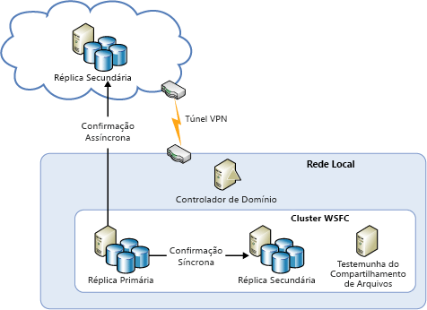
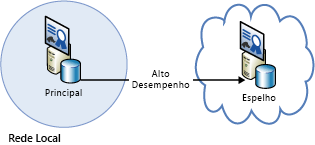
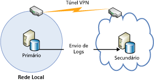
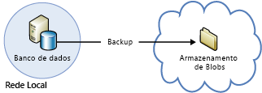

[!INCLUDE [header](../_includes/header.md)]

# Orientações técnicas de resiliência do Azure: recuperação do local para o AzureAzure resiliency technical guidance: Recovery from on-premises to Azure
O Azure fornece um conjunto abrangente de serviços para habilitar a extensão de um datacenter local para o Azure para fins de recuperação de desastre e alta disponibilidade:Azure provides a comprehensive set of services for enabling the extension of an on-premises datacenter to Azure for high availability and disaster recovery purposes:

* **Rede**: com uma rede virtual privada, você estende sua rede local com segurança à nuvem.**Networking**: With a virtual private network, you securely extend your on-premises network to the cloud.
* **Computação**: os clientes usando o Hyper-V local podem "trocar de posição" VMs (máquinas virtuais) existentes no Azure.**Compute**: Customers using Hyper-V on-premises can “lift and shift” existing virtual machines (VMs) to Azure.
* **Armazenamento**: o StorSimple estende o sistema de arquivos para o Armazenamento do Azure.**Storage**: StorSimple extends your file system to Azure Storage. O serviço de Backup do Azure fornece backup de arquivos e bancos de dados SQL no Armazenamento do Azure.The Azure Backup service provides backup for files and SQL databases to Azure Storage.
* **Replicação de banco de dados**: com Grupos de Disponibilidade do SQL Server 2014 (ou posterior), você pode implementar alta disponibilidade e recuperação de desastre para seus dados locais.**Database replication**: With SQL Server 2014 (or later) Availability Groups, you can implement high availability and disaster recovery for your on-premises data.

## RedeNetworking
Você pode usar a Rede Virtual do Azure para criar uma seção logicamente isolada no Azure e conectá-la com segurança ao datacenter local ou a um único computador cliente usando uma conexão IPsec.You can use Azure Virtual Network to create a logically isolated section in Azure and securely connect it to your on-premises datacenter or a single client machine by using an IPsec connection. Com a Rede Virtual, você pode tirar proveito da infraestrutura escalonável sob demanda no Azure enquanto fornece conectividade aos dados e aplicativos locais, incluindo sistemas em execução no Windows Server, mainframes e UNIX.With Virtual Network, you can take advantage of the scalable, on-demand infrastructure in Azure while providing connectivity to data and applications on-premises, including systems running on Windows Server, mainframes, and UNIX. Para obter mais informações, confira a [documentação de rede do Azure](/azure/virtual-network/virtual-networks-overview/) .See [Azure networking documentation](/azure/virtual-network/virtual-networks-overview/) for more information.

## ComputaçãoCompute
Se estiver usando o Hyper-V local, você poderá "trocar de posição" as máquinas virtuais existentes para o Azure e provedores de serviço que executam o Windows Server 2012 (ou posterior), sem fazer alterações na VM nem converter formatos de VM.If you're using Hyper-V on-premises, you can “lift and shift” existing virtual machines to Azure and service providers running Windows Server 2012 (or later), without making changes to the VM or converting VM formats. Para obter mais informações, consulte [Sobre discos e VHDs para máquinas virtuais do Azure](/azure/virtual-machines/virtual-machines-linux-about-disks-vhds/?toc=%2fazure%2fvirtual-machines%2flinux%2ftoc.json).For more information, see [About disks and VHDs for Azure virtual machines](/azure/virtual-machines/virtual-machines-linux-about-disks-vhds/?toc=%2fazure%2fvirtual-machines%2flinux%2ftoc.json).

## Azure Site RecoveryAzure Site Recovery
Caso você queira o DRaaS (recuperação de desastre como um serviço), o Azure oferece o [Azure Site Recovery](https://azure.microsoft.com/services/site-recovery/).If you want disaster recovery as a service (DRaaS), Azure provides [Azure Site Recovery](https://azure.microsoft.com/services/site-recovery/). O Azure Site Recovery oferece proteção abrangente para servidores VMware, Hyper-V e servidores físicos.Azure Site Recovery offers comprehensive protection for VMware, Hyper-V, and physical servers. Com o Azure Site Recovery, você pode usar outro servidor local ou o Azure como o site de recuperação.With Azure Site Recovery, you can use another on-premises server or Azure as your recovery site. Para obter mais informações sobre o Azure Site Recovery, confira a [documentação do Azure Site Recovery](https://azure.microsoft.com/documentation/services/site-recovery/).For more information on Azure Site Recovery, see the [Azure Site Recovery documentation](https://azure.microsoft.com/documentation/services/site-recovery/).

## ArmazenamentoStorage
Há várias opções para usar o Azure como um site de backup para dados locais.There are several options for using Azure as a backup site for on-premises data.

### StorSimpleStorSimple
O StorSimple integra com segurança e transparência o armazenamento em nuvem aos aplicativos locais.StorSimple securely and transparently integrates cloud storage for on-premises applications. Ele também oferece uma única solução que fornece armazenamento em nuvem e local hierárquico de alto desempenho, arquivamento dinâmico, proteção de dados baseada em nuvem e recuperação de desastre.It also offers a single appliance that delivers high-performance tiered local and cloud storage, live archiving, cloud-based data protection, and disaster recovery. Para obter mais informações, consulte a [página de produto do StorSimple](https://azure.microsoft.com/services/storsimple/).For more information, see the [StorSimple product page](https://azure.microsoft.com/services/storsimple/).

### Serviço de Backup do AzureAzure Backup
O Backup do Azure habilita backups de nuvem usando ferramentas familiares de backup no Windows Server 2012 (ou posterior), Windows Server 2012 Essentials (ou posterior) e System Center 2012 Data Protection Manager (ou posterior).Azure Backup enables cloud backups by using the familiar backup tools in Windows Server 2012 (or later), Windows Server 2012 Essentials (or later), and System Center 2012 Data Protection Manager (or later). Essas ferramentas fornecem um fluxo de trabalho para gerenciamento de backup que é independente do local de armazenamento dos backups, seja um disco local ou o Armazenamento do Azure.These tools provide a workflow for backup management that is independent of the storage location of the backups, whether a local disk or Azure Storage. Após realizar o backup dos dados para a nuvem, os usuários autorizados podem fazer facilmente a recuperação dos backups para qualquer servidor.After data is backed up to the cloud, authorized users can easily recover backups to any server.

Com os backups incrementais, somente as alterações feitas nos arquivos são transferidas para a nuvem.With incremental backups, only changes to files are transferred to the cloud. Isso ajuda a usar o espaço de armazenamento de modo eficiente, reduzir o consumo da largura de banda e dá suporte à recuperação pontual de várias versões dos dados.This helps to efficiently use storage space, reduce bandwidth consumption, and support point-in-time recovery of multiple versions of the data. Você também pode optar por usar recursos adicionais, como políticas de retenção de dados, a compactação de dados e limitação da transferência de dados.You can also choose to use additional features, such as data retention policies, data compression, and data transfer throttling. Usar o Azure como o local de backup tem a vantagem óbvia de que os backups são automaticamente "externos".Using Azure as the backup location has the obvious advantage that the backups are automatically “offsite”. Isso elimina os requisitos adicionais de proteger a mídia de backup no local.This eliminates the extra requirements to secure and protect on-site backup media.

Para obter mais informações, confira [O que é o Backup do Azure?](/azure/backup/backup-introduction-to-azure-backup/) e [Configurar o Backup do Azure para dados DPM](https://technet.microsoft.com/library/jj728752.aspx).For more information, see [What is Azure Backup?](/azure/backup/backup-introduction-to-azure-backup/) and [Configure Azure Backup for DPM data](https://technet.microsoft.com/library/jj728752.aspx).

## Banco de dadosDatabase
Você pode ter uma solução de recuperação de desastres para bancos de dados do SQL Server em um ambiente de TI híbrida, usando Grupos de disponibilidade AlwaysOn, espelhamento de banco de dados, envio de log e backup e restauração com o armazenamento de Blobs do Azure.You can have a disaster recovery solution for your SQL Server databases in a hybrid-IT environment by using AlwaysOn Availability Groups, database mirroring, log shipping, and backup and restore with Azure Blob storage. Todas essas soluções usam o SQL Server em execução em máquinas virtuais do Azure.All of these solutions use SQL Server running on Azure Virtual Machines.

Grupos de disponibilidade do AlwaysOn pode ser usados em um ambiente de TI híbrida, em que as réplicas de banco de dados existem localmente e na nuvem.AlwaysOn Availability Groups can be used in a hybrid-IT environment where database replicas exist both on-premises and in the cloud. Isso é mostrado no diagrama a seguir.This is shown in the following diagram.

O espelhamento de banco de dados também pode abranger servidores locais e a nuvem em uma configuração baseada em certificado.Database mirroring can also span on-premises servers and the cloud in a certificate-based setup. O diagrama a seguir ilustra esse conceito.The following diagram illustrates this concept.

O envio de log pode ser usado para sincronizar um banco de dados local com um banco de dados do SQL Server em uma máquina virtual do Azure.Log shipping can be used to synchronize an on-premises database with a SQL Server database in an Azure virtual machine.

Por fim, você pode fazer o backup de um banco de dados local diretamente para o Armazenamento de Blobs do Azure.Finally, you can back up an on-premises database directly to Azure Blob storage.

Para obter mais informações, confira [Alta disponibilidade e recuperação de desastre para o SQL Server em máquinas virtuais do Azure](/azure/virtual-machines/windows/sql/virtual-machines-windows-sql-high-availability-dr/) e [Backup e restauração para o SQL Server em máquinas virtuais do Azure](/azure/virtual-machines/windows/sql/virtual-machines-windows-sql-backup-recovery/).For more information, see [High availability and disaster recovery for SQL Server in Azure virtual machines](/azure/virtual-machines/windows/sql/virtual-machines-windows-sql-high-availability-dr/) and [Backup and restore for SQL Server in Azure virtual machines](/azure/virtual-machines/windows/sql/virtual-machines-windows-sql-backup-recovery/).

## Listas de verificação para recuperação local no Microsoft AzureChecklists for on-premises recovery in Microsoft Azure
### RedeNetworking
1. Examine a seção Rede deste documento.Review the Networking section of this document.
2. Usar a Rede Virtual para se conectar com segurança do local à nuvem.Use Virtual Network to securely connect on-premises to the cloud.

### ComputaçãoCompute
1. Examine a seção Computação deste documento.Review the Compute section of this document.
2. Realocar VMs entre o Hyper-V e o Azure.Relocate VMs between Hyper-V and Azure.

### ArmazenamentoStorage
1. Examinar a seção Armazenamento deste documento.Review the Storage section of this document.
2. Tirar proveito dos serviços do StorSimple para usar o armazenamento em nuvem.Take advantage of StorSimple services for using cloud storage.
3. Usar o serviço de Backup do Azure.Use the Azure Backup service.

### Banco de dadosDatabase
1. Examine a seção Banco de dados deste documento.Review the Database section of this document.
2. Considerar o uso do SQL Server em VMs do Azure como o backup.Consider using SQL Server on Azure VMs as the backup.
3. Configurar Grupos de Disponibilidade AlwaysOn.Set up AlwaysOn Availability Groups.
4. Configurar o espelhamento de banco de dados com base em certificado.Configure certificate-based database mirroring.
5. Usar o envio de logs.Use log shipping.
6. Fazer backup de bancos de dados locais para o armazenamento de Blobs do Azure.Back up on-premises databases to Azure Blob storage.

