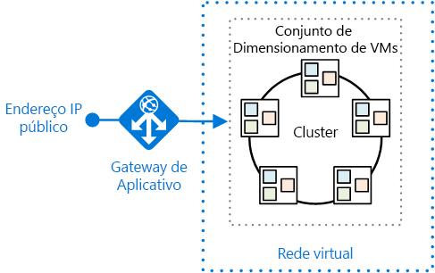
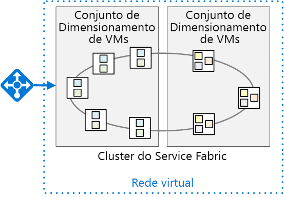

# <a name="migrate-an-azure-cloud-services-application-to-azure-service-fabric"></a><span data-ttu-id="28528-103">Migrar um aplicativo dos Serviços de Nuvem do Azure para o Azure Service Fabric</span><span class="sxs-lookup"><span data-stu-id="28528-103">Migrate an Azure Cloud Services application to Azure Service Fabric</span></span> 

<span data-ttu-id="28528-104">[Código de exemplo do ][sample-code]</span><span class="sxs-lookup"><span data-stu-id="28528-104">[ Sample code][sample-code]</span></span>

<span data-ttu-id="28528-105">Este artigo descreve a migração de um aplicativo dos Serviços de Nuvem do Azure para o Azure Service Fabric.</span><span class="sxs-lookup"><span data-stu-id="28528-105">This article describes migrating an application from Azure Cloud Services to Azure Service Fabric.</span></span> <span data-ttu-id="28528-106">Ele se concentra nas decisões de arquitetura e práticas recomendadas.</span><span class="sxs-lookup"><span data-stu-id="28528-106">It focuses on architectural decisions and recommended practices.</span></span> 

<span data-ttu-id="28528-107">Para este projeto, começamos com um aplicativo dos Serviços de Nuvem chamado Surveys e movido para o Service Fabric.</span><span class="sxs-lookup"><span data-stu-id="28528-107">For this project, we started with a Cloud Services application called Surveys and ported it to Service Fabric.</span></span> <span data-ttu-id="28528-108">A meta era migrar o aplicativo com o menor número de alterações possível.</span><span class="sxs-lookup"><span data-stu-id="28528-108">The goal was to migrate the application with as few changes as possible.</span></span> <span data-ttu-id="28528-109">Em um artigo posterior, vamos otimizar o aplicativo de Service Fabric adotando uma arquitetura de microsserviços.</span><span class="sxs-lookup"><span data-stu-id="28528-109">In a later article, we will optimize the application for Service Fabric by adopting a microservices architecture.</span></span>

<span data-ttu-id="28528-110">Antes de ler este artigo, será útil entender os conceitos básicos de Service Fabric e arquiteturas de microsserviços em geral.</span><span class="sxs-lookup"><span data-stu-id="28528-110">Before reading this article, it will be useful to understand the basics of Service Fabric and microservices architectures in general.</span></span> <span data-ttu-id="28528-111">Confira os seguintes artigos:</span><span class="sxs-lookup"><span data-stu-id="28528-111">See the following articles:</span></span>

- <span data-ttu-id="28528-112">[Visão geral do Azure Service Fabric][sf-overview]</span><span class="sxs-lookup"><span data-stu-id="28528-112">[Overview of Azure Service Fabric][sf-overview]</span></span>
- <span data-ttu-id="28528-113">[Por que usar uma abordagem de microsserviço para construir aplicativos?][sf-why-microservices]</span><span class="sxs-lookup"><span data-stu-id="28528-113">[Why a microservices approach to building applications?][sf-why-microservices]</span></span>


## <a name="about-the-surveys-application"></a><span data-ttu-id="28528-114">Sobre o aplicativo Surveys</span><span class="sxs-lookup"><span data-stu-id="28528-114">About the Surveys application</span></span>

<span data-ttu-id="28528-115">Em 2012, o grupo de padrões e práticas criou um aplicativo chamado Surveys, para um catálogo chamado [Desenvolvimento de aplicativos multilocatários para a nuvem][tailspin-book].</span><span class="sxs-lookup"><span data-stu-id="28528-115">In 2012, the patterns & practices group created an application called Surveys, for a book called [Developing Multi-tenant Applications for the Cloud][tailspin-book].</span></span> <span data-ttu-id="28528-116">O catálogo descreve uma empresa fictícia chamada Tailspin que projeta e implementa o aplicativo Surveys.</span><span class="sxs-lookup"><span data-stu-id="28528-116">The book describes a fictitious company named Tailspin that designs and implements the Surveys application.</span></span>

<span data-ttu-id="28528-117">O Surveys é um aplicativo multilocatário que permite que os clientes criem pesquisas.</span><span class="sxs-lookup"><span data-stu-id="28528-117">Surveys is a multitenant application that allows customers to create surveys.</span></span> <span data-ttu-id="28528-118">Depois que um cliente se inscreve para o aplicativo, os membros da organização do cliente podem criar e publicar pesquisas e coletar os resultados para análise.</span><span class="sxs-lookup"><span data-stu-id="28528-118">After a customer signs up for the application,  members of the customer's organization can create and publish surveys, and collect the results for analysis.</span></span> <span data-ttu-id="28528-119">O aplicativo inclui um site público em que as pessoas podem realizar uma pesquisa.</span><span class="sxs-lookup"><span data-stu-id="28528-119">The application includes a public website where people can take a survey.</span></span> <span data-ttu-id="28528-120">Leia mais sobre o cenário original da Tailspin [aqui][tailspin-scenario].</span><span class="sxs-lookup"><span data-stu-id="28528-120">Read more about the original Tailspin scenario [here][tailspin-scenario].</span></span>

<span data-ttu-id="28528-121">Agora a Tailspin deseja mover o aplicativo de Surveys para uma arquitetura de microsserviços, usando o Service Fabric em execução no Azure.</span><span class="sxs-lookup"><span data-stu-id="28528-121">Now Tailspin wants to move the Surveys application to a microservices architecture, using Service Fabric running on Azure.</span></span> <span data-ttu-id="28528-122">Como o aplicativo já estava implantado como aplicativo de Serviços de Nuvem, a Tailspin adota uma abordagem de várias fases:</span><span class="sxs-lookup"><span data-stu-id="28528-122">Because the application is already deployed as a Cloud Services application, Tailspin adopts a multi-phase approach:</span></span>

1.  <span data-ttu-id="28528-123">Portar os serviços de nuvem para o Service Fabric, enquanto minimiza as alterações do aplicativo.</span><span class="sxs-lookup"><span data-stu-id="28528-123">Port the cloud services to Service Fabric, while minimizing changes to the application.</span></span>
2.  <span data-ttu-id="28528-124">Otimizar o aplicativo de Service Fabric movendo para uma arquitetura de microsserviços.</span><span class="sxs-lookup"><span data-stu-id="28528-124">Optimize the application for Service Fabric, by moving to a microservices architecture.</span></span>

<span data-ttu-id="28528-125">Este artigo descreve a primeira fase.</span><span class="sxs-lookup"><span data-stu-id="28528-125">This article describes the first phase.</span></span> <span data-ttu-id="28528-126">Um artigo posterior descreverá a segunda fase.</span><span class="sxs-lookup"><span data-stu-id="28528-126">A later article will describe the second phase.</span></span> <span data-ttu-id="28528-127">Em um projeto do mundo real, é provável que os dois estágios sobreponham-se.</span><span class="sxs-lookup"><span data-stu-id="28528-127">In a real-world project, it's likely that both stages would overlap.</span></span> <span data-ttu-id="28528-128">Ao portar para o Service Fabric, você também precisaria começar a refazer a arquitetura do aplicativo em microsserviços.</span><span class="sxs-lookup"><span data-stu-id="28528-128">While porting to Service Fabric, you would also start to re-architect the application into micro-services.</span></span> <span data-ttu-id="28528-129">Mais tarde, você pode refinar a arquitetura ainda mais, talvez dividindo os serviços de alta granularidade em serviços menores.</span><span class="sxs-lookup"><span data-stu-id="28528-129">Later you might refine the architecture further, perhaps dividing coarse-grained services into smaller services.</span></span>  

<span data-ttu-id="28528-130">O código do aplicativo está disponível no [GitHub][sample-code].</span><span class="sxs-lookup"><span data-stu-id="28528-130">The application code is available on [GitHub][sample-code].</span></span> <span data-ttu-id="28528-131">Este repositório contém o aplicativo de Serviços de Nuvem e a versão do Service Fabric.</span><span class="sxs-lookup"><span data-stu-id="28528-131">This repo contains both the Cloud Services application and the Service Fabric version.</span></span> 

> <span data-ttu-id="28528-132">O serviço de nuvem é uma versão atualizada do aplicativo original do catálogo *Desenvolvimento de aplicativos multilocatários*.</span><span class="sxs-lookup"><span data-stu-id="28528-132">The cloud service is an updated version of the original application from the *Developing Multi-tenant Applications* book.</span></span>

## <a name="why-microservices"></a><span data-ttu-id="28528-133">Por que os microsserviços?</span><span class="sxs-lookup"><span data-stu-id="28528-133">Why Microservices?</span></span>

<span data-ttu-id="28528-134">Uma discussão detalhada sobre microsserviços está além do escopo deste artigo, mas aqui estão alguns dos benefícios que a Tailspin espera obter movendo para uma arquitetura de microsserviços:</span><span class="sxs-lookup"><span data-stu-id="28528-134">An in-depth discussion of microservices is beyond scope of this article, but here are some of the benefits that Tailspin hopes to get by moving to a microservices architecture:</span></span>

- <span data-ttu-id="28528-135">**Atualizações de aplicativo**.</span><span class="sxs-lookup"><span data-stu-id="28528-135">**Application upgrades**.</span></span> <span data-ttu-id="28528-136">Os serviços podem ser implantados independentemente, portanto você pode adotar uma abordagem incremental para atualizar um aplicativo.</span><span class="sxs-lookup"><span data-stu-id="28528-136">Services can be deployed independently, so you can take an incremental approach to upgrading an application.</span></span>
- <span data-ttu-id="28528-137">**Resiliência e isolamento a falhas**.</span><span class="sxs-lookup"><span data-stu-id="28528-137">**Resiliency and fault isolation**.</span></span> <span data-ttu-id="28528-138">Se um serviço falhar, outros serviços continuam sendo executados.</span><span class="sxs-lookup"><span data-stu-id="28528-138">If a service fails, other services continue to run.</span></span>
- <span data-ttu-id="28528-139">**Escalabilidade**.</span><span class="sxs-lookup"><span data-stu-id="28528-139">**Scalability**.</span></span> <span data-ttu-id="28528-140">Os serviços podem ser dimensionados de maneira independente.</span><span class="sxs-lookup"><span data-stu-id="28528-140">Services can be scaled independently.</span></span>
- <span data-ttu-id="28528-141">**Flexibilidade**.</span><span class="sxs-lookup"><span data-stu-id="28528-141">**Flexibility**.</span></span> <span data-ttu-id="28528-142">Os serviços são projetados em relação a cenários de negócios, não pilhas de tecnologia, tornando mais fácil migrar os serviços aos novos repositórios de dados, estruturas ou tecnologias.</span><span class="sxs-lookup"><span data-stu-id="28528-142">Services are designed around business scenarios, not technology stacks, making it easier to migrate services to new technologies, frameworks, or data stores.</span></span>
- <span data-ttu-id="28528-143">**Desenvolvimento Agile**.</span><span class="sxs-lookup"><span data-stu-id="28528-143">**Agile development**.</span></span> <span data-ttu-id="28528-144">Serviços individuais têm menos código do que um aplicativo monolítico, tornando o código base mais fácil de entender, raciocinar sobre e testar.</span><span class="sxs-lookup"><span data-stu-id="28528-144">Individual services have less code than a monolithic application, making the code base easier to understand, reason about, and test.</span></span>
- <span data-ttu-id="28528-145">**Equipes pequenas e focadas**.</span><span class="sxs-lookup"><span data-stu-id="28528-145">**Small, focused teams**.</span></span> <span data-ttu-id="28528-146">Porque o aplicativo é dividido em vários serviços pequenos, podendo cada um deles ser criado por uma equipe pequena e focada.</span><span class="sxs-lookup"><span data-stu-id="28528-146">Because the application is broken down into many small services, each service can be built by a small focused team.</span></span>

## <a name="why-service-fabric"></a><span data-ttu-id="28528-147">Por que Service Fabric?</span><span class="sxs-lookup"><span data-stu-id="28528-147">Why Service Fabric?</span></span>
      
<span data-ttu-id="28528-148">O Service Fabric é uma boa opção para uma arquitetura de microsserviços, porque a maioria dos recursos necessários em um sistema distribuído é incorporada ao Service Fabric, incluindo:</span><span class="sxs-lookup"><span data-stu-id="28528-148">Service Fabric is a good fit for a microservices architecture, because most of the features needed in a distributed system are built into Service Fabric, including:</span></span>

- <span data-ttu-id="28528-149">**Gerenciamento de clusters**.</span><span class="sxs-lookup"><span data-stu-id="28528-149">**Cluster management**.</span></span> <span data-ttu-id="28528-150">O Service Fabric controla automaticamente o failover de nó, o monitoramento de integridade e outras funções de gerenciamento de clusters.</span><span class="sxs-lookup"><span data-stu-id="28528-150">Service Fabric automatically handles node failover, health monitoring, and other cluster management functions.</span></span>
- <span data-ttu-id="28528-151">**Dimensionamento em escala horizontal**.</span><span class="sxs-lookup"><span data-stu-id="28528-151">**Horizontal scaling**.</span></span> <span data-ttu-id="28528-152">Quando você adicionar nós a um cluster do Service Fabric, o aplicativo dimensionará automaticamente, pois os serviços são distribuídos entre os novos nós.</span><span class="sxs-lookup"><span data-stu-id="28528-152">When you add nodes to a Service Fabric cluster, the application automatically scales, as services are distributed across the new nodes.</span></span>
- <span data-ttu-id="28528-153">**Descoberta de serviço**.</span><span class="sxs-lookup"><span data-stu-id="28528-153">**Service discovery**.</span></span> <span data-ttu-id="28528-154">O Service Fabric fornece um serviço de descoberta que pode resolver o ponto de extremidade para um serviço nomeado.</span><span class="sxs-lookup"><span data-stu-id="28528-154">Service Fabric provides a discovery service that can resolve the endpoint for a named service.</span></span>
- <span data-ttu-id="28528-155">**Serviços com e sem estado**.</span><span class="sxs-lookup"><span data-stu-id="28528-155">**Stateless and stateful services**.</span></span> <span data-ttu-id="28528-156">Os serviços com estado usam [coleções confiáveis][sf-reliable-collections], que podem assumir o lugar de um cache ou fila, e podem ser particionados.</span><span class="sxs-lookup"><span data-stu-id="28528-156">Stateful services use [reliable collections][sf-reliable-collections], which can take the place of a cache or queue, and can be partitioned.</span></span>
- <span data-ttu-id="28528-157">**Gerenciamento do ciclo de vida de aplicativos**.</span><span class="sxs-lookup"><span data-stu-id="28528-157">**Application lifecycle management**.</span></span> <span data-ttu-id="28528-158">Os serviços podem ser atualizados independentemente e sem tempo de inatividade do aplicativo.</span><span class="sxs-lookup"><span data-stu-id="28528-158">Services can be upgraded independently and without application downtime.</span></span>
- <span data-ttu-id="28528-159">**Orquestração de serviço** em um cluster de computadores.</span><span class="sxs-lookup"><span data-stu-id="28528-159">**Service orchestration** across a cluster of machines.</span></span>
- <span data-ttu-id="28528-160">**Maior densidade** para otimizar o consumo de recursos.</span><span class="sxs-lookup"><span data-stu-id="28528-160">**Higher density** for optimizing resource consumption.</span></span> <span data-ttu-id="28528-161">Um único nó pode hospedar vários serviços.</span><span class="sxs-lookup"><span data-stu-id="28528-161">A single node can host multiple services.</span></span>

<span data-ttu-id="28528-162">O Service Fabric é usado por vários serviços da Microsoft, incluindo o banco de dados SQL do Azure, Cosmos DB, Hubs de Eventos do Azure, entre outros, tornando-o uma plataforma comprovada para criar aplicativos distribuídos de nuvem.</span><span class="sxs-lookup"><span data-stu-id="28528-162">Service Fabric is used by various Microsoft services, including Azure SQL Database, Cosmos DB, Azure Event Hubs, and others, making it a proven platform for building distributed cloud applications.</span></span> 

## <a name="comparing-cloud-services-with-service-fabric"></a><span data-ttu-id="28528-163">Comparar os Serviços de Nuvem com o Service Fabric</span><span class="sxs-lookup"><span data-stu-id="28528-163">Comparing Cloud Services with Service Fabric</span></span>

<span data-ttu-id="28528-164">A tabela a seguir resume algumas das diferenças importantes entre os Serviços de Nuvem e aplicativos do Service Fabric.</span><span class="sxs-lookup"><span data-stu-id="28528-164">The following table summarizes some of the important differences between Cloud Services and Service Fabric applications.</span></span> <span data-ttu-id="28528-165">Para uma discussão mais detalhada, consulte [Saiba mais sobre as diferenças entre os Serviços de Nuvem e o Service Fabric antes de migrar os aplicativos][sf-compare-cloud-services].</span><span class="sxs-lookup"><span data-stu-id="28528-165">For a more in-depth discussion, see [Learn about the differences between Cloud Services and Service Fabric before migrating applications][sf-compare-cloud-services].</span></span>

|        | <span data-ttu-id="28528-166">Serviços de Nuvem</span><span class="sxs-lookup"><span data-stu-id="28528-166">Cloud Services</span></span> | <span data-ttu-id="28528-167">Service Fabric</span><span class="sxs-lookup"><span data-stu-id="28528-167">Service Fabric</span></span> |
|--------|---------------|----------------|
| <span data-ttu-id="28528-168">Composição de aplicativos</span><span class="sxs-lookup"><span data-stu-id="28528-168">Application composition</span></span> | <span data-ttu-id="28528-169">Funções</span><span class="sxs-lookup"><span data-stu-id="28528-169">Roles</span></span>| <span data-ttu-id="28528-170">Serviços</span><span class="sxs-lookup"><span data-stu-id="28528-170">Services</span></span> |
| <span data-ttu-id="28528-171">Densidade</span><span class="sxs-lookup"><span data-stu-id="28528-171">Density</span></span> |<span data-ttu-id="28528-172">Uma instância de função por VM</span><span class="sxs-lookup"><span data-stu-id="28528-172">One role instance per VM</span></span> | <span data-ttu-id="28528-173">Vários serviços em um único nó</span><span class="sxs-lookup"><span data-stu-id="28528-173">Multiple services in a single node</span></span> |
| <span data-ttu-id="28528-174">Número mínimo de nós</span><span class="sxs-lookup"><span data-stu-id="28528-174">Minimum number of nodes</span></span> | <span data-ttu-id="28528-175">2 por função</span><span class="sxs-lookup"><span data-stu-id="28528-175">2 per role</span></span> | <span data-ttu-id="28528-176">5 por cluster, para implantações de produção</span><span class="sxs-lookup"><span data-stu-id="28528-176">5 per cluster, for production deployments</span></span> |
| <span data-ttu-id="28528-177">Gerenciamento de estado</span><span class="sxs-lookup"><span data-stu-id="28528-177">State management</span></span> | <span data-ttu-id="28528-178">Sem estado</span><span class="sxs-lookup"><span data-stu-id="28528-178">Stateless</span></span> | <span data-ttu-id="28528-179">Sem estado ou com estado*</span><span class="sxs-lookup"><span data-stu-id="28528-179">Stateless or stateful*</span></span> |
| <span data-ttu-id="28528-180">Hosting</span><span class="sxs-lookup"><span data-stu-id="28528-180">Hosting</span></span> | <span data-ttu-id="28528-181">As tabelas</span><span class="sxs-lookup"><span data-stu-id="28528-181">Azure</span></span> | <span data-ttu-id="28528-182">Em nuvem ou local</span><span class="sxs-lookup"><span data-stu-id="28528-182">Cloud or on-premises</span></span> |
| <span data-ttu-id="28528-183">Hospedagem na Web</span><span class="sxs-lookup"><span data-stu-id="28528-183">Web hosting</span></span> | <span data-ttu-id="28528-184">IIS**</span><span class="sxs-lookup"><span data-stu-id="28528-184">IIS**</span></span> | <span data-ttu-id="28528-185">Hospedagem interna</span><span class="sxs-lookup"><span data-stu-id="28528-185">Self-hosting</span></span> |
| <span data-ttu-id="28528-186">Modelo de implantação</span><span class="sxs-lookup"><span data-stu-id="28528-186">Deployment model</span></span> | <span data-ttu-id="28528-187">[Modelo de implantação clássico][azure-deployment-models]</span><span class="sxs-lookup"><span data-stu-id="28528-187">[Classic deployment model][azure-deployment-models]</span></span> | <span data-ttu-id="28528-188">[Gerenciador de Recursos][azure-deployment-models]</span><span class="sxs-lookup"><span data-stu-id="28528-188">[Resource Manager][azure-deployment-models]</span></span>  |
| <span data-ttu-id="28528-189">Empacotamento</span><span class="sxs-lookup"><span data-stu-id="28528-189">Packaging</span></span> | <span data-ttu-id="28528-190">Arquivos de pacote de serviço de nuvem (.cspkg)</span><span class="sxs-lookup"><span data-stu-id="28528-190">Cloud service package files (.cspkg)</span></span> | <span data-ttu-id="28528-191">Aplicativo e pacotes de serviço</span><span class="sxs-lookup"><span data-stu-id="28528-191">Application and service packages</span></span> |
| <span data-ttu-id="28528-192">Atualização do aplicativo</span><span class="sxs-lookup"><span data-stu-id="28528-192">Application update</span></span> | <span data-ttu-id="28528-193">Troca VIP ou atualização sem interrupção</span><span class="sxs-lookup"><span data-stu-id="28528-193">VIP swap or rolling update</span></span> | <span data-ttu-id="28528-194">Atualização sem interrupção</span><span class="sxs-lookup"><span data-stu-id="28528-194">Rolling update</span></span> |
| <span data-ttu-id="28528-195">Dimensionamento automático</span><span class="sxs-lookup"><span data-stu-id="28528-195">Auto-scaling</span></span> | <span data-ttu-id="28528-196">[Serviço interno][cloud-service-autoscale]</span><span class="sxs-lookup"><span data-stu-id="28528-196">[Built-in service][cloud-service-autoscale]</span></span> | <span data-ttu-id="28528-197">Conjuntos de Dimensionamento de VM para dimensionamento automático</span><span class="sxs-lookup"><span data-stu-id="28528-197">VM Scale Sets for auto scale out</span></span> |
| <span data-ttu-id="28528-198">Depurando</span><span class="sxs-lookup"><span data-stu-id="28528-198">Debugging</span></span> | <span data-ttu-id="28528-199">Emulador local</span><span class="sxs-lookup"><span data-stu-id="28528-199">Local emulator</span></span> | <span data-ttu-id="28528-200">Cluster local</span><span class="sxs-lookup"><span data-stu-id="28528-200">Local cluster</span></span> |


<span data-ttu-id="28528-201">\*Os serviços com estado usam [coleções confiáveis][sf-reliable-collections] para armazenar o estado entre réplicas, para que todas as leituras sejam locais aos nós no cluster.</span><span class="sxs-lookup"><span data-stu-id="28528-201">\* Stateful services use [reliable collections][sf-reliable-collections] to store state across replicas, so that all reads are local to the nodes in the cluster.</span></span> <span data-ttu-id="28528-202">As gravações são replicadas em nós para confiabilidade.</span><span class="sxs-lookup"><span data-stu-id="28528-202">Writes are replicated across nodes for reliability.</span></span> <span data-ttu-id="28528-203">Os serviços sem estado podem ter estado externo, usando um banco de dados ou outro armazenamento externo.</span><span class="sxs-lookup"><span data-stu-id="28528-203">Stateless services can have external state, using a database or other external storage.</span></span>

<span data-ttu-id="28528-204">** Funções de trabalho também podem hospedar automaticamente a API Web ASP.NET usando o OWIN.</span><span class="sxs-lookup"><span data-stu-id="28528-204">** Worker roles can also self-host ASP.NET Web API using OWIN.</span></span>

## <a name="the-surveys-application-on-cloud-services"></a><span data-ttu-id="28528-205">O aplicativo Surveys nos Serviços de Nuvem</span><span class="sxs-lookup"><span data-stu-id="28528-205">The Surveys application on Cloud Services</span></span>

<span data-ttu-id="28528-206">O diagrama a seguir mostra a arquitetura do aplicativo Surveys em execução nos Serviços de Nuvem.</span><span class="sxs-lookup"><span data-stu-id="28528-206">The following diagram shows the architecture of the Surveys application running on Cloud Services.</span></span> 


<span data-ttu-id="28528-207">O aplicativo consiste em duas funções web e uma função de trabalho.</span><span class="sxs-lookup"><span data-stu-id="28528-207">The application consists of two web roles and a worker role.</span></span>

- <span data-ttu-id="28528-208">A função web **Tailspin.Web** hospeda um site ASP.NET que clientes da Tailspin usam para criar e gerenciar pesquisas.</span><span class="sxs-lookup"><span data-stu-id="28528-208">The **Tailspin.Web** web role hosts an ASP.NET website that Tailspin customers use to create and manage surveys.</span></span> <span data-ttu-id="28528-209">Os clientes também usam esse site para se inscrever para o aplicativo e gerenciar suas assinaturas.</span><span class="sxs-lookup"><span data-stu-id="28528-209">Customers also use this website to sign up for the application and manage their subscriptions.</span></span> <span data-ttu-id="28528-210">Por fim, os administradores da Tailspin podem usá-lo para ver a lista de locatários e gerenciar dados de locatário.</span><span class="sxs-lookup"><span data-stu-id="28528-210">Finally, Tailspin administrators can use it to see the list of tenants and manage tenant data.</span></span> 

- <span data-ttu-id="28528-211">A função web **Tailspin.Web.Survey.Public** hospeda um site ASP.NET no qual as pessoas podem obter as pesquisas que clientes da Tailspin publicam.</span><span class="sxs-lookup"><span data-stu-id="28528-211">The **Tailspin.Web.Survey.Public** web role hosts an ASP.NET website where people can take the surveys that Tailspin customers publish.</span></span> 

- <span data-ttu-id="28528-212">A função de trabalho **Tailspin.Workers.Survey** realiza processamento em segundo plano.</span><span class="sxs-lookup"><span data-stu-id="28528-212">The **Tailspin.Workers.Survey** worker role does background processing.</span></span> <span data-ttu-id="28528-213">As funções web colocam itens de trabalho em uma fila e, em seguida, a função de trabalho processa os itens.</span><span class="sxs-lookup"><span data-stu-id="28528-213">The web roles put work items onto a queue, and the worker role processes the items.</span></span> <span data-ttu-id="28528-214">Duas tarefas em segundo plano são definidas: exportar respostas da pesquisa para o banco de dados SQL do Azure e calcular estatísticas referentes às respostas de pesquisa.</span><span class="sxs-lookup"><span data-stu-id="28528-214">Two background tasks are defined: Exporting survey answers to Azure SQL Database, and calculating statistics for survey answers.</span></span>

<span data-ttu-id="28528-215">Além dos Serviços de Nuvem, o aplicativo de pesquisas usa alguns outros serviços do Azure:</span><span class="sxs-lookup"><span data-stu-id="28528-215">In addition to Cloud Services, the Surveys application uses some other Azure services:</span></span>

- <span data-ttu-id="28528-216">**Armazenamento do Azure** para armazenar pesquisas, respostas de pesquisas e informações de locatário.</span><span class="sxs-lookup"><span data-stu-id="28528-216">**Azure Storage** to store surveys, surveys answers, and tenant information.</span></span>

- <span data-ttu-id="28528-217">**Cache Redis do Azure** para armazenar em cache alguns dos dados que são armazenados no Armazenamento do Azure, para acesso de leitura mais rápido.</span><span class="sxs-lookup"><span data-stu-id="28528-217">**Azure Redis Cache** to cache some of the data that is stored in Azure Storage, for faster read access.</span></span> 

- <span data-ttu-id="28528-218">**Azure Active Directory** (Azure AD) para autenticar clientes e administradores da Tailspin.</span><span class="sxs-lookup"><span data-stu-id="28528-218">**Azure Active Directory** (Azure AD) to authenticate customers and Tailspin administrators.</span></span>

- <span data-ttu-id="28528-219">**Banco de dados SQL do Azure** para armazenar as respostas da pesquisa para análise.</span><span class="sxs-lookup"><span data-stu-id="28528-219">**Azure SQL Database** to store the survey answers for analysis.</span></span> 

## <a name="moving-to-service-fabric"></a><span data-ttu-id="28528-220">Mover para o Service Fabric</span><span class="sxs-lookup"><span data-stu-id="28528-220">Moving to Service Fabric</span></span>

<span data-ttu-id="28528-221">Conforme mencionado, o objetivo dessa fase foi migrar para o Service Fabric com as mínimas alterações necessárias.</span><span class="sxs-lookup"><span data-stu-id="28528-221">As mentioned, the goal of this phase was migrating to Service Fabric with the minimum necessary changes.</span></span> <span data-ttu-id="28528-222">Para esse fim, criamos serviços sem estado correspondentes a cada função de serviço de nuvem no aplicativo original:</span><span class="sxs-lookup"><span data-stu-id="28528-222">To that end, we created stateless services corresponding to each cloud service role in the original application:</span></span>


<span data-ttu-id="28528-223">Intencionalmente, essa arquitetura é muito semelhante ao aplicativo original.</span><span class="sxs-lookup"><span data-stu-id="28528-223">Intentionally, this architecture is very similar to the original application.</span></span> <span data-ttu-id="28528-224">No entanto, o diagrama oculta algumas diferenças importantes.</span><span class="sxs-lookup"><span data-stu-id="28528-224">However, the diagram hides some important differences.</span></span> <span data-ttu-id="28528-225">No restante deste artigo, vamos explorar essas diferenças.</span><span class="sxs-lookup"><span data-stu-id="28528-225">In the rest of this article, we'll explore those differences.</span></span> 


## <a name="converting-the-cloud-service-roles-to-services"></a><span data-ttu-id="28528-226">Converter as funções de serviço de nuvem para serviços</span><span class="sxs-lookup"><span data-stu-id="28528-226">Converting the cloud service roles to services</span></span>

<span data-ttu-id="28528-227">Conforme mencionado, migramos cada função de serviço de nuvem para um serviço do Service Fabric.</span><span class="sxs-lookup"><span data-stu-id="28528-227">As mentioned, we migrated each cloud service role to a Service Fabric service.</span></span> <span data-ttu-id="28528-228">Como as funções de serviço de nuvem são sem estado, para essa fase, fazia sentido criar serviços sem estado no Service Fabric.</span><span class="sxs-lookup"><span data-stu-id="28528-228">Because cloud service roles are stateless, for this phase it made sense to create stateless services in Service Fabric.</span></span> 

<span data-ttu-id="28528-229">Para a migração, seguimos as etapas descritas em [Guia para converter Funções Web e de Trabalho em serviços sem estado do Service Fabric][sf-migration].</span><span class="sxs-lookup"><span data-stu-id="28528-229">For the migration, we followed the steps outlined in [Guide to converting Web and Worker Roles to Service Fabric stateless services][sf-migration].</span></span> 

### <a name="creating-the-web-front-end-services"></a><span data-ttu-id="28528-230">Criar serviços de front-end da web</span><span class="sxs-lookup"><span data-stu-id="28528-230">Creating the web front-end services</span></span>

<span data-ttu-id="28528-231">No Service Fabric, um serviço é executado dentro de um processo criado pelo tempo de execução do Service Fabric.</span><span class="sxs-lookup"><span data-stu-id="28528-231">In Service Fabric, a service runs inside a process created by the Service Fabric runtime.</span></span> <span data-ttu-id="28528-232">Para um front-end da web, isso significa que o serviço não está em execução dentro do IIS.</span><span class="sxs-lookup"><span data-stu-id="28528-232">For a web front end, that means the service is not running inside IIS.</span></span> <span data-ttu-id="28528-233">Em vez disso, o serviço deve hospedar um servidor web.</span><span class="sxs-lookup"><span data-stu-id="28528-233">Instead, the service must host a web server.</span></span> <span data-ttu-id="28528-234">Essa abordagem é chamada *hospedagem interna*, porque o código que é executado dentro do processo funciona como host do servidor web.</span><span class="sxs-lookup"><span data-stu-id="28528-234">This approach is called *self-hosting*, because the code that runs inside the process acts as the web server host.</span></span> 

<span data-ttu-id="28528-235">O requisito para hospedar internamente significa que um serviço do Service Fabric não pode usar o ASP.NET MVC ou Web Forms do ASP.NET, porque essas estruturas requerem o IIS e não são compatíveis com hospedagem interna.</span><span class="sxs-lookup"><span data-stu-id="28528-235">The requirement to self-host means that a Service Fabric service can't use ASP.NET MVC or ASP.NET Web Forms, because those frameworks require IIS and do not support self-hosting.</span></span> <span data-ttu-id="28528-236">As opções para hospedagem interna incluem:</span><span class="sxs-lookup"><span data-stu-id="28528-236">Options for self-hosting include:</span></span>

- <span data-ttu-id="28528-237">[ASP.NET Core][aspnet-core], hospedado internamente usando o servidor web [Kestrel][kestrel].</span><span class="sxs-lookup"><span data-stu-id="28528-237">[ASP.NET Core][aspnet-core], self-hosted using the [Kestrel][kestrel] web server.</span></span> 
- <span data-ttu-id="28528-238">[API Web ASP.NET][aspnet-webapi], hospedada internamente usando [OWIN][owin].</span><span class="sxs-lookup"><span data-stu-id="28528-238">[ASP.NET Web API][aspnet-webapi], self-hosted using [OWIN][owin].</span></span>
- <span data-ttu-id="28528-239">Estruturas de terceiros, como [Nancy](http://nancyfx.org/).</span><span class="sxs-lookup"><span data-stu-id="28528-239">Third-party frameworks such as [Nancy](http://nancyfx.org/).</span></span>

<span data-ttu-id="28528-240">O aplicativo Surveys original usa ASP.NET MVC.</span><span class="sxs-lookup"><span data-stu-id="28528-240">The original Surveys application uses ASP.NET MVC.</span></span> <span data-ttu-id="28528-241">Como o ASP.NET MVC não pode ser hospedado internamente no Service Fabric, consideramos as seguintes opções de migração:</span><span class="sxs-lookup"><span data-stu-id="28528-241">Because ASP.NET MVC cannot be self-hosted in Service Fabric, we considered the following migration options:</span></span>

- <span data-ttu-id="28528-242">As funções da web do ASP.NET Core, que podem ser hospedadas internamente.</span><span class="sxs-lookup"><span data-stu-id="28528-242">Port the web roles to ASP.NET Core, which can be self-hosted.</span></span>
- <span data-ttu-id="28528-243">Converter o site da web em um aplicativo de página única (SPA) que chama uma API web implementada usando a API Web ASP.NET.</span><span class="sxs-lookup"><span data-stu-id="28528-243">Convert the web site into a single-page application (SPA) that calls a web API implemented using ASP.NET Web API.</span></span> <span data-ttu-id="28528-244">Isso exigiria remodelar completamente o front-end da web.</span><span class="sxs-lookup"><span data-stu-id="28528-244">This would have required a complete redesign of the web front end.</span></span>
- <span data-ttu-id="28528-245">Manter o código existente do ASP.NET MVC e implantar o IIS em um contêiner do Windows Server para Service Fabric.</span><span class="sxs-lookup"><span data-stu-id="28528-245">Keep the existing ASP.NET MVC code and deploy IIS in a Windows Server container to Service Fabric.</span></span> <span data-ttu-id="28528-246">Essa abordagem requer pouca ou nenhuma alteração de código.</span><span class="sxs-lookup"><span data-stu-id="28528-246">This approach would require little or no code change.</span></span> <span data-ttu-id="28528-247">No entanto, o [suporte a contêineres][sf-containers] no Service Fabric ainda está na versão prévia.</span><span class="sxs-lookup"><span data-stu-id="28528-247">However, [container support][sf-containers] in Service Fabric is currently still in preview.</span></span>

<span data-ttu-id="28528-248">Com base nessas considerações, selecionamos a primeira opção, portando para ASP.NET Core.</span><span class="sxs-lookup"><span data-stu-id="28528-248">Based on these considerations, we selected the first option, porting to ASP.NET Core.</span></span> <span data-ttu-id="28528-249">Para fazer isso, seguimos as etapas descritas em [Migrar do ASP.NET MVC para ASP.NET Core MVC][aspnet-migration].</span><span class="sxs-lookup"><span data-stu-id="28528-249">To do so, we followed the steps described in [Migrating From ASP.NET MVC to ASP.NET Core MVC][aspnet-migration].</span></span> 

> [!NOTE]
> <span data-ttu-id="28528-250">Ao usar o ASP.NET Core com Kestrel, você deve colocar um proxy reverso na frente do Kestrel para lidar com o tráfego da Internet, por motivos de segurança.</span><span class="sxs-lookup"><span data-stu-id="28528-250">When using ASP.NET Core with Kestrel, you should place a reverse proxy in front of Kestrel to handle traffic from the Internet, for security reasons.</span></span> <span data-ttu-id="28528-251">Para obter mais informações, consulte [Implementação do servidor web Kestrel no ASP.NET Core][kestrel].</span><span class="sxs-lookup"><span data-stu-id="28528-251">For more information, see [Kestrel web server implementation in ASP.NET Core][kestrel].</span></span> <span data-ttu-id="28528-252">A seção [Implantar o aplicativo](#deploying-the-application) descreve uma implantação recomendada do Azure.</span><span class="sxs-lookup"><span data-stu-id="28528-252">The section [Deploying the application](#deploying-the-application) describes a recommended Azure deployment.</span></span>

### <a name="http-listeners"></a><span data-ttu-id="28528-253">Ouvintes HTTP</span><span class="sxs-lookup"><span data-stu-id="28528-253">HTTP listeners</span></span>

<span data-ttu-id="28528-254">Em Serviços de Nuvem, uma função web ou de trabalho expõe um ponto de extremidade HTTP declarando-o no [arquivo de definição de serviço][cloud-service-endpoints].</span><span class="sxs-lookup"><span data-stu-id="28528-254">In Cloud Services, a web or worker role exposes an HTTP endpoint by declaring it in the [service definition file][cloud-service-endpoints].</span></span> <span data-ttu-id="28528-255">Uma função web deve ter pelo menos um ponto de extremidade.</span><span class="sxs-lookup"><span data-stu-id="28528-255">A web role must have at least one endpoint.</span></span>

```xml
<!-- Cloud service endpoint -->
<Endpoints>
    <InputEndpoint name="HttpIn" protocol="http" port="80" />
</Endpoints>
```

<span data-ttu-id="28528-256">Da mesma forma, os pontos de extremidade do Service Fabric são declarados em um manifesto de serviço:</span><span class="sxs-lookup"><span data-stu-id="28528-256">Similarly, Service Fabric endpoints are declared in a service manifest:</span></span> 

```xml
<!-- Service Fabric endpoint -->
<Endpoints>
    <Endpoint Protocol="http" Name="ServiceEndpoint" Type="Input" Port="8002" />
</Endpoints>
```

<span data-ttu-id="28528-257">Ao contrário de uma função de serviço de nuvem, no entanto, os serviços do Service Fabric podem estar colocalizados dentro do mesmo nó.</span><span class="sxs-lookup"><span data-stu-id="28528-257">Unlike a cloud service role, however, Service Fabric services can be co-located within the same node.</span></span> <span data-ttu-id="28528-258">Portanto, cada serviço deve escutar em uma porta distinta.</span><span class="sxs-lookup"><span data-stu-id="28528-258">Therefore, every service must listen on a distinct port.</span></span> <span data-ttu-id="28528-259">Neste artigo, discutiremos como solicitações de cliente na porta 80 ou 443 são roteadas para a porta correta para o serviço.</span><span class="sxs-lookup"><span data-stu-id="28528-259">Later in this article, we'll discuss how client requests on port 80 or port 443 get routed to the correct port for the service.</span></span>

<span data-ttu-id="28528-260">Um serviço deve explicitamente criar ouvintes para cada ponto de extremidade.</span><span class="sxs-lookup"><span data-stu-id="28528-260">A service must explicitly create listeners for each endpoint.</span></span> <span data-ttu-id="28528-261">O motivo disso é que o Service Fabric é independente quanto às pilhas de comunicação.</span><span class="sxs-lookup"><span data-stu-id="28528-261">The reason is that Service Fabric is agnostic about communication stacks.</span></span> <span data-ttu-id="28528-262">Para obter mais informações, consulte [Compilar um serviço Web front-end para seu aplicativo usando ASP.NET Core][sf-aspnet-core].</span><span class="sxs-lookup"><span data-stu-id="28528-262">For more information, see [Build a web service front end for your application using ASP.NET Core][sf-aspnet-core].</span></span>

## <a name="packaging-and-configuration"></a><span data-ttu-id="28528-263">Empacotamento e configuração</span><span class="sxs-lookup"><span data-stu-id="28528-263">Packaging and configuration</span></span>

 <span data-ttu-id="28528-264">Um serviço de nuvem contém os seguintes arquivos de configuração e pacote:</span><span class="sxs-lookup"><span data-stu-id="28528-264">A cloud service contains the following configuration and package files:</span></span>

| <span data-ttu-id="28528-265">Arquivo</span><span class="sxs-lookup"><span data-stu-id="28528-265">File</span></span> | <span data-ttu-id="28528-266">Descrição</span><span class="sxs-lookup"><span data-stu-id="28528-266">Description</span></span> |
|------|-------------|
| <span data-ttu-id="28528-267">Definição do serviço (.csdef)</span><span class="sxs-lookup"><span data-stu-id="28528-267">Service definition (.csdef)</span></span> | <span data-ttu-id="28528-268">Configurações usadas pelo Azure para configurar o serviço de nuvem.</span><span class="sxs-lookup"><span data-stu-id="28528-268">Settings used by Azure to configure the cloud service.</span></span> <span data-ttu-id="28528-269">Define as funções, os pontos de extremidade, as tarefas de inicialização e os nomes dos parâmetros de configuração.</span><span class="sxs-lookup"><span data-stu-id="28528-269">Defines the roles, endpoints, startup tasks, and the names of configuration settings.</span></span> |
| <span data-ttu-id="28528-270">Configuração do serviço (.cscfg)</span><span class="sxs-lookup"><span data-stu-id="28528-270">Service configuration (.cscfg)</span></span> | <span data-ttu-id="28528-271">Configurações por implantação, incluindo o número de instâncias de função, os números de porta de ponto de extremidade e os valores de parâmetros de configuração.</span><span class="sxs-lookup"><span data-stu-id="28528-271">Per-deployment settings, including the number of role instances, endpoint port numbers, and the values of configuration settings.</span></span> 
| <span data-ttu-id="28528-272">Pacote de serviço (.cspkg)</span><span class="sxs-lookup"><span data-stu-id="28528-272">Service package (.cspkg)</span></span> | <span data-ttu-id="28528-273">Contém o código do aplicativo, as configurações e o arquivo de definição de serviço.</span><span class="sxs-lookup"><span data-stu-id="28528-273">Contains the application code and configurations, and the service definition file.</span></span>  |

<span data-ttu-id="28528-274">Existe um arquivo .csdef para todo o aplicativo.</span><span class="sxs-lookup"><span data-stu-id="28528-274">There is one .csdef file for the entire application.</span></span> <span data-ttu-id="28528-275">Você pode ter vários arquivos. cscfg para ambientes diferentes, como local, teste ou produção.</span><span class="sxs-lookup"><span data-stu-id="28528-275">You can have multiple .cscfg files for different environments, such as local, test, or production.</span></span> <span data-ttu-id="28528-276">Quando o serviço está em execução, você pode atualizar o .cscfg, mas não o .csdef.</span><span class="sxs-lookup"><span data-stu-id="28528-276">When the service is running, you can update the .cscfg but not the .csdef.</span></span> <span data-ttu-id="28528-277">Para obter mais informações, consulte [Qual é o modelo de serviço de nuvem e como empacotá-lo?][cloud-service-config]</span><span class="sxs-lookup"><span data-stu-id="28528-277">For more information, see [What is the Cloud Service model and how do I package it?][cloud-service-config]</span></span>

<span data-ttu-id="28528-278">O Service Fabric tem uma divisão semelhante entre *definição* de serviço e *configurações* de serviço, mas a estrutura é mais granular.</span><span class="sxs-lookup"><span data-stu-id="28528-278">Service Fabric has a similar division between a service *definition* and service *settings*, but the structure is more granular.</span></span> <span data-ttu-id="28528-279">Para entender o modelo de configuração do Service Fabric, é importante para entender como um aplicativo do Service Fabric é empacotado.</span><span class="sxs-lookup"><span data-stu-id="28528-279">To understand Service Fabric's configuration model, it helps to understand how a Service Fabric application is packaged.</span></span> <span data-ttu-id="28528-280">Aqui está a estrutura:</span><span class="sxs-lookup"><span data-stu-id="28528-280">Here is the structure:</span></span>

```
Application package
  - Service packages
    - Code package
    - Configuration package
    - Data package (optional)
```

<span data-ttu-id="28528-281">O pacote do aplicativo é o que você implanta.</span><span class="sxs-lookup"><span data-stu-id="28528-281">The application package is what you deploy.</span></span> <span data-ttu-id="28528-282">Ele contém um ou mais pacotes de serviço.</span><span class="sxs-lookup"><span data-stu-id="28528-282">It contains one or more service packages.</span></span> <span data-ttu-id="28528-283">Um pacote de serviço contém pacotes de código, configuração e dados.</span><span class="sxs-lookup"><span data-stu-id="28528-283">A service package contains code, configuration, and data packages.</span></span> <span data-ttu-id="28528-284">O pacote de código contém os binários para os serviços e o pacote de configuração contém as definições de configuração.</span><span class="sxs-lookup"><span data-stu-id="28528-284">The code package contains the binaries for the services, and the configuration package contains configuration settings.</span></span> <span data-ttu-id="28528-285">Esse modelo permite que você atualize os serviços individuais sem reimplantar o aplicativo inteiro.</span><span class="sxs-lookup"><span data-stu-id="28528-285">This model allows you to upgrade individual services without redeploying the entire application.</span></span> <span data-ttu-id="28528-286">Ele também permite atualizar apenas as definições de configuração, sem reimplantar o código ou reiniciar o serviço.</span><span class="sxs-lookup"><span data-stu-id="28528-286">It also lets you update just the configuration settings, without redeploying the code or restarting the service.</span></span>

<span data-ttu-id="28528-287">Um aplicativo do Service Fabric contém os seguintes arquivos de configuração:</span><span class="sxs-lookup"><span data-stu-id="28528-287">A Service Fabric application contains the following configuration files:</span></span>

| <span data-ttu-id="28528-288">Arquivo</span><span class="sxs-lookup"><span data-stu-id="28528-288">File</span></span> | <span data-ttu-id="28528-289">Local</span><span class="sxs-lookup"><span data-stu-id="28528-289">Location</span></span> | <span data-ttu-id="28528-290">Descrição</span><span class="sxs-lookup"><span data-stu-id="28528-290">Description</span></span> |
|------|----------|-------------|
| <span data-ttu-id="28528-291">ApplicationManifest.xml</span><span class="sxs-lookup"><span data-stu-id="28528-291">ApplicationManifest.xml</span></span> | <span data-ttu-id="28528-292">Pacote de aplicativos</span><span class="sxs-lookup"><span data-stu-id="28528-292">Application package</span></span> | <span data-ttu-id="28528-293">Define os serviços que compõem o aplicativo.</span><span class="sxs-lookup"><span data-stu-id="28528-293">Defines the services that compose the application.</span></span> |
| <span data-ttu-id="28528-294">ServiceManifest.xml</span><span class="sxs-lookup"><span data-stu-id="28528-294">ServiceManifest.xml</span></span> | <span data-ttu-id="28528-295">Pacote de serviço</span><span class="sxs-lookup"><span data-stu-id="28528-295">Service package</span></span>| <span data-ttu-id="28528-296">Descreve um ou mais serviços.</span><span class="sxs-lookup"><span data-stu-id="28528-296">Describes one or more services.</span></span> |
| <span data-ttu-id="28528-297">Settings.xml</span><span class="sxs-lookup"><span data-stu-id="28528-297">Settings.xml</span></span> | <span data-ttu-id="28528-298">Pacote de configuração</span><span class="sxs-lookup"><span data-stu-id="28528-298">Configuration package</span></span> | <span data-ttu-id="28528-299">Contém configurações para os serviços definidos no pacote de serviço.</span><span class="sxs-lookup"><span data-stu-id="28528-299">Contains configuration settings for the services defined in the service package.</span></span> |

<span data-ttu-id="28528-300">Para saber mais, confira [Modelar um aplicativo no Service Fabric][sf-application-model].</span><span class="sxs-lookup"><span data-stu-id="28528-300">For more information, see [Model an application in Service Fabric][sf-application-model].</span></span>

<span data-ttu-id="28528-301">Para dar suporte a configurações diferentes para vários ambientes, use a seguinte abordagem, descrita em [Gerenciar parâmetros do aplicativo para vários ambientes][sf-multiple-environments]:</span><span class="sxs-lookup"><span data-stu-id="28528-301">To support different configuration settings for multiple environments, use the following approach, described in [Manage application parameters for multiple environments][sf-multiple-environments]:</span></span>

1. <span data-ttu-id="28528-302">Defina a configuração no arquivo Setting.xml para o serviço.</span><span class="sxs-lookup"><span data-stu-id="28528-302">Define the setting in the Setting.xml file for the service.</span></span>
2. <span data-ttu-id="28528-303">No manifesto do aplicativo, defina uma substituição para a configuração.</span><span class="sxs-lookup"><span data-stu-id="28528-303">In the application manifest, define an override for the setting.</span></span>
3. <span data-ttu-id="28528-304">Coloque configurações específicas do ambiente em arquivos de parâmetro do aplicativo.</span><span class="sxs-lookup"><span data-stu-id="28528-304">Put environment-specific settings into application parameter files.</span></span>


## <a name="deploying-the-application"></a><span data-ttu-id="28528-305">Implantação do aplicativo</span><span class="sxs-lookup"><span data-stu-id="28528-305">Deploying the application</span></span>

<span data-ttu-id="28528-306">Enquanto os Serviços de Nuvem do Azure são um serviço gerenciado, o Service Fabric é um tempo de execução.</span><span class="sxs-lookup"><span data-stu-id="28528-306">Whereas Azure Cloud Services is a managed service, Service Fabric is a runtime.</span></span> <span data-ttu-id="28528-307">Você pode criar clusters do Service Fabric em muitos ambientes, incluindo no Azure e no local.</span><span class="sxs-lookup"><span data-stu-id="28528-307">You can create Service Fabric clusters in many environments, including Azure and on premises.</span></span> <span data-ttu-id="28528-308">Neste artigo, vamos nos concentrar na implantação no Azure.</span><span class="sxs-lookup"><span data-stu-id="28528-308">In this article, we focus on deploying to Azure.</span></span> 

<span data-ttu-id="28528-309">O diagrama a seguir mostra uma implantação recomendada:</span><span class="sxs-lookup"><span data-stu-id="28528-309">The following diagram shows a recommended deployment:</span></span>



<span data-ttu-id="28528-310">O cluster do Service Fabric é implantado em um [conjunto de dimensionamento de VM][vm-scale-sets].</span><span class="sxs-lookup"><span data-stu-id="28528-310">The Service Fabric cluster is deployed to a [VM scale set][vm-scale-sets].</span></span> <span data-ttu-id="28528-311">Os conjuntos de dimensionamento são um recurso de computação do Azure que podem ser usados para implantar e gerenciar um conjunto de VMs idênticas.</span><span class="sxs-lookup"><span data-stu-id="28528-311">Scale sets are an Azure Compute resource that can be used to deploy and manage a set of identical VMs.</span></span> 

<span data-ttu-id="28528-312">Conforme mencionado, o servidor web Kestrel requer um proxy reverso por motivos de segurança.</span><span class="sxs-lookup"><span data-stu-id="28528-312">As mentioned, the Kestrel web server requires a reverse proxy for security reasons.</span></span> <span data-ttu-id="28528-313">Este diagrama mostra o [Gateway de Aplicativo do Azure][application-gateway], que é um serviço do Azure que oferece vários recursos de balanceamento de carga de camada 7.</span><span class="sxs-lookup"><span data-stu-id="28528-313">This diagram shows [Azure Application Gateway][application-gateway], which is an Azure service that offers various layer 7 load balancing capabilities.</span></span> <span data-ttu-id="28528-314">Ele atua como um serviço de proxy inverso, encerrando a conexão do cliente e encaminhando solicitações aos pontos de extremidade de back-end.</span><span class="sxs-lookup"><span data-stu-id="28528-314">It acts as a reverse-proxy service, terminating the client connection and forwarding requests to back-end endpoints.</span></span> <span data-ttu-id="28528-315">Você pode usar uma solução de proxy reverso diferentes, como nginx.</span><span class="sxs-lookup"><span data-stu-id="28528-315">You might use a different reverse proxy solution, such as nginx.</span></span>  

### <a name="layer-7-routing"></a><span data-ttu-id="28528-316">Roteamento de camada 7</span><span class="sxs-lookup"><span data-stu-id="28528-316">Layer 7 routing</span></span>

<span data-ttu-id="28528-317">No [aplicativo Surveys original](https://msdn.microsoft.com/en-us/library/hh534477.aspx#sec21), uma função web que escuta a porta 80 e a outra função web escuta a porta 443.</span><span class="sxs-lookup"><span data-stu-id="28528-317">In the [original Surveys application](https://msdn.microsoft.com/en-us/library/hh534477.aspx#sec21), one web role listened on port 80, and the other web role listened on port 443.</span></span> 

| <span data-ttu-id="28528-318">Site público</span><span class="sxs-lookup"><span data-stu-id="28528-318">Public site</span></span> | <span data-ttu-id="28528-319">Site de gerenciamento de pesquisa</span><span class="sxs-lookup"><span data-stu-id="28528-319">Survey management site</span></span> |
|-------------|------------------------|
| `http://tailspin.cloudapp.net` | `https://tailspin.cloudapp.net` |

<span data-ttu-id="28528-320">Outra opção é usar o roteamento de camada 7.</span><span class="sxs-lookup"><span data-stu-id="28528-320">Another option is to use layer 7 routing.</span></span> <span data-ttu-id="28528-321">Nessa abordagem, diferentes caminhos de URL são roteados para números de porta diferentes no back-end.</span><span class="sxs-lookup"><span data-stu-id="28528-321">In this approach, different URL paths get routed to different port numbers on the back end.</span></span> <span data-ttu-id="28528-322">Por exemplo, o site público pode usar caminhos de URL que começam com `/public/`.</span><span class="sxs-lookup"><span data-stu-id="28528-322">For example, the public site might use URL paths starting with `/public/`.</span></span> 

<span data-ttu-id="28528-323">As opções de roteamento de camada 7 incluem:</span><span class="sxs-lookup"><span data-stu-id="28528-323">Options for layer 7 routing include:</span></span>

- <span data-ttu-id="28528-324">Usar o Gateway de Aplicativo.</span><span class="sxs-lookup"><span data-stu-id="28528-324">Use Application Gateway.</span></span> 

- <span data-ttu-id="28528-325">Usar uma solução de virtualização de rede (NVA), como nginx.</span><span class="sxs-lookup"><span data-stu-id="28528-325">Use a network virtual appliance (NVA), such as nginx.</span></span>

- <span data-ttu-id="28528-326">Gravar um gateway personalizado como serviço sem estado.</span><span class="sxs-lookup"><span data-stu-id="28528-326">Write a custom gateway as a stateless service.</span></span>

<span data-ttu-id="28528-327">Considere essa abordagem se você tem dois ou mais serviços com pontos de extremidade HTTP públicos, mas deseja exibi-los como um site com um único nome de domínio.</span><span class="sxs-lookup"><span data-stu-id="28528-327">Consider this approach if you have two or more services with public HTTP endpoints, but want them to appear as one site with a single domain name.</span></span>

> <span data-ttu-id="28528-328">Uma abordagem que *não* recomendamos é permitir que clientes externos enviem solicitações por meio do [proxy reverso][sf-reverse-proxy] do Service Fabric.</span><span class="sxs-lookup"><span data-stu-id="28528-328">One approach that we *don't* recommend is allowing external clients to send requests through the Service Fabric [reverse proxy][sf-reverse-proxy].</span></span> <span data-ttu-id="28528-329">Embora isso seja possível, o proxy reverso destina-se à comunicação entre serviços.</span><span class="sxs-lookup"><span data-stu-id="28528-329">Although this is possible, the reverse proxy is intended for service-to-service communication.</span></span> <span data-ttu-id="28528-330">Abri-lo para clientes externos expõe *qualquer* serviço em execução no cluster que tenha um ponto de extremidade HTTP.</span><span class="sxs-lookup"><span data-stu-id="28528-330">Opening it to external clients exposes *any* service running in the cluster that has an HTTP endpoint.</span></span>

### <a name="node-types-and-placement-constraints"></a><span data-ttu-id="28528-331">Restrições de posicionamento e tipos de nó</span><span class="sxs-lookup"><span data-stu-id="28528-331">Node types and placement constraints</span></span>

<span data-ttu-id="28528-332">Na implantação mostrada acima, todos os serviços são executados em todos os nós.</span><span class="sxs-lookup"><span data-stu-id="28528-332">In the deployment shown above, all the services run on all the nodes.</span></span> <span data-ttu-id="28528-333">No entanto, você também pode agrupar serviços, para que determinados serviços sejam executados somente em nós específicos no cluster.</span><span class="sxs-lookup"><span data-stu-id="28528-333">However, you can also group services, so that certain services run only on particular nodes within the cluster.</span></span> <span data-ttu-id="28528-334">Os motivos para usar essa abordagem incluem:</span><span class="sxs-lookup"><span data-stu-id="28528-334">Reasons to use this approach include:</span></span>

- <span data-ttu-id="28528-335">Executar alguns serviços em diferentes tipos de VM.</span><span class="sxs-lookup"><span data-stu-id="28528-335">Run some services on different VM types.</span></span> <span data-ttu-id="28528-336">Por exemplo, alguns serviços podem precisar de uso intenso de computação ou exigir GPUs.</span><span class="sxs-lookup"><span data-stu-id="28528-336">For example, some services might be compute-intensive or require GPUs.</span></span> <span data-ttu-id="28528-337">Você pode ter uma mistura de tipos de VM no cluster do Service Fabric.</span><span class="sxs-lookup"><span data-stu-id="28528-337">You can have a mix of VM types in your Service Fabric cluster.</span></span>
- <span data-ttu-id="28528-338">Isolar serviços front-end de serviços de back-end, por motivos de segurança.</span><span class="sxs-lookup"><span data-stu-id="28528-338">Isolate front-end services from back-end services, for security reasons.</span></span> <span data-ttu-id="28528-339">Todos os serviços de front-end serão executado em um conjunto de nós e os serviços de back-end serão executados em nós diferentes no mesmo cluster.</span><span class="sxs-lookup"><span data-stu-id="28528-339">All the front-end services will run on one set of nodes, and the back-end services will run on different nodes in the same cluster.</span></span>
- <span data-ttu-id="28528-340">Diferentes requisitos de escala.</span><span class="sxs-lookup"><span data-stu-id="28528-340">Different scale requirements.</span></span> <span data-ttu-id="28528-341">Alguns serviços talvez precisem ser executados em mais nós do que outros serviços.</span><span class="sxs-lookup"><span data-stu-id="28528-341">Some services might need to run on more nodes than other services.</span></span> <span data-ttu-id="28528-342">Por exemplo, se você definir nós de front-end e nós de back-end, cada conjunto pode ser dimensionado independentemente.</span><span class="sxs-lookup"><span data-stu-id="28528-342">For example, if you define front-end nodes and back-end nodes, each set can be scaled independently.</span></span>

<span data-ttu-id="28528-343">O diagrama a seguir mostra um cluster que separa os serviços de front-end e de back-end:</span><span class="sxs-lookup"><span data-stu-id="28528-343">The following diagram shows a cluster that separates front-end and back-end services:</span></span>



<span data-ttu-id="28528-344">Para implementar essa abordagem:</span><span class="sxs-lookup"><span data-stu-id="28528-344">To implement this approach:</span></span>

1.  <span data-ttu-id="28528-345">Quando você criar o cluster, defina dois ou mais tipos de nó.</span><span class="sxs-lookup"><span data-stu-id="28528-345">When you create the cluster, define two or more node types.</span></span> 
2.  <span data-ttu-id="28528-346">Para cada serviço, use [restrições de posicionamento][sf-placement-constraints] para atribuir o serviço a um tipo de nó.</span><span class="sxs-lookup"><span data-stu-id="28528-346">For each service, use [placement constraints][sf-placement-constraints] to assign the service to a node type.</span></span>

<span data-ttu-id="28528-347">Quando você implanta no Azure, cada tipo de nó é implantado em um conjunto separado de dimensionamento de VM.</span><span class="sxs-lookup"><span data-stu-id="28528-347">When you deploy to Azure, each node type is deployed to a separate VM scale set.</span></span> <span data-ttu-id="28528-348">O cluster do Service Fabric abrange todos os tipos de nó.</span><span class="sxs-lookup"><span data-stu-id="28528-348">The Service Fabric cluster spans all node types.</span></span> <span data-ttu-id="28528-349">Para obter mais informações, consulte [A relação entre os tipos de nó do Service Fabric e os conjuntos de escala da máquina virtual][sf-node-types].</span><span class="sxs-lookup"><span data-stu-id="28528-349">For more information, see [The relationship between Service Fabric node types and Virtual Machine Scale Sets][sf-node-types].</span></span>

> <span data-ttu-id="28528-350">Se um cluster tem vários tipos de nó, um tipo de nó é designado como *primário*.</span><span class="sxs-lookup"><span data-stu-id="28528-350">If a cluster has multiple node types, one node type is designated as the *primary* node type.</span></span> <span data-ttu-id="28528-351">Os serviços de tempo de execução do Service Fabric, como o serviço de gerenciamento de cluster, são executados no tipo de nó primário.</span><span class="sxs-lookup"><span data-stu-id="28528-351">Service Fabric runtime services, such as the Cluster Management Service, run on the primary node type.</span></span> <span data-ttu-id="28528-352">Provisione pelo menos 5 nós para o tipo de nó primário em um ambiente de produção.</span><span class="sxs-lookup"><span data-stu-id="28528-352">Provision at least 5 nodes for the primary node type in a production environment.</span></span> <span data-ttu-id="28528-353">O outro tipo de nó deve ter pelo menos 2 nós.</span><span class="sxs-lookup"><span data-stu-id="28528-353">The other node type should have at least 2 nodes.</span></span>

## <a name="configuring-and-managing-the-cluster"></a><span data-ttu-id="28528-354">Configurando e gerenciando o cluster</span><span class="sxs-lookup"><span data-stu-id="28528-354">Configuring and managing the cluster</span></span>

<span data-ttu-id="28528-355">Os clusters devem ser protegidos para ajudar a impedir que usuários não autorizados se conectem ao seu cluster.</span><span class="sxs-lookup"><span data-stu-id="28528-355">Clusters must be secured to prevent unauthorized users from connecting to your cluster.</span></span> <span data-ttu-id="28528-356">É recomendável usar o Azure AD para autenticar clientes e certificados X.509 quanto à segurança entre nós.</span><span class="sxs-lookup"><span data-stu-id="28528-356">It is recommended to use Azure AD to authenticate clients, and X.509 certificates for node-to-node security.</span></span> <span data-ttu-id="28528-357">Para obter mais informações, consulte [Cenários de segurança do cluster do Service Fabric][sf-security].</span><span class="sxs-lookup"><span data-stu-id="28528-357">For more information, see [Service Fabric cluster security scenarios][sf-security].</span></span>

<span data-ttu-id="28528-358">Para configurar um ponto de extremidade HTTPS público, consulte [Especificar recursos em um manifesto de serviço][sf-manifest-resources].</span><span class="sxs-lookup"><span data-stu-id="28528-358">To configure a public HTTPS endpoint, see [Specify resources in a service manifest][sf-manifest-resources].</span></span>

<span data-ttu-id="28528-359">Você pode expandir o aplicativo adicionando VMs ao cluster.</span><span class="sxs-lookup"><span data-stu-id="28528-359">You can scale out the application by adding VMs to the cluster.</span></span> <span data-ttu-id="28528-360">Os conjuntos de dimensionamento de VM oferecem suporte ao dimensionamento automático usando regras de dimensionamento automático com base nos contadores de desempenho.</span><span class="sxs-lookup"><span data-stu-id="28528-360">VM scale sets support auto-scaling using auto-scale rules based on performance counters.</span></span> <span data-ttu-id="28528-361">Para obter mais informações, confira [Como dimensionar um cluster do Service Fabric usando regras de dimensionamento automático][sf-auto-scale].</span><span class="sxs-lookup"><span data-stu-id="28528-361">For more information, see [Scale a Service Fabric cluster in or out using auto-scale rules][sf-auto-scale].</span></span>

<span data-ttu-id="28528-362">Enquanto o cluster está em execução, você deve coletar logs de todos os nós em um local central.</span><span class="sxs-lookup"><span data-stu-id="28528-362">While the cluster is running, you should collect logs from all the nodes in a central location.</span></span> <span data-ttu-id="28528-363">Para saber mais, veja [Coletar logs usando o Diagnóstico do Azure][sf-logs].</span><span class="sxs-lookup"><span data-stu-id="28528-363">For more information, see [Collect logs by using Azure Diagnostics][sf-logs].</span></span>   


## <a name="conclusion"></a><span data-ttu-id="28528-364">Conclusão</span><span class="sxs-lookup"><span data-stu-id="28528-364">Conclusion</span></span>

<span data-ttu-id="28528-365">O processo de portar o aplicativo Surveys para o Service Fabric foi bastante simples.</span><span class="sxs-lookup"><span data-stu-id="28528-365">Porting the Surveys application to Service Fabric was fairly straightforward.</span></span> <span data-ttu-id="28528-366">Para resumir, fizemos o seguinte:</span><span class="sxs-lookup"><span data-stu-id="28528-366">To summarize, we did the following:</span></span>

- <span data-ttu-id="28528-367">Convertemos as funções para serviços sem estado.</span><span class="sxs-lookup"><span data-stu-id="28528-367">Converted the roles to stateless services.</span></span>
- <span data-ttu-id="28528-368">Convertemos os front-ends da web para ASP.NET Core.</span><span class="sxs-lookup"><span data-stu-id="28528-368">Converted the web front ends to ASP.NET Core.</span></span>
- <span data-ttu-id="28528-369">Alteramos os arquivos de configuração e empacotamento para o modelo do Service Fabric.</span><span class="sxs-lookup"><span data-stu-id="28528-369">Changed the packaging and configuration files to the Service Fabric model.</span></span>

<span data-ttu-id="28528-370">Além disso, a implantação foi alterada de Serviços de Nuvem para cluster do Service Fabric em execução em um conjunto de dimensionamento de VM.</span><span class="sxs-lookup"><span data-stu-id="28528-370">In addition, the deployment changed from Cloud Services to a Service Fabric cluster running in a VM Scale Set.</span></span>

<span data-ttu-id="28528-371">No entanto, agora o aplicativo não obtém todos os benefícios dos microsserviços, como controle de versão e implantação de serviços independentes.</span><span class="sxs-lookup"><span data-stu-id="28528-371">However, at this point the application does not get all the benefits of microservices, such as independent service deployment and versioning.</span></span> <span data-ttu-id="28528-372">Para aproveitar ao máximo o Service Fabric, a Tailspin precisa otimizar um pouco mais.</span><span class="sxs-lookup"><span data-stu-id="28528-372">To take full advantage of Service Fabric, Tailspin needs to optimize a bit further.</span></span>


<!-- links -->

[application-gateway]: /azure/application-gateway/
[aspnet-core]: /aspnet/core/
[aspnet-webapi]: https://www.asp.net/web-api
[aspnet-migration]: /aspnet/core/migration/mvc
[aspnet-hosting]: /aspnet/core/fundamentals/hosting
[aspnet-webapi]: https://www.asp.net/web-api
[azure-deployment-models]: /azure/azure-resource-manager/resource-manager-deployment-model
[cloud-service-autoscale]: /azure/cloud-services/cloud-services-how-to-scale-portal
[cloud-service-config]: /azure/cloud-services/cloud-services-model-and-package
[cloud-service-endpoints]: /azure/cloud-services/cloud-services-enable-communication-role-instances#worker-roles-vs-web-roles
[kestrel]: https://docs.microsoft.com/aspnet/core/fundamentals/servers/kestrel
[lb-probes]: /azure/load-balancer/load-balancer-custom-probe-overview
[owin]: https://www.asp.net/aspnet/overview/owin-and-katana
[sample-code]: https://github.com/mspnp/cloud-services-to-service-fabric
[sf-application-model]: /azure/service-fabric/service-fabric-application-model
[sf-aspnet-core]: /azure/service-fabric/service-fabric-add-a-web-frontend
[sf-auto-scale]: /azure/service-fabric/service-fabric-cluster-scale-up-down
[sf-compare-cloud-services]: /azure/service-fabric/service-fabric-cloud-services-migration-differences
[sf-connect-and-communicate]: /azure/service-fabric/service-fabric-connect-and-communicate-with-services
[sf-containers]: /azure/service-fabric/service-fabric-containers-overview
[sf-logs]: /azure/service-fabric/service-fabric-diagnostics-how-to-setup-wad
[sf-manifest-resources]: /azure/service-fabric/service-fabric-service-manifest-resources
[sf-migration]: /azure/service-fabric/service-fabric-cloud-services-migration-worker-role-stateless-service
[sf-multiple-environments]: /azure/service-fabric/service-fabric-manage-multiple-environment-app-configuration
[sf-node-types]: /azure/service-fabric/service-fabric-cluster-nodetypes
[sf-overview]: /azure/service-fabric/service-fabric-overview
[sf-placement-constraints]: /azure/service-fabric/service-fabric-cluster-resource-manager-cluster-description
[sf-reliable-collections]: /azure/service-fabric/service-fabric-reliable-services-reliable-collections
[sf-reliable-services]: /azure/service-fabric/service-fabric-reliable-services-introduction
[sf-reverse-proxy]: /azure/service-fabric/service-fabric-reverseproxy
[sf-security]: /azure/service-fabric/service-fabric-cluster-security
[sf-why-microservices]: /azure/service-fabric/service-fabric-overview-microservices
[tailspin-book]: https://msdn.microsoft.com/en-us/library/ff966499.aspx
[tailspin-scenario]: https://msdn.microsoft.com/en-us/library/hh534482.aspx
[unity]: https://msdn.microsoft.com/en-us/library/ff647202.aspx
[vm-scale-sets]: /azure/virtual-machine-scale-sets/virtual-machine-scale-sets-overview
