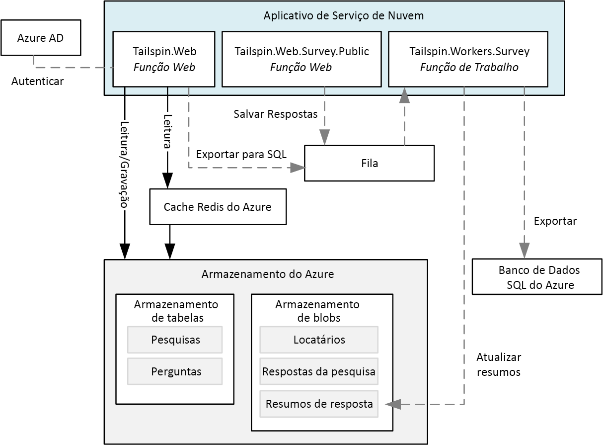
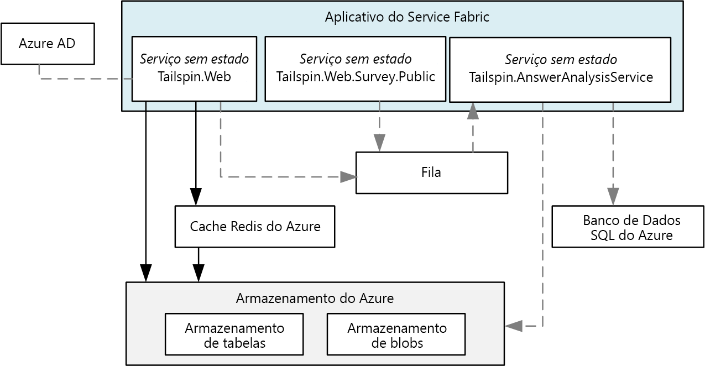
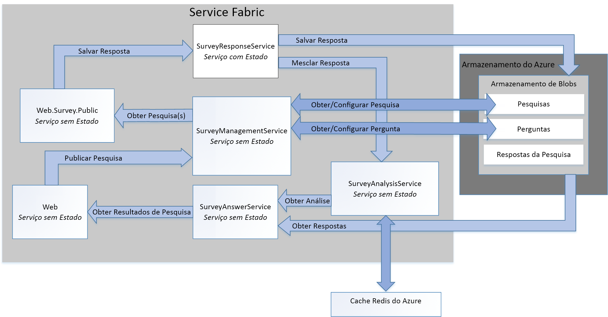

# <a name="refactor-an-azure-service-fabric-application-migrated-from-azure-cloud-services"></a>Refatorar um Aplicativo Azure Service Fabric migrado a partir dos Serviços de Nuvem do Azure

[Código de exemplo do ][sample-code]

Este artigo descreve a refatoração de um aplicativo do Azure Service Fabric existente para uma arquitetura mais granular. Este artigo foca nas considerações de design, empacotamento, desempenho e implantação do aplicativo refatorado do Service Fabric.

## <a name="scenario"></a>Cenário

Conforme discutido no artigo anterior, [Migrar um aplicativo dos Serviços de Nuvem do Azure para o Azure Service Fabric][migrate-from-cloud-services], a equipe de padrões e práticas criou um livro, em 2012, que documentou o processo para projetar e implementar um aplicativo dos Serviços de Nuvem no Azure. O livro descreve uma empresa fictícia chamada Tailspin que deseja criar um aplicativo dos Serviços de Nuvem chamado **Surveys**. O aplicativo Surveys permite que os usuários criem e publiquem pesquisas que podem ser respondidas pelo público. O diagrama a seguir mostra a arquitetura dessa versão do aplicativo Surveys:



A função Web **Tailspin.Web** hospeda um site ASP.NET MVC que os clientes da Tailspin usam para:
* inscrever-se no aplicativo Surveys,
* criar ou excluir uma pesquisa única,
* exibir resultados de uma pesquisa única,
* solicitar que os resultados dessa pesquisa sejam exportados para o SQL, e
* exibir resultados e análises de pesquisa agregados.

A função Web **Tailspin.Web.Survey.Public** também hospeda um site ASP.NET MVC onde o público visita para preencher as pesquisas. Essas respostas são colocadas em uma fila para serem salvas.

A função de trabalho **Tailspin.Workers.Survey** executa o processamento em segundo plano selecionando solicitações de várias filas.

Depois a equipe de padrões e práticas criou um novo projeto para compatibilizar esse aplicativo ao Azure Service Fabric. O objetivo desse projeto era fazer somente as alterações de código necessárias para pôr o aplicativo em execução em um cluster do Azure Service Fabric. Como resultado, as funções Web e de trabalho originais não foram decompostas em uma arquitetura mais granular. A arquitetura resultante é muito semelhante à versão do Serviço de Nuvem do aplicativo:



O serviço **Tailspin.Web** foi transferido da função Web original *Tailspin.Web*.

O serviço **Tailspin.Web.Survey.Public** foi tranferido da função Web original *Tailspin.Web.Survey.Public*.

O serviço **Tailspin.AnswerAnalysisService** foi transferido da função de trabalho original *Tailspin.Workers.Survey*.

> [!NOTE] 
> Embora as alterações mínimas de código tenham sido feitas em cada uma das funções Web e de trabalho, **Tailspin.Web** e **Tailspin.Web.Survey.Public** foram modificados para auto-hospedar um servidor Web do [Kestrel]. O aplicativo Surveys anterior é um aplicativo ASP.Net que foi hospedado usando os Serviços de Informação da Internet (IIS), mas não é possível executar o IIS como um serviço no Service Fabric. Portanto, qualquer servidor Web deve ser capaz de ser auto-hospedado, como o [Kestrel]. É possível executar o IIS em um contêiner no Service Fabric em algumas situações. Confira [Cenários para usar contêineres][container-scenarios] para obter mais informações.  

Agora, a Tailspin está refatorando o aplicativo Surveys para uma arquitetura mais granular. A motivação da Tailspin para refatorar é facilitar o desenvolvimento, a compilação e a implantação do aplicativo Surveys. Ao decompor as funções Web e de trabalho existentes para uma arquitetura mais granular, a Tailspin deseja remover as dependências de comunicação e dados firmemente acopladas existentes entre essas funções.

A Tailspin vê outros benefícios em passar o aplicativo Surveys para uma arquitetura mais granular:
* Cada serviço pode ser empacotado em projetos independentes com um escopo pequeno o suficiente para ser gerenciado por uma pequena equipe.
* Cada serviço pode ser implantado independentemente e ter seu próprio controle de versão.
* Cada serviço pode ser implementado usando a melhor tecnologia para o serviço. Por exemplo, um cluster do Service Fabric pode incluir serviços criados com diferentes versões do .Net Framework, Java ou outras linguagens, como C ou C++.
* Cada serviço pode ser dimensionado independentemente para responder a aumentos e diminuições de carga.

> [!NOTE] 
> A multilocação está fora do escopo da refatoração deste aplicativo. A Tailspin tem várias opções para dar suporte à multilocação e pode tomar essas decisões de design mais tarde sem afetar o design inicial. Por exemplo, a Tailspin pode criar instâncias separadas dos serviços para cada locatário em um cluster ou criar um cluster separado para cada locatário.

## <a name="design-considerations"></a>Considerações sobre o design
 
O diagrama a seguir mostra a arquitetura do aplicativo Surveys refatorado para uma arquitetura mais granular:



O **Tailspin.Web** é um serviço sem estado que auto-hospeda um aplicativo ASP.NET MVC que os clientes da Tailspin visitam para criar pesquisas e exibir resultados da pesquisa. Esse serviço compartilha a maior parte desse código com o serviço *Tailspin.Web* do aplicativo do Service Fabric transferido. Como mencionado anteriormente, esse serviço usa o ASP.NET Core e comutadores ao usar o Kestrel como front-end da Web para implementar um WebListener.

**Tailspin.Web.Survey.Public** é um serviço sem estado que também auto-hospeda um site ASP.NET MVC. Os usuários visitam esse site para selecionar pesquisas a partir de uma lista e, em seguida, preenchê-las. Esse serviço compartilha a maior parte do seu código com o serviço *Tailspin.Web.Survey.Public* do aplicativo do Service Fabric transferido. Esse serviço também usa o ASP.NET Core e comutadores ao usar o Kestrel como front-end da Web para implementar um WebListener.

O **Tailspin.SurveyResponseService** é um serviço com estado que armazena respostas de pesquisa no Armazenamento de Blobs do Azure. Ele também mescla respostas nos dados da análise de pesquisa. O serviço é implementado como um serviço com estado, pois usa um [ReliableConcurrentQueue][reliable-concurrent-queue] para processar respostas de pesquisa em lotes. Essa funcionalidade foi originalmente implementada no serviço *Tailspin.AnswerAnalysisService* no aplicativo Service Fabric portado.

O **Tailspin.SurveyManagementService** é um serviço sem estado que armazena e recupera pesquisas e perguntas de pesquisa. O serviço usa o armazenamento de Blobs do Azure. Essa funcionalidade também foi originalmente implementada nos componentes de acesso a dados dos serviços *Tailspin.Web* e *Tailspin.Web.Survey.Public* no aplicativo Service Fabric portado. A Tailspin refatorou a funcionalidade original nesse serviço para permitir que ela seja dimensionada de forma independente.

O **Tailspin.SurveyAnswerService** é um serviço sem estado que recupera respostas e análises de pesquisa. O serviço também usa o armazenamento de Blobs do Azure. Essa funcionalidade também foi originalmente implementada nos componentes de acesso a dados do serviço *Tailspin.Web* no aplicativo Service Fabric portado. A Tailspin refatorou a funcionalidade original nesse serviço porque espera menos carga e deseja usar menos instâncias para conservar recursos.

O **Tailspin.SurveyAnalysisService** é um serviço sem estado que persiste dados de resumo de resposta da pesquisa em um cache Redis para recuperação rápida. Esse serviço é chamado pelo *Tailspin.SurveyResponseService* sempre que uma pesquisa é respondida e os novos dados de resposta da pesquisa forem mesclados nos dados de resumo. Esse serviço inclui a funcionalidade originalmente implementada no serviço *Tailspin.AnswerAnalysisService* do aplicativo Service Fabric portado.

## <a name="stateless-versus-stateful-services"></a>Serviços com estado vs. serviços sem estado

O Azure Service Fabric oferece suporte aos modelos de programação a seguir:
* O modelo convidado executável permite que qualquer executável seja empacotado como um serviço e implantado a um cluster do Service Fabric. O Service Fabric orquestra e gerencia a execução do convidado executável.
* O modelo do contêiner permite a implantação de serviços em imagens de contêiner. O Service Fabric oferece suporte à criação e gerenciamento de contêineres sobre o kernel do Linux, bem como a contêineres do Windows Server. 
* O modelo de programação de serviços confiável permite a criação de serviços com ou sem estado que se integram com todos os recursos de plataforma do Service Fabric. Os serviços com estado permitem que estados replicados sejam armazenados no cluster do Service Fabric. Os serviços sem estado não permitem.
* O modelo confiável de programação de atores permite a criação de serviços que implementam o padrão de ator virtual.

Todos os serviços do aplicativo Surveys são serviços sem estado confiáveis, exceto para o serviço *Tailspin.SurveyResponseService*. Este serviço implementa um [ReliableConcurrentQueue][reliable-concurrent-queue] para processar respostas de pesquisa quando elas são recebidas. As respostas em ReliableConcurrentQueue são salvas no Armazenamento de Blobs do Azure e passadas para o *Tailspin.SurveyAnalysisService* para análise. O Tailspin escolhe uma ReliableConcurrentQueue porque as respostas não exigem uma ordenação estrita PEPS (primeiro a entrar, primeiro a sair) fornecida por uma fila como o Barramento de Serviço do Azure. Um ReliableConcurrentQueue também foi projetado para oferecer alta taxa de transferência e baixa latência para operações da fila e de remoção da fila.

Observe que as operações para persistir itens removidos da fila de um ReliableConcurrentQueue devem ser, idealmente, idempotentes. Se uma exceção for lançada durante o processamento de um item da fila, o mesmo item pode ser processado mais de uma vez. No aplicativo Surveys, a operação de mesclagem de respostas de pesquisa para o *Tailspin.SurveyAnalysisService* não é idempotente, isso porque a Tailspin decidiu que os dados de análise de pesquisa são apenas um instantâneo atual dos dados de análise e não precisam ser consistentes. As respostas de pesquisa salvas no Armazenamento de Blobs do Azure são eventualmente consistentes. Assim, a análise de pesquisa final sempre pode ser recalculada corretamente a partir desses dados.

## <a name="communication-framework"></a>Estrutura de comunicação

Cada serviço do aplicativo Surveys se comunica usando uma API RESTful Web. As APIs RESTful oferecem os seguintes benefícios:
* Facilidade de uso: cada serviço é criado usando o ASP.Net Core MVC, que oferece suporte nativo à criação de APIs Web.
* Segurança: embora não sejam todos os serviços que exijam o protocolo SSL, a Tailspin pode exigir que todos os serviços façam isso. 
* Controle de versão: os clientes podem ser gravados e testados em relação a uma versão específica de uma API Web.

Os serviços do aplicativo Surveys fazem uso do [proxy reverso][reverse-proxy] implementado pelo Service Fabric. O proxy reverso é um serviço executado em cada nó do cluster do Service Fabric e fornece resolução do ponto de extremidade e repetição automática e lida com outros tipos de falhas de conexão. Para usar o proxy reverso, cada chamada de API RESTful a um serviço específico é feita usando uma porta de proxy reverso predefinida.  Por exemplo, se a porta de proxy reverso foi definida como **19081**, uma chamada ao *Tailspin.SurveyAnswerService* pode ser feita da seguinte maneira:

```csharp
static SurveyAnswerService()
{
    httpClient = new HttpClient
    {
        BaseAddress = new Uri("http://localhost:19081/Tailspin/SurveyAnswerService/")
    };
}
```
Para habilitar o proxy reverso, especifique uma porta de proxy reverso durante a criação do cluster do Service Fabric. Para obter mais informações, confira [proxy reverso][reverse-proxy] no Azure Service Fabric.

## <a name="performance-considerations"></a>Considerações sobre o desempenho

A Tailspin criou os serviços do ASP.NET Core para o *Tailspin.Web* e o *Tailspin.Web.Surveys.Public* usando modelos do Visual Studio. Por padrão, esses modelos incluem o registro de log para o console. O registro de log para o console pode ser feito durante o desenvolvimento e a depuração, mas todos os registros de log para o console devem ser removidos quando o aplicativo for implantado para produção.

> [!NOTE]
> Para obter mais informações sobre como configurar o monitoramento e os diagnósticos para aplicativos do Service Fabric em execução na produção, confira [monitoramento e diagnóstico][monitoring-diagnostics] para o Azure Service Fabric.

Por exemplo, as linhas a seguir no *startup.cs* para cada serviço de front-end Web devem ser comentadas:

```csharp
// This method gets called by the runtime. Use this method to configure the HTTP request pipeline.
public void Configure(IApplicationBuilder app, IHostingEnvironment env, ILoggerFactory loggerFactory)
{
    //loggerFactory.AddConsole(Configuration.GetSection("Logging"));
    //loggerFactory.AddDebug();

    app.UseMvc();
}
```

> [!NOTE]
> Essas linhas podem ser excluídas condicionalmente quando o Visual Studio estiver definido como “versão” ao ser publicado.

Finalmente, quando a Tailspin implantar seu aplicativo para produção, o Visual Studio será alternado para o modo **versão**.

## <a name="deployment-considerations"></a>Considerações de implantação

O aplicativo Surveys refatorado é composto por cinco serviços sem estado e um serviço com estado para que o planejamento de cluster seja limitado à definição do tamanho correto de VM e do número de nós. No arquivo *applicationmanifest.xml* que descreve o cluster, a Tailspin define o atributo *InstanceCount* da marca *StatelessService* como -1 para cada um dos serviços. Um valor de -1 direciona o Service Fabric para criar uma instância do serviço em cada nó no cluster.

> [!NOTE]
> Os serviços com estado exigem a etapa adicional de planejamento do número correto de partições e réplicas de seus dados.

A Tailspin implanta o cluster usando o Portal do Azure. O tipo de recurso de Cluster do Service Fabric implanta todos as infraestruturas necessárias, incluindo conjuntos de dimensionamento de VMs e um balanceador de carga. Os tamanhos de VM recomendados são exibidos no portal do Azure durante o processo de provisionamento do cluster do Service Fabric. Observe que, como as VMs são implantadas em um conjunto de dimensionamento de VM, elas podem ser dimensionadas vertical e horizontalmente à medida que o usuário aumenta a carga.

> [!NOTE]
> Conforme discutido anteriormente, na versão migrada do aplicativo Surveys, os dois front-ends da Web foram auto-hospedados usando o ASP.Net Core e o Kestrel como um servidor Web. Embora a versão migrada do aplicativo Surveys não use um proxy reverso, é altamente recomendável usar um proxy reverso como IIS, Nginx ou Apache. Para obter mais informações, confira [introdução à implementação do servidor Web Kestrel no ASP.NET Core][kestrel-intro].
> No aplicativo Surveys refatorado, os dois front-ends da Web são auto-hospedados usando o ASP.Net Core com [WebListener][weblistener] como um servidor Web, para que um proxy reverso não seja necessário.

## <a name="next-steps"></a>Próximas etapas

O código do aplicativo Surveys está disponível no [GitHub][sample-code].

Se você está apenas começando a usar o [Azure Service Fabric][service-fabric], primeiro configure seu ambiente de desenvolvimento, depois baixe a versão mais recente do [SDK do Azure][azure-sdk] e [SDK do Azure Service Fabric][service-fabric-sdk]. O SDK inclui o gerenciador de cluster OneBox para que você possa implantar e testar o aplicativo Surveys localmente com depuração F5 completa.

<!-- links -->
[azure-sdk]: https://azure.microsoft.com/downloads/archive-net-downloads/
[container-scenarios]: /azure/service-fabric/service-fabric-containers-overview
[kestrel]: https://docs.microsoft.com/aspnet/core/fundamentals/servers/kestrel?tabs=aspnetcore2x
[kestrel-intro]: https://docs.microsoft.com/aspnet/core/fundamentals/servers/kestrel?tabs=aspnetcore1x
[migrate-from-cloud-services]: migrate-from-cloud-services.md
[monitoring-diagnostics]: /azure/service-fabric/service-fabric-diagnostics-overview
[reliable-concurrent-queue]: /azure/service-fabric/service-fabric-reliable-services-reliable-concurrent-queue
[reverse-proxy]: /azure/service-fabric/service-fabric-reverseproxy
[sample-code]: https://github.com/mspnp/cloud-services-to-service-fabric/tree/master/servicefabric-phase-2
[service-fabric]: /azure/service-fabric/service-fabric-get-started
[service-fabric-sdk]: /azure/service-fabric/service-fabric-get-started
[weblistener]: https://docs.microsoft.com/aspnet/core/fundamentals/servers/weblistener
