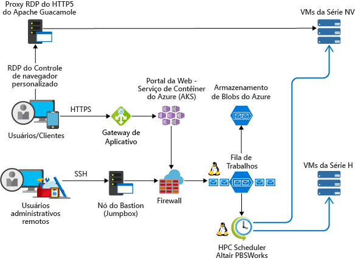

<!-- markdownlint-disable MD033 -->
<!-- markdownlint-disable MD026 -->

# HPC (Computação de alto desempenho) no Azure

## Introdução à HPC

<!-- markdownlint-disable MD034 -->

> [!VIDEO https://www.youtube.com/embed/rKURT32faJk]

<!-- markdownlint-enable MD034 -->

A HPC (Computação de alto desempenho), também chamada de “Computação intensa”, usa um grande número de computadores baseados em CPU ou GPU para solucionar tarefas matemáticas complexas.

Vários setores usam a HPC para solucionar alguns de seus problemas mais difíceis.  Esses problemas incluem cargas de trabalho como:

- Genomics
- Simulações de petróleo e gás
- Finanças
- Design de semicondutores
- Engenharia
- Modelagem climática

### Qual a diferença entre a HPC e a nuvem?

Uma das principais diferenças entre o sistema de HPC local e um na nuvem é a capacidade de adicionar e remover recursos dinamicamente, conforme necessário.  O escalonamento dinâmico remove o gargalo da capacidade de computação e permite que os clientes dimensionem corretamente a infraestrutura, de acordo com os requisitos de seus trabalhos.

Os artigos a seguir fornecem mais detalhes sobre essa funcionalidade de dimensionamento dinâmico.

- [Estilo de arquitetura de computação intensa](/azure/architecture/guide/architecture-styles/big-compute?context=/azure/architecture/topics/high-performance-computing/context/hpc-context)
- [Práticas recomendadas de dimensionamento automático](/azure/architecture/best-practices/auto-scaling?context=/azure/architecture/topics/high-performance-computing/context/hpc-context)

## Lista de verificação de implementação

Se for implementar sua própria solução de HPC no Azure, consulte os seguintes tópicos:

<!-- markdownlint-disable MD032 -->

> [!div class="checklist"]
> - Escolher a [arquitetura](#infrastructure) apropriada com base nos requisitos
> - Saber quais opções de [computação](#compute) são as ideais para sua carga de trabalho
> - Identificar a solução de [armazenamento](#storage) ideal que atenda às suas necessidades
> - Decidir como [gerenciará](#management) todos os seus recursos
> - Otimizar seu [aplicativo](#hpc-applications) para a nuvem
> - [Proteger](#security) sua infraestrutura

<!-- markdownlint-enable MD032 -->

## Infraestrutura

São necessários alguns componentes de infraestrutura para compilar um sistema de HPC.  Computação, armazenamento e rede são os componentes básicos, independentemente de como escolha gerenciar as cargas de trabalho da HPC.

### Exemplo de arquiteturas de HPC

São várias as maneiras de projetar e implementar a arquitetura de HPC no Azure.  Os aplicativos de HPC podem dimensionar até milhares de núcleos de computação, estender clusters locais ou executar solução nativa 100% em nuvem.

Os cenários a seguir descrevem algumas maneiras comuns de compilação das soluções de HPC.

<ul class="columns is-multiline has-margin-left-none has-margin-bottom-none has-padding-top-medium">
    <li class="column is-one-third has-padding-top-small-mobile has-padding-bottom-small">
        <a class="is-undecorated is-full-height is-block"
            href="/azure/architecture/example-scenario/apps/hpc-saas?context=/azure/architecture/topics/high-performance-computing/context/hpc-context">
            <article class="card has-outline-hover is-relative is-fullheight">
                    <figure class="image has-margin-right-none has-margin-left-none has-margin-top-none has-margin-bottom-none">
                        
                    </figure>
                

                    

                        <h3 class="is-size-4 has-margin-top-none has-margin-bottom-none has-text-primary">Serviços de engenharia auxiliados por computador no Azure</h3>
                    

                    

                        
Fornece uma plataforma de software como um serviço (SaaS) para a engenharia auxiliada por computador (CAE) no Azure.

                    

                

            </article>
        </a>
    </li>
    <li class="column is-one-third has-padding-top-small-mobile has-padding-bottom-small">
        <a class="is-undecorated is-full-height is-block"
            href="/azure/architecture/example-scenario/infrastructure/hpc-cfd?context=/azure/architecture/topics/high-performance-computing/context/hpc-context">
            <article class="card has-outline-hover is-relative is-fullheight">
                    <figure class="image has-margin-right-none has-margin-left-none has-margin-top-none has-margin-bottom-none">
                        
                    </figure>
                

                    

                        <h3 class="is-size-4 has-margin-top-none has-margin-bottom-none has-text-primary">CFD (Simulações de fluidodinâmica computacional) no Azure</h3>
                    

                    

                        
Execute a dinâmica dos fluidos computacional (CFD) no Azure.

                    

                

            </article>
        </a>
    </li>
    <li class="column is-one-third has-padding-top-small-mobile has-padding-bottom-small">
        <a class="is-undecorated is-full-height is-block"
            href="/azure/architecture/example-scenario/infrastructure/video-rendering?context=/azure/architecture/topics/high-performance-computing/context/hpc-context">
            <article class="card has-outline-hover is-relative is-fullheight">
                    <figure class="image has-margin-right-none has-margin-left-none has-margin-top-none has-margin-bottom-none">
                        
                    </figure>
                

                    

                        <h3 class="is-size-4 has-margin-top-none has-margin-bottom-none has-text-primary">Renderização de vídeo em 3D no Azure</h3>
                    

                    

                        
Executar cargas de trabalho de HPC nativas no Azure usando o serviço de Lote do Azure

                    

                

            </article>
        </a>
    </li>
</ul>

### Computação

O Azure oferece uma variedade de tamanhos otimizados para cargas de trabalho com uso intensivo de CPU e GPU.

#### Máquinas virtuais baseadas em CPU

- [VMs do Linux](/azure/virtual-machines/linux/sizes-hpc?context=/azure/architecture/topics/high-performance-computing/context/hpc-context)
- VMs das [VMs do Windows](/azure/virtual-machines/windows/sizes-hpc?context=/azure/architecture/topics/high-performance-computing/context/hpc-context)
  
#### Máquinas virtuais habilitadas para GPU

As VMs da série N têm GPUs NVIDIA projetados para uso de computação intensa ou gráficos intensivos, incluindo visualização e aprendizagem de IA (inteligência artificial).

- [VMs do Linux](/azure/virtual-machines/linux/sizes-gpu?context=/azure/architecture/topics/high-performance-computing/context/hpc-context)
- [VMs do Windows](/azure/virtual-machines/windows/sizes-gpu?context=/azure/architecture/topics/high-performance-computing/context/hpc-context)

### Armazenamento

Cargas de trabalho do Lote e de HPC em larga escala têm exigências de armazenamento e acesso a dados que excedem os recursos de sistemas de arquivos em nuvem tradicionais.  Existem algumas soluções para gerenciar as necessidades de velocidade e capacidade dos aplicativos de HPC no Azure

- [Avere vFXT](https://azure.microsoft.com/services/storage/avere-vfxt/), para armazenamento de dados mais rápido e acessível para computação de alto desempenho na borda
- [BeeGFS](https://azure.microsoft.com/resources/implement-glusterfs-on-azure/)
- [Máquinas virtuais otimizadas para armazenamento](/azure/virtual-machines/windows/sizes-storage?context=/azure/architecture/topics/high-performance-computing/context/hpc-context)
- [Armazenamento de blobs, tabelas e filas](/azure/storage/storage-introduction?context=/azure/architecture/topics/high-performance-computing/context/hpc-context)
- [Armazenamento de arquivos SMB do Azure](/azure/storage/files/storage-files-introduction?context=/azure/architecture/topics/high-performance-computing/context/hpc-context)
- [Intel Cloud Edition Lustre](https://azuremarketplace.microsoft.com/marketplace/apps/intel.intel-cloud-edition-gs)

Para obter mais informações sobre a comparação de Lustre, GlusterFS e BeeGFS no Azure, consulte o [livro eletrônico sobre Sistemas de arquivos paralelos no Azure](https://blogs.msdn.microsoft.com/azurecat/2018/06/11/azurecat-ebook-parallel-virtual-file-systems-on-microsoft-azure/).

### Rede

VMs H16r, H16mr, A8 e A9 podem se conectar a uma rede RDMA de back-end de alta taxa de transferência. Essa rede pode melhorar o desempenho de aplicativos paralelos firmemente acoplados em execução no Microsoft MPI ou no Intel MPI.

- [Instâncias compatíveis com RDMA](/azure/virtual-machines/windows/sizes-hpc?context=/azure/architecture/topics/high-performance-computing/context/hpc-context#rdma-capable-instances)
- [Rede Virtual](/azure/virtual-network/virtual-networks-overview?context=/azure/architecture/topics/high-performance-computing/context/hpc-context)
- [ExpressRoute](/azure/expressroute/expressroute-introduction?context=/azure/architecture/topics/high-performance-computing/context/hpc-context)

## Gerenciamento

### Faça você mesmo

Compilar um sistema HPC do zero no Azure oferece uma quantidade significativa de flexibilidade mas, normalmente, exige muita manutenção.  

1. Configurar seu próprio ambiente de cluster em máquinas virtuais do Azure ou [conjuntos de escala de máquina virtual](/azure/virtual-machine-scale-sets/overview?context=/azure/architecture/topics/high-performance-computing/context/hpc-context).
2. Use modelos do Azure Resource Manager para implantar [gerenciadores de carga de trabalho](#workload-managers), infraestrutura, e [aplicativos](#hpc-applications) iniciais.
3. Escolha [tamanhos de VM de GPU e HPC](#hpc-and-gpu-sizes) que incluem conexões de rede e de hardware especializados para cargas de trabalho MPI ou GPU.
4. Adicione [armazenamento de alto desempenho](#hpc-storage) para cargas de trabalho com E/S alta.

### Intermitência híbrida e de nuvem

Se você tem um sistema HPC local que deseja conectar ao Azure, há vários recursos para ajudá-lo a começar.

Primeiramente, leia o artigo [Opções de conexão de uma rede local ao Azure](/azure/architecture/reference-architectures/hybrid-networking/?context=/azure/architecture/topics/high-performance-computing/context/hpc-context), na documentação.  A partir daí, talvez seja conveniente obter informações sobre estas opções de conectividade:

<ul class="columns is-multiline has-margin-left-none has-margin-bottom-none has-padding-top-medium">
    <li class="column is-one-third has-padding-top-small-mobile has-padding-bottom-small">
        <a class="is-undecorated is-full-height is-block"
            href="/azure/architecture/reference-architectures/hybrid-networking/vpn?context=/azure/architecture/topics/high-performance-computing/context/hpc-context">
            <article class="card has-outline-hover is-relative is-fullheight">
                    <figure class="image has-margin-right-none has-margin-left-none has-margin-top-none has-margin-bottom-none">
                        
                    </figure>
                

                    

                        <h3 class="is-size-4 has-margin-top-none has-margin-bottom-none has-text-primary">Conectar uma rede local ao Azure usando um Gateway de VPN</h3>
                    

                    

                        
Essa arquitetura de referência mostra como estender uma rede local para o Azure, usando uma VPN (rede virtual privada) site a site.

                    

                

            </article>
        </a>
    </li>
    <li class="column is-one-third has-padding-top-small-mobile has-padding-bottom-small">
        <a class="is-undecorated is-full-height is-block"
            href="/azure/architecture/reference-architectures/hybrid-networking/expressroute?context=/azure/architecture/topics/high-performance-computing/context/hpc-context">
            <article class="card has-outline-hover is-relative is-fullheight">
                    <figure class="image has-margin-right-none has-margin-left-none has-margin-top-none has-margin-bottom-none">
                        
                    </figure>
                

                    

                        <h3 class="is-size-4 has-margin-top-none has-margin-bottom-none has-text-primary">Conectar uma rede local ao Azure usando o ExpressRoute</h3>
                    

                    

                        
Conexões do ExpressRoute usam uma conexão privada dedicada por meio de um provedor de conectividade de terceiros. A conexão privada estende sua rede local para o Azure.

                    

                

            </article>
        </a>
    </li>
    <li class="column is-one-third has-padding-top-small-mobile has-padding-bottom-small">
        <a class="is-undecorated is-full-height is-block"
            href="/azure/architecture/reference-architectures/hybrid-networking/expressroute-vpn-failover?context=/azure/architecture/topics/high-performance-computing/context/hpc-context">
            <article class="card has-outline-hover is-relative is-fullheight">
                    <figure class="image has-margin-right-none has-margin-left-none has-margin-top-none has-margin-bottom-none">
                        
                    </figure>
                

                    

                        <h3 class="is-size-4 has-margin-top-none has-margin-bottom-none has-text-primary">Conectar uma rede local ao Azure usando o ExpressRoute com failover de VPN</h3>
                    

                    

                        
Implemente uma arquitetura de rede site a site segura e altamente disponível que abranja uma rede virtual do Azure e uma rede local conectada usando o ExpressRoute com failover de gateway VPN.

                    

                

            </article>
        </a>
    </li>
</ul>

Quando a conectividade de rede é estabelecida com segurança, você pode começar a usar os recursos de computação na nuvem sob demanda com as funcionalidades de intermitência do seu atual [gerenciador de carga de trabalho](#workload-manager).

### Soluções do Marketplace

O [Azure Marketplace](https://azuremarketplace.microsoft.com/marketplace/) oferece alguns gerenciadores de carga de trabalho.

- [HPC baseada em CentOS RogueWave](https://azuremarketplace.microsoft.com/marketplace/apps/RogueWave.CentOSbased73HPC?tab=Overview)
- [SUSE Linux Enterprise Server para HPC](https://azure.microsoft.com/marketplace/partners/suse/suselinuxenterpriseserver12optimizedforhighperformancecompute/)
- [Mecanismo de servidor de grade TIBCO](https://azuremarketplace.microsoft.com/marketplace/apps/tibco-software.gridserverlinuxengine?tab=Overview)
- [VM de Ciência de Dados do Azure para Windows e Linux](/azure/machine-learning/data-science-virtual-machine/overview?context=/azure/architecture/topics/high-performance-computing/context/hpc-context)
- [D3View](https://azuremarketplace.microsoft.com/marketplace/apps/xfinityinc.d3view-v5?tab=Overview)
- [UberCloud](https://azure.microsoft.com/search/marketplace/?q=ubercloud)

### Lote do Azure

O [Lote do Azure](/azure/batch/batch-technical-overview?context=/azure/architecture/topics/high-performance-computing/context/hpc-context) é um serviço de plataforma para execução de aplicativos paralelos em grande escala e aplicativos HPC (computação de alto desempenho) com eficiência na nuvem. O Lote do Azure agenda o trabalho de computação intensiva para execução em um pool gerenciado de máquinas virtuais e pode dimensionar automaticamente os recursos de computação para atender às necessidades de seus trabalhos.

Os provedores ou desenvolvedores SaaS podem usar os SDKs e as ferramentas do Lote para integrar aplicativos ou cargas de trabalho de contêiner de HPC ao Azure, transferir dados para o Azure e criar pipelines de execução do trabalho.

### Azure CycleCloud

[Azure CycleCloud](/azure/cyclecloud/?context=/azure/architecture/topics/high-performance-computing/context/hpc-context) Fornece a maneira mais fácil de gerenciar cargas de trabalho de HPC usando qualquer agendador (como Slurm, Grid Engine, HPC Pack, HTCondor, LSF, PBS Pro ou Symphony), no Azure

CycleCloud permite que você:

- Implante clusters completos e outros recursos, incluindo agendador, VMs de computação, armazenamento, rede e cache.
- Organize fluxos de trabalho de dados, de nuvem e de tarefas.
- Dê aos administradores controle total sobre quais usuários podem executar trabalhos, onde podem fazer isso e a que custo.
- Personalize e otimize clusters por meio de recursos avançados de política e governança, incluindo controles de custo, integração ao Active Directory, monitoramento e relatórios.
- Use seus aplicativos e o agendador de trabalhos atuais sem modificação.
- Aproveite as arquiteturas de referência rigorosamente testadas e o dimensionamento automático interno para uma ampla variedade de setores e cargas de trabalho de HPC.

### Gerenciadores de carga de trabalho

A seguir, os exemplos de gerenciadores de cluster e de carga de trabalho que podem ser executados na infraestrutura do Azure. Crie clusters autônomos em VMs do Azure ou se espalhe para máquinas virtuais do Azure de um cluster local.

- [Alces Flight Compute](https://azuremarketplace.microsoft.com/marketplace/apps/alces-flight-limited.alces-flight-compute-solo?tab=Overview)
- [TIBCO DataSynapse GridServer](https://azure.microsoft.com/blog/tibco-datasynapse-comes-to-the-azure-marketplace/)
- [Bright Cluster Manager](http://www.brightcomputing.com/technology-partners/microsoft)
- [IBM Spectrum Symphony e Symphony LSF](https://azure.microsoft.com/blog/ibm-and-microsoft-azure-support-spectrum-symphony-and-spectrum-lsf/)
- [PBS Pro](http://pbspro.org)
- [Altair](http://www.altair.com/)
- [Rescale](https://www.rescale.com/azure/)
- [Pacote de HPC da Microsoft](https://technet.microsoft.com/library/mt744885.aspx)
  - [Pacote de HPC para Windows](/azure/virtual-machines/windows/hpcpack-cluster-options?context=/azure/architecture/topics/high-performance-computing/context/hpc-context)
  - [Pacote de HPC para Linux](/azure/virtual-machines/linux/hpcpack-cluster-options?context=/azure/architecture/topics/high-performance-computing/context/hpc-context)

#### Contêineres

Contêineres também podem ser usados para gerenciar algumas cargas de trabalho de HPC.  Serviços como o AKS (Serviço de Kubernetes do Azure) simplificam a implantação de um cluster do Kubernetes gerenciado no Azure.

- [AKS (Serviço de Kubernetes do Azure)](/azure/aks/intro-kubernetes?context=/azure/architecture/topics/high-performance-computing/context/hpc-context)
- [Registro de Contêiner](/azure/container-registry/container-registry-intro?context=/azure/architecture/topics/high-performance-computing/context/hpc-context)

## Gerenciamento de custo

O gerenciamento de custo da HPC no Azure pode ser feito de várias maneiras.  Procure ler as [Opções de compra do Azure](https://azure.microsoft.com/pricing/purchase-options/) para encontrar o método ideal para sua organização.

[VMs de baixa prioridade](/azure/virtual-machine-scale-sets/virtual-machine-scale-sets-use-low-priority?context=/azure/architecture/topics/high-performance-computing/context/hpc-context) permitem aproveitar nossa capacidade não utilizada, gerando uma economia significativa.

## Segurança

Para obter uma visão geral das práticas recomendadas de segurança no Azure, leia a [documentação de segurança do Azure](/azure/security/azure-security?context=/azure/architecture/topics/high-performance-computing/context/hpc-context).  

Além das configurações de rede disponíveis na seção [Intermitência da nuvem](#hybrid-and-cloud-bursting), talvez seja conveniente implementar uma configuração de hub/spoke para isolar seus recursos de computação:

<ul class="columns is-multiline has-margin-left-none has-margin-bottom-none has-padding-top-medium">
    <li class="column is-one-third has-padding-top-small-mobile has-padding-bottom-small">
        <a class="is-undecorated is-full-height is-block"
            href="/azure/architecture/reference-architectures/hybrid-networking/hub-spoke?context=/azure/architecture/topics/high-performance-computing/context/hpc-context">
            <article class="card has-outline-hover is-relative is-fullheight">
                    <figure class="image has-margin-right-none has-margin-left-none has-margin-top-none has-margin-bottom-none">
                        
                    </figure>
                

                    

                        <h3 class="is-size-4 has-margin-top-none has-margin-bottom-none has-text-primary">Implementar uma topologia de rede hub-spoke no Azure</h3>
                    

                    

                        
O hub é uma VNet (rede virtual) no Azure que atua como ponto central de conectividade para sua rede local. Os raios são VNets que ponto a ponto com o hub e pode ser usado para isolar as cargas de trabalho.

                    

                

            </article>
        </a>
    </li>
    <li class="column is-one-third has-padding-top-small-mobile has-padding-bottom-small">
        <a class="is-undecorated is-full-height is-block"
            href="/azure/architecture/reference-architectures/hybrid-networking/shared-services?context=/azure/architecture/topics/high-performance-computing/context/hpc-context">
            <article class="card has-outline-hover is-relative is-fullheight">
                    <figure class="image has-margin-right-none has-margin-left-none has-margin-top-none has-margin-bottom-none">
                        
                    </figure>
                

                    

                        <h3 class="is-size-4 has-margin-top-none has-margin-bottom-none has-text-primary">Implementar uma topologia de rede hub-spoke com serviços compartilhados no Azure</h3>
                    

                    

                        
Essa arquitetura de referência se baseia na arquitetura de referência hub-spoke para incluir serviços compartilhados no hub que possam ser consumidos por todos os spokes.

                    

                

            </article>
        </a>
    </li>
</ul>

## Aplicativos de HPC

Execute aplicativos de HPC comerciais ou personalizados no Azure. Vários exemplos desta seção são submetidos a benchmark para dimensionar com eficiência em caso de VMs ou núcleos de computação adicionais. Visite o [Azure Marketplace](https://azuremarketplace.microsoft.com/marketplace) para obter soluções prontas para uso.

> [!NOTE]
> Verifique com o fornecedor de qualquer aplicativo comercial quanto ao licenciamento ou outras restrições de execução na nuvem. Nem todos os fornecedores oferecem licenciamento pré-pago. Você talvez precise de um servidor de licenciamento na nuvem para sua solução, ou de uma conexão com um servidor de licença local.

### Aplicativos de engenharia

- [Altair RADIOSS](https://azure.microsoft.com/blog/availability-of-altair-radioss-rdma-on-microsoft-azure/)
- [ANSYS CFD](https://azure.microsoft.com/blog/ansys-cfd-and-microsoft-azure-perform-the-best-hpc-scalability-in-the-cloud/)
- [MATLAB Distributed Computing Server](/azure/virtual-machines/windows/matlab-mdcs-cluster?context=/azure/architecture/topics/high-performance-computing/context/hpc-context)
- [StarCCM +](https://blogs.msdn.microsoft.com/azurecat/2017/07/07/run-star-ccm-in-an-azure-hpc-cluster/)
- [OpenFOAM](https://simulation.azure.com/casestudies/Team-182-ABB-UC-Final.pdf)

### Gráficos e renderização

- [Autodesk Maya, 3ds Max e Arnold](/azure/batch/batch-rendering-service?context=/azure/architecture/topics/high-performance-computing/context/hpc-context) no Lote do Azure

### IA e deep learning

- [Microsoft Cognitive Toolkit](/cognitive-toolkit/cntk-on-azure)
- [VM de deep learning](https://azuremarketplace.microsoft.com/marketplace/apps/microsoft-ads.dsvm-deep-learning)
- [Receitas do Shipyard do Lote para deep learning](https://github.com/Azure/batch-shipyard/tree/master/recipes#deeplearning)

### Provedores de MPI

- [Microsoft MPI](/message-passing-interface/microsoft-mpi)

## Visualização remota

<ul class="columns is-multiline has-margin-left-none has-margin-bottom-none has-padding-top-medium">
    <li class="column is-one-third has-padding-top-small-mobile has-padding-bottom-small">
        <a class="is-undecorated is-full-height is-block"
            href="/azure/architecture/example-scenario/infrastructure/linux-vdi-citrix?context=/azure/architecture/topics/high-performance-computing/context/hpc-context">
            <article class="card has-outline-hover is-relative is-fullheight">
                    <figure class="image has-margin-right-none has-margin-left-none has-margin-top-none has-margin-bottom-none">
                        
                    </figure>
                

                    

                        <h3 class="is-size-4 has-margin-top-none has-margin-bottom-none has-text-primary">Áreas de trabalho virtuais do Linux com o Citrix</h3>
                    

                    

                        
Crie um ambiente de VDI para áreas de trabalho do Linux usando o Citrix no Azure.

                    

                

            </article>
        </a>
    </li>
</ul>

## Parâmetros de comparação de desempenho

- [Parâmetros de comparação de computação](/azure/virtual-machines/windows/compute-benchmark-scores?context=/azure/architecture/topics/high-performance-computing/context/hpc-context)

## Relatos de clientes

Alguns clientes obtiveram muito sucesso usando o Azure nas próprias cargas de trabalho de HPC.  Veja alguns desses clientes nos estudos de caso a seguir:

- [ANEO](https://customers.microsoft.com/story/it-provider-finds-highly-scalable-cloud-based-hpc-redu)
- [AXA Global P&C](https://customers.microsoft.com/story/axa-global-p-and-c)
- [Axioma](https://customers.microsoft.com/story/axioma-delivers-fintechs-first-born-in-the-cloud-multi-asset-class-enterprise-risk-solution)
- [d3View](https://customers.microsoft.com/story/big-data-solution-provider-adopts-new-cloud-gains-thou)
- [EFS](https://customers.microsoft.com/story/efs-professionalservices-azure)
- [Hymans Robertson](https://customers.microsoft.com/story/hymans-robertson)
- [MetLife](https://enterprise.microsoft.com/customer-story/industries/insurance/metlife/)
- [Microsoft Research](https://customers.microsoft.com/doclink/fast-lmm-and-windows-azure-put-genetics-research-on-fa)
- [Milliman](https://customers.microsoft.com/story/actuarial-firm-works-to-transform-insurance-industry-w)
- [Mitsubishi UFJ Securities International](https://customers.microsoft.com/story/powering-risk-compute-grids-in-the-cloud)
- [NeuroInitiative](https://customers.microsoft.com/story/neuroinitiative-health-provider-azure)
- [Schlumberger](https://azure.microsoft.com/blog/big-compute-for-large-engineering-simulations)
- [Towers Watson](https://customers.microsoft.com/story/insurance-tech-provider-delivers-disruptive-solutions)

## Outras informações importantes

- Verifique se a sua [cota de vCPU](/azure/virtual-machines/linux/quotas?context=/azure/architecture/topics/high-performance-computing/context/hpc-context) foi aumentada antes de tentar executar cargas de trabalho de grande escala.

## Próximas etapas

Para obter os anúncios mais recentes, confira:

- [Blog da equipe do Microsoft HPC e do Lote](http://blogs.technet.com/b/windowshpc/)
- Visite o [Blog do Azure](https://azure.microsoft.com/blog/tag/hpc/).

### Exemplos de Lote do Microsoft

Estes tutoriais fornecerão detalhes sobre como executar aplicativos no Microsoft Lote

- [Introdução ao desenvolvimento com o Lote](/azure/batch/quick-run-dotnet?context=/azure/architecture/topics/high-performance-computing/context/hpc-context)
- [Usar exemplos de código do Lote do Azure](https://github.com/Azure/azure-batch-samples)
- [Usar VMs de baixa prioridade com o Lote](/azure/batch/batch-low-pri-vms?context=/azure/architecture/topics/high-performance-computing/context/hpc-context)
- [Executar cargas de trabalho de HPC em contêineres com Shipyard do Lote](https://github.com/Azure/batch-shipyard)
- [Executar cargas de trabalho paralelas R em lote](https://github.com/Azure/doAzureParallel)
- [Executar trabalhos Spark sob demanda no Lote](https://github.com/Azure/aztk)
- [Usar VMs de computação intensa em pools do Lote](/azure/batch/batch-pool-compute-intensive-sizes?context=/azure/architecture/topics/high-performance-computing/context/hpc-context)